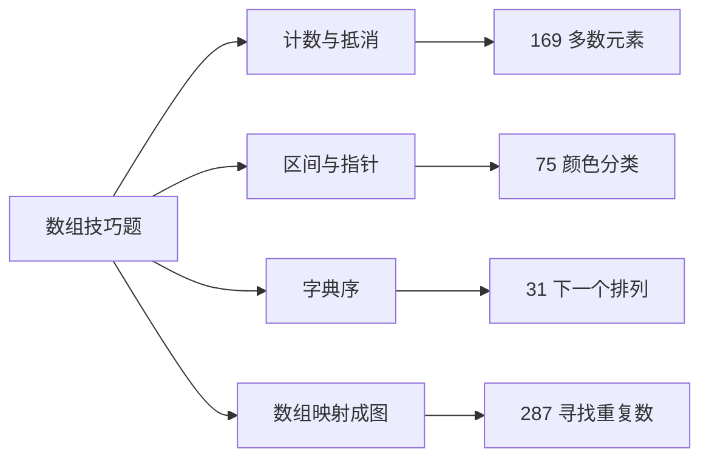
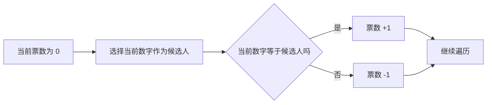
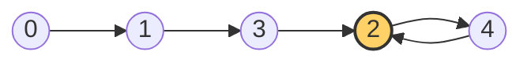

# 数组与技巧题：169、75、31、287

> 本文整理 4 道典型数组题：
>
> - **169. 多数元素**：哈希计数、Boyer–Moore 投票
> - **75. 颜色分类**：计数覆盖、荷兰国旗三指针
> - **31. 下一个排列**：转折点、交换、反转后缀
> - **287. 寻找重复数**：数组映射成链表、Floyd 快慢指针
>
> 重点不是只记代码，而是弄清楚：**为什么这样做、循环维护了什么、哪些地方最容易写错。**

---

## 目录

- [一、169. 多数元素](#一169-多数元素)
- [二、75. 颜色分类](#二75-颜色分类)
- [三、31. 下一个排列](#三31-下一个排列)
- [四、287. 寻找重复数](#四287-寻找重复数)
- [五、四道题对比与速记](#五四道题对比与速记)

---

## 总览

| 题目 | 推荐算法 | 时间复杂度 | 额外空间复杂度 | 核心关键词 |
|---|---|---:|---:|---|
| 169. 多数元素 | Boyer–Moore 投票 | `O(n)` | `O(1)` | 不同元素两两抵消 |
| 75. 颜色分类 | 荷兰国旗三指针 | `O(n)` | `O(1)` | 左边放 0，右边放 2 |
| 31. 下一个排列 | 转折点 + 交换 + 反转 | `O(n)` | `O(1)` | 尽量从右边做最小增大 |
| 287. 寻找重复数 | Floyd 快慢指针 | `O(n)` | `O(1)` | 重复数字就是环入口 |



---

# 一、169. 多数元素

## 1. 题意

给定长度为 `n` 的数组，返回出现次数**严格大于** `⌊n / 2⌋` 的元素。

题目保证多数元素一定存在。

例如：

```text
输入：[2,2,1,1,1,2,2]
输出：2
```

判断阈值是：

```cpp
int threshold = nums.size() / 2;
```

当某个数字的次数满足：

```cpp
count > threshold
```

它就是多数元素。

---

## 2. 解法一：`unordered_map` 哈希计数

### 思路

用哈希表记录：

```text
数字 → 出现次数
```

每读到一个数字就把它的次数加一；一旦次数超过 `n / 2`，立即返回。

```cpp
class Solution {
public:
    int majorityElement(vector<int>& nums) {
        unordered_map<int, int> counts;
        int threshold = static_cast<int>(nums.size()) / 2;

        for (int num : nums) {
            // num 不存在时，counts[num] 会先创建并初始化为 0
            int currentCount = ++counts[num];

            if (currentCount > threshold) {
                return num;
            }
        }

        // 题目保证多数元素存在，正常情况下不会执行到这里
        return 0;
    }
};
```

### `unordered_map` 在这里的关键语法

```cpp
unordered_map<int, int> counts; // 键是数字，值是出现次数

++counts[num];                  // 不存在则创建为 0，再加 1
counts.find(num);               // 查找，不会自动插入
counts.count(num);              // 判断是否存在，结果为 0 或 1
counts.erase(num);              // 删除指定键
```

需要特别注意：

```cpp
counts[num]
```

在 `num` 不存在时会自动插入一个新键，并将对应的 `int` 值初始化为 `0`。因此它很适合计数，但不适合单纯判断键是否存在。

### 复杂度

设数组长度为 `n`，不同元素数量为 `k`：

- 平均时间复杂度：`O(n)`；
- 哈希严重冲突时，极端最坏时间复杂度可能退化为 `O(n²)`；
- 空间复杂度：`O(k)`，最坏为 `O(n)`。

> 算法题通常按哈希表单次操作平均 `O(1)` 计算，因此一般写时间复杂度 `O(n)`。

---

## 3. 最优解：Boyer–Moore 投票算法

### 核心思想

把一个多数元素和一个非多数元素配成一对并抵消。

因为多数元素的数量超过数组的一半，所以即使它不断和其他元素抵消，最后剩下的候选人仍然一定是多数元素。



### 代码

```cpp
class Solution {
public:
    int majorityElement(vector<int>& nums) {
        int candidate = 0;
        int count = 0;

        for (int num : nums) {
            // 票数归零时，选择当前元素作为新的候选人
            if (count == 0) {
                candidate = num;
            }

            // 相同元素加一票，不同元素相互抵消
            if (num == candidate) {
                ++count;
            } else {
                --count;
            }
        }

        // 题目保证多数元素一定存在，因此不需要再次验证
        return candidate;
    }
};
```

也可以把票数更新简写为：

```cpp
count += (num == candidate) ? 1 : -1;
```

为了便于理解，初学阶段更推荐写完整的 `if...else`。

### 示例

```text
nums = [2,2,1,1,1,2,2]

数字     candidate     count
2           2            1
2           2            2
1           2            1
1           2            0
1           1            1
2           1            0
2           2            1

最终候选人：2
```

### 复杂度

- 时间复杂度：`O(n)`；
- 额外空间复杂度：`O(1)`。

### 易错点

1. `count == 0` 时要先更新候选人；
2. 只有在题目保证多数元素存在时，最终候选人才可以直接返回；
3. 如果题目不保证存在多数元素，还要再遍历一次验证候选人的出现次数。

### 一句话记忆

> **票数归零换候选，相同加一，不同减一。**

---

# 二、75. 颜色分类

## 1. 题意

数组只包含：

```text
0：红色
1：白色
2：蓝色
```

要求原地调整为：

```text
所有 0 → 所有 1 → 所有 2
```

例如：

```text
输入：[2,0,2,1,1,0]
输出：[0,0,1,1,2,2]
```

不能直接调用库内置的 `sort()`。

---

## 2. 解法一：计数后覆盖原数组

### 思路

第一遍统计 `0`、`1`、`2` 的数量，第二遍按照顺序覆盖原数组。

```cpp
class Solution {
public:
    void sortColors(vector<int>& nums) {
        int zeroCount = 0;
        int oneCount = 0;
        int twoCount = 0;

        // 第一遍：统计三种数字出现的次数
        for (int num : nums) {
            if (num == 0) {
                ++zeroCount;
            } else if (num == 1) {
                ++oneCount;
            } else {
                ++twoCount;
            }
        }

        int index = 0;

        // 第二遍：按照 0、1、2 的顺序覆盖原数组
        while (zeroCount > 0) {
            nums[index++] = 0;
            --zeroCount;
        }

        while (oneCount > 0) {
            nums[index++] = 1;
            --oneCount;
        }

        while (twoCount > 0) {
            nums[index++] = 2;
            --twoCount;
        }
    }
};
```

### 为什么更推荐直接覆盖，而不是 `push_back()`？

`vector` 沒有 `push()`，追加元素的方法叫：

```cpp
nums.push_back(value);
```

如果直接对原数组追加：

```cpp
nums.push_back(0);
```

原来的元素不会消失，数组长度反而会增加。例如：

```text
原数组：[2,0,1]
直接追加后：[2,0,1,0,1,2]
```

如果一定要使用 `push_back()`，必须先：

```cpp
nums.clear();
```

然后重新追加。但本题要求原地调整，下面这种写法语义更直接：

```cpp
nums[index++] = 0;
```

> 推荐记忆：**原数组长度不变时，用下标覆盖；需要增加长度时，才考虑 `push_back()`。**

### 复杂度

- 时间复杂度：`O(n)`；
- 额外空间复杂度：`O(1)`；
- 遍历次数：两遍。

---

## 3. 最优解：荷兰国旗三指针

### 三个指针

```text
left    ：下一个 0 应该放置的位置
current ：当前正在检查的位置
right   ：下一个 2 应该放置的位置
```

循环中始终维护四个区域：

```text
0                 left          current              right          n-1
┌──────────────────┬──────────────┬────────────────────┬──────────────┐
│ 已处理：全是 0   │ 已处理：全是 1 │      未处理        │ 已处理：全是 2 │
└──────────────────┴──────────────┴────────────────────┴──────────────┘
[0, left)          [left,current)  [current,right]      (right,n-1]
```

### 当前元素的三种情况

| `nums[current]` | 操作 | 指针变化 |
|---|---|---|
| `0` | 与 `nums[left]` 交换 | `left++`，`current++` |
| `1` | 已经属于中间区域 | `current++` |
| `2` | 与 `nums[right]` 交换 | `right--`，`current` 不动 |

### 代码

```cpp
class Solution {
public:
    void sortColors(vector<int>& nums) {
        int left = 0;
        int current = 0;
        int right = static_cast<int>(nums.size()) - 1;

        while (current <= right) {
            if (nums[current] == 0) {
                // 0 应该放到左侧
                swap(nums[left], nums[current]);
                ++left;
                ++current;
            } else if (nums[current] == 1) {
                // 1 已经位于正确的中间区域
                ++current;
            } else {
                // 2 应该放到右侧
                swap(nums[current], nums[right]);
                --right;

                // current 不能移动：右边换过来的数字还没有被检查
            }
        }
    }
};
```

### 为什么遇到 `2` 时不能执行 `current++`？

例如：

```text
[1,2,0]
   ↑ ↑
   c r
```

把 `2` 和右侧元素交换：

```text
[1,0,2]
   ↑
   c
```

交换过来的 `0` 还没有被处理。如果此时马上 `current++`，这个 `0` 就会被跳过。

因此遇到 `2` 时：

```cpp
swap(nums[current], nums[right]);
--right;
// 不执行 ++current
```

### 为什么遇到 `0` 时可以执行 `current++`？

交换前，区间 `[left, current)` 已经全是 `1`。因此从 `left` 换到 `current` 的元素是已经检查过的 `1`，不需要再次处理。

如果 `left == current`，交换相当于自己和自己交换，也没有问题。

### 示例过程

```text
输入：[2,0,2,1,1,0]

初始：left=0，current=0，right=5

[2,0,2,1,1,0]   current 位置是 2，与 right 交换
[0,0,2,1,1,2]   current 位置是 0，放到左边
[0,0,2,1,1,2]   current 位置是 0，放到左边
[0,0,2,1,1,2]   current 位置是 2，与 right 交换
[0,0,1,1,2,2]   继续检查两个 1

结果：[0,0,1,1,2,2]
```

### 复杂度

- 时间复杂度：`O(n)`；
- 额外空间复杂度：`O(1)`；
- 只需要一趟扫描。

### 一句话记忆

> **0 扔左边，2 扔右边，1 直接跳过；右边换回来的元素必须再检查。**

---

# 三、31. 下一个排列

## 1. 题意

给定一个整数数组，找出它按字典序排列时的**下一个更大排列**。

如果已经是字典序最大的排列，就将它变成字典序最小的排列，也就是升序排列。

```text
[1,2,3] → [1,3,2]
[2,3,1] → [3,1,2]
[3,2,1] → [1,2,3]
[1,1,5] → [1,5,1]
```

要求：

- 原地修改；
- 只能使用常量级额外空间。

---

## 2. 核心原则

要得到“刚好更大”的排列，需要做到两点：

1. 尽量修改靠右的位置；
2. 修改以后，让右侧部分尽可能小。

算法可以记成三个动作：

```text
从右找小 → 从右找大 → 交换并反转
```

```mermaid
flowchart TD
    A[从右向左找第一个 nums[i] < nums[i+1]] --> B{找到 i 了吗}
    B -- 是 --> C[从右找第一个 nums[j] > nums[i]]
    C --> D[交换 nums[i] 和 nums[j]]
    B -- 否 --> E[说明当前排列已经最大]
    D --> F[反转 i 后面的整个后缀]
    E --> F
```

---

## 3. 第一步：寻找转折点

从右向左寻找第一个满足：

```cpp
nums[i] < nums[i + 1]
```

的位置。

```cpp
int i = n - 2;

while (i >= 0 && nums[i] >= nums[i + 1]) {
    --i;
}
```

例如：

```text
[1,3,5,4,2]
   ↑ └─────┘
   i  非递增后缀
```

从右向左观察：

```text
5 >= 4 >= 2
3 < 5
```

所以转折点是 `nums[1] = 3`，它右边的 `[5,4,2]` 是非递增序列。

这说明：如果保持 `3` 以及它左边的部分不变，右侧已经排到了最大状态。想得到更大的排列，就必须修改这个 `3`。

---

## 4. 第二步：寻找右侧刚好更大的元素

从最右边开始，寻找第一个满足：

```cpp
nums[j] > nums[i]
```

的元素。

```cpp
int j = n - 1;

while (nums[j] <= nums[i]) {
    --j;
}

swap(nums[i], nums[j]);
```

继续使用：

```text
[1,3,5,4,2]
   ↑   ↑
   i   j
```

从右向左寻找比 `3` 大的数字：

```text
2 <= 3，跳过
4 > 3，找到
```

交换后：

```text
[1,4,5,3,2]
```

### 为什么要从右向左找？

因为后缀原本是非递增的。从右向左遇到的第一个大于 `nums[i]` 的元素，就是后缀中**刚好比它大**的元素。

这样才能让排列只增加尽可能小的一点。

---

## 5. 第三步：反转后缀

交换以后，将 `i + 1` 到末尾的部分反转：

```cpp
reverse(nums.begin() + i + 1, nums.end());
```

上面的例子中：

```text
交换后：[1,4,5,3,2]
后  缀：    [5,3,2]
反转后：    [2,3,5]
最终结果：[1,4,2,3,5]
```

### `reverse()` 到底从哪里开始？

```cpp
reverse(nums.begin() + i + 1, nums.end());
```

等价于：

```cpp
reverse(nums.begin() + (i + 1), nums.end());
```

`std::reverse(first, last)` 处理左闭右开区间 `[first, last)`，因此实际反转：

```text
下标 [i + 1, nums.size() - 1]
```

也就是转折点 `i` 后面的整个后缀，**不包括 `nums[i]`**。

### 为什么是反转，而不是排序？

因为寻找转折点时已经确定：后缀本来就是非递增序列。

交换以后，该后缀仍然保持非递增，因此直接反转就能得到非递减序列：

```text
[5,3,2] --reverse--> [2,3,5]
```

设后缀长度为 `k`：

| 操作 | 时间复杂度 |
|---|---:|
| `reverse()` | `O(k)` |
| `sort()` | `O(k log k)` |

`sort()` 也能得到正确结果，但没有必要，而且会让整体最坏时间复杂度上升到 `O(n log n)`。

> 只有在**已知序列是非递增的**情况下，反转才能代替升序排序；普通无序数组不能这样做。

---

## 6. 完整代码

```cpp
class Solution {
public:
    void nextPermutation(vector<int>& nums) {
        int n = static_cast<int>(nums.size());

        // 长度为 0 或 1 时只有一种排列，不需要修改
        if (n < 2) {
            return;
        }

        // 第一步：从右向左寻找第一个 nums[i] < nums[i + 1] 的位置
        int i = n - 2;

        while (i >= 0 && nums[i] >= nums[i + 1]) {
            --i;
        }

        // 找到转折点，说明还存在更大的排列
        if (i >= 0) {
            // 第二步：从右向左找到第一个严格大于 nums[i] 的元素
            int j = n - 1;

            while (nums[j] <= nums[i]) {
                --j;
            }

            swap(nums[i], nums[j]);
        }

        // 第三步：把后缀调整为最小的升序状态
        // 如果 i == -1，则从下标 0 开始，相当于反转整个数组
        reverse(nums.begin() + i + 1, nums.end());
    }
};
```

---

## 7. 为什么使用 `static_cast<int>`？

```cpp
int n = static_cast<int>(nums.size());
```

`nums.size()` 返回的通常是无符号类型 `std::size_t`，而本题中的下标 `i` 需要能够减到 `-1`：

```cpp
while (i >= 0) {
    --i;
}
```

如果使用无符号下标，当 `i == 0` 时再执行 `--i`，它不会变成 `-1`，而会绕回一个很大的正数，可能导致数组越界。

使用：

```cpp
static_cast<int>(nums.size())
```

表示明确地把长度转换为有符号的 `int`。

注意：`static_cast<int>` 不会自动检查溢出；本题数组长度远小于 `INT_MAX`，所以这里可以安全使用。

C++20 也可以写：

```cpp
auto n = std::ssize(nums);
```

它会直接返回有符号长度。

---

## 8. 为什么长度不足 2 时直接返回？

```cpp
if (n < 2) {
    return;
}
```

长度为 `0` 或 `1` 时都只有一种排列：

```text
[]  → []
[5] → [5]
```

没有两个元素可以交换，所以不存在不同的下一个排列。

该判断还能保护后面的下标和迭代器运算，避免空数组产生非法位置。

---

## 9. 特殊情况：整个数组非递增

例如：

```text
[3,2,1]
```

找不到任何 `nums[i] < nums[i + 1]`，因此最终：

```cpp
i == -1;
```

此时：

```cpp
nums.begin() + i + 1
```

就是：

```cpp
nums.begin() + 0
```

所以会反转整个数组：

```text
[3,2,1] → [1,2,3]
```

即从最大排列回到最小排列。

---

## 10. 复杂度与易错点

### 复杂度

- 寻找转折点：`O(n)`；
- 寻找交换元素：`O(n)`；
- 反转后缀：`O(n)`；
- 总时间复杂度：`O(n)`；
- 额外空间复杂度：`O(1)`。

这些步骤是依次执行，不是嵌套执行，因此相加后仍是 `O(n)`。

### 易错点

1. 找转折点时要使用 `nums[i] >= nums[i + 1]`；
2. 找交换对象时必须找严格大于 `nums[i]` 的元素；
3. 必须从右向左找交换对象；
4. 交换后不要忘记反转后缀；
5. `reverse()` 的起点是 `i + 1`，不是 `i`；
6. 使用无符号下标时要防止下溢。

### 一句话记忆

> **从右找第一个变小的位置，换上右边刚好更大的数，再把后缀反转成最小。**

---

# 四、287. 寻找重复数

## 1. 题意与限制

数组包含 `n + 1` 个整数，每个数字都位于 `[1,n]`，因此至少存在一个重复数字。

题目进一步规定：

- 只有一个数字重复，但它可能重复多次；
- 不能修改原数组；
- 只能使用 `O(1)` 额外空间。

例如：

```text
[1,3,4,2,2] → 2
[3,1,3,4,2] → 3
```

---

## 2. 常见方法对比

| 方法 | 时间复杂度 | 额外空间复杂度 | 是否修改原数组 | 是否满足全部要求 |
|---|---:|---:|---|---|
| 哈希集合 | `O(n)` | `O(n)` | 否 | 否 |
| 排序后检查相邻元素 | `O(n log n)` | 视实现而定 | 是 | 否 |
| 值域二分 | `O(n log n)` | `O(1)` | 否 | 是 |
| Floyd 快慢指针 | `O(n)` | `O(1)` | 否 | 是，且最优 |

---

## 3. 把数组看成链表

因为每个 `nums[i]` 都在 `[1,n]` 范围内，所以它一定是一个合法下标。

可以把数组解释为：

```text
当前位置 i → 下一个位置 nums[i]
```

例如：

```text
nums = [1,3,4,2,2]
```

映射关系是：

```text
0 → 1
1 → 3
2 → 4
3 → 2
4 → 2
```

从下标 `0` 出发：

```text
0 → 1 → 3 → 2 → 4
            ↑       ↓
            └───────┘
```

这里形成了环：

```text
2 → 4 → 2
```

环入口是 `2`，它正是重复数字。



### 为什么重复数字就是环入口？

假设重复数字是 `d`，说明至少有两个不同下标的值都是 `d`：

```text
位置 p → d
位置 q → d
```

也就是有多条边指向同一个节点 `d`。

由于下标数量有限，从 `0` 开始不断执行：

```cpp
next = nums[current];
```

最终一定会进入环。在本题“只有一个重复数字”的条件下，路径进入环时的入口就是这个拥有多个前驱的重复数字 `d`。

---

## 4. Floyd 快慢指针：两个阶段

### 第一阶段：让快慢指针在环内相遇

```cpp
int slow = 0;
int fast = 0;

do {
    slow = nums[slow];       // 慢指针每次走一步
    fast = nums[nums[fast]]; // 快指针每次走两步
} while (slow != fast);
```

快指针每次走两步，慢指针每次走一步。进入环后，快指针最终一定会追上慢指针。

注意：第一次相遇的位置只是**环内某个节点**，不一定是环入口，也不一定是重复数字。

### 为什么使用 `do...while`？

初始时：

```cpp
slow == fast == 0;
```

如果写成：

```cpp
while (slow != fast) {
    // 移动指针
}
```

第一次判断就是 `false`，循环一次都不会执行。此时的相等只是因为两个指针从同一起点出发，并不是追赶后在环内相遇。

`do...while` 的执行顺序是：

```text
先移动指针 → 再判断是否相遇
```

因此可以排除初始的“假相遇”。

也可以不用 `do...while`，改成先移动一次：

```cpp
int slow = nums[0];
int fast = nums[nums[0]];

while (slow != fast) {
    slow = nums[slow];
    fast = nums[nums[fast]];
}
```

两种写法本质相同。

---

### 第二阶段：寻找环入口

第一次相遇后，把其中一个指针放回起点 `0`：

```cpp
slow = 0;
```

然后两个指针都每次走一步：

```cpp
while (slow != fast) {
    slow = nums[slow];
    fast = nums[fast];
}
```

它们再次相遇的位置就是环入口，也就是重复数字。

---

## 5. 完整代码

```cpp
class Solution {
public:
    int findDuplicate(vector<int>& nums) {
        int slow = 0;
        int fast = 0;

        // 第一阶段：先移动，再判断，让快慢指针在环内相遇
        do {
            slow = nums[slow];       // 慢指针每次走一步
            fast = nums[nums[fast]]; // 快指针每次走两步
        } while (slow != fast);

        // 第二阶段：一个指针回到起点，两个指针都改为每次走一步
        slow = 0;

        while (slow != fast) {
            slow = nums[slow];
            fast = nums[fast];
        }

        // 第二次相遇的位置就是环入口，即重复数字
        return slow;
    }
};
```

---

## 6. 示例模拟

```text
nums = [1,3,4,2,2]
路径：0 → 1 → 3 → 2 → 4 → 2 → 4 → ...
```

### 第一阶段

| 轮次 | `slow` | `fast` |
|---:|---:|---:|
| 初始 | 0 | 0 |
| 1 | `nums[0] = 1` | `nums[nums[0]] = 3` |
| 2 | `nums[1] = 3` | `nums[nums[3]] = 4` |
| 3 | `nums[3] = 2` | `nums[nums[4]] = 4` |
| 4 | `nums[2] = 4` | `nums[nums[4]] = 4` |

第一次在节点 `4` 相遇。节点 `4` 只是环内相遇点，不是答案。

### 第二阶段

将 `slow` 放回 `0`，`fast` 保持在 `4`：

| 轮次 | `slow` | `fast` |
|---:|---:|---:|
| 初始 | 0 | 4 |
| 1 | 1 | 2 |
| 2 | 3 | 4 |
| 3 | 2 | 2 |

第二次在节点 `2` 相遇，所以重复数字是 `2`。

---

## 7. 为什么第二阶段一定能找到入口？

设：

- 起点到环入口的距离为 `a`；
- 环入口到第一次相遇点的距离为 `b`；
- 环的长度为 `c`。

第一次相遇时，慢指针走过：

```text
a + b
```

快指针比慢指针多绕了若干圈，设为 `k` 圈，则快指针走过：

```text
a + b + k × c
```

快指针速度是慢指针的两倍：

```text
2(a + b) = a + b + k × c
```

整理得到：

```text
a + b = k × c
a = k × c - b
```

`k × c - b` 表示从相遇点继续前进若干步到达环入口的距离。

所以：

- 一个指针从起点走 `a` 步；
- 另一个指针从相遇点也走 `a` 步；

它们一定会在环入口相遇。

---

## 8. 复杂度

- 时间复杂度：`O(n)`；
- 额外空间复杂度：`O(1)`；
- 不修改原数组。

每个指针虽然可能在环中移动，但总移动次数仍然只是数组长度的常数倍，所以是 `O(n)`。

---

## 9. 备选解法：值域二分

这里二分的不是数组下标，而是答案可能所在的数字范围 `[1,n]`。

对于中点 `mid`，统计数组中小于等于 `mid` 的数字数量：

- 如果数量大于 `mid`，说明 `[1,mid]` 内发生了重复；
- 否则重复数字位于 `[mid + 1,n]`。

```cpp
class Solution {
public:
    int findDuplicate(vector<int>& nums) {
        int left = 1;
        int right = static_cast<int>(nums.size()) - 1;

        while (left < right) {
            int mid = left + (right - left) / 2;
            int count = 0;

            // 统计小于等于 mid 的元素数量
            for (int num : nums) {
                if (num <= mid) {
                    ++count;
                }
            }

            if (count > mid) {
                // [1, mid] 中的数字数量超过了可容纳的不同数字数量
                right = mid;
            } else {
                // 重复数字位于右半部分
                left = mid + 1;
            }
        }

        return left;
    }
};
```

复杂度：

- 时间复杂度：`O(n log n)`；
- 额外空间复杂度：`O(1)`；
- 不修改数组。

### 一句话记忆

> **数组值当作下一跳；先快慢追赶找到环，再从起点和相遇点同步走向环入口。**

---

# 五、四道题对比与速记

## 1. 算法选择

```text
需要统计次数？
├─ 允许额外空间：unordered_map
└─ 多数元素且要求 O(1) 空间：Boyer–Moore

数组只有 0、1、2？
└─ 荷兰国旗三指针

要求下一个字典序排列？
└─ 找转折点 + 找刚好更大的数 + 反转后缀

数组值都能作为合法下标，并要求找重复数？
└─ Floyd 快慢指针找环入口
```

## 2. 最短代码骨架

### 169：投票

```cpp
for (int num : nums) {
    if (count == 0) candidate = num;
    count += (num == candidate) ? 1 : -1;
}
```

### 75：三指针

```cpp
while (current <= right) {
    if (nums[current] == 0) {
        swap(nums[left++], nums[current++]);
    } else if (nums[current] == 1) {
        ++current;
    } else {
        swap(nums[current], nums[right--]);
    }
}
```

### 31：下一个排列

```cpp
while (i >= 0 && nums[i] >= nums[i + 1]) --i;
if (i >= 0) {
    while (nums[j] <= nums[i]) --j;
    swap(nums[i], nums[j]);
}
reverse(nums.begin() + i + 1, nums.end());
```

### 287：Floyd

```cpp
do {
    slow = nums[slow];
    fast = nums[nums[fast]];
} while (slow != fast);

slow = 0;
while (slow != fast) {
    slow = nums[slow];
    fast = nums[fast];
}
```

## 3. 易错点总表

| 题目 | 最容易写错的地方 |
|---|---|
| 169 | 把哈希法误写成 `O(1)` 空间；无多数元素保证时忘记验证候选人 |
| 75 | 遇到 `2` 交换后错误地执行 `current++`；直接对原数组 `push_back()` |
| 31 | 忘记反转后缀；反转起点误写成 `i`；无符号下标减到负数 |
| 287 | 初始 `slow == fast` 却使用普通 `while`；把第一次相遇点直接当答案 |

## 4. 最终记忆卡

> **169 多数元素**：不同元素两两抵消，多数元素最后一定剩下。
>
> **75 颜色分类**：0 放左边，2 放右边，1 留中间；右边换来的元素要再检查。
>
> **31 下一个排列**：从右找转折，换上刚好更大的数，再反转后缀。
>
> **287 寻找重复数**：数组值当下一跳，重复数字就是环入口；先相遇，再找入口。
