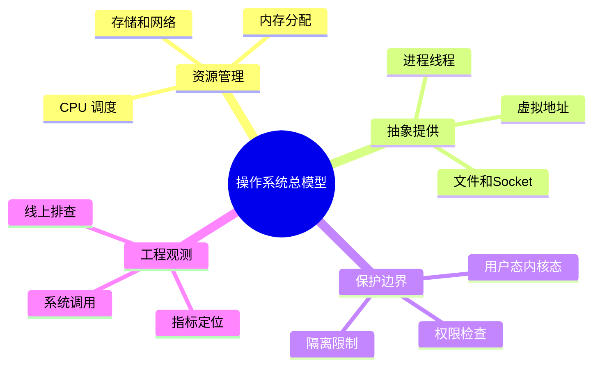

# 操作系统学习地图 MOC

> 这份 MOC 是整个“操作系统”文件夹的入口。你可以把它当作一张地图：先看全局，再进入章节，最后用面试题检验自己是否真的理解。

## 这套笔记解决什么问题

很多人学操作系统时会遇到三个困难：

1. **概念太抽象**：进程、线程、虚拟内存、页表、inode、epoll 都像孤立名词。
2. **教材和工程脱节**：知道调度算法，却不知道线上 CPU 飙高怎么查；知道文件系统，却不知道 `write` 为什么不等于落盘。
3. **面试表达不成体系**：能背定义，但遇到“为什么”“怎么排查”“具体场景怎么办”就说不深。

所以本目录按一条主线组织：

```text
程序运行
  → CPU 如何调度
  → 多个执行流如何并发
  → 内存如何隔离和映射
  → 文件与 I/O 如何落到设备
  → 网络与容器如何依赖内核
  → 线上问题如何观测和排查
```

## 推荐阅读顺序

### 第 1 阶段：建立操作系统整体图景

- [[操作系统系统性学习教程]]：总入口，先建立“程序运行时 OS 做了什么”的整体认识。
- [[01-操作系统导论与学习路线]]：理解 OS 的三大职责：资源管理、抽象、保护。
- [[02-硬件基础与中断]]：理解 CPU、缓存、MMU、TLB、中断、DMA。

### 第 2 阶段：理解程序如何被运行

- [[03-进程线程与调度]]：进程、线程、协程、上下文切换、调度。
- [[04-并发控制与同步原语]]：锁、条件变量、原子操作、竞态条件。
- [[05-死锁与资源管理]]：死锁四条件、锁顺序、超时、工程资源等待环。

### 第 3 阶段：理解内存为什么复杂

- [[06-内存管理]]：地址空间、分页、页表、堆栈、mmap。
- [[07-虚拟内存与页面置换]]：缺页异常、COW、换页、抖动、工作集。

### 第 4 阶段：理解文件、I/O、存储和网络

- [[08-文件系统]]：inode、目录项、fd、页缓存、崩溃一致性。
- [[09-IO系统与设备管理]]：阻塞/非阻塞、epoll、DMA、零拷贝。
- [[10-存储系统与可靠性]]：write-back、fsync、RAID、日志、快照。
- [[11-网络与分布式系统基础]]：Socket、TCP 队列、缓冲区、分布式延迟。

### 第 5 阶段：理解隔离、安全和工程观测

- [[12-安全保护与虚拟化]]：权限、namespace、cgroup、容器、虚拟机。
- [[13-Linux实操与观测]]：CPU、内存、磁盘、网络、系统调用排查方法。

### 第 6 阶段：面试复盘

- [[14-操作系统面试与复习清单]]：核心概念与排查模板。
- [[操作系统面试50问]]：50 个基础问题及深入回答。
- [[操作系统面试50问-深度追问]]：每题一个场景追问与回答。

## 你应该形成的总模型

操作系统不是一堆名词，而是一套“受保护的资源管理程序”。应用程序不能直接控制硬件，于是 OS 提供系统调用作为入口；应用程序不能直接使用物理内存，于是 OS 提供虚拟地址空间；多个程序不能同时无序使用 CPU、磁盘、网络，于是 OS 提供调度、锁、缓存、队列和权限控制。

```text
应用程序
  ├─ 调用库函数：printf、malloc、pthread_create
  ├─ 触发系统调用：read、write、open、mmap、clone、socket
  ▼
用户态 / 内核态边界
  ▼
内核
  ├─ CPU：进程、线程、调度、上下文切换
  ├─ 并发：锁、信号量、条件变量、futex
  ├─ 内存：页表、TLB、缺页、COW、换页
  ├─ 文件：inode、目录、fd、页缓存、日志
  ├─ I/O：中断、DMA、驱动、epoll、零拷贝
  ├─ 网络：socket、TCP 队列、协议栈、缓冲区
  └─ 隔离：权限、namespace、cgroup、虚拟化
  ▼
硬件：CPU、内存、磁盘、网卡、外设
```

## 学习时最重要的提问方式

每学一个概念，都问 5 个问题：

1. 它解决了什么问题？
2. 如果没有它，会发生什么？
3. 它在内核中大概如何实现？
4. 它带来了什么成本或副作用？
5. 线上如何观察它？

例如“虚拟内存”：

- 解决隔离和地址空间抽象。
- 没有它，程序要直接管理物理地址，互相覆盖风险极高。
- 通过页表、MMU、TLB、缺页异常实现。
- 成本是页表内存、TLB miss、缺页和换页。
- 可通过 `/proc/<pid>/maps`、`pmap`、`vmstat` 观察。

## 最小实践清单

建议你边看边执行这些命令，把概念落到现象：

```bash
ps -ef
ps -eLf | head
top
vmstat 1
cat /proc/$$/maps
ls -li
lsof -p $$
ss -s
strace -c ls
```

如果你能把这些命令输出和章节概念对应起来，OS 就不再是抽象理论。

## 思维导图

> 记忆建议：先记“六阶段路线”，再用“资源抽象保护”总模型串联全部章节。

### 1. 学习路线总览


### 2. 操作系统总模型


