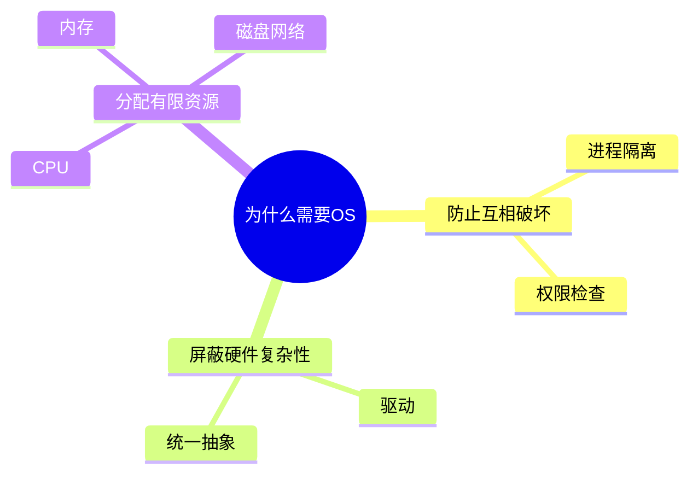
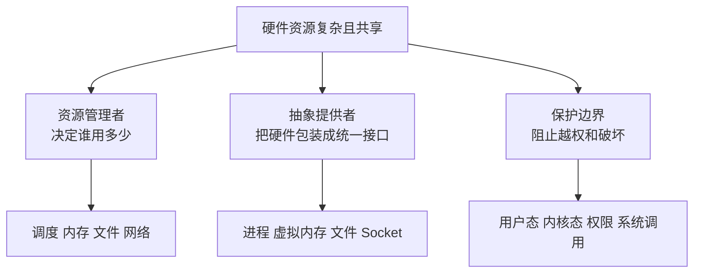
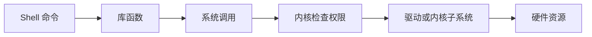

# 01-操作系统导论与学习路线

## 本章目标

读完本章，你要先建立一张“操作系统全局地图”。不要急着背页表、inode、epoll 这些细节，先理解操作系统为什么存在。

你应该能回答：

- 为什么应用程序不能直接控制硬件？
- 操作系统到底管理哪些资源？
- 系统调用、库函数、Shell 命令之间是什么关系？
- 操作系统知识应该按什么顺序学？

## 为什么需要操作系统

假设没有操作系统，每个程序都直接控制硬件，会出现什么问题？

### 问题 1：多个程序会互相破坏

如果程序可以直接写物理内存，那么程序 A 可能不小心或恶意覆盖程序 B 的数据。程序 B 崩溃后，整个机器也可能失控。

操作系统通过虚拟内存和权限检查，让每个进程只能访问自己被允许访问的地址。

### 问题 2：硬件接口太复杂

不同磁盘、网卡、显示器、键盘的硬件接口都不同。应用不可能为每种设备写一套控制逻辑。

操作系统通过驱动和统一抽象，把磁盘变成文件，把网卡变成 Socket，把终端变成标准输入输出。

### 问题 3：资源必须公平分配

CPU、内存、磁盘、网络都是有限资源。多个程序同时运行时，需要一个全局管理者来决定资源分配。

操作系统的调度器、内存管理器、文件系统、网络栈都在做这件事。

## 操作系统的三大职责

### 1. 资源管理者

操作系统管理这些资源：

- CPU：调度进程/线程，决定谁运行。
- 内存：分配物理页，维护虚拟地址空间。
- 存储：管理文件、目录、磁盘块、缓存和持久化。
- 网络：管理协议栈、连接、端口、缓冲区。
- 外设：通过驱动处理中断、DMA、设备状态。

资源管理的难点在于“取舍”：公平和吞吐、延迟和利用率、安全和性能往往不能同时最大化。

### 2. 抽象提供者

操作系统把复杂硬件包装成简单模型：

| 硬件现实     | OS 抽象     | 为什么有用          |
| -------- | --------- | -------------- |
| CPU 指令执行 | 进程/线程     | 程序像独占 CPU 一样运行 |
| 物理内存     | 虚拟地址空间    | 程序不用关心物理地址     |
| 磁盘块      | 文件/目录     | 用路径组织数据        |
| 网卡收发帧    | Socket    | 用连接/报文通信       |
| 设备寄存器    | 设备文件/驱动接口 | 用统一方式访问设备      |

抽象不是免费的。比如文件抽象背后有页缓存、inode、目录项、日志、块设备调度；Socket 背后有协议栈、缓冲区、拥塞控制。

### 3. 保护边界

OS 必须阻止程序越权：

- 用户态不能执行特权指令。
- 进程不能随便访问别人的内存。
- 普通用户不能读写无权限文件。
- 容器不能无限使用宿主机资源。
- 应用不能绕过系统调用直接操作硬件。

保护边界的核心是：**应用不可信，内核必须检查**。

## 系统调用、库函数、Shell 命令的关系

很多初学者会混淆这三个层次。

```text
Shell 命令：ls、cat、grep、curl
  ↓ 调用程序代码
库函数：printf、malloc、fopen、pthread_create
  ↓ 可能触发
系统调用：open、read、write、mmap、clone、socket
  ↓ 进入
内核：文件系统、内存管理、调度、网络栈
```

例如 `cat a.txt`：

1. Shell 创建子进程。
2. 子进程 exec 加载 `cat` 程序。
3. `cat` 调用库函数打开文件。
4. 库函数内部触发 `openat/read/write` 系统调用。
5. 内核从文件系统和页缓存读取数据，写到标准输出。

## 用户态和内核态

CPU 提供特权级。用户程序运行在用户态，内核运行在内核态。用户态代码不能直接访问硬件和内核内存。

当应用需要内核服务时，通过系统调用进入内核：

```text
用户态应用
  → 系统调用指令
  → CPU 切换特权级
  → 内核态处理
  → 返回用户态
```

这条边界很重要：它提供安全，但也带来成本。因此高性能系统会尽量减少不必要的系统调用，例如批量 I/O、缓冲、mmap、sendfile。

## 操作系统知识的学习路线

### 第一层：硬件基础

必须知道 CPU、内存、缓存、MMU、TLB、中断、DMA。因为 OS 的很多设计都是围绕硬件约束做的。

### 第二层：执行流管理

学习进程、线程、协程、调度、上下文切换。理解程序如何“同时运行”。

### 第三层：并发控制

学习锁、信号量、条件变量、原子操作、死锁。理解多个执行流如何安全共享数据。

### 第四层：内存管理

学习虚拟内存、页表、缺页、COW、页面置换。理解程序为什么能拥有独立地址空间。

### 第五层：文件与 I/O

学习文件系统、fd、inode、页缓存、设备驱动、epoll、零拷贝。理解数据如何从应用到磁盘/网卡。

### 第六层：安全与工程观测

学习权限、容器、虚拟机、Linux 排查工具。把理论变成线上问题定位能力。

## 本章常见误区

### 误区 1：操作系统只是硬件驱动集合

驱动只是 OS 的一部分。更重要的是资源管理、保护、抽象和并发协调。

### 误区 2：系统调用就是普通函数

普通函数不跨越特权级。系统调用会进入内核，有权限检查和上下文成本。

### 误区 3：学 OS 只是为了面试

数据库、容器、网络服务、高性能计算、分布式系统都建立在 OS 之上。不理解 OS，就很难解释很多线上问题。

## 实践任务

执行：

```bash
man 2 read
man 3 printf
strace -c ls
ps -o pid,ppid,stat,comm -p $$
```

观察：

- `man 2` 是系统调用层。
- `man 3` 是库函数层。
- `strace` 能看到命令背后的系统调用。
- `ps` 能看到当前 shell 的进程状态。

## 自测题

1. 操作系统为什么要同时提供“抽象”和“保护”？
2. `printf()`、`write()`、`echo` 分别属于哪个层次？
3. 如果没有用户态/内核态区分，会发生什么？
4. 为什么高性能程序要减少系统调用次数？

## 补充深入讲解

## 从零开始理解：操作系统像一座城市的管理系统

如果把计算机看成一座城市，CPU 是道路和工厂，内存是临时仓库，磁盘是长期仓库，网络是城市对外交通。应用程序就像城市里的公司。每家公司都想用道路、仓库和交通系统。如果没有统一管理，公司之间会互相抢路、占仓库、破坏别人的货物。

操作系统就像城市管理系统：

- 调度器像交通灯，决定哪辆车先走。
- 内存管理像仓库管理员，给每家公司划分区域。
- 文件系统像档案管理局，负责长期保存资料。
- 权限系统像门禁，决定谁能进入哪里。
- 系统调用像办事窗口，公司不能直接改城市基础设施，只能通过窗口申请服务。

这个类比的重点是：操作系统不是单个功能，而是一整套规则。它既要让大家共享资源，又要防止互相破坏。

## 更细一点：应用程序为什么必须“请求”内核

应用程序运行时经常需要做这些事：读文件、写网络、创建线程、申请内存、获取时间。这些动作看起来普通，但背后都涉及共享资源。例如读文件要检查权限，写网络要使用网卡和端口，创建线程要占用内核调度结构，申请内存要修改进程地址空间。

如果应用能直接做这些事，就无法保证安全。所以 OS 规定：普通程序只能做普通计算；涉及全局资源的动作必须通过系统调用，由内核检查后执行。

这也是为什么学习 OS 时要反复问：“这个动作是不是会进入内核？”只要进入内核，就会涉及权限、资源、调度和成本。

## 一个完整例子：执行 `cat a.txt`

1. Shell 先解析命令。
2. Shell 调用 `fork()` 创建子进程。
3. 子进程调用 `execve()` 加载 `/bin/cat`。
4. `cat` 调用 `open()` 打开文件。
5. 内核检查路径、权限，分配 fd。
6. `cat` 调用 `read()` 读取文件。
7. 内核先查页缓存，未命中再访问磁盘。
8. `cat` 调用 `write()` 写到标准输出。
9. 终端驱动把内容显示出来。
10. `cat` 退出，Shell 通过 `wait()` 回收。

一个简单命令就串起了进程、系统调用、文件系统、页缓存、终端设备和调度。

## 学习本目录的正确节奏

不要试图一次记住所有概念。第一遍只建立地图：知道每个概念属于 CPU、内存、文件、I/O、网络、安全哪一类。第二遍开始理解机制：系统调用怎么走、地址怎么翻译、read 怎么读到数据。第三遍再学排查：CPU 高、内存涨、I/O 慢时怎么定位。

## 思维导图

> 记忆建议：把本章压缩成一句话：OS 用“抽象 + 管理 + 保护”把硬件安全地交给应用使用。

### 1. 为什么需要操作系统



### 2. 三大职责



### 3. 从命令到内核服务


