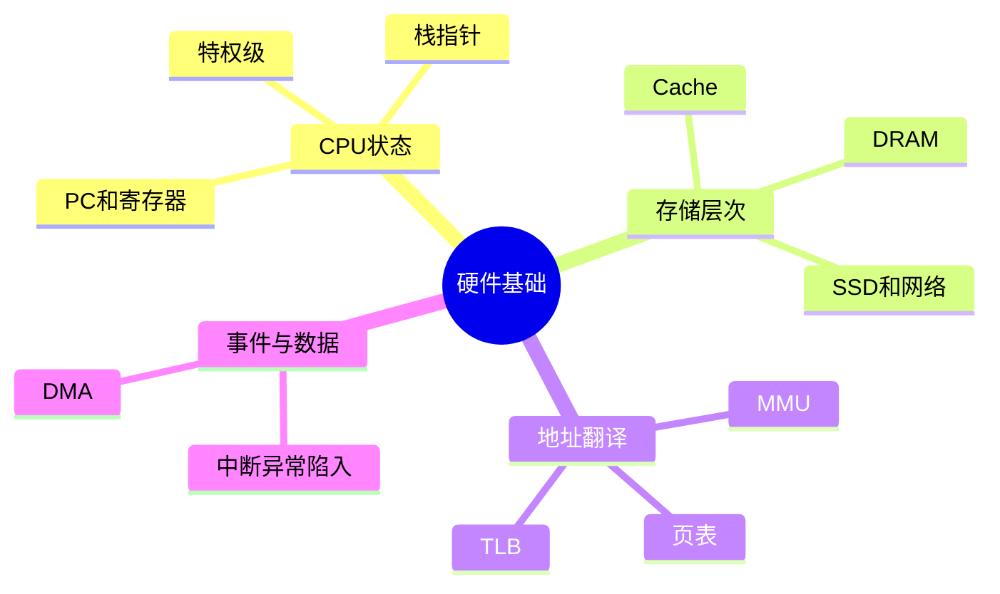
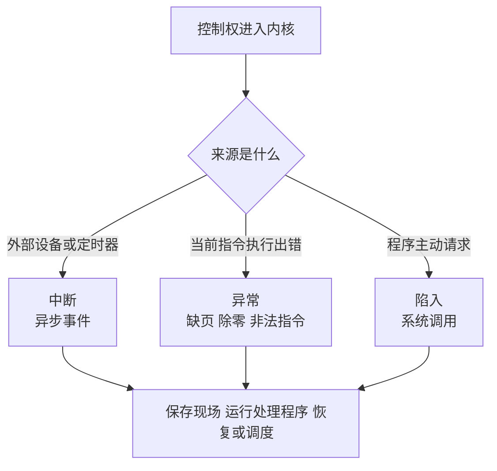

# 02-硬件基础与中断

## 本章目标

操作系统不是凭空设计出来的，它受硬件约束很深。本章先讲 CPU、缓存、MMU、TLB、中断、DMA。理解这些之后，后面的系统调用、上下文切换、虚拟内存和 I/O 才不会抽象。

你应该能回答：

- CPU 如何执行程序？
- 为什么需要缓存层次？
- MMU 和 TLB 在虚拟内存中起什么作用？
- 中断、异常、陷入有什么区别？
- DMA 为什么能提升 I/O 性能？

## CPU 如何执行程序

CPU 大致按“取指令 → 解码 → 执行 → 写回”的方式运行。程序计数器 PC/IP 指向下一条要执行的指令，栈指针 SP 指向当前栈顶，寄存器保存临时数据。

对 OS 来说，最重要的是：一个正在运行的程序，本质上就是一组 CPU 状态：

- 程序计数器：运行到哪里。
- 栈指针：当前调用栈在哪里。
- 通用寄存器：计算过程中的临时值。
- 状态寄存器：条件码、中断开关、特权级等。

上下文切换时，内核要保存这些状态，再恢复另一个任务的状态。

## 特权级：为什么应用不能随便执行指令

	CPU 通常支持不同的特权级。内核运行在高特权级，应用程序运行在低特权级。

低特权级不能做这些事： 

- 修改页表。
- 访问任意物理地址。
- 配置中断控制器。
- 操作设备寄存器。
- 执行 halt 等特权指令。

如果用户程序尝试执行特权指令，CPU 会触发异常，把控制权交给内核。这是操作系统保护机制的硬件基础。

## 缓存层次：为什么内存访问不是一样快

现代机器的访问速度差距很大：

```text
寄存器 < L1 Cache < L2 Cache < L3 Cache < DRAM < SSD < HDD < 网络
```

CPU 太快，内存太慢，所以需要缓存。缓存依赖两个局部性：

- 时间局部性：刚访问过的数据，很可能很快再次访问。
- 空间局部性：访问某个地址后，附近地址也可能被访问。

这解释了为什么遍历数组通常比遍历链表快：数组连续，缓存和 TLB 命中率高；链表节点分散，容易 cache miss 和 TLB miss。

## 缓存一致性与多核

多核 CPU 各自有缓存。如果两个核心修改同一个缓存行，需要缓存一致性协议协调。高并发程序中，一个全局 atomic 计数器可能成为热点，因为同一缓存行在多个 CPU 核之间来回迁移。

这也是为什么高性能计数器常做分片：每个线程/CPU 更新自己的局部计数，最后汇总。

## MMU：虚拟地址到物理地址的翻译器

应用程序使用虚拟地址，硬件实际访问物理内存。MMU 负责地址翻译。

```text
虚拟地址
  → MMU 查询页表/TLB
  → 物理地址
  → 访问内存
```

如果虚拟地址没有有效映射，CPU 会触发缺页异常，由内核决定是分配页面、从磁盘加载，还是判定非法访问并杀死进程。

## TLB：页表查询的缓存

页表在内存中，如果每次访问内存都要先查页表，成本太高。TLB 缓存虚拟页到物理页框的映射。

```text
访问虚拟地址
  → TLB 命中：快速得到物理地址
  → TLB 未命中：查页表，可能多次访存
  → 页表无效：缺页异常
```

TLB 覆盖范围有限。随机访问大内存时，TLB miss 会明显拖慢程序。Huge Page 能增大每个 TLB 项覆盖的内存范围，因此常用于数据库和高性能计算。

## 中断、异常、陷入

这三个概念很容易混，但面试常问。

| 类型           | 来源         | 是否和当前指令有关 | 例子            |
| ------------ | ---------- | --------- | ------------- |
| 中断 interrupt | 外部设备       | 通常无关      | 网卡收包、磁盘完成、定时器 |
| 异常 exception | CPU 执行当前指令 | 有关        | 缺页、除零、非法指令    |
| 陷入 trap      | 程序主动触发     | 有关        | 系统调用、断点       |
|              |            |           |               |

一句话记忆：**中断来自外部，异常来自执行错误或特殊情况，陷入是主动进内核**。

## 定时器中断与抢占

如果没有定时器中断，一个死循环程序可能永远占用 CPU。操作系统设置定时器，定期打断当前程序，让内核重新获得控制权，检查是否需要调度其他任务。

这就是抢占式多任务的基础：不是程序主动让出 CPU，而是 OS 可以强制拿回 CPU。

## DMA：设备直接访问内存

没有 DMA 时，CPU 需要参与大量数据搬运。例如从磁盘读取 1MB 数据，CPU 要不断从设备读取再写入内存，效率很低。

DMA 允许设备控制器直接把数据传到内存：

```text
内核准备 DMA 缓冲区
  → 配置设备控制器
  → 设备执行传输
  → 完成后发中断
  → 内核处理完成事件
```

这样 CPU 不用逐字节搬运数据，可以去执行其他任务。

## DMA 的安全问题

DMA 能直接访问内存，如果不限制，设备可能读写任意物理内存。现代系统使用 IOMMU 限制设备 DMA 可访问范围。虚拟机设备直通也依赖 IOMMU 保护隔离。

## 实践任务

```bash
lscpu
getconf PAGE_SIZE
cat /proc/interrupts | head
vmstat 1
```

观察：

- CPU 核心数、缓存大小。
- 页大小通常是 4096 字节。
- 中断计数是否增长。
- `vmstat` 中 `in` 是中断次数，`cs` 是上下文切换次数。

## 自测题

1. 为什么上下文切换需要保存寄存器？
2. 为什么链表遍历可能比数组慢？
3. TLB 未命中为什么会影响性能？
4. 为什么高网络流量下系统可能从中断转向轮询？
5. DMA 提升了什么，又带来什么安全问题？

## 补充深入讲解

## 从零开始理解：为什么 OS 必须懂硬件

操作系统不是普通应用，它要直接管理硬件，所以必须知道硬件怎么工作。比如 CPU 有特权级，OS 才能区分用户态和内核态；CPU 有 MMU，OS 才能实现虚拟内存；设备能发中断，OS 才能不用一直傻等设备；设备支持 DMA，OS 才能让磁盘和网卡高效搬运数据。

如果不理解这些硬件机制，很多 OS 概念都会变成死记硬背。例如“缺页异常”听起来像错误，但从硬件角度看，它只是 CPU 发现页表没有映射后通知内核的一种机制。

## 具体例子：键盘输入一个字符发生什么

当你按下键盘：

1. 键盘控制器检测到按键。
2. 控制器向 CPU 发送中断。
3. CPU 暂停当前程序，跳到内核中断处理程序。
4. 键盘驱动读取按键扫描码。
5. 内核把它转换成字符或输入事件。
6. 等待输入的进程被唤醒。
7. 进程从终端设备读取到字符。

用户只是按了一个键，但背后经历了硬件中断、驱动、内核缓冲区和进程唤醒。

## 具体例子：一次磁盘读取为什么不全靠 CPU

如果 CPU 亲自把磁盘数据一个字节一个字节搬到内存，会非常浪费。DMA 的做法是：CPU 告诉磁盘控制器“把这段数据放到这块内存”，然后 CPU 去做别的事。磁盘完成后发中断通知 CPU。

这解释了 I/O 系统的基本结构：CPU 负责发起和收尾，设备负责搬运，中断负责通知，内核负责协调。

## 为什么缓存会影响程序性能

两个算法时间复杂度一样，性能可能差很多。原因之一是缓存局部性。例如数组连续存储，CPU 读取一个元素时会把附近元素一起加载到缓存；链表节点分散，访问每个节点都可能 miss。

这也是 OS 和高性能编程的共同主题：性能不仅取决于“操作次数”，也取决于内存布局、缓存、TLB 和硬件流水线。

## 思维导图

> 记忆建议：硬件章节重点记“CPU 状态、地址翻译、事件通知、数据搬运”四件事。

### 1. 硬件基础四件事



### 2. 中断、异常、陷入的区别



### 3. DMA 读数据路径


