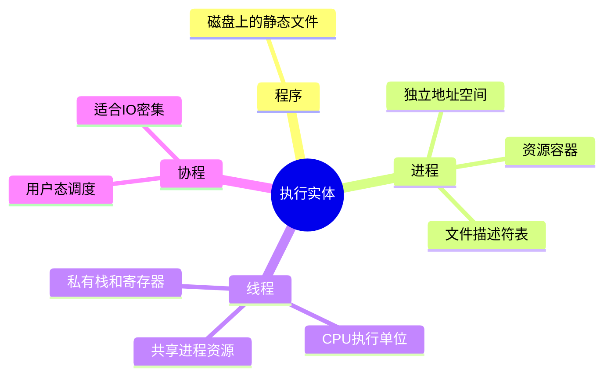
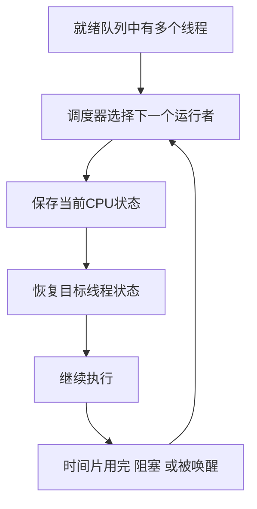

# 03-进程线程与调度

## 本章目标

本章解释“程序如何运行”。你会看到：程序、进程、线程、协程不是同义词；调度器决定谁使用 CPU；上下文切换有真实成本；线程过多不一定更快。

你应该能回答：

- 程序和进程有什么区别？
- 线程共享什么、私有什么？
- fork/exec/wait 如何配合？
- 调度器为什么需要时间片？
- 上下文切换为什么会拖慢程序？

## 程序、进程、线程、协程

### 程序

程序是磁盘上的静态文件，例如 `/bin/ls` 或 `./server`。它包含代码、数据、符号、动态链接信息等。

### 进程

进程是正在运行的程序实例。它有：

- 独立虚拟地址空间。
- 文件描述符表。
- 进程 ID。
- 权限、资源限制、信号处理。
- 至少一个执行线程。

进程更像“资源容器”。

### 线程

线程是进程内的执行流。线程共享进程的地址空间和资源，但有自己的栈、寄存器和调度状态。

线程更像“CPU 执行单位”。

### 协程

协程通常由语言运行时在用户态调度。例如 Go 的 goroutine、Python asyncio task。协程切换成本低，但如果底层系统调用阻塞，运行时必须有办法避免整个线程被卡住。

## 进程地址空间

一个进程通常有这些区域：

```text
高地址
  栈：函数调用帧、局部变量
  mmap：动态库、文件映射、匿名映射
  堆：malloc/new 分配
  BSS：未初始化全局变量
  Data：已初始化全局变量
  Text：代码段
低地址
```

虚拟地址空间让每个进程都像独占内存。实际上，OS 通过页表把虚拟页映射到物理页。

## fork、exec、wait

Unix 创建新程序常用三步：

```text
fork：复制当前进程，得到子进程
exec：子进程加载新程序，替换地址空间
wait：父进程等待并回收子进程退出状态
```

### 为什么 fork 后不立刻复制全部内存

现代 OS 使用写时复制。父子进程先共享物理页，只有写入时才复制。这样 `fork` 很快，特别适合 fork 后立刻 exec 的场景。

### 僵尸进程

子进程退出后，内核保留退出状态，等待父进程 `wait`。如果父进程一直不回收，子进程就变成僵尸进程。僵尸进程不占用大量内存，但占用 PID 和少量内核结构。

## 线程共享与私有

线程共享：

- 代码段、堆、全局变量。
- 文件描述符。
- 进程级信号处理配置。
- 当前工作目录等。

线程私有：

- 栈。
- 寄存器。
- 程序计数器。
- 线程局部存储。
- 调度状态。

因此，一个线程写坏堆内存，可能导致整个进程崩溃。这就是线程通信方便但隔离弱的代价。

## 上下文切换

CPU 同一时刻每个核心只能运行一个执行流。调度器切换任务时，需要：

1. 保存当前任务寄存器、PC、SP。
2. 切换内核栈和调度状态。
3. 可能切换地址空间。
4. 恢复下一个任务上下文。
5. 返回用户态继续执行。

成本不仅是保存寄存器，还包括 cache/TLB 局部性丢失。线程太多、锁竞争、频繁阻塞会造成大量上下文切换。

## 进程状态

常见状态：

- 新建：正在创建。
- 就绪：等待 CPU。
- 运行：正在 CPU 上执行。
- 阻塞：等待 I/O、锁、事件。
- 终止：执行完毕，等待回收。

Linux 常见状态：

| 状态 | 含义 |
|---|---|
| R | 正在运行或就绪 |
| S | 可中断睡眠 |
| D | 不可中断睡眠，常见于 I/O 等待 |
| Z | 僵尸 |
| T | 停止/被跟踪 |

大量 D 状态会拉高 load，但 CPU 不一定高。

## 调度目标

不同系统调度目标不同：

| 场景 | 目标 |
|---|---|
| 桌面 | 响应快 |
| 批处理 | 吞吐高 |
| 实时系统 | 满足截止时间 |
| Web 服务 | 延迟、吞吐、公平 |

常见算法：FCFS、SJF、RR、优先级、多级反馈队列、CFS。

## 时间片

时间片太大：交互响应差。时间片太小：上下文切换频繁。现代调度器通常不是简单固定时间片，而是根据权重、优先级、虚拟运行时间等动态调度。

## 实践任务

```bash
ps -ef | head
ps -eLf | head
top -H -p <pid>
vmstat 1
pidstat -w 1
```

观察：

- 进程和线程数量。
- 上下文切换次数。
- 线程 CPU 使用情况。

## 自测题

1. 进程和线程的根本区别是什么？
2. 为什么线程太多会降低性能？
3. fork 后为什么使用 COW？
4. 僵尸进程和孤儿进程有什么区别？
5. CPU 不高但 load 高，可能是什么原因？

## 补充深入讲解

## 从零开始理解：进程像“房间”，线程像“房间里干活的人”

进程可以理解为一个独立房间，里面有自己的桌子、文件柜和工具，也就是地址空间、文件描述符和资源。线程是房间里干活的人。一个房间可以有多个人同时干活，他们共享桌子和文件柜，所以交流方便；但如果两个人同时改同一份文件，就可能出错。

进程之间隔着墙，互相不容易破坏；线程之间没有墙，所以效率高但更危险。

## 为什么线程不是越多越好

很多初学者以为线程越多，并发越高，程序越快。实际上 CPU 核心数有限。线程过多会带来：

- 每个线程都需要栈内存。
- 调度器要管理更多任务。
- 上下文切换增加。
- cache/TLB 局部性变差。
- 锁竞争更严重。

如果 4 核机器上启动 4000 个 CPU 密集线程，大部分线程都在等待 CPU，系统会花大量时间切换而不是计算。

## I/O 密集和 CPU 密集的区别

CPU 密集任务主要消耗计算，例如压缩、加密、图像处理。线程数通常接近 CPU 核数比较合理。

I/O 密集任务经常等待磁盘、网络、数据库。等待时线程不占 CPU，所以可以有更多并发。但如果每个连接一个线程，线程数太多仍会带来内存和调度成本。因此高并发 I/O 常用事件循环、协程或异步模型。


## 一个 Web 请求中的线程状态变化

一个 Web 请求从到达到完成，通常会经历“运行—等待—再次运行”的多次切换。这里的“等待”不等于线程一直占用 CPU：线程等待网络、磁盘、数据库或锁时，调度器通常会把 CPU 让给其他就绪线程。

下面以“线程池 + 阻塞式业务代码”或“线程池配合非阻塞 I/O”的常见服务为例。具体实现会因 Web 服务器、语言运行时和 I/O 模型不同而变化，但分析思路基本相同。

### 1. 接收连接：线程可能先处于等待状态

Web 服务通常有一个监听 socket，等待客户端连接。连接到达后，内核把事件放入监听队列，服务器线程被唤醒，取得连接并读取请求。

常见情况有两种：

- **阻塞 I/O**：线程调用 `accept` 或 `read`，如果暂时没有连接或数据，就睡眠等待；
- **非阻塞 I/O + `epoll`**：线程调用 `epoll_wait` 等待事件，内核没有就绪事件时，线程同样会睡眠，但它不是卡在某一个连接上，而是在等待一组连接中的任意一个变得可读或可写。

因此，“等待 epoll”通常不是忙等。线程在内核中睡眠，不会持续消耗一个 CPU 核心。

### 2. 线程池取任务：进入运行态

连接或请求事件就绪后，服务器把任务放入队列。线程池中的某个工作线程被唤醒，从队列取出请求，开始执行路由、鉴权、参数解析等代码：

```text
线程池空闲等待任务
        ↓ 请求到达
工作线程被唤醒并取出任务
        ↓
进入运行态，执行请求处理代码
```

“进入运行态”只表示线程当前获得了 CPU。它并不意味着整个请求都在计算，因为后续遇到 I/O 或锁时，线程还会离开运行态。

### 3. 读取请求体：等待客户端数据

如果请求带有较大的请求体，例如文件上传或 POST 数据，第一次读取时数据可能还没有完全到达：

```text
客户端发送速度较慢
        ↓
socket 接收缓冲区暂时没有足够数据
        ↓
线程等待网络数据
```

在阻塞式 socket 下，线程可能睡眠在 `read` 系统调用中；在非阻塞模型下，线程可能先收到“暂时不可读”，然后把连接交给 `epoll`，处理其他连接。

这段时间请求的延迟增加了，但服务器 CPU 使用率可能很低。原因是请求慢在“等客户端发数据”，而不是慢在执行计算。

### 4. 查询数据库：等待另一个服务返回

业务代码经常需要访问数据库、缓存或其他 RPC 服务：

```text
应用线程发送数据库请求
        ↓
等待数据库处理并通过网络返回结果
        ↓
线程暂时不能继续当前请求
```

如果数据库客户端使用阻塞 I/O，工作线程可能睡眠在 socket 读取处；如果使用异步 I/O，线程可能把等待任务交给事件循环，稍后收到响应时再恢复执行。

数据库等待期间可能包含多个阶段：

1. 等待连接池中的空闲连接；
2. 等待请求通过网络到达数据库；
3. 等待数据库执行 SQL；
4. 等待结果通过网络返回；
5. 等待应用线程重新获得 CPU。

所以“查询数据库慢”不一定全部是数据库 CPU 慢，也可能是连接池耗尽、网络延迟、锁等待或结果传输慢。

### 5. 竞争锁：等待进程内的共享资源

多个线程访问同一个共享资源时，通常需要互斥锁保护：

```c
lock(&cache_lock);
更新共享缓存();
unlock(&cache_lock);
```

如果锁已经被其他线程持有，当前线程不能继续执行临界区代码。它可能：

- 短暂自旋，反复检查锁是否释放；
- 自旋一段时间后进入睡眠；
- 通过 `futex` 等内核机制等待被唤醒。

因此，锁竞争也会让请求变慢。此时 CPU 可能不高，也可能因为大量线程自旋而升高，取决于锁的实现和等待时间。

```text
线程 A 持有锁 ─────────────→ 释放锁
线程 B 请求锁 ──等待 futex─→ 被唤醒并继续
```

### 6. 业务计算：真正占用 CPU

拿到数据并获得所需锁后，线程开始执行计算，例如：

- JSON 编解码；
- 参数校验；
- 权限判断；
- 数据转换；
- 排序、压缩、加密或模板渲染。

这一阶段线程处于运行态并消耗 CPU。如果计算时间很长，可能出现：

- 一个核心或多个核心接近 100%；
- 线程时间片用完，被调度器暂时换下；
- CPU 密集线程互相竞争，出现就绪队列堆积。

这时请求慢才更可能是“计算量大”或“CPU 资源不足”。

### 7. 写响应：可能等待客户端接收

业务处理完成后，线程把响应写入 socket。写入并不保证客户端已经及时接收：

```text
应用生成响应
        ↓
socket 发送缓冲区有空间：写入成功
        或
发送缓冲区已满：等待客户端继续读取
```

如果客户端网络很慢，或者响应很大，发送缓冲区可能被填满。阻塞式写操作会让线程等待；非阻塞模型则会注册可写事件，等 socket 再次可写时继续发送。

因此，服务器已经算完业务，但客户端收得慢，仍然会导致请求完成时间变长。

### 8. 请求结束：线程回到线程池

响应发送完成后，线程通常会：

1. 释放锁、数据库连接等资源；
2. 记录日志和监控指标；
3. 关闭连接，或等待 Keep-Alive 的下一个请求；
4. 将自己放回线程池，等待下一个任务。

如果线程没有正确释放连接、锁或其他资源，后续请求可能因为资源耗尽而排队。

### 一条完整的状态时间线

```text
等待连接/事件
    ↓
被唤醒，线程进入运行态
    ↓
读取请求体 ──数据未到──→ 等待网络
    ↓ 数据到达
查询数据库 ──等待连接/网络/SQL──→ 睡眠
    ↓ 查询完成
竞争锁 ──锁被占用──→ futex 等待
    ↓ 获得锁
业务计算 ──消耗 CPU──→ 可能被时间片切换
    ↓
写响应 ──发送缓冲区满──→ 等待客户端读取
    ↓
请求完成，线程回到线程池
```

### 如何判断请求到底慢在哪里？

不能只看 CPU 使用率。应该把请求耗时拆成多个阶段，例如：

```text
总耗时
= 排队时间
+ 读取请求时间
+ 数据库/RPC 等待时间
+ 锁等待时间
+ CPU 计算时间
+ 写响应时间
```

可以结合以下现象分析：

| 现象 | 可能原因 |
|---|---|
| CPU 高、运行队列长 | 业务计算量大，或线程过多导致竞争 |
| CPU 低、请求仍然很慢 | 网络、数据库、磁盘或锁等待 |
| 线程大量睡眠在 I/O | 外部服务慢、客户端慢或网络拥塞 |
| 线程大量等待锁 | 临界区过长、锁粒度过大或热点数据竞争 |
| 线程池队列很长 | 工作线程不足，或线程都被慢 I/O 占住 |
| 数据库连接池耗尽 | 查询过慢、连接泄漏或并发量超过数据库承载能力 |

因此，一个请求慢的准确含义是：**请求完成前经历了较长的总等待或计算时间**，而不是必然表示 CPU 执行得慢。请求处理线程可能在运行态、就绪态和各种睡眠/阻塞等待之间多次切换。其状态变化本身也有成本，但很多延迟来自等待的外部资源。 
## 思维导图

> 记忆建议：先分清“资源容器”和“执行单位”，再理解调度器为什么切换执行流。

### 1. 程序、进程、线程、协程



### 2. fork、exec、wait 主线


### 3. 调度与上下文切换


