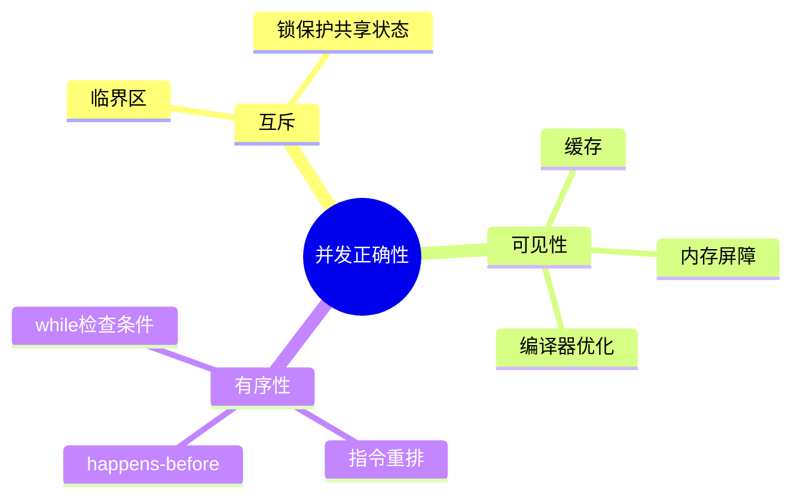
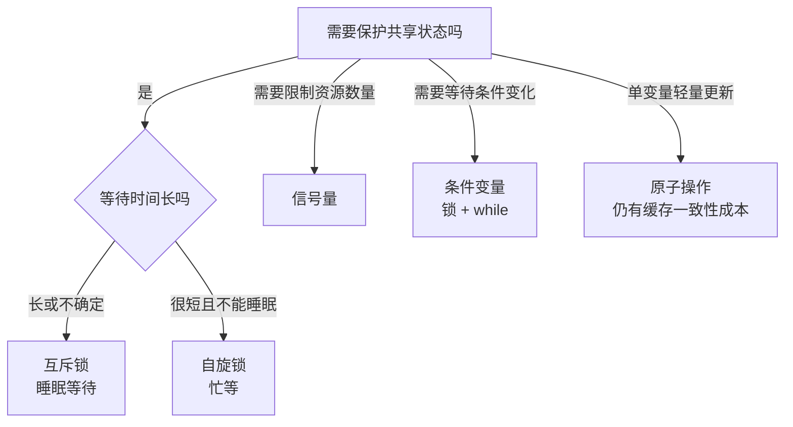
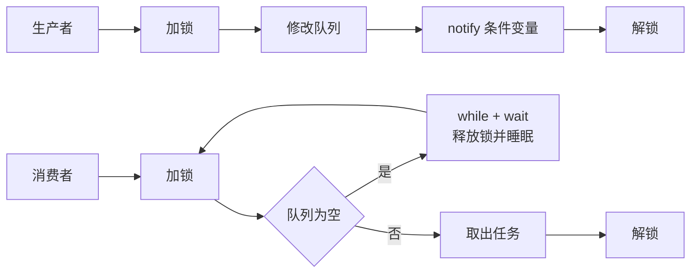

# 04-并发控制与同步原语

## 本章目标

并发不是“多个线程一起跑”那么简单。只要多个执行流访问共享状态，就可能出现竞态、可见性、有序性问题。本章讲清楚锁、信号量、条件变量、原子操作为什么存在，以及它们各自适合什么场景。

## 为什么会有并发问题

假设两个线程同时执行：

```c
counter++;
```

这行代码底层可能是三步：

```text
load counter
add 1
store counter
```

如果两个线程都先读到 0，再分别写回 1，最终结果是 1，而不是 2。这就是竞态条件。

## 并发要解决的三个问题

### 1. 互斥

同一时刻只能一个线程进入临界区，避免共享数据被同时修改。

### 2. 可见性

线程 A 修改的值，线程 B 必须能看到。CPU 缓存、编译器优化、寄存器缓存都可能导致“看不到最新值”。

### 3. 有序性

编译器和 CPU 可能为了优化进行指令重排。单线程看不出问题，但多线程下可能破坏逻辑顺序。

## 临界区

临界区是访问共享资源、必须受保护的代码区域。例如：

```text
lock(m)
  修改共享队列
unlock(m)
```

临界区要尽量短，不要在持锁期间做慢 I/O、远程调用或复杂计算。

## 互斥锁

互斥锁适合普通临界区。获取不到锁时，线程通常睡眠，让出 CPU。

优点：

- 易用。
- 不浪费 CPU 空转。
- 适合等待时间不确定的临界区。

缺点：

- 可能上下文切换。
- 可能死锁。
- 高竞争时性能下降。

## 自旋锁

自旋锁获取失败时不会睡眠，而是循环等待。

适合：

- 临界区极短。
- 不能睡眠的内核上下文。
- 等待时间小于睡眠/唤醒成本。

不适合：

- 用户态长临界区。
- 持锁期间可能阻塞。
- 单核或持锁线程可能被抢占的场景。

## 读写锁

读写锁允许多个读者并发，写者独占。适合读多写少的数据结构。

但读写锁不是万能优化：

- 写频繁时退化严重。
- 读者太多可能让写者饥饿。
- 锁实现本身比互斥锁复杂。

## 信号量

信号量是计数器，表示可用资源数量。

例子：数据库连接池最多 10 个连接：

```text
信号量初始值 = 10
获取连接：P 操作，计数减 1
归还连接：V 操作，计数加 1
```

信号量更适合“限制并发数量”，而不是保护复杂共享状态。

## 条件变量

条件变量用于“等待某个条件成立”。它必须配合互斥锁使用。

经典模式：

```c
pthread_mutex_lock(&m);
while (queue_empty()) {
必须用 `while`，因为唤醒不代表条件一定满足。可能虚假唤醒，也可能被其他线程先消费。
```


### C++ 示例：使用 `std::condition_variable` 实现生产者—消费者

下面的消费者在队列为空且生产者尚未结束时等待；`wait` 会在等待时释放互斥锁，被唤醒后重新加锁并检查谓词。

```cpp
#include <condition_variable>
#include <iostream>
#include <mutex>
#include <queue>
#include <thread>

int main() {
    std::queue<int> queue;
    std::mutex mutex;
    std::condition_variable cv;
    bool done = false;

    std::thread consumer([&] {
        while (true) {
            std::unique_lock<std::mutex> lock(mutex);
            cv.wait(lock, [&] {
                return !queue.empty() || done;
            });

            if (queue.empty() && done) {
                break;
            }

            int item = queue.front();
            queue.pop();
            lock.unlock();  // 耗时处理不要占着锁

            std::cout << "consume: " << item << '\\n';
        }
    });

    std::thread producer([&] {
        for (int i = 1; i <= 5; ++i) {
            {
                std::lock_guard<std::mutex> lock(mutex);
                queue.push(i);
            }
            cv.notify_one();
        }

        {
            std::lock_guard<std::mutex> lock(mutex);
            done = true;
        }
        cv.notify_one();
    });

    producer.join();
    consumer.join();
}
```

关键点：

- `std::condition_variable::wait` 必须使用 `std::unique_lock`，因为等待期间需要临时释放并在唤醒后重新获取互斥锁。
- 使用谓词 `!queue.empty() || done`，等价于用 `while` 反复检查条件，可处理虚假唤醒和“被其他线程先消费”的情况。
- 生产者修改队列和 `done` 后再通知；消费者发现队列已空且 `done == true` 时退出。
}
item = pop(queue);
pthread_mutex_unlock(&m);

必须用 `while`，因为唤醒不代表条件一定满足。可能虚假唤醒，也可能被其他线程先消费。

## 原子操作

原子操作适合简单共享变量，例如计数器、状态位、引用计数。

但原子操作不能完全替代锁：

- 多变量一致性难保证。
- 内存序复杂。
- CAS 高竞争下会反复失败。
- 容易出现 ABA 问题。

无锁不等于无成本。很多时候锁更清晰、更可靠。

## futex：用户态锁和内核的桥梁

Linux 中很多用户态锁底层依赖 futex。无竞争时，锁完全在用户态完成；有竞争时，才通过 futex 系统调用让线程睡眠或唤醒。

这是一种重要优化：**快路径在用户态，慢路径进内核**。

## 工程建议

1. 共享状态越少越好。
2. 能用不可变数据就不用锁。
3. 临界区尽量短。
4. 持锁时不要调用外部不可控逻辑。
5. 高并发计数器尽量分片。
6. 队列要有容量上限和背压。
7. 不要轻易写复杂无锁结构。

## 实践任务

写一个多线程计数器，分别实现：

1. 无锁版本。
2. mutex 版本。
3. atomic 版本。
4. 分片 atomic 版本。

比较正确性和性能。你会发现“正确”和“快”是两个不同问题。

## 自测题

1. 为什么 `counter++` 不是线程安全？
2. 条件变量为什么要配合互斥锁？
3. 自旋锁为什么不能随便用？
4. atomic 为什么不一定比锁快？
5. futex 的优化思想是什么？

## 补充深入讲解

## 从零开始理解：并发 bug 为什么难复现

并发 bug 的可怕之处在于它依赖时序。两个线程谁先执行、执行到哪一步被抢占、什么时候被唤醒，都可能改变结果。同一段代码在测试环境正常，在生产高并发下才出错，就是因为调度时序变了。

例如两个线程同时转账，如果都先读余额再写回，就可能覆盖对方修改。这个 bug 不是每次发生，而是在特定交错顺序下发生。

## 锁到底保护的是什么

锁不是保护代码，锁保护的是“共享状态的不变量”。例如队列的不变量是：头尾指针一致、size 正确、元素没有丢失。所有修改这些状态的代码都必须在同一把锁下执行。只给一部分代码加锁没有意义，因为其他路径仍可能破坏不变量。

## 条件变量的核心思想

条件变量不是“发消息”，而是“状态变了，你醒来重新检查”。真正的条件必须存储在共享变量中，例如队列是否为空。条件变量只负责睡眠和唤醒。

因此正确模式永远是：

```text
加锁
while 条件不满足:
    等待条件变量
操作共享状态
解锁
```

## 原子操作的现实成本

原子自增看起来很轻，但在多核下会让缓存行在核心间反复迁移。如果 64 个线程都更新同一个 atomic 计数器，性能可能很差。更好的设计是分片计数，每个线程更新本地计数，定期汇总。

这说明并发优化不是“把锁换成 atomic”这么简单，而是减少共享和竞争。

## 进一步案例：生产者消费者完整思路

生产者消费者是理解并发原语的最好例子。共享队列有两个条件：队列非空，消费者才能取；队列非满，生产者才能放。队列本身需要互斥锁保护，因为 push/pop 会修改头尾指针和 size。

伪代码：

```text
生产者：
  lock
  while 队列满: wait(not_full)
  push(item)
  signal(not_empty)
  unlock

消费者：
  lock
  while 队列空: wait(not_empty)
  item = pop()
  signal(not_full)
  unlock
```

这个例子同时说明：锁保护状态，条件变量负责等待状态变化，while 负责重新检查条件。

## 进一步案例：锁粒度如何选择

一把大锁简单可靠，但并发度低；很多小锁并发高，但复杂度和死锁风险增加。工程上通常先用简单锁保证正确，再通过 profiling 找热点。如果锁不是瓶颈，不要提前拆得太细。优化锁时要有证据，例如 futex 等待高、锁等待时间长、临界区耗时明显。

## 思维导图

> 记忆建议：并发问题只问三件事：是否互斥、是否可见、顺序是否可靠。

### 1. 并发问题三件事



### 2. 同步原语选择



### 3. 生产者消费者记忆图


