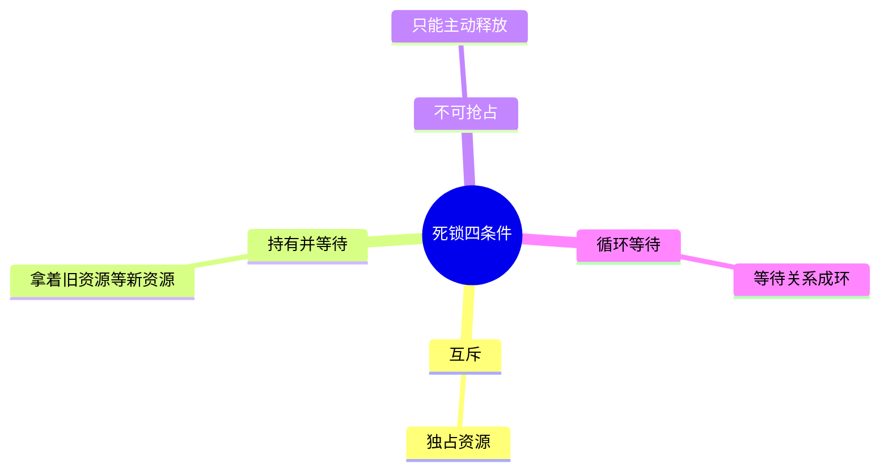
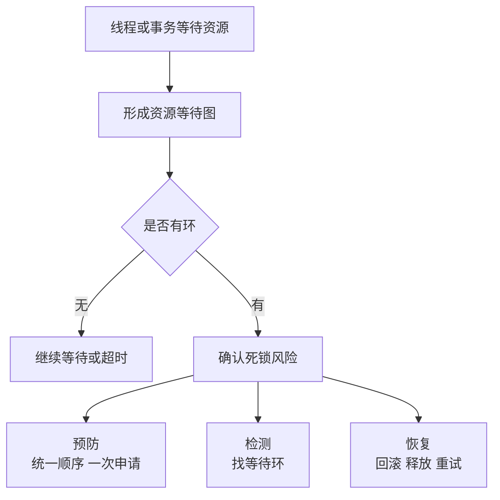

# 05-死锁与资源管理

## 本章目标

死锁不是只会出现在教材里的“两个线程两把锁”。真实工程中，线程池、连接池、数据库事务、微服务调用也会形成资源等待环。本章讲死锁四条件和工程处理方式。

## 什么是死锁

死锁是多个执行流互相等待对方持有的资源，导致所有参与者都无法继续。

典型例子：

```text
线程 A：持有 L1，等待 L2
线程 B：持有 L2，等待 L1
```

这时 A 和 B 都不会继续执行，也不会释放已有锁。

## 死锁四个必要条件

### 1. 互斥

资源一次只能被一个执行流持有。例如互斥锁、数据库行锁、独占文件锁。

### 2. 持有并等待

执行流已经持有一些资源，同时还在等待新的资源。

### 3. 不可抢占

资源不能被外部强行夺走，只能由持有者主动释放。

### 4. 循环等待

存在等待环：A 等 B，B 等 C，C 等 A。

破坏任意一个条件，都可以预防死锁。

## 资源等待图

可以把线程和资源画成图：

```text
T1 持有 L1，等待 L2
T2 持有 L2，等待 L3
T3 持有 L3，等待 L1
```

这形成环，就可能死锁。数据库死锁检测就是维护类似等待图，发现环后回滚一个事务。

## 死锁预防

预防是在设计阶段破坏死锁条件。

### 统一锁顺序

规定所有代码都必须按相同顺序获取锁。例如总是先获取账户 ID 小的锁，再获取账户 ID 大的锁。

这样可以破坏循环等待。

### 一次性申请资源

执行前一次性拿到所有资源，破坏持有并等待。缺点是资源利用率低，可能增加等待时间。

### 允许抢占或回滚

数据库事务可以回滚，某种意义上就是抢占资源。普通线程锁通常不能强制抢占。

## 死锁避免

避免是在分配资源前判断是否会进入不安全状态。银行家算法是经典例子，但工程中不常完整使用，因为它要求提前知道最大资源需求。

工程中更常见的是：

- 限制并发数。
- 资源池分级。
- 避免嵌套获取多个稀缺资源。
- 请求进入前做准入控制。

## 死锁检测和恢复

如果无法完全预防，可以允许死锁发生，然后检测和恢复。

数据库常见做法：

1. 事务等待锁。
2. 数据库维护等待图。
3. 发现环。
4. 选择一个事务回滚。
5. 另一个事务继续执行。

普通程序中也可以用 watchdog、锁等待超时、线程 dump 检测问题。

## 活锁和饥饿

- 死锁：大家都不动。
- 活锁：大家都在动，但没有进展。例如两个线程不断互相让路。
- 饥饿：某个线程长期得不到资源。

解决饥饿需要公平队列、优先级老化、资源配额等机制。

## 工程中的资源等待环

真实系统中，死锁不一定表现为“锁”。例如：

```text
请求 A 持有数据库连接，等待线程池任务完成
线程池任务等待另一个数据库连接
连接池已满，所有连接都被请求持有
```

这也是资源等待环。

微服务中也可能：

```text
服务 A 等服务 B
服务 B 等服务 C
服务 C 回调服务 A
```

如果没有超时和熔断，就可能形成分布式等待。

## 工程建议

1. 所有锁定义全局顺序。
2. 不要持锁做 I/O 或远程调用。
3. 锁等待、连接等待、RPC 都要有超时。
4. 数据库事务尽量短。
5. 失败要可重试，操作要幂等。
6. 资源池要有监控：使用率、等待数、等待时间。
7. 定期用压测验证高并发下是否出现等待环。

## 实践任务

画出你熟悉系统的一次请求处理路径，标出它持有的资源：

- 线程。
- 数据库连接。
- Redis 连接。
- 文件 fd。
- 锁。
- 下游 RPC。

尝试找出可能的等待环。

## 自测题

1. 死锁四条件分别是什么？
2. 为什么统一锁顺序能预防死锁？
3. 数据库为什么可以通过回滚恢复死锁？
4. 微服务中如何避免资源等待环？
5. 活锁和死锁有什么区别？

## 补充深入讲解

## 从零开始理解：死锁不是“程序卡住”这么简单

程序卡住可能有很多原因：CPU 死循环、I/O 卡住、线程池满、GC 停顿、死锁。死锁的特点是存在一个等待环，每个参与者都在等别人释放资源，而别人也在等它。

判断死锁时，不要只看“卡住”，要找资源等待关系。

## 一个银行转账例子

两个线程同时转账：

```text
线程 A：账户 1 → 账户 2
线程 B：账户 2 → 账户 1
```

如果 A 先锁账户 1，再等账户 2；B 先锁账户 2，再等账户 1，就死锁。

解决方式是统一顺序：永远先锁账户 ID 小的，再锁 ID 大的。这样不会形成环。

## 数据库死锁为什么更常见

数据库事务会持有行锁、表锁、间隙锁。两个事务访问相同数据但顺序不同，就可能死锁。数据库通常能检测等待图并回滚一个事务。所以应用必须把死锁当作可重试错误处理，而不是认为它永远不该发生。

## 微服务里的资源死锁

微服务没有显式锁，也可能形成等待环。例如线程池任务持有数据库连接等待另一个异步任务，而那个异步任务也需要数据库连接。连接池满后所有任务互相等待。

解决思路是：资源池隔离、超时、限流、不要持有稀缺资源等待下游。

## 进一步案例：转账系统如何设计避免死锁

转账需要同时修改两个账户。如果每个账户一把锁，必须固定加锁顺序。可以按账户 ID 排序：先锁小 ID，再锁大 ID。这样所有线程的等待方向一致，不会形成环。

如果转账涉及数据库事务，也应保持 SQL 访问顺序一致。比如批量更新多行时先按主键排序，再逐行更新。否则两个事务访问相同行但顺序不同，就可能死锁。

## 进一步案例：死锁恢复为什么需要幂等

如果事务因死锁被数据库回滚，应用通常要重试。但重试安全的前提是操作幂等，或者有唯一请求号防止重复扣款、重复发货。否则“处理死锁”可能引入重复业务副作用。OS 和数据库层的死锁恢复，最终也会影响业务设计。

## 思维导图

> 记忆建议：死锁不是“慢”，而是等待环；破坏四条件之一即可预防。

### 1. 死锁四条件



### 2. 从等待到恢复



### 3. 工程资源等待环


