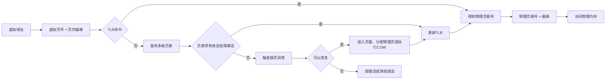
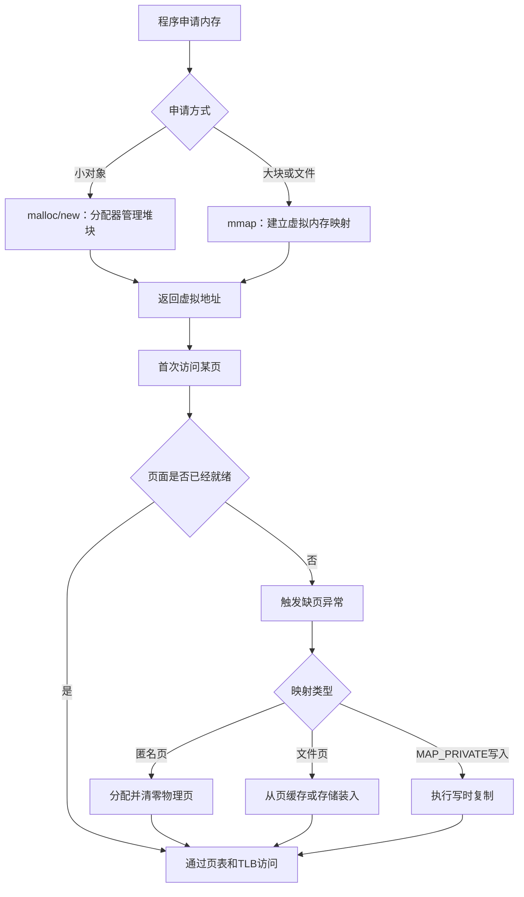

# 06-内存管理

## 本章目标

内存管理是操作系统最核心、也最容易被各种地址和抽象混淆的部分。本章围绕一个主线展开：**程序使用的是虚拟地址，操作系统和硬件负责把虚拟地址映射到物理内存，并在需要时完成分配、保护、共享和回收。**

学习完本章后，应当能够回答以下问题：

- 为什么用户程序不能直接使用物理地址？
- 虚拟地址、物理地址、虚拟页和物理页框分别是什么？
- 分段和分页解决了什么问题？二者有什么差异？
- 页表、页表项、多级页表和 TLB 分别负责什么？
- `malloc`、`new`、`brk`、`mmap` 和物理页之间是什么关系？
- 为什么申请了很多内存后，RSS 不一定立刻增加？
- 为什么 `free` 或 `delete` 之后，进程的 RSS 不一定下降？
- 栈帧、线程栈、栈溢出和保护页之间有什么联系？
- 内部碎片、外部碎片、分页和用户态分配器之间如何相互影响？

> **核心记忆**：虚拟地址给程序使用，页表负责翻译，物理页由内核管理；“申请了地址空间”不等于“已经占用了同样大小的物理内存”。

## 为什么不能直接使用物理内存

如果每个程序都直接使用物理地址，操作系统就很难同时保证隔离、安全和灵活性。主要问题有以下几类。

### 1. 不安全：进程之间无法隔离

假设程序 A 获得了地址 `0x1000`，程序 B 也想使用这个地址。如果这个地址直接表示物理位置，那么 A 只要把数据写入 `0x1000`，就可能覆盖 B 的代码或数据：

```text
程序 A 写入 0x1000 ──┐
                     ├── 直接修改同一块物理内存
程序 B 使用 0x1000 ──┘
```

现代系统要求用户进程不能随意访问其他进程的内存，也不能直接访问内核内存。硬件中的地址翻译和权限检查机制会在每次内存访问时检查：

- 这个虚拟页是否存在映射；
- 当前进程是否有权访问它；
- 当前操作是读、写还是执行；
- 当前代码运行在用户态还是内核态。

如果权限不满足，CPU 会阻止访问并触发异常，而不是允许程序静默破坏其他内存。

### 2. 不灵活：程序必须知道自己的物理位置

如果程序使用物理地址，程序装载到哪里就必须提前确定，或者程序启动时需要进行复杂的重定位。这样会导致：

- 程序不能方便地使用任意物理空闲区域；
- 多个程序容易发生地址冲突；
- 进程换出、换入或物理内存重新组织会更加困难；
- 程序无法简单地把同一个虚拟地址当作自己的固定地址使用。

引入虚拟地址后，程序可以认为自己拥有一套从低地址到高地址的连续地址空间。操作系统可以把这些虚拟页映射到任意可用的物理页框，程序不需要知道真实物理位置。

### 3. 难管理：连续物理空间很难满足所有请求

物理内存可能已经被许多进程和内核对象分割成不同大小的区域。即使空闲内存总量足够，也可能找不到一整块连续空间来满足某次分配。

分页机制允许一个进程看到连续的虚拟地址，而这些虚拟页在物理内存中可以分散：

```text
虚拟地址空间：
虚拟页 0 ──→ 物理页框 9
虚拟页 1 ──→ 物理页框 2
虚拟页 2 ──→ 物理页框 15
虚拟页 3 ──→ 物理页框 4
```

因此，程序可以获得逻辑上的连续空间，而物理内存不必连续。

### 4. 不能直接实现按需分配和换页

虚拟内存还允许操作系统延迟实际物理页分配。程序先获得一段虚拟地址范围，只有真正访问某个页面时，操作系统才可能为该页面分配物理页、从文件或页缓存装入内容，或者从交换空间恢复内容。

这使得操作系统能够：

- 把暂时不用的页面换出或回收；
- 让多个进程共享代码页和只读数据页；
- 通过写时复制（Copy-on-Write，COW）减少进程复制的成本；
- 对文件进行内存映射；
- 对不同内存区域设置不同的读、写、执行权限。

## 虚拟地址空间

进程执行时使用的是**虚拟地址（virtual address）**。CPU 中的内存管理单元（MMU）根据当前进程的页表，把虚拟地址转换为物理地址。大致过程如下：

```text
程序生成虚拟地址
        ↓
CPU/MMU 查询 TLB 或页表
        ↓
得到物理页框号
        ↓
物理页框号 + 页内偏移 = 物理地址
        ↓
访问物理内存、页缓存或其他后备对象
```

同一个虚拟地址在不同进程中可以有不同含义：

```text
进程 A：虚拟地址 0x400000 ──→ 物理页框 X
进程 B：虚拟地址 0x400000 ──→ 物理页框 Y
```

进程 A 和进程 B 都可以把 `0x400000` 当作自己的地址，但它们通常访问的是不同的物理页面。这带来两个重要性质：

1. **地址空间隔离**：进程 A 不能仅凭一个虚拟地址访问进程 B 的页面。
2. **地址空间抽象**：程序的链接地址和运行时虚拟地址不必直接对应某个固定物理位置。

### 虚拟地址、物理地址与指针

C/C++ 程序中的普通指针通常保存的是虚拟地址，而不是物理地址。用户程序不能通过把一个普通指针强制转换为整数，就得到可以直接访问的物理位置。

例如：

```cpp
int value = 42;
int* p = &value;
```

这里的 `p` 指向当前进程地址空间中的某个虚拟地址。这个地址如何映射到物理页框，由操作系统页表和硬件共同决定。不同进程中的 `p` 即使数值相同，也不代表指向同一个物理对象。

### 虚拟地址空间不等于已经使用的物理内存

进程可以拥有很大的虚拟地址空间，但其中许多区域可能只是预留、尚未建立物理页映射，或者对应文件和共享内存等后备对象。因此需要区分：

- **虚拟地址空间大小**：进程可以寻址或已经建立映射的地址范围；
- **已提交内存**：系统根据过量分配策略承诺未来可能提供的内存；
- **RSS（Resident Set Size）**：当前驻留在物理内存中的一部分页面；
- **共享页面**：多个进程共同映射的物理页面，统计时可能在不同指标中重复计算；
- **页缓存**：文件内容在内存中的缓存，不等于进程私有匿名堆对象。

## 地址空间布局

> 下面是 Linux/x86-64 下常见的简化布局。实际地址会受到 CPU 架构、内核配置、编译器、链接方式、PIE 以及 ASLR（地址空间布局随机化）的影响。不要把这些区域的具体地址当成固定值。

进程看到的是自己的**虚拟地址空间**。这些区域在虚拟地址上通常按下面的方式分布，但它们对应的物理页不一定连续，而是由页表分别映射到物理内存中的不同页框。中间还可能存在大量未映射的地址空洞。

```text
高地址
┌────────────────────────────────────┐
│ Stack 栈                            │
│ 函数调用、局部变量、返回信息        │
│ 许多体系结构中通常向低地址增长      │
├────────────────────────────────────┤
│ mmap 区                             │
│ 动态库、文件映射、匿名映射、线程栈  │
├────────────────────────────────────┤
│ Heap 堆                             │
│ malloc、new 分配的动态对象          │
│ 传统情况下通常向高地址增长          │
├────────────────────────────────────┤
│ BSS                                 │
│ 未初始化或零初始化的全局/静态变量   │
├────────────────────────────────────┤
│ Data                                │
│ 已初始化的可写全局/静态变量         │
├────────────────────────────────────┤
│ .rodata                             │
│ 字符串字面量、只读常量              │
├────────────────────────────────────┤
│ Text                                │
│ 程序机器指令、函数代码              │
└────────────────────────────────────┘
低地址
```

这个图是便于理解的模型，而不是内核内部唯一的布局规则。动态链接器、共享库、线程局部存储（TLS）、`vvar`、`vdso`、堆外匿名映射以及 JIT 代码等都可能出现在真实进程中。

### 1. Text：代码段

Text 段保存编译后生成的机器指令。例如：

```cpp
int add(int a, int b) {
    return a + b;
}
```

函数 `add` 对应的机器指令通常位于 Text 段。代码段典型的权限是 `r-x`：

- `r`：可读；
- `-`：不可写；
- `x`：可执行。

代码段不可写可以减少程序意外修改自身指令的风险，也有助于实现 W^X（Writable XOR Executable）等安全策略。一个程序的多个进程实例通常可以共享同一份代码物理页，因为代码页一般不会被修改。

如果程序采用 PIE（Position Independent Executable）并启用 ASLR，Text 段的虚拟起始地址可能每次运行都不同。地址发生变化并不影响程序执行，因为动态链接和重定位机制会处理相关引用。

### 2. `.rodata`：只读数据段

`.rodata` 保存程序运行期间通常不会修改的数据，例如：

```cpp
const char message[] = "hello";
const int table[] = {1, 2, 3, 4};
```

字符串字面量也通常位于只读数据区域：

```cpp
const char* text = "hello";
```

这里需要区分两个对象：

- 字符串内容通常位于 `.rodata`；
- 如果 `text` 是全局指针变量，指针本身通常位于可写的 Data 段；如果 `text` 是局部指针变量，指针本身通常位于栈或寄存器中。

`.rodata` 的典型权限是 `r--`。通过非法方式修改其中的数据属于未定义行为，实际运行中可能触发段错误，但不能把“恰好没有立即崩溃”当成合法行为。

### 3. Data：已初始化的全局和静态变量

Data 段保存具有静态存储期、并且具有非零初始值的可写变量：

```cpp
int global_value = 42;
static int counter = 10;
```

这类变量在程序启动时就存在，一直存在到进程结束，通常具有 `rw-` 权限：

```cpp
int global_value = 42;

int main() {
    global_value = 100;
}
```

修改 `global_value` 时，修改的就是 Data 段中的内容。多个进程运行同一个程序时，Data 段的初始页面可能暂时共享；某个进程尝试写入共享页面时，操作系统可以通过 COW 为它建立私有物理页。

### 4. BSS：未初始化或零初始化的数据

BSS 段保存未显式初始化，或者被初始化为零的全局变量和静态变量：

```cpp
int global_count;          // 自动初始化为 0
static int buffer[1024];   // 自动初始化为 0
static int value = 0;      // 通常位于 BSS
```

BSS 通常也具有 `rw-` 权限。它与 Data 段的区别可以简单理解为：

```cpp
int a = 123;  // 通常位于 Data
int b;        // 通常位于 BSS
```

可执行文件通常不需要保存大量连续的零字节，只需要记录 BSS 的大小。程序加载时，加载器为它建立相应的虚拟地址区域，并保证读取结果为零。大数组只有在实际访问相应页面时，才可能触发缺页异常并分配物理页。

需要注意，BSS、Data、Text 是可执行文件和链接布局中的概念，而进程运行时看到的是多个具有不同权限和后备对象的虚拟内存区域。二者有关联，但不能简单地认为每个段都必然对应一段连续物理内存。

### 5. Heap：堆区

Heap 用于保存运行期间动态申请的对象：

```cpp
int* p = new int(42);
int* array = new int[100];

// 使用完毕后释放
delete p;
delete[] array;
```

在现代 C++ 中通常更推荐使用 RAII 和智能指针：

```cpp
#include <memory>

auto p = std::make_unique<int>(42);
```

堆对象和指针变量的位置可能不同：

```cpp
void function() {
    int* p = new int(42);
}
```

这里：

- 指针变量 `p` 是局部变量，通常位于栈上，也可能被优化到寄存器中；
- `new int(42)` 创建的整数对象位于动态分配区域，通常由堆分配器管理。

类似地：

```cpp
void f() {
    std::vector<int> values(1000);
}
```

`vector` 对象本身通常是局部对象，而它内部用于保存 1000 个 `int` 的动态数组通常位于堆上。变量保存的位置和变量指向的数据的位置不是一回事。

`malloc` 和 `new` 不一定每次都直接进入内核。用户态分配器会维护空闲块、大小类别、缓存和元数据，底层可能通过 `brk/sbrk` 扩展传统堆，也可能通过 `mmap` 建立新的匿名映射：

- 小对象通常从已经取得的堆空间中切分；
- 大对象可能直接使用 `mmap`；
- 释放小对象后，空间可能留在分配器内部等待复用；
- 释放大映射时，分配器可能使用 `munmap` 归还地址空间，但具体行为取决于实现和阈值。

传统布局中，堆顶通常可以通过 `brk` 向高地址扩展，但这不是 C++ 标准保证的规则，也不是现代分配器唯一的内存来源。

调用 `free` 或 `delete` 后，内存可能只是回到用户态分配器，并未立即归还操作系统。因此 RSS 不下降不一定意味着内存泄漏：这块内存可能已经不再属于任何活跃对象，但仍可被后续分配复用。

### 6. mmap 区：灵活的内存映射区域

mmap 区通常位于堆和栈之间，但它不是一个单一的连续区域，而是由多个虚拟内存映射组成。常见用途包括：

- **动态库**：如 `libc.so`、`libstdc++.so`，通常会分别映射代码、只读数据和可写数据；
- **文件映射**：把文件的一部分映射到虚拟地址空间，程序可以像访问数组一样访问文件内容；
- **匿名映射**：分配大块内存、创建共享内存或建立线程栈；
- **大对象分配**：用户态分配器可能用 `mmap` 分配较大的对象，释放时使用 `munmap` 解除映射；
- **线程局部存储和运行时区域**：线程库及动态链接器可能建立额外映射。

文件映射不代表文件内容已经全部读入物理内存。首次访问某个页面时，可能触发缺页异常，操作系统再从页缓存中取得数据，必要时从存储设备读取。主线程以外的线程栈也往往通过 `mmap` 分配，因此线程数量过多会增加虚拟地址空间、页表和运行时元数据开销。

### 7. Stack：栈区

栈用于保存函数调用过程中需要的临时信息，典型内容包括：

- 局部变量；
- 函数参数；
- 返回地址；
- 保存的寄存器；
- 临时计算数据；
- 函数调用帧以及对齐填充。

例如：

```cpp
int add(int a, int b) {
    int result = a + b;
    return result;
}
```

调用 `add` 时，系统可能建立对应的栈帧。现代编译器会进行寄存器分配、内联、尾调用优化和栈帧消除，参数和局部变量也可能只存在于寄存器中。因此，“局部变量一定在栈上”只是便于理解的近似说法，不是 C++ 标准的保证。

在很多体系结构中，栈通常向低地址增长，而传统堆通常向高地址增长：

```text
高地址
┌──────────────┐
│ 旧栈帧       │
├──────────────┤
│ 当前栈帧     │
└──────↓───────┘
低地址
```

每个线程通常拥有独立的栈，但线程之间共享 Text、Data、BSS、Heap 以及大部分 mmap 映射。函数返回后，普通局部变量的生命周期结束，因此不能返回局部变量的地址：

```cpp
int* bad() {
    int value = 42;
    return &value;  // 错误：函数返回后 value 的生命周期已经结束
}
```

栈空间通常有大小限制。递归过深、局部数组过大或线程栈配置过小都可能造成栈溢出。操作系统通常会在栈附近设置保护页（guard page），栈越过保护页时会触发异常。

### 8. 各区域对比

| 区域 | 典型内容 | 典型权限 | 生命周期 | 物理页是否必须连续 |
|---|---|---|---|---|
| Text | 函数机器指令 | `r-x` | 进程运行期间 | 否 |
| `.rodata` | 字符串、只读常量 | `r--` | 进程运行期间 | 否 |
| Data | 已初始化的全局/静态变量 | `rw-` | 进程运行期间 | 否 |
| BSS | 未初始化或零初始化的全局/静态变量 | `rw-` | 进程运行期间 | 否 |
| Heap | `malloc`、`new` 分配的对象 | `rw-` | 直到释放 | 否 |
| mmap | 动态库、文件映射、匿名映射 | 依具体映射而定 | 直到解除映射 | 否 |
| Stack | 局部变量、调用栈帧 | 通常 `rw-` | 线程运行期间 | 否 |

表中的“典型权限”是常见情况，不是绝对规则。例如 JIT 程序可能在运行时生成代码，某些特殊映射可能具有不同权限，但现代系统通常会尽量避免同一页面同时可写且可执行。

### 9. 一个 C++ 分类示例

```cpp
#include <memory>
#include <vector>

int global_initialized = 42;    // 通常位于 Data
int global_uninitialized;       // 通常位于 BSS
const char message[] = "hello"; // 通常位于 .rodata

void function() {
    int local = 10;              // 通常位于栈，或被优化到寄存器
    static int count;            // 位于 BSS

    int* p = new int(20);        // p 通常在栈上，*p 在堆上
    delete p;

    std::vector<int> values(100); // values 对象通常在栈上，
                                  // 内部元素通常在堆上
}
```

这里最容易混淆的是：**变量本身的位置和变量指向的数据的位置可能不同。**例如 `int* p` 是一个指针变量，指针可以在栈上，但它指向的对象可以在堆上。优化开启后，编译器甚至可能把局部变量放入寄存器，或者完全消除不影响可观察行为的对象。

### 10. 观察实际地址空间

真实进程中还可能存在未映射的空洞、栈保护页、动态链接器映射、线程局部存储（TLS）、`vvar`/`vdso` 等特殊映射，因此实际布局并不是严格的几块连续区域。可以使用下面的命令查看当前 shell 进程的虚拟内存映射：

```bash
cat /proc/$$/maps
```

输出中的每一行通常包括：

```text
起始地址-结束地址  权限  偏移  设备  inode  路径
```

例如，权限字段可能是：

- `r-xp`：私有的可读、可执行映射；
- `rw-p`：私有的可读、可写映射；
- `r--s`：共享的只读映射；
- `---p`：不可访问的私有区域，可能用于保护边界。

其中最后的 `p` 或 `s` 通常表示私有映射或共享映射。带有文件路径的行通常对应可执行文件、动态库或文件映射；没有路径的行可能是匿名映射、堆或栈等区域。`[heap]` 和 `[stack]` 是内核在输出中提供的标记，但真实的匿名映射可能没有这么直观的名称。

最终可以这样记忆：**Text 放代码，Data 和 BSS 放全局/静态变量，Heap 放动态对象，mmap 放各种灵活映射，Stack 放函数调用现场和局部数据；这些都是虚拟地址区域，真正的物理页由操作系统通过页表按需映射。**代码段通常只读可执行，数据段可读写，栈通常可读写但不可执行。

## 分段

分段（segmentation）按照程序的逻辑结构划分内存，例如：

- 代码段；
- 数据段；
- 栈段；
- 只读数据段；
- 其他专用段。

一个逻辑地址可以表示为“段号 + 段内偏移”。段表中保存每个段的基址、长度以及访问权限，地址转换大致是：

```text
逻辑地址 = 段号 + 段内偏移
段表[段号] = 基址、长度、权限
物理地址或线性地址 = 基址 + 段内偏移
```

分段符合程序员对代码、数据和栈的理解，权限也可以按段设置。例如代码段可以设置为可读可执行，数据段可以设置为可读写。但是段大小可变，随着分配和释放，空闲空间容易被切割成许多不连续区域，从而产生外部碎片。

例如，剩余内存总量足够，但没有一块连续空间能容纳新段：

```text
空闲 4 MiB │ 已用 2 MiB │ 空闲 4 MiB │ 已用 2 MiB │ 空闲 4 MiB
```

此时总空闲空间是 12 MiB，但如果必须分配一块连续的 10 MiB 空间，仍然可能失败。

### 分段的历史地位

早期系统和部分体系结构大量依赖分段。现代 x86-64 操作系统通常采用“平坦的线性地址空间 + 分页”的模式，普通用户代码中的段基址和段界限不再承担主要的内存隔离职责，真正细粒度的页面权限和地址映射主要由分页机制完成。不过，x86-64 中的 FS/GS 等寄存器仍可能用于线程局部存储，因此不能简单说现代系统完全没有任何分段相关机制。

## 分页

分页（paging）把虚拟地址空间切成固定大小的页面（page），把物理内存切成同样大小的页框（page frame）。虚拟页可以映射到任意物理页框。

以常见的 4 KiB 页面为例，一个虚拟地址可以拆分为：

```text
虚拟地址 = 虚拟页号 + 页内偏移
                         └── 低 12 位，范围 0～4095
```

页表只负责把虚拟页号翻译成物理页框号；页内偏移保持不变：

```text
虚拟地址 = 虚拟页号 + 页内偏移
虚拟页号 ──→ 页表 ──→ 物理页框号
物理地址 = 物理页框号 + 页内偏移
```

假设页面大小是 4 KiB，虚拟地址为 `0x12345ABC`：

- 页内偏移是低 12 位，即 `0xABC`；
- 虚拟页号是去掉低 12 位后的部分，即 `0x12345`；
- 页表把虚拟页号映射到某个物理页框，例如 `0x8F021`；
- 物理地址由物理页框号和 `0xABC` 拼接得到。

具体的地址位数和页表层级由体系结构决定，不能把这个例子中的位数当成所有平台的固定规则。

### 分页的好处

- **物理内存不需要连续**：连续的虚拟页可以映射到分散的物理页框；
- **减少外部碎片**：分配单位固定，降低了对大块连续物理空间的依赖；
- **支持按需加载**：页面可以在第一次访问时才建立物理映射；
- **支持换页**：暂时不用的页面可以被回收、换出或从文件重新加载；
- **支持共享库**：多个进程可以把相同的代码页映射到各自地址空间；
- **支持 COW**：多个进程可以先共享同一页面，写入时再复制；
- **支持页面级保护**：可以为不同页面设置读、写、执行和用户/内核权限。

### 分页的代价

分页并不是没有成本：

1. 页表本身会占用内存；
2. 地址翻译需要查询 TLB 或页表；
3. 缺页异常会进入内核处理，严重时还可能触发磁盘 I/O；
4. 固定页面大小可能产生页级内部碎片；
5. 大量细碎映射会增加页表、VMA 和内核管理开销。

## 页表

页表记录虚拟页到物理页框的映射。CPU 通常通过某个控制寄存器找到当前进程的顶级页表，随后根据虚拟地址中的不同位段逐级查找。

### 页表项通常包含什么

一个页表项（Page Table Entry，PTE）通常包含：

- **物理页框号**：映射到的物理页面位置；
- **有效位/存在位**：表示映射是否存在或当前是否可直接使用；
- **读/写权限**：页面是否允许写入；
- **用户/内核权限**：用户态代码是否可以访问；
- **执行权限**：是否禁止执行，很多体系结构使用 NX/XD 一类标志；
- **脏位（dirty）**：页面是否被写过，换出或写回时有参考价值；
- **访问位（accessed）**：页面近期是否被访问，页面置换算法可以使用；
- **缓存相关属性**：是否可缓存、缓存类型等；
- **COW 或其他软件管理标志**：有些标志由内核结合硬件能力解释和维护。

不同 CPU 架构的字段名称和具体实现可能不同，但核心思想是一致的：页表不仅负责地址翻译，也承载访问控制和页面状态信息。

### 地址翻译和缺页异常

如果访问的虚拟页没有有效映射，或者访问权限不满足，CPU 会触发异常并转入内核。内核会根据异常原因判断是否可以恢复：

- 如果页面只是尚未装入，内核可能分配物理页或从文件装入页面，然后重新执行这条指令；
- 如果是 `MAP_PRIVATE` 页面第一次写入，内核可能执行 COW；
- 如果是合法的栈自动增长，内核可能扩展栈映射；
- 如果地址越界、映射已解除或权限违反，进程通常会收到 `SIGSEGV` 或其他错误信号。

因此，“缺页异常”不一定表示程序出错。按需分页、文件映射和 COW 都会产生可以正常处理的缺页异常；只有内核无法建立合法访问时，才会表现为程序错误。

## 多级页表

64 位地址空间很大。如果使用单级页表，就需要为整个可能的地址范围准备页表项，即使进程只使用其中很小的一部分，也会浪费大量内存。

多级页表把虚拟地址拆成多个索引：

```text
虚拟地址
├── 顶级页表索引
├── 次级页表索引
├── 更低级页表索引
└── 页内偏移
```

只有当某个地址范围实际被使用时，内核才为对应层级分配下一级页表。例如，一个进程只使用代码、堆和栈三个区域，那么中间的大量空洞不需要建立完整的页表。

### 多级页表如何工作

一次未命中 TLB 的地址翻译可能需要：

1. 根据顶级索引找到下一层页表；
2. 根据下一层索引继续查找；
3. 重复这个过程直到找到最终页表项；
4. 从页表项中得到物理页框号；
5. 把翻译结果放入 TLB；
6. 使用物理页框号和页内偏移访问内存。

多级页表的优点是节省稀疏地址空间的页表内存，缺点是 TLB 未命中时可能需要多次内存访问。实际系统依靠 TLB、页表项缓存以及硬件页表遍历机制降低这部分成本。

## TLB 与性能

TLB（Translation Lookaside Buffer）是 CPU 中用于缓存地址翻译结果的高速缓存。它保存类似下面的信息：

```text
虚拟页号 ──→ 物理页框号 + 权限信息
```

### TLB 命中和未命中

- **TLB 命中**：CPU 直接得到物理页框号，通常不需要逐级访问页表；
- **TLB 未命中**：CPU 需要进行页表遍历，硬件或内核完成翻译后再访问目标数据；
- **页表项无效**：即使完成页表查询，也会触发缺页异常，进入内核处理。

TLB miss 和缺页异常不是同一件事：TLB miss 只表示翻译缓存中没有结果，页表中可能存在有效映射；缺页异常则表示当前访问无法直接完成，可能需要建立映射、加载数据或报告错误。

### 访问模式的影响

大数组顺序访问通常具有较好的空间局部性：相邻元素往往位于相邻地址，访问一页后，后续访问可以复用该页的 TLB 项和 CPU 缓存行。链表或树结构的随机访问则可能跳到分散页面，造成更多 TLB miss 和缓存 miss。

```cpp
// 通常具有较好的空间局部性
for (std::size_t i = 0; i < n; ++i) {
    sum += array[i];
}

// 访问位置可能分散，局部性通常较差
for (Node* p = head; p != nullptr; p = p->next) {
    sum += p->value;
}
```

### Huge Page

Huge Page 使用比普通页面更大的页面粒度。它可以用较少的 TLB 项覆盖更大的地址范围，从而减少 TLB 压力，常见于数据库、虚拟机和大规模内存计算场景。

但 Huge Page 也有代价：

- 分配和释放粒度更大；
- 稀疏访问时可能增加内部碎片；
- 对物理连续性、对齐或预留机制可能有更高要求；
- 页面置换和细粒度保护可能不如普通页面灵活。

因此，是否使用 Huge Page 要根据工作集大小、访问模式、分配方式和延迟目标综合判断。

## 堆和 malloc

`malloc` 是用户态分配器提供的 C 接口，`new` 是 C++ 的动态对象创建表达式。它们都不等价于“每次调用都执行一次内核分配”。典型流程如下：

```text
程序调用 malloc/new
        ↓
用户态分配器检查空闲块和缓存
        ├── 有合适空闲块：直接切分并返回
        └── 没有足够空间：向内核申请更多虚拟内存
                         ├── brk/sbrk 扩展传统堆
                         └── mmap 建立匿名映射
        ↓
返回用户可用的虚拟地址
        ↓
真正访问页面时，才可能分配物理页
```

### `brk/sbrk` 与 `mmap`

- **`brk/sbrk`**：通过移动进程的堆顶来扩展或收缩传统堆，适合管理一大片连续的堆区域；`sbrk` 在现代程序中通常不直接由应用调用，而由分配器或历史接口使用；
- **`mmap`**：建立独立的虚拟内存映射，适合文件映射、匿名大块内存、线程栈和动态库等用途；
- **分配器策略**：分配器会根据请求大小、空闲块、线程并发和回收阈值决定具体路径，因此不能只凭 `malloc` 的调用形式判断底层一定使用哪种系统调用。

### `malloc` 成功后是否已经有物理内存

`malloc` 返回成功通常意味着分配器为调用者保留了一段可用的虚拟地址范围，并满足其运行时策略；它不必意味着所有页面已经驻留在物理内存中。

例如：

```cpp
std::size_t n = 1024ULL * 1024 * 1024;
char* p = static_cast<char*>(std::malloc(n));
if (p == nullptr) {
    // 分配失败
    return;
}

// 只有实际触碰这些页面时，物理内存占用才可能明显增加
for (std::size_t i = 0; i < n; i += 4096) {
    p[i] = 1;
}
```

上面的行为还受到操作系统过量分配策略、资源限制和分配器实现影响。在某些系统或配置下，大额申请可能在第一次写入时才暴露内存不足；在其他配置下，分配阶段就可能失败。因此不能把“惰性分配”理解为所有系统都一定允许任意规模的虚拟内存申请。

### `free` 后为什么 RSS 不一定下降

`free` 的第一层含义是：把这段内存交还给用户态分配器，供后续分配复用。分配器为了性能，通常不会在每次释放后都执行系统调用把页面交还内核。可能出现以下情况：

1. 释放的是小对象，空间进入某个空闲链表或线程缓存；
2. 释放的是大对象，分配器可能通过 `munmap` 归还，也可能暂时缓存；
3. 页面中的其他对象仍然存活，因此无法整页归还；
4. 页面虽然不再包含活跃对象，但分配器认为保留它比频繁申请更高效；
5. 内存已经被标记为可回收，但 RSS 统计和实际回收时机尚未改变。

所以，判断内存泄漏不能只看 RSS 是否在 `free` 后下降，而应结合活跃对象数量、分配器统计、映射信息、堆快照和长期趋势分析。

## 栈

栈（stack）是进程地址空间中专门用于支持函数调用和线程执行的一块区域。它并不只是“存放局部变量的内存”，还保存函数执行过程中需要恢复的上下文。一次函数调用通常会形成一个栈帧（stack frame），函数返回时，当前栈帧被回收，调用者继续执行。

### 栈帧通常包含什么

一个典型的栈帧可能包含以下内容：

- **返回地址**：函数执行完毕后，程序需要根据返回地址回到调用者的下一条指令继续运行。在某些体系结构中，调用指令会自动保存返回地址；在另一些情况下，返回地址可能由调用约定或函数序言代码保存；
- **函数参数**：一部分参数可能通过栈传递，另一部分参数可能通过寄存器传递，具体取决于 CPU 架构和 ABI（应用程序二进制接口）；
- **局部变量**：没有被优化到寄存器中的自动变量通常会放在当前栈帧中。数组、结构体或需要取地址的变量更可能需要占用栈空间；
- **保存的寄存器**：被调用函数如果要修改某些必须恢复的寄存器，就需要先把原值保存起来，返回前再恢复；
- **临时计算数据和对齐填充**：编译器可能为中间结果、临时对象以及满足内存对齐要求而额外分配空间。

例如：

```cpp
int add(int a, int b) {
    int result = a + b;
    return result;
}
```

调用 `add` 时，系统可能建立一个包含参数、`result`、保存信息和返回所需数据的栈帧。不过，现代编译器会进行寄存器分配、内联、尾调用优化和栈帧消除等优化，因此 `a`、`b` 或 `result` 可能始终保存在寄存器中，甚至整个函数都被内联到调用者中。这里的“局部变量在栈上”是便于理解的典型情况，而不是 C++ 标准的硬性保证。

### 每个线程为什么都有自己的栈

同一个进程中的线程共享 Text、Data、BSS、Heap 以及大部分 `mmap` 映射，但每个线程必须有独立的栈。否则，一个线程调用函数、创建局部变量或执行递归时，就会覆盖另一个线程的调用现场。

```text
进程的虚拟地址空间
├── 共享的代码段、全局数据、堆和动态库映射
├── 线程 1 的栈：保存线程 1 的调用链和局部数据
├── 线程 2 的栈：保存线程 2 的调用链和局部数据
└── 线程 3 的栈：保存线程 3 的调用链和局部数据
```

线程栈通常是虚拟地址空间中的独立区域。创建线程时，运行库或操作系统会为它预留或建立一段栈映射，并设置栈大小、访问权限和保护页。栈空间的虚拟地址通常可以预留得比较大，但只有真正访问到的页面才可能分配物理页，因此“栈大小上限”和“当前已经实际占用的物理内存”不是同一个概念。

除了用户栈，每个线程通常还需要内核维护的任务结构、内核栈、线程局部存储和运行库元数据。因此，线程数量过多的代价不只等于“每个线程的用户栈大小”。

### 栈的增长方向和生命周期

在许多体系结构中，栈从高地址向低地址增长，函数调用越深，栈指针通常越向低地址移动；传统堆则通常从低地址向高地址增长。不过，增长方向由具体 ABI 和实现决定，不能当作所有平台的绝对规则。

```text
高地址
┌────────────────────┐
│ 调用者的旧栈帧      │
├────────────────────┤
│ 当前函数的栈帧      │ ← 栈指针通常位于这里
│ 局部变量、保存寄存器 │
└─────────↓──────────┘
低地址
```

普通局部变量的生命周期通常与函数调用绑定：进入函数时创建，离开函数时结束。函数返回后，栈空间只是被栈指针重新调整，原来的字节内容可能暂时还存在，但这些对象的生命周期已经结束，不能再把它们当作有效对象使用。

```cpp
int* bad() {
    int value = 42;
    return &value;  // 错误：函数返回后 value 的生命周期已经结束
}
```

返回局部变量的地址会产生悬空指针。若需要让对象在函数返回后继续存在，应根据所有权和生命周期选择返回值、智能指针、容器或其他适当的堆对象，而不是依赖已经失效的栈对象。

### 栈溢出和线程数量过多

栈溢出（stack overflow）常见于以下情况：

- **递归层数过深**：每次递归调用都可能创建新的栈帧，栈帧不断累积，最终超出线程栈上限；
- **局部对象过大**：在栈上声明很大的数组、结构体或临时缓冲区，一次调用就可能消耗大量栈空间；
- **调用链过深**：即使没有递归，过多层函数嵌套也会累计栈帧；
- **显式动态栈分配**：例如 `alloca` 或某些编译器扩展，会在当前栈上动态占用空间；
- **线程栈配置过小**：线程执行正常调用链也可能越过自己的栈限制。

操作系统通常会在栈的边界附近设置保护页（guard page）。当栈继续增长并访问保护页时，CPU 会触发异常，进程通常收到 `SIGSEGV` 等信号，而不是静默地覆盖相邻区域。保护页能够尽早发现越界，但不能让栈无限增长。

线程数过多的代价包括：

1. **虚拟地址空间开销**：每个线程通常都需要独立的栈映射、保护页以及 TLS 相关区域。即使线程几乎没有运行，预留的大量线程栈也会消耗虚拟地址空间。
2. **实际内存开销**：线程真正使用栈页面后，会产生页表、物理页以及运行库元数据开销。线程栈被访问得越多，常驻内存（RSS）通常越高。
3. **调度开销**：可运行线程越多，调度器需要维护和切换的任务越多。线程切换还可能带来寄存器保存恢复、缓存局部性下降以及同步竞争等成本。
4. **资源管理开销**：线程还会占用线程标识符、内核栈、线程局部数据、文件描述符或其他运行库资源，因此不能只按用户栈大小估算总成本。
5. **同步和尾延迟问题**：线程越多，锁竞争、上下文切换和调度抖动可能越明显，任务虽然被分发了，但整体延迟不一定更低。

实际线程栈的默认大小和物理内存使用量取决于操作系统、线程库、架构和配置。高并发场景中，通常要根据调用深度合理设置线程栈大小，并优先使用线程池、异步 I/O 或事件驱动模型，避免为大量短任务创建大量长期存活的线程。对于很大的缓冲区，也应考虑放到堆上或使用专门的缓冲区池，而不是直接放在栈上。

## mmap

`mmap` 是一种把文件或匿名内存映射到进程虚拟地址空间的机制。映射成功后，内核会返回一段虚拟地址，程序可以像访问普通内存一样通过指针读写这段区域；解除映射时使用 `munmap`。

更准确地说，`mmap` 建立的是“虚拟地址范围与某种后备对象之间的关系”，并不意味着整个范围已经立刻分配了连续的物理内存。后备对象可能是普通文件、匿名内存、共享内存对象或其他内核支持的对象。

一个简化的接口形式如下：

```c
void *mmap(void *addr, size_t length,
           int prot, int flags, int fd, off_t offset);
```

常见参数含义包括：

- `addr`：期望的地址提示。传入 `NULL` 时通常由内核选择地址；除非使用特殊标志，否则它通常只是提示而不是强制要求；
- `length`：映射长度，内核通常按页面粒度进行管理；
- `prot`：访问权限，如 `PROT_READ`、`PROT_WRITE`、`PROT_EXEC`；
- `flags`：映射方式，如 `MAP_PRIVATE`、`MAP_SHARED`、`MAP_ANONYMOUS`；
- `fd` 和 `offset`：文件映射时指定文件描述符和文件偏移；匿名映射通常不依赖具体文件；
- 返回值：成功时返回映射起始地址，失败时返回 `MAP_FAILED`，不能只判断是否为 `NULL`。

### mmap 的主要用途

#### 1. 加载动态库

动态链接器可以使用文件映射把共享库的不同部分装入进程地址空间。动态库的代码段通常以只读可执行权限映射，只读数据以只读权限映射，可写数据则建立可写映射。

多个进程使用同一个动态库时，代码和只读页面通常可以共享物理页，从而节省内存。可写数据页面则需要遵守进程私有性，修改后可能产生私有副本。

#### 2. 文件映射读写

文件映射可以把文件的一部分直接映射为内存区域：

```c
void *p = mmap(NULL, length, PROT_READ | PROT_WRITE,
               MAP_SHARED, fd, 0);
```

程序随后可以通过 `((char *)p)[i]` 访问文件内容，不必在用户代码中显式地为每次读写调用 `read` 或 `write`。访问某个页面时，内核可能从页缓存或存储设备装入文件内容；修改后的共享映射页面还需要按照相应策略写回文件。

映射结束后应调用 `munmap`。如果程序需要明确的持久化语义，还要结合 `msync`、文件同步操作以及文件系统语义进行考虑。`munmap` 只表示解除当前进程的映射，不等于把所有修改立刻持久化到磁盘。

`MAP_SHARED` 和 `MAP_PRIVATE` 的主要区别是：

- `MAP_SHARED`：对映射页面的修改可以对其他映射同一文件的进程可见，并可能写回文件；
- `MAP_PRIVATE`：通常采用 COW，进程第一次修改页面时获得自己的私有副本，不会直接修改原文件内容。

文件映射还需要注意文件被截断、其他进程并发修改、映射范围超出文件有效内容以及写回时机等问题。

#### 3. 进程间共享内存

多个进程可以把同一个文件、共享内存对象或其他内核支持的对象映射到各自的虚拟地址空间。若使用 `MAP_SHARED`，它们可以通过共享页面交换数据。

不同进程的虚拟地址通常可能不同，因此共享数据结构中不应直接保存只对某个进程有效的裸指针：

```text
进程 A：共享区域起始地址 0x70000000
进程 B：共享区域起始地址 0x60000000
```

如果共享区域中保存地址 `0x70000100`，这个数值在进程 B 中未必指向同一个位置。更稳妥的做法是保存相对于共享区域起点的偏移量，并在每个进程中用“映射基址 + 偏移量”重新计算地址。

共享内存还必须配合进程间互斥锁、信号量、条件变量、原子操作或其他同步机制，否则多个进程同时读写会产生数据竞争和可见性问题。

#### 4. 分配大块匿名内存

使用 `MAP_ANONYMOUS` 可以建立没有普通文件作为后备对象的内存映射，常用于：

- 大块缓冲区；
- 内存池；
- 共享匿名映射；
- 线程栈；
- 运行时数据结构；
- 自定义分配器的地址空间预留。

匿名页面通常按需分配，首次写入时才建立可写的私有物理页。很多用户态内存分配器会对较大的对象直接使用 `mmap`，而小对象则从已经取得的堆区域中切分。

#### 5. 建立特殊用途的映射

线程库可以通过 `mmap` 建立线程栈，程序也可以使用它实现环形缓冲区、稀疏数据结构、按需加载区域或自定义内存分配器。映射的权限还可以通过 `mprotect` 调整，因此可以在数据区和不可访问区域之间设置保护边界。

改变权限时应遵循最小权限原则，并注意修改页权限可能需要刷新或同步相关的 TLB 缓存。不要为了方便而长期创建同时可写、可执行的映射。

### mmap 与物理内存和缺页异常

`mmap` 不代表数据立刻全部位于物理内存中。调用成功后，进程通常先得到一段虚拟地址范围以及对应的虚拟内存区域（VMA）描述；当 CPU 第一次访问某个尚未建立物理映射的页面时，会触发缺页异常，内核再根据映射类型处理：

- 文件映射页面可能从页缓存中取得，必要时再从磁盘读取文件内容；
- 匿名映射页面可能分配一个新的物理页，并按要求初始化为零；
- 写入 `MAP_PRIVATE` 页面时，可能触发写时复制，为当前进程建立私有页面；
- 如果访问违反 `prot` 权限、超出映射范围或映射已经被解除，则可能收到段错误。

如果所需数据已经在内存或页缓存中，这类缺页处理可能只需要建立页表映射，通常称为 **minor fault**；如果必须访问存储设备，延迟会更高，通常称为 **major fault**。因此，映射大小、实际触碰的页面数量、访问顺序和文件是否在页缓存中，都会影响实际 RSS、缺页次数和 I/O 延迟。

可以用下面的关系理解 `mmap` 的几个阶段：

```text
调用 mmap
   ↓
建立虚拟地址范围和 VMA 映射描述
   ↓
程序访问某个页面
   ↓
触发缺页异常（如果该页尚未就绪）
   ↓
装入文件页或分配匿名物理页，并更新页表
   ↓
继续执行原来的内存访问
```

因此，`mmap` 可能让虚拟内存大小（VSS 或 VmSize）先增加，而 RSS 只有在页面实际被访问并驻留后才明显增加。页面在内存压力下也可能被回收，之后再次访问可能再次触发缺页处理。

### mmap 的使用边界

`mmap` 以页面为基本管理粒度，映射长度和文件偏移通常需要满足页面对齐等约束。映射过多会增加 VMA、页表和内核管理元数据的开销；频繁建立和解除大量映射也会产生系统调用、页表维护和 TLB 失效等成本。

文件映射还要注意：

- 文件截断后访问超出文件当前有效内容的区域可能触发 `SIGBUS`；
- 映射权限必须与文件打开方式以及内核限制相匹配；
- `MAP_SHARED` 的可见性和持久化不是同一个概念；
- 多进程并发修改需要额外的同步协议；
- 映射生命周期必须长于所有仍在使用其中地址的代码。

所以，mmap 不是“完全没有 I/O 的读写方式”，而是把一部分 I/O 和页面管理延迟到内存访问过程中。

## 内存碎片

内存碎片是指由于分配粒度、对象生命周期和空闲区域分布等原因，部分内存无法被有效利用。讨论碎片时要先明确层次：

- 用户态堆分配器管理的是可变大小的对象；
- 操作系统分页管理的是固定大小的页面；
- 物理内存分配器管理的是页框，某些内核用途还要求连续页框；
- 文件和页缓存又有自己的缓存回收和布局问题。

不同层次的“碎片”表现并不完全相同。

### 内部碎片

**内部碎片（internal fragmentation）**是指已经分配给某个请求的内存块大于程序实际需要的大小，多出来的空间位于已分配块内部，通常不能直接分给其他对象。

例如，程序只申请 13 字节，但分配器为了满足 8 字节对齐，可能把它放入 16 字节或更大的大小类别中；此外，分配块还可能需要保存块大小、空闲链表指针、边界标记或安全检查区域等元数据：

```text
用户请求：13 字节
对齐后的数据区：16 字节
再加上分配器元数据和边界填充
实际占用：可能明显大于 16 字节
```

分页也会带来页级内部碎片。假设页面大小为 4 KiB，即使程序只使用页面中的几个字节，操作系统通常也要以整个页面为单位建立映射和管理物理页。一个对象如果跨越多个页面，最后一个页面中没有使用的部分就可能成为页级内部碎片。Huge Page 的粒度更大，可能减少 TLB miss，但在对象较小或访问稀疏时也可能放大内部碎片。

### 外部碎片

**外部碎片（external fragmentation）**是指空闲内存分散在多个彼此不相邻的小区域中。所有空闲区域加起来的总容量可能足够，但因为缺少一块连续的空闲空间，仍然无法满足某次分配请求。

```text
空闲 2 KiB │ 已用 │ 空闲 2 KiB

空闲总量 = 4 KiB
但申请一块连续的 3 KiB 空间可能失败
```

在传统的连续内存分配中，外部碎片尤其明显。分配器可以通过以下方式缓解：

- 合并相邻空闲块；
- 分割过大的空闲块；
- 按大小类别管理空闲块；
- 重新组织对象；
- 对可移动对象进行内存紧缩。

但合并只有在空闲块相邻时才有效，紧缩还可能需要移动对象；如果程序保存了裸指针，移动对象会带来额外的实现复杂度。C/C++ 通常不能随意移动已经暴露给程序的对象地址，这也是通用堆分配器难以彻底消除外部碎片的原因之一。

### 分页如何影响碎片

分页把虚拟内存和物理内存切成固定大小的页面和页框。一个进程需要连续的虚拟地址范围时，对应的物理页框可以分散在不同位置，因此物理内存不必提供一整块连续区域。这使分页能够显著减少“因为物理空间不连续而无法分配”的外部碎片问题。

但分页并不会消除所有碎片：

- 页面大小固定，会产生页级内部碎片；
- 页表本身也要占用内存；
- Huge Page、DMA 或某些内核分配仍可能要求物理页框满足更严格的连续性或对齐条件；
- 虚拟地址空间中仍可能有许多未映射的空洞；
- 用户态分配器在页面之上切分小对象时，仍会产生自己的内部碎片和外部碎片。

因此，“分页减少外部碎片”更准确地说是：**分页降低了对大块连续物理内存的依赖，而不是让所有层次的内存都没有碎片。**

### 用户态分配器、小对象碎片和 arena

`malloc`、`new` 等接口通常不是直接为每个对象单独向内核申请一页。用户态分配器会先通过 `brk` 或 `mmap` 获取较大的区域，再根据请求大小切分成许多小块。为了快速查找，分配器通常会使用大小类别、空闲链表、bin、线程缓存或类似 slab 的结构。

小对象分配容易出现几类浪费：

1. 请求大小落在某个大小类别的上界，导致分配块比对象实际大小更大；
2. 释放对象后形成的空闲块大小不合适，暂时无法满足其他请求；
3. 分配块之间的元数据、对齐填充和安全检查区域占用额外空间；
4. 一页中只剩少量可用空间，但因为对象大小或布局不匹配，剩余空间难以继续利用；
5. 不同线程或不同 arena 持有的空闲空间不能立即互相复用。

多线程分配器常使用多个 **arena**。不同线程可以在不同 arena 中分配，从而减少所有线程争用同一把全局锁的情况，提高并发性能。但 arena 也可能增加内存保留和碎片：某个 arena 中的空闲空间不一定能立即被另一个 arena 复用；线程结束后，其 arena 中的内存也可能暂时保留在分配器内部，而不是立刻归还操作系统。

这也是为什么 `free` 或 `delete` 之后 RSS 不一定马上下降：内存可能已经归还给用户态分配器，后续分配可以复用，但分配器尚未通过 `munmap`、`madvise` 或其他机制把页面交还给内核。此时需要区分：

- 仍被程序引用的活跃对象；
- 分配器缓存；
- 页级内部碎片；
- 文件页缓存；
- 共享映射；
- 其他运行库和内核映射。

不能仅凭 RSS 是否下降判断是否存在内存泄漏。

### 碎片的影响和缓解方法

碎片可能导致以下问题：

- 实际可用内存小于统计意义上的空闲总量；
- 堆或地址空间占用持续增长，RSS 高于对象实际大小之和；
- 分配和释放需要更多查找、合并或映射操作；
- 大块内存、Huge Page 或特定对齐要求的分配更容易失败；
- 访问页面分散时，缓存和 TLB 局部性变差；
- 内存分配延迟出现长尾，尤其是在高并发或内存压力下。

常见的缓解方法包括：

- 对生命周期相近、大小相近的对象进行批量分配和批量释放；
- 对固定大小的小对象使用对象池、slab 或专用 free list；
- 对可增长数组提前合理 `reserve`，减少反复扩容和旧缓冲区暂存；
- 复用大缓冲区，避免频繁 `mmap`、`munmap` 和大块堆扩展；
- 根据实际并发度控制 arena 和线程数量；
- 使用紧凑的数据结构，减少指针、对齐填充和元数据开销；
- 在需要时使用分配器提供的回收、trim 或 `madvise` 能力，但要权衡系统调用和再次分配的成本。

最终可以这样区分：**内部碎片是“分给了你但你没有用完”，外部碎片是“空闲空间总量够但被分散了”，分页解决的是连续物理内存分配的一部分问题，而用户态分配器还要在页面之上继续管理对象大小、生命周期、空闲块和多线程 arena。**

## 分配与映射关系

把一次内存申请拆成几个层次，就不容易把 `malloc`、`mmap` 和物理内存混为一谈：

```text
应用程序申请对象
        ↓
C/C++ 运行库或用户态分配器
        ├── 从已有空闲块中切分
        └── 向内核申请新的虚拟内存区域
                ├── brk/sbrk 扩展传统堆
                └── mmap 建立独立映射
        ↓
返回虚拟地址
        ↓
第一次读写某个页面
        ↓
缺页处理
        ├── 分配匿名物理页
        ├── 从页缓存或文件装入页面
        ├── 执行 COW
        └── 发现非法访问并报告错误
        ↓
页表建立或更新映射
        ↓
CPU 通过 TLB 快速完成后续地址翻译
```

这个过程至少包含四种不同的对象：

1. **应用对象**：例如一个 C++ `vector`、一块字符缓冲区或一个用户自定义结构体；
2. **分配器块**：分配器为了管理应用对象而划分的区域，可能包含对齐空间和元数据；
3. **虚拟内存区域**：内核记录的连续虚拟地址范围及其权限、共享属性和后备对象；
4. **物理页框**：当前真正承载数据的物理内存页面。

它们的生命周期和大小不一定相同。例如，一个 100 字节的对象可能位于分配器从内核取得的多个页面之一；释放对象后，分配器块可能变为空闲，但所在页面因为同一页上还有其他对象，仍然驻留在 RSS 中。

## 自测题

1. 虚拟地址和物理地址有什么区别？为什么不同进程可以使用相同的虚拟地址？
2. 如果程序看到一段连续的虚拟地址，这些虚拟页对应的物理页框必须连续吗？为什么？
3. 分页为什么能减少外部碎片？分页又会引入什么类型的内部碎片？
4. 分段和分页分别按照什么粒度管理内存？现代 Linux 系统主要依赖哪一种机制完成细粒度的内存映射？
5. 页表项中为什么需要读、写、执行和用户/内核权限等标志？
6. 多级页表为什么能节省内存？它的主要性能代价是什么？
7. TLB miss 和缺页异常有什么区别？
8. `malloc` 后为什么不一定立刻占用同样大小的物理内存？
9. `free` 后 RSS 为什么不一定下降？如何区分分配器缓存和内存泄漏？
10. 为什么每个线程需要独立的栈？线程数过多会造成哪些开销？
11. `MAP_SHARED` 和 `MAP_PRIVATE` 在写入行为上有什么区别？
12. 为什么共享内存中的数据结构通常不应直接保存进程私有的裸指针？
13. 文件映射为什么可能产生 minor fault、major fault，甚至 `SIGBUS`？
14. Huge Page 为什么可以减少 TLB 压力？它可能带来什么代价？
15. 一个指针变量在栈上，是否意味着它指向的数据也在栈上？请结合 `new` 或 `vector` 说明。

## 补充深入讲解

### 从零开始理解：虚拟地址像“门牌号”，物理内存像“真实房间”

程序看到的地址类似门牌号，但这个门牌号不直接等于真实房间。页表就是门牌号到真实房间的映射表。这样每个进程都可以拥有相同门牌号，例如都认为自己的代码从 `0x400000` 开始，但实际对应不同物理内存。

更完整的类比是：

- 虚拟地址：房客使用的门牌号；
- 页表：记录门牌号对应哪个真实房间的管理表；
- 物理页框：真正承载内容的房间；
- 权限位：门禁规则，决定谁能读、写或进入；
- 缺页异常：门牌号有效，但房间还没有准备好，管理员需要先分配或搬运；
- TLB：经常访问的门牌号缓存，避免每次都查完整的管理表。

这样做的好处是隔离和灵活。进程不知道也不需要知道物理内存在哪里，操作系统可以在不修改应用代码的情况下调整页面位置、共享只读内容或回收暂时不用的页面。

### 为什么 malloc 不等于马上占用物理内存

很多系统采用惰性分配。你调用 `malloc(1GB)` 时，分配器或内核可能只是保留一段虚拟地址范围，或者承诺未来可以提供这段内存。只有你真正读写这些页面时，才触发缺页异常并分配物理页。

因此内存排查时要区分：

- **虚拟内存大小（VmSize/VSS）**：映射或保留的虚拟地址范围；
- **实际常驻内存（RSS）**：当前位于物理内存中的页面；
- **分配器保留但未归还的内存**：可能可以被同一进程后续复用；
- **共享页面**：代码段、共享库和共享内存可能被多个进程共同使用；
- **page cache**：文件数据的缓存，与匿名堆对象的含义不同；
- **swap 或压缩内存**：页面可能不在当前物理 RAM 中，但仍属于进程可访问的数据。

仅比较某一时刻的 RSS 不能完整说明进程的内存所有权和真实工作集，需要结合时间趋势、映射明细、分配器统计和访问行为分析。

### 为什么栈很危险

栈自动管理很方便：进入函数时建立栈帧，离开函数时通过调整栈指针快速回收。但栈空间通常有限，且栈上的大对象会直接消耗当前线程的栈预算。

递归过深会不断创建新的栈帧；局部数组过大则可能在一次调用中消耗大量页面；多个线程还会分别拥有自己的栈。保护页可以把越界访问变成较早暴露的异常，但它不能增加栈容量，也不能修复无限递归或错误的生命周期管理。

因此：

- 小型、生命周期严格绑定当前调用的临时对象适合放在栈上；
- 很大的缓冲区、递归深度不可控的数据结构通常不应直接放在栈上；
- 跨函数或跨线程共享的对象应设计清晰的所有权和生命周期；
- 线程数量和每个线程的栈大小应根据实际调用深度与并发模型确定。

### mmap 为什么重要

mmap 是虚拟内存能力的直接体现。它把“连续的虚拟地址范围”和“文件、匿名内存或共享对象”等后备对象联系起来，让程序可以用统一的指针访问方式处理多种资源。

它的价值包括：

- 动态链接器可以映射共享库；
- 数据库可以映射文件或申请大块匿名缓冲区；
- 多进程可以通过共享映射交换数据；
- 分配器可以获得独立的大块地址空间；
- 线程库可以建立线程栈；
- 程序可以通过 `mprotect` 为不同区域设置保护边界。

但 mmap 不代表没有 I/O，只是把 I/O 延迟推迟到页面访问时的缺页异常中。访问模式、页缓存命中率、文件系统和内存压力都会影响最终性能。

### 进一步案例：为什么内存泄漏不一定马上崩

进程泄漏内存时，最开始可能只是 RSS 缓慢上升。只要机器还有可用内存，服务看起来可能仍然正常。随着泄漏扩大，可能出现以下链条：

```text
活跃对象持续增加
        ↓
匿名页和 RSS 缓慢上升
        ↓
可用内存减少，页缓存被挤压
        ↓
缺页和文件 I/O 增多，访问变慢
        ↓
开始回收或使用 swap，尾延迟升高
        ↓
无法满足新的分配请求，最终可能触发 OOM
```

因此，内存问题常常不是突然出现，而是从性能变差开始。监控应关注：

- RSS 和匿名内存的长期趋势；
- `available` 内存；
- minor fault、major fault；
- swap 使用情况；
- 分配失败和 OOM 事件；
- GC 时间或运行时堆大小；
- 活跃对象数量和分配器保留量。

### 进一步案例：为什么大对象分配会抖动

大对象可能走 `mmap`，频繁创建和销毁会不断建立和拆除 VMA、页表以及缺页映射。即使物理内存足够，也可能产生以下成本：

- 反复执行系统调用；
- 维护和合并虚拟内存区域；
- 建立或拆除页表映射；
- 触发 TLB 失效或跨 CPU 的 TLB shootdown；
- 频繁触碰新页面导致缺页延迟；
- 形成难以复用的大小和生命周期模式。

高性能服务常复用大 buffer、使用对象池或预分配内存，减少分配抖动。但对象池也会提高常驻内存，并可能保留峰值容量，所以要结合峰值、平均负载、对象生命周期和回收策略设计，不能简单地认为“池越大越好”。

### 一条完整的排查思路

遇到“内存越来越高”时，可以按以下顺序建立假设：

1. **先区分指标**：确认看到的是 VSS、RSS、PSS、匿名内存、文件页缓存，还是分配器报告的已分配字节；
2. **观察时间趋势**：短时间波动可能是缓存或分配器保留，长期单调增长才更像泄漏；
3. **查看映射来源**：区分堆、匿名 `mmap`、动态库、文件映射、线程栈和共享内存；
4. **检查对象生命周期**：确认容器、缓存、全局对象、回调、线程任务和引用计数是否持续持有数据；
5. **检查分配器行为**：判断内存是活跃对象、空闲缓存、arena 保留，还是页面级碎片；
6. **结合缺页和 I/O**：如果 major fault、swap 或文件 I/O 同时增加，问题可能已经影响性能；
7. **最后再判断是否泄漏**：不能只凭某次 `free` 后 RSS 没降，或某次申请后 RSS 突增，就下结论。

## 思维导图

> 记忆建议：内存管理的核心是“虚拟地址给程序看，物理页由内核管”。

### 1. 进程地址空间


### 2. 虚拟地址翻译



### 3. 分配与映射关系



## 一页总结

```text
物理地址：真实 RAM 中的位置，应用通常不能直接使用
虚拟地址：进程看到的地址，由 MMU 根据页表翻译
分段：按逻辑段管理，大小可变，容易产生外部碎片
分页：按固定页面管理，降低连续物理内存依赖
页表：记录虚拟页到物理页框的映射和权限
多级页表：只为实际使用的地址范围分配页表，节省空间
TLB：缓存地址翻译结果，减少页表查询成本
Heap：用户态分配器管理动态对象，底层可能使用 brk 或 mmap
Stack：保存线程的函数调用现场，空间有限且每个线程独立
mmap：建立文件、匿名内存或共享对象到虚拟地址的映射
内部碎片：分配到的空间大于实际使用量
外部碎片：空闲总量足够，但空闲空间分散不连续
缺页异常：页面未就绪或访问权限不满足时由 CPU 触发
RSS：当前驻留物理内存的页面，不等于所有虚拟地址空间
```
