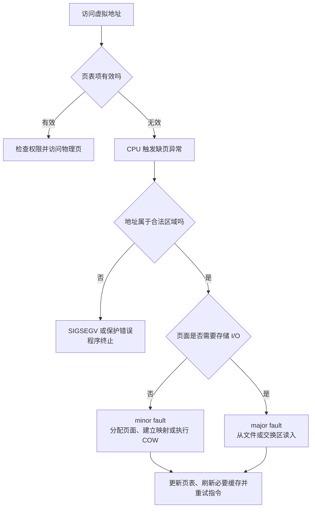
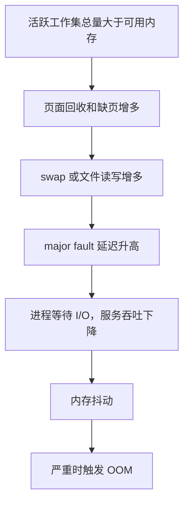

# 07-虚拟内存与页面置换

## 本章目标

上一章介绍了虚拟地址、物理地址以及页表。本章继续回答几个更具体的问题：

- 程序启动时，为什么不需要把全部代码和数据一次性装入物理内存？
- CPU 访问一个尚未映射的虚拟页时，操作系统究竟做了什么？
- 为什么缺页异常不一定表示程序出错？
- `minor fault` 和 `major fault` 有什么区别，为什么后者可能造成严重延迟？
- `fork` 为什么可以很快完成，写时复制又会带来什么隐藏成本？
- 物理内存不足时，操作系统如何选择要换出的页面？
- 工作集、swap、内存抖动和 OOM 之间有什么关系？

本章的核心结论是：**虚拟内存把“地址空间”和“物理内存驻留”解耦了；页面可以按需进入内存，也可以在压力下被换出。缺页不等于错误，真正需要判断的是缺页是否合法、是否需要磁盘 I/O，以及它是否频繁到影响性能。**

---

## 一、虚拟内存和物理内存的关系

进程看到的是自己的虚拟地址空间，而不是物理内存的直接布局。CPU 执行内存访问时，通常经历如下过程：

```text
虚拟地址
  → MMU 根据页表进行地址转换
  → 得到物理地址
  → 访问物理内存中的页面
```

虚拟地址通常可以拆成两部分：

```text
虚拟地址 = 虚拟页号 + 页内偏移
```

页表负责把虚拟页号映射到物理页框，页内偏移在转换过程中保持不变。例如，假设页面大小为 4 KiB：

```text
虚拟地址 = [虚拟页号][12 位页内偏移]
物理地址 = [物理页框号][12 位页内偏移]
```

页表项除了记录物理页框号，还会记录访问权限和状态信息，例如：

- `Present/Valid`：该页面当前是否有有效的物理映射。
- `Read/Write`：是否允许写入。
- `User/Supervisor`：用户态是否可以访问。
- `Accessed/Referenced`：近期是否被访问过，页面置换算法会参考它。
- `Dirty`：页面内容是否被修改过，换出前通常需要写回。
- `COW` 或类似标记：该页面是否处于写时复制状态。

为了避免每次访问都完整遍历页表，处理器还会使用 TLB 缓存近期的地址转换结果。TLB 命中时，地址转换很快；TLB 未命中时，需要进行页表遍历。如果页表项本身无效或权限不允许，CPU 会触发缺页异常或保护异常，由内核进一步处理。

---

## 二、按需分页

### 2.1 基本思想

程序启动时，内核通常不会把可执行文件、动态库、堆和栈的全部内容都立即读入物理内存。它会先建立一个虚拟地址空间，并记录每一段区域的来源和访问权限：

- 代码段通常来自可执行文件或动态库，权限为可读、可执行。
- 数据段可能来自文件，也可能在运行时被修改。
- 堆用于动态内存分配，通常是匿名内存，不对应某个普通文件。
- 栈用于保存函数调用帧和局部变量，也通常是匿名内存。
- `mmap` 区域可以映射文件，也可以申请匿名内存。

只有当程序真正访问某个页面时，内核才根据该页面的类型分配物理页、从文件读取内容，或者建立已有物理页的映射。这种机制叫作**按需分页**（Demand Paging）。

可以把它理解为“访问时才配货”：程序可以先拥有一个很大的虚拟地址空间，但只有实际用到的页面才需要占用物理内存。

### 2.2 一次合法缺页的处理流程

```text
程序访问虚拟地址
  → MMU 查询 TLB 和页表
  → 发现页表项无效，或页面不在物理内存中
  → CPU 触发缺页异常
  → CPU 切换到内核的异常处理流程
  → 内核判断地址是否属于进程合法的内存区域
  → 检查本次访问是否符合权限
  → 确定页面来源和处理方式
      ├─ 分配新的匿名物理页
      ├─ 从文件或动态库读入页面
      ├─ 从交换区读回页面
      └─ 处理写时复制，创建页面副本
  → 更新页表和相关缓存
  → 返回用户态
  → 重新执行导致异常的那条指令
```

重新执行并不是从头运行程序，而是让产生异常的内存访问在映射建立后再次执行。对程序来说，这个过程通常是透明的。

### 2.3 按需分页的优点和代价

**优点：**

1. **减少启动时间**：启动时不用读取暂时不会执行的代码和数据。
2. **节省物理内存**：多个进程可以只驻留各自工作集中的页面。
3. **支持稀疏地址空间**：虚拟地址空间可以很大，但未访问的区域不必对应物理页。
4. **便于共享文件页**：多个进程映射同一动态库时，可以共享同一份只读物理页面。
5. **便于实现内存映射文件和写时复制**。

**代价：**

1. 第一次访问页面会产生缺页处理开销。
2. 如果页面需要从磁盘读取，会出现很高的 I/O 延迟。
3. 页面置换、回收和写回会增加内核管理成本。
4. 工作集超过可用内存时，可能出现频繁换页和内存抖动。

因此，按需分页不是“没有成本”，而是把成本从程序启动阶段延迟到了页面第一次被访问或内存压力发生的时刻。

---

## 三、缺页异常的类型

缺页异常（Page Fault）是 CPU 通知内核“这次内存访问无法直接完成”的机制。它可能代表一次正常的延迟加载，也可能代表真正的非法访问。

### 3.1 合法的匿名页缺页

例如，程序调用内存分配器申请了一大块堆内存。分配器可能先返回一段虚拟地址，但内核并不会立即为每一个页面分配物理页。

当程序第一次写入其中某个页面时：

```text
第一次写入堆页面
  → 页表中还没有有效物理映射
  → 触发缺页异常
  → 内核分配一个物理页
  → 必要时清零该页面，避免泄露其他进程的数据
  → 更新页表并恢复执行
```

这是合法缺页。类似情况也可能发生在栈向下增长、匿名 `mmap` 区域首次使用等场景。

### 3.2 文件映射缺页

代码段、动态库、普通文件映射区域通常有文件作为后备存储。第一次访问某个页面时，内核可以：

1. 找到该虚拟地址对应的文件偏移。
2. 查看页面缓存中是否已经有该文件页。
3. 如果页面缓存中已有，只需建立当前进程的映射，通常属于 `minor fault`。
4. 如果页面不在内存中，从文件读取页面，通常属于 `major fault`。
5. 更新页表并重新执行原指令。

文件页被回收后，若内容未修改，通常可以直接丢弃，未来需要时再从文件读取；这也是文件页和匿名页在回收策略上的重要区别。

### 3.3 写时复制缺页

`fork` 创建子进程后，父子进程一开始可以共享相同的物理页面。为了防止一方修改影响另一方，内核会把共享页面标记为只读，并记录它们处于 COW 状态。

某一方尝试写入时：

```text
父子进程共享物理页
  → 页表将共享页标记为只读/COW
  → 某一方执行写操作
  → CPU 发现写权限不足，触发缺页异常
  → 内核分配新物理页并复制旧内容
  → 修改写入方的页表，使其指向新页并允许写入
  → 另一方继续使用旧页面
```

这种缺页不是非法访问，而是内核实现写时复制的正常步骤。

### 3.4 页面被换出后的缺页

页面可能曾经在物理内存中，但在内存压力下被换到 swap 或其他后备存储。之后进程再次访问该页面时，页表显示它不在当前内存中，内核需要将其读回并重新建立映射。

这种情况通常需要 I/O，因此可能是代价较高的 `major fault`。

### 3.5 非法访问

以下情况可能导致无法恢复的错误：

- 解引用空指针。
- 访问未映射的地址区域。
- 数组越界并跨入不可访问区域。
- 向只读页面写入，且该页面不是可处理的 COW 页面。
- 用户态代码访问仅允许内核访问的页面。
- 访问已经释放或撤销映射的区域。

内核判断该访问不合法时，通常会向进程发送 `SIGSEGV` 等信号，进程可能终止并生成 core dump。需要注意：**触发了 page fault 并不自动等于段错误；是否能够恢复取决于地址是否合法、访问权限是否正确以及页面是否有可用的后备来源。**

---

## 四、minor fault 和 major fault

### 4.1 minor fault

`minor fault`（轻微缺页）通常表示内核不需要从磁盘读取页面。常见情况包括：

- 页面已经在物理内存或页面缓存中，只是当前进程尚未建立映射。
- 访问匿名页时，内核只需分配一个已准备好的物理页。
- 发生写时复制，页面内容来自内存中的已有页面。
- 页表层级尚未建立，但页面内容已经可直接获得。

虽然 minor fault 比 major fault 快很多，但它仍然需要进入内核、检查异常原因、修改页表，并可能引起 TLB 相关操作。高频 minor fault 也可能增加 CPU 开销。

### 4.2 major fault

`major fault`（重大缺页）通常需要真正的存储 I/O，例如：

- 从可执行文件、动态库或 `mmap` 文件读入页面。
- 从 swap 读回匿名页面。
- 页面不在页面缓存中，需要访问磁盘或其他慢速后备存储。

典型流程是：

```text
发生缺页
  → 内核找到页面的后备存储位置
  → 分配或回收一个物理页框
  → 发起文件或交换区读取
  → 当前进程可能睡眠等待 I/O 完成
  → I/O 完成后更新页表
  → 重新执行原指令
```

### 4.3 为什么 major fault 很慢

major fault 的开销不仅是一次函数调用，而可能包括：

- 块设备或网络存储访问。
- I/O 队列等待。
- 文件系统元数据处理。
- 页面分配和回收。
- 其他进程对同一页面的竞争。
- 存储设备自身的寻道、闪存延迟或队列拥塞。

因此，一个平时只需要微秒级处理的请求，如果在关键路径上触发 major fault，可能突然变成毫秒级甚至更高的延迟，形成明显的尾延迟尖峰。

### 4.4 观察缺页指标时要注意

工具统计的 `page-faults`、`minor-faults` 和 `major-faults` 口径可能不同，不能只看一个数字下结论。分析时应结合：

- 缺页发生频率与请求量的关系。
- major fault 是否集中在启动、预热还是稳定运行阶段。
- 磁盘 I/O、swap in/out 是否同步升高。
- 进程 RSS、文件页缓存和 cgroup 内存使用量。
- 延迟尖峰是否与缺页事件在时间上对应。

---

## 五、写时复制 COW

### 5.1 COW 的核心思想

写时复制（Copy-on-Write，COW）是一种“先共享、写入时再复制”的优化。

如果父进程和子进程在 `fork` 后立刻各自复制全部内存，创建进程会非常慢，并且会产生大量不必要的复制，因为很多页面可能永远不会被修改。COW 让父子进程先共享物理页面，只有真正发生写入时才复制对应页面。

```text
fork 前：父进程 → 页面 A

fork 后：父进程 ─┐
                 ├→ 共享页面 A（只读/COW）
       子进程 ───┘

子进程写入后：
父进程 → 页面 A
子进程 → 页面 B（A 的副本）
```

### 5.2 COW 的处理过程

1. `fork` 创建子进程的地址空间描述和页表结构。
2. 父子页表暂时指向相同的物理页。
3. 共享页面被标记为只读或 COW，并增加引用计数。
4. 任一方执行写操作时触发缺页异常。
5. 内核检查该页面确实是合法的 COW 页面。
6. 分配新的物理页，将旧页面内容复制过去。
7. 更新写入方的页表，使其指向新页面并获得写权限。
8. 减少旧页面的引用计数；如果只剩一方使用，后续可以恢复普通写权限。

### 5.3 COW 的优点

- `fork` 初始阶段速度快。
- 没有被修改的页面可以长期共享，节省内存。
- 适合 `fork` 后马上执行 `exec` 的场景，因为旧地址空间可能很快被新程序替换。
- 减少不必要的数据复制和内存带宽消耗。

### 5.4 COW 的隐藏成本

COW 把复制成本推迟到了第一次写入。延迟复制并不等于没有复制，可能出现以下问题：

- 大量写入会触发大量页面复制。
- 复制页面需要 CPU 时间和内存带宽。
- 父子进程同时存在时，内存峰值可能接近原内存加上被修改页面的副本。
- 写入分布越分散，触发复制的页面数量可能越多。
- 页面复制会带来新的内存分配、页表更新和缓存失效开销。

Redis 后台持久化是典型案例。Redis 主进程 `fork` 子进程执行持久化时，父子进程起初共享数据页；父进程继续处理写请求，写到某个共享页面时就会触发 COW。写入量较大时，实际内存峰值可能显著高于平时的 RSS，因此生产环境需要为 COW 预留余量。

---

## 六、页面置换

### 6.1 为什么需要页面置换

物理内存容量有限。当进程需要新的物理页，但当前没有足够的空闲页框时，内核需要回收或置换某些页面：

```text
需要新页面
  → 没有足够空闲页框
  → 选择一个或多个牺牲页面
  → 必要时将脏页面写回后备存储
  → 释放页框
  → 装入新页面
  → 更新页表
```

被选择换出的页面称为牺牲页（victim page）。如果页面是干净的文件页，通常可以直接丢弃，因为文件本身仍然保存着原内容；如果页面是匿名页或被修改过的文件页，通常需要写入 swap 或原文件后备存储。

### 6.2 理想算法 OPT

OPT（Optimal Replacement）每次选择未来最长时间不会被访问的页面换出。它能得到理论上的最低缺页次数，因此常用来评价其他算法。

问题是，操作系统无法准确知道进程未来的访问序列，所以 OPT 不能直接用于真实系统，只能用于教学、模拟和算法对比。

### 6.3 FIFO

FIFO（First-In, First-Out）按照页面进入内存的时间排序，每次淘汰最早进入的页面。

**优点：**实现简单，维护成本低。

**问题：**页面进入内存很早，不代表现在不重要。一个长期活跃的热点页可能因为“年龄大”而被淘汰。FIFO 还可能出现 Belady 异常：增加物理页框后，缺页次数反而增加。

### 6.4 LRU

LRU（Least Recently Used）淘汰最近最少使用的页面，基于局部性原理：最近使用过的页面，短期内再次使用的概率较高；长时间未使用的页面，近期再次使用的概率相对较低。

**优点：**理论上能较好利用程序的时间局部性。

**问题：**精确记录每次访问顺序的成本很高。现代硬件通常不会为操作系统提供一个可直接使用的完整访问时间序列，因此真实系统多采用近似 LRU 的策略。

### 6.5 Clock

Clock 算法使用环形队列和访问位近似 LRU：

1. 页面放在一个环形结构中。
2. 页面被访问时，硬件或内核将访问位设为 1。
3. 置换指针扫描页面。
4. 如果访问位为 1，就清零并跳过，表示给它一次机会。
5. 如果访问位为 0，就优先选择它作为牺牲页。

Clock 不需要精确维护完整的访问顺序，工程实现成本较低。许多实际系统会在类似思想的基础上结合多级 LRU、活跃/非活跃链表以及不同页面类型进行管理。

### 6.6 真实系统考虑的因素

真实的页面回收通常不只看“最近是否访问”，还会考虑：

- 页面是否为脏页，换出是否需要写 I/O。
- 页面是匿名页还是文件页。
- 页面是否被多个进程共享。
- 页面是否属于内核、DMA 或其他不能直接回收的区域。
- 进程或容器的 cgroup 限制。
- NUMA 节点之间的内存分布。
- 页面回收会不会破坏文件缓存的有效性。
- 哪个进程、哪个内存控制组应该承担回收压力。

因此，面试中可以说“实际系统使用近似 LRU 的策略”，但不要简单理解成内核维护一个绝对精确的全局 LRU 链表。

---

## 七、工作集

### 7.1 定义

工作集（Working Set）是进程在某个时间窗口内实际活跃访问的页面集合。它不是进程所有已经分配的虚拟内存，而是近期真正参与计算的那部分页面。

可以用一个抽象表达式表示：

```text
W(t, Δ) = 在时间窗口 [t - Δ, t] 内被访问过的页面集合
```

其中：

- `t` 是当前时刻。
- `Δ` 是观察窗口大小。
- `W(t, Δ)` 是该窗口内的工作集。

不同程序的工作集差异很大：

- 顺序扫描程序的工作集可能较小，但访问页面持续变化。
- 数据库随机访问程序的工作集可能由索引页、热点数据页和查询中间结果组成。
- 编译器可能在不同阶段使用不同的工作集。
- 一个拥有很大堆空间的程序，实际工作集可能远小于其虚拟地址空间。

### 7.2 工作集和性能的关系

如果所有并发进程的工作集总量能够放进可用物理内存，程序通常可以稳定运行，缺页主要发生在冷启动、访问新数据或正常缓存淘汰时。

如果工作集总量长期超过可用物理内存，系统就会不断在不同进程的页面之间搬运：

```text
工作集总量 ≤ 可用物理内存
  → 页面大多能够驻留
  → 缺页较少
  → 运行较稳定

工作集总量 > 可用物理内存
  → 页面不断被淘汰
  → 很快又被访问并换入
  → 缺页和 I/O 增加
  → 可能进入内存抖动
```

### 7.3 工作集不等于 RSS

RSS（Resident Set Size）表示进程当前驻留在物理内存中的页面规模，但它不完全等于工作集：

- RSS 中可能包含近期不会再访问的冷页面。
- 共享库页面可能同时计入多个进程，但物理页只有一份。
- 工作集取决于观察窗口，窗口不同，结果也不同。
- 一些页面虽然在 RSS 中，但很快会被回收；另一些刚被换出、很快还会再次使用的页面则不在当前 RSS 中。

因此，排查内存问题时不能只问“进程占了多少 RSS”，还要问“哪些页面是真正活跃的，以及所有进程的活跃集合是否超过了可用内存”。

---

## 八、内存抖动

### 8.1 什么是内存抖动

内存抖动（Thrashing）是极端内存压力下的状态：程序访问页面，页面不在内存，系统把它换入；为了腾出页框，系统又换出其他页面；程序很快再次访问刚被换出的页面，于是换页循环不断发生。

```text
访问页面 A
  → A 不在内存，换入 A
  → 为腾空间，换出页面 B
  → 程序访问 B
  → 换入 B，又换出页面 A
  → 程序再次访问 A
  → 反复循环
```

### 8.2 典型表现

- 系统整体响应非常慢，甚至像“死机”。
- CPU 利用率可能不高，因为进程大量时间在等待存储 I/O。
- load average 可能很高，因为大量任务处于不可中断睡眠或等待状态。
- swap in/out 持续明显。
- 磁盘 I/O 使用率高，随机 I/O 尤其突出。
- major fault 数量增加。
- 应用吞吐量下降，尾延迟上升。
- 增加线程通常不能解决问题，反而可能扩大总工作集。

### 8.3 为什么 CPU 可能不高

抖动时，瓶颈不是计算，而是页面访问所需的存储 I/O：

```text
CPU 发起访问
  → 发生 major fault
  → 进程睡眠等待页面读入
  → CPU 去运行其他任务或暂时空闲
  → 页面到达后，进程只执行少量代码又触发下一次缺页
```

所以“CPU 不高”并不能证明系统没有压力。需要同时查看内存、swap、I/O 等指标。

### 8.4 如何缓解抖动

- 降低并发度，让每个进程获得更多内存。
- 限制单个进程或容器的内存使用。
- 减小缓存、批处理规模和查询中间结果。
- 优化访问局部性，减少随机访问。
- 避免不必要的数据复制，尤其关注 COW 和大对象复制。
- 增加物理内存，或将工作负载拆分到更多节点。
- 对延迟敏感服务进行预热，减少正式请求触发 major fault。
- 结合监控确认是内存不足，而不是单纯的文件缓存或短时冷启动。

---

## 九、OOM

### 9.1 系统级 OOM

当系统无法为新的内存请求找到可用物理页，并且回收、压缩或 swap 等手段都无法缓解时，内核可能触发 OOM Killer。它会选择一个或多个进程终止，以释放内存，让系统恢复运行。

被选择的进程不一定是“申请内存最多”的进程。内核会综合考虑进程规模、可回收程度、权限和 OOM 调整分数等因素。不同内核版本和配置下，具体选择策略可能不同。

### 9.2 cgroup 或容器环境中的 OOM

容器通常受 cgroup 内存上限约束。即使宿主机还有大量空闲内存，只要容器达到自己的 `memory.max`，容器内的进程仍可能被 cgroup OOM 终止。

因此，容器内看到的虚拟地址空间、宿主机剩余内存和容器可用内存不是同一个概念。排查时要区分：

```text
宿主机总内存
  ≠ 容器 cgroup 的内存上限
  ≠ 进程虚拟地址空间大小
  ≠ 进程实际 RSS
```

### 9.3 OOM 排查清单

排查 OOM 时，应同时查看以下信息：

1. **内核日志或系统日志**：确认是否有 OOM Killer 记录，以及最终杀死了哪个进程。
2. **cgroup 内存事件**：重点查看 `memory.current`、`memory.max`、`memory.events` 等信息。
3. **进程 RSS 和映射详情**：区分匿名内存、文件映射、共享库和线程栈。
4. **page cache**：文件缓存可能占用内存，但它通常具有可回收性，不能简单等同于泄漏。
5. **swap 使用和换入换出速率**：确认是否经历过严重内存压力。
6. **语言运行时内存**：例如堆外内存、线程栈、JIT、内存分配器缓存等可能不体现在业务对象统计中。
7. **COW 内存峰值**：检查 `fork`、备份、持久化期间是否出现临时复制。
8. **内存增长曲线**：区分短时峰值、持续泄漏和工作集逐步扩大。

---

## 十、swap 的作用和风险

### 10.1 swap 是什么

swap 是物理内存之外的后备存储空间，可以是磁盘分区或 swap 文件。内核可以将暂时不活跃的匿名页面写入 swap，从而释放物理页框。

对匿名页来说，swap 常常是必要的后备位置；对干净的文件页来说，文件本身就是后备存储，内核可以在需要时直接丢弃并重新从文件读入。

### 10.2 swap 的作用

- 让冷页面暂时离开物理内存。
- 缓解短时间的内存峰值。
- 提高内存利用率，让更多文件缓存或活跃页面留在内存中。
- 在某些场景下避免系统过早触发 OOM。

### 10.3 swap 的风险

swap 的主要问题不是“存在”，而是**活跃工作集被持续换入换出**。磁盘或其他后备存储通常比内存慢很多，持续 swap 可能导致：

- major fault 增多。
- 请求延迟大幅增加。
- 系统 I/O 队列堆积。
- 内存抖动。
- 应用吞吐量下降。
。

所以“swap 使用量非零”不一定代表故障；更重要的是观察：

- swap 使用量是否持续增长。
- swap in/out 是否持续发生。
- major fault 是否同步增加。
- 业务延迟和吞吐是否恶化。

可以把 swap 看作一种缓冲和后备机制，而不是可以无限扩展的内存。**swap 不是坏东西，坏的是工作集长期大于物理内存而导致持续换页。**

---

## 十一、mmap 与缺页

### 11.1 mmap 不等于文件已全部读入内存

调用 `mmap` 后，内核主要是建立虚拟地址范围与文件偏移之间的关系，并不意味着文件内容已经全部加载到物理内存。

```text
mmap 文件
  → 建立虚拟地址区域和文件的映射关系
  → 程序访问某个页面
  → 发生缺页
  → 页面缓存中有该页：直接建立映射
  → 页面缓存中没有该页：从文件读入后建立映射
```

这使得程序可以像访问内存一样访问文件，而不必显式调用 `read` 将全部内容复制到用户缓冲区。

### 11.2 顺序访问和随机访问

- **顺序访问**：内核和存储设备更容易预测后续访问，可能触发预读，减少单次访问的等待。
- **随机访问**：访问位置分散，预读命中率低，更容易产生大量页面读取和 major fault。

但是，`mmap` 是否更快不能一概而论，还取决于文件大小、访问模式、缓存命中率、页面修改情况、I/O 模式和应用生命周期。

### 11.3 文件映射的回收

只读或干净的文件页可以在内存压力下被回收，未来访问时重新从文件加载。被修改的共享映射页可能需要写回文件；私有映射在写入时通常会产生私有副本，不应简单理解为直接修改原文件。

---

## 十二、缺页和延迟尖峰

### 12.1 为什么服务启动预热有用

服务刚启动时，以下内容可能还没有真正驻留在物理内存中：

- 可执行文件代码页。
- 动态库代码页和数据页。
- 配置文件。
- 模型文件或规则文件。
- 运行时元数据。
- JIT 编译结果。
- 业务缓存和连接池。

如果第一批正式请求直接访问这些内容，便可能同时触发页面加载、动态初始化、JIT 编译和缓存填充，导致启动后的前几个请求延迟很高。

预热的做法是：在正式接收流量前，主动执行关键路径、加载关键配置和访问热点数据，使必要的页面和缓存提前准备好。它并不能消除所有缺页，只是把可预测的冷启动成本从用户请求路径移到了上线前阶段。

### 12.2 低延迟服务的常见措施

- 启动阶段主动预热关键代码路径和数据。
- 适当使用 `mlock` 或运行时提供的锁内存机制，但必须注意内存上限和系统配置。
- 避免在请求路径中首次加载大型文件或模型。
- 控制工作集大小，减少随机内存访问。
- 监控 major fault 与 P99/P999 延迟的相关性。
- 对容器设置合理的内存预留和限制，避免在上限附近运行。

锁定内存、关闭 swap 或强行增加缓存并不是万能方案。它们可能减少换页，却也可能使系统失去回收空间，最终更快触发 OOM，必须结合工作负载评估。

---

## 十三、容器 OOM 为什么容易误判

容器中的进程可能拥有很大的虚拟地址空间，但这不代表它可以无限使用物理内存。常见误区包括：

### 误区 1：宿主机还有内存，所以容器不应该 OOM

错误。cgroup 限制是独立的，容器达到 `memory.max` 后，可以在宿主机仍有空闲内存时触发 cgroup OOM。

### 误区 2：只看容器内的 `free`

`free` 反映的是容器视角或命名空间视角下的部分信息，不能替代 cgroup 统计。应查看对应 cgroup 的当前使用量、上限和事件计数。

### 误区 3：只看主进程 RSS

容器内所有进程、线程栈、共享内存、page cache、内存映射和运行时堆外内存都可能计入 cgroup 使用量。只看一个主进程的 RSS 可能漏掉重要部分。

### 推荐排查信息

```text
memory.current   当前 cgroup 内存使用量
memory.max       cgroup 内存上限
memory.events    oom、oom_kill 等事件
进程 RSS/匿名内存/文件映射
page cache 与共享内存
swap 使用和 major fault
```

结论是：**容器 OOM 排查必须以 cgroup 视角为主，再结合容器内所有进程和内核日志分析。**

---

## 十四、实践任务

以下命令用于从不同角度观察缺页、内存和 I/O。具体字段名称会因操作系统和工具版本略有差异。

### 14.1 观察整体内存和换页活动

```bash
vmstat 1
```

重点关注：

- `free`：空闲内存变化。
- `si`：swap in，页面从交换区读入内存的速率。
- `so`：swap out，页面写入交换区的速率。
- `r`：可运行任务数量。
- `b`：处于阻塞状态的任务数量。
- `wa`：CPU 等待 I/O 的时间比例。

如果 `si`、`so`、`wa` 长时间较高，同时应用延迟恶化，应重点怀疑内存压力或抖动。

### 14.2 查看内存分类

```bash
cat /proc/meminfo | head
```

可以进一步查看完整内容，重点理解：

- `MemAvailable` 与 `MemFree` 的区别。
- `Cached`、`SReclaimable` 等可回收缓存。
- `SwapTotal`、`SwapFree`。
- `AnonPages` 与 `Mapped`。
- `Dirty` 和 `Writeback`。

`MemFree` 很低不一定代表内存耗尽，因为 Linux 会积极利用空闲内存做 page cache。判断压力时通常更应该关注 `MemAvailable`、回收活动和业务表现。

### 14.3 查看进程状态

```bash
cat /proc/<pid>/stat
```

还可以结合：

```bash
cat /proc/<pid>/status
cat /proc/<pid>/smaps_rollup
cat /proc/<pid>/maps
```

观察进程的虚拟地址空间、RSS、匿名页、文件映射和共享内存等信息。读取这些文件时应将 `<pid>` 替换为实际进程号。

### 14.4 统计某个命令的缺页

```bash
perf stat -e page-faults,minor-faults,major-faults <command>
```

可以比较以下实验：

1. 第一次运行一个较大的程序。
2. 立即再次运行同一个程序。
3. 顺序读取一个文件。
4. 随机读取同一个文件。
5. 在内存充足和内存受限环境中分别运行。

观察缺页次数、major fault 和运行时间的变化，并思考页面缓存和预热对结果的影响。

### 14.5 设计一个简单实验

可以写一个小程序逐页访问一块较大的内存：

- 第一次只读或写每个页面，记录运行时间。
- 第二次以相同顺序访问，比较缺页和缓存命中情况。
- 增大访问区域，使其超过可用内存，观察是否出现 swap 和抖动。
- 改变访问步长，比较顺序访问和随机访问的差异。

实验时应避免在生产环境中制造内存压力，并记录测试机器的内存大小、swap 配置和文件系统类型，否则结果不容易复现。

---

## 十五、自测题

### 1. 缺页异常为什么不一定是错误？

因为缺页异常只是表示当前访问无法直接通过现有页表完成。若地址属于合法的虚拟内存区域，内核可以分配匿名页、从文件或 swap 读入页面、建立页面缓存映射，或者执行 COW 复制，处理完成后程序可以继续运行。

### 2. COW 为什么能优化 fork？

因为父子进程在没有写入之前可以共享物理页面，不需要立即复制整个地址空间。只有发生写入的页面才复制，从而减少 `fork` 的初始时间和内存消耗，特别适合 `fork` 后很快 `exec` 的场景。

### 3. major fault 为什么比 minor fault 慢？

major fault 通常需要从磁盘或其他慢速后备存储读入页面，进程可能阻塞等待 I/O；minor fault 通常只需要在内存中分配页面、建立映射或复制已有页面，不需要等待磁盘读取。

### 4. 什么是工作集？

工作集是在一个时间窗口内被进程活跃访问的页面集合。它反映了程序近期真正需要驻留的内存，而不是简单等于虚拟地址空间大小，也不一定完全等于 RSS。

### 5. 内存抖动时为什么 CPU 可能不高？

因为进程频繁发生 major fault，需要等待页面从存储设备读入。大量时间消耗在 I/O 等待上，而不是 CPU 计算，所以 CPU 利用率可能不高，但系统负载、I/O 等待、swap 活动和请求延迟都可能很高。

### 6. swap 使用量不为零是否一定说明系统有问题？

不一定。冷页面被换出、swap 使用量保持稳定且没有持续换入换出时，系统仍可能正常运行。真正需要警惕的是持续的 swap in/out、major fault 增加、I/O 等待升高和业务性能下降。

### 7. 为什么容器可能在宿主机还有空闲内存时 OOM？

因为容器受到 cgroup 的内存上限约束。容器达到自己的 `memory.max` 后，cgroup 可以触发 OOM，不需要等待宿主机全部物理内存耗尽。

---

## 十六、常见误区总结

### 误区 1：所有 page fault 都是程序 bug

错误。合法的匿名页首次访问、文件映射加载、COW 和 swap 换入都可能产生 page fault。

### 误区 2：缺页次数越少，程序一定越快

不一定。缺页类型、是否需要磁盘 I/O、页面访问位置以及程序的计算量都会影响性能。少量 major fault 可能比大量 minor fault 更昂贵。

### 误区 3：虚拟内存申请成功就代表物理内存已经占用

不一定。许多页面采用延迟分配，只有首次访问时才分配物理页。因此“申请量”“虚拟地址空间”“RSS”和“工作集”需要分开理解。

### 误区 4：关闭 swap 就能解决所有内存问题

关闭 swap 可能减少换入换出，但不能降低工作集；在内存不足时，系统可能更早触发 OOM。是否使用 swap 需要结合延迟目标、内存余量和工作负载决定。

### 误区 5：给进程更多线程可以缓解抖动

通常相反。更多线程可能带来更多栈空间、更多并发数据和更大的活跃工作集，使页面竞争更严重。抖动的根本问题是活跃工作集放不下，而不是 CPU 并行度不足。

---

## 十七、思维导图

> 记忆建议：缺页不等于错误；先判断“访问地址是否合法”，再判断“页面是否需要磁盘 I/O”。

### 1. 缺页异常处理



### 2. COW 写时复制


### 3. 内存压力链路



---

## 十八、全章总结

1. 虚拟内存允许进程使用独立、连续且较大的虚拟地址空间，而物理页面由内核按需管理。
2. 按需分页不会在程序启动时加载所有页面，真正访问页面时才进行分配或读取。
3. 缺页异常可能是合法的延迟分配、文件加载、COW 或 swap 换入，也可能是非法访问。
4. `minor fault` 通常不需要磁盘 I/O，`major fault` 通常需要访问后备存储，延迟高得多。
5. COW 通过“先共享、写时复制”优化 `fork`，但大量写入可能造成额外内存峰值。
6. 页面置换算法无法准确预知未来访问，因此实际系统使用访问位、活跃链表等机制近似 LRU，并综合考虑脏页、文件页、匿名页和公平性。
7. 工作集描述一段时间内真正活跃的页面；当工作集总量超过可用内存时，系统可能进入抖动。
8. 抖动的主要特征是频繁换页、major fault 和 I/O 等待增加，CPU 利用率不一定高。
9. swap 可以缓解短时内存压力，但持续换入换出会严重影响性能。
10. 容器 OOM 排查必须结合 cgroup 限制和事件，不能只看宿主机剩余内存或单个进程的 RSS。

最重要的排查思路是：**先区分虚拟内存、驻留内存和活跃工作集；再区分 minor fault 与 major fault；最后结合 swap、I/O、cgroup 和业务延迟判断问题究竟是正常的按需加载，还是已经进入内存压力和抖动。**
