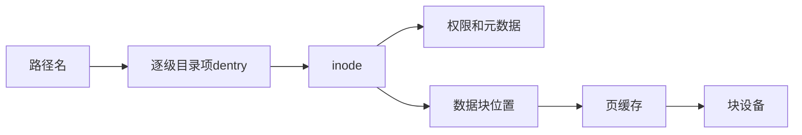
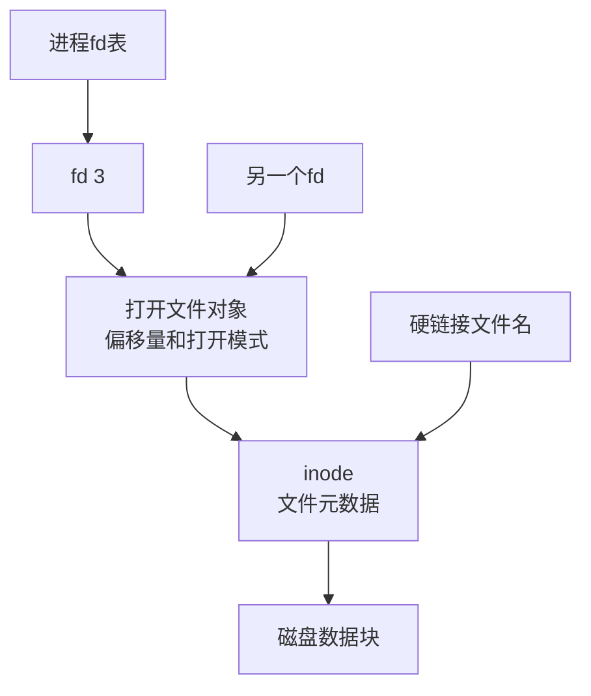
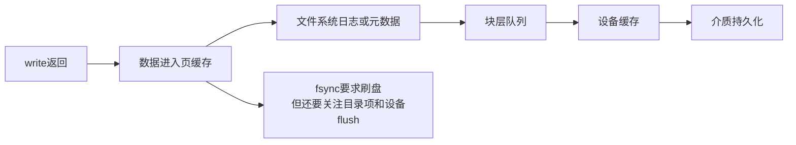

# 08-文件系统

## 本章目标

文件系统把磁盘块抽象成文件和目录。本章要讲清楚：文件名如何找到数据、fd 和 inode 是什么关系、为什么删除文件后空间可能不释放、为什么 `write()` 成功不代表落盘。

## 文件系统解决什么问题

磁盘本质上是块设备，能读写固定大小的块。人和程序不想直接管理块号，于是文件系统提供：

- 命名：用路径找到文件。
- 空间管理：哪些块空闲，哪些块属于某文件。
- 元数据：权限、所有者、大小、时间戳。
- 缓存：用内存加速读写。
- 一致性：崩溃后尽量不损坏结构。

## 路径名如何找到文件

路径 `/home/li/a.txt` 的解析过程：

```text
根目录 /
  → 查找 home 目录项，得到 home 的 inode
  → 在 home 中查找 li，得到 li 的 inode
  → 在 li 中查找 a.txt，得到 a.txt 的 inode
  → 根据 inode 找到文件数据块
```

目录本质上是特殊文件，内容是“文件名 → inode 编号”的映射。

## inode 是什么

inode 保存文件元数据和数据块位置，通常包括：

- 文件类型。
- 权限。
- 所有者和组。
- 文件大小。
- 时间戳。
- 链接数。
- 数据块指针或 extent。

注意：**文件名不在 inode 中**。文件名在目录项里。

## 文件描述符 fd

进程打开文件后，内核返回一个小整数 fd。fd 是进程访问内核文件对象的句柄。

层次关系：

```text
进程 fd 表
  → 打开文件表项：偏移量、打开标志
  → inode/vnode：文件元数据
  → 页缓存/磁盘块
```

`dup()` 出来的 fd 共享同一个打开文件表项，因此共享文件偏移量。两次独立 `open()` 得到的 fd 可能指向同一 inode，但偏移量独立。

## 硬链接和软链接

硬链接：多个目录项指向同一 inode。

软链接：一个特殊文件，内容是目标路径。

| 对比 | 硬链接 | 软链接 |
|---|---|---|
| 本质 | 同一 inode 的多个名字 | 保存路径的特殊文件 |
| 跨文件系统 | 通常不可以 | 可以 |
| 目标删除后 | 其他硬链接仍可访问 | 变成悬空链接 |
| 是否有独立 inode | 共享目标 inode | 自己有 inode |

## 删除文件后空间为什么可能不释放

删除文件通常只是删除目录项并减少 inode 链接数。如果某进程仍然打开该文件，内核还保留打开引用，数据块不会释放。

典型场景：日志文件被 `rm` 删除，但服务仍在写旧 fd，磁盘空间不下降。

排查：

```bash
lsof | grep deleted
```

解决：关闭 fd、重启进程、让日志系统重新打开文件。

## 页缓存

读文件时，内核会把文件数据缓存到内存页缓存中。第二次读相同数据时，如果命中页缓存，就不需要访问磁盘。

写文件时，数据通常先写入页缓存并标记为脏页，后台线程稍后回写磁盘。

这带来两个重要结论：

1. 空闲内存被 buff/cache 使用不一定是坏事。
2. `write()` 返回不代表数据已经物理落盘。

## write、fsync 和崩溃一致性

`write()` 成功通常表示数据进入内核缓冲区。若此时断电，数据可能丢失。

`fsync(fd)` 要求内核把文件数据和必要元数据刷到底层存储。

但如果你创建新文件或 rename 文件，只 fsync 文件可能还不够，因为目录项也需要持久化。可靠替换文件常见流程：

```text
写临时文件
fsync(临时文件)
rename(临时文件, 目标文件)
fsync(目录)
```

## 文件系统日志

崩溃可能发生在任意时刻。文件系统需要保证崩溃后结构不损坏。

日志 journaling 思路：

1. 先记录“我要做什么修改”。
2. 确保日志落盘。
3. 应用真实修改。
4. 崩溃恢复时根据日志重放或回滚。

不同文件系统日志模式不同，有的只记录元数据，有的记录数据和元数据。

## 小文件和 inode 问题

磁盘容量没满，但创建文件失败，可能是 inode 用尽。大量小文件会消耗 inode。

排查：

```bash
df -h
df -i
```

## 实践任务

```bash
ls -li
stat 文件名
ln a b
ln -s a c
lsof -p $$
df -i
```

观察 inode、链接数、fd。

## 自测题

1. 文件名存在哪里？inode 存什么？
2. fd 和 inode 是什么关系？
3. 删除文件后空间为什么可能不释放？
4. `write` 和 `fsync` 的区别是什么？
5. 为什么目录也可能需要 fsync？

## 补充深入讲解

## 从零开始理解：文件名不是文件本身

很多人以为文件就是文件名。实际上文件名只是目录里的一个入口，真正表示文件的是 inode。目录项把名字指向 inode，inode 再指向数据块。

这解释了硬链接：两个名字可以指向同一个 inode。也解释了删除文件后空间不释放：路径没了，但 inode 仍可能被进程打开引用。

## fd、打开文件表和 inode 的区别

fd 是进程自己的编号；打开文件表项保存当前偏移量和打开模式；inode 表示文件元数据。

如果两个 fd 来自 `dup`，它们共享偏移量；如果分别 `open` 同一文件，它们通常不共享偏移量。这是很多日志、并发写文件问题的根源。

## write 为什么不等于安全

`write` 成功通常只说明数据到了内核。内核为了性能会把数据放在页缓存里，稍后批量写回。断电时，页缓存里的数据会丢失。

因此数据库、消息队列这类系统必须理解 fsync、日志、rename、目录 fsync 的语义。普通应用可以接受性能换取弱持久性，但不能误以为 write 就绝对安全。

## 为什么文件系统需要日志

更新文件常常不止改一个地方。例如创建文件要分配 inode、写目录项、更新位图、写数据块。如果崩溃发生在中间，文件系统可能不一致。日志把“准备做的修改”先记录下来，崩溃后才能恢复。

## 进一步案例：日志轮转为什么可能失败

日志系统常把 `app.log` 重命名为 `app.log.1`，再创建新的 `app.log`。如果应用没有重新打开日志文件，它仍然写旧 fd。路径上看旧文件可能被压缩或删除，但进程仍持有 inode，磁盘空间不释放。

正确做法是日志轮转后通知进程 reopen，或者日志库自己检测轮转。排查用 `lsof | grep deleted`。

## 进一步案例：为什么大量小文件很麻烦

大量小文件不仅占数据块，还占 inode、目录项和元数据缓存。目录查找、备份、同步、删除都会变慢。即使总数据量不大，也可能 inode 用尽或元数据 I/O 成为瓶颈。工程上常把小对象打包、使用对象存储、数据库或分层目录结构。

## 思维导图

> 记忆建议：文件名不是文件本身；路径找到 inode，fd 指向打开文件对象。

### 1. 路径到数据块



### 2. fd、打开文件表、inode



### 3. write 到持久化


