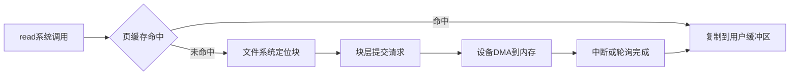
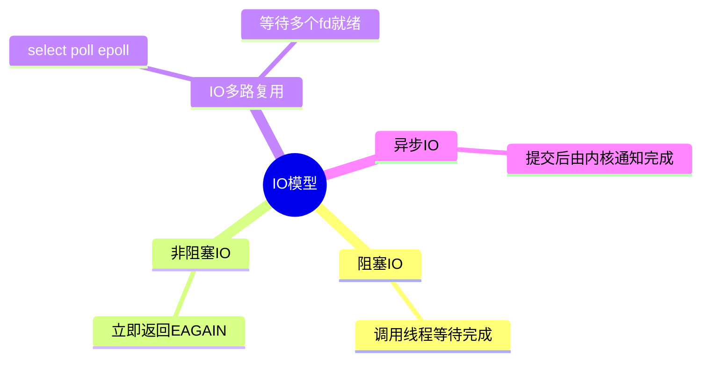
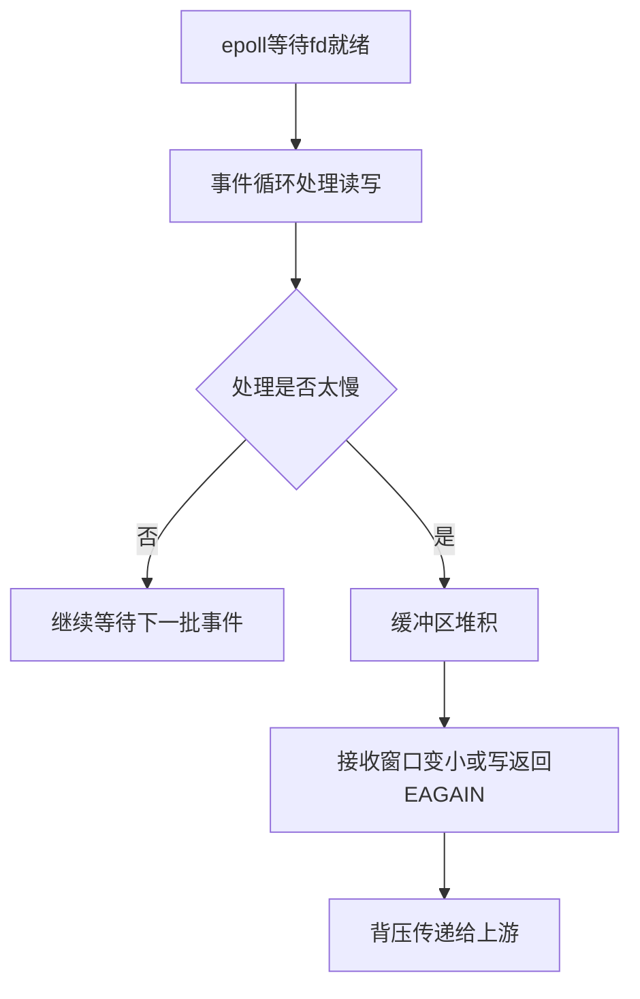

# 09-IO系统与设备管理

## 本章目标

I/O 是应用和外部世界交互的通道。本章讲设备抽象、阻塞/非阻塞 I/O、epoll、DMA、零拷贝。重点不是背接口，而是理解数据如何从应用到内核、再到设备。

## 设备抽象

Linux 把很多设备抽象为文件：

- 字符设备：终端、串口，按字节流访问。
- 块设备：磁盘、SSD，按块访问。
- 网络设备：通过 socket 和协议栈访问。

设备驱动负责把内核通用接口翻译成具体硬件操作。

## 一次读文件的 I/O 路径

```text
应用 read(fd)
  → 系统调用进入内核
  → VFS 找到文件对象
  → 查页缓存
  → 命中：复制到用户缓冲区
  → 未命中：构造块 I/O 请求
  → 块层合并/调度请求
  → 驱动提交给设备
  → DMA 把数据读入内存
  → 中断通知完成
  → 唤醒等待进程
```

这条路径中，页缓存命中和未命中性能差距巨大。

## 阻塞 I/O 和非阻塞 I/O

阻塞 I/O：数据没准备好时，线程睡眠等待。

非阻塞 I/O：数据没准备好时立即返回错误，例如 `EAGAIN`。

非阻塞不等于更快，它只是避免线程被挂住。应用需要事件循环或轮询机制处理“稍后再试”。

## 同步 I/O 和异步 I/O

同步/异步关注完成方式：

- 同步 I/O：应用发起操作，并在某个时刻自己完成读写。
- 异步 I/O：应用提交请求，内核或运行时完成后通知。

`epoll + nonblocking socket` 常是同步非阻塞；io_uring 更接近提交/完成队列式异步模型。

## I/O 多路复用

一个线程如何管理很多连接？不能为每个连接都阻塞等待，所以需要多路复用。

| 机制 | 特点 |
|---|---|
| select | fd 集合大小有限，每次复制和扫描 |
| poll | 数组形式，无固定小上限，但仍线性扫描 |
| epoll | 内核维护兴趣集合，返回就绪事件 |

epoll 适合大量 socket 且活跃比例低的场景。

## epoll 的 LT 和 ET

LT 水平触发：只要 fd 仍就绪，就反复通知。简单可靠。

ET 边缘触发：状态从未就绪变为就绪时通知一次。通知少，但必须读/写到 `EAGAIN`，否则可能卡住。

ET 模式要求：

- fd 设置非阻塞。
- 循环读取直到 EAGAIN。
- 正确维护应用层缓冲区。

## 背压

非阻塞 I/O 不能解决处理能力不足。如果应用读得太快、处理太慢，内存队列会不断增长。

背压机制包括：

- 限制队列长度。
- 暂停读事件。
- 限流或拒绝请求。
- 根据下游能力调节上游速率。

没有背压的高并发系统可能把阻塞问题变成内存爆炸和尾延迟问题。

## DMA

DMA 允许设备直接读写内存，减少 CPU 搬运数据。磁盘、网卡都大量依赖 DMA。

但 DMA 需要 IOMMU 做安全隔离，避免设备访问不该访问的内存。

## 零拷贝

传统文件发送：

```text
磁盘 → 页缓存 → 用户缓冲区 → socket 缓冲区 → 网卡
```

零拷贝减少用户态/内核态之间的数据复制。常见技术：

- `sendfile`：文件直接发送到 socket。
- `mmap`：文件映射到用户地址空间。
- `splice`：内核缓冲区之间移动数据。
- DMA scatter-gather。

大文件下载服务器适合使用 sendfile，但如果要 TLS 加密、动态压缩、内容改写，零拷贝路径会受限制。

## 实践任务

```bash
strace -e trace=read,write,openat,close ls >/tmp/ls.out
ss -lntp
ulimit -n
```

观察系统调用和 fd 限制。

## 自测题

1. 阻塞和同步有什么区别？
2. epoll 解决的到底是什么问题？
3. ET 模式为什么必须读到 EAGAIN？
4. 零拷贝减少了哪些复制？
5. 为什么非阻塞系统仍然需要背压？

## 补充深入讲解

## 从零开始理解：I/O 慢通常慢在哪里

I/O 慢可能慢在很多层：应用频繁小读写、系统调用太多、页缓存未命中、块层队列拥塞、设备本身慢、网络缓冲区满、下游不读数据。不要只说“磁盘慢”或“网络慢”。

一次 read 如果命中页缓存，就是内存拷贝；如果未命中，就可能等待磁盘。两者差距巨大。

## epoll 不是异步魔法

epoll 只告诉你“哪些 fd 现在可能可读/可写”。它不帮你处理业务，也不让磁盘或网络变快。应用仍然要调用 read/write，仍然要处理半包、缓冲区、错误和背压。

高并发服务真正难的是：事件到来后，如何不让慢请求、慢下游、慢磁盘拖垮整个事件循环。

## 为什么需要背压

如果 socket 可读，你一直读，但业务处理不过来，数据会堆到内存队列里。非阻塞系统不会卡在线程上，但可能卡在内存上。背压就是告诉上游“我处理不过来了”，通过暂停读、限流、拒绝、降级等方式保护系统。

## 零拷贝的适用边界

sendfile 适合静态文件发送，因为数据不需要被应用修改。如果需要压缩、加密、模板渲染，数据必须经过 CPU 处理，零拷贝收益会下降。理解适用边界比背概念更重要。

## 进一步案例：为什么异步日志能提升性能

同步写日志时，请求线程可能频繁 write 或 fsync，直接增加请求延迟。异步日志把日志放入内存队列，由后台线程批量写入，减少系统调用和磁盘同步次数。

风险是队列满时怎么办：阻塞业务、丢弃日志，还是降级？进程崩溃时队列中日志可能丢失。因此关键审计日志和普通访问日志的策略应该不同。

## 进一步案例：epoll 事件循环为什么怕阻塞任务

如果事件循环线程处理一个事件时执行了慢 SQL、同步文件读写或复杂 CPU 计算，它就无法及时处理其他连接。即使 epoll 很高效，事件循环也被业务阻塞了。常见做法是：事件循环只做轻量 I/O，耗时任务交给 worker 池，并配合队列长度和背压。

## 思维导图

> 记忆建议：IO 重点分清“等待方式、完成语义、数据路径”。

### 1. 一次读文件路径



### 2. IO 模型区分



### 3. epoll 与背压


