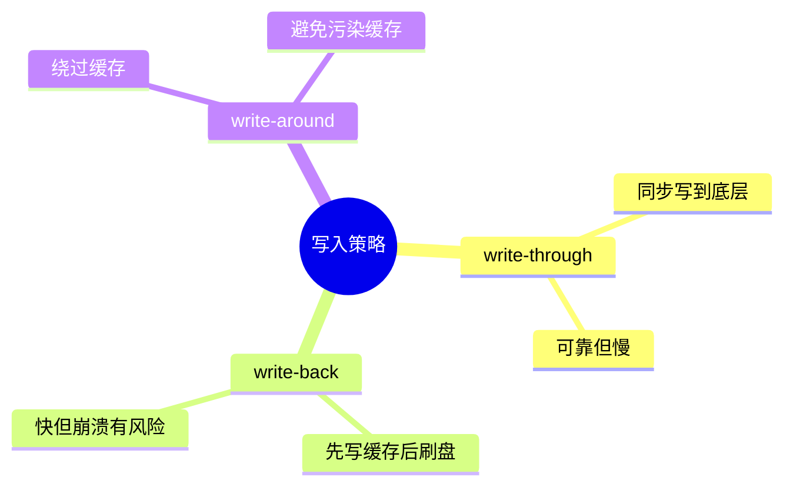
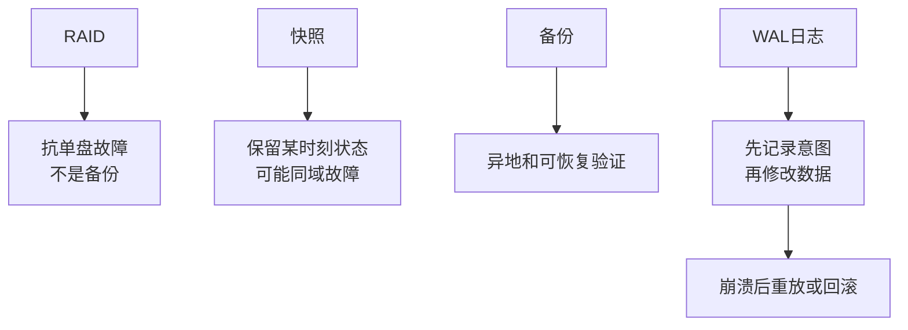

# 10-存储系统与可靠性

## 本章目标

存储系统同时追求性能和可靠性，但这两者经常冲突。本章讲缓存、写入策略、fsync、RAID、日志、快照和备份，让你理解“写成功”和“数据安全”之间的距离。

## 存储层级

一次写入可能经过多层：

```text
用户态缓冲区
  → 内核页缓存
  → 文件系统日志
  → 块层队列
  → 设备缓存
  → SSD/HDD 介质
```

每一层都可能缓存、合并、重排。性能来自缓存和批量，风险也来自尚未持久化的数据。

## 写入策略

### write-through

写入必须同步到底层。语义简单，可靠性强，但慢。

### write-back

先写缓存，稍后刷盘。性能好，但崩溃时可能丢失尚未刷盘的数据。

### write-around

绕过缓存写底层，避免污染缓存，但后续读取可能慢。

操作系统页缓存通常采用 write-back 思路。

## fsync 的意义

`write()` 返回不代表落盘。`fsync()` 要求文件数据和必要元数据持久化。

但可靠落盘要考虑：

- 文件数据是否刷盘。
- inode 元数据是否刷盘。
- 目录项是否刷盘。
- 存储设备是否诚实执行 flush。
- 文件系统日志模式。

## 原子替换文件

很多程序写配置或状态文件时使用：

```text
写临时文件
fsync 临时文件
rename 到目标文件
fsync 目录
```

`rename` 在同一文件系统内通常是原子的。这样可以避免崩溃后出现半写文件。

## RAID

RAID 用多块磁盘组合提升性能或可靠性。

| 类型 | 特点 |
|---|---|
| RAID 0 | 条带化，提升性能，无冗余 |
| RAID 1 | 镜像，提高可靠性 |
| RAID 5 | 奇偶校验，允许坏一块盘 |
| RAID 10 | 镜像加条带，兼顾性能和可靠性 |

RAID 不是备份。误删除、勒索、软件 bug 会同步影响阵列。

## 日志和事务

可靠系统需要保证一组更新要么都发生，要么都不发生。日志是常用方法。

```text
1. 写 redo/undo 日志
2. 确保日志持久化
3. 应用真实修改
4. 崩溃后根据日志恢复
```

文件系统、数据库、消息队列都大量使用日志思想。

## SSD 特性

SSD 内部不能像内存一样原地覆盖。它有擦除块、页写入、FTL 映射、垃圾回收、磨损均衡。

影响：

- 小随机写可能导致写放大。
- 顺序写通常更友好。
- TRIM 告诉 SSD 哪些块不再使用。
- 队列深度会影响吞吐。

## 快照和备份

快照是某一时刻的数据视图，常依赖 COW。备份是独立副本。

可靠数据保护应包括：

- 本地冗余。
- 异地备份。
- 定期恢复演练。
- 版本保留。
- 防误删和防勒索策略。

## 实践任务

```bash
df -h
df -i
mount
iostat -x 1
```

观察容量、inode、挂载参数和设备延迟。

## 自测题

1. write-back 为什么快？风险是什么？
2. fsync 文件和 fsync 目录有什么区别？
3. RAID 为什么不能替代备份？
4. SSD 为什么怕大量小随机写？
5. 日志如何帮助崩溃恢复？

## 补充深入讲解

## 从零开始理解：性能和可靠性为什么冲突

最快的写入方式是把数据放进内存缓存就返回；最可靠的写入方式是确认数据已经安全写到持久介质。前者快但可能丢，后者可靠但慢。存储系统所有设计都在这两者之间取舍。

## 数据库为什么重视 WAL

数据库不会每次修改都随机写数据页并立即刷盘，而是先顺序写日志。顺序写更快，崩溃后可以根据日志重放或回滚。WAL 的核心原则是：数据页落盘前，描述这次修改的日志必须先落盘。

## fsync 为什么贵

fsync 可能要求把脏页、元数据、日志提交到底层设备，并等待设备确认。它会打断内核和设备的批量优化。因此高性能系统通常会 group commit，把多个请求的持久化合并成一次刷盘。

## RAID、快照、备份的边界

RAID 解决部分磁盘损坏，不解决误删；快照能回到某个时间点，但如果快照和源数据在同一故障域，也可能一起丢；备份必须可恢复，不能只“有一份文件”。可靠性最终要靠恢复演练验证。

## 进一步案例：消息队列为什么要批量刷盘

如果每条消息都单独 fsync，吞吐会很低。消息队列通常把多条消息追加到日志文件，然后 group commit，一次 fsync 确认多条消息。这样多个请求共享一次持久化成本。

代价是确认策略要设计清楚：如果消息在内存中尚未 fsync 就向客户端 ack，崩溃后可能丢；如果必须 fsync 后再 ack，延迟更高。不同系统会提供不同可靠性级别。

## 进一步案例：为什么备份必须做恢复演练

很多团队以为“有备份文件”就安全，但真正故障时才发现备份损坏、缺少权限、版本太旧、恢复太慢或依赖没备份。备份的价值不在于存在，而在于可恢复。恢复演练能验证 RPO（最多丢多少数据）和 RTO（多久恢复服务）。

## 思维导图

> 记忆建议：存储可靠性要区分“写入成功、刷到设备、真正可恢复”。

### 1. 写入策略对比



### 2. 安全替换文件


### 3. 可靠性边界


