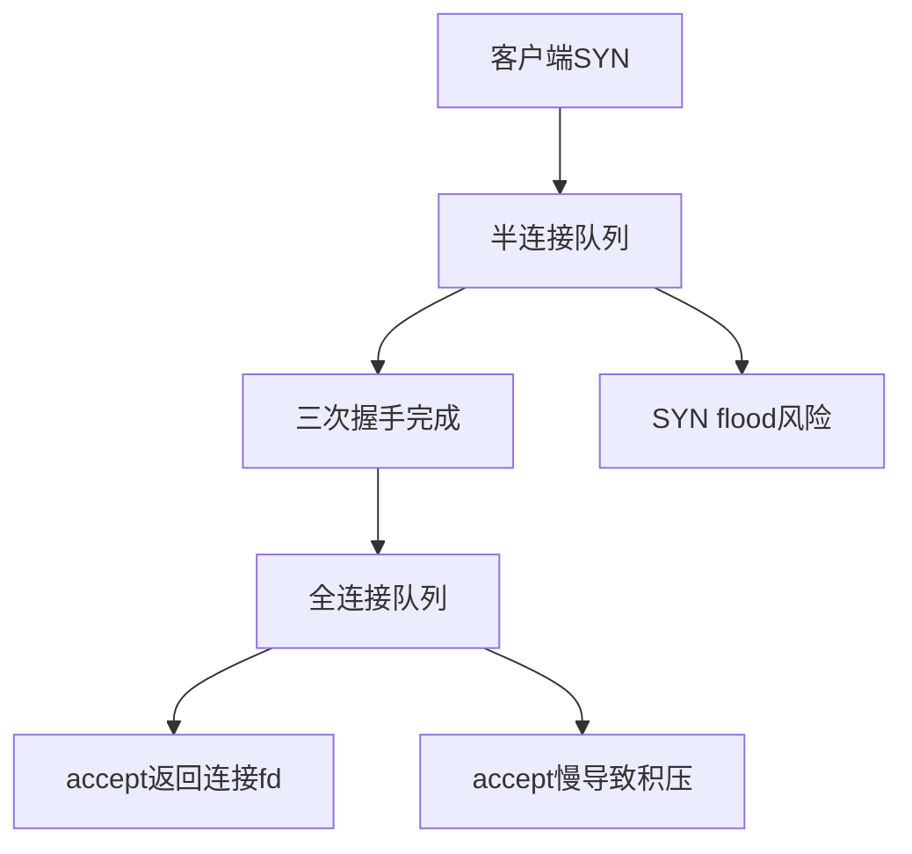
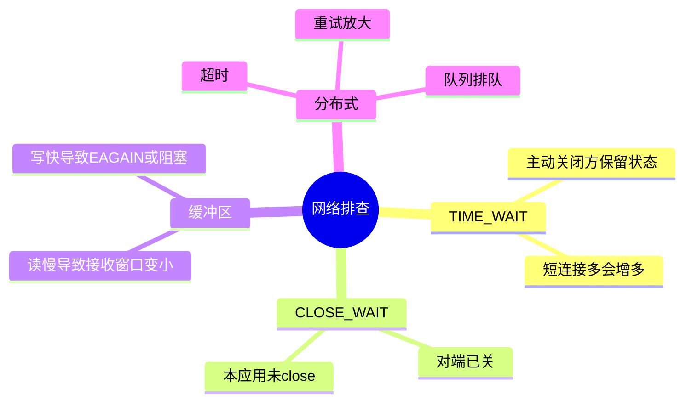

# 11-网络与分布式系统基础

## 本章目标

网络在应用看来是 Socket，在内核看来是协议栈、缓冲区、连接状态、队列和网卡。本章用 OS 视角理解网络，并连接到分布式系统中的延迟、超时和排查。

## Socket 是什么

Socket 是网络通信端点。TCP 服务端典型流程：

```text
socket()
  → bind()
  → listen()
  → accept()
  → read()/write()
  → close()
```

监听 fd 和连接 fd 不同。监听 fd 接收新连接；accept 返回的连接 fd 用于和具体客户端通信。

## 接收网络包的路径

```text
网卡收到数据帧
  → DMA 写入内存 ring buffer
  → 中断或 NAPI 通知内核
  → 驱动构造 skb
  → 协议栈处理以太网/IP/TCP
  → 数据进入 socket 接收缓冲区
  → epoll/read 唤醒应用
```

高流量下，系统可能减少中断，转为 NAPI 轮询，降低中断风暴。

## TCP 三次握手与队列

服务端 `listen` 后有两个重要队列：

- 半连接队列：收到 SYN，尚未完成握手。
- 全连接队列：握手完成，等待 accept。

SYN flood 主要攻击半连接队列。应用 accept 太慢会导致全连接队列积压。

## TCP 发送和接收缓冲区

Socket 有发送缓冲区和接收缓冲区。

如果应用读得慢：

- 接收缓冲区变满。
- TCP 接收窗口变小。
- 对端发送速度下降。

如果应用写得快：

- 发送缓冲区变满。
- 阻塞写或非阻塞返回 EAGAIN。

这就是网络层的背压。

## 流量控制和拥塞控制

流量控制：保护接收方，避免发送方压垮接收缓冲区。

拥塞控制：保护网络路径，避免过多数据造成丢包和排队。

吞吐不只取决于带宽，还取决于 RTT、丢包、拥塞窗口、接收窗口和应用读写速度。

## TIME_WAIT 和 CLOSE_WAIT

TIME_WAIT 通常在主动关闭方。它用于可靠关闭和避免旧报文污染新连接。

CLOSE_WAIT 表示对端关闭了连接，本端应用还没 close。大量 CLOSE_WAIT 往往说明应用 fd 泄漏或连接生命周期管理错误。

## 分布式系统中的 OS 因素

很多分布式问题其实有 OS 根源：

- 超时设置太短，遇到调度延迟或 GC 就误判失败。
- 线程池满导致请求排队。
- fd 限制导致无法接受新连接。
- 容器 CPU throttle 造成周期性延迟。
- 磁盘 fsync 慢拖慢写请求。
- 缺页或 swap 导致尾延迟。

## 排查网络慢

如果 RTT 高，可能是网络路径问题。若 RTT 正常但接口慢，重点看应用层：线程池、队列、数据库、锁、GC、磁盘日志、下游依赖。

常用命令：

```bash
ss -s
ss -ant
ss -lntp
ip addr
ip route
ulimit -n
```

## 自测题

1. accept 返回的新 fd 为什么不能用监听 fd 替代？
2. 半连接队列和全连接队列分别存什么？
3. CLOSE_WAIT 多通常说明什么？
4. RTT 正常但接口慢，可能是什么原因？
5. TCP 流量控制和拥塞控制有什么区别？

## 补充深入讲解

## 从零开始理解：网络慢不一定是网线慢

一次接口请求包括客户端排队、DNS、建连、TLS、服务端 accept、应用排队、业务处理、数据库、响应写回。网络 RTT 正常，只能说明基础链路可能没问题，不能说明服务端处理快。

## TCP 队列为什么重要

服务端连接建立不是直接交给应用。半连接队列保存握手未完成连接，全连接队列保存握手完成但未 accept 的连接。应用 accept 慢时，全连接队列会积压；攻击者发大量 SYN 时，半连接队列会受压。

## CLOSE_WAIT 为什么通常是应用问题

CLOSE_WAIT 表示对端已经关闭，本端内核也知道了，但应用还没 close。大量 CLOSE_WAIT 往往是代码没有关闭连接，或者处理线程卡住。调内核参数通常治标不治本。

## 分布式超时为什么不能随便设

超时太短会误杀正常请求，太长会让资源长期占用。合理超时要考虑网络 RTT、服务端排队、GC、调度延迟、下游延迟和重试放大。超时还必须配合幂等和限流，否则重试会把系统打得更慢。

## 进一步案例：短连接为什么容易造成资源压力

每个 TCP 连接都要握手、维护状态、分配缓冲区，关闭后还可能进入 TIME_WAIT。大量短连接会增加 CPU、内核内存、端口和队列压力。HTTP keep-alive、连接池和复用协议能显著降低这些成本。

但长连接也要管理心跳、超时、连接泄漏和负载均衡迁移。没有绝对最优，只有适合业务的连接生命周期。

## 进一步案例：重试为什么可能放大故障

下游变慢时，如果所有上游都立即重试，会让下游收到更多请求，进一步变慢，形成重试风暴。正确做法是超时、指数退避、抖动、限流、熔断和幂等。操作系统层面的连接、队列和线程资源，最终会被分布式策略影响。

## 思维导图

> 记忆建议：网络问题要同时看内核队列、TCP 状态和应用读写速度。

### 1. 收包路径


### 2. TCP 服务端队列



### 3. 常见状态记忆


