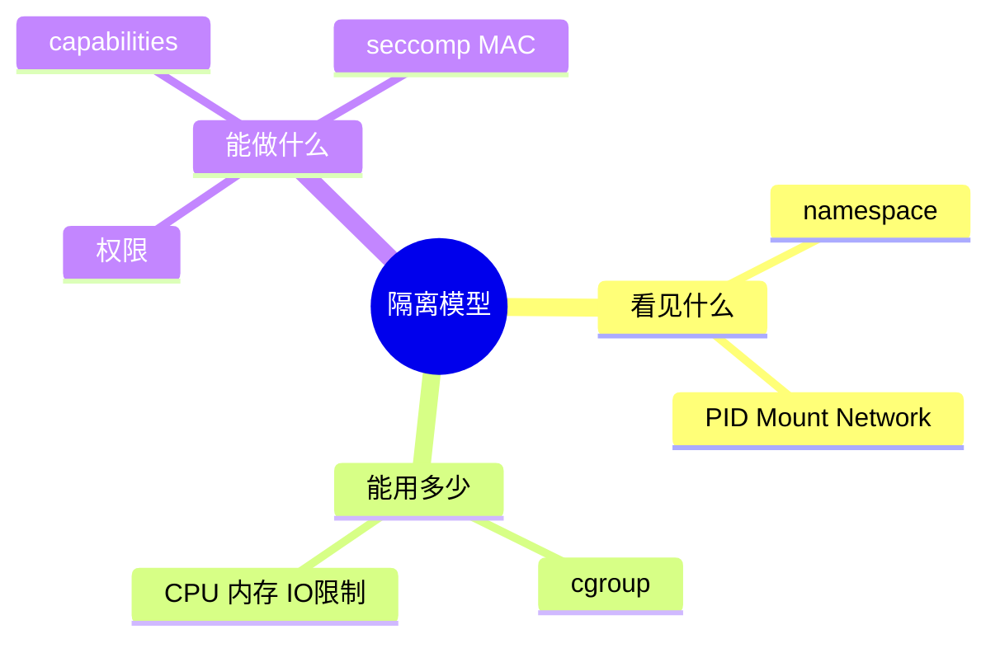
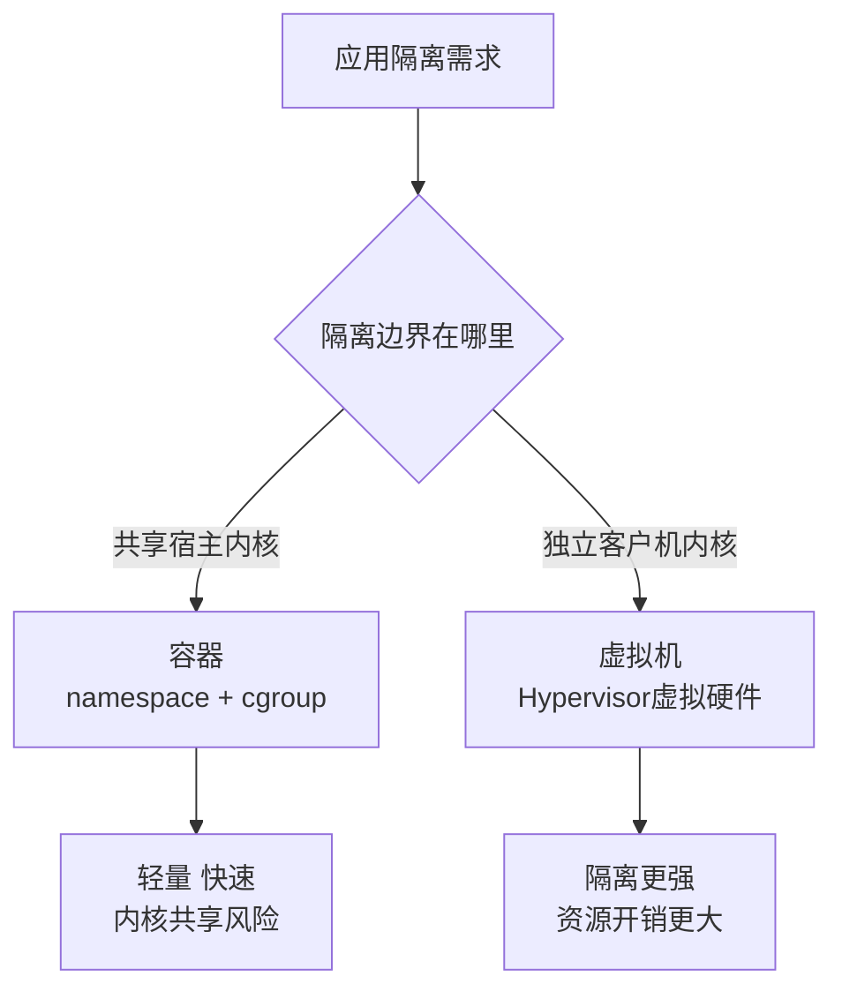
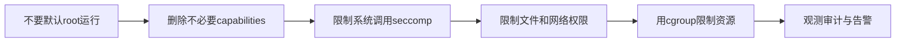

# 12-安全保护与虚拟化

## 本章目标

操作系统不仅要让程序跑起来，还要让程序不能越权。本章讲用户权限、文件权限、capabilities、namespace、cgroup、容器和虚拟机。

## 权限模型

Unix 权限围绕用户、组和其他人：

```text
-rw-r--r--  owner group others
```

权限含义：

- r：读。
- w：写。
- x：执行；对目录表示可进入/穿越。

目录没有 x 权限，即使知道文件名，也可能无法访问。

## root 与最小权限

root 权限很大，但服务不应该默认以 root 运行。原因：一旦服务被攻击，攻击者就获得过大权限。

最小权限原则：程序只获得完成任务所需的最少权限。

## capabilities

Linux capabilities 把 root 权限拆成更细粒度能力。例如：

- `CAP_NET_ADMIN`：网络管理。
- `CAP_SYS_ADMIN`：非常大的系统管理能力。
- `CAP_NET_BIND_SERVICE`：绑定低端口。

容器安全中常通过 drop capabilities 降低风险。

## namespace

namespace 解决“看到什么”的问题。

| namespace | 隔离内容 |
|---|---|
| PID | 进程号视图 |
| Mount | 挂载点 |
| Network | 网络设备、路由、端口 |
| UTS | 主机名 |
| IPC | IPC 对象 |
| User | 用户/组映射 |

容器里看到 PID 1，不代表它是宿主机真正的 PID 1。

## cgroup

cgroup 解决“能用多少”的问题：

- CPU quota/weight。
- 内存限制。
- I/O 限制。
- 进程数限制。

容器 CPU limit 太低时，应用可能被 throttle，表现为周期性延迟尖峰。排查要看 cgroup 的 throttled 指标，而不是只看宿主机 CPU。

## seccomp、AppArmor、SELinux

seccomp 可以限制进程能调用哪些系统调用。AppArmor/SELinux 提供更细的强制访问控制。

浏览器沙箱、容器运行时、在线判题系统都常用这些机制降低攻击面。

## 容器不是虚拟机

容器共享宿主机内核。虚拟机有独立客户机内核。

| 对比 | 容器 | 虚拟机 |
|---|---|---|
| 内核 | 共享宿主机内核 | 独立内核 |
| 启动速度 | 快 | 较慢 |
| 隔离强度 | 依赖内核机制 | 通常更强 |
| 资源开销 | 小 | 大 |

容器中的 root 也不一定是宿主机 root，但 privileged 容器、挂载宿主目录、暴露 Docker socket 都会显著降低安全性。

## 虚拟化

虚拟机通过 hypervisor 虚拟化 CPU、内存、磁盘和网卡。硬件辅助虚拟化让 VM 性能更好。IOMMU 可以安全地把设备直通给 VM。

## 常见安全问题

- 服务以 root 运行。
- 密钥文件权限过宽。
- 临时文件创建不安全。
- 容器 privileged 运行。
- 挂载宿主敏感目录。
- 无资源限制导致 fork bomb 或 OOM。
- seccomp/capabilities 配置过宽。

## 自测题

1. namespace 和 cgroup 的区别是什么？
2. 容器为什么不是强虚拟机边界？
3. capabilities 解决什么问题？
4. 容器 CPU throttle 会导致什么现象？
5. 为什么服务不应以 root 运行？

## 补充深入讲解

## 从零开始理解：隔离不是一个开关

很多人说“容器隔离”或“虚拟机隔离”，但隔离不是有/无，而是由多层机制叠加出来的。文件系统视图、进程号视图、网络视图、用户权限、系统调用权限、资源限制都需要分别控制。

## 容器里的 root 为什么容易误解

容器内 root 可能只是在 user namespace 中的 root，并不等于宿主机 root。但如果容器 privileged、挂载宿主 `/`、拥有危险 capability 或 Docker socket，就可能获得宿主控制权。容器安全取决于配置，不是“用了容器就安全”。

## cgroup 造成的性能现象

CPU limit 会导致 throttle。应用可能看起来没有用满宿主机 CPU，但延迟周期性变高，因为容器本周期 CPU 配额用完后必须等下个周期。内存 limit 会导致容器 OOM，即使宿主机还有内存。

## 虚拟机为什么隔离更强

虚拟机有独立内核，攻击者即使攻破 guest 内核，还要突破 hypervisor 才能影响宿主机。容器共享宿主机内核，内核漏洞影响面更大。因此安全敏感场景常用 VM、microVM 或更强沙箱。

## 进一步案例：为什么挂载 Docker socket 很危险

如果容器内能访问宿主机 Docker socket，它就可以请求 Docker daemon 创建特权容器、挂载宿主机文件系统，从而获得宿主机控制权。即使容器本身看起来不是 privileged，Docker socket 也等于高权限入口。

这说明安全不能只看进程当前权限，还要看它能访问哪些控制平面接口。

## 进一步案例：seccomp 为什么有用

很多程序只需要少量系统调用。如果用 seccomp 禁止危险或不需要的系统调用，即使攻击者控制了进程，也更难执行提权、加载内核模块、调试其他进程等操作。它不是万能防线，但能显著缩小攻击面。

## 思维导图

> 记忆建议：安全与虚拟化分别回答“能看见什么、能用多少、能做什么”。

### 1. 隔离三问



### 2. 容器与虚拟机



### 3. 最小权限实践


