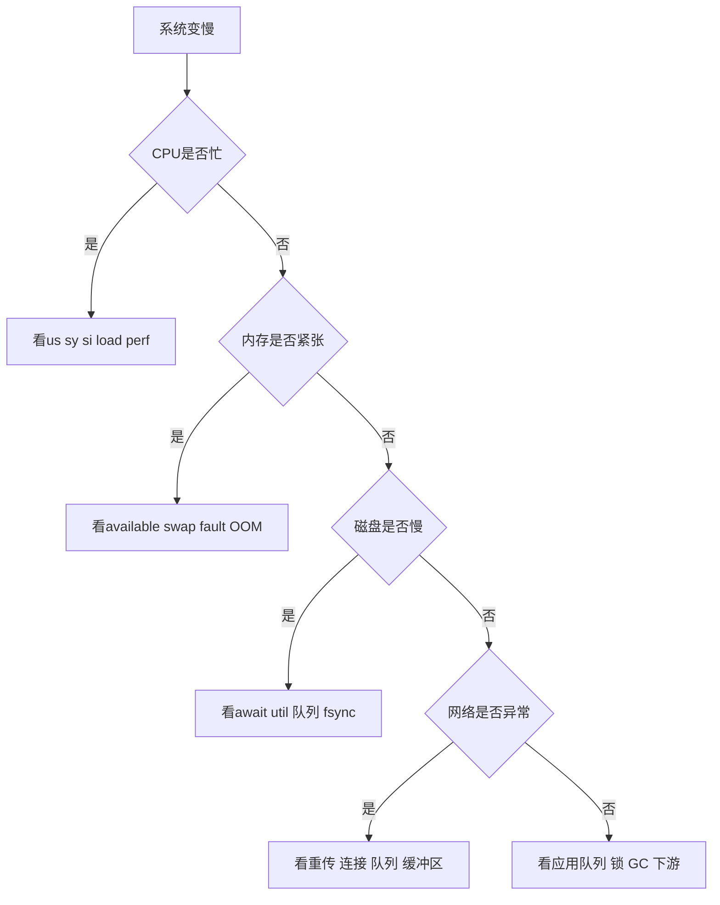
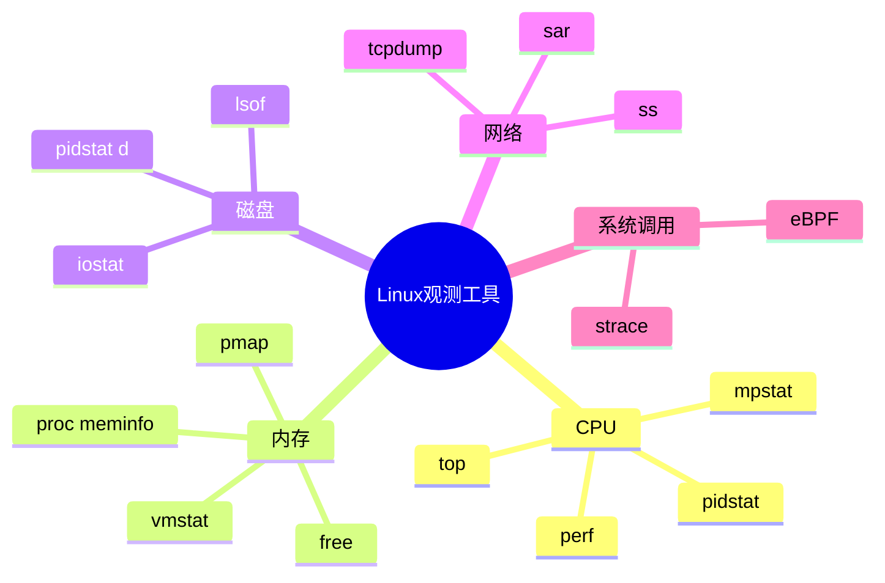
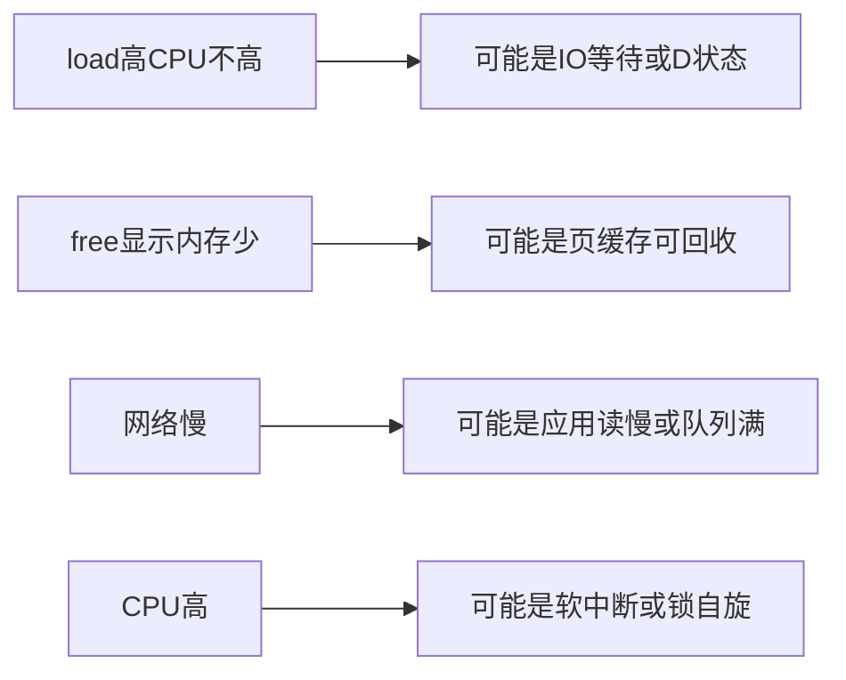

# 13-Linux实操与观测

## 本章目标

操作系统知识最终要能解释线上现象。本章给出 CPU、内存、I/O、网络、系统调用、fd 的排查方法。重点不是记命令，而是知道每个命令回答什么问题。

## 总体排查框架

遇到系统变慢，先问：

1. CPU 是否忙？忙在用户态、内核态还是软中断？
2. 内存是否紧张？是否 swap、major fault、OOM？
3. 磁盘是否慢？await、util、队列是否高？
4. 网络是否异常？连接状态、丢包、重传、队列？
5. 应用是否排队？线程池、连接池、锁、GC、下游？

不要直接猜。先用指标定位层次。

## CPU 排查

命令：

```bash
top
pidstat 1
pidstat -t -p <pid> 1
mpstat -P ALL 1
perf top
```

看什么：

- `%us`：用户态计算。
- `%sy`：内核态。
- `%si`：软中断，网络高时常见。
- load average：可运行和不可中断任务数量。
- 单核打满还是多核打满。

CPU 高常见原因：死循环、正则回溯、序列化、加密、GC、锁自旋、频繁系统调用、软中断。

## 上下文切换

命令：

```bash
vmstat 1
pidstat -w -p <pid> 1
```

`cs` 很高可能说明线程过多、锁竞争、频繁阻塞唤醒。上下文切换高时，CPU 可能忙于调度而不是业务。

## 内存排查

命令：

```bash
free -h
vmstat 1
cat /proc/meminfo
cat /proc/<pid>/status
pmap -x <pid>
```

看什么：

- available：可用内存。
- buff/cache：页缓存。
- si/so：swap in/out。
- VmRSS：实际常驻内存。
- VmSize：虚拟地址空间大小。
- Threads：线程数。

RSS 上涨不一定是泄漏，可能是缓存、分配器保留、mmap、线程栈、直接内存。

## OOM 排查

看：

```bash
dmesg | grep -i oom
cat /sys/fs/cgroup/*/memory.events 2>/dev/null
```

容器 OOM 要看 cgroup 限制，不要只看宿主机 free。

## 磁盘 I/O 排查

命令：

```bash
iostat -x 1
pidstat -d 1
df -h
df -i
```

看什么：

- `%util`：设备繁忙程度。
- `await`：平均等待时间。
- `r/s w/s`：请求数。
- `rkB/s wkB/s`：吞吐。
- inode 是否耗尽。

磁盘慢可能来自随机 I/O、频繁 fsync、日志暴增、空间不足、设备故障、page cache 回写压力。

## 网络排查

命令：

```bash
ss -s
ss -ant
ss -lntp
ip addr
ip route
ulimit -n
```

看状态：

- `SYN_RECV` 多：握手积压或 SYN flood。
- `ESTAB` 多：连接多。
- `TIME_WAIT` 多：短连接/主动关闭多。
- `CLOSE_WAIT` 多：应用未 close。

网络慢不一定是网络问题。RTT 正常但接口慢，常是应用线程池、数据库、锁、GC 或下游慢。

## 系统调用排查

命令：

```bash
strace -c <command>
strace -T -p <pid>
```

`strace -c` 看系统调用统计，`-T` 看单次耗时。

频繁 `futex` 可能是锁竞争；频繁 `open/stat` 可能是元数据访问；频繁小 `read/write` 可能需要缓冲或批量。

## fd 排查

```bash
ls /proc/<pid>/fd | wc -l
lsof -p <pid>
ulimit -n
```

`Too many open files` 要判断是 fd 泄漏还是正常容量不足。大量 CLOSE_WAIT 常指向 socket 未关闭。

## 一套常用排查路径

### CPU 高

```text
top 找进程
  → top -H 找线程
  → perf 看热点
  → strace 看 syscall
  → 结合应用线程栈
```

### 内存涨

```text
free/vmstat 看系统压力
  → ps/top 找进程
  → pmap 看区域
  → 语言 profiler 看对象
  → 判断泄漏/缓存/碎片/堆外
```

### 磁盘慢

```text
iostat 看设备
  → pidstat -d 找进程
  → strace -T 看慢调用
  → 查 fsync/随机 I/O/日志/空间
```

### 网络慢

```text
ss 看连接状态
  → 看 fd 和队列
  → 看应用线程池/连接池
  → tracing 拆分耗时
```

## 自测题

1. load 高但 CPU idle 高，可能是什么？
2. `strace` 和 `perf` 分别适合什么？
3. 如何判断 fd 泄漏？
4. CLOSE_WAIT 多说明什么？
5. 容器 CPU limit 太低如何观察？

## 补充深入讲解

## 从零开始理解：排查不是背命令，而是缩小范围

命令只是工具。真正的排查逻辑是不断缩小范围：是 CPU、内存、磁盘、网络还是应用队列？是用户态还是内核态？是系统整体问题还是单进程问题？是持续问题还是尖峰？

## 为什么要先看全局再看局部

如果整机 CPU 打满，你先查某个进程可能错过软中断或其他噪声进程。如果整机内存充足，单个进程 OOM 可能是 cgroup 限制。全局指标给方向，局部指标给证据。

## 常见误判

- load 高不一定 CPU 高，可能是 D 状态 I/O 等待。
- free 内存少不一定内存不足，可能被 page cache 使用。
- TIME_WAIT 多不一定是 bug，CLOSE_WAIT 多更危险。
- RSS 不降不一定泄漏，可能是分配器缓存。
- epoll 使用了不代表 I/O 就异步。

## 一句话记忆工具

- `top`：谁在用 CPU。
- `vmstat`：系统整体运行节奏。
- `iostat`：磁盘设备是否慢。
- `ss`：网络连接状态。
- `strace`：程序在调哪些系统调用。
- `perf`：CPU 时间花在哪里。
- `lsof`：进程打开了什么。
- `pmap`：进程地址空间长什么样。

## 思维导图

> 记忆建议：排查不是背命令，而是用指标不断缩小层次。

### 1. 总体排查决策树



### 2. 命令按层记忆



### 3. 常见误判


