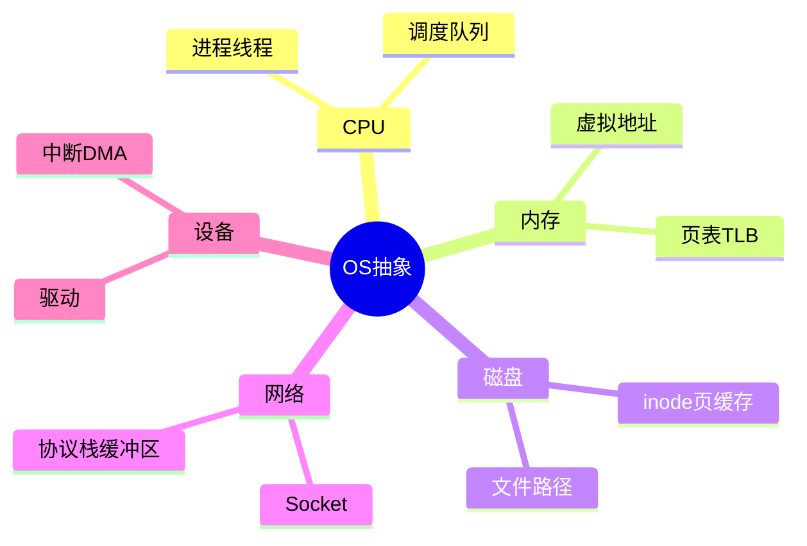
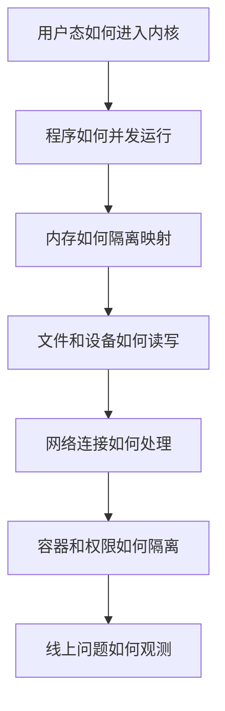

# 操作系统系统性学习教程

## 先从一个具体场景开始

假设你在终端输入：

```bash
./server --port 8080
```

这一行命令看起来只是“启动一个程序”，但操作系统背后要做很多事情：

1. Shell 解析命令，发现要运行 `./server`。
2. Shell 调用 `fork()` 创建子进程。
3. 子进程调用 `execve()`，让内核加载 `server` 可执行文件。
4. 内核读取 ELF 文件头，映射代码段、数据段、动态库。
5. 内核建立进程的虚拟地址空间、栈、堆、文件描述符表。
6. 调度器把新进程放入就绪队列，等待 CPU。
7. 程序开始执行，调用 `socket()`、`bind()`、`listen()` 监听端口。
8. 客户端连接到来时，网卡通过 DMA 把数据放入内存，再通过中断/轮询通知内核。
9. 内核网络协议栈处理 TCP 包，把数据放到 socket 接收缓冲区。
10. 应用通过 `accept()`、`read()`、`write()` 和客户端通信。

也就是说，一个程序运行起来，至少涉及：进程、内存、文件、I/O、网络、调度、中断、系统调用。

## 操作系统的核心思想

操作系统最核心的思想是：**把不安全、复杂、共享的硬件资源，包装成安全、简单、可复用的抽象**。

### 资源是共享的

CPU 只有有限核心，内存容量有限，磁盘和网卡也不是无限快。多个程序同时运行时，必须有人决定：

- 谁先用 CPU？
- 每个程序最多能用多少内存？
- 文件写入什么时候落盘？
- 网络包来了交给哪个进程？
- 程序崩溃是否影响其他程序？

这个“有人”就是操作系统内核。

### 应用看到的是抽象

应用程序通常不直接看到硬件细节：

| 应用看到 | OS 背后管理 |
|---|---|
| 进程/线程 | CPU 执行上下文、调度队列、寄存器状态 |
| 虚拟地址 | 物理内存、页表、TLB、缺页异常 |
| 文件路径 | 目录项、inode、磁盘块、页缓存 |
| Socket | 网卡、协议栈、TCP 状态机、缓冲区 |
| 标准输入输出 | 文件描述符、终端设备、管道 |

抽象让应用能用统一接口写程序，但抽象背后有成本和边界。

## 学操作系统的主线

建议你按下面这条线学习，而不是孤立背概念：

### 1. 程序如何进入内核

应用运行在用户态，内核运行在内核态。应用不能直接访问硬件，只能通过系统调用进入内核。系统调用是理解 OS 的入口。

例如：

```c
int fd = open("a.txt", O_RDONLY);
read(fd, buf, 4096);
close(fd);
```

这不是普通文件读取那么简单。`open/read/close` 都会进入内核，涉及权限检查、fd 分配、页缓存、文件系统和设备驱动。

### 2. 程序如何并发运行

多个程序看起来“同时运行”，本质是：

- 多核 CPU 真并行执行多个任务。
- 单核上调度器快速切换任务，制造并发错觉。

进程和线程是 OS 管理执行流的基本抽象。调度器决定谁运行，上下文切换保存和恢复执行现场。

### 3. 程序如何共享内存又互不破坏

虚拟内存让每个进程看到独立地址空间。页表把虚拟地址映射到物理地址。缺页异常让 OS 可以按需分配、加载文件、实现 COW。

没有虚拟内存，程序就要直接操作物理地址，很容易互相覆盖。

### 4. 程序如何读写文件和设备

文件系统把磁盘块抽象成目录和文件。一个文件名通过目录项找到 inode，再找到数据块。页缓存让读写变快，但也让“写成功”和“真正落盘”变成两个不同概念。

### 5. 程序如何处理网络连接

Socket 是网络通信抽象。高并发服务常用非阻塞 I/O 和 epoll 管理大量连接。但 epoll 只解决“怎么等很多 fd 就绪”，不解决业务处理慢、数据库慢、网络拥塞等问题。

### 6. 程序如何被隔离和限制

权限、用户、namespace、cgroup、seccomp、虚拟机都是隔离机制。容器不是虚拟机，而是一组内核隔离与资源限制机制的组合。

## 一张“程序运行路径”图

```text
用户请求到达网卡
  → 网卡 DMA 到内存
  → 中断/NAPI 通知内核
  → 内核网络协议栈处理 TCP/IP
  → 数据进入 socket 接收缓冲区
  → epoll_wait 返回可读事件
  → 应用 read/recv 读取数据
  → 应用处理业务逻辑
  → 可能访问内存、加锁、读数据库、写日志
  → write/send 返回响应
  → 数据进入 socket 发送缓冲区
  → 协议栈封包
  → 网卡发送
```

这条路径上任意环节都可能成为瓶颈：CPU、锁、内存、缺页、磁盘、网络、线程池、连接池、内核队列。

## 你应该掌握到什么程度

学完这套文档后，至少应该能回答：

- 一个系统调用从用户态到内核态发生什么？
- 为什么线程太多反而慢？
- 为什么锁会造成死锁、饥饿和优先级反转？
- 为什么 `malloc` 后不一定立刻占用物理内存？
- 为什么 `write()` 成功不代表数据已经安全落盘？
- 为什么 epoll 不等于异步 I/O？
- 为什么容器里的 root 不等于宿主机 root？
- CPU 高、内存涨、磁盘慢、网络慢分别怎么排查？

## 学习建议

不要只看定义，要把每个概念和“现象”绑定：

| 概念 | 可观察现象 |
|---|---|
| 进程/线程 | `ps`, `top -H`, `/proc/<pid>/status` |
| 系统调用 | `strace`, `perf trace` |
| 虚拟内存 | `/proc/<pid>/maps`, `pmap`, `vmstat` |
| 文件描述符 | `/proc/<pid>/fd`, `lsof` |
| 页缓存 | `free`, `/proc/meminfo` |
| 网络连接 | `ss -ant`, `ss -s` |
| 磁盘 I/O | `iostat -x`, `pidstat -d` |
| CPU 热点 | `perf top`, `perf record` |

操作系统知识最终要落到两件事：**解释程序为什么这样运行，定位系统为什么这样变慢**。

## 补充深入讲解

## 再用一条主线串起来：从 CPU 到网络响应

一个服务响应请求时，CPU 执行业务代码；如果线程等待 socket 数据，会进入阻塞或事件等待；数据到来时，网卡 DMA 到内存，中断或 NAPI 通知内核；内核协议栈把数据放进 socket 缓冲区；应用被唤醒读取；业务处理中可能申请内存、访问对象、加锁、读写文件；最后响应通过 socket 发送出去。

这说明 OS 的模块不是孤立的：网络数据到达会触发中断，唤醒线程涉及调度，应用读取涉及系统调用，处理请求涉及内存和锁，写日志涉及文件系统和 I/O。

## 初学者最该避免的学习方式

不要把操作系统学成名词解释表。比如只背“TLB 是快表”没有意义。你要继续问：为什么需要 TLB？TLB miss 会怎样？什么程序容易 TLB miss？Huge Page 为什么能改善？线上如何观察？

同样，不能只背“epoll 比 select 高效”。你要能说出 select/poll 的线性扫描问题、epoll 的兴趣集合、LT/ET 的差别、非阻塞和背压、以及 epoll 不解决业务慢的问题。

## 本教程的最终目标

不是让你成为内核开发者，而是让你达到三个能力：

1. **解释能力**：能解释程序为什么这样运行。
2. **设计能力**：能在写服务时考虑线程数、锁、缓存、I/O、持久化。
3. **排查能力**：系统慢时知道从 CPU、内存、磁盘、网络、内核、应用哪一层开始查。

## 思维导图

> 记忆建议：用“启动一个 server”串起进程、内存、文件、IO、网络、调度和系统调用。

### 1. 程序启动全路径


### 2. OS 抽象对应关系



### 3. 学习主线


