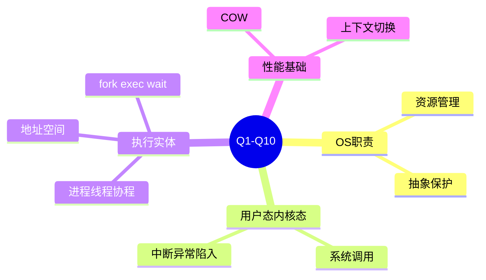
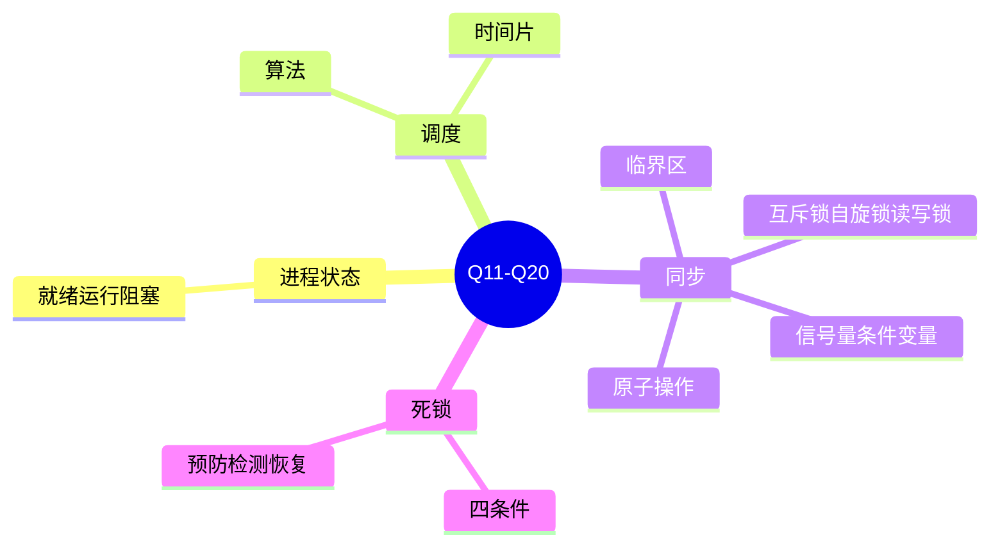
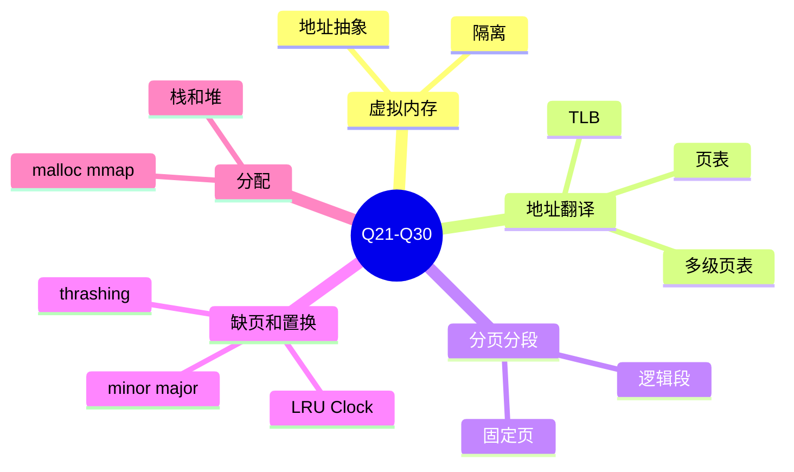
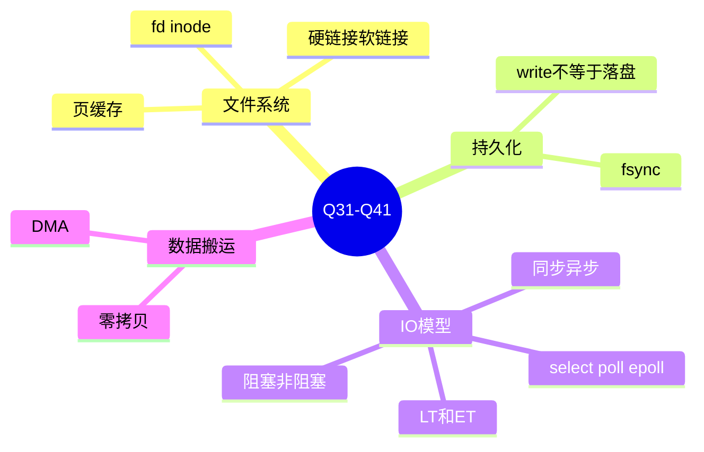
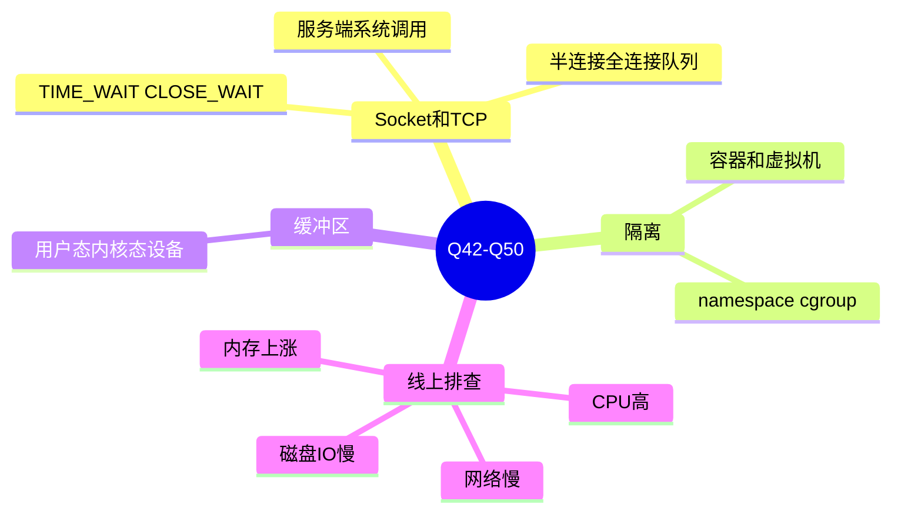
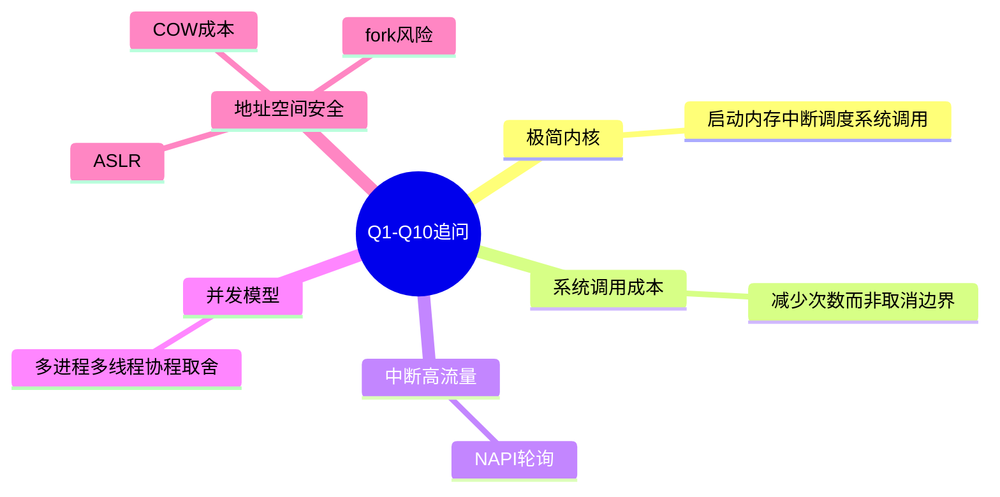
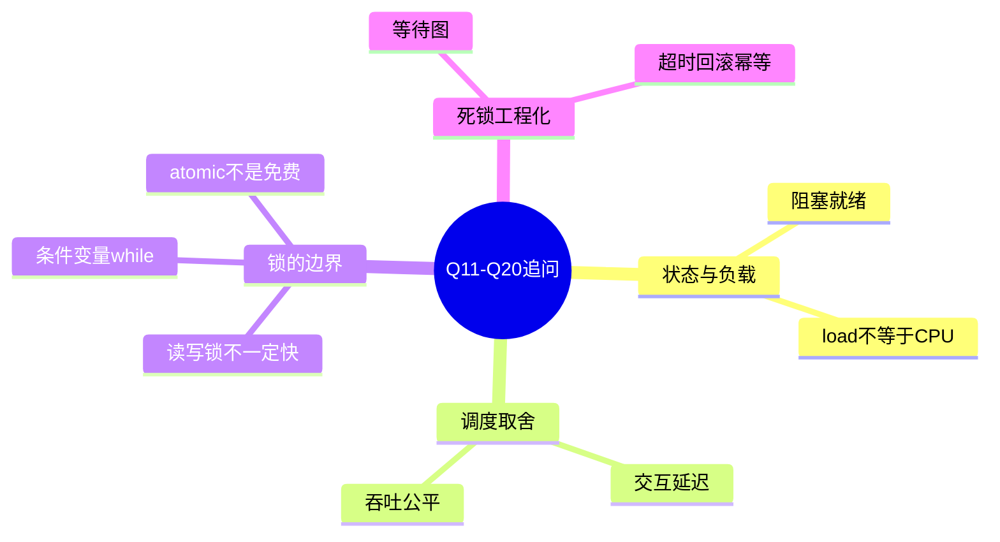
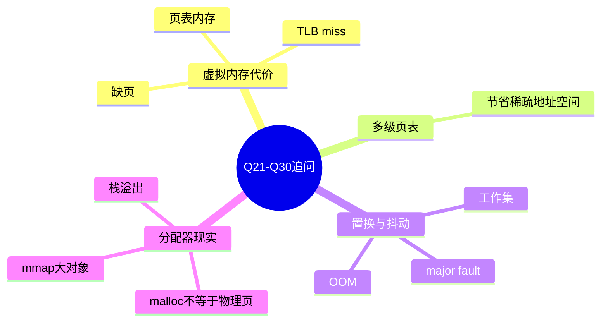
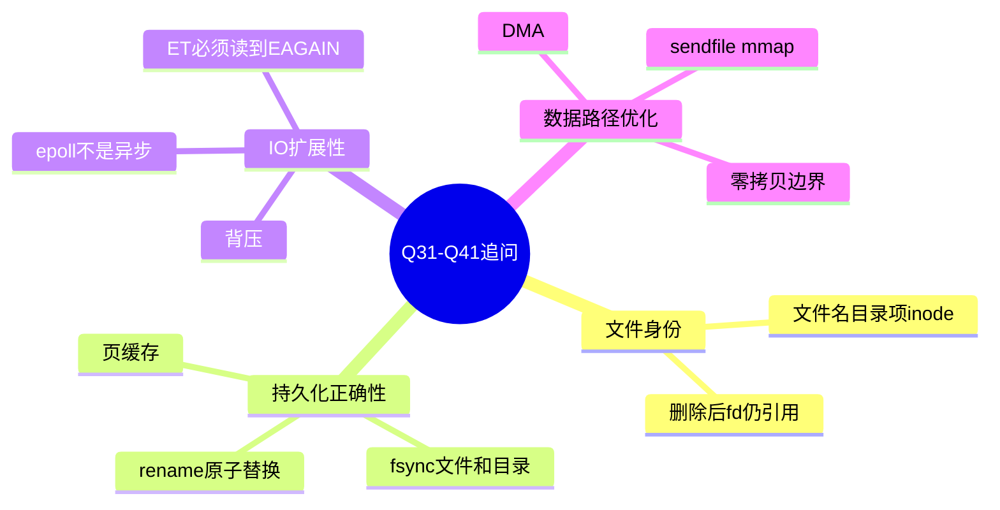
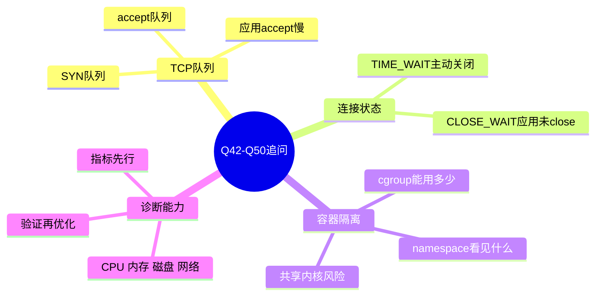

# 操作系统面试50问（完整整合版）

这份文档按“基础问题 → 完整回答 → 深度追问 → 追问回答”的方式整合整理。每个回答都尽量遵循：

```text
核心回答 → 深入机制 → 工程取舍/排查 → 面试追问
```

建议使用方法：

- 先只看问题，自己口述 1 分钟。
- 再看“核心回答”，补齐关键词。
- 最后看“深入展开”，把回答升级成可追问的版本。

## 一、面试官先提出 50 个问题
1. 操作系统的核心职责是什么？
2. 用户态和内核态为什么要区分？
3. 什么是系统调用？系统调用和普通函数调用有什么区别？
4. 中断、异常、陷入分别是什么？
5. 进程、线程、协程有什么区别？
6. 进程的地址空间通常包含哪些区域？
7. `fork`、`exec`、`wait` 分别做什么？
8. 什么是写时复制（Copy-on-Write）？
9. 线程共享哪些资源？线程私有哪些资源？
10. 什么是上下文切换？为什么它有成本？
11. 进程有哪些常见状态？阻塞和就绪有什么区别？
12. 调度算法有哪些？不同算法适合什么场景？
13. 什么是时间片？时间片太大或太小分别有什么问题？
14. 什么是临界区？为什么需要同步？
15. 互斥锁、自旋锁、读写锁分别适合什么场景？
16. 信号量和条件变量有什么区别？
17. 条件变量为什么通常要用 `while` 判断条件？
18. 什么是原子操作？它能完全替代锁吗？
19. 什么是死锁？死锁的四个必要条件是什么？
20. 如何预防、避免、检测和恢复死锁？
21. 什么是虚拟内存？它解决了哪些问题？
22. 虚拟地址如何转换成物理地址？
23. 什么是页表？为什么需要多级页表？
24. 什么是 TLB？TLB 未命中有什么影响？
25. 分页和分段有什么区别？
26. 什么是缺页异常？缺页一定是错误吗？
27. 页面置换算法有哪些？LRU 和 Clock 的思路是什么？
28. 什么是内存抖动（thrashing）？如何缓解？
29. `malloc` 和 `mmap` 有什么关系？
30. 栈和堆有什么区别？栈溢出和堆泄漏分别是什么？
31. 文件描述符是什么？它和 inode 有什么关系？
32. inode 存储什么？文件名存在哪里？
33. 硬链接和软链接有什么区别？
34. `read` 一个文件时，操作系统大致经历哪些步骤？
35. 页缓存是什么？为什么第二次读文件可能更快？
36. `write` 成功是否代表数据已经落盘？`fsync` 的作用是什么？
37. 什么是阻塞 I/O、非阻塞 I/O、同步 I/O、异步 I/O？
38. `select`、`poll`、`epoll` 有什么区别？
39. epoll 的水平触发和边缘触发有什么区别？
40. 什么是零拷贝？常见零拷贝技术有哪些？
41. DMA 是什么？它如何提升 I/O 性能？
42. Socket 是什么？一次 TCP 服务端连接建立涉及哪些系统调用？
43. TCP 半连接队列和全连接队列分别是什么？
44. 大量 `TIME_WAIT` 或 `CLOSE_WAIT` 分别说明什么？
45. 容器和虚拟机有什么区别？
46. Linux namespace 和 cgroup 分别解决什么问题？
47. 什么是用户态缓冲区、内核缓冲区和设备缓冲区？
48. CPU 飙高时你会如何排查？
49. 内存持续上涨时你会如何排查？
50. 磁盘 I/O 或网络变慢时你会如何排查？

---

## 二、逐题完整回答与深度追问

## 1. 操作系统的核心职责是什么？

### 核心回答
操作系统的核心职责是**管理资源、提供抽象、保护隔离、协调并发**。它把 CPU、内存、磁盘、网络和外设这些复杂硬件资源，封装成进程、线程、虚拟内存、文件、Socket 等更容易使用的抽象，同时保证多个程序共享机器时不会互相破坏。

### 深入展开
可以从四个角度回答：

1. **资源管理**：CPU 时间片如何分配、物理内存如何分配、磁盘块如何管理、网络包如何收发，都是 OS 的职责。
2. **抽象提供**：应用不直接操作磁盘扇区，而是读写文件；不直接操作网卡寄存器，而是使用 Socket；不直接使用物理地址，而是使用虚拟地址。
3. **保护隔离**：通过用户态/内核态、进程地址空间、文件权限、访问控制、cgroup 等机制防止越权访问。
4. **并发协调**：多个进程/线程同时运行时，OS 需要处理调度、同步、互斥、死锁、I/O 等问题。

### 面试追问
如果面试官追问“OS 最重要的抽象是什么”，可以回答：进程抽象 CPU 执行流，虚拟内存抽象物理内存，文件抽象外部存储，Socket 抽象网络通信。

### 深度追问

如果你要设计一个极简操作系统内核，你会优先实现哪些模块？为什么？

### 追问回答

我会优先实现启动初始化、内存管理、中断/异常处理、进程与调度、系统调用、基础 I/O 和文件接口。原因是 OS 的最小闭环是：能启动、能响应硬件事件、能隔离和分配内存、能运行多个执行流、能让用户程序通过受控入口请求内核服务。文件系统和网络可以后置，但如果没有中断、页表、调度和系统调用，用户程序就无法安全运行。面试中可以强调：极简内核不是功能越少越好，而是先建立资源管理和保护边界。

## 2. 用户态和内核态为什么要区分？

### 核心回答
用户态和内核态的区分，本质是为了**安全和隔离**。用户程序不能直接执行特权指令或访问任意硬件资源，必须通过系统调用进入内核，由内核检查权限后代为执行。

### 深入展开
CPU 通常提供不同特权级。应用程序运行在低特权级，内核运行在高特权级。只有内核态才能执行敏感操作，例如：

- 修改页表和地址空间映射。
- 配置中断控制器。
- 操作设备寄存器。
- 直接访问物理内存。
- 管理进程调度和文件系统元数据。

如果没有这种边界，一个普通程序就可能覆盖内核内存、读取其他进程数据、破坏磁盘文件系统，甚至关闭中断让机器失去响应。

### 成本和取舍
用户态切换到内核态需要保存上下文、切换栈、执行权限检查，因此系统调用比普通函数调用更贵。高性能程序常通过缓冲、批处理、零拷贝、减少小 I/O 等方式降低系统调用频率。

### 深度追问

如果一次系统调用成本较高，为什么不把常用逻辑都放到用户态，尽量避免进入内核？

### 追问回答

确实应尽量减少不必要的系统调用，但不能把需要全局资源管理和权限控制的逻辑随意放到用户态。用户态无法可信地管理硬件、页表、调度、文件权限和跨进程隔离。常见优化不是取消内核边界，而是减少跨边界次数，例如缓冲 I/O、批量提交、mmap、sendfile、io_uring、用户态网络栈等。核心取舍是：安全隔离需要边界，性能优化要减少边界切换频率，而不是消除边界本身。

## 3. 什么是系统调用？系统调用和普通函数调用有什么区别？

### 核心回答
系统调用是用户程序请求内核服务的接口，例如 `open`、`read`、`write`、`fork`、`execve`、`mmap`、`socket`。普通函数调用只是在用户态内部跳转执行；系统调用会跨越用户态/内核态边界。

### 深入展开
普通函数调用大致只涉及压栈、跳转、执行、返回。系统调用则通常经历：

```text
用户代码
  → libc 封装函数
  → syscall/sysenter/trap 指令
  → CPU 切到内核态
  → 内核根据系统调用号分发
  → 参数复制与权限检查
  → 执行内核逻辑
  → 返回用户态
```

系统调用的成本来自特权级切换、参数校验、可能的上下文调度、缓存/TLB 影响，以及内核中真正做的 I/O 或资源管理工作。

### 常见易错点
库函数不等于系统调用。比如 `printf()` 通常先写入用户态缓冲区，缓冲区满、遇到换行或主动刷新时才可能触发 `write()`。

### 深度追问

线上服务系统调用次数异常高，你会如何判断它是否是性能瓶颈？

### 追问回答

先用 `strace -c -p <pid>` 或 eBPF/perf 统计系统调用类型、次数和耗时，再结合 CPU 使用率、上下文切换、I/O 延迟判断。系统调用次数高不一定是瓶颈，例如大量 `epoll_wait` 可能只是事件循环空转；但频繁小 `read/write`、`stat/open/close`、`futex` 竞争、`sendto` 小包发送可能会拖慢服务。判断标准是看累计耗时、调用频率、错误码、阻塞时间以及是否能通过批处理、缓存、连接复用、减少小 I/O 优化。

## 4. 中断、异常、陷入分别是什么？

### 核心回答
中断、异常、陷入都是 CPU 控制流转入内核处理逻辑的方式，但来源不同：中断来自外部设备，异常来自当前指令执行过程，陷入来自程序主动请求。

### 深入展开
- **中断 interrupt**：异步事件，例如网卡收到数据、磁盘 I/O 完成、定时器到期。它不一定和当前执行指令有关。
- **异常 exception**：同步事件，由当前指令触发，例如缺页、除零、非法指令、保护错误。
- **陷入 trap**：程序有意触发，例如系统调用、断点调试。

中断使 CPU 不需要一直轮询设备。设备完成任务后通知 CPU，内核再处理后续逻辑。异常则让 OS 能处理缺页、非法访问等运行时情况。

### 面试表达
一句话区分：**中断是外部打断，异常是执行出事，陷入是主动进内核**。

### 深度追问

网卡流量很高时，为什么系统可能从中断模式转向轮询模式？

### 追问回答

纯中断模式在高包速下会产生大量中断，CPU 频繁打断当前执行流，导致中断风暴和上下文开销。Linux NAPI 的思想是在低流量时使用中断保证低延迟，在高流量时暂时关闭中断，改为轮询一批数据包，减少中断次数、提升吞吐。取舍是：中断适合低频事件，轮询适合高频事件；高性能网络系统常在延迟和吞吐之间动态切换。

## 5. 进程、线程、协程有什么区别？

### 核心回答
进程是资源分配和隔离单位，线程是进程内的执行流，协程是通常由用户态运行时调度的轻量执行单元。

### 深入展开
- **进程**：拥有独立地址空间、文件描述符表、信号处理、资源限制等。进程间通信需要 IPC，例如管道、Socket、共享内存。
- **线程**：共享同一进程的地址空间、堆、全局变量和文件描述符，但每个线程有自己的栈、寄存器和调度状态。
- **协程**：由语言运行时调度，切换通常不进入内核，成本较低，适合大量 I/O 并发任务。

### 工程取舍
进程隔离强但通信成本高；线程通信方便但共享状态容易出 bug；协程并发量高但依赖运行时，遇到阻塞系统调用时需要异步 I/O 或调度器配合。

### 例子
Nginx 常用多进程事件驱动模型；Java 服务常用多线程；Go 使用 goroutine 作为用户态轻量并发单元。

### 深度追问

一个高并发 Web 服务应该选择多进程、多线程还是协程模型？

### 追问回答

取决于 workload 和运行时。多进程隔离强，适合 Nginx 这类稳定 worker 模型，单个 worker 崩溃影响小；多线程适合需要共享内存、阻塞调用较多、语言运行时线程生态成熟的服务；协程适合 I/O 密集、高并发连接，因为用户态切换成本低。CPU 密集任务不能仅靠协程变快，仍受 CPU 核数限制。实际架构常组合使用：多进程利用多核，进程内事件循环或协程处理大量连接，CPU 重任务交给线程池或独立 worker。

## 6. 进程的地址空间通常包含哪些区域？

### 核心回答
进程地址空间通常包含代码段、数据段、BSS、堆、mmap 区、栈，以及内核映射相关区域。它是虚拟地址空间，不等于物理内存连续分布。

### 深入展开
典型布局：

```text
高地址
  栈：函数调用帧、局部变量、返回地址
  mmap 区：动态库、文件映射、匿名映射
  堆：malloc/new 动态分配
  BSS：未初始化或零初始化全局变量
  Data：已初始化全局变量
  Text：代码段，只读可执行
低地址
```

每个进程看到独立的虚拟地址空间。两个进程中相同的虚拟地址，可能映射到不同物理页。动态库可以通过共享物理页减少内存占用；堆和栈通常按需增长。

### 面试追问
如果问“为什么地址空间要这样分区”，可以回答：这是为了分别管理权限、生命周期和增长方式，例如代码段只读可执行，堆向高地址增长，栈向低地址增长。

### 深度追问

为什么同一个程序每次运行时，变量地址可能不同？这和安全有什么关系？

### 追问回答

这通常和 ASLR（地址空间布局随机化）有关。操作系统会随机化栈、堆、动态库、mmap 区等地址，使攻击者难以预测代码和数据位置，从而提高利用缓冲区溢出、ROP 链等攻击的难度。虚拟地址空间使这种随机化成为可能。它的代价是调试时地址不固定，需要符号表、core dump 和关闭 ASLR 等手段辅助定位。

## 7. `fork`、`exec`、`wait` 分别做什么？

### 核心回答
`fork` 创建子进程，`exec` 用新程序替换当前进程镜像，`wait` 让父进程等待并回收子进程退出状态。

### 深入展开
Unix 创建新程序常见流程：

```text
父进程 fork()
  → 子进程得到父进程副本
  → 子进程 execve() 加载新程序
  → 父进程 wait() 回收退出状态
```

`fork` 后父子进程返回值不同：父进程得到子进程 PID，子进程得到 0。`exec` 成功后不会返回到原程序，因为原地址空间已经被替换。

`wait` 很重要。如果父进程不回收已退出子进程，子进程会变成僵尸进程，保留退出状态和少量内核资源。

### 面试追问
为什么不直接设计一个 `create_process(program)`？Unix 的 `fork + exec` 灵活性强，子进程可在 exec 前设置重定向、环境变量、权限、工作目录等。

### 深度追问

为什么服务端程序中随意 fork 可能导致问题？

### 追问回答

fork 会复制父进程的地址空间和文件描述符状态。多线程程序 fork 后，子进程只保留调用 fork 的线程，其他线程持有的锁可能永远无法释放，导致子进程死锁。父进程打开的 socket、日志 fd、数据库连接也可能被子进程继承，引发重复写、连接状态混乱等问题。因此服务端 fork 后通常应尽快 exec，或者使用明确的 close-on-exec、pthread_atfork、预派生模型和严格的 fd 管理。

## 8. 什么是写时复制（Copy-on-Write）？

### 核心回答
写时复制是延迟复制技术。`fork` 后父子进程先共享同一批物理页，并把这些页标记为只读；只有某一方写入时，内核才复制该页。

### 深入展开
流程：

1. `fork` 创建子进程时，不立即复制所有物理内存。
2. 父子进程页表都指向同一物理页，并标记只读/COW。
3. 某进程尝试写入该页，触发缺页异常。
4. 内核分配新物理页，复制旧内容，更新写入方页表。
5. 写入方继续执行。

### 优势
- `fork` 非常快。
- 节省大量内存复制。
- 特别适合 `fork` 后马上 `exec` 的场景。

### 代价
第一次写入共享页会触发缺页和页面复制，存在延迟尖峰。大进程频繁 fork 且大量写内存时，COW 成本会明显。

### 深度追问

Redis 这类内存数据库在后台持久化时使用 fork，会遇到什么 COW 成本？

### 追问回答

Redis BGSAVE/AOF rewrite 会 fork 子进程生成持久化文件。fork 初始很快，因为父子共享内存页；但如果父进程继续处理写请求，被修改的页会触发 COW 复制，导致额外内存占用和复制开销。数据集越大、写入越密集，COW 放大越明显，可能造成内存峰值升高甚至 OOM。因此生产中要预留内存、控制写峰值、关注 fork 延迟和 copy-on-write 额外内存。

## 9. 线程共享哪些资源？线程私有哪些资源？

### 核心回答
同一进程内线程共享地址空间、堆、全局变量、文件描述符等进程级资源；线程私有栈、寄存器、程序计数器、线程局部存储和调度状态。

### 深入展开
共享资源包括：

- 代码段、数据段、堆。
- 打开的文件描述符。
- 当前工作目录。
- 进程 ID、资源限制等进程属性。
- 信号处理配置在很多系统中也有进程级共享部分。

私有资源包括：

- 线程栈：保存函数调用链和局部变量。
- 寄存器上下文：决定线程恢复后从哪里继续执行。
- TLS：线程局部变量。
- 调度优先级、状态等。

### 工程影响
共享地址空间让线程通信很快，但也需要锁、原子操作或消息队列保护共享状态。线程 bug 常表现为偶发、难复现、与时序相关。

### 深度追问

为什么多线程程序中一个线程崩溃可能导致整个进程退出？

### 追问回答

线程共享同一进程地址空间。一个线程发生非法内存访问、破坏堆结构、写坏全局变量或触发未处理致命信号，影响的是整个进程，而不是该线程自己的隔离环境。相比进程，线程没有强内存隔离，这是共享内存通信的代价。工程上要通过内存安全语言、边界检查、崩溃隔离、多进程 worker、监督进程等降低风险。

## 10. 什么是上下文切换？为什么它有成本？

### 核心回答
上下文切换是 CPU 从一个任务切到另一个任务时保存当前执行上下文、恢复另一个任务上下文的过程。它有直接保存恢复成本，也有缓存和 TLB 局部性损失。

### 深入展开
切换时可能需要处理：

- 保存/恢复通用寄存器、PC、SP。
- 切换内核栈和调度结构。
- 切换地址空间或页表根。
- 更新调度器运行队列。
- 处理 FPU/SIMD 状态。

线程切换通常比进程切换轻，因为同进程线程共享地址空间；进程切换可能影响 TLB 和页表上下文。

### 性能影响
线程太多、锁竞争严重、I/O 频繁阻塞、时间片过小都会增加上下文切换。高上下文切换会让 CPU 忙于调度而不是业务计算。Linux 可用 `vmstat 1` 看 `cs`，用 `pidstat -w` 看进程切换。

### 深度追问

如何判断线上服务慢是因为上下文切换太多？

### 追问回答

可以用 `vmstat 1` 看系统级 `cs`，用 `pidstat -w -p <pid> 1` 看进程自愿/非自愿上下文切换，用 `perf sched` 或 eBPF 工具进一步分析。若 CPU 利用率不高但 load 高、cs 很高、线程数很多、futex 调用频繁，可能是锁竞争、线程池过大或阻塞唤醒频繁。优化方向包括减少线程数、使用异步 I/O、降低锁粒度、批量处理、减少短任务频繁投递。

## 11. 进程有哪些常见状态？阻塞和就绪有什么区别？

### 核心回答
进程常见状态包括新建、就绪、运行、阻塞、终止。就绪表示只差 CPU；阻塞表示等待某个事件，即使 CPU 空闲也不能运行。

### 深入展开
状态转换大致是：

```text
新建 → 就绪 → 运行 → 终止
          ↑      ↓
          └── 阻塞
```

- 运行 → 就绪：时间片用完或被更高优先级任务抢占。
- 运行 → 阻塞：等待 I/O、锁、条件变量、网络数据等。
- 阻塞 → 就绪：等待事件完成，例如磁盘中断到达、锁可用。

### Linux 中的常见状态
`ps` 中常见：`R` 运行/就绪，`S` 可中断睡眠，`D` 不可中断睡眠，`Z` 僵尸，`T` 停止。

### 面试重点
不要把阻塞理解成“正在占用 CPU”。大多数阻塞线程不消耗 CPU；忙等才会消耗 CPU。

### 深度追问

Linux 中大量 D 状态进程意味着什么？应该怎么排查？

### 追问回答

D 状态通常是不可中断睡眠，多见于等待磁盘、NFS、块设备、内核 I/O 路径。大量 D 状态会拉高 load average，但 CPU 可能并不高。排查时看 `ps -eo state,pid,comm,wchan`、`dmesg`、`iostat -x 1`、存储/NFS 状态、内核堆栈。D 状态进程不能被普通信号立即杀死，因为它正在等待内核不可中断资源返回。核心是定位卡住的 I/O 或内核等待点。

## 12. 调度算法有哪些？不同算法适合什么场景？

### 核心回答
常见调度算法有 FCFS、SJF、时间片轮转、优先级调度、多级反馈队列和 Linux CFS。不同算法在响应时间、吞吐量、公平性和实时性之间取舍。

### 深入展开
- **FCFS**：先来先服务，实现简单，但长任务会阻塞短任务。
- **SJF**：短作业优先，平均等待时间低，但需要预测运行时间，长任务可能饥饿。
- **RR**：时间片轮转，公平且适合交互式系统，但时间片选择很关键。
- **优先级调度**：重要任务优先，但低优先级任务可能饥饿，需要 aging。
- **MLFQ**：多级反馈队列，根据任务行为动态调整优先级，兼顾短交互任务和长批处理任务。
- **CFS**：Linux 的公平调度思路，用虚拟运行时间衡量任务获得 CPU 的公平性。

### 场景表达
桌面系统重响应，批处理系统重吞吐，实时系统重截止时间，服务器重 tail latency、吞吐和公平。

### 深度追问

为什么实时任务不能简单依赖普通公平调度？

### 追问回答

普通公平调度追求长期 CPU 份额公平，不保证某个任务必须在截止时间前运行。实时任务关心 deadline 和最大延迟，例如音频、工业控制、交易撮合中的某些低延迟路径。它需要实时调度策略、优先级继承、CPU 隔离、减少中断干扰、锁路径可控等。公平调度可能让实时任务因其他任务、锁竞争或内核路径导致不可接受的尾延迟。

## 13. 什么是时间片？时间片太大或太小分别有什么问题？

### 核心回答
时间片是调度器允许一个任务连续运行的 CPU 时间。时间片太大响应差，时间片太小切换开销高。

### 深入展开
如果时间片太大，长时间运行的 CPU 密集任务会占住 CPU，交互任务等待时间变长，系统响应不灵敏。

如果时间片太小，任务频繁被抢占，上下文切换次数增加，CPU Cache 和 TLB 局部性变差，真正执行业务代码的比例下降。

### 取舍
时间片设计需要兼顾：

- 交互响应。
- 调度开销。
- 缓存局部性。
- 公平性。
- 工作负载类型。

现代调度器通常不只是固定时间片，而是根据权重、优先级、虚拟运行时间等综合决策。

### 深度追问

在交互式桌面和批处理计算集群中，时间片设计为什么不同？

### 追问回答

交互式桌面需要低响应延迟，用户输入、窗口刷新、音频播放不能长时间等待，因此更重视短任务快速响应。批处理计算集群更重吞吐和缓存局部性，任务长时间运行反而能减少切换开销。时间片过小会增加上下文切换，过大又损害响应。现代调度器会根据任务交互性、优先级、权重和运行历史动态调整，而不是使用一个固定值适配所有场景。

## 14. 什么是临界区？为什么需要同步？

### 核心回答
临界区是访问共享资源且必须互斥执行的代码区域。同步是为了避免竞态条件，保证共享状态一致、操作可见、有序。

### 深入展开
例如 `counter++` 看起来是一行代码，底层可能是：

```text
load counter
add 1
store counter
```

两个线程同时执行可能都读到旧值，最终只加了一次。这就是竞态条件。

同步要解决三类问题：

1. **互斥**：同一时刻只能一个线程修改共享状态。
2. **可见性**：一个线程修改后，另一个线程能看到。
3. **有序性**：防止编译器或 CPU 重排破坏并发语义。

### 常见手段
互斥锁、读写锁、信号量、条件变量、原子操作、消息队列、不可变数据结构等。

### 深度追问

如果一个共享变量只有一个线程写、多个线程读，还需要同步吗？

### 追问回答

通常仍需要同步或原子/内存序保证。原因不只是互斥，还有可见性和有序性。写线程更新变量后，读线程可能因为 CPU 缓存、编译器重排、寄存器缓存而看不到最新值；如果变量和其他数据有依赖关系，还可能看到部分更新状态。解决方式包括互斥锁、读写锁、原子变量、volatile 语义（视语言而定）、内存屏障或消息传递。不能只凭“单写多读”认为一定安全。

## 15. 互斥锁、自旋锁、读写锁分别适合什么场景？

### 核心回答
互斥锁适合一般临界区；自旋锁适合极短临界区且不能睡眠的场景；读写锁适合读多写少场景。

### 深入展开
- **互斥锁 Mutex**：获取失败时线程通常睡眠，避免浪费 CPU。适合临界区可能较长或等待时间不确定的场景。
- **自旋锁 Spinlock**：获取失败时循环等待，不发生睡眠/唤醒。适合内核、低层运行时、临界区非常短的场景。持锁时间长会浪费 CPU。
- **读写锁 RWLock**：多个读者可以并发，写者独占。适合读远多于写的数据结构。

### 取舍
读写锁不一定比互斥锁快。如果写频繁，或者读锁管理成本高，反而可能更慢。自旋锁在单核或持锁线程被抢占时尤其危险。

### 深度追问

为什么在用户态业务代码中滥用自旋锁通常不是好选择？

### 追问回答

自旋锁等待时持续占用 CPU。如果持锁线程被操作系统抢占、发生 I/O、GC 或执行较长临界区，等待线程会空转浪费 CPU，甚至加剧调度压力。用户态业务临界区耗时通常不可严格控制，因此互斥锁或条件变量更稳妥。自旋锁更适合内核或运行时中极短、不可睡眠、可预期的临界区。高竞争场景下，自旋还会造成缓存行争用和总线流量。

## 16. 信号量和条件变量有什么区别？

### 核心回答
信号量维护一个计数，用来控制资源数量；条件变量用于等待某个条件成立，通常配合互斥锁使用。

### 深入展开
**信号量**适合表达“还有几个资源可用”。例如连接池最多 10 个连接，信号量初始值为 10，获取连接 P 操作减 1，归还连接 V 操作加 1。

**条件变量**适合表达“状态变化了，请重新检查条件”。例如队列为空时消费者等待，生产者放入元素后通知。

### 本质区别
- 信号量本身带计数，通知不会轻易丢失。
- 条件变量本身不保存业务状态，状态必须由共享变量表达，并由互斥锁保护。

### 面试例子
生产者消费者既可以用信号量表示空槽和已用槽，也可以用互斥锁 + 条件变量表示队列非空/非满。

### 深度追问

有界阻塞队列用条件变量如何正确实现？

### 追问回答

需要一个互斥锁保护队列状态，两个条件变量分别表示 not_empty 和 not_full。生产者加锁后，如果队列满，就在 not_full 上 while 等待；插入元素后通知 not_empty。消费者加锁后，如果队列空，就在 not_empty 上 while 等待；取出元素后通知 not_full。关键点是：队列大小这个共享状态必须在锁内检查和修改，等待条件必须用 while，通知应该发生在状态改变之后。

## 17. 条件变量为什么通常要用 `while` 判断条件？

### 核心回答
条件变量等待必须用 `while`，因为被唤醒不代表条件一定成立。可能发生虚假唤醒，也可能条件已被其他线程消费。

### 深入展开
标准模式：

```c
pthread_mutex_lock(&m);
while (!condition) {
    pthread_cond_wait(&cv, &m);
}
// 条件满足，执行逻辑
pthread_mutex_unlock(&m);
```

`pthread_cond_wait` 会原子地释放锁并进入等待，被唤醒后再重新获取锁。必须重新检查条件，因为：

1. **虚假唤醒**：实现允许没有明确通知也返回。
2. **竞争消费**：多个等待者被唤醒，先获得锁的线程可能已经改变条件。
3. **广播通知**：`broadcast` 会唤醒多个线程，但资源可能只够一个。

### 面试重点
条件变量的通知只是“条件可能发生变化”，不是“条件已经满足”的保证。

### 深度追问

如果用 `if` 代替 `while`，线上可能出现什么隐蔽 bug？

### 追问回答

可能出现消费者被唤醒后发现队列仍为空，却继续取数据，导致越界、空指针或逻辑错误。原因可能是虚假唤醒，也可能是多个消费者同时被唤醒，先获得锁的消费者已经取走唯一元素。用 `if` 的 bug 很隐蔽，因为低并发下不容易复现，高并发或调度时序变化时才出现。`while` 的本质是把条件变量通知视为“状态可能变化”，而不是“状态一定满足”。

## 18. 什么是原子操作？它能完全替代锁吗？

### 核心回答
原子操作是不可分割的并发操作，例如 CAS、fetch_add、atomic_exchange。它能解决简单共享变量更新，但不能完全替代锁。

### 深入展开
原子操作适合：

- 引用计数。
- 状态标志位。
- 简单计数器。
- 无锁队列/栈的底层构件。

但复杂临界区通常仍需要锁，因为需要维护多个变量之间的一致性。无锁代码还要处理内存序、ABA 问题、重试开销、缓存行竞争等。

### 取舍
原子操作避免线程睡眠，但在高竞争下可能大量 CAS 失败并自旋重试，CPU 消耗很高。锁虽然可能阻塞，但表达复杂逻辑更简单，正确性更容易保证。

### 深度追问

高并发计数器用一个全局 atomic 变量有什么性能问题？

### 追问回答

全局 atomic 自增虽然正确，但在多核高并发下会让同一个缓存行频繁在 CPU 核之间失效和迁移，形成缓存一致性热点。吞吐可能很差。优化方式包括分片计数器、每线程本地计数、批量汇总、LongAdder 类结构、减少更新频率。这个例子说明无锁不等于无成本，原子操作的瓶颈常来自缓存一致性和内存屏障。

## 19. 什么是死锁？死锁的四个必要条件是什么？

### 核心回答
死锁是多个线程或进程互相等待对方持有的资源，导致所有参与者都无法继续。四个必要条件是互斥、持有并等待、不可抢占、循环等待。

### 深入展开
四个条件：

1. **互斥**：资源不能同时被多个执行流使用。
2. **持有并等待**：已经持有资源时继续申请新资源。
3. **不可抢占**：资源不能被外部强制剥夺，只能持有者主动释放。
4. **循环等待**：存在资源等待环，例如 A 等 B 的锁，B 等 A 的锁。

### 例子
线程 1 持有锁 L1，等待 L2；线程 2 持有 L2，等待 L1。这就是最典型的死锁。

### 面试重点
四个条件同时满足才可能死锁。预防死锁就是破坏其中至少一个条件。

### 深度追问

数据库事务死锁和线程锁死锁有什么相似与不同？

### 追问回答

相似点是都存在资源等待环：事务等待行锁/表锁，线程等待互斥锁。不同点是数据库通常能维护锁等待图，检测到死锁后主动回滚其中一个事务；线程锁死锁在普通程序中未必有统一检测机制，可能一直挂住。数据库事务还有隔离级别、行锁范围、索引扫描、间隙锁等因素，死锁可能来自 SQL 执行计划和访问顺序。工程上都需要统一资源访问顺序、缩短持锁时间和可重试设计。

## 20. 如何预防、避免、检测和恢复死锁？

### 核心回答
死锁处理分为预防、避免、检测、恢复。工程中最常见的是统一锁顺序、缩小临界区、超时重试、死锁检测后回滚。

### 深入展开
- **预防**：通过规则破坏死锁条件。例如所有线程都按固定顺序获取锁，破坏循环等待。
- **避免**：分配资源前判断是否进入不安全状态。银行家算法是教材经典方法，但工程中使用较少，因为需要预知最大需求。
- **检测**：允许死锁发生，构建等待图查找环。数据库常用这种方式。
- **恢复**：杀死进程、回滚事务、释放资源、重试操作。

### 工程建议
不要持锁做慢 I/O；不要持锁调用外部回调；锁层级要写清楚；跨服务调用要有超时和幂等补偿，不能无限等待。

### 深度追问

微服务场景中的“分布式死锁”或资源等待环如何处理？

### 追问回答

微服务中可能不是传统锁，而是线程池、连接池、队列、下游服务配额之间形成等待环。例如服务 A 持有数据库连接等待 B，B 又等待 A 的回调或同一连接池资源。处理方式是超时、熔断、限流、舱壁隔离、资源池分级、异步化、幂等重试和补偿事务。不要无限等待；跨服务调用必须有 deadline，并避免在持有稀缺资源时调用不可靠下游。

## 21. 什么是虚拟内存？它解决了哪些问题？

### 核心回答
虚拟内存是 OS 为每个进程提供的独立虚拟地址空间，通过页表映射到物理内存。它解决隔离、地址连续抽象、按需加载、共享和内存扩展等问题。

### 深入展开
虚拟内存的价值：

1. **隔离**：进程不能直接访问其他进程物理内存。
2. **简化编程**：程序认为自己拥有连续地址空间。
3. **按需分页**：用到哪页再加载哪页。
4. **共享**：动态库、文件映射可共享物理页。
5. **保护**：页表可标记只读、可执行、用户/内核权限。
6. **换页**：内存压力下可把冷页换出。

### 常见误区
虚拟内存不等于 swap。swap 是虚拟内存体系中的后备存储机制之一；即使没有 swap，进程仍使用虚拟地址。

### 深度追问

容器设置了内存限制后，虚拟内存机制会带来哪些容易误判的现象？

### 追问回答

进程看到的虚拟地址空间可能很大，但容器 cgroup 限制的是实际可用物理内存/匿名页/页缓存等资源。应用 `malloc` 很大不一定立即占用物理内存；真正触碰页面后才计入。容器内 `free` 看到的信息也可能受宿主机和 cgroup 版本影响。OOM 可能由 cgroup 触发，而不是整机内存不足。排查要看 cgroup memory.current/memory.max、RSS、cache、swap、OOM 日志，而不能只看虚拟内存大小。

## 22. 虚拟地址如何转换成物理地址？

### 核心回答
虚拟地址通过 MMU、TLB 和页表转换成物理地址。虚拟地址由虚拟页号和页内偏移组成，页表负责把虚拟页号映射到物理页框号。

### 深入展开
流程：

```text
CPU 产生虚拟地址
  → 拆分虚拟页号 + 页内偏移
  → 查 TLB
  → 命中：得到物理页框号
  → 未命中：查多级页表
  → 页表有效：更新 TLB
  → 页表无效：触发缺页异常
```

最终物理地址 = 物理页框号 + 页内偏移。

### 性能点
地址转换发生在几乎每次内存访问中，因此 TLB 命中率非常关键。大工作集、随机访问、多进程切换都会影响 TLB。

### 深度追问

为什么数据库或高性能服务有时会使用 Huge Page？

### 追问回答

Huge Page 增大页面大小，例如从 4KB 变成 2MB 或 1GB，能减少页表项数量，提高 TLB 覆盖范围，降低 TLB miss 和页表遍历成本。对大内存、访问局部性较稳定的数据库有收益。代价是内存分配更粗粒度，可能增加内部碎片，配置不当还会影响系统灵活回收内存。是否使用要结合工作集大小、TLB miss、NUMA 和内存碎片情况评估。

## 23. 什么是页表？为什么需要多级页表？

### 核心回答
页表是虚拟页到物理页框的映射表。多级页表是为了节省页表自身占用的内存，只为实际使用的地址范围分配页表结构。

### 深入展开
页表项通常包含：

- 物理页框号。
- 有效位。
- 读写执行权限。
- 用户/内核权限。
- 访问位、脏位。
- COW、缓存策略等标志。

如果使用单级页表，64 位地址空间会让页表极其庞大，很多未使用地址也要占页表项。多级页表按需分配中间层，未使用的大块虚拟空间不需要页表页。

### 代价
多级页表增加了地址翻译时的内存访问次数，所以必须依赖 TLB 缓存。

### 深度追问

页表本身占内存，进程很多时页表开销会不会成为问题？

### 追问回答

会。每个进程都有自己的地址空间和页表结构，大量进程、大量 mmap、稀疏但广阔的地址空间都会带来页表内存开销。多级页表通过按需分配减少未使用区域的开销，但已映射的大量页面仍需要页表项。优化包括共享只读映射、减少进程数、使用线程/协程、Huge Page 降低页表项数量，以及避免不必要的大量小 mmap。

## 24. 什么是 TLB？TLB 未命中有什么影响？

### 核心回答
TLB 是地址翻译缓存，缓存虚拟页到物理页框的映射。TLB 未命中会导致查页表，增加内存访问延迟。

### 深入展开
没有 TLB 时，每次访问内存都可能先访问页表，再访问真正数据。多级页表甚至要多次访存。TLB 把近期用过的页表项缓存到 CPU 内部，大幅降低地址翻译开销。

### TLB 未命中的影响
- 访问延迟升高。
- 随机访问大数组性能下降。
- 上下文切换可能导致 TLB 项失效或命中率下降。
- 虚拟化场景下地址翻译层次更多，TLB 更重要。

### 优化思路
提高局部性、使用大页、减少随机访问、控制工作集大小，都可能改善 TLB 表现。

### 深度追问

为什么遍历链表可能比遍历数组慢很多，除了缓存还有 TLB 原因吗？

### 追问回答

有。数组连续存储，空间局部性好，CPU Cache 和 TLB 都容易命中；链表节点分散在堆上，访问下一个节点可能跳到完全不同的缓存行甚至不同页面，导致 Cache miss 和 TLB miss。TLB miss 会触发页表遍历，进一步增加延迟。这个例子说明数据结构性能不只取决于时间复杂度，还取决于内存布局、缓存局部性和地址转换成本。

## 25. 分页和分段有什么区别？

### 核心回答
分段按逻辑单元划分地址空间，分页按固定大小页面管理内存。分段更贴近程序逻辑，分页更利于物理内存管理。

### 深入展开
**分段**：代码段、数据段、栈段等，每段长度不同。优点是符合逻辑结构，方便权限保护；缺点是会产生外部碎片。

**分页**：虚拟地址和物理内存都切成固定大小页/页框。优点是分配简单、无外部碎片、支持虚拟内存；缺点是页表开销和内部碎片。

### 现代系统
现代通用 OS 主要依赖分页。某些架构仍保留段机制，但实际内存隔离和换页通常由分页完成。

### 面试总结
分段解决“程序逻辑视图”，分页解决“物理内存离散分配和虚拟内存管理”。

### 深度追问

为什么现代系统主要用分页而不是纯分段来管理内存？

### 追问回答

分页使用固定大小页框，便于物理内存离散分配、换页、共享和权限控制，几乎不产生外部碎片。纯分段大小可变，虽然符合程序逻辑，但外部碎片严重，内存压缩成本高，不适合现代多进程、大地址空间和虚拟内存需求。现代系统可以在逻辑上保留段的概念，但真正的地址空间隔离、换页和映射管理主要依赖分页。

## 26. 什么是缺页异常？缺页一定是错误吗？

### 核心回答
缺页异常是进程访问某虚拟页时，页表中没有有效映射或权限不满足而触发的异常。缺页不一定是错误，很多缺页是正常的按需分页机制。

### 深入展开
缺页可能包括：

- **按需加载**：程序访问尚未加载的代码页或数据页，内核从文件读入。
- **匿名页分配**：首次访问堆/栈页面，内核分配物理页。
- **写时复制**：写 COW 页，内核复制页面。
- **非法访问**：访问空指针、越界地址、无权限区域，触发段错误。

### 成本
软缺页可能只需要建立映射；硬缺页需要磁盘 I/O，成本非常高。频繁硬缺页会严重拖慢程序。

### 面试表达
缺页是 CPU 和 OS 协作实现虚拟内存的正常机制，只有非法缺页才是程序错误。

### 深度追问

缺页率升高时，如何判断是正常按需加载还是内存压力问题？

### 追问回答

要区分 minor fault 和 major fault。minor fault 多可能是建立映射、COW、首次触碰匿名页，不一定慢；major fault 需要磁盘 I/O，频繁出现通常说明内存压力或文件随机访问。可以看 `vmstat`、`perf stat -e page-faults,major-faults`、`/proc/<pid>/stat`、I/O 指标和 swap in/out。程序启动或加载大文件初期缺页正常；稳定运行后 major fault 持续升高则需要关注工作集、内存限制和访问模式。

## 27. 页面置换算法有哪些？LRU 和 Clock 的思路是什么？

### 核心回答
页面置换算法用于内存不足时选择换出哪些页。常见算法有 OPT、FIFO、LRU、Clock。LRU 换出最近最少使用的页，Clock 用访问位近似 LRU。

### 深入展开
- **OPT**：换出未来最长时间不用的页，理论最优但无法实现。
- **FIFO**：换出最早进入内存的页，实现简单，但可能淘汰热点页。
- **LRU**：基于时间局部性，认为最近没用过的页未来也不太会用。精确 LRU 需要维护访问顺序，成本高。
- **Clock**：把页面放在环上，用访问位表示最近是否被访问。访问位为 1 就清零并跳过，访问位为 0 就换出。

### 工程意义
真实 OS 通常使用近似 LRU 的策略，并结合脏页、文件页/匿名页、优先级、cgroup 等因素决策。

### 深度追问

为什么真实操作系统不能简单实现精确 LRU？

### 追问回答

精确 LRU 需要在每次页面访问时更新全局访问顺序，这会给每次内存访问引入巨大开销，并导致多核同步竞争。硬件通常只提供访问位、脏位等有限信息，OS 只能周期性采样或近似判断冷热。Clock、活跃/非活跃链表等算法本质是在可接受开销下近似 LRU。真实系统还要考虑脏页回写成本、文件页与匿名页、cgroup、公平性，而不是只看最近访问时间。

## 28. 什么是内存抖动（thrashing）？如何缓解？

### 核心回答
内存抖动是物理内存不足导致系统频繁换页，CPU 大量时间耗在页面换入换出上，程序实际执行很少。

### 深入展开
抖动通常发生在活跃工作集总量超过物理内存时。系统刚换入一个页面，很快又因内存压力把它换出；下次访问又要换入，形成恶性循环。

### 表现
- 系统变得极慢。
- 磁盘 I/O 很高。
- CPU 利用率可能不高，但负载很高。
- `vmstat` 中 swap in/out 持续明显。

### 缓解
增加内存、降低并发、优化程序局部性、限制容器内存、减少大对象随机访问、优化缓存策略、避免过度 fork 或内存泄漏。核心目标是让工作集放得进物理内存。

### 深度追问

线上机器 CPU 不高但非常卡，load 很高，swap 持续读写，你如何解释？

### 追问回答

这很可能是内存抖动。进程工作集超过物理内存，系统不断把页面换出又换入，CPU 大量时间等待磁盘 I/O，业务线程处于 D 状态或等待缺页完成，所以 CPU 不一定高，但 load 很高、响应很慢。排查看 `vmstat 1` 的 si/so、`iostat`、major fault、RSS 和 cgroup 限制。缓解要降低并发、释放内存、扩容、限制缓存、减少随机访问或关闭导致抖动的任务。

## 29. `malloc` 和 `mmap` 有什么关系？

### 核心回答
`malloc` 是用户态内存分配接口，底层可能通过 `brk/sbrk` 或 `mmap` 向内核申请内存。`mmap` 是系统调用，可创建文件映射或匿名内存映射。

### 深入展开
内存分配器通常不会每次 `malloc` 都进入内核。它会向内核申请一大块内存，然后在用户态维护空闲链表、arena、缓存等结构。

常见策略：

- 小对象从堆或分配器缓存中切分。
- 大对象可能直接用 `mmap` 分配，释放时更容易归还 OS。
- `free` 后内存可能留在分配器中复用，不一定立刻降低 RSS。

### 面试追问
如果问“为什么 free 后内存不下降”，可以回答：内存可能回到用户态分配器缓存，而不是归还内核；还可能存在碎片、arena 保留、mmap 策略等原因。

### 深度追问

为什么频繁分配释放大对象可能导致性能抖动？

### 追问回答

大对象可能走 mmap，分配释放会频繁进入内核，建立/拆除 VMA、页表映射，触发缺页和 TLB shootdown，还可能造成地址空间碎片。即使不走 mmap，大对象也会造成堆碎片和缓存/TLB 压力。优化方式包括对象池、复用缓冲区、批量分配、限制临时大对象、使用 arena 或专门分配器。但对象池也可能增加常驻内存，需要结合峰值和生命周期评估。

## 30. 栈和堆有什么区别？栈溢出和堆泄漏分别是什么？

### 核心回答
栈由编译器和运行时自动管理，用于函数调用帧和局部变量；堆用于动态分配对象，生命周期由程序或 GC 管理。栈溢出是栈空间耗尽，堆泄漏是不再需要的堆对象未释放或仍被引用。

### 深入展开
**栈**特点：分配释放快，遵循函数调用后进先出，空间通常较小。递归过深、大局部数组、无限递归都可能栈溢出。

**堆**特点：生命周期灵活，适合动态对象，但分配释放成本较高，可能产生碎片和泄漏。

### 错误类型
- 栈溢出：如无限递归导致栈帧不断增长。
- 堆泄漏：如 C/C++ 中 `malloc` 后未 `free`，或 GC 语言中对象被全局集合无意义持有。
- use-after-free：释放后继续访问。
- double-free：重复释放。

### 工程排查
栈问题看调用深度和线程栈大小；堆问题用 heap profiler、dump、ASan、Valgrind、pprof 等工具。

### 深度追问

为什么线程数过多会导致内存占用明显增加，即使每个线程没做什么？

### 追问回答

每个线程通常都有独立线程栈，默认栈大小可能是数百 KB 到数 MB。即使栈按需提交，虚拟地址空间和部分栈页、线程控制块、调度结构、TLS 等都会消耗资源。线程过多还会增加上下文切换和调度开销。解决方式包括调小线程栈、使用线程池、异步 I/O 或协程，避免为每个连接创建一个线程。

## 31. 文件描述符是什么？它和 inode 有什么关系？

### 核心回答
文件描述符是进程访问内核 I/O 对象的整数句柄。它通过进程 fd 表指向打开文件表项，打开文件表项再关联 inode 或 socket 等内核对象。

### 深入展开
关系可以理解为：

```text
进程 fd 表
  → open file description（偏移量、打开模式、状态标志）
  → inode/vnode（文件元数据）或 socket 对象
  → 文件数据/设备/网络
```

多个 fd 可以指向同一个 inode。例如同一文件打开两次得到两个 fd，它们可能有独立偏移；`dup` 出来的 fd 则共享同一个打开文件表项和偏移量。

### 面试追问
fd 不只代表普通文件，还可以代表管道、socket、eventfd、epoll fd、设备文件等。这体现了 Unix “一切皆文件”的接口思想。

### 深度追问

线上出现 Too many open files，你会如何定位是 fd 泄漏还是正常容量不足？

### 追问回答

先看 `ulimit -n` 和进程当前 fd 数：`ls /proc/<pid>/fd | wc -l`。用 `lsof -p <pid>` 或按 fd 类型统计，看是 socket、文件、pipe 还是 eventfd。若 fd 数持续增长且连接/请求数回落后不下降，可能泄漏；若与并发连接数一致，可能是容量不足，需要调大限制并优化连接复用。大量 CLOSE_WAIT 通常指向 socket 未关闭；大量日志文件 fd 可能是文件轮转处理错误。

## 32. inode 存储什么？文件名存在哪里？

### 核心回答
inode 存储文件元数据和数据块索引，文件名存储在目录项中。目录项负责把文件名映射到 inode 编号。

### 深入展开
inode 通常包含：

- 文件类型。
- 权限、所有者、组。
- 文件大小。
- 时间戳。
- 链接数。
- 数据块指针或 extent 信息。

文件名不在 inode 中，而是在目录文件的数据内容中。目录本质上是特殊文件，保存多个“名称 → inode”的映射。

### 重要结论
同一个 inode 可以有多个文件名，这就是硬链接。删除文件名只是删除目录项并减少链接计数；只有链接计数为 0 且没有进程打开时，文件数据才真正释放。

### 深度追问

磁盘空间还有剩余，但创建文件失败提示 no space left，可能是什么原因？

### 追问回答

可能是 inode 用尽。文件系统不仅有数据块限制，还有 inode 数量限制。大量小文件会耗尽 inode，即使磁盘容量还没用完也无法创建新文件。可用 `df -h` 看容量，用 `df -i` 看 inode 使用率。解决方式包括删除小文件、归档合并、调整文件系统 inode 配置、使用对象存储或数据库管理海量小对象。

## 33. 硬链接和软链接有什么区别？

### 核心回答
硬链接是多个目录项指向同一个 inode；软链接是一个特殊文件，内容是目标路径。

### 深入展开
硬链接特点：

- 与原文件地位平等，没有“主从”。
- 不能跨文件系统。
- 通常不能链接目录，避免目录环。
- 删除一个名字不影响其他硬链接访问文件。

软链接特点：

- 保存路径字符串。
- 可以跨文件系统。
- 可以指向目录。
- 目标删除后会变成悬空链接。

### 面试例子
如果 `a` 和 `b` 是硬链接，删除 `a` 后 `b` 仍能访问数据。如果 `b` 是指向 `a` 的软链接，删除 `a` 后 `b` 失效。

### 深度追问

为什么日志文件被删除后，磁盘空间可能没有释放？

### 追问回答

如果进程仍然打开着被删除的文件，目录项已经没了，链接数可能为 0，但 inode 和数据块仍被打开文件表项引用，空间不会释放。只有进程关闭 fd 或退出后，内核才真正释放数据块。可以用 `lsof | grep deleted` 查找。这个问题和硬链接/inode 引用计数有关：文件是否释放取决于链接计数和打开引用，而不只是路径是否存在。

## 34. `read` 一个文件时，操作系统大致经历哪些步骤？

### 核心回答
`read` 文件时，内核根据 fd 找到文件对象和 inode，先查页缓存；缓存命中则拷贝到用户缓冲区，未命中则发起块 I/O，等待磁盘或设备完成后返回。

### 深入展开
完整路径大致是：

```text
用户调用 read(fd, buf, n)
  → 进入内核
  → fd 表找到打开文件表项
  → VFS 找 inode/file operations
  → 检查权限和偏移
  → 查页缓存
  → 命中：copy_to_user
  → 未命中：构造 BIO 请求
  → 块层合并/调度
  → 驱动提交给设备
  → DMA 读入内存
  → 中断通知完成
  → 唤醒进程并返回
```

### 性能点
小块随机读、缓存未命中、磁盘队列长、文件系统元数据查找、用户态/内核态拷贝都会影响 read 性能。

### 深度追问

为什么小块随机读会比顺序读慢很多？

### 追问回答

顺序读能利用页缓存预读、块层合并和设备顺序访问特性；HDD 顺序读减少寻道，SSD 顺序读也更容易发挥并行和减少元数据开销。小块随机读会导致频繁页缓存 miss、更多系统调用、更多块请求、较差的缓存/TLB 局部性，并可能破坏预读效果。优化方式包括批量读取、顺序化访问、建立索引、使用 mmap 或应用层缓存。

## 35. 页缓存是什么？为什么第二次读文件可能更快？

### 核心回答
页缓存是内核用内存缓存文件数据的机制。第一次读文件可能需要磁盘 I/O，第二次读相同内容如果命中页缓存，就直接从内存返回，所以更快。

### 深入展开
页缓存的作用：

- 加速文件读取。
- 合并写入，提升吞吐。
- 支持 mmap 文件映射。
- 支持预读和回写。

Linux 会尽量利用空闲内存做缓存，所以看到 buff/cache 很大不一定表示内存紧张。内存压力上来时，干净页缓存可以直接回收；脏页需要先写回磁盘。

### 取舍
页缓存提升性能，但也让持久化语义更复杂。`write` 到页缓存后不代表数据已经落盘，需要 `fsync` 或文件系统事务保证更强语义。

### 深度追问

数据库为什么有时会绕过操作系统页缓存使用 direct I/O？

### 追问回答

数据库通常自己有 buffer pool，知道数据页冷热、事务语义和刷盘顺序。如果再经过 OS 页缓存，会出现双重缓存，浪费内存，并且刷盘控制不够精确。direct I/O 绕过页缓存，让数据库直接管理缓存和 I/O 调度。代价是实现更复杂，需要对齐、预读、缓存淘汰和异步 I/O 自己处理。普通应用通常不应轻易绕过页缓存。

## 36. `write` 成功是否代表数据已经落盘？`fsync` 的作用是什么？

### 核心回答
`write` 成功不一定代表数据已经物理落盘，通常只代表数据进入了内核缓冲区或页缓存。`fsync` 用于要求把文件数据和必要元数据刷新到底层存储。

### 深入展开
写路径通常是：

```text
用户 write
  → 数据复制到内核页缓存
  → 标记页面为脏页
  → write 返回
  → 后台回写线程稍后刷盘
```

如果此时机器断电，尚未刷盘的数据可能丢失。`fsync(fd)` 会等待相关脏数据和必要元数据写入存储设备。

### 细节
- `fdatasync` 通常只要求数据和必要元数据持久化。
- 目录项变更有时还需要 fsync 目录。
- 磁盘控制器缓存、文件系统日志模式、挂载参数都会影响最终语义。

### 面试重点
数据库、消息队列、日志系统必须认真处理 `write`、`fsync`、rename、目录 fsync 的顺序。

### 深度追问

为什么只 fsync 文件还不一定保证新文件名崩溃后可见？

### 追问回答

创建或 rename 文件不仅修改文件内容，还修改目录项。`fsync(file)` 通常保证文件数据和部分元数据持久化，但目录中的“文件名 → inode”映射属于目录元数据。为了保证崩溃后新文件名或 rename 结果可见，很多文件系统语义下还需要 `fsync` 所在目录。数据库和持久化系统常用：写临时文件、fsync 文件、rename、fsync 目录这一类顺序保证原子替换。

## 37. 什么是阻塞 I/O、非阻塞 I/O、同步 I/O、异步 I/O？

### 核心回答
阻塞/非阻塞描述调用在不能立即完成时是否等待；同步/异步描述 I/O 完成由谁推进和通知。非阻塞不等于异步。

### 深入展开
- **阻塞 I/O**：调用后如果数据没准备好，线程睡眠等待。
- **非阻塞 I/O**：数据没准备好立即返回，例如 `EAGAIN`。
- **同步 I/O**：应用仍要主动发起读写，等待或在就绪后自己完成数据拷贝。
- **异步 I/O**：提交请求后立即返回，完成后由内核/运行时通知应用。

### 例子
`epoll + nonblocking socket` 通常是同步非阻塞模型：epoll 告诉你 fd 可读，然后你自己调用 `read` 把数据读走。

真正异步 I/O 更像 io_uring/AIO：提交操作，完成后从完成队列取结果。

### 深度追问

在高并发服务中，为什么非阻塞 I/O 还需要背压机制？

### 追问回答

非阻塞 I/O 只是避免线程卡住，不代表下游处理能力无限。如果应用持续读取网络数据但业务队列、线程池、数据库或发送缓冲处理不过来，内存会不断堆积，延迟失控。背压机制通过暂停读、限制队列长度、动态取消读事件、限流、丢弃或返回错误，把压力传回上游。没有背压的非阻塞系统可能只是把阻塞问题变成内存膨胀和尾延迟问题。

## 38. `select`、`poll`、`epoll` 有什么区别？

### 核心回答
`select`、`poll`、`epoll` 都用于 I/O 多路复用。select 和 poll 每次调用都需要传入 fd 集合并线性扫描；epoll 在内核维护兴趣集合，更适合大量连接。

### 深入展开
- **select**：使用 bitset，fd 数量受 `FD_SETSIZE` 限制；每次调用都要复制集合，返回后还要扫描。
- **poll**：使用数组，没有 select 固定上限，但仍然每次线性扫描。
- **epoll**：通过 `epoll_ctl` 注册事件，`epoll_wait` 返回就绪事件列表，避免每次传入全部 fd。

### 适用场景
少量 fd 时三者差异不大；大量连接但活跃连接少时，epoll 优势明显。

### 易错点
epoll 不是让网络传输更快，而是降低大量 fd 就绪事件管理的开销。

### 深度追问

epoll 适合大量连接，那么是不是所有场景都应该用 epoll？

### 追问回答

不是。少量 fd 下 select/poll 更简单，性能差异不明显。epoll 引入额外的注册、事件管理和边缘条件复杂度，对普通文件也不一定有意义。epoll 适合大量 socket 且活跃比例较低的场景。如果瓶颈在业务计算、数据库、网络带宽或锁竞争，换 epoll 不会根治。选择 I/O 模型要看 fd 数量、活跃比例、延迟要求和开发复杂度。

## 39. epoll 的水平触发和边缘触发有什么区别？

### 核心回答
水平触发 LT 是只要 fd 仍就绪就反复通知；边缘触发 ET 是状态从未就绪变为就绪时通知一次。ET 通知少但更容易写错。

### 深入展开
**LT 模式**：如果 socket 中还有数据没读完，下次 `epoll_wait` 还会返回该事件。编程简单，容错性好。

**ET 模式**：只有状态变化时通知。例如从无数据变为有数据时通知一次。如果没有一次性读到 `EAGAIN`，剩余数据可能不会再次触发通知。

### ET 编程要求
- fd 必须设置为非阻塞。
- 循环 read/write 直到返回 `EAGAIN`。
- 正确处理半包、缓冲区满、写事件注册与取消。

### 面试总结
LT 更安全，ET 更高效但要求严格；高性能网络库使用 ET 时必须非常谨慎。

### 深度追问

边缘触发模式下忘记把 socket 读到 EAGAIN 会怎样？

### 追问回答

可能导致连接中仍有数据，但应用不再收到新的读事件，因为状态已经从未就绪变为就绪通知过一次，没有新的边缘变化。结果表现为连接卡住、请求半包不完整、延迟无限增加。ET 模式必须使用非阻塞 fd，并在事件到来后循环 read，直到返回 EAGAIN。写事件也类似，要维护应用发送缓冲区，写到 EAGAIN 后再等待下一次可写通知。

## 40. 什么是零拷贝？常见零拷贝技术有哪些？

### 核心回答
零拷贝是减少数据在用户态和内核态之间复制、减少 CPU 搬运的一类技术。常见技术有 `sendfile`、`mmap`、`splice`、DMA scatter-gather。

### 深入展开
传统文件发送路径可能是：

```text
磁盘 → 内核页缓存 → 用户缓冲区 → socket 缓冲区 → 网卡
```

这会产生多次拷贝和用户态/内核态切换。`sendfile` 可以让数据从页缓存直接进入 socket 发送路径，避免先拷贝到用户态。

### 常见技术
- `mmap`：把文件映射进地址空间，避免 read 拷贝到用户 buffer。
- `sendfile`：文件到 socket 的高效发送。
- `splice`：在内核缓冲区/管道之间移动数据。
- DMA scatter-gather：设备直接读取多个内存片段。

### 注意
零拷贝不是所有场景都更好。它可能带来接口限制、页生命周期管理复杂、缓存一致性和调试难度。

### 深度追问

如果要实现一个大文件下载服务器，零拷贝如何发挥作用？

### 追问回答

大文件下载不需要应用修改文件内容，适合 `sendfile`。传统方式是 read 到用户缓冲区再 write 到 socket，多一次用户态拷贝和系统调用。`sendfile` 可让内核把文件页缓存中的数据直接送到 socket 发送路径，配合 DMA 减少 CPU 拷贝，提高吞吐并降低 CPU。还要考虑限速、断点续传、TLS。注意 TLS 加密可能需要用户态或内核 TLS 支持，否则零拷贝路径会受限。

## 41. DMA 是什么？它如何提升 I/O 性能？

### 核心回答
DMA 是直接内存访问，允许设备控制器直接在设备和内存之间传输数据，不需要 CPU 逐字节搬运，从而提升 I/O 性能。

### 深入展开
没有 DMA 时，CPU 要参与大量数据复制，会浪费计算资源。有 DMA 后，CPU 只需配置传输参数：源地址、目标地址、长度、方向等，然后设备控制器执行传输，完成后通过中断通知 CPU。

典型流程：

1. 内核分配或锁定 DMA 缓冲区。
2. 设置设备寄存器或描述符队列。
3. 设备执行传输。
4. 完成后触发中断。
5. 内核处理完成事件，唤醒等待进程。

### 代价
DMA 涉及缓存一致性、IOMMU 地址映射、安全隔离、内存页固定等问题。高性能网卡和磁盘都大量依赖 DMA。

### 深度追问

DMA 既然能直接访问内存，会不会有安全问题？

### 追问回答

会，所以现代系统通常使用 IOMMU 限制设备 DMA 可访问的内存范围。没有隔离时，恶意或故障设备可能通过 DMA 读写任意物理内存，绕过 CPU 权限保护。IOMMU 类似设备侧的地址转换和权限控制，能把设备 DMA 地址映射到允许的物理页。虚拟化中也需要 IOMMU 支持安全地把设备直通给虚拟机。

## 42. Socket 是什么？一次 TCP 服务端连接建立涉及哪些系统调用？

### 核心回答
Socket 是 OS 提供的网络通信端点抽象。TCP 服务端典型系统调用流程是 `socket`、`bind`、`listen`、`accept`、`read/write` 或 `recv/send`、`close`。

### 深入展开
流程含义：

- `socket()`：创建 socket fd。
- `bind()`：绑定本地 IP 和端口。
- `listen()`：进入监听状态，设置连接队列。
- `accept()`：从已完成连接队列取出连接，返回新的连接 fd。
- `read/write`：收发数据。
- `close()`：关闭连接。

监听 fd 和连接 fd 不同。监听 fd 只负责接受新连接；`accept` 返回的连接 fd 才用于和具体客户端通信。

### 面试追问
如果问“connect 发生了什么”，可以回答：客户端发送 SYN，服务端回复 SYN+ACK，客户端 ACK，三次握手完成后服务端连接进入全连接队列等待 accept。

### 深度追问

为什么 accept 返回的是一个新的 fd，而不是直接使用监听 fd 通信？

### 追问回答

监听 fd 代表服务器端口上的被动监听状态，用于接收新连接；每个客户端连接都有独立的 TCP 状态、序列号、窗口、缓冲区和四元组，所以需要独立连接 fd。这样服务器可以继续用监听 fd 接收新连接，同时用不同连接 fd 与不同客户端通信。如果复用监听 fd，就无法区分多个连接的状态和数据流。

## 43. TCP 半连接队列和全连接队列分别是什么？

### 核心回答
半连接队列保存收到 SYN 但三次握手尚未完成的连接；全连接队列保存握手完成但还未被应用 `accept` 的连接。

### 深入展开
TCP 服务端收到 SYN 后，会创建半连接状态并放入半连接队列；发送 SYN+ACK 后等待客户端 ACK。收到最终 ACK 后，连接进入全连接队列。应用调用 `accept` 时，从全连接队列取出连接。

### 队列满的影响
- 半连接队列满：可能丢 SYN、启用 SYN Cookie，表现为连接建立慢或失败。
- 全连接队列满：握手完成但应用 accept 太慢，可能导致连接超时、重传或被丢弃。

### 排查
可以用 `ss -s`、`netstat -s`、系统内核参数、服务 accept 速率、线程池状态一起分析。高并发服务需要合理设置 backlog 和处理能力。

### 深度追问

SYN flood 攻击主要打的是哪个队列？系统如何缓解？

### 追问回答

SYN flood 主要消耗半连接队列。攻击者发送大量 SYN 但不完成三次握手，使服务端维护许多半连接状态。缓解方式包括 SYN cookies、增大 backlog、调优重传参数、限速、防火墙过滤、负载均衡清洗。SYN cookies 在队列压力大时不保存半连接状态，而把状态编码到 SYN+ACK 的序列号中，客户端 ACK 回来后再恢复连接信息。

## 44. 大量 `TIME_WAIT` 或 `CLOSE_WAIT` 分别说明什么？

### 核心回答
`TIME_WAIT` 通常出现在主动关闭方，是 TCP 为可靠关闭和避免旧报文干扰新连接而保留的状态；`CLOSE_WAIT` 表示对端已关闭，本端应用还没 close，通常是应用 bug 或资源释放不及时。

### 深入展开
**TIME_WAIT** 的作用：

- 确保最后 ACK 丢失时能重传。
- 等待旧连接中的延迟报文过期，避免污染同四元组的新连接。

大量 TIME_WAIT 常见于短连接和主动关闭较多的服务。

**CLOSE_WAIT** 表示本端收到 FIN 并 ACK，但应用层没有关闭 socket。如果大量存在，通常说明代码异常路径没有 close，或者处理线程卡住。

### 面试重点
TIME_WAIT 多不一定是错；CLOSE_WAIT 多更值得警惕，常指向应用 fd 泄漏或连接生命周期管理问题。

### 深度追问

如果客户端短连接导致大量 TIME_WAIT，应该如何优化？

### 追问回答

首先确认是否真的造成端口耗尽或资源问题。优化方式包括启用连接复用/长连接、HTTP keep-alive、连接池、减少主动关闭的一方、扩大本地临时端口范围、合理调整内核参数。不要盲目缩短 TIME_WAIT，因为它有 TCP 正确性作用。若是服务端出现大量 CLOSE_WAIT，则重点不是调参数，而是修复应用 close 逻辑。

## 45. 容器和虚拟机有什么区别？

### 核心回答
容器共享宿主机内核，通过 namespace、cgroup、capabilities、seccomp 等机制实现隔离；虚拟机虚拟化硬件，每个 VM 有独立内核。容器轻量，虚拟机隔离更强。

### 深入展开
容器本质上是宿主机上的一组受限制进程：

- namespace 让它看到独立的进程、网络、挂载等视图。
- cgroup 限制 CPU、内存、I/O。
- rootfs 提供文件系统环境。
- capabilities/seccomp 限制权限和系统调用。

虚拟机则由 hypervisor 提供虚拟 CPU、内存、磁盘和网卡，客户机运行自己的 OS 内核。

### 取舍
容器启动快、密度高、部署方便；VM 启动慢、开销大，但内核级隔离更强。安全敏感场景常用 VM 或沙箱化容器增强隔离。

### 深度追问

为什么容器里看到自己是 root，并不等于它拥有宿主机完整 root 权限？

### 追问回答

容器中的 root 受 namespace、capabilities、seccomp、AppArmor/SELinux、挂载权限等限制。User namespace 还可以把容器 root 映射成宿主机非特权用户。容器 root 通常只能在容器隔离视图内拥有权限，不能随意操作宿主机资源。但如果容器以 privileged 运行、挂载宿主敏感目录或暴露 Docker socket，就可能突破边界。容器安全取决于运行时配置和内核隔离强度。

## 46. Linux namespace 和 cgroup 分别解决什么问题？

### 核心回答
namespace 解决“进程看到什么”的隔离问题，cgroup 解决“进程能用多少资源”的限制和统计问题。

### 深入展开
常见 namespace：

- PID：隔离进程号空间。
- Mount：隔离挂载点。
- Network：隔离网络设备、路由表、端口。
- UTS：隔离主机名。
- IPC：隔离进程间通信资源。
- User：隔离用户和权限映射。

cgroup 可限制：

- CPU 份额和配额。
- 内存上限。
- I/O 带宽。
- 进程数量。
- 设备访问。

### 面试总结
namespace 让容器“看起来像一台独立机器”，cgroup 让容器“不能无限使用宿主机资源”。

### 深度追问

如果容器 CPU limit 设置过低，应用会出现什么现象？

### 追问回答

应用可能出现周期性延迟尖峰，因为 cgroup CPU quota 用完后会被 throttle，直到下一个周期恢复。表现为 CPU 使用率看似没有打满宿主机，但请求延迟升高、GC 或事件循环停顿、吞吐下降。排查要看 cgroup cpu.stat 中 throttled 时间和次数，而不是只看 top。优化包括提高 CPU limit、调整线程数、降低并发、优化 CPU 热点或使用更合理的 requests/limits。

## 47. 什么是用户态缓冲区、内核缓冲区和设备缓冲区？

### 核心回答
用户态缓冲区由应用管理，内核缓冲区由 OS 管理，设备缓冲区由硬件或控制器管理。一次 I/O 往往跨越多个缓冲层。

### 深入展开
- **用户态缓冲区**：如 `stdio` buffer、业务 byte array、语言运行时 buffer。
- **内核缓冲区**：页缓存、socket send/receive buffer、pipe buffer、块层队列。
- **设备缓冲区**：网卡 ring buffer、磁盘控制器缓存、SSD 内部缓存。

### 为什么需要缓冲
缓冲可以减少系统调用次数、合并小 I/O、平滑生产者和消费者速度差异，提高吞吐。

### 副作用
缓冲也会带来延迟和语义复杂度。比如用户态写入成功不代表内核已收到；内核 write 返回不代表设备已持久化；设备缓存写入不一定代表介质已完成。

### 深度追问

为什么日志库通常要做异步缓冲？它有什么风险？

### 追问回答

异步缓冲能把业务线程写日志的成本从同步磁盘 I/O 中解耦出来，批量写入减少系统调用和 fsync，提高吞吐并降低请求延迟。风险是进程崩溃或机器断电时缓冲区中的日志可能丢失；队列满时可能阻塞业务或丢日志；异步线程异常会导致日志缺失。关键日志需要同步刷盘或降级策略，普通日志则可接受一定丢失换性能。

## 48. CPU 飙高时你会如何排查？

### 核心回答
CPU 飙高要先定位是哪个进程、哪个线程、忙在用户态还是内核态，再用采样、系统调用统计和线程栈定位原因。

### 深入排查步骤
1. `top`/`htop` 找 CPU 高的进程，看 `%us`、`%sy`、`%si`。
2. `top -H -p <pid>` 或 `pidstat -t -p <pid> 1` 找具体线程。
3. 将线程 ID 转换为十六进制，对照语言线程栈。
4. `perf top` 或 `perf record -g` 看热点函数。
5. `strace -c -p <pid>` 判断是否系统调用过多。
6. 看 `vmstat 1` 的 `cs`、`in`，判断上下文切换和中断是否异常。

### 常见原因
死循环、正则回溯、序列化/压缩/加密、GC、锁竞争、自旋等待、频繁系统调用、网络软中断、日志过量。

### 面试表达
不要一上来猜业务代码。先分层：用户态 CPU、内核态 CPU、软中断、上下文切换、锁竞争。

### 深度追问

如果 CPU 高主要消耗在内核态 `%sy`，你会重点怀疑哪些问题？

### 追问回答

内核态 CPU 高可能来自频繁系统调用、小包网络收发、软中断、锁竞争 futex、文件系统元数据操作、iptables/网络栈、上下文切换、内核驱动问题等。排查用 `top` 看 sy/si，`perf top` 看内核热点，`strace -c` 看 syscall，`sar -n`/`softirqs` 看网络软中断，`pidstat -w` 看切换。优化方向可能是减少小 I/O、批量网络发送、调优连接模型、减少锁竞争或排查驱动/内核异常。

## 49. 内存持续上涨时你会如何排查？

### 核心回答
内存持续上涨要区分真实泄漏、缓存增长、内存碎片、mmap 增长、直接内存和页缓存。排查时先看系统压力，再看进程 RSS/虚拟内存，再用语言工具定位对象。

### 深入排查步骤
1. `free -h` 看 available、buff/cache。
2. `vmstat 1` 看 swap in/out、缺页、系统压力。
3. `top`/`ps` 找 RSS 增长进程。
4. `cat /proc/<pid>/status` 看 VmRSS、VmSize、Threads。
5. `pmap -x <pid>` 看堆、栈、mmap 区域。
6. `lsof -p <pid>` 看是否大量文件 mmap 或 fd 泄漏。
7. 使用语言工具：Java heap dump/JFR，Go pprof，Python tracemalloc，C/C++ ASan/Valgrind。

### 判断重点
RSS 上涨不一定是泄漏。可能是分配器缓存、页缓存、JIT、线程栈增加、连接数增加或业务缓存未设上限。

### 面试追问
如果发生 OOM，要看内核 OOM 日志、cgroup 限制、容器内存上限、进程 OOM score，以及是否有 swap。

### 深度追问

如果 RSS 不高但 OOM 了，可能有哪些原因？

### 追问回答

可能是容器 cgroup 限制低于整机内存、内核内存或页缓存计入 cgroup、进程瞬时峰值太高、多个进程总量超限、线程栈/直接内存/mmap 未被应用堆统计覆盖，或 OOM 发生时监控粒度太粗没捕捉峰值。还可能是 `ulimit`、overcommit 策略、虚拟内存提交限制导致分配失败。需要看 OOM 日志、cgroup memory 事件、进程树总 RSS、page cache、slab、语言堆外内存。

## 50. 磁盘 I/O 或网络变慢时你会如何排查？

### 核心回答
磁盘 I/O 慢要看设备是否饱和、请求延迟是否高、哪个进程在读写；网络慢要看连接状态、丢包重传、队列积压、fd 限制和应用处理能力。

### 磁盘 I/O 排查
1. `iostat -x 1` 看 `%util`、`await`、`r/s`、`w/s`、队列长度。
2. `pidstat -d 1` 找产生 I/O 的进程。
3. `strace -T -p <pid>` 看慢系统调用。
4. 检查是否频繁 `fsync`、随机小写、日志暴增、磁盘空间不足。
5. 区分页缓存回写压力、设备瓶颈、文件系统问题和应用写法问题。

### 网络排查
1. `ss -s` 看总体连接状态。
2. `ss -ant` 看 `SYN_RECV`、`TIME_WAIT`、`CLOSE_WAIT`。
3. 查 fd 限制：`ulimit -n`、`lsof -p <pid>`。
4. 看丢包、重传、RTT、带宽、网卡错误。
5. 检查应用线程池、连接池、队列、GC、日志和下游依赖。

### 面试总结
慢不一定是硬件慢。I/O 慢可能来自应用同步刷盘、队列拥塞、连接泄漏、内核参数、下游延迟或资源限制。

### 深度追问

如果网络 RTT 正常但接口响应很慢，你会如何继续定位？

### 追问回答

RTT 正常说明基础网络路径可能没大问题，但应用层仍可能慢。继续看服务端 accept 队列、线程池/协程队列、数据库连接池、下游 RPC、锁竞争、GC、CPU、磁盘日志 fsync、请求排队时间。用分布式 tracing 拆分 DNS、连接、排队、业务处理、下游调用、响应写回。再用 `ss` 看连接状态、`top/perf` 看 CPU、应用指标看队列长度和耗时分布。核心是把网络传输延迟和应用处理延迟拆开。

---

## 三、复习与面试表达方法

这 50 个问题不要只背答案。更有效的复习方式是把每题都压缩成四层：

```text
一句话定义
  → 关键机制路径
  → 性能/可靠性/安全取舍
  → Linux 命令或工程例子
```

例如回答“虚拟内存”时，不要只说“虚拟地址映射物理地址”。更好的回答是：

1. 它提供独立虚拟地址空间。
2. 通过页表、MMU、TLB 做地址转换。
3. 支持隔离、按需分页、共享库、COW、mmap。
4. 代价是页表内存、TLB miss、缺页和换页开销。
5. 线上可以通过 `pmap`、`vmstat`、`/proc/<pid>/maps` 观察。

### 最推荐背诵的万能模板

```text
这个问题可以从三个层次看：
第一，它解决什么问题；
第二，内核大概怎么实现；
第三，在工程上有什么性能或可靠性取舍。
```

能按这个模板回答，大多数操作系统追问都能接住。

## 四、如何把追问回答得更深入

深度追问通常不是考你背更多名词，而是考你能不能把机制放进真实场景。回答时建议按下面四步：

```text
场景中发生了什么
  → 涉及哪个 OS 机制
  → 这个机制的成本或边界是什么
  → 如何验证或优化
```

例如“Redis fork 的 COW 成本”：

1. 场景：Redis 后台持久化 fork 子进程。
2. 机制：父子进程共享页面，写入触发 COW。
3. 成本：写多时复制页面，内存峰值升高，可能 OOM。
4. 验证：观察 fork 延迟、used_memory_rss、COW 相关指标、系统内存余量。

再例如“epoll ET 漏读”：

1. 场景：socket 有数据，应用只读了一部分。
2. 机制：ET 只在状态变化时通知一次。
3. 成本：剩余数据可能不再触发事件，连接卡住。
4. 验证：抓连接状态、应用日志、事件循环读写逻辑，确认是否读到 EAGAIN。

真正的面试高分回答，是把抽象机制落到具体故障和验证方法上。

## 五、逐题补充理解卡片

### 1. 操作系统职责

- **记忆抓手**：从资源、抽象、保护三条线回答，不要只说管理硬件。
- **答题加深**：回答时至少补一句“这个机制解决了什么问题、代价是什么、如何观察”。例如不要只说概念名，要主动连接到 `strace`、`vmstat`、`ss`、`iostat` 等工具。

### 2. 用户态内核态

- **记忆抓手**：强调安全边界和切换成本。
- **答题加深**：回答时至少补一句“这个机制解决了什么问题、代价是什么、如何观察”。例如不要只说概念名，要主动连接到 `strace`、`vmstat`、`ss`、`iostat` 等工具。

### 3. 系统调用

- **记忆抓手**：说清普通函数调用和陷入内核的区别。
- **答题加深**：回答时至少补一句“这个机制解决了什么问题、代价是什么、如何观察”。例如不要只说概念名，要主动连接到 `strace`、`vmstat`、`ss`、`iostat` 等工具。

### 4. 中断异常陷入

- **记忆抓手**：按来源区分：外部、当前指令、主动请求。
- **答题加深**：回答时至少补一句“这个机制解决了什么问题、代价是什么、如何观察”。例如不要只说概念名，要主动连接到 `strace`、`vmstat`、`ss`、`iostat` 等工具。

### 5. 进程线程协程

- **记忆抓手**：按资源隔离、调度者、切换成本比较。
- **答题加深**：回答时至少补一句“这个机制解决了什么问题、代价是什么、如何观察”。例如不要只说概念名，要主动连接到 `strace`、`vmstat`、`ss`、`iostat` 等工具。

### 6. 地址空间

- **记忆抓手**：画出 text/data/heap/mmap/stack。
- **答题加深**：回答时至少补一句“这个机制解决了什么问题、代价是什么、如何观察”。例如不要只说概念名，要主动连接到 `strace`、`vmstat`、`ss`、`iostat` 等工具。

### 7. fork exec wait

- **记忆抓手**：用 shell 启动命令串起来。
- **答题加深**：回答时至少补一句“这个机制解决了什么问题、代价是什么、如何观察”。例如不要只说概念名，要主动连接到 `strace`、`vmstat`、`ss`、`iostat` 等工具。

### 8. COW

- **记忆抓手**：强调 fork 快但写入时有复制成本。
- **答题加深**：回答时至少补一句“这个机制解决了什么问题、代价是什么、如何观察”。例如不要只说概念名，要主动连接到 `strace`、`vmstat`、`ss`、`iostat` 等工具。

### 9. 线程资源

- **记忆抓手**：共享地址空间，私有栈和寄存器。
- **答题加深**：回答时至少补一句“这个机制解决了什么问题、代价是什么、如何观察”。例如不要只说概念名，要主动连接到 `strace`、`vmstat`、`ss`、`iostat` 等工具。

### 10. 上下文切换

- **记忆抓手**：不只是寄存器，还有 cache/TLB。
- **答题加深**：回答时至少补一句“这个机制解决了什么问题、代价是什么、如何观察”。例如不要只说概念名，要主动连接到 `strace`、`vmstat`、`ss`、`iostat` 等工具。

### 11. 进程状态

- **记忆抓手**：就绪只差 CPU，阻塞等事件。
- **答题加深**：回答时至少补一句“这个机制解决了什么问题、代价是什么、如何观察”。例如不要只说概念名，要主动连接到 `strace`、`vmstat`、`ss`、`iostat` 等工具。

### 12. 调度算法

- **记忆抓手**：围绕响应、吞吐、公平、实时取舍。
- **答题加深**：回答时至少补一句“这个机制解决了什么问题、代价是什么、如何观察”。例如不要只说概念名，要主动连接到 `strace`、`vmstat`、`ss`、`iostat` 等工具。

### 13. 时间片

- **记忆抓手**：太大响应差，太小切换多。
- **答题加深**：回答时至少补一句“这个机制解决了什么问题、代价是什么、如何观察”。例如不要只说概念名，要主动连接到 `strace`、`vmstat`、`ss`、`iostat` 等工具。

### 14. 临界区

- **记忆抓手**：保护共享状态的不变量。
- **答题加深**：回答时至少补一句“这个机制解决了什么问题、代价是什么、如何观察”。例如不要只说概念名，要主动连接到 `strace`、`vmstat`、`ss`、`iostat` 等工具。

### 15. 锁类型

- **记忆抓手**：互斥睡眠，自旋空转，读写适合读多写少。
- **答题加深**：回答时至少补一句“这个机制解决了什么问题、代价是什么、如何观察”。例如不要只说概念名，要主动连接到 `strace`、`vmstat`、`ss`、`iostat` 等工具。

### 16. 信号量条件变量

- **记忆抓手**：资源计数 vs 条件变化通知。
- **答题加深**：回答时至少补一句“这个机制解决了什么问题、代价是什么、如何观察”。例如不要只说概念名，要主动连接到 `strace`、`vmstat`、`ss`、`iostat` 等工具。

### 17. 条件变量 while

- **记忆抓手**：唤醒只是可能满足，需要重新检查。
- **答题加深**：回答时至少补一句“这个机制解决了什么问题、代价是什么、如何观察”。例如不要只说概念名，要主动连接到 `strace`、`vmstat`、`ss`、`iostat` 等工具。

### 18. 原子操作

- **记忆抓手**：正确不等于高性能，注意缓存行竞争。
- **答题加深**：回答时至少补一句“这个机制解决了什么问题、代价是什么、如何观察”。例如不要只说概念名，要主动连接到 `strace`、`vmstat`、`ss`、`iostat` 等工具。

### 19. 死锁四条件

- **记忆抓手**：四个条件同时成立才可能死锁。
- **答题加深**：回答时至少补一句“这个机制解决了什么问题、代价是什么、如何观察”。例如不要只说概念名，要主动连接到 `strace`、`vmstat`、`ss`、`iostat` 等工具。

### 20. 死锁处理

- **记忆抓手**：预防、避免、检测、恢复四类。
- **答题加深**：回答时至少补一句“这个机制解决了什么问题、代价是什么、如何观察”。例如不要只说概念名，要主动连接到 `strace`、`vmstat`、`ss`、`iostat` 等工具。

### 21. 虚拟内存

- **记忆抓手**：隔离、抽象、按需分页、共享。
- **答题加深**：回答时至少补一句“这个机制解决了什么问题、代价是什么、如何观察”。例如不要只说概念名，要主动连接到 `strace`、`vmstat`、`ss`、`iostat` 等工具。

### 22. 地址转换

- **记忆抓手**：虚拟页号查 TLB/页表得到物理页框。
- **答题加深**：回答时至少补一句“这个机制解决了什么问题、代价是什么、如何观察”。例如不要只说概念名，要主动连接到 `strace`、`vmstat`、`ss`、`iostat` 等工具。

### 23. 页表

- **记忆抓手**：映射加权限，多级页表省空间。
- **答题加深**：回答时至少补一句“这个机制解决了什么问题、代价是什么、如何观察”。例如不要只说概念名，要主动连接到 `strace`、`vmstat`、`ss`、`iostat` 等工具。

### 24. TLB

- **记忆抓手**：页表查询缓存，miss 会慢。
- **答题加深**：回答时至少补一句“这个机制解决了什么问题、代价是什么、如何观察”。例如不要只说概念名，要主动连接到 `strace`、`vmstat`、`ss`、`iostat` 等工具。

### 25. 分页分段

- **记忆抓手**：逻辑视图 vs 固定页管理。
- **答题加深**：回答时至少补一句“这个机制解决了什么问题、代价是什么、如何观察”。例如不要只说概念名，要主动连接到 `strace`、`vmstat`、`ss`、`iostat` 等工具。

### 26. 缺页

- **记忆抓手**：机制，不一定错误。
- **答题加深**：回答时至少补一句“这个机制解决了什么问题、代价是什么、如何观察”。例如不要只说概念名，要主动连接到 `strace`、`vmstat`、`ss`、`iostat` 等工具。

### 27. 置换算法

- **记忆抓手**：真实系统近似 LRU 而非精确。
- **答题加深**：回答时至少补一句“这个机制解决了什么问题、代价是什么、如何观察”。例如不要只说概念名，要主动连接到 `strace`、`vmstat`、`ss`、`iostat` 等工具。

### 28. 抖动

- **记忆抓手**：工作集大于内存，频繁换页。
- **答题加深**：回答时至少补一句“这个机制解决了什么问题、代价是什么、如何观察”。例如不要只说概念名，要主动连接到 `strace`、`vmstat`、`ss`、`iostat` 等工具。

### 29. malloc mmap

- **记忆抓手**：malloc 是分配器接口，mmap 是系统调用。
- **答题加深**：回答时至少补一句“这个机制解决了什么问题、代价是什么、如何观察”。例如不要只说概念名，要主动连接到 `strace`、`vmstat`、`ss`、`iostat` 等工具。

### 30. 栈和堆

- **记忆抓手**：栈自动，堆动态，生命周期不同。
- **答题加深**：回答时至少补一句“这个机制解决了什么问题、代价是什么、如何观察”。例如不要只说概念名，要主动连接到 `strace`、`vmstat`、`ss`、`iostat` 等工具。

### 31. fd inode

- **记忆抓手**：fd 是进程句柄，inode 是文件元数据。
- **答题加深**：回答时至少补一句“这个机制解决了什么问题、代价是什么、如何观察”。例如不要只说概念名，要主动连接到 `strace`、`vmstat`、`ss`、`iostat` 等工具。

### 32. inode 文件名

- **记忆抓手**：文件名在目录项，不在 inode。
- **答题加深**：回答时至少补一句“这个机制解决了什么问题、代价是什么、如何观察”。例如不要只说概念名，要主动连接到 `strace`、`vmstat`、`ss`、`iostat` 等工具。

### 33. 硬软链接

- **记忆抓手**：硬链接同 inode，软链接存路径。
- **答题加深**：回答时至少补一句“这个机制解决了什么问题、代价是什么、如何观察”。例如不要只说概念名，要主动连接到 `strace`、`vmstat`、`ss`、`iostat` 等工具。

### 34. read 路径

- **记忆抓手**：fd→VFS→页缓存→块层→设备。
- **答题加深**：回答时至少补一句“这个机制解决了什么问题、代价是什么、如何观察”。例如不要只说概念名，要主动连接到 `strace`、`vmstat`、`ss`、`iostat` 等工具。

### 35. 页缓存

- **记忆抓手**：加速读写，但影响持久化语义。
- **答题加深**：回答时至少补一句“这个机制解决了什么问题、代价是什么、如何观察”。例如不要只说概念名，要主动连接到 `strace`、`vmstat`、`ss`、`iostat` 等工具。

### 36. write fsync

- **记忆抓手**：write 到内核，fsync 要求持久化。
- **答题加深**：回答时至少补一句“这个机制解决了什么问题、代价是什么、如何观察”。例如不要只说概念名，要主动连接到 `strace`、`vmstat`、`ss`、`iostat` 等工具。

### 37. I/O 模型

- **记忆抓手**：阻塞维度和同步维度分开讲。
- **答题加深**：回答时至少补一句“这个机制解决了什么问题、代价是什么、如何观察”。例如不要只说概念名，要主动连接到 `strace`、`vmstat`、`ss`、`iostat` 等工具。

### 38. select poll epoll

- **记忆抓手**：epoll 优化大量 fd 就绪管理。
- **答题加深**：回答时至少补一句“这个机制解决了什么问题、代价是什么、如何观察”。例如不要只说概念名，要主动连接到 `strace`、`vmstat`、`ss`、`iostat` 等工具。

### 39. LT ET

- **记忆抓手**：ET 必须读到 EAGAIN。
- **答题加深**：回答时至少补一句“这个机制解决了什么问题、代价是什么、如何观察”。例如不要只说概念名，要主动连接到 `strace`、`vmstat`、`ss`、`iostat` 等工具。

### 40. 零拷贝

- **记忆抓手**：减少用户态/内核态复制。
- **答题加深**：回答时至少补一句“这个机制解决了什么问题、代价是什么、如何观察”。例如不要只说概念名，要主动连接到 `strace`、`vmstat`、`ss`、`iostat` 等工具。

### 41. DMA

- **记忆抓手**：设备直接搬运内存，IOMMU 保护。
- **答题加深**：回答时至少补一句“这个机制解决了什么问题、代价是什么、如何观察”。例如不要只说概念名，要主动连接到 `strace`、`vmstat`、`ss`、`iostat` 等工具。

### 42. Socket

- **记忆抓手**：监听 fd 与连接 fd 分离。
- **答题加深**：回答时至少补一句“这个机制解决了什么问题、代价是什么、如何观察”。例如不要只说概念名，要主动连接到 `strace`、`vmstat`、`ss`、`iostat` 等工具。

### 43. TCP 队列

- **记忆抓手**：半连接握手中，全连接待 accept。
- **答题加深**：回答时至少补一句“这个机制解决了什么问题、代价是什么、如何观察”。例如不要只说概念名，要主动连接到 `strace`、`vmstat`、`ss`、`iostat` 等工具。

### 44. TIME/CLOSE WAIT

- **记忆抓手**：TIME_WAIT 不一定错，CLOSE_WAIT 常是应用未 close。
- **答题加深**：回答时至少补一句“这个机制解决了什么问题、代价是什么、如何观察”。例如不要只说概念名，要主动连接到 `strace`、`vmstat`、`ss`、`iostat` 等工具。

### 45. 容器虚拟机

- **记忆抓手**：共享内核 vs 独立内核。
- **答题加深**：回答时至少补一句“这个机制解决了什么问题、代价是什么、如何观察”。例如不要只说概念名，要主动连接到 `strace`、`vmstat`、`ss`、`iostat` 等工具。

### 46. namespace cgroup

- **记忆抓手**：看见什么 vs 能用多少。
- **答题加深**：回答时至少补一句“这个机制解决了什么问题、代价是什么、如何观察”。例如不要只说概念名，要主动连接到 `strace`、`vmstat`、`ss`、`iostat` 等工具。

### 47. 缓冲区

- **记忆抓手**：用户、内核、设备多层缓冲。
- **答题加深**：回答时至少补一句“这个机制解决了什么问题、代价是什么、如何观察”。例如不要只说概念名，要主动连接到 `strace`、`vmstat`、`ss`、`iostat` 等工具。

### 48. CPU 排查

- **记忆抓手**：top→线程→perf→strace。
- **答题加深**：回答时至少补一句“这个机制解决了什么问题、代价是什么、如何观察”。例如不要只说概念名，要主动连接到 `strace`、`vmstat`、`ss`、`iostat` 等工具。

### 49. 内存排查

- **记忆抓手**：free/vmstat→RSS→pmap→profiler。
- **答题加深**：回答时至少补一句“这个机制解决了什么问题、代价是什么、如何观察”。例如不要只说概念名，要主动连接到 `strace`、`vmstat`、`ss`、`iostat` 等工具。

### 50. I/O 网络排查

- **记忆抓手**：iostat/ss/tracing 分层定位。
- **答题加深**：回答时至少补一句“这个机制解决了什么问题、代价是什么、如何观察”。例如不要只说概念名，要主动连接到 `strace`、`vmstat`、`ss`、`iostat` 等工具。

## 六、基础知识思维导图

> 记忆建议：不要把 50 题画成一张图；按知识域分块复习，每块只记问题主线。

### 1. 答题结构


### 2. Q1-Q10：OS 边界与执行实体



### 3. Q11-Q20：调度、同步、死锁



### 4. Q21-Q30：内存系统



### 5. Q31-Q41：文件、IO、存储路径



### 6. Q42-Q50：网络、容器、排查



## 七、深度追问思维导图

> 记忆建议：深度追问重点训练三种能力：设计取舍、机制边界、线上诊断。

### 1. 深度追问回答套路


### 2. Q1-Q10：内核边界与执行模型追问



### 3. Q11-Q20：调度同步死锁追问



### 4. Q21-Q30：内存追问



### 5. Q31-Q41：文件和IO追问



### 6. Q42-Q50：网络容器排查追问


