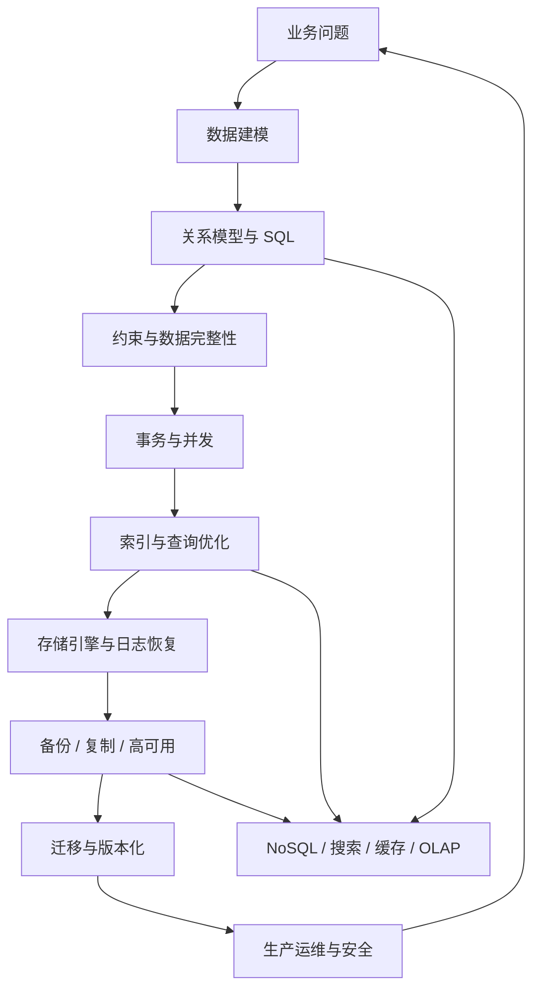
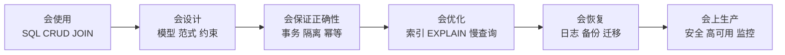
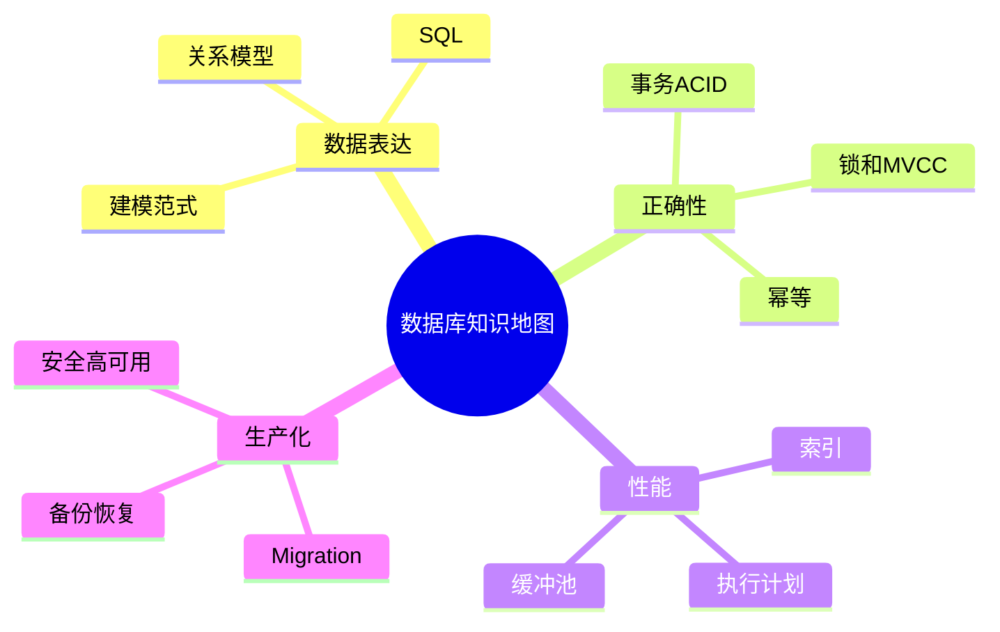
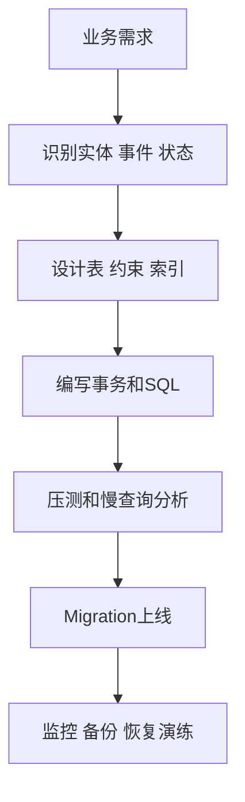

# 00. 学习路线与知识地图

## 学习目标

读完本章，你应该能回答三个问题：

1. 数据库学习应该按什么顺序展开？
2. 为什么 SQL、索引、事务、存储、运维必须一起学？
3. 如何判断自己已经从“会写查询”走向“能设计可靠数据系统”？

## 一句话总纲

数据库不是“存数据的文件夹”。它是一个同时处理数据建模、查询优化、并发控制、崩溃恢复、权限安全、复制备份和演进迁移的系统。

## 知识地图



这张图表达了一个关键事实：数据库知识不是线性的。业务需求会影响模型，模型影响 SQL，SQL 影响索引，索引影响写入成本，写入成本又会反过来影响业务设计。

## 四层学习法

### 第一层：会使用

你能创建表、插入数据、查询数据、写基本 JOIN、GROUP BY、ORDER BY。

最低标准：

```sql
SELECT c.name, COUNT(o.id) AS order_count
FROM customers c
LEFT JOIN orders o ON o.customer_id = c.id
GROUP BY c.id, c.name
ORDER BY order_count DESC;
```

如果看到这段 SQL 不知道逻辑执行顺序，就先读 [[02-关系模型与SQL核心]]。

### 第二层：会设计

你能把业务需求拆成实体、关系、约束和生命周期。

最低标准：

- 知道主键、外键、唯一约束、检查约束分别解决什么问题。
- 能判断一对一、一对多、多对多关系如何落表。
- 能解释为什么订单金额不能只靠实时计算商品现价。

对应章节：[[03-数据建模与范式]]。

### 第三层：会诊断

你能看懂慢查询、解释执行计划、知道索引什么时候有效。

最低标准：

- 会用 `EXPLAIN` / `EXPLAIN ANALYZE`。
- 知道组合索引的列顺序为什么重要。
- 知道 `OFFSET 100000` 为什么可能很慢。

对应章节：[[05-索引原理与查询优化]]。

### 第四层：会上生产

你能让数据库在真实业务中长期可维护。

最低标准：

- 每次变更都有 migration。
- 大表新增索引知道使用并发/在线方式。
- 有备份恢复演练，不只是假设“云厂商会帮我”。
- 能定义 RPO/RTO。

对应章节：[[10-迁移版本化与零停机变更]]、[[11-安全备份高可用与运维]]。

## 建议实验环境

推荐至少准备一个本地 PostgreSQL。也可以同时准备 MySQL，用于比较差异。

最低工具：

- 数据库：PostgreSQL 或 MySQL
- 客户端：psql、DBeaver、TablePlus、DataGrip 任一即可
- 文本编辑器：能保存 SQL 文件即可
- 版本控制：Git，用于保存 schema 和 migration

建议建立一个练习库：

```sql
CREATE DATABASE db_tutorial;
```

然后每章都在这个库里验证示例。

## 章节产出物

| 章节 | 核心问题 | 产出物 |
| --- | --- | --- |
| 01 | 数据库解决什么问题？ | 数据库分类与选型表 |
| 02 | SQL 如何表达数据问题？ | 基础查询脚本 |
| 03 | 业务如何变成表？ | ERD 与 schema 草案 |
| 04 | 并发时如何保证正确？ | 事务边界设计 |
| 05 | 为什么查询慢？ | 索引与执行计划分析 |
| 06 | 数据库如何落盘与恢复？ | 存储与日志理解图 |
| 07 | PostgreSQL 怎么用得工程化？ | PostgreSQL 模式清单 |
| 08 | MySQL 有哪些坑？ | 差异对照表 |
| 09 | 什么时候不用关系库？ | 组件选型矩阵 |
| 10 | 如何安全改表？ | 迁移计划模板 |
| 11 | 如何守住生产数据？ | 备份、安全、监控清单 |
| 12 | 如何完整做一次？ | 订单系统设计方案 |

## 学习自检

如果你能清楚说出下面五句话的含义，就已经进入数据库工程化阶段：

1. 数据完整性应该尽量由数据库约束兜底，而不是完全交给应用层。
2. 事务隔离级别是在正确性和并发性能之间做取舍。
3. 索引加速读，但会放大写入成本和存储成本。
4. 生产数据库变更应该是可审计、可重复、可回滚或可前滚的。
5. 备份没有经过恢复演练，就不能算真正可用。

下一章：[[01-数据库基础与分类]]。

<!-- DB-DEEP-EXPANSION-2026-04-28:START -->
## 深入展开：从零到能上生产的学习路线

很多人学数据库时会走偏：先背 SQL 语法，再背几个索引名，最后背 ACID。这样学的问题是，每个知识点都像孤岛，不知道什么时候用，也不知道为什么会出事故。

更合理的路线是从“业务事实”开始。数据库的第一职责不是跑得快，而是把系统承认的事实保存下来，并且在并发、宕机、版本演进中继续可信。

### 阶段一：把业务语言翻译成数据语言

以“用户购买商品”为例，业务语言里有用户、商品、订单、支付、库存。数据语言里要进一步拆成：

- 哪些是实体：用户、商品。
- 哪些是事件：订单创建、支付成功、库存扣减。
- 哪些是状态：订单状态、商品是否上架。
- 哪些是约束：库存不能为负、支付单不能重复、订单必须属于某个用户。

你学建模时不是在画表，而是在回答“系统承认哪些事实，以及哪些事实不能被破坏”。

### 阶段二：用 SQL 表达问题

SQL 的核心不是 `SELECT` 关键字，而是集合思维。比如“过去 30 天每个用户的支付金额”不是循环每个用户去查订单，而是一次性把订单集合过滤、分组、聚合。

从这个阶段开始，要刻意练习：

```sql
-- 按用户统计最近30天已支付金额
SELECT user_id, SUM(total_amount) AS paid_amount
FROM orders
WHERE status = 'paid'
  AND paid_at >= now() - interval '30 days'
GROUP BY user_id;
```

每条 SQL 都问自己：数据来源是什么？过滤条件是什么？是否会放大行数？是否需要排序？结果集有多少行？

### 阶段三：理解并发和正确性

单用户环境下，很多设计都看似正确；一到并发就会出问题。比如两个用户同时买最后一件商品，如果代码是“先查库存，再扣库存”，就可能超卖。

数据库学习必须尽早接触：

- 事务边界。
- 锁。
- MVCC。
- 隔离级别。
- 幂等。
- 状态机。

如果你能解释“为什么一条 `UPDATE ... WHERE stock >= ?` 比先 SELECT 再 UPDATE 更安全”，说明你已经开始理解数据库在并发中的价值。

### 阶段四：理解性能不是玄学

慢查询通常不是“数据库不行”，而是访问了太多数据、排序太大、JOIN 放大、索引不匹配、统计信息失真、锁等待或应用 N+1。

性能学习的正确顺序：

1. 先读懂 SQL 语义。
2. 再看执行计划。
3. 再设计索引。
4. 再考虑数据模型和架构调整。

不要跳过前面三步直接调参数。参数调优是后期手段，不是慢 SQL 的第一反应。

### 阶段五：上生产前要学迁移和恢复

很多教程到索引就结束，但真实生产中最危险的是变更和恢复：

- 大表加字段会不会锁表？
- 加索引会不会阻塞写入？
- 回填 1 亿行会不会打爆复制？
- 误删数据能不能恢复？
- 主库宕机后能不能切换？

所以后半部分章节不是“运维附录”，而是数据库工程能力的核心。一个会写 SQL 但不会 migration 的后端，在生产中仍然危险。

### 你可以这样安排 7 天入门

| 天数 | 学习内容 | 必做练习 |
| --- | --- | --- |
| 第 1 天 | 数据库分类、关系模型 | 建一个订单库草图 |
| 第 2 天 | SQL 查询、JOIN、聚合 | 写 10 条订单查询 |
| 第 3 天 | 建模、范式、约束 | 补齐主键外键和 CHECK |
| 第 4 天 | 事务、锁、并发 | 实现扣库存事务 |
| 第 5 天 | 索引和执行计划 | 给订单列表加索引并 EXPLAIN |
| 第 6 天 | PostgreSQL/MySQL 差异 | 比较 UPSERT、时间类型、DDL |
| 第 7 天 | migration、备份、运维 | 写一次字段改名零停机计划 |

学完一轮后，再用 [[12-实战项目从需求到上线]] 把所有知识串起来。
<!-- DB-DEEP-EXPANSION-2026-04-28:END -->

## 思维导图

> 记忆建议：数据库能力分四层：会用、会设计、会诊断、会上生产。

### 1. 学习路线总览



### 2. 数据库知识地图



### 3. 从需求到生产闭环


