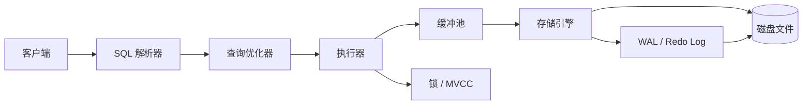
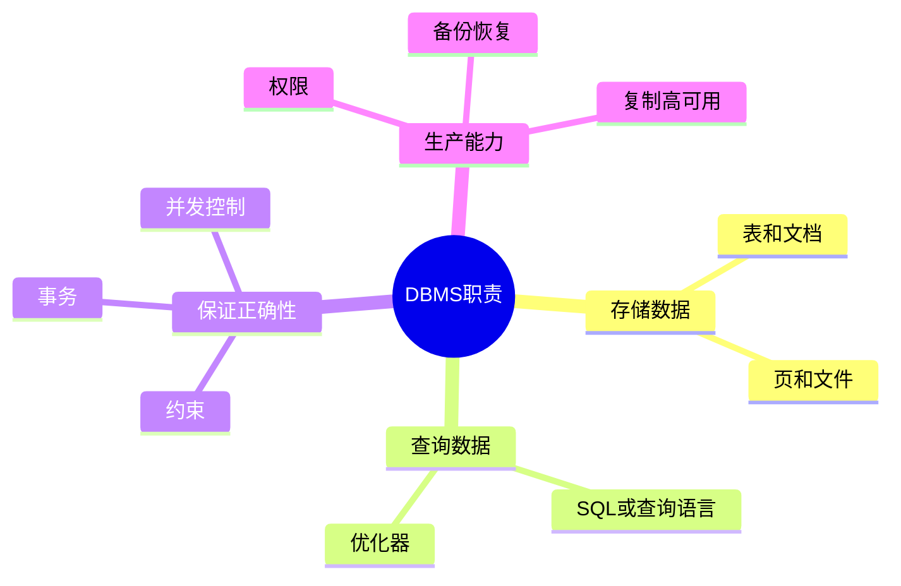
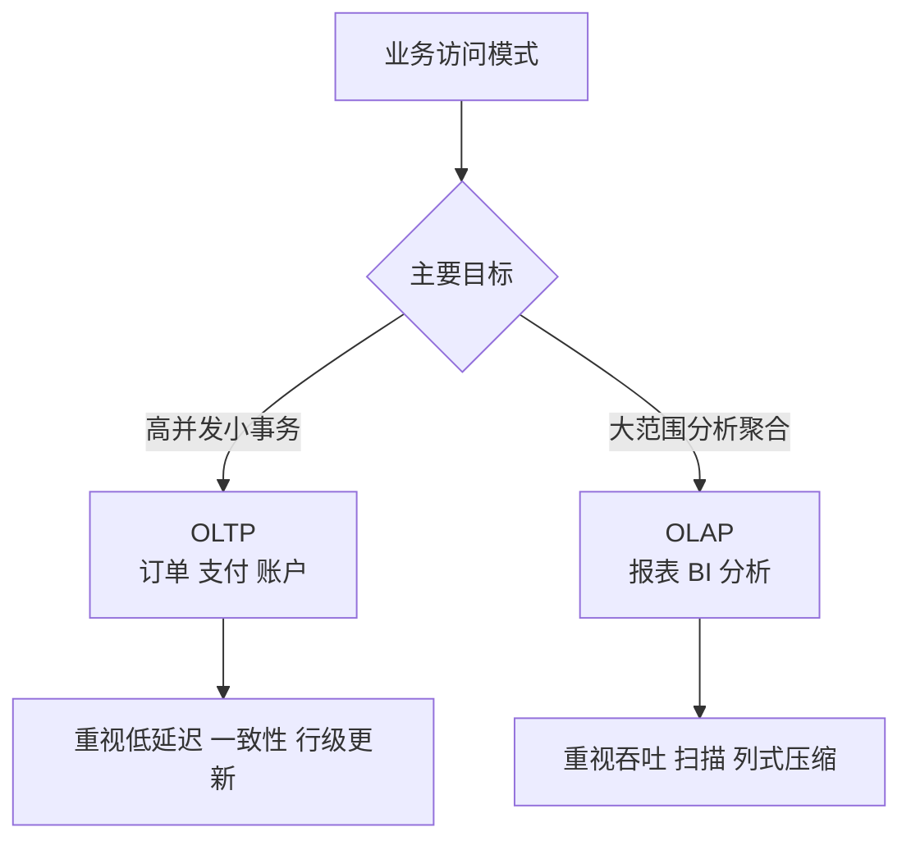
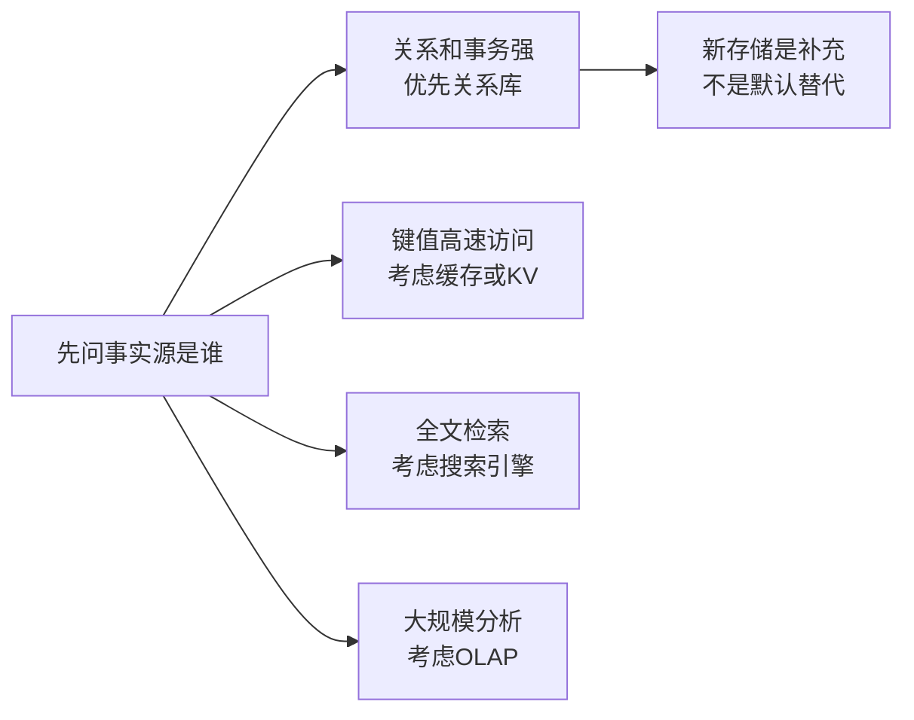

# 01. 数据库基础与分类

## 学习目标

本章解决“数据库到底是什么”的问题。读完后你应该能：

- 区分数据库、数据库管理系统、数据库实例、schema、表。
- 理解 OLTP 与 OLAP 的差异。
- 知道关系型、文档型、键值型、搜索型、分析型数据库各自适合什么场景。
- 看懂一个数据库系统的大致内部结构。

## 核心概念

### 数据库与 DBMS

- **数据库（Database）**：被组织起来的数据集合。
- **数据库管理系统（DBMS）**：管理数据库的软件，例如 PostgreSQL、MySQL、SQLite、SQL Server、Oracle。
- **数据库实例（Instance）**：正在运行的数据库服务进程及其内存状态。
- **Schema**：对象命名空间，通常包含表、视图、索引、函数等。
- **表（Table）**：关系型数据库中存放同类实体记录的结构。

一句话：数据是内容，DBMS 是管理内容的系统。

## DBMS 的职责

一个成熟 DBMS 至少承担这些职责：

1. **数据定义**：创建表、索引、约束、视图。
2. **数据操作**：插入、查询、更新、删除。
3. **查询优化**：为 SQL 选择较优执行计划。
4. **并发控制**：多个用户同时读写时保持正确性。
5. **事务管理**：提供 ACID 语义。
6. **持久化**：把数据安全落盘。
7. **崩溃恢复**：宕机后恢复到一致状态。
8. **权限安全**：控制谁能访问哪些数据。
9. **备份复制**：支持灾备、高可用和读扩展。

如果一个系统只会“把 JSON 写进文件”，它不是完整意义上的 DBMS。

## OLTP 与 OLAP

| 类型 | 全称 | 典型问题 | 特点 | 例子 |
| --- | --- | --- | --- | --- |
| OLTP | Online Transaction Processing | 用户下单、支付、修改资料 | 小事务、高并发、强一致 | PostgreSQL、MySQL |
| OLAP | Online Analytical Processing | 销售趋势、用户留存、报表 | 大扫描、聚合、列式存储 | ClickHouse、BigQuery、Snowflake |

常见误区：把所有报表都压在主业务库上。短期方便，长期会导致线上事务和分析查询互相影响。

## 数据库类型概览

### 关系型数据库

代表：PostgreSQL、MySQL、SQLite、SQL Server、Oracle。

适合：

- 业务实体关系清晰。
- 需要事务和强约束。
- 数据正确性比写代码省事更重要。

典型场景：订单、账户、库存、账单、权限、审计。

### 文档数据库

代表：MongoDB、Couchbase。

适合：

- 文档结构天然聚合，例如文章、配置、事件载荷。
- 字段变化频繁，且不需要复杂跨文档事务。

风险：如果业务核心关系复杂，文档嵌套会逐渐变成手写关系数据库。

### 键值数据库

代表：Redis、DynamoDB 的部分使用方式。

适合：

- 缓存。
- 会话。
- 排行榜。
- 简单状态存储。

风险：查询模式必须提前设计，不适合随意 ad-hoc 查询。

### 搜索引擎

代表：Elasticsearch、OpenSearch、Meilisearch。

适合：

- 全文搜索。
- 相关性排序。
- 日志检索。

风险：搜索引擎通常不是交易系统事实源。核心交易数据仍应以关系库或其他主存储为准。

### 图数据库

代表：Neo4j、Amazon Neptune。

适合：

- 路径查询。
- 关系网络。
- 推荐、风控、知识图谱。

风险：如果只是“一对多、多对多”，关系型数据库已经足够。

### 时序数据库

代表：TimescaleDB、InfluxDB、Prometheus TSDB。

适合：

- 指标。
- 监控。
- IoT 数据。
- 事件随时间聚合。

风险：高基数标签和长期保留策略如果设计不好，成本会迅速上升。

## 一个数据库系统的内部结构



你写的一条 SQL 并不是直接“扫描文件”。数据库会解析 SQL、生成候选计划、估算成本、执行算子、访问缓存和磁盘，并在写入时记录日志。

## ACID 与 BASE

### ACID

- **Atomicity 原子性**：事务内操作要么都成功，要么都失败。
- **Consistency 一致性**：事务前后满足约束。
- **Isolation 隔离性**：并发事务互不破坏。
- **Durability 持久性**：提交后的数据即使宕机也不丢。

ACID 常用于核心业务数据。

### BASE

- **Basically Available**：基本可用。
- **Soft state**：允许中间状态。
- **Eventually consistent**：最终一致。

BASE 常见于分布式系统、缓存、搜索索引、异步同步场景。

重点不是谁更高级，而是业务能不能承受短暂不一致。

## 选型第一原则

先问问题，不要先选产品：

1. 数据是否是核心事实源？
2. 是否需要跨多行、多表事务？
3. 查询模式是否稳定？
4. 读写比例如何？
5. 数据量和增长速度如何？
6. 一致性要求是什么？
7. 运维团队熟悉什么？

多数业务系统的默认主库仍然应该从关系型数据库开始。不是因为关系库“传统”，而是因为约束、事务、SQL 和生态能覆盖大部分核心业务。

## 常见误区

### 误区 1：NoSQL 更快

“更快”必须绑定查询模式。键值查询可能很快，但复杂过滤、关联、聚合可能很弱。关系库加好索引后，同样能支撑大量业务请求。

### 误区 2：数据库约束可以都放在应用层

应用层校验是必要的，但不是充分的。多个服务、脚本、后台任务都可能写数据库。核心唯一性、引用完整性、非空、范围检查应该由数据库兜底。

### 误区 3：只要有备份就安全

没有恢复演练的备份只是心理安慰。你必须知道恢复需要多久、会丢多少数据、恢复后的数据如何校验。

## 本章练习

1. 选一个你熟悉的系统，例如博客、商城、课程平台，列出它的核心事实源。
2. 判断哪些数据适合关系库，哪些适合缓存，哪些适合搜索引擎。
3. 写出该系统最重要的 3 个一致性约束。

下一章：[[02-关系模型与SQL核心]]。

<!-- DB-DEEP-EXPANSION-2026-04-28:START -->
## 深入展开：数据库到底在系统里承担什么角色

初学者容易把数据库理解成“存数据的地方”。这个理解太浅。数据库真正承担的是“可信事实中心”的角色：它要在多人同时访问、机器宕机、代码升级、数据增长、权限变化的情况下，持续保存可验证的数据事实。

### 1. DBMS 的能力不是一次性出现的

可以把数据库能力拆成几层：

1. **存储层**：把数据写到磁盘，能再次读出来。
2. **结构层**：用表、列、类型、约束描述数据形状。
3. **查询层**：用 SQL 或查询语言表达复杂数据需求。
4. **并发层**：多人同时读写时保持正确。
5. **恢复层**：宕机后恢复到一致状态。
6. **安全层**：控制谁能看、谁能改。
7. **演进层**：业务升级时结构能安全变化。

文件、Redis、搜索引擎、对象存储都能“存东西”，但不一定同时提供这些能力。选型时要问：当前数据需要哪几层能力？

### 2. OLTP 和 OLAP 的冲突来自访问模式不同

OLTP 查询像这样：

```sql
SELECT * FROM orders WHERE id = 123;
UPDATE inventory SET available_quantity = available_quantity - 1 WHERE product_id = 10;
```

它们访问少量行、频率高、要求快和正确。OLAP 查询像这样：

```sql
SELECT date_trunc('day', paid_at) AS day, SUM(total_amount)
FROM orders
WHERE paid_at >= now() - interval '1 year'
GROUP BY day
ORDER BY day;
```

它可能扫描一年订单。两种查询如果长期混在主库，会争抢缓存、I/O、CPU 和连接数。报表不是不能查主库，而是不能无节制地查主库。

### 3. 关系型数据库为什么仍然是默认选择

关系型数据库的优势不是“老”，而是它提供了完整的正确性工具箱：

- SQL 能表达复杂查询。
- 事务能保证一组操作原子提交。
- 约束能防止脏数据。
- 索引能优化常见访问路径。
- 备份和复制生态成熟。

大多数业务系统的问题不是“关系数据库不够先进”，而是建模、索引、事务和迁移没有做好。

### 4. NoSQL 不是关系库的替代品，而是补充

文档库、键值库、搜索引擎、图数据库各有强项。关键是不要混淆“事实源”和“派生视图”。

例如电商系统中：

- PostgreSQL/MySQL 保存订单、支付、库存事实。
- Redis 缓存商品详情和会话。
- Elasticsearch 提供商品搜索。
- ClickHouse 保存行为日志和报表。

搜索结果可以延迟，缓存可以过期，报表可以 T+1，但支付状态不能随便不一致。这就是选型边界。

### 5. 选型时的场景判断

| 场景 | 推荐思路 | 原因 |
| --- | --- | --- |
| 用户、订单、支付 | 关系型数据库 | 需要事务和约束 |
| 商品全文搜索 | 搜索引擎 + 主库校验 | 搜索是派生视图 |
| 热点商品详情 | Redis 缓存 + 主库事实 | 可重建，允许短暂旧数据 |
| 用户行为分析 | OLAP / 数仓 | 大扫描和聚合 |
| 设备指标 | 时序数据库 | 时间窗口和保留策略 |
| 社交关系多跳 | 图数据库 | 路径查询更自然 |

### 6. 面试中如何讲得更深入

如果被问“数据库有哪些类型”，不要只罗列产品名。更好的回答结构是：

1. 先按工作负载分 OLTP/OLAP。
2. 再按数据模型分关系、文档、键值、图、时序、搜索。
3. 最后强调事实源和派生视图的区别。

这样能体现你不是在背数据库名字，而是在按系统需求选组件。
<!-- DB-DEEP-EXPANSION-2026-04-28:END -->

## 思维导图

> 记忆建议：数据库不是“存数据的文件”，而是负责持久化、并发、查询、恢复和权限的一整套系统。

### 1. DBMS 的核心职责



### 2. OLTP 与 OLAP



### 3. 选型判断


