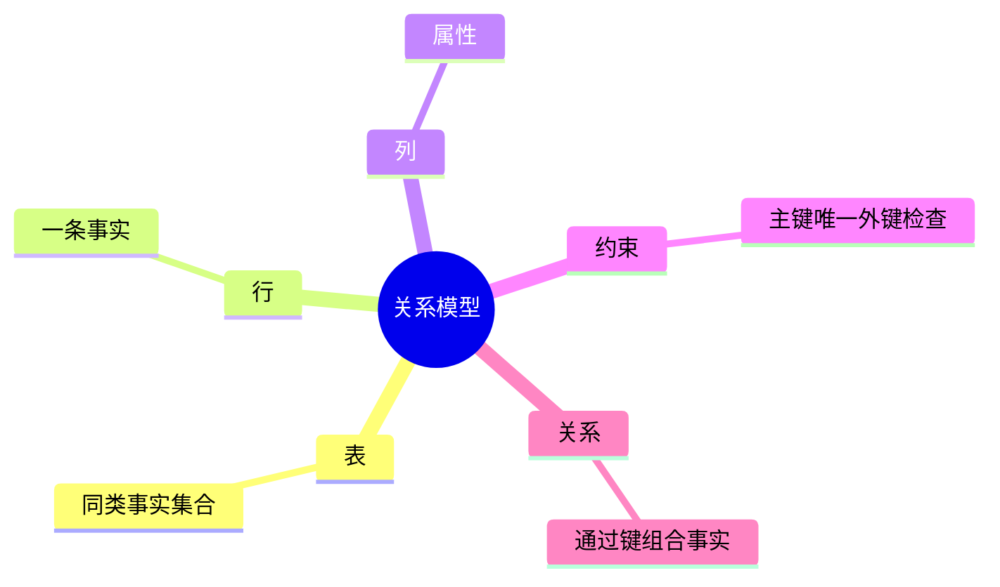
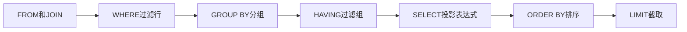
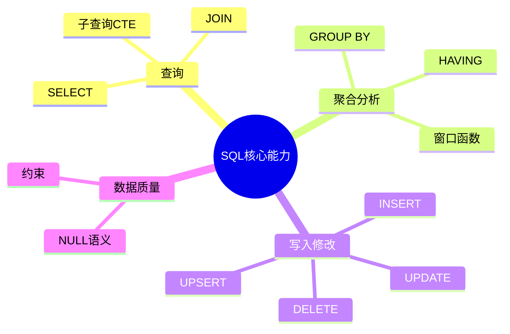

# 02. 关系模型与 SQL 核心

## 学习目标

本章让你从“会写几条 SELECT”升级到“知道 SQL 在表达什么”。你将掌握：

- 关系模型的基本思想。
- DDL、DML、DCL、TCL 的区别。
- SELECT 的逻辑执行顺序。
- JOIN、GROUP BY、HAVING、窗口函数、CTE 的常见用法。
- NULL 和重复行带来的坑。

## 关系模型的三个要点

1. **数据用关系表示**：关系在实现上通常是表。
2. **一行是一条元组**：代表一个事实或实体实例。
3. **操作返回的仍然是关系**：查询结果也可以继续被查询。

SQL 的强大之处在于它是声明式语言。你描述“要什么”，数据库决定“怎么做”。

## SQL 分类

| 类型 | 作用 | 例子 |
| --- | --- | --- |
| DDL | 定义结构 | `CREATE TABLE`, `ALTER TABLE`, `DROP TABLE` |
| DML | 操作数据 | `SELECT`, `INSERT`, `UPDATE`, `DELETE` |
| DCL | 权限控制 | `GRANT`, `REVOKE` |
| TCL | 事务控制 | `BEGIN`, `COMMIT`, `ROLLBACK` |

## 示例模型：订单系统

后续示例使用一个简化订单系统：

```sql
CREATE TABLE customers (
  id BIGINT GENERATED ALWAYS AS IDENTITY PRIMARY KEY,
  email TEXT NOT NULL UNIQUE,
  name TEXT NOT NULL,
  created_at TIMESTAMPTZ NOT NULL DEFAULT now()
);

CREATE TABLE products (
  id BIGINT GENERATED ALWAYS AS IDENTITY PRIMARY KEY,
  sku TEXT NOT NULL UNIQUE,
  name TEXT NOT NULL,
  price NUMERIC(12, 2) NOT NULL CHECK (price >= 0),
  active BOOLEAN NOT NULL DEFAULT true
);

CREATE TABLE orders (
  id BIGINT GENERATED ALWAYS AS IDENTITY PRIMARY KEY,
  customer_id BIGINT NOT NULL REFERENCES customers(id),
  status TEXT NOT NULL CHECK (status IN ('pending', 'paid', 'cancelled', 'shipped')),
  total_amount NUMERIC(12, 2) NOT NULL CHECK (total_amount >= 0),
  created_at TIMESTAMPTZ NOT NULL DEFAULT now()
);

CREATE TABLE order_items (
  id BIGINT GENERATED ALWAYS AS IDENTITY PRIMARY KEY,
  order_id BIGINT NOT NULL REFERENCES orders(id),
  product_id BIGINT NOT NULL REFERENCES products(id),
  quantity INTEGER NOT NULL CHECK (quantity > 0),
  unit_price NUMERIC(12, 2) NOT NULL CHECK (unit_price >= 0),
  UNIQUE (order_id, product_id)
);
```

注意两个设计点：

- `order_items.unit_price` 保存下单时价格，不能只引用 `products.price`，否则历史订单会被商品改价影响。
- `orders.total_amount` 可以冗余保存，用于读性能和审计，但必须用事务保证与明细一致。

## SELECT 的逻辑执行顺序

SQL 写法顺序：

```sql
SELECT ...
FROM ...
WHERE ...
GROUP BY ...
HAVING ...
ORDER BY ...
LIMIT ...;
```

逻辑执行顺序通常理解为：

1. `FROM`：确定数据来源。
2. `JOIN`：连接表。
3. `WHERE`：行过滤。
4. `GROUP BY`：分组。
5. `HAVING`：组过滤。
6. `SELECT`：投影与表达式计算。
7. `ORDER BY`：排序。
8. `LIMIT/OFFSET`：截断结果。

这解释了为什么 `WHERE` 中不能直接使用 `SELECT` 里的别名，因为逻辑上 `WHERE` 先执行。

## JOIN

### INNER JOIN

只返回两边都匹配的行：

```sql
SELECT o.id, c.email, o.total_amount
FROM orders o
JOIN customers c ON c.id = o.customer_id;
```

### LEFT JOIN

保留左表，即使右表没有匹配：

```sql
SELECT c.email, COUNT(o.id) AS order_count
FROM customers c
LEFT JOIN orders o ON o.customer_id = c.id
GROUP BY c.id, c.email;
```

常见坑：`LEFT JOIN` 后如果在 `WHERE` 中过滤右表字段，可能把它变成事实上的 `INNER JOIN`。

错误写法：

```sql
SELECT c.email, o.id
FROM customers c
LEFT JOIN orders o ON o.customer_id = c.id
WHERE o.status = 'paid';
```

更安全写法：

```sql
SELECT c.email, o.id
FROM customers c
LEFT JOIN orders o
  ON o.customer_id = c.id
 AND o.status = 'paid';
```

## 聚合与 HAVING

统计每个客户的已支付金额：

```sql
SELECT c.id, c.email, SUM(o.total_amount) AS paid_amount
FROM customers c
JOIN orders o ON o.customer_id = c.id
WHERE o.status = 'paid'
GROUP BY c.id, c.email
HAVING SUM(o.total_amount) > 1000
ORDER BY paid_amount DESC;
```

`WHERE` 过滤行，`HAVING` 过滤分组后的结果。

## 子查询与 CTE

CTE 能让复杂查询分块表达：

```sql
WITH paid_orders AS (
  SELECT customer_id, total_amount
  FROM orders
  WHERE status = 'paid'
), customer_revenue AS (
  SELECT customer_id, SUM(total_amount) AS revenue
  FROM paid_orders
  GROUP BY customer_id
)
SELECT c.email, cr.revenue
FROM customer_revenue cr
JOIN customers c ON c.id = cr.customer_id
ORDER BY cr.revenue DESC;
```

CTE 的价值不是“性能一定更好”，而是可读性和可维护性。实际性能需要看执行计划。

## 窗口函数

窗口函数在“不压缩行数”的情况下做分组计算。

例：每个客户的订单按时间排名：

```sql
SELECT
  o.id,
  o.customer_id,
  o.total_amount,
  row_number() OVER (
    PARTITION BY o.customer_id
    ORDER BY o.created_at DESC
  ) AS order_rank
FROM orders o;
```

取每个客户最近一单：

```sql
WITH ranked AS (
  SELECT
    o.*,
    row_number() OVER (
      PARTITION BY customer_id
      ORDER BY created_at DESC
    ) AS rn
  FROM orders o
)
SELECT *
FROM ranked
WHERE rn = 1;
```

## INSERT / UPDATE / DELETE

### 插入

```sql
INSERT INTO customers (email, name)
VALUES ('ada@example.com', 'Ada');
```

### 更新

```sql
UPDATE products
SET price = price * 0.9
WHERE active = true;
```

### 删除

```sql
DELETE FROM orders
WHERE status = 'cancelled'
  AND created_at < now() - interval '1 year';
```

生产环境中不要轻易执行没有 `WHERE` 的 `UPDATE` 或 `DELETE`。

## UPSERT

PostgreSQL 常见写法：

```sql
INSERT INTO customers (email, name)
VALUES ('ada@example.com', 'Ada Lovelace')
ON CONFLICT (email)
DO UPDATE SET name = EXCLUDED.name;
```

适合幂等写入，例如同步外部用户资料。

## NULL 语义

`NULL` 表示未知或缺失，不等于空字符串，也不等于 0。

```sql
SELECT NULL = NULL;       -- 结果不是 true，而是 unknown
SELECT NULL IS NULL;      -- true
```

常见坑：

```sql
WHERE deleted_at = NULL      -- 错
WHERE deleted_at IS NULL     -- 对
```

设计时要谨慎使用可空字段。可空意味着每个查询都要考虑第三种状态。

## 约束是数据质量的底线

常用约束：

```sql
-- 非空
name TEXT NOT NULL

-- 唯一
email TEXT NOT NULL UNIQUE

-- 外键
customer_id BIGINT NOT NULL REFERENCES customers(id)

-- 检查
price NUMERIC(12, 2) NOT NULL CHECK (price >= 0)
```

不要把所有约束都交给应用层。数据库是多入口写入的最后防线。

## 本章练习

1. 为订单系统写出“每个商品的销量排行”查询。
2. 写出“过去 30 天内至少下过 2 单的客户”查询。
3. 故意写一个 `LEFT JOIN` 被 `WHERE` 破坏的例子，再修正它。
4. 用窗口函数取每个客户金额最高的一单。

下一章：[[03-数据建模与范式]]。

<!-- DB-DEEP-EXPANSION-2026-04-28:START -->
## 深入展开：SQL 不是语法题，而是集合思维

SQL 初学最常见的问题是把它当成“数据库版 for 循环”。真正的 SQL 思维是集合式：你一次描述一批数据如何过滤、连接、分组和排序。

### 1. 从一条查询看 SQL 的思考过程

需求：查询最近 30 天，每个用户已支付订单的总金额，只保留金额超过 1000 的用户。

不要急着写 SQL。先拆问题：

1. 数据来源：订单表。
2. 行过滤：最近 30 天，状态为 paid。
3. 分组：按用户。
4. 聚合：求金额总和。
5. 组过滤：总和超过 1000。
6. 排序：金额从高到低。

对应 SQL：

```sql
SELECT user_id, SUM(total_amount) AS paid_amount
FROM orders
WHERE status = 'paid'
  AND paid_at >= now() - interval '30 days'
GROUP BY user_id
HAVING SUM(total_amount) > 1000
ORDER BY paid_amount DESC;
```

这个拆解比记语法更重要。复杂 SQL 都可以按这几个步骤展开。

### 2. JOIN 的本质是组合事实

JOIN 不是“把表粘起来”，而是把不同事实按关系组合。

例如：订单属于用户，订单明细属于订单，明细引用商品。查询订单详情时：

```sql
SELECT
  o.id AS order_id,
  u.email,
  oi.product_name_snapshot,
  oi.quantity,
  oi.unit_price
FROM orders o
JOIN users u ON u.id = o.user_id
JOIN order_items oi ON oi.order_id = o.id
WHERE o.id = 1001;
```

这里每个 JOIN 都要问：

- 关系是一对一、一对多还是多对多？
- JOIN 后行数会不会放大？
- 是否需要 LEFT JOIN 保留无匹配行？
- JOIN 条件是否命中索引？

一对多 JOIN 后再聚合时，尤其要小心重复计数。

### 3. NULL 是 SQL 中最容易被低估的坑

NULL 不是空字符串，也不是 0。它代表未知或缺失。一个可空字段会让业务逻辑多出第三种状态。

例如：

```sql
WHERE paid_at IS NULL
```

可以表达“尚未支付”。但如果 `phone_number IS NULL`，到底是用户没有手机号、用户没填写、系统没采集，还是数据丢了？这就需要业务定义。

设计字段时，能 `NOT NULL` 就尽量 `NOT NULL`，并提供明确默认值或状态字段。不要为了省事把所有字段都设成可空。

### 4. 窗口函数适合“组内比较”

如果你要每个用户最近一单，不能简单 `GROUP BY user_id` 再选订单 ID，因为聚合后其他列没有明确语义。窗口函数更合适：

```sql
WITH ranked AS (
  SELECT
    o.*,
    row_number() OVER (
      PARTITION BY user_id
      ORDER BY created_at DESC, id DESC
    ) AS rn
  FROM orders o
)
SELECT *
FROM ranked
WHERE rn = 1;
```

窗口函数的思路是：不减少行数，只给每一行附加组内计算结果。排名、累计和、组内 Top N 都适合它。

### 5. 写 SQL 时的自检清单

- [ ] 我知道这条 SQL 的主表是什么。
- [ ] 每个 JOIN 都有明确关系和条件。
- [ ] WHERE 过滤的是行，HAVING 过滤的是组。
- [ ] 没有在 WHERE 中错误过滤 LEFT JOIN 右表。
- [ ] NULL 判断使用 `IS NULL`。
- [ ] 聚合查询中 SELECT 字段要么分组，要么聚合。
- [ ] ORDER BY 和 LIMIT 有对应索引或数据量可控。
- [ ] 没有无意中 `SELECT *` 返回大字段。

### 6. 一个更完整的练习

需求：找出最近 7 天支付金额最高的 10 个用户，并展示他们最近一笔订单时间。

```sql
WITH paid_orders AS (
  SELECT *
  FROM orders
  WHERE status = 'paid'
    AND paid_at >= now() - interval '7 days'
), user_revenue AS (
  SELECT user_id, SUM(total_amount) AS revenue
  FROM paid_orders
  GROUP BY user_id
), last_paid_order AS (
  SELECT
    user_id,
    paid_at,
    row_number() OVER (
      PARTITION BY user_id
      ORDER BY paid_at DESC, id DESC
    ) AS rn
  FROM paid_orders
)
SELECT
  u.id,
  u.email,
  ur.revenue,
  lpo.paid_at AS last_paid_at
FROM user_revenue ur
JOIN users u ON u.id = ur.user_id
JOIN last_paid_order lpo ON lpo.user_id = ur.user_id AND lpo.rn = 1
ORDER BY ur.revenue DESC
LIMIT 10;
```

这条 SQL 同时用到了过滤、聚合、窗口函数和 JOIN。读懂它，比刷很多零散语法题更有效。
<!-- DB-DEEP-EXPANSION-2026-04-28:END -->

## 思维导图

> 记忆建议：SQL 是集合思维；先确定数据集合，再过滤、分组、组合和排序。

### 1. 关系模型核心



### 2. SELECT 逻辑执行顺序



### 3. SQL 能力分组


