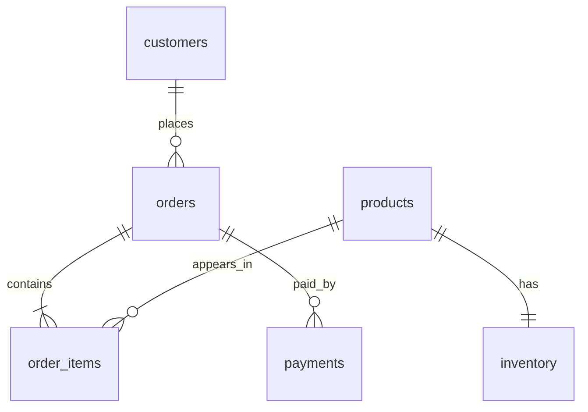
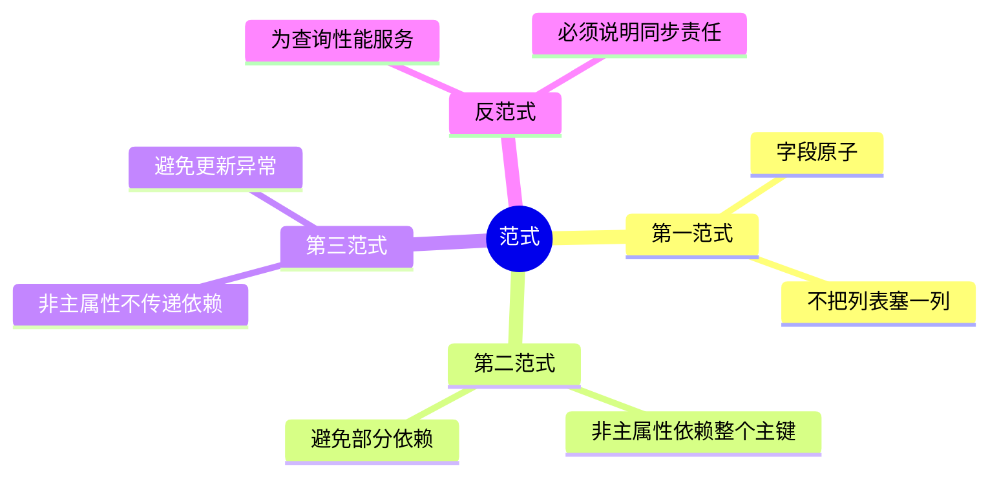
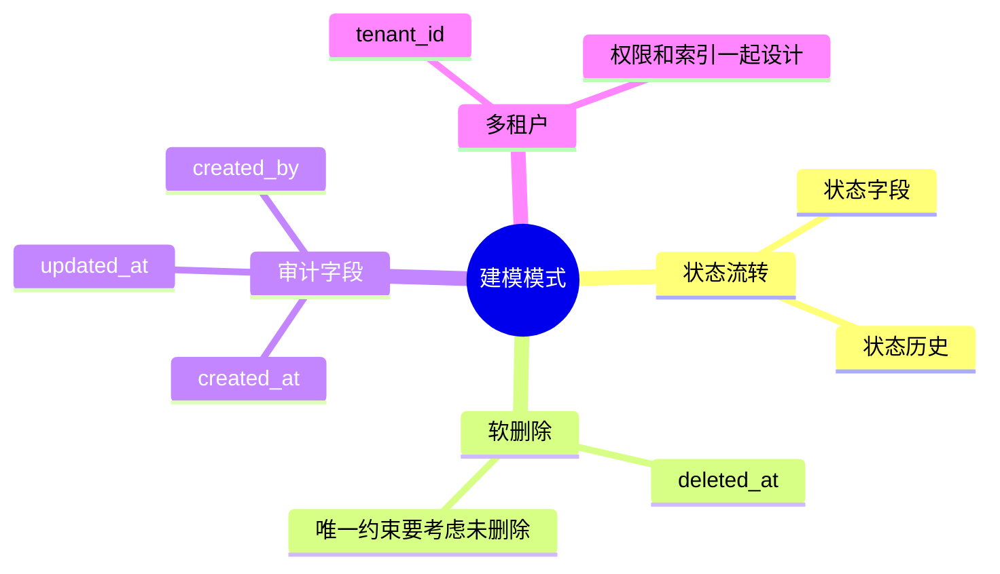

# 03. 数据建模与范式

## 学习目标

本章讲如何把业务问题变成可靠的表结构。读完后你应该能：

- 从需求中识别实体、属性、关系和约束。
- 判断一对一、一对多、多对多如何落库。
- 理解 1NF、2NF、3NF 的实际意义。
- 知道什么时候可以反范式。
- 识别常见建模陷阱。

## 建模不是画表，而是定义事实

数据库设计的核心问题是：系统承认哪些事实？这些事实如何保持一致？

例如“用户下单”至少包含这些事实：

- 用户存在。
- 商品存在。
- 订单属于某个用户。
- 订单有状态。
- 订单明细记录了下单时价格。
- 支付成功后订单状态变化。

表只是这些事实的载体。

## 从需求到模型的步骤

### 第一步：圈出名词

需求：

> 用户可以浏览商品，把商品加入购物车，提交订单，支付订单。订单支付后扣减库存。用户可以查看历史订单。

名词：用户、商品、购物车、订单、支付、库存、历史订单。

### 第二步：识别实体与事件

- 实体：用户、商品、库存。
- 事件/记录：订单、订单明细、支付记录、库存流水。

经验：会长期存在并被多次引用的，多半是实体；发生一次并留下痕迹的，多半是事件或流水。

### 第三步：确定关系



### 第四步：写出约束

约束比字段更重要：

- 用户邮箱唯一。
- 商品 SKU 唯一。
- 订单必须属于一个用户。
- 订单明细数量必须大于 0。
- 金额不能为负。
- 同一订单中同一商品不能重复出现。

这些约束应该尽量落到数据库中。

## 关系类型如何落表

### 一对一

用户与用户资料：

```sql
CREATE TABLE user_profiles (
  user_id BIGINT PRIMARY KEY REFERENCES users(id),
  display_name TEXT NOT NULL,
  avatar_url TEXT
);
```

一对一常用于拆分大字段、敏感字段或生命周期不同的字段。

### 一对多

客户与订单：

```sql
CREATE TABLE orders (
  id BIGINT GENERATED ALWAYS AS IDENTITY PRIMARY KEY,
  customer_id BIGINT NOT NULL REFERENCES customers(id)
);
```

外键放在“多”的一侧。

### 多对多

用户与角色：

```sql
CREATE TABLE user_roles (
  user_id BIGINT NOT NULL REFERENCES users(id),
  role_id BIGINT NOT NULL REFERENCES roles(id),
  PRIMARY KEY (user_id, role_id)
);
```

多对多用中间表。不要在一列里存 `1,2,3` 这种逗号分隔 ID。

## 范式的工程解释

### 第一范式：字段保持原子性

错误：

```text
user_id | phone_numbers
1       | 138...,139...
```

正确：

```sql
CREATE TABLE user_phones (
  user_id BIGINT NOT NULL REFERENCES users(id),
  phone TEXT NOT NULL,
  PRIMARY KEY (user_id, phone)
);
```

第一范式避免“字符串里藏结构”。

### 第二范式：非主属性依赖整个主键

如果表的主键是 `(order_id, product_id)`，那么 `product_name` 只依赖 `product_id`，不依赖整个组合主键，就不应该放在同一张规范化表里。

不过订单明细中的 `unit_price` 是下单事实，可以放在 `order_items`，因为它不是商品当前价格，而是订单发生时的价格快照。

### 第三范式：非主属性不传递依赖

错误：

```text
order_id | customer_id | customer_email
```

`customer_email` 依赖 `customer_id`，而 `customer_id` 依赖 `order_id`。这会导致客户改邮箱时历史订单中的邮箱重复更新。

正确做法：订单只保存 `customer_id`，需要邮箱时 JOIN。若因审计需要保存下单时邮箱，应明确命名为 `customer_email_snapshot`。

## 反范式不是罪，但要有理由

反范式是有意识地冗余数据以换取性能、历史快照或简化查询。

合理场景：

- 订单保存下单时商品名和价格。
- 报表表保存每日聚合结果。
- 用户表保存 `last_order_at` 方便排序。

前提：

1. 你知道原始事实在哪里。
2. 你知道冗余字段如何更新。
3. 你能接受短暂不一致，或用事务保持一致。
4. 字段名能表达它是快照还是当前值。

## 常见建模模式

### 状态字段与状态流转

```sql
status TEXT NOT NULL CHECK (status IN ('pending', 'paid', 'cancelled', 'shipped'))
```

状态字段简单直接，但要补充状态流转规则。复杂业务可以增加状态流水：

```sql
CREATE TABLE order_status_events (
  id BIGINT GENERATED ALWAYS AS IDENTITY PRIMARY KEY,
  order_id BIGINT NOT NULL REFERENCES orders(id),
  from_status TEXT,
  to_status TEXT NOT NULL,
  changed_at TIMESTAMPTZ NOT NULL DEFAULT now(),
  reason TEXT
);
```

### 软删除

```sql
deleted_at TIMESTAMPTZ
```

软删除适合审计和可恢复场景，但会污染所有查询条件。常配合部分索引：

```sql
CREATE UNIQUE INDEX users_email_active_uq
ON users (email)
WHERE deleted_at IS NULL;
```

如果没有恢复、审计或合规需求，不要默认软删除。

### 审计字段

常见字段：

```sql
created_at TIMESTAMPTZ NOT NULL DEFAULT now(),
updated_at TIMESTAMPTZ NOT NULL DEFAULT now(),
created_by BIGINT,
updated_by BIGINT
```

注意：`updated_at` 不会自动变化，除非使用触发器或应用层统一维护。

### 多租户

简单模式：每张业务表带 `tenant_id`。

```sql
tenant_id BIGINT NOT NULL REFERENCES tenants(id)
```

并在唯一约束中包含租户：

```sql
UNIQUE (tenant_id, email)
```

不要只在应用层过滤租户数据。PostgreSQL 可以进一步使用 RLS，见 [[07-PostgreSQL实践指南]]。

## 字段类型选择

| 需求 | 推荐 | 避免 |
| --- | --- | --- |
| 主键 | `BIGINT` 或合适的 UUID | 过早使用短整型 |
| 普通文本 | `TEXT` | 无意义的 `VARCHAR(255)` |
| 时间 | `TIMESTAMPTZ` | 无时区语义的混乱时间 |
| 金额 | `NUMERIC(12,2)` 或整数分 | `FLOAT` |
| 状态 | `TEXT + CHECK` 或枚举策略 | 魔法数字 |
| JSON 扩展字段 | `JSONB` | 把核心关系藏进 JSON |

## 命名约定

推荐：

- 表名使用复数或业务统一约定，但全库一致。
- 字段使用 `snake_case`。
- 主键统一叫 `id`。
- 外键叫 `{referenced_table_singular}_id`，如 `customer_id`。
- 时间字段明确：`created_at`, `paid_at`, `cancelled_at`。

命名不是审美问题，而是降低团队沟通成本。

## 建模检查清单

- [ ] 每张表表达一个清晰事实集合。
- [ ] 主键稳定，不依赖可变业务字段。
- [ ] 唯一性规则已落到唯一约束或唯一索引。
- [ ] 外键关系明确。
- [ ] 金额、数量、时间类型合理。
- [ ] 可空字段有明确含义。
- [ ] 历史快照字段命名清楚。
- [ ] 反范式字段有更新策略。
- [ ] 大字段、冷热字段拆分有理由。

## 本章练习

1. 为“课程报名系统”设计表：学生、课程、报名、支付。
2. 写出每张表的主键、外键、唯一约束和检查约束。
3. 判断哪些字段需要历史快照。
4. 找一个你见过的“逗号分隔 ID”字段，改成规范化设计。

下一章：[[04-事务并发与隔离级别]]。

<!-- DB-DEEP-EXPANSION-2026-04-28:START -->
## 深入展开：从业务需求到表结构的完整推理

建模最难的不是写 `CREATE TABLE`，而是把模糊业务语言变成清晰的数据事实。一个好模型应该让正确的数据容易写入，让错误的数据难以进入。

### 1. 先区分实体、事件和状态

以电商为例：

- **实体**：用户、商品、仓库。这些对象会长期存在，被多次引用。
- **事件**：下单、支付、退款、发货、库存调整。事件发生后应留下记录。
- **状态**：订单当前状态、商品是否上架、库存当前数量。状态通常是事件累积后的当前结果。

很多建模错误来自把事件覆盖成状态。例如只在订单表保存 `status='paid'`，但没有支付流水，就无法审计什么时候支付、哪个渠道支付、是否重复回调。

### 2. 表结构要表达业务不变量

业务不变量是“永远应该成立”的规则。例如：

- 用户邮箱在未删除用户中唯一。
- 订单金额不能为负。
- 订单必须属于一个用户。
- 订单明细数量必须大于 0。
- 同一支付渠道的支付事件 ID 不能重复。

这些规则应该尽量变成数据库约束：

```sql
email TEXT NOT NULL,
quantity INTEGER NOT NULL CHECK (quantity > 0),
UNIQUE (provider, provider_payment_id),
FOREIGN KEY (user_id) REFERENCES users(id)
```

如果不变量只写在应用代码里，脚本、后台任务、另一个服务都可能绕过它。

### 3. 范式解决的是更新异常

范式不是为了显得学术，而是为了减少异常：

- **插入异常**：没有订单就无法保存商品信息。
- **更新异常**：同一个客户邮箱复制在多张表里，改一处漏一处。
- **删除异常**：删除最后一条订单后，把客户信息也删没了。

第三范式的核心是：一个事实只在一个权威位置维护。需要历史快照时，字段名要明确表示它是 snapshot。

### 4. 反范式要写清楚“谁负责同步”

反范式不是错，但必须有同步策略。比如 `orders.total_amount` 是 `order_items` 的冗余汇总。你要明确：

- 创建订单时谁计算它？
- 明细变化时是否允许变化？
- 支付后是否冻结？
- 如何校验它和明细一致？
- 不一致时以谁为准？

没有这些答案，冗余字段迟早变成脏数据来源。

### 5. 多租户建模要从第一天考虑

如果系统服务多个企业客户，很多唯一约束都要包含 `tenant_id`：

```sql
UNIQUE (tenant_id, email)
```

否则 A 租户注册了 `admin@example.com`，B 租户就不能注册同样邮箱。业务上这通常不合理。

多租户表常见字段：

```sql
tenant_id BIGINT NOT NULL REFERENCES tenants(id)
```

并且高频查询索引也要带租户：

```sql
CREATE INDEX idx_orders_tenant_created
ON orders(tenant_id, created_at DESC);
```

多租户不是简单加字段，还涉及权限隔离、备份恢复、数据导出和删除。

### 6. 建模评审时要问的问题

- 这张表表达的是实体、事件还是状态？
- 主键是否稳定？
- 哪些字段是当前值，哪些是历史快照？
- 哪些业务规则已经用约束表达？
- 可空字段的 NULL 语义是否清楚？
- 是否存在逗号分隔 ID、JSON 藏核心字段、魔法状态码？
- 删除策略是什么？硬删除、软删除还是归档？
- 未来数据量上来后，最常见查询是什么？

### 7. 一个更细的订单模型演进

早期订单表可能只有：

```text
orders(id, user_id, status, total_amount)
```

业务变复杂后，你会逐渐拆出：

```text
order_items          -- 明细与价格快照
payments             -- 支付流水
refunds              -- 退款记录
order_status_events  -- 状态流转历史
inventory_events     -- 库存变化流水
shipments            -- 发货单
```

这不是过度设计，而是当业务需要审计、售后、对账时，把事件补出来。建模的关键是知道什么时候一列状态已经不够，需要事件表记录历史。
<!-- DB-DEEP-EXPANSION-2026-04-28:END -->

## 思维导图

> 记忆建议：建模不是先画表，而是先定义业务事实、不变量和关系。

### 1. 从需求到模型


### 2. 范式的工程含义



### 3. 常见建模模式


