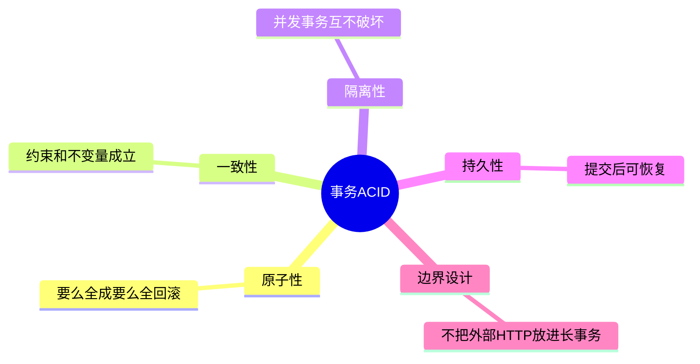
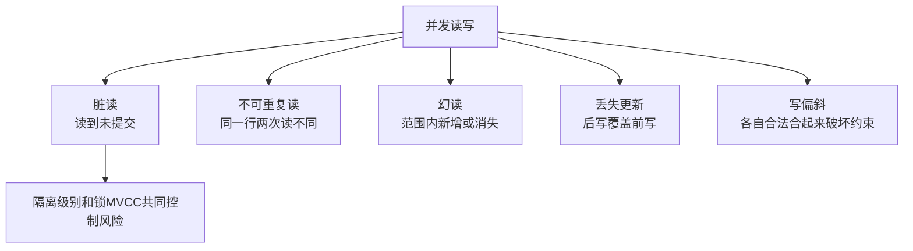
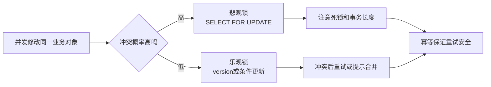

# 04. 事务、并发与隔离级别

## 学习目标

本章回答“多人同时改数据时，数据库如何保证正确”的问题。读完后你应该能：

- 解释 ACID。
- 识别脏读、不可重复读、幻读、丢失更新、写偏斜。
- 理解隔离级别的取舍。
- 知道 MVCC、行锁、死锁、乐观锁、悲观锁的基本用法。
- 为业务操作划定事务边界。

## 事务是什么

事务是一组操作的可靠边界：要么全部成功，要么全部失败。

下单示例：

```sql
BEGIN;

INSERT INTO orders (customer_id, status, total_amount)
VALUES (1, 'pending', 100.00)
RETURNING id;

INSERT INTO order_items (order_id, product_id, quantity, unit_price)
VALUES (10, 3, 2, 50.00);

UPDATE inventory
SET available_quantity = available_quantity - 2
WHERE product_id = 3
  AND available_quantity >= 2;

COMMIT;
```

如果扣库存失败，订单和明细也不应该留下半成品。

## ACID

| 属性 | 含义 | 工程问题 |
| --- | --- | --- |
| Atomicity | 原子性 | 失败时能否整体撤销？ |
| Consistency | 一致性 | 事务前后是否满足约束？ |
| Isolation | 隔离性 | 并发事务是否互相干扰？ |
| Durability | 持久性 | 提交后宕机是否仍能恢复？ |

一致性不是数据库凭空保证业务永远正确。数据库提供约束和事务机制，业务仍要定义正确规则。

## 并发异常

### 脏读

事务 A 读到了事务 B 尚未提交的数据。如果 B 回滚，A 读到的就是不存在的事实。

### 不可重复读

同一事务内两次读取同一行，结果不同，因为其他事务提交了更新。

### 幻读

同一事务内两次按条件查询，第二次多出或少了符合条件的行。

### 丢失更新

两个事务同时读取同一值，各自计算后写回，后写覆盖先写。

示例：库存从 10 开始。

- 事务 A 读到 10，准备减 2，写回 8。
- 事务 B 也读到 10，准备减 3，写回 7。
- 最终库存是 7，但正确结果应是 5。

### 写偏斜

两个事务分别更新不同的行，但共同破坏了跨行约束。

例：值班系统要求至少一名医生值班。两个医生同时看到“还有另一个人在值班”，于是都把自己改成休息，最终没人值班。

## 隔离级别

| 隔离级别 | 大致保证 | 代价 |
| --- | --- | --- |
| Read Uncommitted | 可能读未提交数据 | 很少用于核心业务 |
| Read Committed | 每条语句只读已提交数据 | 常见默认，仍可能不可重复读 |
| Repeatable Read | 同一事务中读到一致快照 | 可能需要处理写冲突或幻读差异 |
| Serializable | 效果等同串行执行 | 并发性能较低，可能重试 |

不同数据库对隔离级别的具体实现不同。不要只看名称，要看产品文档和实际行为。

## MVCC

MVCC（Multi-Version Concurrency Control，多版本并发控制）通过保留数据的多个版本，让读写尽量不互相阻塞。

直观理解：

- 读事务看到某个时间点的数据快照。
- 写事务创建新版本。
- 旧版本在不再被需要后清理。

优点：提升读写并发。

成本：需要版本清理机制，例如 PostgreSQL 的 vacuum。

## 锁

### 行锁

```sql
BEGIN;

SELECT *
FROM inventory
WHERE product_id = 3
FOR UPDATE;

UPDATE inventory
SET available_quantity = available_quantity - 2
WHERE product_id = 3;

COMMIT;
```

`FOR UPDATE` 会锁住选中的行，适合库存扣减、账户余额等强一致场景。

### 条件更新比先查后改更安全

```sql
UPDATE inventory
SET available_quantity = available_quantity - 2
WHERE product_id = 3
  AND available_quantity >= 2
RETURNING available_quantity;
```

如果返回 0 行，说明库存不足。这种写法把检查和更新合成一个原子操作。

## 乐观锁

适合冲突概率较低的场景。

表中增加版本号：

```sql
version INTEGER NOT NULL DEFAULT 0
```

更新时带上旧版本：

```sql
UPDATE articles
SET title = 'new title', version = version + 1
WHERE id = 1
  AND version = 7;
```

如果影响行数为 0，说明期间有人更新过，需要重新读取并让用户处理冲突。

## 悲观锁

适合冲突概率高、错误代价大的场景，例如扣库存、余额转账。

```sql
SELECT * FROM accounts WHERE id = 1 FOR UPDATE;
```

悲观锁会降低并发，但能明确保护关键区。

## 死锁

死锁常见于两个事务以不同顺序获取锁。

- 事务 A 锁订单 1，再锁订单 2。
- 事务 B 锁订单 2，再锁订单 1。

避免策略：

1. 所有事务按相同顺序访问资源。
2. 事务尽量短，不在事务中等待用户输入或远程 API。
3. 合理设置锁等待超时。
4. 捕获死锁错误并重试幂等事务。

## 事务边界设计

事务中应该包含：

- 同一个一致性规则必须一起成功的数据库操作。
- 需要原子提交的状态变化。

事务中不应该包含：

- 用户交互等待。
- 慢速外部 HTTP 调用。
- 大批量无界处理。
- 可以异步完成的通知、邮件、搜索索引更新。

对外部副作用使用 outbox 模式：

1. 在业务事务中写业务表和 `outbox_events`。
2. 后台 worker 读取 outbox 并发送消息。
3. 发送成功后标记事件已处理。

这样可以避免“数据库提交成功但消息发送失败”或相反的问题。

## 幂等性

任何可能重试的操作都应该设计幂等键。

支付回调示例：

```sql
CREATE TABLE payment_events (
  id BIGINT GENERATED ALWAYS AS IDENTITY PRIMARY KEY,
  provider TEXT NOT NULL,
  provider_event_id TEXT NOT NULL,
  payload JSONB NOT NULL,
  received_at TIMESTAMPTZ NOT NULL DEFAULT now(),
  UNIQUE (provider, provider_event_id)
);
```

重复回调时唯一约束会阻止重复处理。

## 本章练习

1. 设计一个扣库存事务，要求库存不能扣成负数。
2. 解释为什么事务里不应该调用支付网关再等待返回。
3. 写一个乐观锁更新文章标题的 SQL。
4. 找出一个可能死锁的双表更新流程，并重排锁顺序。

下一章：[[05-索引原理与查询优化]]。

<!-- DB-DEEP-EXPANSION-2026-04-28:START -->
## 深入展开：事务真正解决的是“中间状态不可见”和“失败可恢复”

事务不是为了把几条 SQL 包起来显得规范，而是为了处理现实世界中的失败：代码可能报错，网络可能超时，用户可能重复点击，数据库可能宕机，多个请求可能同时修改同一份数据。

### 1. 事务边界怎么划

事务应该包住同一个业务不变量需要同时成立的操作。例如创建订单：

- 插入订单。
- 插入订单明细。
- 扣库存。
- 写库存流水。

这几步如果只成功一部分，系统就进入错误状态。因此它们属于同一个事务。

但发短信、调用支付网关、同步搜索索引不应该放进事务。它们是外部副作用，应该通过 outbox、消息队列、幂等重试处理。

### 2. 条件更新比“先查后改”更安全

错误直觉：

```text
1. SELECT 库存
2. 如果库存足够
3. UPDATE 库存
```

并发下两个事务可能都看到库存足够，然后都扣减。

更安全写法：

```sql
UPDATE inventory
SET available_quantity = available_quantity - 1
WHERE product_id = 10
  AND available_quantity >= 1
RETURNING available_quantity;
```

检查和修改在一条 SQL 中完成。返回 0 行就是库存不足。

### 3. 隔离级别不是越高越好

Serializable 最强，但可能带来更多冲突和重试。很多业务在 Read Committed 下，只要关键写入使用条件更新、唯一约束和幂等键，就足够可靠。

例如支付回调：

```sql
INSERT INTO payment_events(provider, provider_event_id, order_id, payload)
VALUES ($1, $2, $3, $4)
ON CONFLICT (provider, provider_event_id) DO NOTHING;

UPDATE orders
SET status = 'paid', paid_at = now()
WHERE id = $3 AND status = 'pending';
```

这里靠唯一约束防重复事件，靠状态条件防重复状态流转，不一定要用最高隔离级别。

### 4. 死锁处理要设计重试

死锁不是“数据库坏了”，而是并发系统中正常可能出现的冲突。应用应该能识别死锁错误，并重试整个事务。

重试前提：

- 事务内部没有不可重复外部副作用。
- 有幂等键防止重复创建订单或重复处理消息。
- 重试次数有限，并有退避。

如果一个事务里已经发了短信或调用支付，再重试就可能产生重复副作用。所以外部动作要放到事务提交后。

### 5. 写偏斜比丢失更新更隐蔽

丢失更新是两个事务改同一行，比较容易想到。写偏斜是两个事务改不同的行，却共同破坏跨行约束。

例：值班系统要求至少一名医生值班。两个医生同时查询“还有别人值班”，然后都把自己改成休息。每个事务单独看都合理，合起来却没人值班。

解决方式可能包括：

- 更高隔离级别。
- 显式锁住代表约束的行。
- 用约束表表达全局不变量。
- 把跨行规则收敛到单行计数或状态机。

### 6. 事务设计清单

- [ ] 事务内是否只包含数据库内必须原子完成的操作？
- [ ] 是否有外部 HTTP、文件、用户等待？如果有，移出去。
- [ ] 写入是否有幂等键？
- [ ] 并发扣减是否使用条件更新或锁？
- [ ] 多资源加锁是否按固定顺序？
- [ ] 死锁和序列化失败是否能重试？
- [ ] 事务是否足够短？

把这份清单用于订单、支付、库存、余额、任务队列，能避免大量生产事故。
<!-- DB-DEEP-EXPANSION-2026-04-28:END -->

## 思维导图

> 记忆建议：事务解决“中间状态不可见、失败可恢复、并发不写坏”的问题。

### 1. ACID 与事务边界



### 2. 并发异常与隔离



### 3. 并发控制选择


