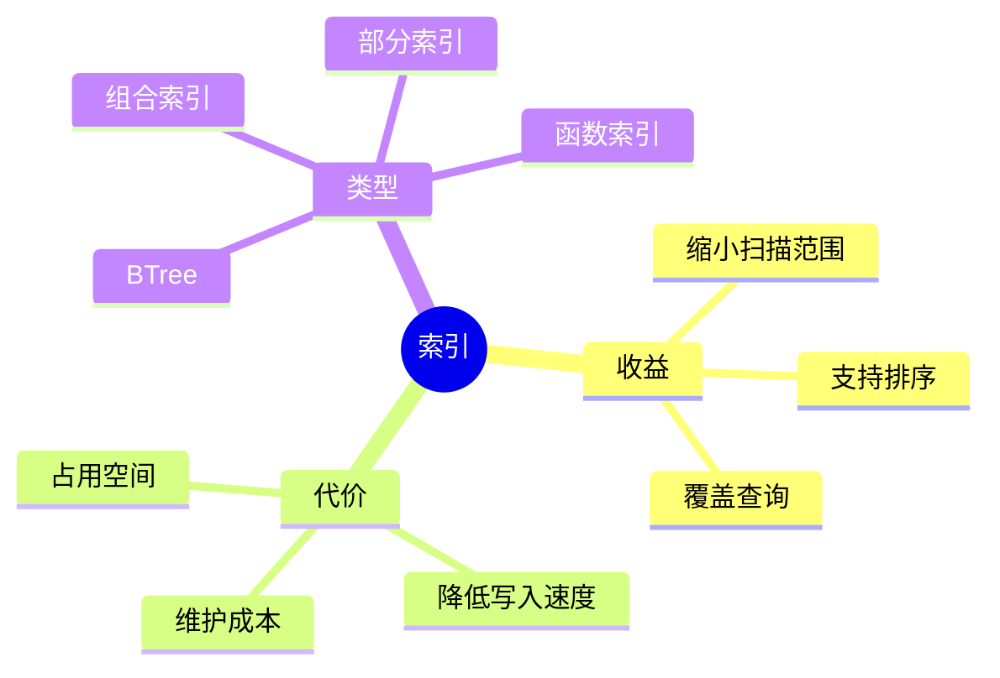
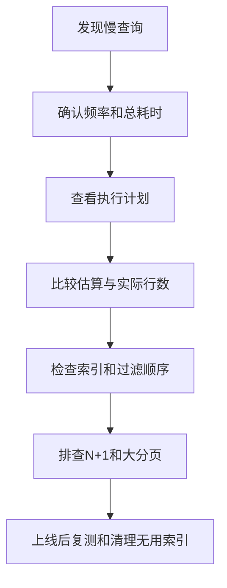

# 05. 索引原理与查询优化

## 学习目标

本章让你从“查询慢就加索引”升级到“知道为什么加、加在哪里、代价是什么”。你将掌握：

- 索引的作用和成本。
- B-tree、GIN、BRIN 等索引的适用场景。
- 组合索引列顺序。
- 覆盖索引、部分索引、函数索引。
- 如何用 `EXPLAIN` 分析查询。
- 常见慢查询反模式。

## 索引是什么

索引是数据库维护的辅助数据结构，用空间和写入成本换读取速度。

如果没有索引，查询可能需要扫描整张表：

```sql
SELECT * FROM customers WHERE email = 'ada@example.com';
```

有索引后，数据库可以像查字典一样快速定位：

```sql
CREATE INDEX idx_customers_email ON customers (email);
```

唯一约束通常也会创建唯一索引：

```sql
ALTER TABLE customers ADD CONSTRAINT customers_email_uq UNIQUE (email);
```

## 索引不是免费午餐

索引的成本：

1. 占用磁盘空间。
2. 插入、更新、删除时需要维护索引。
3. 过多索引会拖慢写入。
4. 错误索引会让优化器误判或根本用不上。

原则：围绕真实查询模式建立索引，而不是围绕字段名猜。

## 常见索引类型

| 查询模式 | 推荐索引 | 示例 |
| --- | --- | --- |
| `WHERE col = ?` | B-tree | `CREATE INDEX ON users (email);` |
| 范围查询 | B-tree | `CREATE INDEX ON orders (created_at);` |
| 等值 + 范围 | 组合 B-tree | `CREATE INDEX ON orders (status, created_at);` |
| JSONB 包含 | GIN | `CREATE INDEX ON events USING gin (payload);` |
| 全文搜索 | GIN | `CREATE INDEX ON docs USING gin (search_vector);` |
| 大型时间序列表 | BRIN | `CREATE INDEX ON logs USING brin (created_at);` |

## 组合索引列顺序

经验规则：等值列在前，范围列在后。

```sql
CREATE INDEX idx_orders_status_created
ON orders (status, created_at);
```

适合：

```sql
SELECT *
FROM orders
WHERE status = 'paid'
  AND created_at >= now() - interval '30 days'
ORDER BY created_at DESC;
```

如果查询经常只按 `created_at` 过滤，而不按 `status` 过滤，这个索引未必合适。组合索引要根据高频查询设计。

## 覆盖索引

PostgreSQL 支持 `INCLUDE`：

```sql
CREATE INDEX idx_orders_customer_created
ON orders (customer_id, created_at)
INCLUDE (status, total_amount);
```

如果查询只需要索引中已有字段，数据库有机会减少回表读取。

适合：

```sql
SELECT status, total_amount, created_at
FROM orders
WHERE customer_id = 1
ORDER BY created_at DESC
LIMIT 20;
```

## 部分索引

只索引满足条件的行：

```sql
CREATE INDEX idx_orders_pending_created
ON orders (created_at)
WHERE status = 'pending';
```

适合状态分布极不均匀的场景。例如 99% 订单都是已完成，只有少量 pending 需要频繁扫描。

软删除唯一约束示例：

```sql
CREATE UNIQUE INDEX users_email_active_uq
ON users (email)
WHERE deleted_at IS NULL;
```

## 函数索引

如果查询对字段做函数变换，普通索引可能用不上。

```sql
CREATE INDEX idx_customers_lower_email
ON customers (lower(email));
```

对应查询：

```sql
SELECT *
FROM customers
WHERE lower(email) = lower('Ada@Example.com');
```

更好的方式通常是在写入时规范化 email，再对规范化字段建索引。

## 外键也需要索引

很多数据库不会自动为外键列创建索引。没有外键索引会导致：

- 父表删除或更新时检查慢。
- 子表按父 ID 查询慢。

建议：

```sql
CREATE INDEX idx_orders_customer_id ON orders (customer_id);
CREATE INDEX idx_order_items_order_id ON order_items (order_id);
```

## 分页优化

### OFFSET 分页

```sql
SELECT *
FROM orders
ORDER BY id
LIMIT 20 OFFSET 100000;
```

问题：数据库仍然要跳过前 100000 行，越往后越慢。

### 游标分页

```sql
SELECT *
FROM orders
WHERE id > 100000
ORDER BY id
LIMIT 20;
```

更适合无限滚动和稳定排序。实际业务中常用 `(created_at, id)` 组合游标，避免时间重复。

```sql
SELECT *
FROM orders
WHERE (created_at, id) < ('2026-04-01 10:00:00+08', 12345)
ORDER BY created_at DESC, id DESC
LIMIT 20;
```

对应索引：

```sql
CREATE INDEX idx_orders_created_id_desc
ON orders (created_at DESC, id DESC);
```

## EXPLAIN 入门

PostgreSQL：

```sql
EXPLAIN ANALYZE
SELECT *
FROM orders
WHERE status = 'paid'
ORDER BY created_at DESC
LIMIT 20;
```

重点看：

- 是否 Seq Scan 全表扫描。
- 是否 Index Scan / Index Only Scan。
- 估算行数与实际行数差距是否很大。
- 排序是否使用内存或落盘。
- 总耗时主要在哪个节点。

`EXPLAIN ANALYZE` 会真实执行查询。对写操作使用时要放在事务里并回滚，或在测试环境执行。

## 查询优化顺序

1. 先确认查询返回结果是否正确。
2. 用 `EXPLAIN` 看执行计划。
3. 确认过滤条件、JOIN 条件、排序条件。
4. 检查是否缺索引或索引顺序错误。
5. 检查统计信息是否过期。
6. 减少返回列，避免 `SELECT *`。
7. 分页改游标。
8. 必要时重构模型或引入汇总表。

不要第一步就调数据库参数。

## 常见慢查询反模式

### 反模式 1：在索引列上做函数

```sql
WHERE date(created_at) = '2026-04-27'
```

更好：

```sql
WHERE created_at >= '2026-04-27 00:00:00+08'
  AND created_at <  '2026-04-28 00:00:00+08'
```

### 反模式 2：模糊查询前缀通配

```sql
WHERE name LIKE '%phone%'
```

普通 B-tree 难以利用。应考虑全文搜索、trigram 索引或搜索引擎。

### 反模式 3：大 JOIN 后再过滤

先缩小数据集，再连接。把过滤条件尽量放到能减少行数的位置。

### 反模式 4：N+1 查询

应用层循环查询：

```text
查 20 个订单 -> 每个订单再查一次明细 -> 共 21 次查询
```

可以用 JOIN、批量查询或预加载解决。

## 索引设计清单

- [ ] 索引来自真实查询，而不是猜测。
- [ ] 高频 WHERE 条件有合适索引。
- [ ] JOIN 外键列有索引。
- [ ] ORDER BY + LIMIT 有匹配索引。
- [ ] 组合索引列顺序符合查询模式。
- [ ] 低选择性字段不单独滥建索引。
- [ ] 写多读少表控制索引数量。
- [ ] 大表建索引考虑并发/在线方式，见 [[10-迁移版本化与零停机变更]]。

## 本章练习

1. 给“按客户查看最近订单”设计索引。
2. 给“查询 pending 订单队列”设计部分索引。
3. 把 OFFSET 分页改成游标分页。
4. 找一个慢 SQL，写出你会如何用 `EXPLAIN` 分析。

下一章：[[06-存储引擎日志与恢复]]。

<!-- DB-DEEP-EXPANSION-2026-04-28:START -->
## 深入展开：索引设计要从“访问路径”而不是“字段重要性”出发

很多初学者看到字段就想建索引：`user_id` 重要，建；`status` 重要，建；`created_at` 重要，建。真正的索引设计不是按字段重要性，而是按查询访问路径。

### 1. 一条查询需要怎样的索引

查询：

```sql
SELECT id, status, total_amount, created_at
FROM orders
WHERE user_id = 42
ORDER BY created_at DESC
LIMIT 20;
```

访问路径是：先定位某个用户的订单，再按创建时间倒序取前 20 条。合适索引是：

```sql
CREATE INDEX idx_orders_user_created
ON orders(user_id, created_at DESC)
INCLUDE(status, total_amount);
```

`user_id` 用于等值过滤，`created_at` 用于排序和截断，`INCLUDE` 字段让查询有机会减少回表。

### 2. 单列索引不等于组合索引

有三个单列索引：

```sql
CREATE INDEX ON orders(user_id);
CREATE INDEX ON orders(status);
CREATE INDEX ON orders(created_at);
```

不等于有一个适合下面查询的组合索引：

```sql
WHERE user_id = ? AND status = ?
ORDER BY created_at DESC
LIMIT 20
```

数据库有时可以合并索引，但通常不如一个贴合访问路径的组合索引稳定。组合索引能同时支持过滤和排序，这对分页查询尤其重要。

### 3. 选择性不是唯一标准

`status` 只有几个值，单列索引选择性低，通常收益有限。但部分索引可能很有价值：

```sql
CREATE INDEX idx_orders_pending_created
ON orders(created_at)
WHERE status = 'pending';
```

如果 pending 只占 0.1%，后台频繁扫描 pending 订单，这个索引非常小且高效。

### 4. 执行计划要看“估算 vs 实际”

`EXPLAIN ANALYZE` 中如果 estimated rows 和 actual rows 差距很大，说明优化器误判了数据量。可能原因：统计信息过期、数据分布倾斜、多列相关性强。

这种情况下，加索引不一定是第一步。可能先要：

```sql
ANALYZE orders;
```

或者提高统计目标、建立扩展统计、重写查询。

### 5. 慢查询不一定是查询本身慢

有时 SQL 执行时间长，是因为：

- 等锁。
- 连接池排队。
- 返回数据太多，网络传输慢。
- 应用层 N+1。
- 数据库缓存被报表查询污染。
- 磁盘 I/O 饱和。

所以排查慢查询时，要同时看数据库执行计划和系统指标。只盯 SQL 文本会漏掉很多问题。

### 6. 索引生命周期管理

索引不是建完就结束。随着业务变化，旧索引可能没人用，新查询可能缺索引。

定期检查：

- 哪些索引长期未使用。
- 哪些索引重复或可合并。
- 哪些索引过大。
- 写入热点表是否索引太多。
- 新增接口是否引入慢查询。

删除索引也要谨慎。低频月结报表索引可能平时使用次数少，但业务重要。删除前要确认用途，最好在预发或灰度环境验证。

### 7. 查询优化的完整流程

```text
确认业务语义 -> 查看执行计划 -> 检查数据量和选择性 -> 设计/调整索引 -> 验证执行计划 -> 压测或观察 -> 固化监控
```

不要凭感觉加索引。每个索引都应该能回答：它服务哪条查询？减少了什么成本？增加了什么写入代价？
<!-- DB-DEEP-EXPANSION-2026-04-28:END -->

## 思维导图

> 记忆建议：索引不是给“重要字段”建的，而是给“稳定高频访问路径”建的。

### 1. 索引的收益与代价



### 2. 组合索引设计


### 3. 慢查询优化流程


