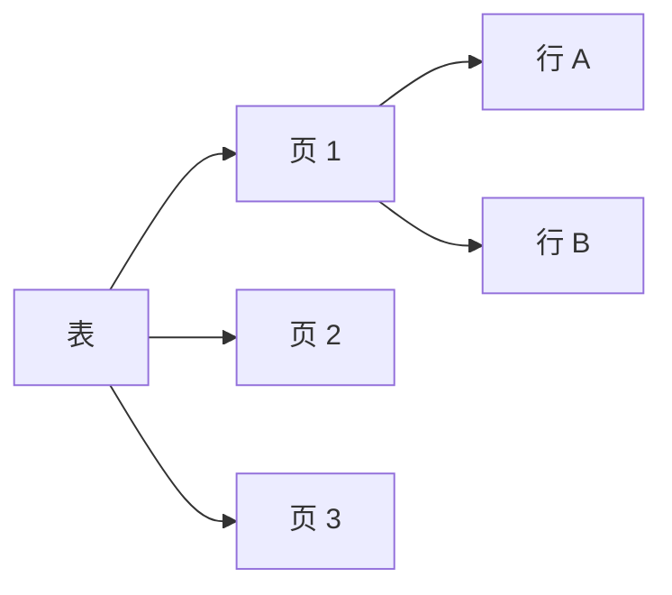
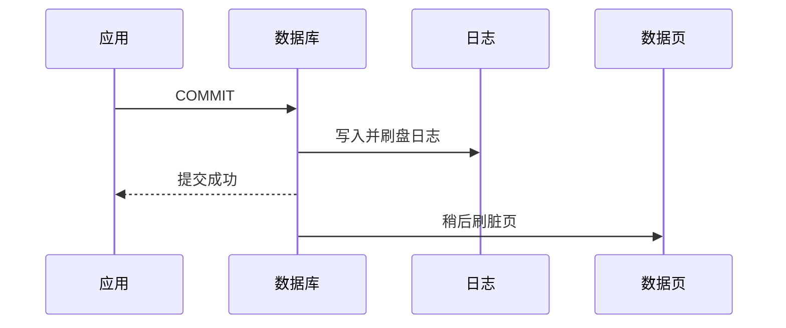
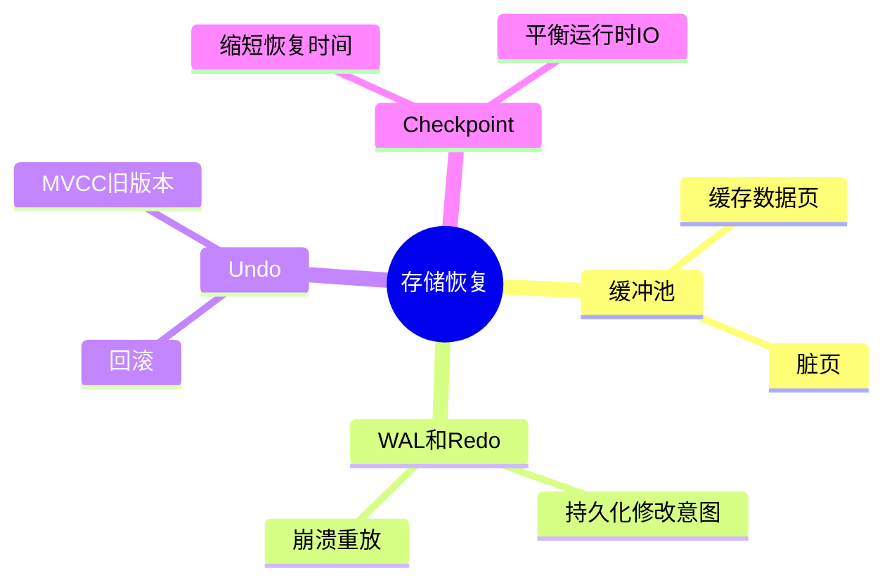
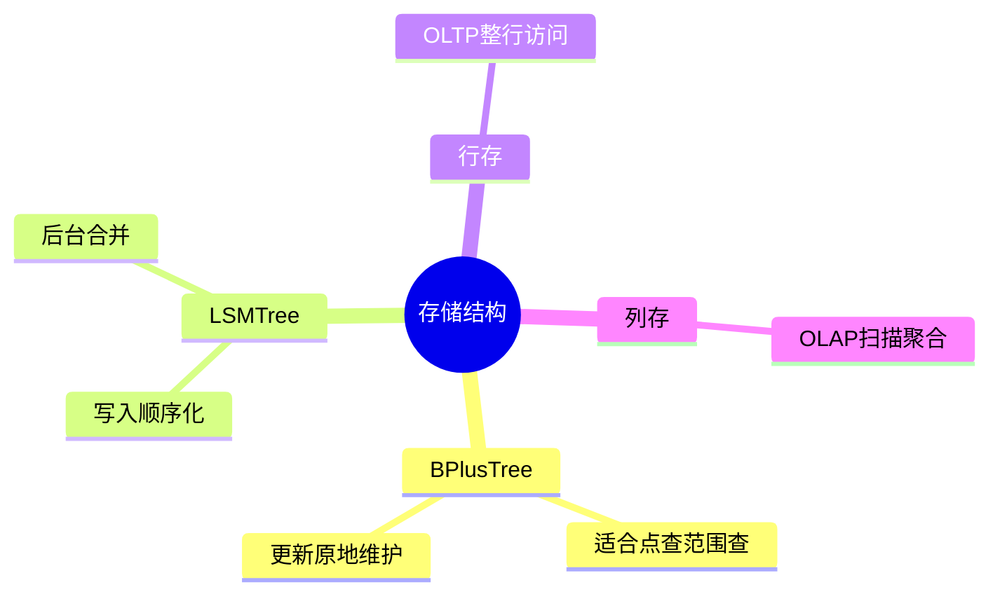

# 06. 存储引擎、日志与恢复

## 学习目标

本章解释数据库为什么能“提交后不丢”、为什么宕机能恢复、为什么读写性能受内存和磁盘结构影响。读完后你应该能：

- 理解页、缓冲池、行存、列存。
- 理解 WAL / Redo / Undo 的作用。
- 知道检查点、崩溃恢复、复制日志的大致流程。
- 理解 B+Tree、LSM、列式存储的适用场景。
- 知道 MVCC 为什么需要清理旧版本。

## 从磁盘页开始

数据库不会每次只读写一行。常见做法是把数据文件划分为固定大小的页（page/block），以页为单位读写。



页是数据库存储和缓存的基本单位之一。一次查询慢不慢，往往取决于需要访问多少页、这些页是否已经在内存中。

## 缓冲池

缓冲池是数据库用来缓存磁盘页的内存区域。

读取流程大致是：

1. 查询需要某个页。
2. 数据库先查缓冲池。
3. 如果命中，直接读内存。
4. 如果未命中，从磁盘读入缓冲池。

写入通常也先修改内存中的页，再由后台进程刷盘。为了防止宕机丢失，数据库会先写日志。

## WAL / Redo Log

WAL（Write-Ahead Logging，预写日志）的核心规则：

> 数据页落盘前，描述这次修改的日志必须先安全落盘。

这样即使数据页还没写完数据库就宕机，重启后也可以根据日志重放修改。

简化流程：



这解释了为什么磁盘 fsync、日志盘性能、批量提交都会影响写入吞吐。

## Undo 与回滚

回滚需要知道如何撤销已做修改。不同数据库实现不同，但核心思想是保留足够信息，让事务失败时能恢复到修改前状态。

- Redo：崩溃后重做已提交修改。
- Undo：事务失败时撤销未提交修改。
- MVCC 旧版本：让读事务看到旧快照。

## 检查点

如果数据库从创建以来的所有日志都要重放，恢复会非常慢。检查点的作用是记录一个相对安全的位置：

- 检查点之前的数据页大多已刷盘。
- 崩溃恢复时从最近检查点附近开始重放。

检查点太频繁会增加 I/O；太少会导致恢复时间变长。

## 行存与列存

### 行存

一行的数据放在一起。

适合：

- OLTP。
- 按主键读取整行。
- 小事务写入。

典型：PostgreSQL、MySQL InnoDB。

### 列存

同一列的数据放在一起。

适合：

- OLAP。
- 大量扫描少数列。
- 压缩和向量化执行。

典型：ClickHouse、Parquet、BigQuery 类系统。

不要让行存业务库承担大量全表聚合报表；也不要用列存系统做强事务订单库。

## B+Tree

B+Tree 是关系数据库最常见的索引结构之一。

特点：

- 数据有序。
- 支持等值查询。
- 支持范围查询。
- 树高较低，磁盘 I/O 可控。

适合：

```sql
WHERE id = ?
WHERE created_at >= ? AND created_at < ?
ORDER BY created_at
```

## LSM Tree

LSM Tree 常见于写入密集型系统。大致思想：

1. 写入先进入内存结构。
2. 再顺序刷到磁盘文件。
3. 后台不断合并压缩文件。

优点：写入友好。

代价：读取可能需要查多个层级，后台 compaction 会带来 I/O 波动。

典型使用者包括一些 NoSQL、日志型、嵌入式存储引擎。

## MVCC 旧版本清理

MVCC 让读写并发更好，但旧版本不能无限保留。

PostgreSQL 中，如果长事务一直不结束，旧行版本无法清理，可能导致表膨胀。工程建议：

- 避免长时间打开事务。
- 不要在事务里等待用户操作。
- 监控 dead tuples、vacuum 状态。
- 大批量更新分批执行。

## 崩溃恢复的直觉

数据库重启后通常做两类事情：

1. 重做已提交但未完全落盘的修改。
2. 撤销未提交事务的影响。

因此提交成功的事务不应该丢，未提交事务不应该半截存在。

这背后依赖：日志、页 LSN、检查点、事务状态等内部机制。

## 复制日志

主从复制常依赖日志流：

- 主库写入日志。
- 从库接收日志。
- 从库重放日志。

复制带来读扩展和高可用，但也引入复制延迟。读写分离时要注意：刚写完的数据，马上去从库读，可能读不到。

## 工程启示

1. 写入性能不只取决于 CPU，还取决于日志刷盘。
2. 长事务会影响 MVCC 清理和复制延迟。
3. 大批量更新会产生大量日志和旧版本。
4. 查询优化不仅是 SQL 问题，也是页访问和缓存命中问题。
5. 备份恢复必须理解日志归档和时间点恢复。

## 本章练习

1. 用自己的话解释 WAL 为什么要“先写日志再写数据页”。
2. 比较行存和列存，各举一个适合场景。
3. 解释长事务为什么会导致 PostgreSQL 表膨胀。
4. 说明主从复制延迟会如何影响“写后读”。

下一章：[[07-PostgreSQL实践指南]]。

<!-- DB-DEEP-EXPANSION-2026-04-28:START -->
## 深入展开：为什么数据库能在宕机后保持可信

数据库最神奇的地方不是能查询，而是能在复杂失败后恢复到一致状态。理解页、缓冲池和日志，能帮助你解释很多性能和可靠性问题。

### 1. 写入不是直接“改磁盘上的一行”

数据库通常先把数据页读入内存缓冲池，在内存中修改页，这个页变成脏页。脏页不会每次提交都立刻写回磁盘，因为随机写数据页成本高。

那提交后宕机怎么办？靠 WAL/redo log。提交时先把修改日志持久化，数据页可以稍后刷盘。重启时根据日志重放。

这个设计把大量随机数据页写，变成更顺序的日志写，性能和可靠性都更好。

### 2. WAL 的关键承诺

WAL 的承诺是：如果数据库告诉客户端提交成功，那么恢复所需的日志已经安全保存。

因此可能出现：

```text
事务提交成功 -> 数据页还没刷盘 -> 机器宕机 -> 重启 -> 重放 WAL -> 数据恢复
```

如果没有 WAL，提交必须等待所有相关数据页写盘，性能会差很多；或者宕机后无法判断哪些修改应该保留。

### 3. Checkpoint 是恢复时间和运行时 I/O 的平衡

Checkpoint 会推动脏页刷盘，并记录恢复起点。Checkpoint 频繁，恢复快但运行时 I/O 压力大；Checkpoint 太少，运行时轻松但宕机恢复慢。

这解释了为什么数据库有时会出现周期性 I/O 波动，也解释了为什么恢复时间和配置有关。

### 4. MVCC 旧版本为什么要清理

MVCC 中，更新通常不是原地覆盖，而是产生新版本。旧版本要留给仍在读取旧快照的事务。

问题是旧版本不能无限增长。长事务会让数据库不敢清理旧版本，导致：

- 表膨胀。
- 索引膨胀。
- 缓存效率下降。
- vacuum 压力增加。

所以“不要长时间 idle in transaction”不是洁癖，而是保护存储健康。

### 5. 行存、列存、LSM 的直觉比较

| 存储思路 | 适合 | 代价 |
| --- | --- | --- |
| 行存 | OLTP、整行读写、小事务 | 大范围分析扫描不如列存 |
| 列存 | 报表、聚合、少列大扫描 | 小事务更新通常不是强项 |
| LSM | 高写入、顺序写、日志类场景 | 读放大、compaction 抖动 |

这不是谁先进谁落后，而是工作负载不同。选错存储模型，就会拿一个系统的弱项硬扛业务主路径。

### 6. 从存储角度理解慢查询

慢查询可能慢在：

- 读了太多页。
- 随机 I/O 太多。
- 缓冲池命中率低。
- 排序/哈希聚合内存不够落盘。
- 表膨胀导致读了很多无效版本。

所以执行计划里的 rows、loops、sort、temporary file、buffer hit/read 都有意义。它们告诉你 SQL 背后实际访问了多少存储资源。
<!-- DB-DEEP-EXPANSION-2026-04-28:END -->

## 思维导图

> 记忆建议：数据库可信的关键是“先写日志，再改数据页；崩溃后按日志恢复”。

### 1. 写入不是直接改磁盘行


### 2. 日志与恢复组件



### 3. 存储结构选择


