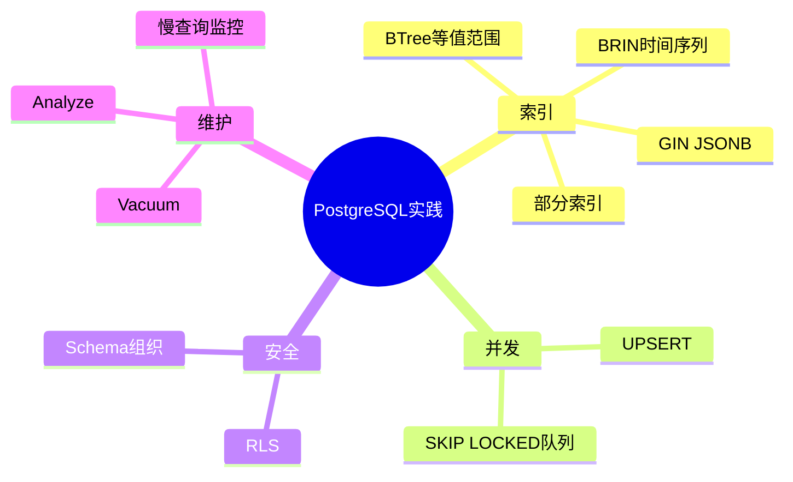
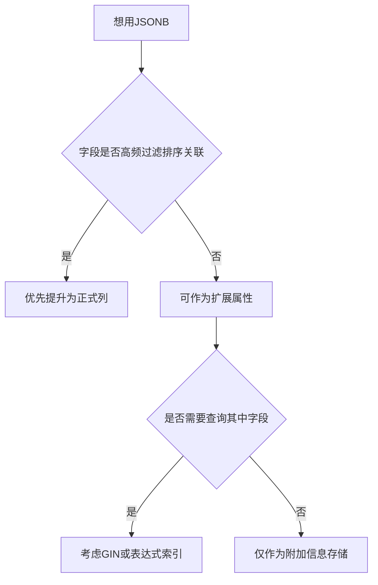

# 07. PostgreSQL 实践指南

## 学习目标

本章把前面的通用知识落到 PostgreSQL。读完后你应该能：

- 做出合理的数据类型选择。
- 使用 PostgreSQL 常见索引模式。
- 编写 UPSERT、队列、全文搜索等实用 SQL。
- 理解 RLS、schema、extension、vacuum 的工程意义。
- 建立 PostgreSQL 项目默认清单。

## 数据类型选择

| 场景 | 推荐 | 说明 |
| --- | --- | --- |
| 自增主键 | `BIGINT GENERATED ALWAYS AS IDENTITY` | 避免过早用小整数 |
| 文本 | `TEXT` | PostgreSQL 中无需迷信 `VARCHAR(255)` |
| 时间 | `TIMESTAMPTZ` | 保存绝对时间点，显示时再转时区 |
| 金额 | `NUMERIC(12,2)` 或整数分 | 不用浮点数表示钱 |
| 布尔 | `BOOLEAN` | 不用 `'Y'/'N'` 或 0/1 文本 |
| 半结构化 | `JSONB` | 适合扩展属性，不适合核心关系 |
| 枚举 | `TEXT + CHECK` 或 enum | 变更频繁时 CHECK 更灵活 |

示例：

```sql
CREATE TABLE invoices (
  id BIGINT GENERATED ALWAYS AS IDENTITY PRIMARY KEY,
  customer_id BIGINT NOT NULL,
  status TEXT NOT NULL CHECK (status IN ('draft', 'issued', 'paid', 'void')),
  amount NUMERIC(12, 2) NOT NULL CHECK (amount >= 0),
  metadata JSONB NOT NULL DEFAULT '{}'::jsonb,
  issued_at TIMESTAMPTZ,
  created_at TIMESTAMPTZ NOT NULL DEFAULT now()
);
```

## Schema 组织

PostgreSQL 的 schema 是命名空间。常见用法：

- `public`：默认 schema，不建议无限堆所有对象。
- `app`：业务表。
- `audit`：审计表。
- `analytics`：汇总/报表对象。

示例：

```sql
CREATE SCHEMA app;
CREATE SCHEMA audit;
```

安全默认项：不要让所有用户随意在 public schema 创建对象。

```sql
REVOKE ALL ON SCHEMA public FROM public;
```

## 常见索引模式

### 等值与范围

```sql
CREATE INDEX idx_orders_customer_created
ON orders (customer_id, created_at DESC);
```

适合客户订单列表：

```sql
SELECT *
FROM orders
WHERE customer_id = 1
ORDER BY created_at DESC
LIMIT 20;
```

### 部分索引

```sql
CREATE INDEX idx_jobs_pending_created
ON jobs (created_at)
WHERE status = 'pending';
```

适合队列或少量活跃状态。

### GIN + JSONB

```sql
CREATE INDEX idx_events_payload_gin
ON events USING gin (payload);
```

查询：

```sql
SELECT *
FROM events
WHERE payload @> '{"type":"checkout"}'::jsonb;
```

不要把必须强约束的字段藏在 JSONB 里。JSONB 是扩展，不是偷懒建模的借口。

### BRIN 时间索引

```sql
CREATE INDEX idx_logs_created_brin
ON logs USING brin (created_at);
```

适合按时间追加的大表，索引很小，但查询精度不如 B-tree。

## UPSERT

```sql
INSERT INTO user_settings (user_id, key, value)
VALUES (1, 'theme', 'dark')
ON CONFLICT (user_id, key)
DO UPDATE SET
  value = EXCLUDED.value,
  updated_at = now();
```

需要唯一约束：

```sql
ALTER TABLE user_settings
ADD CONSTRAINT user_settings_user_key_uq UNIQUE (user_id, key);
```

## 队列处理：FOR UPDATE SKIP LOCKED

多个 worker 并发领取任务：

```sql
UPDATE jobs
SET status = 'processing', locked_at = now()
WHERE id = (
  SELECT id
  FROM jobs
  WHERE status = 'pending'
  ORDER BY created_at
  LIMIT 1
  FOR UPDATE SKIP LOCKED
)
RETURNING *;
```

`SKIP LOCKED` 会跳过已被其他事务锁住的行，适合轻量任务队列。复杂队列仍应考虑专门消息系统。

## 全文搜索

```sql
ALTER TABLE articles
ADD COLUMN search_vector tsvector GENERATED ALWAYS AS (
  to_tsvector('simple', coalesce(title, '') || ' ' || coalesce(body, ''))
) STORED;

CREATE INDEX idx_articles_search
ON articles USING gin (search_vector);

SELECT id, title
FROM articles
WHERE search_vector @@ plainto_tsquery('simple', 'database index');
```

如果需要复杂相关性、拼写纠错、分布式搜索，可以引入搜索引擎。

## Row Level Security（RLS）

RLS 让数据库根据行级策略控制访问，常见于多租户和后端即服务。

```sql
ALTER TABLE orders ENABLE ROW LEVEL SECURITY;

CREATE POLICY tenant_isolation ON orders
USING (tenant_id = current_setting('app.current_tenant')::bigint);
```

应用连接后设置租户：

```sql
SET app.current_tenant = '42';
```

注意：RLS 是安全边界的一部分，但不是替代应用鉴权的全部。

## 分区表

适合超大表按时间或租户拆分管理。

```sql
CREATE TABLE events (
  id BIGINT GENERATED ALWAYS AS IDENTITY,
  created_at TIMESTAMPTZ NOT NULL,
  payload JSONB NOT NULL
) PARTITION BY RANGE (created_at);

CREATE TABLE events_2026_04
PARTITION OF events
FOR VALUES FROM ('2026-04-01') TO ('2026-05-01');
```

分区不是免费加速。只有查询条件能命中分区裁剪，才会明显受益。

## Vacuum 与 Analyze

PostgreSQL 更新/删除会留下旧版本，需要 vacuum 清理。

- `VACUUM`：清理死元组，复用空间。
- `ANALYZE`：更新统计信息，帮助优化器估算。
- autovacuum：自动执行，但需要监控。

长事务会阻止旧版本清理。批量任务应分批提交。

## 监控慢查询

启用 `pg_stat_statements` 后可按平均耗时、调用次数排查：

```sql
SELECT query, mean_exec_time, calls
FROM pg_stat_statements
ORDER BY mean_exec_time DESC
LIMIT 20;
```

慢查询优化前先确认：

1. 查询是否必要。
2. 返回行数是否过多。
3. 是否缺索引。
4. 统计信息是否准确。
5. 是否存在锁等待。

## PostgreSQL 项目默认清单

- [ ] 所有表有主键。
- [ ] 外键列有索引。
- [ ] 时间字段使用 `TIMESTAMPTZ`。
- [ ] 金额不用浮点数。
- [ ] 状态字段有 CHECK 或明确枚举策略。
- [ ] 大表索引用 `CREATE INDEX CONCURRENTLY`。
- [ ] 启用慢查询观测。
- [ ] 连接池配置合理。
- [ ] 备份和恢复演练已验证。
- [ ] public schema 权限已收紧。

## 本章练习

1. 为 `orders(customer_id, created_at)` 设计一个支持最近订单列表的索引。
2. 写一个基于 `ON CONFLICT` 的用户设置更新 SQL。
3. 设计一个 pending jobs 队列领取 SQL。
4. 判断一个字段应该建成普通列还是 JSONB 属性。

下一章：[[08-MySQL关键差异]]。

<!-- DB-DEEP-EXPANSION-2026-04-28:START -->
## 深入展开：PostgreSQL 项目的工程化默认设置

PostgreSQL 功能很丰富，但工程上更重要的是形成一套默认习惯。下面这些习惯能显著减少后期数据质量、性能和权限问题。

### 1. 建表时就把约束写完整

示例：

```sql
CREATE TABLE app.orders (
  id BIGINT GENERATED ALWAYS AS IDENTITY PRIMARY KEY,
  tenant_id BIGINT NOT NULL,
  user_id BIGINT NOT NULL,
  status TEXT NOT NULL CHECK (status IN ('pending', 'paid', 'cancelled')),
  total_amount NUMERIC(12, 2) NOT NULL CHECK (total_amount >= 0),
  created_at TIMESTAMPTZ NOT NULL DEFAULT now(),
  paid_at TIMESTAMPTZ
);
```

不要先让脏数据进库，再想着以后治理。越早加约束，成本越低。

### 2. JSONB 使用边界

JSONB 很方便，但要定规则：

- 外部原始 payload 可以放 JSONB。
- 低频扩展字段可以放 JSONB。
- 高频过滤、排序、JOIN 字段不要长期放 JSONB。
- 核心字段一旦稳定，应迁移为普通列。

从 JSONB 提升为普通列的过程，本质是一次 expand-contract：新增列、双写、回填、切查询、清理旧结构。

### 3. RLS 要配合连接上下文

RLS 常见于多租户：

```sql
CREATE POLICY tenant_isolation ON app.orders
USING (tenant_id = current_setting('app.current_tenant')::bigint);
```

应用必须在每个请求开始时设置租户上下文，并在连接归还连接池前清理或覆盖。否则连接复用可能导致租户上下文泄漏。

RLS 策略必须测试：同租户可见、跨租户不可见、未设置租户不可见、管理员路径明确。

### 4. `CREATE INDEX CONCURRENTLY` 的注意点

大表在线建索引要用：

```sql
CREATE INDEX CONCURRENTLY idx_orders_user_created
ON app.orders(user_id, created_at DESC);
```

但它不能在普通事务块中运行。很多 migration 工具默认把 migration 包在事务里，需要单独配置。

失败的 concurrent index 可能留下 invalid index，需要清理。所以上线脚本要检查索引状态。

### 5. Vacuum 不是可选项

PostgreSQL 的 MVCC 决定了 vacuum 是日常维护的一部分。你要监控：

- dead tuples。
- autovacuum 是否及时。
- 长事务。
- 表和索引膨胀。
- transaction ID 年龄。

如果应用里经常出现长事务，调 autovacuum 参数只能缓解，不能根治。

### 6. 常用诊断 SQL 思路

慢查询：

```sql
SELECT query, calls, mean_exec_time, total_exec_time
FROM pg_stat_statements
ORDER BY total_exec_time DESC
LIMIT 20;
```

长事务：

```sql
SELECT pid, now() - xact_start AS age, state, query
FROM pg_stat_activity
WHERE xact_start IS NOT NULL
ORDER BY age DESC;
```

表膨胀线索：

```sql
SELECT relname, n_live_tup, n_dead_tup, last_vacuum, last_autovacuum
FROM pg_stat_user_tables
ORDER BY n_dead_tup DESC
LIMIT 20;
```

这些 SQL 不一定原封不动用于所有环境，但体现了排查方向：慢查询、长事务、旧版本堆积。

### 7. PostgreSQL 项目上线前底线

- [ ] 应用用户不是超级用户。
- [ ] public schema 权限收紧。
- [ ] 所有核心表有主键和必要约束。
- [ ] 外键查询列有索引。
- [ ] 慢查询观测已启用。
- [ ] migration 支持 concurrent index。
- [ ] 备份和恢复演练已做。
- [ ] 连接池大小和数据库连接上限匹配。
<!-- DB-DEEP-EXPANSION-2026-04-28:END -->

## 思维导图

> 记忆建议：PostgreSQL 工程实践的底线是“类型准确、约束完整、索引有证据、Vacuum可观测”。

### 1. 建表默认清单


### 2. PostgreSQL 常用能力



### 3. JSONB 使用边界


