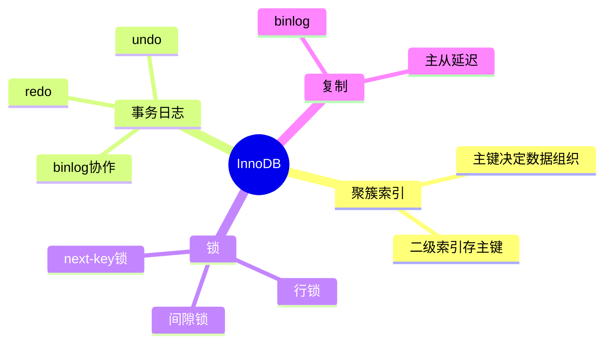
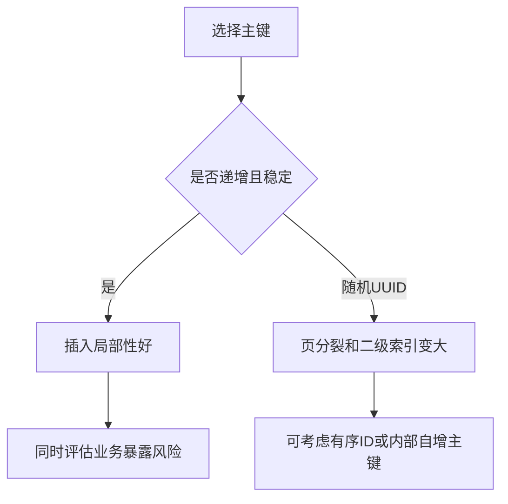
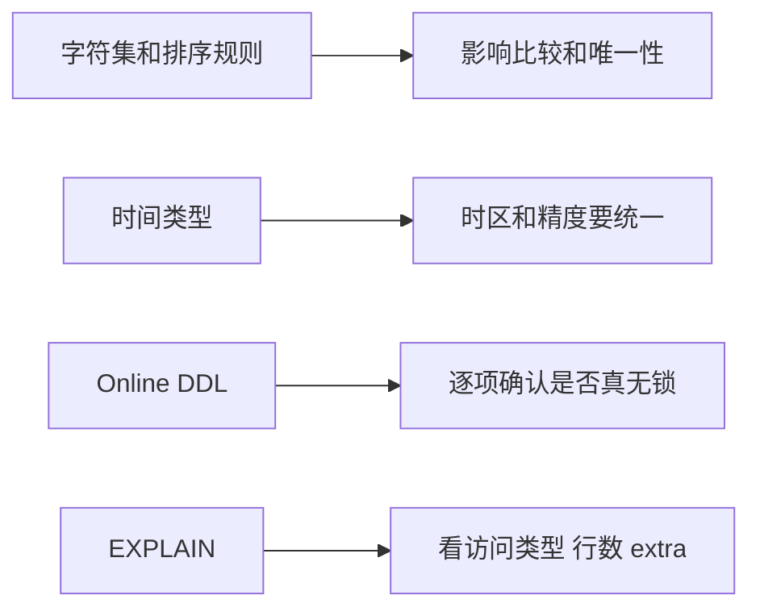

# 08. MySQL 关键差异

## 学习目标

本章不是完整 MySQL 手册，而是帮助你在已经理解关系数据库基础后，掌握 MySQL 工程中最容易影响设计和排错的差异点：

- InnoDB 的核心特性。
- 聚簇索引与主键选择。
- 字符集、时间类型、JSON、DDL 的注意事项。
- 锁、隔离级别、复制和线上变更的常见坑。
- 与 PostgreSQL 的对照。

## MySQL 与 InnoDB

MySQL 是数据库系统，InnoDB 是最常用的存储引擎。现代 MySQL 业务表通常使用 InnoDB，因为它支持：

- 事务。
- 行级锁。
- 外键。
- 崩溃恢复。
- MVCC。

建表时应明确或确认引擎：

```sql
CREATE TABLE users (
  id BIGINT PRIMARY KEY AUTO_INCREMENT,
  email VARCHAR(255) NOT NULL UNIQUE,
  name VARCHAR(255) NOT NULL,
  created_at TIMESTAMP NOT NULL DEFAULT CURRENT_TIMESTAMP
) ENGINE=InnoDB;
```

## 聚簇索引

InnoDB 的表数据按主键聚簇存储。主键选择会影响二级索引和插入性能。

建议：

- 主键尽量短、稳定、递增或近似递增。
- 不要使用会变化的业务字段做主键。
- 随机 UUID 作为主键可能导致页分裂和缓存局部性差，可考虑有序 UUID/ULID 或自增 ID。

## 字符集与排序规则

新项目通常应使用 `utf8mb4`，而不是老的 `utf8`。

```sql
CREATE DATABASE app
  CHARACTER SET utf8mb4
  COLLATE utf8mb4_0900_ai_ci;
```

注意排序规则会影响大小写敏感、重音敏感、唯一约束比较行为。

如果邮箱需要大小写不敏感唯一性，必须明确规范化策略，而不是靠默认 collation 碰运气。

## 时间类型

MySQL 常见时间类型：

- `TIMESTAMP`：与时区转换有关，范围相对有限。
- `DATETIME`：保存字面日期时间，不自动转换时区。

工程建议：

- 统一应用层和数据库连接时区。
- 存储绝对时间时保持 UTC 或明确时区策略。
- 不要混用多种语义。

## JSON

MySQL 有 JSON 类型，也支持生成列配合索引。

```sql
CREATE TABLE events (
  id BIGINT PRIMARY KEY AUTO_INCREMENT,
  payload JSON NOT NULL,
  event_type VARCHAR(100) GENERATED ALWAYS AS (JSON_UNQUOTE(JSON_EXTRACT(payload, '$.type'))) STORED,
  INDEX idx_events_event_type (event_type)
);
```

和 PostgreSQL 一样：JSON 适合扩展属性，不适合承载核心关系和强约束。

## 隔离级别与锁

MySQL InnoDB 默认隔离级别常见为 Repeatable Read。它通过 MVCC 和锁机制处理并发。

需要特别理解：

- 行锁依赖索引。如果条件无法使用索引，可能锁更多行。
- 范围查询在某些隔离级别下会涉及 gap lock / next-key lock。
- 死锁不是数据库坏了，而是并发写入中需要处理的正常异常。

工程建议：

1. 更新和删除条件尽量命中索引。
2. 多表更新保持一致访问顺序。
3. 捕获死锁并重试幂等事务。
4. 避免长事务。

## 自增 ID

```sql
id BIGINT PRIMARY KEY AUTO_INCREMENT
```

自增 ID 简单、高效、局部性好。缺点是：

- 暴露数量趋势。
- 分库分表时需要额外 ID 方案。
- 多主写入时冲突处理更复杂。

不要因为“看起来不高级”就轻易放弃自增主键。

## UPSERT

MySQL 写法：

```sql
INSERT INTO user_settings (user_id, setting_key, setting_value)
VALUES (1, 'theme', 'dark')
ON DUPLICATE KEY UPDATE
  setting_value = VALUES(setting_value),
  updated_at = CURRENT_TIMESTAMP;
```

注意它依赖唯一键或主键冲突。

## EXPLAIN

```sql
EXPLAIN
SELECT *
FROM orders
WHERE customer_id = 1
ORDER BY created_at DESC
LIMIT 20;
```

重点看：

- `type`：访问类型，ALL 通常表示全表扫描。
- `key`：实际使用的索引。
- `rows`：估算扫描行数。
- `Extra`：是否 Using filesort、Using temporary。

MySQL 的执行计划字段和 PostgreSQL 不同，但目标一致：看数据库实际怎么取数。

## Online DDL

MySQL 支持多种在线 DDL 能力，但是否真正无锁取决于版本、操作类型、表结构和参数。

大表变更前必须确认：

- 是否会复制整表。
- 是否会阻塞写入。
- 是否影响复制延迟。
- 是否需要 gh-ost、pt-online-schema-change 等外部工具。

不要在业务高峰直接对大表执行未知代价的 `ALTER TABLE`。

## 复制与 binlog

MySQL 复制常依赖 binlog。常见用途：

- 主从复制。
- 数据恢复。
- CDC 同步。

注意：

- 读写分离会有复制延迟。
- 从库读可能读不到刚写入的数据。
- 大事务会放大复制延迟。

## PostgreSQL 与 MySQL 对照

| 主题 | PostgreSQL | MySQL/InnoDB |
| --- | --- | --- |
| 主键自增 | Identity / sequence | AUTO_INCREMENT |
| JSON | JSONB 能力强 | JSON + 生成列索引常见 |
| 全文搜索 | 内置能力较强 | 可用但复杂搜索常接搜索引擎 |
| 并发建索引 | `CREATE INDEX CONCURRENTLY` | Online DDL 视版本和操作而定 |
| 聚簇存储 | 堆表 + 独立索引 | 主键聚簇 |
| RLS | 内置行级安全 | 通常应用层实现 |
| 扩展 | extension 生态强 | 插件/引擎生态不同 |

## MySQL 项目检查清单

- [ ] 默认字符集使用 `utf8mb4`。
- [ ] 每张 InnoDB 表有短且稳定的主键。
- [ ] 外键和查询条件列有必要索引。
- [ ] 大表 DDL 前确认是否在线。
- [ ] 事务中不做慢外部调用。
- [ ] 读写分离场景处理复制延迟。
- [ ] 关键更新条件命中索引，避免锁范围扩大。
- [ ] 备份包含全量、增量/binlog 和恢复演练。

## 本章练习

1. 解释 InnoDB 聚簇索引如何影响主键选择。
2. 把 PostgreSQL 的 UPSERT 改写成 MySQL 版本。
3. 找一个 MySQL 大表加列场景，写上线前检查清单。
4. 解释读写分离下“刚写完读不到”的原因和解决策略。

下一章：[[09-NoSQL缓存搜索与分析型数据库]]。

<!-- DB-DEEP-EXPANSION-2026-04-28:START -->
## 深入展开：MySQL 面试和生产中最容易踩的点

MySQL 的很多问题不是 SQL 语法问题，而是 InnoDB 存储特性、字符集、隔离级别和 DDL 行为带来的工程细节。

### 1. 聚簇索引决定主键不是随便选的

InnoDB 表按主键组织数据。主键叶子节点就是整行数据，二级索引叶子节点保存主键值。因此主键越大，所有二级索引也会变大。

随机 UUID 主键的风险：

- 插入位置随机，页分裂更多。
- 缓存局部性差。
- 二级索引体积变大。

常见折中：内部自增 bigint 做主键，对外暴露 `public_id`。这样既不暴露自增 ID，又保留 InnoDB 物理性能优势。

### 2. 字符集和 collation 会影响唯一性

`utf8mb4` 是现代 MySQL 项目更安全的默认选择。collation 会决定大小写是否敏感、重音是否敏感。

例如邮箱唯一性不能只靠默认 collation。更稳妥做法是保存规范化邮箱：

```text
email_original      -- 用户输入展示
email_normalized    -- lower/trim 后用于唯一约束
```

并对 `email_normalized` 建唯一索引。

### 3. InnoDB 锁范围和索引强相关

MySQL 中 UPDATE/DELETE 条件如果不命中索引，可能扫描并锁住大量行，造成线上阻塞。

危险写法：

```sql
UPDATE orders SET status = 'expired'
WHERE created_at < '2026-01-01';
```

如果 `created_at` 没索引，可能影响很大。大批量更新应分批，并确保条件有索引。

### 4. Repeatable Read 不等于没有并发问题

MySQL InnoDB 默认常见隔离级别是 Repeatable Read，但这不意味着业务自动安全。丢失更新、状态机重复流转、幂等问题仍要靠条件更新、唯一约束和事务设计解决。

例如支付回调仍应使用唯一键：

```sql
UNIQUE KEY uq_payment_event(provider, provider_event_id)
```

而不是相信隔离级别会阻止重复消息。

### 5. Online DDL 要看具体操作

大表变更前要确认：

- MySQL 版本。
- DDL algorithm：INSTANT、INPLACE、COPY。
- LOCK 级别。
- 是否重建表。
- 是否导致从库延迟。
- 是否有长事务阻塞元数据锁。

“支持 Online DDL”不代表任何 ALTER 都安全。生产上要演练，必要时用 gh-ost 或 pt-online-schema-change。

### 6. MySQL 排查慢查询的重点

`EXPLAIN` 中重点看：

- `type` 是否为 ALL。
- `key` 是否使用预期索引。
- `rows` 估算扫描行数。
- `Extra` 是否有 `Using filesort`、`Using temporary`。

但同样要结合锁等待、buffer pool、I/O、连接数。MySQL 慢不一定是单条 SQL 算得慢，也可能是在等元数据锁或行锁。

### 7. PostgreSQL 背景转 MySQL 的注意事项

- 不要假设有 RLS。
- JSON 能用，但复杂 JSON 查询能力和索引方式不同。
- DDL 行为差异很大。
- 时间类型语义要重新确认。
- 自增、复制、binlog、主从延迟是 MySQL 运维重点。

跨数据库开发时，不能只写“标准 SQL”，还要理解存储引擎差异。
<!-- DB-DEEP-EXPANSION-2026-04-28:END -->

## 思维导图

> 记忆建议：MySQL 重点记 InnoDB 聚簇索引、锁范围、字符集时间类型和 Online DDL 边界。

### 1. InnoDB 关键模型



### 2. 主键设计影响



### 3. 生产注意点


