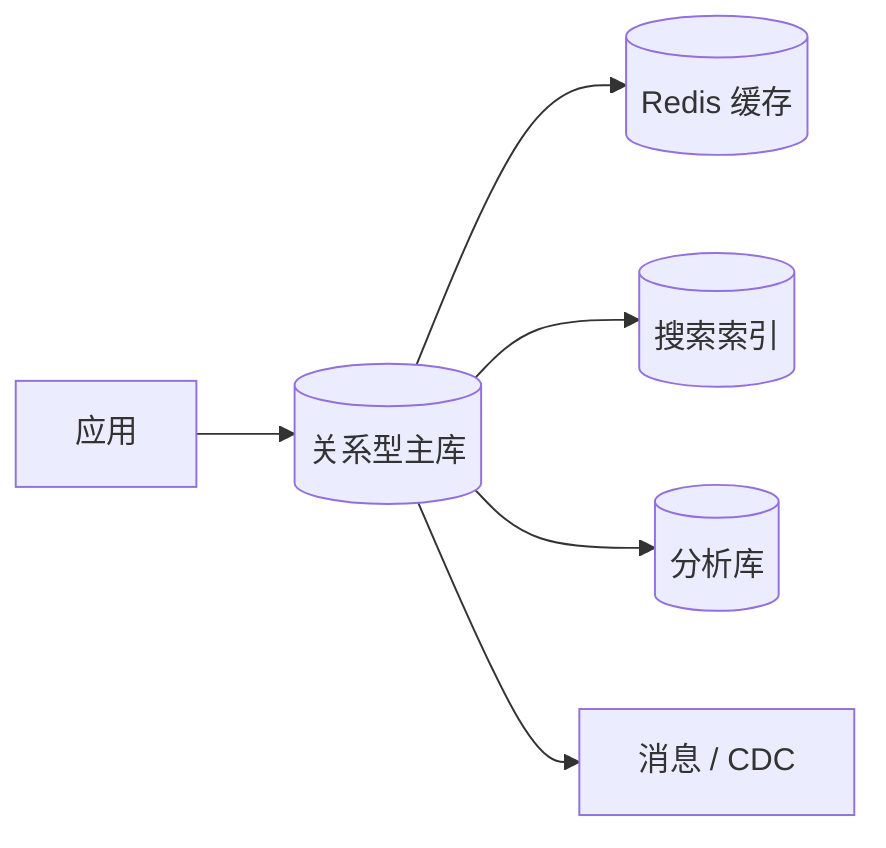
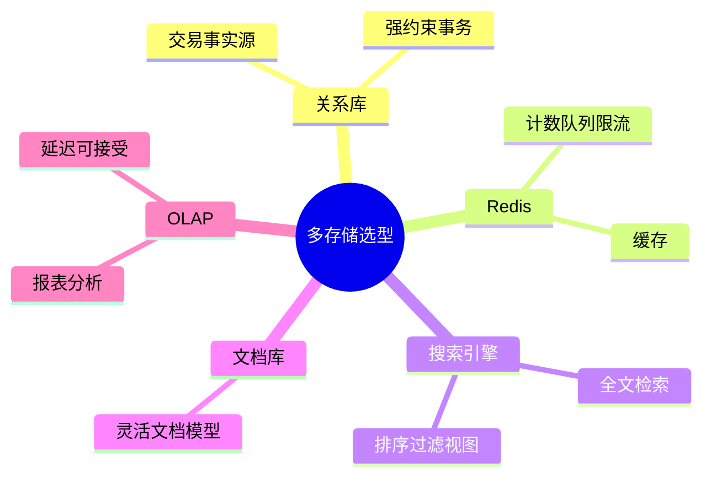
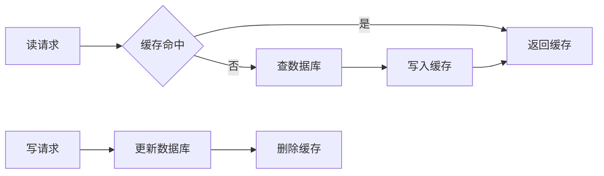
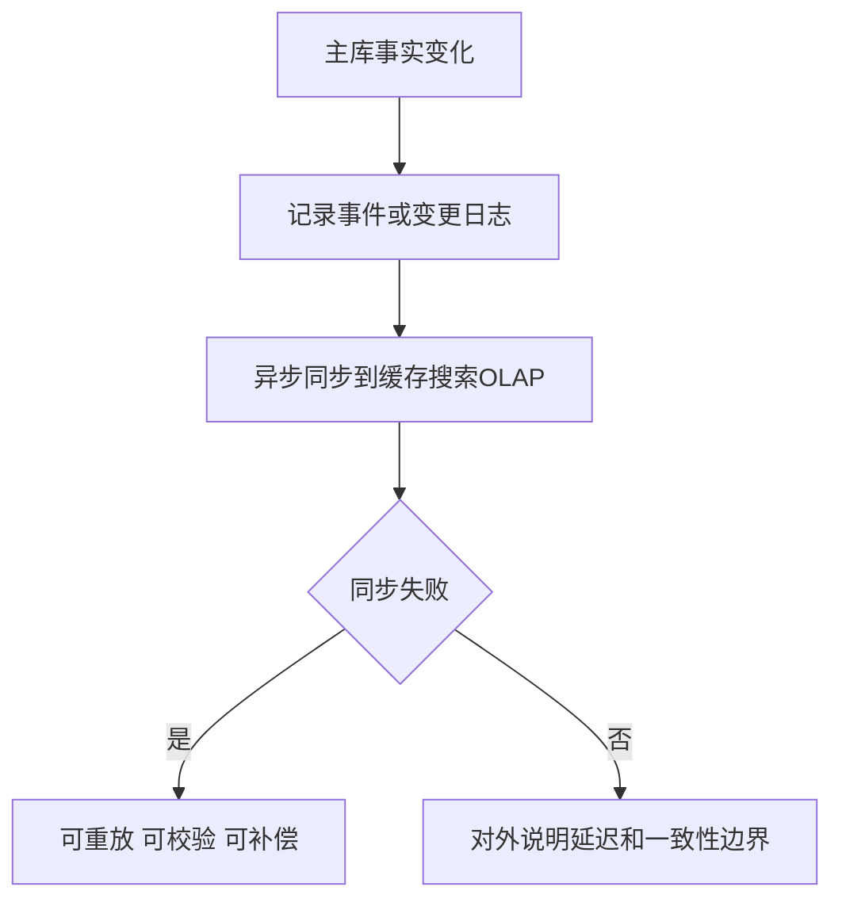

# 09. NoSQL、缓存、搜索与分析型数据库

## 学习目标

本章回答“什么时候不用关系数据库，什么时候不能只用关系数据库”。读完后你应该能：

- 区分文档库、键值库、搜索引擎、图数据库、时序库、分析型数据库。
- 判断 Redis 应该作为缓存还是事实源。
- 理解缓存一致性和失效策略。
- 知道搜索系统和 OLAP 系统为什么通常不是交易事实源。
- 建立选型矩阵。

## 默认主库仍应谨慎选择

很多系统可以用关系数据库作为事实源，再按需要增加派生存储：



核心原则：先明确谁是事实源。缓存、搜索、报表通常是派生视图，不应该随便反向修改主事实。

## 文档数据库

适合：

- 一个文档天然包含完整聚合，例如文章、问卷、配置。
- 字段结构变化快。
- 查询主要围绕文档自身，不频繁跨集合关联。

不适合：

- 复杂事务。
- 强引用完整性。
- 多维 ad-hoc 查询。

设计提醒：文档库中的嵌套不是无限嵌套。文档过大、更新热点集中、数组无限增长都会出问题。

## 键值数据库与 Redis

Redis 常见用途：

- 缓存。
- 分布式锁的辅助组件。
- 计数器。
- 排行榜。
- 会话。
- 限流。
- 简单队列或流。

### Cache-Aside 模式

读取：

1. 先读缓存。
2. 未命中则读数据库。
3. 把结果写入缓存。
4. 返回结果。

写入：

1. 更新数据库。
2. 删除缓存。
3. 下次读取重建缓存。

删除缓存通常比直接更新缓存更安全，因为能避免复杂对象局部更新不一致。

### 缓存常见问题

| 问题 | 含义 | 处理 |
| --- | --- | --- |
| 缓存穿透 | 查询不存在的数据反复打到 DB | 缓存空值、布隆过滤器 |
| 缓存击穿 | 热点 key 过期瞬间大量请求打到 DB | 互斥重建、逻辑过期 |
| 缓存雪崩 | 大量 key 同时过期 | 随机 TTL、分批预热 |
| 缓存不一致 | DB 与缓存短暂不同 | 明确一致性窗口、删除缓存、重试 |

不要把 Redis 当作“更快的数据库”来随意承载核心交易事实，除非你明确设计了持久化、恢复和一致性方案。

## 搜索引擎

搜索引擎适合：

- 全文检索。
- 相关性排序。
- 分词。
- 高亮。
- 日志检索。
- 多字段模糊搜索。

典型架构：

1. 主库写入业务事实。
2. 通过 outbox、消息队列或 CDC 同步到搜索索引。
3. 搜索接口查搜索引擎。
4. 详情页仍可回主库校验权限和最新状态。

注意：搜索索引通常是最终一致。不要用它判断支付状态、库存余量这类强一致事实。

## 图数据库

适合问题：

- “A 和 B 之间是否有路径？”
- “某用户三度关系内有哪些人？”
- “风险账户之间是否形成团伙？”

如果只是用户和角色、订单和商品这种普通多对多，关系库足够。

## 时序数据库

适合：

- 指标监控。
- 设备上报。
- 高频时间序列。
- 按时间窗口聚合。

设计关键：

- 标签基数控制。
- 保留周期。
- 降采样策略。
- 冷热分层。

## 分析型数据库 / OLAP

适合：

- 大规模聚合。
- 报表。
- 用户行为分析。
- 日志分析。

常见特性：

- 列式存储。
- 压缩。
- 向量化执行。
- 分区。
- 物化视图或预聚合。

不要用 OLAP 系统承载强事务写入；也不要让 OLTP 主库长期承担重型报表。

## 组件选型矩阵

| 需求 | 首选 | 说明 |
| --- | --- | --- |
| 订单、支付、库存 | 关系型数据库 | 事务和约束重要 |
| 用户资料缓存 | Redis | 可从主库重建 |
| 商品全文搜索 | 搜索引擎 | 分词和相关性 |
| 行为日志分析 | OLAP / 数据仓库 | 大扫描聚合 |
| 监控指标 | 时序数据库 | 时间窗口查询 |
| 权限和角色 | 关系型数据库 | 关系明确、需要约束 |
| 社交路径探索 | 图数据库 | 多跳关系查询 |
| 灵活配置文档 | 文档数据库或 JSONB | 看查询和约束需求 |

## 引入新存储前的 10 个问题

1. 它是不是事实源？
2. 数据如何从主库同步？
3. 允许多长时间不一致？
4. 失败后如何重放？
5. 如何备份恢复？
6. 如何监控延迟和错误？
7. 谁负责运维？
8. 查询模式是否真的需要它？
9. 能否用现有数据库加索引/物化视图解决？
10. 迁移退出成本是什么？

## 常见误区

### 误区 1：为了性能先上缓存

很多性能问题来自缺索引、查询过大、N+1、错误分页。缓存会掩盖问题，还会增加一致性复杂度。

### 误区 2：搜索引擎替代主库

搜索引擎擅长检索，不擅长交易一致性。搜索结果可以延迟，支付状态不能随便延迟。

### 误区 3：微服务必须每个服务一个数据库

数据库边界应服务于业务边界和团队边界，不是架构口号。拆库会引入分布式事务、数据同步和排查成本。

## 本章练习

1. 为电商系统设计主库、缓存、搜索、分析库的数据流。
2. 说明商品详情缓存更新策略。
3. 判断“订单列表搜索”应该查主库、搜索引擎还是两者结合。
4. 给一个新存储组件写退出方案。

下一章：[[10-迁移版本化与零停机变更]]。

<!-- DB-DEEP-EXPANSION-2026-04-28:START -->
## 深入展开：多存储系统的关键是“谁是事实源”

系统变复杂后，几乎一定会出现多个存储：关系库、Redis、搜索引擎、对象存储、分析库。真正困难的不是引入组件，而是定义数据流和一致性边界。

### 1. 事实源和派生视图

以商品为例：

- 主库商品表是事实源。
- Redis 商品详情是缓存。
- Elasticsearch 商品索引是搜索视图。
- ClickHouse 商品点击数据是分析视图。

当商品下架时，主库状态必须先变。缓存和搜索可能延迟，但下单时必须回主库校验 `active` 和库存。

如果搜索引擎里还查得到下架商品，用户最多看到旧搜索结果；但不能允许下单成功。这就是事实源的意义。

### 2. Redis 缓存不是免费的性能

缓存引入后，多了这些问题：

- 缓存什么时候失效？
- 删除缓存失败怎么办？
- 热点 key 过期怎么办？
- 缓存和数据库不一致时以谁为准？
- Redis 故障时系统如何降级？

Cache-Aside 是常见模式，但它只提供最终一致，不提供强一致。核心交易判断不要只依赖缓存。

### 3. 搜索同步要能重放

主库到搜索引擎的同步常见做法：

- 应用双写。
- outbox 事件。
- CDC 订阅 binlog/WAL。

应用双写最简单，但容易出现主库成功、搜索失败。outbox 更可靠：业务事务里写事件，后台 worker 重试同步。CDC 更通用，但要处理 schema 变化、顺序、重放和监控。

搜索索引要支持全量重建。否则一旦同步 bug 导致索引污染，很难恢复。

### 4. OLAP 数据有延迟，要给业务解释清楚

报表系统常见延迟：实时、分钟级、小时级、T+1。延迟不是缺陷，而是成本和复杂度的取舍。

关键是让使用者知道：

- 数据更新时间。
- 统计口径。
- 是否包含退款/取消。
- 是否和财务口径一致。

很多“数据不准”不是数据库算错，而是口径不清。

### 5. 引入新存储的评审模板

在引入 MongoDB、Redis、Elasticsearch、ClickHouse 前，至少回答：

1. 它解决哪个现有数据库解决不了的问题？
2. 它是不是事实源？
3. 数据如何写入和同步？
4. 允许多长时间不一致？
5. 如何备份、恢复、重建？
6. 如何监控延迟和失败？
7. 团队是否能运维？
8. 如果未来不用了，如何迁出？

这个模板能避免“为了技术潮流引入新数据库”。

### 6. 典型电商数据流

```text
PostgreSQL/MySQL 保存订单事实
  -> outbox/CDC
  -> Elasticsearch 更新商品和订单搜索
  -> ClickHouse 生成运营报表
  -> Redis 缓存热点详情
```

每条链路都有监控：事件积压、同步失败、索引延迟、缓存命中率。多存储系统的可靠性来自可观测和可重放，而不是相信每次同步都成功。
<!-- DB-DEEP-EXPANSION-2026-04-28:END -->

## 思维导图

> 记忆建议：多存储系统的第一原则是分清“事实源”和“派生视图”。

### 1. 多存储定位



### 2. Cache Aside



### 3. 派生视图同步


