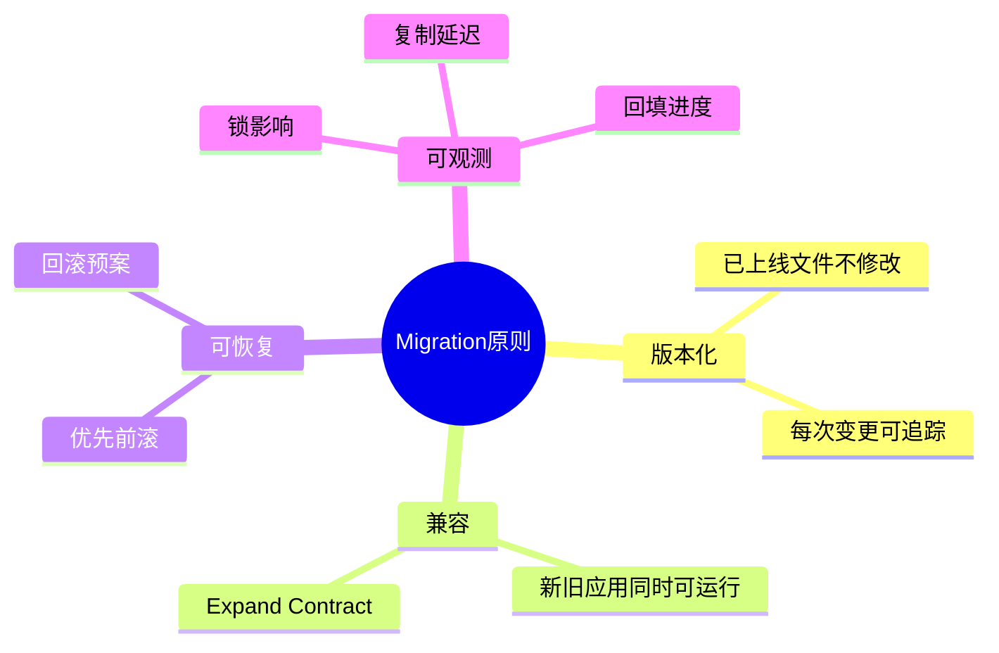
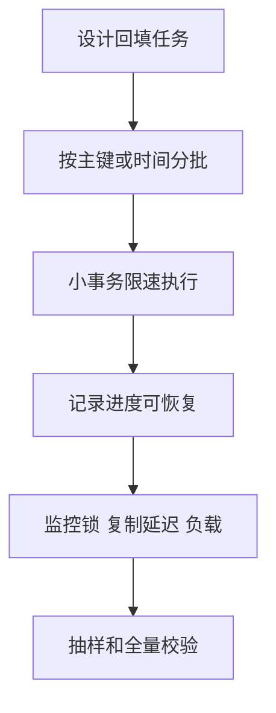

# 10. 迁移、版本化与零停机变更

## 学习目标

本章讲数据库结构如何安全演进。读完后你应该能：

- 理解为什么生产数据库不能手工改。
- 区分 schema migration 和 data migration。
- 使用 expand-contract 做零停机变更。
- 知道大表加索引、加列、回填的风险。
- 写出上线前 migration 检查清单。

## 核心原则

1. **每次结构变化都是 migration**：不要在生产库手工改表。
2. **已部署 migration 不可修改**：要修就新增 migration。
3. **schema 和 data 分开**：DDL 与大批量 DML 不混在一个迁移里。
4. **生产回滚多用前滚**：已经影响数据的变更，通常用新 migration 修复。
5. **按生产数据量测试**：100 行能跑，不代表 1 亿行能跑。

## Migration 文件应该记录什么

至少记录：

- 版本号或时间戳。
- 变更目的。
- up 操作。
- down 操作或不可逆说明。
- 大表风险说明。
- 回填策略。
- 验证 SQL。

示例命名：

```text
202604270001_add_orders_paid_at.sql
202604270002_backfill_orders_paid_at.sql
202604270003_add_orders_paid_at_not_null.sql
```

## 安全加列

### 一般安全

```sql
ALTER TABLE users ADD COLUMN avatar_url TEXT;
```

新增可空列通常风险较低。

### 加 NOT NULL 的安全路径

不要直接对大表做：

```sql
ALTER TABLE users ADD COLUMN role TEXT NOT NULL;
```

更安全路径：

1. 加可空列或带安全默认值的列。
2. 部署应用写入新列。
3. 分批回填历史数据。
4. 验证没有 NULL。
5. 再加 NOT NULL 约束。

```sql
ALTER TABLE users ADD COLUMN role TEXT;

-- 分批回填，示意
UPDATE users
SET role = 'member'
WHERE role IS NULL
  AND id BETWEEN 1 AND 10000;

ALTER TABLE users ALTER COLUMN role SET NOT NULL;
```

## 大表加索引

PostgreSQL 大表应使用：

```sql
CREATE INDEX CONCURRENTLY idx_orders_customer_id
ON orders (customer_id);
```

注意：`CONCURRENTLY` 不能放在普通事务块里，migration 工具需要特殊配置。

MySQL 需要确认对应版本和操作是否支持 online DDL；必要时使用在线变更工具。

## 重命名字段：Expand-Contract

直接 rename 会让旧版本应用崩溃。零停机做法：

### Phase 1：Expand

新增新字段：

```sql
ALTER TABLE users ADD COLUMN display_name TEXT;
```

部署应用：同时写 `username` 和 `display_name`。

### Phase 2：Migrate

分批回填：

```sql
UPDATE users
SET display_name = username
WHERE display_name IS NULL
  AND id BETWEEN 1 AND 10000;
```

部署应用：读新字段，仍双写。

### Phase 3：Contract

确认无旧依赖后：

```sql
ALTER TABLE users DROP COLUMN username;
```

删除旧字段必须晚于应用移除旧字段引用。

## 数据回填

大批量更新不要一条 SQL 更新全表：

```sql
-- 风险：长事务、锁、日志暴涨、复制延迟
UPDATE users SET normalized_email = lower(email);
```

应分批：

```sql
UPDATE users
SET normalized_email = lower(email)
WHERE normalized_email IS NULL
  AND id >= 1 AND id < 10001;
```

工程上用脚本循环批次，并记录进度。每批提交，失败可从断点继续。

## 删除字段

安全删除路径：

1. 先让应用停止读取该字段。
2. 部署应用。
3. 观察一段时间，确认没有 SQL 访问该字段。
4. 再执行 drop column。
5. 保留备份和恢复方案。

对于 ORM 项目，要特别注意自动生成 migration 是否会立刻 drop column。

## 回滚与前滚

数据库变更回滚比代码回滚难，因为数据可能已经改变。

建议：

- 设计向后兼容 migration。
- 应用代码灰度期间兼容旧 schema 和新 schema。
- 数据破坏性变更前做备份。
- 对不可逆 migration 明确标注。
- 失败后优先用新 migration 前滚修复。

## Schema Drift

Schema drift 指不同环境数据库结构不一致。

预防：

- 所有变更走 migration。
- CI 中从空库执行全部 migration。
- 定期比较生产 schema 与 migration 结果。
- 禁止手工热修后不补 migration。

## ORM 与 Migration

ORM 能提高效率，但不要盲信自动生成结果。

检查点：

- 是否会 drop column。
- 是否会重建大表。
- 是否会创建阻塞索引。
- 是否混入大批量数据更新。
- 是否缺少自定义 SQL。

对于 Prisma、Django、TypeORM、Drizzle、Kysely 等工具，核心原则相同：migration 文件是生产变更合同。

## 上线前检查清单

- [ ] migration 在本地和 CI 从空库执行成功。
- [ ] migration 在接近生产数据量的环境测试过。
- [ ] 大表 DDL 的锁风险已确认。
- [ ] 索引创建方式适合生产。
- [ ] schema migration 与 data migration 分离。
- [ ] 回填可分批、可暂停、可恢复。
- [ ] 应用代码兼容迁移前后 schema。
- [ ] 回滚或前滚方案写清楚。
- [ ] 监控项已准备：锁等待、复制延迟、错误率、慢查询。
- [ ] 备份可用且恢复流程明确。

## Migration 模板

````md
# Migration: add xxx

## 目的

为什么需要这次变更。

## 变更

- 新增/修改/删除哪些对象。

## 风险

- 是否大表。
- 是否锁表。
- 是否影响复制延迟。

## 执行步骤

1. 执行 schema migration。
2. 部署兼容代码。
3. 分批回填。
4. 验证。
5. 收缩旧结构。

## 验证 SQL

```sql
SELECT COUNT(*) FROM ... WHERE ...;
```

## 回滚/前滚

失败后如何处理。
````

## 本章练习

1. 把字段 `username` 改名为 `display_name`，写出完整 expand-contract 计划。
2. 给 1 亿行订单表加 `paid_at` 字段，设计迁移和回填。
3. 判断一个 ORM 自动 migration 是否安全。
4. 写一份删除旧字段的上线检查清单。

下一章：[[11-安全备份高可用与运维]]。

<!-- DB-DEEP-EXPANSION-2026-04-28:START -->
## 深入展开：数据库变更的核心是“兼容”和“可恢复”

代码可以快速回滚，数据库不一定能。表结构一旦改了、数据一旦回填了，就可能影响多个版本应用。因此 migration 的核心不是“怎么改表”，而是“如何让变更在生产中安全发生”。

### 1. 为什么不能直接改生产库

手工改生产库的问题：

- 没有审计记录。
- 其他环境无法复现。
- 新同事不知道真实结构。
- 回滚和恢复没有依据。
- 容易和 ORM/migration 历史冲突。

所有变更都应该进入 migration 文件。即使生产紧急修复，也要事后补 migration，避免 schema drift。

### 2. Expand-contract 的核心是多版本应用兼容

生产发布通常不是瞬间完成。灰度、滚动部署期间，新旧应用会同时运行。数据库 schema 必须同时兼容它们。

字段改名不能直接：

```sql
ALTER TABLE users RENAME COLUMN username TO display_name;
```

因为旧应用还在读 `username`。正确做法是新增字段、双写、回填、切读、停止旧写、删除旧字段。

### 3. 大表 DDL 要问锁问题

不同数据库、不同操作锁行为不同。上线前要问：

- 是否扫描全表？
- 是否重写表？
- 是否阻塞读或写？
- 是否生成大量 WAL/binlog？
- 是否影响复制延迟？
- 是否能暂停和恢复？

PostgreSQL 大表索引用 `CREATE INDEX CONCURRENTLY`，MySQL 大表 DDL 要确认 online 行为或使用专门工具。

### 4. Data migration 要和 schema migration 分开

Schema migration 改结构，data migration 改数据。大批量回填放在 schema migration 里很危险，因为它可能长时间持锁，失败后状态复杂。

更安全的方式：

1. migration 新增可空列。
2. 应用开始写新列。
3. 后台任务分批回填。
4. 校验无 NULL。
5. migration 添加 NOT NULL 或约束。

### 5. 回填任务需要进度和校验

回填不是一个 `UPDATE 全表`。应设计进度表：

```text
backfill_jobs(name, last_processed_id, status, updated_at)
```

每批处理固定范围，提交后更新进度。失败后从 last_processed_id 继续。

校验 SQL 示例：

```sql
SELECT COUNT(*)
FROM users
WHERE normalized_email IS NULL;
```

约束添加前必须验证数据已经满足条件。

### 6. 删除永远是最后一步

删除字段、删除表、删除索引都应该晚于代码停止使用。建议流程：

1. 先让应用不再读取。
2. 部署并观察。
3. 用日志或数据库审计确认无访问。
4. 再删除。
5. 保留恢复方案。

很多事故来自“数据库先删，旧代码还在跑”。

### 7. Migration 评审清单

- [ ] 是否兼容当前线上代码？
- [ ] 是否兼容回滚后的旧代码？
- [ ] 是否会锁大表？
- [ ] 是否有数据回填？是否分批？
- [ ] 是否有验证 SQL？
- [ ] 是否有前滚修复方案？
- [ ] 是否影响复制延迟？
- [ ] 是否需要低峰执行？
- [ ] 是否更新了文档和监控？

数据库变更评审应该和代码评审一样严肃，甚至更严肃。
<!-- DB-DEEP-EXPANSION-2026-04-28:END -->

## 思维导图

> 记忆建议：数据库变更的核心是“兼容、可恢复、可观测”；删除永远是最后一步。

### 1. 安全变更原则



### 2. 字段改名 Expand Contract


### 3. 大表回填


