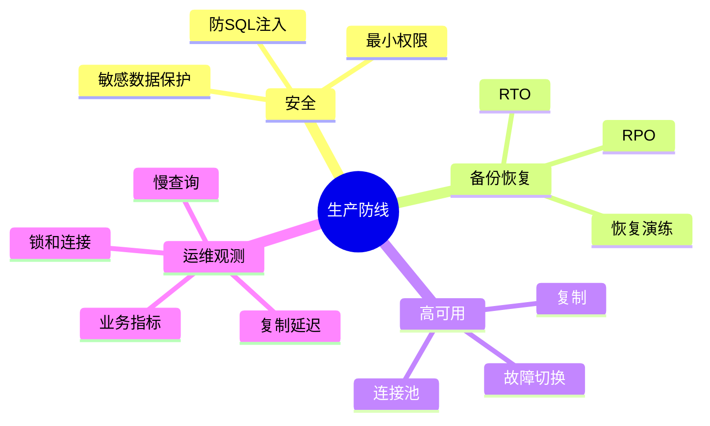
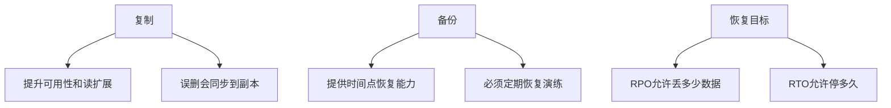

# 11. 安全、备份、高可用与运维

## 学习目标

本章把数据库从“能跑”推进到“能守住生产”。读完后你应该能：

- 设计最小权限模型。
- 防范 SQL 注入和敏感数据泄露。
- 区分备份、复制和高可用。
- 定义 RPO / RTO。
- 建立数据库监控指标和日常维护清单。

## 安全第一原则

数据库里通常存着系统最重要的数据。安全不是上线前最后加的一层，而是建模、权限、查询、运维全过程的约束。

核心原则：

1. 最小权限。
2. 默认拒绝。
3. 凭据不进代码仓库。
4. 所有外部输入参数化。
5. 敏感数据分类处理。
6. 审计关键操作。

## 角色与权限

不要让应用使用超级用户连接数据库。

建议拆分角色：

- `app_user`：应用读写必要业务表。
- `readonly_user`：只读报表或排查。
- `migration_user`：执行 schema migration。
- `admin_user`：极少数管理员使用。

PostgreSQL 示例：

```sql
CREATE ROLE app_user LOGIN PASSWORD 'use-secret-manager';
GRANT USAGE ON SCHEMA app TO app_user;
GRANT SELECT, INSERT, UPDATE, DELETE ON ALL TABLES IN SCHEMA app TO app_user;
```

真实密码应来自密钥管理系统，不要写进 SQL 文件或仓库。

## SQL 注入

错误示例：

```js
const sql = `SELECT * FROM users WHERE email = '${email}'`;
```

正确方向：使用参数化查询。

```js
await db.query('SELECT * FROM users WHERE email = $1', [email]);
```

ORM 也不是绝对免疫。只要拼接原始 SQL，就要重新审视注入风险。

## 敏感数据处理

敏感数据包括：

- 密码。
- 身份证件。
- 手机号、邮箱。
- 支付信息。
- 访问令牌。
- 医疗、财务等高敏数据。

建议：

- 密码只存强哈希，不存明文。
- 令牌只存哈希或加密值。
- 高敏字段加密或脱敏。
- 日志中不打印敏感字段。
- 测试环境不使用未脱敏生产数据。

## 备份不是复制

复制解决的是可用性和读扩展，不等于备份。

如果应用误删数据，删除操作也会复制到从库。你仍然需要可恢复到历史时间点的备份。

备份类型：

| 类型 | 说明 | 优点 | 风险 |
| --- | --- | --- | --- |
| 逻辑备份 | 导出 SQL/数据 | 可读、可迁移 | 大库慢，恢复慢 |
| 物理备份 | 拷贝数据文件 | 恢复快 | 依赖版本和环境 |
| 增量/日志归档 | 保存变更日志 | 支持时间点恢复 | 管理复杂 |
| 快照 | 存储层快照 | 快速 | 需确认一致性 |

## RPO 与 RTO

- **RPO（Recovery Point Objective）**：最多能丢多少数据。
- **RTO（Recovery Time Objective）**：最多能停多久。

例：

- RPO = 5 分钟：最多接受丢 5 分钟数据。
- RTO = 30 分钟：必须在 30 分钟内恢复服务。

没有 RPO/RTO，备份策略就是空谈。

## 恢复演练

备份的价值只在恢复时体现。

恢复演练步骤：

1. 在隔离环境恢复最新备份。
2. 校验 schema 和关键表行数。
3. 抽样校验关键业务数据。
4. 记录恢复耗时。
5. 修正文档和脚本。

至少定期演练一次，重大变更前后也应演练。

## 高可用

高可用常见组件：

- 主从复制。
- 自动故障转移。
- VIP / 代理 / 连接路由。
- 健康检查。
- 复制延迟监控。

注意：高可用不是“永不失败”，而是失败时能快速、可控地恢复。

故障转移要考虑：

- 是否可能双主写入。
- 客户端连接如何切换。
- 未复制日志是否丢失。
- 旧主恢复后如何处理。

## 连接池

数据库连接不是越多越好。过多连接会增加内存和调度成本。

连接池作用：

- 复用连接。
- 限制并发。
- 缓冲短请求。

配置建议：

- 应用实例数 × 每实例连接池大小 不应超过数据库承载能力。
- 长事务和慢查询会占住连接，导致池耗尽。
- 后台任务和 API 服务可使用不同连接池。

## 监控指标

基础指标：

- CPU、内存、磁盘空间、磁盘 I/O。
- 连接数。
- QPS / TPS。
- 慢查询。
- 锁等待。
- 事务时长。
- 复制延迟。
- 缓存命中率。
- 表膨胀或 dead tuples。
- 备份成功/失败。

业务指标：

- 下单成功率。
- 支付状态延迟。
- 库存异常数。
- 数据同步积压。

数据库监控不能只看机器资源，也要看业务正确性。

## 日常维护

- 定期检查慢查询排行。
- 检查未使用或重复索引。
- 检查大表增长趋势。
- 检查备份任务和恢复演练记录。
- 检查长事务。
- 检查权限是否过大。
- 检查 migration 是否全部执行。
- 检查复制延迟和错误日志。

## 事故处理基本流程

1. 先止血：限流、切只读、暂停任务、回滚应用。
2. 保留证据：日志、慢查询、执行计划、监控截图。
3. 缩小范围：是 SQL、锁、连接、磁盘、复制、网络还是应用变更？
4. 恢复服务：前滚修复、恢复备份、切换主库。
5. 复盘：根因、时间线、预防措施、演练补齐。

不要在事故中直接执行破坏性 SQL，除非已经明确备份、影响和回滚方案。

## 本章检查清单

- [ ] 应用没有使用超级用户连接。
- [ ] SQL 使用参数化。
- [ ] 敏感字段不进日志。
- [ ] 备份策略匹配 RPO/RTO。
- [ ] 恢复演练有记录。
- [ ] 复制延迟可观测。
- [ ] 连接池总量受控。
- [ ] 慢查询有告警和排查流程。
- [ ] migration 权限与应用权限分离。
- [ ] 生产数据访问有审计。

## 本章练习

1. 为一个订单系统定义 RPO/RTO。
2. 写一份数据库恢复演练流程。
3. 设计应用用户、只读用户、migration 用户的权限边界。
4. 列出你会为数据库配置的 10 个告警。

下一章：[[12-实战项目从需求到上线]]。

<!-- DB-DEEP-EXPANSION-2026-04-28:START -->
## 深入展开：生产数据库的目标是“可控地失败”

生产数据库不可能永远不出问题。成熟系统追求的是：出问题时能快速发现、限制影响、恢复服务、复盘修复。安全、备份、高可用和监控都是为了这个目标。

### 1. 权限设计要防止“应用变管理员”

应用连接数据库不应该使用超级用户。至少拆分：

- `app_user`：读写业务表。
- `readonly_user`：排查和报表只读。
- `migration_user`：执行结构变更。
- `admin_user`：极少数运维操作。

这样即使应用被攻破，也不至于拥有 drop schema、创建超级用户等权限。

### 2. SQL 注入的本质是代码和数据混在一起

错误写法：

```js
`SELECT * FROM users WHERE email = '${email}'`
```

用户输入变成 SQL 代码的一部分。正确方式是参数化：

```js
db.query('SELECT * FROM users WHERE email = $1', [email])
```

ORM 不能自动拯救所有场景。只要写 raw SQL，就要重新检查参数化。

### 3. 备份必须按恢复目标设计

先定义：

- RPO：最多丢多少数据。
- RTO：最多停多久。

再设计备份频率、日志归档、异地备份、恢复脚本。如果业务要求 RPO 5 分钟，只做每天一次全量备份显然不够。

备份还要覆盖：

- 数据。
- schema。
- 用户权限。
- 扩展和函数。
- 必要配置。
- WAL/binlog。

### 4. 复制不是备份

主从复制会把误删也复制到从库。它解决的是可用性和读扩展，不解决历史恢复。真正的备份要能恢复到某个时间点。

高可用方案要考虑：

- 自动故障转移是否可靠？
- 是否可能双主写入？
- 旧主恢复后如何处理？
- 应用连接如何切换？
- 切换后数据是否丢失？

### 5. 监控要覆盖数据库内部和业务结果

数据库内部指标：

- 慢查询。
- 锁等待。
- 长事务。
- 连接数。
- CPU、内存、磁盘、I/O。
- 复制延迟。
- vacuum 状态。
- 备份任务。

业务指标：

- 下单成功率。
- 支付回调处理延迟。
- 库存异常数。
- 消息积压。
- 搜索同步延迟。

只看机器指标不够。CPU 正常但支付状态卡住，仍然是数据库相关事故。

### 6. 事故第一小时操作原则

1. 先保护核心链路。
2. 暂停批量任务和报表。
3. 找出最重 SQL、锁等待或异常发布。
4. 限流非核心接口。
5. 保留现场证据。
6. 谨慎执行破坏性 SQL。
7. 恢复后复盘并补监控。

不要在事故中“凭感觉优化”。先止血，再定位，再修复。

### 7. 运维成熟度自测

- [ ] 最近一次恢复演练是什么时候？
- [ ] 能否在 30 分钟内找到当前最慢 SQL？
- [ ] 是否知道最大连接数被谁占用？
- [ ] 是否能发现长事务？
- [ ] 是否有数据库变更审批？
- [ ] 是否有误删数据恢复流程？
- [ ] 是否有敏感数据脱敏策略？

如果这些问题答不上来，数据库还处在“能跑但不可控”的阶段。
<!-- DB-DEEP-EXPANSION-2026-04-28:END -->

## 思维导图

> 记忆建议：生产数据库的目标不是永不失败，而是可控地失败、可验证地恢复。

### 1. 生产数据库四道防线



### 2. 备份不是复制



### 3. 事故第一小时


