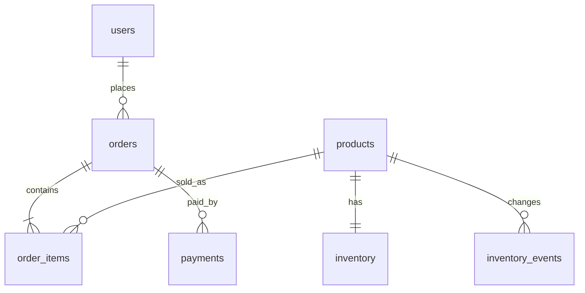
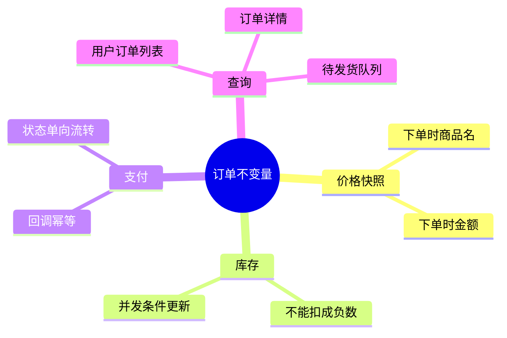
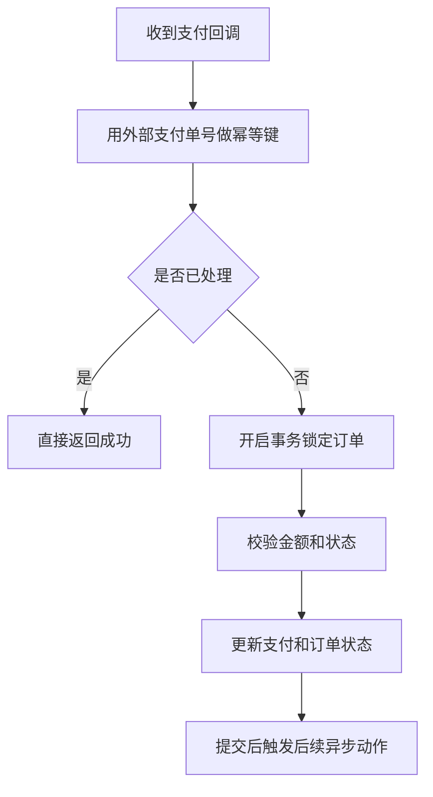

# 12. 实战项目：从需求到上线

## 项目目标

用一个简化订单系统，把前面章节串起来。你将完成：

- 需求拆解。
- ERD 设计。
- 表结构和约束。
- 核心事务。
- 索引设计。
- migration 计划。
- 上线和运维检查。

## 需求

系统支持：

1. 用户注册并登录。
2. 商品上架，商品有 SKU、名称、价格、库存。
3. 用户创建订单，订单包含多个商品。
4. 下单时扣减库存。
5. 支付成功后订单变为 paid。
6. 用户查看订单列表和订单详情。
7. 后台查看待发货订单。
8. 保留价格快照和库存流水。

非目标：优惠券、退款、物流拆单、复杂促销。

## 业务事实

- 用户邮箱唯一。
- 商品 SKU 唯一。
- 库存不能为负。
- 订单创建时保存商品当时价格。
- 一个订单至少有一条明细。
- 支付回调可能重复，需要幂等。
- 库存变化需要流水，方便审计。

## ERD



## 表结构

```sql
CREATE TABLE users (
  id BIGINT GENERATED ALWAYS AS IDENTITY PRIMARY KEY,
  email TEXT NOT NULL UNIQUE,
  name TEXT NOT NULL,
  created_at TIMESTAMPTZ NOT NULL DEFAULT now()
);

CREATE TABLE products (
  id BIGINT GENERATED ALWAYS AS IDENTITY PRIMARY KEY,
  sku TEXT NOT NULL UNIQUE,
  name TEXT NOT NULL,
  price NUMERIC(12, 2) NOT NULL CHECK (price >= 0),
  active BOOLEAN NOT NULL DEFAULT true,
  created_at TIMESTAMPTZ NOT NULL DEFAULT now()
);

CREATE TABLE inventory (
  product_id BIGINT PRIMARY KEY REFERENCES products(id),
  available_quantity INTEGER NOT NULL CHECK (available_quantity >= 0),
  updated_at TIMESTAMPTZ NOT NULL DEFAULT now()
);

CREATE TABLE orders (
  id BIGINT GENERATED ALWAYS AS IDENTITY PRIMARY KEY,
  user_id BIGINT NOT NULL REFERENCES users(id),
  status TEXT NOT NULL CHECK (status IN ('pending', 'paid', 'cancelled', 'shipped')),
  total_amount NUMERIC(12, 2) NOT NULL CHECK (total_amount >= 0),
  created_at TIMESTAMPTZ NOT NULL DEFAULT now(),
  paid_at TIMESTAMPTZ
);

CREATE TABLE order_items (
  id BIGINT GENERATED ALWAYS AS IDENTITY PRIMARY KEY,
  order_id BIGINT NOT NULL REFERENCES orders(id),
  product_id BIGINT NOT NULL REFERENCES products(id),
  quantity INTEGER NOT NULL CHECK (quantity > 0),
  unit_price NUMERIC(12, 2) NOT NULL CHECK (unit_price >= 0),
  product_name_snapshot TEXT NOT NULL,
  UNIQUE (order_id, product_id)
);

CREATE TABLE payments (
  id BIGINT GENERATED ALWAYS AS IDENTITY PRIMARY KEY,
  order_id BIGINT NOT NULL REFERENCES orders(id),
  provider TEXT NOT NULL,
  provider_payment_id TEXT NOT NULL,
  amount NUMERIC(12, 2) NOT NULL CHECK (amount >= 0),
  status TEXT NOT NULL CHECK (status IN ('succeeded', 'failed')),
  payload JSONB NOT NULL DEFAULT '{}'::jsonb,
  created_at TIMESTAMPTZ NOT NULL DEFAULT now(),
  UNIQUE (provider, provider_payment_id)
);

CREATE TABLE inventory_events (
  id BIGINT GENERATED ALWAYS AS IDENTITY PRIMARY KEY,
  product_id BIGINT NOT NULL REFERENCES products(id),
  order_id BIGINT REFERENCES orders(id),
  delta INTEGER NOT NULL,
  reason TEXT NOT NULL CHECK (reason IN ('order_created', 'order_cancelled', 'manual_adjustment')),
  created_at TIMESTAMPTZ NOT NULL DEFAULT now()
);
```

## 索引设计

```sql
-- 用户订单列表
CREATE INDEX idx_orders_user_created
ON orders (user_id, created_at DESC);

-- 后台待发货订单
CREATE INDEX idx_orders_paid_created
ON orders (created_at)
WHERE status = 'paid';

-- 订单明细查询
CREATE INDEX idx_order_items_order_id
ON order_items (order_id);

-- 库存流水
CREATE INDEX idx_inventory_events_product_created
ON inventory_events (product_id, created_at DESC);

-- 支付查询
CREATE INDEX idx_payments_order_id
ON payments (order_id);
```

索引都来自查询模式，而不是因为“字段看起来重要”。

## 创建订单事务

输入：`user_id` 和商品列表 `(product_id, quantity)`。

关键点：

- 读取商品当前价格和名称。
- 条件扣减库存，库存不足时失败。
- 创建订单和明细。
- 写库存流水。
- 所有步骤在一个事务中。

伪 SQL 流程：

```sql
BEGIN;

-- 1. 创建订单，金额先由应用计算后传入，或在数据库中聚合计算
INSERT INTO orders (user_id, status, total_amount)
VALUES (1, 'pending', 120.00)
RETURNING id;

-- 2. 扣库存：条件更新防止负库存
UPDATE inventory
SET available_quantity = available_quantity - 2,
    updated_at = now()
WHERE product_id = 10
  AND available_quantity >= 2
RETURNING available_quantity;

-- 如果没有返回行，ROLLBACK 并提示库存不足

-- 3. 写订单明细，保存价格和商品名快照
INSERT INTO order_items (order_id, product_id, quantity, unit_price, product_name_snapshot)
SELECT 1001, id, 2, price, name
FROM products
WHERE id = 10 AND active = true;

-- 4. 写库存流水
INSERT INTO inventory_events (product_id, order_id, delta, reason)
VALUES (10, 1001, -2, 'order_created');

COMMIT;
```

真实系统中多商品订单要统一排序 product_id 后扣库存，降低死锁概率。

## 支付回调事务

支付回调可能重复。使用唯一约束保证幂等：

```sql
BEGIN;

INSERT INTO payments (order_id, provider, provider_payment_id, amount, status, payload)
VALUES (1001, 'demo_pay', 'pay_abc', 120.00, 'succeeded', '{}'::jsonb)
ON CONFLICT (provider, provider_payment_id)
DO NOTHING;

UPDATE orders
SET status = 'paid', paid_at = now()
WHERE id = 1001
  AND status = 'pending';

COMMIT;
```

应用层还要检查支付金额是否等于订单金额。

## 查询示例

### 用户订单列表

```sql
SELECT id, status, total_amount, created_at, paid_at
FROM orders
WHERE user_id = 1
ORDER BY created_at DESC
LIMIT 20;
```

### 订单详情

```sql
SELECT
  o.id,
  o.status,
  o.total_amount,
  oi.product_id,
  oi.product_name_snapshot,
  oi.quantity,
  oi.unit_price
FROM orders o
JOIN order_items oi ON oi.order_id = o.id
WHERE o.id = 1001
  AND o.user_id = 1;
```

### 待发货订单

```sql
SELECT id, user_id, total_amount, paid_at
FROM orders
WHERE status = 'paid'
ORDER BY created_at
LIMIT 100;
```

## Migration 计划

### 初始版本

```text
001_create_users_products_inventory.sql
002_create_orders_order_items.sql
003_create_payments_inventory_events.sql
004_add_indexes.sql
```

### 未来需求：增加订单取消原因

安全路径：

1. 新增可空字段 `cancel_reason`。
2. 应用写入取消原因。
3. 如需强制，回填历史数据。
4. 再添加约束。

```sql
ALTER TABLE orders ADD COLUMN cancel_reason TEXT;
```

不要在高峰期直接做大表复杂变更。

## 上线检查

- [ ] 所有 migration 从空库执行成功。
- [ ] 创建订单事务有并发测试。
- [ ] 库存不足返回明确错误。
- [ ] 支付回调重复投递不会重复入账。
- [ ] 用户只能查看自己的订单。
- [ ] 订单列表查询命中索引。
- [ ] 待发货查询命中部分索引。
- [ ] 备份策略覆盖订单和支付数据。
- [ ] 慢查询、锁等待、连接数有监控。
- [ ] 关键 SQL 有超时保护。

## 扩展问题

当系统变复杂后，可以继续引入：

- 购物车表。
- 优惠券和促销规则。
- 退款表。
- 物流单和发货批次。
- outbox 事件表，用于异步通知和搜索同步。
- 订单状态流水。
- 库存预占和释放机制。

扩展时保持原则：先明确事实，再决定表结构；先保证正确，再优化性能。

## 本章练习

1. 给多商品创建订单写出完整事务伪代码。
2. 设计订单取消并恢复库存的事务。
3. 给支付表增加退款记录，判断是新表还是扩展 payments。
4. 用 `EXPLAIN` 验证订单列表查询是否使用索引。

下一章：[[99-术语表与复习题]]。

<!-- DB-DEEP-EXPANSION-2026-04-28:START -->
## 深入展开：订单系统从“能用”到“可靠”的完整推演

订单系统是数据库能力的综合考题，因为它同时涉及建模、事务、索引、幂等、状态机、迁移、备份和审计。

### 1. 先定义状态机

订单不是随便改状态。应该定义允许的状态流转：

```text
pending -> paid -> shipped
pending -> cancelled
paid -> refunded
```

不允许：

```text
cancelled -> paid
shipped -> pending
```

状态流转可以在应用层控制，也可以用状态事件表审计：

```sql
CREATE TABLE order_status_events (
  id BIGINT GENERATED ALWAYS AS IDENTITY PRIMARY KEY,
  order_id BIGINT NOT NULL REFERENCES orders(id),
  from_status TEXT,
  to_status TEXT NOT NULL,
  reason TEXT,
  created_at TIMESTAMPTZ NOT NULL DEFAULT now()
);
```

当前状态用于快速查询，事件表用于审计和排查。

### 2. 创建订单要同时处理价格、库存和明细

创建订单时不能只保存商品 ID。要保存下单时价格和名称快照，否则商品改价会影响历史订单。

多商品扣库存要注意：

- 先按 product_id 排序，降低死锁。
- 每个商品用条件更新防止负库存。
- 任何一个商品库存不足，整个事务回滚。
- 写库存流水，便于审计。

伪流程：

```text
BEGIN
  创建订单 pending
  对商品按 product_id 排序
  对每个商品条件扣库存
  插入订单明细快照
  写库存流水
COMMIT
```

### 3. 支付回调必须幂等

支付平台回调可能重复，也可能乱序。系统必须用唯一键去重：

```sql
UNIQUE (provider, provider_payment_id)
```

订单状态更新要带条件：

```sql
UPDATE orders
SET status = 'paid', paid_at = now()
WHERE id = $1 AND status = 'pending';
```

如果订单已支付，重复回调不应再次触发发货或加积分。

### 4. 查询和索引从页面出发

用户订单列表：

```sql
WHERE user_id = ? ORDER BY created_at DESC LIMIT 20
```

索引：

```sql
CREATE INDEX idx_orders_user_created
ON orders(user_id, created_at DESC);
```

后台待发货：

```sql
WHERE status = 'paid' ORDER BY paid_at LIMIT 100
```

如果 paid 且未发货只是少数，可以用部分索引或单独状态。

订单详情查明细，`order_items(order_id)` 必须有索引。

### 5. 退款扩展怎么做

不要直接把订单金额改小。退款是新事件，应建退款表：

```sql
CREATE TABLE refunds (
  id BIGINT GENERATED ALWAYS AS IDENTITY PRIMARY KEY,
  order_id BIGINT NOT NULL REFERENCES orders(id),
  payment_id BIGINT NOT NULL REFERENCES payments(id),
  amount NUMERIC(12,2) NOT NULL CHECK (amount > 0),
  status TEXT NOT NULL CHECK (status IN ('pending', 'succeeded', 'failed')),
  provider_refund_id TEXT,
  created_at TIMESTAMPTZ NOT NULL DEFAULT now()
);
```

订单原始金额保持不变，退款通过退款流水表达。财务系统最怕历史事实被覆盖。

### 6. 上线前要做的并发测试

至少测试：

- 100 个请求同时购买最后 10 件商品，最终库存不为负，成功订单不超过 10。
- 支付回调重复 10 次，只产生一条支付事件，只触发一次状态流转。
- 创建订单中途失败，订单、明细、库存没有半截数据。
- 多商品订单并发不会频繁死锁；即使死锁，重试后结果正确。

这些测试比单纯 CRUD 测试重要得多。

### 7. 生产观测指标

- 创建订单成功率。
- 库存扣减失败率。
- 支付回调重复率。
- pending 订单超时数量。
- 发货队列积压。
- 支付金额与订单金额不一致数量。
- 库存流水与库存快照不一致数量。

订单系统要监控业务不变量，而不是只监控数据库 CPU。
<!-- DB-DEEP-EXPANSION-2026-04-28:END -->

## 思维导图

> 记忆建议：订单系统要先定义状态机，再围绕价格、库存、支付幂等和查询索引做设计。

### 1. 从需求到上线


### 2. 订单关键不变量



### 3. 支付回调事务


