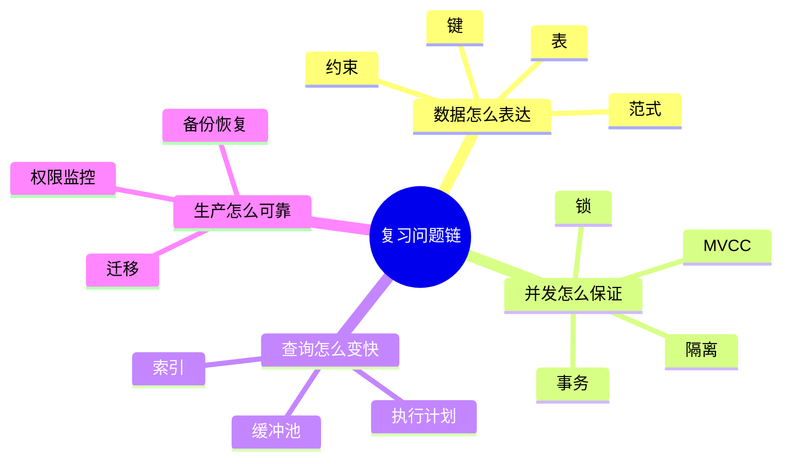
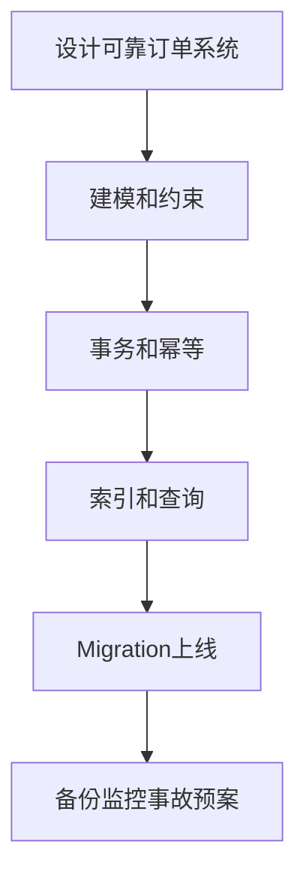

# 99. 术语表与复习题

## 核心术语

| 术语 | 解释 |
| --- | --- |
| DBMS | 数据库管理系统，负责存储、查询、事务、安全、恢复等。 |
| Schema | 数据库对象的命名空间，也常泛指结构定义。 |
| Table | 关系数据库中的表，存放同类事实。 |
| Row | 表中的一行记录。 |
| Column | 表中的字段。 |
| Primary Key | 主键，唯一标识一行。 |
| Foreign Key | 外键，保证引用关系存在。 |
| Unique Constraint | 唯一约束，保证字段或字段组合不重复。 |
| Check Constraint | 检查约束，保证字段满足表达式。 |
| Index | 辅助数据结构，用空间和写入成本换查询速度。 |
| B-tree | 常见有序索引结构，支持等值和范围查询。 |
| GIN | PostgreSQL 中常用于 JSONB、数组、全文搜索的索引。 |
| BRIN | 适合大型有序数据块摘要的索引，例如时间序列表。 |
| Transaction | 事务，一组原子提交或回滚的操作。 |
| ACID | 原子性、一致性、隔离性、持久性。 |
| MVCC | 多版本并发控制，用多个数据版本提升读写并发。 |
| WAL | 预写日志，数据页刷盘前先记录日志。 |
| Checkpoint | 检查点，用于缩短崩溃恢复需要重放的日志范围。 |
| Deadlock | 死锁，事务互相等待对方持有的锁。 |
| Isolation Level | 隔离级别，定义并发事务彼此可见性。 |
| OLTP | 联机事务处理，面向高并发小事务。 |
| OLAP | 联机分析处理，面向大规模分析查询。 |
| Migration | 数据库结构或数据变更脚本。 |
| Expand-Contract | 零停机变更模式：扩展、迁移、收缩。 |
| RPO | 恢复点目标，最多可接受丢多少数据。 |
| RTO | 恢复时间目标，最多可接受停多久。 |
| CDC | 变更数据捕获，用于同步数据库变更。 |
| RLS | 行级安全，按行控制访问权限。 |

## 章节复习题

### 00. 学习路线

1. 为什么数据库学习不能只学 SQL 语法？
2. “会使用、会设计、会诊断、会上生产”分别意味着什么？
3. 你当前最薄弱的是哪一层？

### 01. 基础与分类

1. 数据库和 DBMS 的区别是什么？
2. OLTP 和 OLAP 的核心差异是什么？
3. 为什么搜索引擎通常不应该作为订单事实源？
4. 引入新数据库组件前应该问哪几个问题？

### 02. SQL 核心

1. SELECT 的逻辑执行顺序是什么？
2. `WHERE` 和 `HAVING` 的区别是什么？
3. `LEFT JOIN` 为什么可能被 `WHERE` 条件破坏？
4. NULL 为什么不能用 `= NULL` 判断？

### 03. 建模与范式

1. 一对多和多对多分别如何落表？
2. 订单明细为什么要保存下单时价格？
3. 什么情况下可以反范式？
4. 软删除会带来哪些成本？

### 04. 事务与并发

1. ACID 分别是什么？
2. 丢失更新如何发生？
3. 乐观锁和悲观锁分别适合什么场景？
4. 为什么事务里不应该等待外部 HTTP 调用？

### 05. 索引与优化

1. 索引的成本是什么？
2. 组合索引为什么通常等值列在前、范围列在后？
3. 部分索引适合什么场景？
4. OFFSET 分页为什么越往后越慢？

### 06. 存储与恢复

1. WAL 解决什么问题？
2. 缓冲池如何影响性能？
3. 行存和列存分别适合什么工作负载？
4. 长事务为什么会影响 MVCC 清理？

### 07. PostgreSQL

1. PostgreSQL 中为什么普通文本可优先用 `TEXT`？
2. JSONB 适合什么，不适合什么？
3. `FOR UPDATE SKIP LOCKED` 能解决什么问题？
4. RLS 和应用层鉴权是什么关系？

### 08. MySQL

1. InnoDB 聚簇索引如何影响主键选择？
2. 为什么要使用 `utf8mb4`？
3. MySQL 大表 DDL 前要确认什么？
4. 读写分离为什么可能读不到刚写入的数据？

### 09. NoSQL 与派生存储

1. 缓存、搜索索引、分析库和主库的关系是什么？
2. Cache-Aside 模式读写流程是什么？
3. 缓存穿透、击穿、雪崩分别是什么？
4. 什么情况下图数据库比关系库更合适？

### 10. Migration

1. 为什么已部署 migration 不能修改？
2. Expand-Contract 三个阶段分别做什么？
3. 为什么 schema migration 和 data migration 要分开？
4. 大表加索引有哪些风险？

### 11. 安全与运维

1. 为什么应用不应使用数据库超级用户？
2. 备份和复制有什么区别？
3. RPO/RTO 分别是什么？
4. 数据库监控应该覆盖哪些指标？

### 12. 实战项目

1. 创建订单为什么要在事务中扣库存？
2. 支付回调如何做到幂等？
3. 订单列表需要什么索引？
4. 如果要支持退款，应该如何扩展模型？

## 综合实战任务

选择一个系统并完成数据库设计：

- 博客系统。
- 在线课程系统。
- 电商订单系统。
- 任务协作系统。
- 资产库存系统。

交付物：

1. 需求摘要。
2. ERD。
3. 表结构 SQL。
4. 关键约束说明。
5. 3 条核心查询。
6. 索引设计。
7. 创建/更新核心数据的事务边界。
8. migration 上线计划。
9. 备份和权限方案。
10. 可能的扩展方向。

## 学完后的能力检查

如果你能独立完成下面这些事，说明这套教程的主要目标已经达成：

- [ ] 为一个中小型业务设计关系模型。
- [ ] 写出带 JOIN、聚合、窗口函数的 SQL。
- [ ] 用约束保护数据质量。
- [ ] 为高频查询设计索引。
- [ ] 解释事务隔离和常见并发异常。
- [ ] 看懂基础执行计划。
- [ ] 设计安全 migration。
- [ ] 解释缓存和搜索索引的一致性边界。
- [ ] 制定备份恢复策略。
- [ ] 从需求到上线完成一次数据库方案。

返回入口：[[知识库/数据库/数据库原理/README|数据库系统性教程]]。

<!-- DB-DEEP-EXPANSION-2026-04-28:START -->
## 深入展开：如何用术语表做主动复习

术语表不是背单词用的。数据库术语之间有关系，理解关系比记住翻译重要。

### 1. 按问题链复习

例如看到 **事务**，不要只背 ACID。要继续追问：

```text
事务解决什么失败？
隔离性靠什么实现？
MVCC 和锁是什么关系？
隔离级别如何影响并发异常？
死锁如何处理？
事务里为什么不能调外部接口？
```

如果能从一个词扩展出一串机制和场景，才说明理解深入。

### 2. 按事故链复习

数据库知识最终要能解释事故：

- 库存为负：条件更新缺失、事务边界错误、幂等缺失。
- 查询突然变慢：统计信息变化、索引失效、数据量增长、锁等待。
- 删除后无法恢复：备份没有演练、没有时间点恢复。
- 租户数据泄露：查询漏 tenant_id、权限过宽、RLS 缺失或配置错。
- migration 失败：历史 migration 被修改、大表 DDL 锁表、回填长事务。

每个术语都要能连接到一个具体风险。

### 3. 面试回答的三层结构

回答数据库问题时，可以用三层：

1. **定义**：这个概念是什么。
2. **机制**：它怎么工作。
3. **场景**：它在什么情况下出问题或发挥作用。

例如问“索引是什么”：

- 定义：辅助数据结构。
- 机制：减少扫描范围，常见 B-tree 支持等值和范围。
- 场景：订单列表按 user_id + created_at 查询；代价是写入维护成本。

这样比只说“索引能加快查询”深入得多。

### 4. 建议新增自己的错题区

在本文件末尾继续追加：

```md
## 我的数据库错题

### 题目

### 我原来的错误理解

### 正确解释

### 以后遇到类似问题怎么判断
```

数据库学习很适合错题本，因为很多坑都是模式化的：NULL、LEFT JOIN、索引列顺序、事务外部副作用、缓存一致性。

### 5. 最终自测：能否设计一个可靠订单系统

如果你能不看答案完成下面任务，就说明这套数据库知识已经连起来了：

1. 画订单系统 ERD。
2. 写核心建表 SQL。
3. 设计创建订单事务。
4. 设计支付幂等。
5. 给订单列表、订单详情、待发货列表设计索引。
6. 写字段改名 migration 计划。
7. 定义备份 RPO/RTO。
8. 说明 Redis、搜索引擎、分析库分别如何接入。

如果卡住，就回到对应章节补齐。
<!-- DB-DEEP-EXPANSION-2026-04-28:END -->

## 思维导图

> 记忆建议：用术语表主动复习，不要只认词；每个术语都要能说出问题、机制、代价和证据。

### 1. 主动复习四问


### 2. 按问题链复习



### 3. 最终自测闭环


