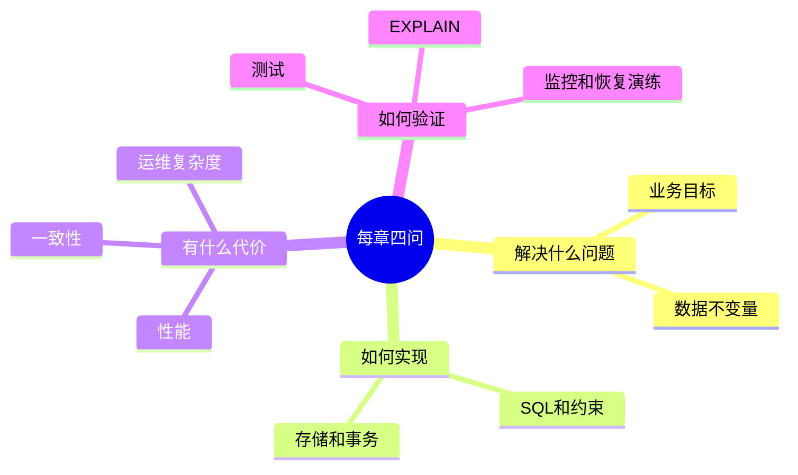

# 数据库系统性教程

这是一套面向工程实践的数据库系统教程。它不是只讲 SQL 语法，也不是只讲某一个产品，而是按“从模型到生产”的顺序，把数据库知识串成一条可复用的学习路线：

1. 先理解数据库在系统中的职责。
2. 再掌握关系模型、SQL、建模、事务、索引。
3. 然后进入 PostgreSQL / MySQL / NoSQL / 缓存 / 搜索 / 分析型数据库的工程选择。
4. 最后补齐迁移、安全、备份、高可用、监控与实战项目。

> 默认示例偏向 PostgreSQL，因为它概念完整、工程能力强；涉及 MySQL 或其他数据库时会单独指出差异。

## 目录

- [[知识库/数据库/数据库原理/00-学习路线与知识地图]]：完整学习路径、知识地图、实验环境建议。
- [[01-数据库基础与分类]]：DBMS 职责、OLTP/OLAP、数据库类型、系统架构。
- [[02-关系模型与SQL核心]]：关系代数、SQL 查询、连接、聚合、窗口函数、约束。
- [[03-数据建模与范式]]：从业务需求到 ERD、范式、反范式、常见建模模式。
- [[04-事务并发与隔离级别]]：ACID、隔离级别、MVCC、锁、死锁、幂等。
- [[05-索引原理与查询优化]]：B-tree、组合索引、部分索引、覆盖索引、EXPLAIN。
- [[06-存储引擎日志与恢复]]：页、缓冲池、WAL/Redo/Undo、检查点、恢复、复制。
- [[07-PostgreSQL实践指南]]：PostgreSQL 类型、索引、RLS、队列、全文搜索、运维。
- [[08-MySQL关键差异]]：InnoDB、锁、字符集、DDL、复制、与 PostgreSQL 的差异。
- [[09-NoSQL缓存搜索与分析型数据库]]：Redis、文档库、搜索引擎、图数据库、OLAP。
- [[10-迁移版本化与零停机变更]]：迁移原则、expand-contract、回填、回滚、CI。
- [[11-安全备份高可用与运维]]：权限、SQL 注入、备份恢复、RPO/RTO、连接池、监控。
- [[12-实战项目从需求到上线]]：以订单系统为例，从需求、模型、SQL、索引到上线。
- [[99-术语表与复习题]]：核心术语、章节复习题、学习检查清单。
- [[数据库面试50问]]：模拟面试官提出 50 个数据库问题，并逐一给出参考回答。

## 推荐阅读顺序

### 初学者路径

`00 -> 01 -> 02 -> 03 -> 04 -> 05 -> 12 -> 99`

目标是能独立设计中小型业务表结构、写出可靠 SQL、知道事务和索引为什么重要。

### 后端工程路径

`00 -> 02 -> 03 -> 04 -> 05 -> 07 -> 10 -> 11 -> 12`

目标是能把数据库变更安全地带到生产环境，能诊断慢查询、设计迁移和备份方案。

### 架构与选型路径

`01 -> 06 -> 08 -> 09 -> 10 -> 11 -> 12`

目标是理解不同数据库形态的边界，避免“所有问题都塞进一个数据库”或“为潮流引入错误组件”。

## Obsidian 使用提示

- 本文件可作为数据库知识库的 MOC（Map of Content）入口。
- 所有章节使用 Obsidian 双向链接互相连接，文件名即笔记名。
- Mermaid 图表使用标准 fenced code block：` ```mermaid `，可在 Obsidian 阅读视图渲染。
- 每篇笔记都包含 YAML frontmatter，便于 Properties、Dataview 或标签检索。

## 如何使用这套笔记

- 每章先读“学习目标”和“核心结论”，再看例子。
- 把 SQL 示例复制到本地 PostgreSQL 或 MySQL 中验证。
- 遇到“常见误区”时，对照自己做过的项目找相似问题。
- 学完一章后到 [[99-术语表与复习题]] 做自测。

## 本教程的写作约束

- 以工程可操作性为主，不追求数据库论文级完整性。
- 示例默认不包含真实敏感数据。
- 重要实践吸收了数据库迁移、PostgreSQL 模式、知识库组织和技术教程写作的相关技能要求：结构化索引、章节化、可复习、可落地。

<!-- DB-DEEP-EXPANSION-2026-04-28:START -->
## 深入阅读说明：这套笔记应该怎么学

如果你觉得前面的章节“能看懂字，但不知道怎么用”，不要从头到尾机械阅读。数据库知识最容易卡在两个地方：一是概念太抽象，二是每个概念都和生产事故有关，但初学者还没见过事故。建议按下面方式使用这套笔记。

### 1. 每章都按“四问法”阅读

读每一章时，不要只问“定义是什么”，而要连续问四个问题：

1. **它解决什么问题？** 例如索引解决的是“如何少读数据页”，不是“让 SQL 神奇变快”。
2. **它靠什么机制解决？** 例如事务靠日志、锁、MVCC、隔离级别共同工作。
3. **它有什么代价？** 例如索引会拖慢写入，缓存会引入一致性问题。
4. **生产中怎么落地？** 例如大表加索引要用并发/在线方式，并配合监控。

只背定义会在面试中显得浅；能说出机制、代价和落地，才像真的理解。

### 2. 建议做一个贯穿练习库

建议你本地建一个 `db_tutorial` 数据库，把 `customers`、`products`、`orders`、`order_items`、`inventory` 这些表真的建出来。每学一章，就在同一套表上继续练。

最小练习顺序：

```text
建表 -> 插入样例数据 -> 写查询 -> 加约束 -> 开事务 -> 加索引 -> 看执行计划 -> 写 migration -> 设计备份恢复
```

数据库学习不能只看文字。SQL、索引和事务都需要实际执行，才能看到错误、执行计划和锁等待。

### 3. 章节之间的关系

- [[02-关系模型与SQL核心]] 让你会表达数据问题。
- [[03-数据建模与范式]] 让你知道表该怎么设计。
- [[04-事务并发与隔离级别]] 让你知道多人同时写时如何不出错。
- [[05-索引原理与查询优化]] 让你知道为什么慢、怎么查、怎么改。
- [[10-迁移版本化与零停机变更]] 和 [[11-安全备份高可用与运维]] 让你知道怎么把数据库变更带到生产。

如果你只学 SQL，不学事务和迁移，最多能写查询；如果你能把这几章串起来，才具备后端工程中的数据库能力。

### 4. 最小掌握标准

学完后至少应该能独立完成：

- 为一个订单系统画出 ERD。
- 写出建表 SQL，包括主键、外键、唯一约束、检查约束。
- 写出 5 条核心查询，并说明需要哪些索引。
- 解释一个扣库存事务如何防止并发超卖。
- 给大表新增字段，写出零停机迁移步骤。
- 说明备份、复制、RPO、RTO 的区别。

如果这些做不到，说明还停留在“看过概念”，没有进入“能用数据库设计系统”的阶段。
<!-- DB-DEEP-EXPANSION-2026-04-28:END -->

## 思维导图

> 记忆建议：把这套数据库笔记当成一条“从会写 SQL 到能安全上生产”的工程路线，而不是零散知识点。

### 1. 推荐阅读路径


### 2. 四问法


