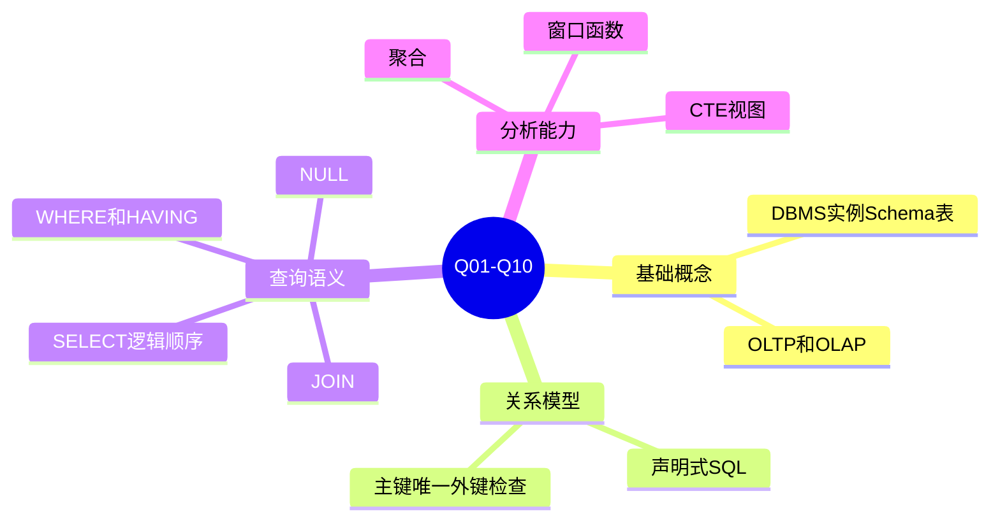
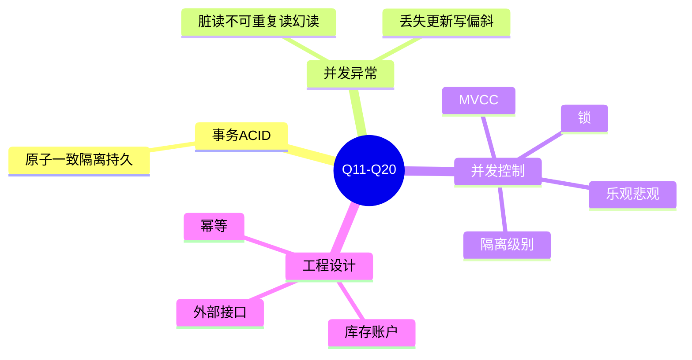
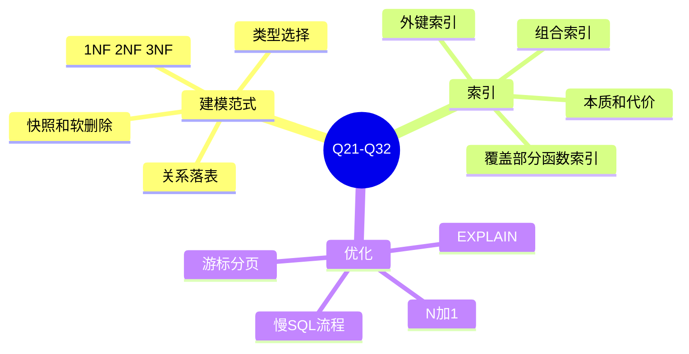
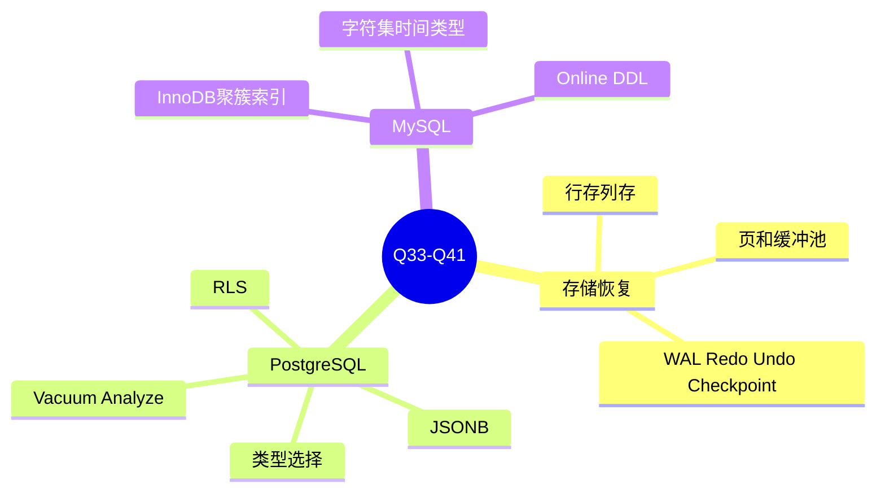
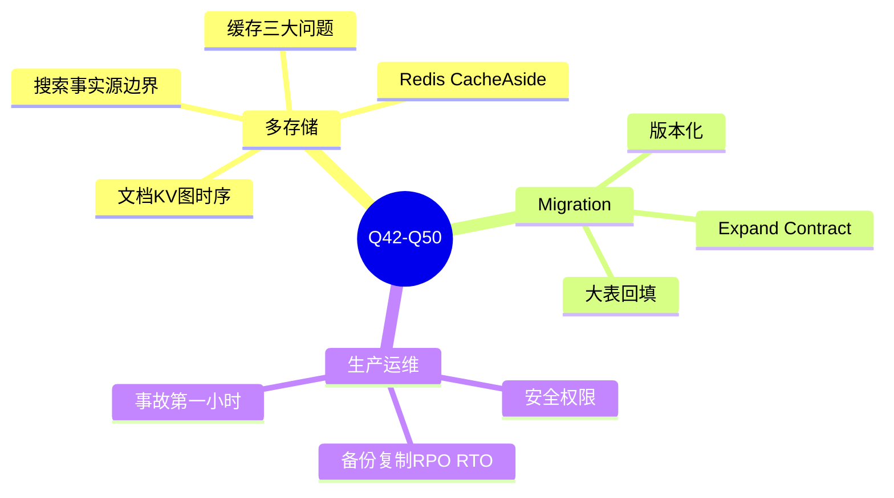

# 数据库面试50问

这份笔记模拟面试官视角：先给出 50 个数据库相关问题，再逐一给出更深入的参考回答。问题覆盖基础概念、SQL、建模、事务、索引、存储引擎、PostgreSQL、MySQL、NoSQL、缓存、迁移、安全与运维。

关联教程入口：[[知识库/数据库/数据库原理/README|数据库系统性教程]]

## 一、面试官先提出50个问题

### A. 数据库基础与 SQL

1. 数据库、DBMS、数据库实例、schema、表分别是什么？
2. OLTP 和 OLAP 有什么区别？为什么不能把所有报表都压在业务主库上？
3. 关系模型的核心思想是什么？SQL 为什么是声明式语言？
4. 主键、唯一约束、外键、检查约束分别解决什么问题？
5. `SELECT` 语句的逻辑执行顺序是什么？
6. `WHERE` 和 `HAVING` 有什么区别？
7. `INNER JOIN`、`LEFT JOIN`、`RIGHT JOIN` 的区别是什么？`LEFT JOIN` 常见坑是什么？
8. SQL 中 `NULL` 的语义是什么？为什么不能用 `= NULL` 判断？
9. 聚合函数和窗口函数有什么区别？各适合什么场景？
10. CTE、子查询、视图有什么区别？CTE 一定会提升性能吗？

### B. 事务、并发与一致性

11. 什么是事务？ACID 分别代表什么？
12. 脏读、不可重复读、幻读、丢失更新分别是什么？
13. Read Committed、Repeatable Read、Serializable 的核心差异是什么？
14. MVCC 是什么？它解决了什么问题，又带来什么成本？
15. 数据库锁有哪些常见类型？`SELECT ... FOR UPDATE` 用在什么场景？
16. 死锁是怎么产生的？如何降低死锁概率？
17. 乐观锁和悲观锁有什么区别？分别适合什么业务？
18. 如何防止库存扣成负数或账户余额被并发写坏？
19. 为什么不建议在数据库事务中调用外部 HTTP 接口？
20. 什么是幂等性？支付回调或消息消费如何实现幂等？

### C. 数据建模与范式

21. 第一范式、第二范式、第三范式分别解决什么问题？
22. 一对一、一对多、多对多关系分别如何落表？
23. 为什么订单明细要保存下单时商品价格和商品名称快照？
24. 软删除有什么优点和代价？什么时候不应该默认使用软删除？
25. 金额、时间、状态、JSON 扩展字段应该如何选择数据库类型？

### D. 索引与查询优化

26. 索引的本质是什么？为什么索引不是越多越好？
27. 组合索引的列顺序如何设计？为什么常说“等值在前，范围在后”？
28. 覆盖索引、部分索引、函数索引分别是什么？
29. 外键列为什么通常也需要建索引？
30. 如何阅读 `EXPLAIN` / `EXPLAIN ANALYZE` 的结果？
31. 面对一个慢 SQL，你会按什么步骤排查？
32. OFFSET 分页为什么越往后越慢？游标分页如何设计？

### E. 存储引擎与恢复

33. 数据库中的页、缓冲池、脏页大致是什么？
34. WAL / Redo Log / Undo Log / Checkpoint 分别解决什么问题？
35. 行存和列存有什么区别？分别适合什么场景？

### F. PostgreSQL 与 MySQL

36. PostgreSQL 中常见的数据类型选择有哪些建议？
37. PostgreSQL 的 JSONB 适合什么，不适合什么？
38. PostgreSQL 的 RLS 是什么？和应用层鉴权是什么关系？
39. PostgreSQL 中 vacuum / analyze 的作用是什么？长事务为什么危险？
40. MySQL InnoDB 的聚簇索引是什么？它如何影响主键设计？
41. MySQL 中字符集、时间类型、Online DDL 有哪些常见注意点？

### G. NoSQL、缓存、搜索与派生存储

42. 什么情况下会选择文档数据库、键值数据库、图数据库或时序数据库？
43. Redis 的 Cache-Aside 模式是什么？写入时为什么常见做法是“更新 DB 后删除缓存”？
44. 缓存穿透、缓存击穿、缓存雪崩分别是什么？如何缓解？
45. 搜索引擎为什么通常不应该作为订单、支付等交易事实源？

### H. 迁移、安全与生产运维

46. 数据库 migration 的核心原则是什么？为什么已上线 migration 不应修改？
47. 什么是 expand-contract 零停机变更模式？请以字段改名为例说明。
48. 大表数据回填应该如何设计，避免长事务和锁问题？
49. 备份和复制有什么区别？RPO 和 RTO 分别是什么？
50. 生产数据库安全和运维至少要关注哪些方面？

---

## 二、逐题深入参考回答

> 使用方式：面试时不要机械背诵。每题先用 2-3 句话给结论，再按“机制 -> 例子 -> 风险 -> 工程取舍”展开。能主动说出边界和代价，通常比只背定义更像有生产经验。

### 1. 数据库、DBMS、数据库实例、schema、表分别是什么？

**简答：**数据库是数据集合，DBMS 是管理数据库的软件，实例是运行中的数据库服务，schema 是对象命名空间，表是关系型数据库中存放同类事实的结构。

**深入回答：**

- **数据库（Database）**强调“数据本身”，例如一个业务系统中的用户、订单、支付、库存等数据集合。
- **DBMS（Database Management System）**强调“管理能力”，例如 PostgreSQL、MySQL。它不只是读写文件，还负责 SQL 解析、查询优化、事务、锁、日志、崩溃恢复、权限、备份复制等。
- **实例（Instance）**强调“运行态”，包括进程、内存、连接、缓存、后台任务。两个实例可以运行同一个版本的 DBMS，但加载不同数据目录和配置。
- **Schema**在 PostgreSQL 中是命名空间，例如 `app.users`、`audit.events`；在一些语境中也泛指整套结构定义。
- **表（Table）**是关系模型中承载同类事实的对象，包含列、行、约束和索引。

**面试加分点：**可以补充一句：数据库设计不只是建表，还包括约束、索引、事务边界、权限和迁移策略。如果候选人只把数据库理解成“存数据的地方”，通常生产经验还不够。

相关章节：[[01-数据库基础与分类]]

### 2. OLTP 和 OLAP 有什么区别？为什么不能把所有报表都压在业务主库上？

**简答：**OLTP 面向在线交易，追求低延迟、高并发、强一致；OLAP 面向分析，追求大扫描、大聚合、高吞吐。报表压在主库上会抢占核心交易资源。

**深入回答：**

OLTP 典型请求是“创建订单”“扣库存”“支付入账”，每次访问行数少，但并发高、正确性要求高。OLAP 典型请求是“统计过去半年各城市销售额”“计算留存漏斗”，通常扫描大量数据、做复杂聚合，单次查询耗时更长。

如果把重型报表直接放在主业务库：

- 会占用 CPU、I/O、buffer cache 和连接数。
- 大查询可能导致慢查询堆积，影响下单、支付等核心路径。
- 报表查询可能需要不同的数据模型，例如宽表、列存、预聚合，而 OLTP 模型为了写入正确性通常更规范化。

常见工程解法是：读副本、离线数仓、ClickHouse/BigQuery/Snowflake 类 OLAP、物化视图、周期性汇总表、CDC 同步。重点是把事实源和分析视图分离。

**面试加分点：**不要绝对化。小系统早期可以先在主库做轻量报表，但要加超时、索引、限流，并在业务增长前规划迁移路径。

### 3. 关系模型的核心思想是什么？SQL 为什么是声明式语言？

**简答：**关系模型用关系表达数据，用约束保证关系正确；SQL 是声明式语言，因为它描述“要什么结果”，不直接规定“怎么执行”。

**深入回答：**

关系模型的关键是把业务事实组织成二维关系：表代表事实集合，行代表一个事实实例，列代表属性。关系之间通过主键、外键、唯一约束等建立可验证的结构。查询返回的仍是关系，因此可以继续 JOIN、聚合、过滤和嵌套。

SQL 的声明式体现在：

```sql
SELECT customer_id, SUM(total_amount)
FROM orders
WHERE status = 'paid'
GROUP BY customer_id;
```

你只声明“我要每个客户的已支付金额”，并没有指定先读哪个索引、怎么聚合、是否使用 HashAggregate。数据库优化器会根据统计信息、索引、数据量选择执行计划。

**面试加分点：**声明式语言提高了可读性和优化空间，但也意味着性能不能只看 SQL 文本，要看执行计划。相同 SQL 在不同数据分布、统计信息和索引条件下可能执行完全不同。

相关章节：[[02-关系模型与SQL核心]]

### 4. 主键、唯一约束、外键、检查约束分别解决什么问题？

**简答：**主键标识一行，唯一约束防重复，外键保证引用存在，检查约束保证字段满足规则。

**深入回答：**

- **主键**解决“这一行是谁”的问题。它应稳定、唯一、非空，不建议使用会变化的业务字段。
- **唯一约束**解决“业务上不能重复”的问题，例如邮箱、SKU、支付平台事件 ID。它也是实现幂等的常用手段。
- **外键**解决“引用是否有效”的问题，例如订单必须属于一个存在的用户。
- **检查约束**解决“字段值是否合法”的问题，例如金额不能小于 0，状态必须属于有限集合。

应用层校验能给用户更好提示，但数据库约束是最后防线。因为数据可能来自 API、后台任务、数据修复脚本、消息消费、管理后台等多个入口。

**面试加分点：**约束也有成本。外键会增加写入检查成本，复杂约束可能影响迁移和批量导入。但核心一致性规则仍应优先落到数据库，否则迟早出现脏数据。

### 5. `SELECT` 语句的逻辑执行顺序是什么？

**简答：**通常理解为 `FROM/JOIN -> WHERE -> GROUP BY -> HAVING -> SELECT -> ORDER BY -> LIMIT`。

**深入回答：**

这个顺序是“逻辑顺序”，不是数据库物理执行顺序。优化器可能重排 JOIN、下推过滤、提前计算表达式，但语义上可以这样理解：先确定数据来源，再过滤行，再分组，再过滤组，再计算输出列，最后排序和截断。

它解释了几个常见现象：

- `WHERE` 里通常不能使用 `SELECT` 定义的别名，因为 `WHERE` 逻辑上更早。
- 聚合条件不能放在 `WHERE`，要放在 `HAVING`。
- `LEFT JOIN` 右表条件放在 `WHERE` 可能破坏保留左表的语义。

**例子：**

```sql
SELECT customer_id, SUM(total_amount) AS revenue
FROM orders
WHERE status = 'paid'
GROUP BY customer_id
HAVING SUM(total_amount) > 1000
ORDER BY revenue DESC
LIMIT 10;
```

这里 `status='paid'` 先过滤行，`HAVING` 再过滤分组后的客户。

### 6. `WHERE` 和 `HAVING` 有什么区别？

**简答：**`WHERE` 过滤分组前的行，`HAVING` 过滤分组后的组。

**深入回答：**

`WHERE` 发生在聚合前，因此不能直接使用聚合函数作为条件；`HAVING` 发生在 `GROUP BY` 之后，可以使用聚合结果。

```sql
SELECT customer_id, COUNT(*) AS order_count
FROM orders
WHERE status = 'paid'
GROUP BY customer_id
HAVING COUNT(*) >= 3;
```

这条 SQL 的语义是：先只保留已支付订单，再按客户分组，最后保留已支付订单数不少于 3 的客户。

**性能角度：**能放 `WHERE` 的条件不要放 `HAVING`，因为越早过滤，后续 JOIN、聚合、排序的数据越少。`HAVING` 适合真正依赖聚合结果的条件。

**常见误区：**有人为了图方便把普通列条件写到 `HAVING`，这会降低可读性，也可能让优化器少一些下推机会。

### 7. `INNER JOIN`、`LEFT JOIN`、`RIGHT JOIN` 的区别是什么？`LEFT JOIN` 常见坑是什么？

**简答：**`INNER JOIN` 只保留匹配行，`LEFT JOIN` 保留左表，`RIGHT JOIN` 保留右表。`LEFT JOIN` 的右表过滤条件如果写在 `WHERE` 中，可能把外连接变成内连接。

**深入回答：**

`LEFT JOIN` 的语义是：左表每行都保留，右表没有匹配时用 NULL 补齐。问题在于，如果后续 `WHERE` 要求右表列满足某个条件，NULL 行会被过滤掉。

错误示例：

```sql
SELECT c.id, o.id
FROM customers c
LEFT JOIN orders o ON o.customer_id = c.id
WHERE o.status = 'paid';
```

这会过滤掉没有已支付订单的客户。若目标是“列出所有客户及其已支付订单”，条件应该放在 `ON`：

```sql
SELECT c.id, o.id
FROM customers c
LEFT JOIN orders o
  ON o.customer_id = c.id
 AND o.status = 'paid';
```

**面试加分点：**`RIGHT JOIN` 通常可以改写成 `LEFT JOIN`，为了可读性很多团队尽量统一使用 `LEFT JOIN`。复杂查询中还要警惕 JOIN 放大行数，尤其是一对多 JOIN 后再聚合。

### 8. SQL 中 `NULL` 的语义是什么？为什么不能用 `= NULL` 判断？

**简答：**`NULL` 表示未知、缺失或不适用。SQL 使用三值逻辑，`NULL = NULL` 不是 true，而是 unknown，所以要用 `IS NULL`。

**深入回答：**

`NULL` 最大的坑是它会传播不确定性。比如 `price + NULL` 结果是 NULL；`WHERE col <> 1` 不会返回 `col` 为 NULL 的行，因为比较结果是 unknown，而 `WHERE` 只保留 true。

正确判断：

```sql
WHERE deleted_at IS NULL
WHERE deleted_at IS NOT NULL
```

如果需要把 NULL 当默认值处理，可以用：

```sql
COALESCE(display_name, username, 'anonymous')
```

**建模取舍：**可空字段不是坏事，但必须有清晰语义。`paid_at IS NULL` 可以自然表达“未支付”；但 `age NULL` 到底是未知、不愿透露、未采集还是不适用，就需要业务定义。

### 9. 聚合函数和窗口函数有什么区别？各适合什么场景？

**简答：**聚合函数通常把多行压缩成一行，窗口函数在保留原始行的同时计算分组内指标。

**深入回答：**

聚合函数适合回答“每组一个结果”：

```sql
SELECT customer_id, SUM(total_amount) AS revenue
FROM orders
GROUP BY customer_id;
```

窗口函数适合回答“每行都保留，但附带组内排名/累计/相邻比较”：

```sql
SELECT
  id,
  customer_id,
  total_amount,
  row_number() OVER (
    PARTITION BY customer_id
    ORDER BY created_at DESC
  ) AS rn
FROM orders;
```

窗口函数常用于：每个用户最近一单、排行榜、累计销售额、同比环比、组内 Top N。

**面试加分点：**窗口函数很强，但也可能引入排序成本。要关注 `PARTITION BY` 和 `ORDER BY` 对内存、排序、索引的要求。

### 10. CTE、子查询、视图有什么区别？CTE 一定会提升性能吗？

**简答：**子查询是嵌套查询，CTE 是 `WITH` 命名的临时查询块，视图是持久化保存的查询定义。CTE 主要提升可读性，不保证性能提升。

**深入回答：**

CTE 适合把复杂 SQL 拆成阶段：先筛订单，再聚合，再 JOIN 用户。视图适合复用稳定查询逻辑，例如暴露给 BI 的统一口径。子查询更轻量，适合局部过滤或存在性判断。

CTE 不一定快，原因是数据库可能选择内联，也可能物化；物化会阻止某些谓词下推，反而变慢。现代 PostgreSQL 对 CTE 的优化比旧版本更灵活，但仍要看执行计划。

**答题建议：**可以说“我不会因为 SQL 写成 CTE 就认为它更快；我会用 CTE 改善可读性，用 `EXPLAIN ANALYZE` 验证性能”。这比背概念更靠谱。

### 11. 什么是事务？ACID 分别代表什么？

**简答：**事务是一组操作的提交/回滚边界。ACID 是原子性、一致性、隔离性、持久性。

**深入回答：**

以创建订单为例：插入订单、插入明细、扣库存、写库存流水必须一起成功。如果扣库存失败，前面的订单和明细也应撤销，这就是原子性。

- **Atomicity**：失败时整体回滚。
- **Consistency**：事务前后满足约束，例如库存不为负、外键有效。
- **Isolation**：并发事务之间不会看到破坏业务规则的中间状态。
- **Durability**：提交成功后，数据库宕机也能通过日志恢复。

**深入点：**一致性不是数据库自动理解所有业务规则。数据库提供约束、锁、隔离级别等工具，业务要把规则正确表达出来。

相关章节：[[04-事务并发与隔离级别]]

### 12. 脏读、不可重复读、幻读、丢失更新分别是什么？

**简答：**脏读是读未提交，不可重复读是同一行两次读不同，幻读是同一条件两次读到不同集合，丢失更新是并发写覆盖。

**深入回答：**

- **脏读**：事务 A 读到事务 B 未提交的数据，B 回滚后 A 读到的是不存在的事实。
- **不可重复读**：A 第一次读订单状态是 pending，B 提交更新为 paid，A 第二次读变成 paid。
- **幻读**：A 查询“金额 > 100 的订单”有 10 条，B 插入一条符合条件的订单后，A 再查有 11 条。
- **丢失更新**：A 和 B 同时读库存 10，A 写回 8，B 写回 7，最终丢掉 A 的扣减，正确结果应是 5。

**面试加分点：**实际系统最常遇到、也最容易造成事故的是丢失更新和写偏斜。解决方式不是只提高隔离级别，也可以用条件更新、唯一约束、行锁、乐观锁、业务幂等键。

### 13. Read Committed、Repeatable Read、Serializable 的核心差异是什么？

**简答：**Read Committed 保证读已提交，Repeatable Read 保证事务内一致快照，Serializable 接近串行执行，正确性最强但并发代价最高。

**深入回答：**

Read Committed 下，每条语句看到执行开始时已提交的数据。同一事务内两次查询可能不同。它适合很多普通业务，因为并发性能较好。

Repeatable Read 通常让事务内多次读取同一快照，减少不可重复读。但不同数据库对幻读、锁范围和冲突处理不完全相同。

Serializable 试图保证并发事务结果等价于某种串行顺序。它适合强一致规则复杂的场景，但可能出现序列化失败，需要应用重试。

**答题重点：**不要只背隔离级别表格。要说明“隔离级别是正确性和并发性能的取舍”，并且要结合具体数据库实现验证。

### 14. MVCC 是什么？它解决了什么问题，又带来什么成本？

**简答：**MVCC 通过保存多版本数据，让读写尽量不互相阻塞，提高并发；成本是旧版本存储、清理和长事务问题。

**深入回答：**

传统锁模型中，读可能阻塞写，写也可能阻塞读。MVCC 的直觉是：读事务看到某个时间点的快照，写事务生成新版本。这样读不必等待正在写的新版本，写也不必等待普通快照读。

成本包括：

- 更新和删除会留下旧版本。
- 需要 vacuum/清理机制回收旧版本。
- 长事务持有旧快照，会阻止清理。
- 表和索引可能膨胀，统计信息可能失真。

**面试加分点：**MVCC 不是“不需要锁”。写写冲突、唯一约束、外键检查、DDL、显式 `FOR UPDATE` 仍然涉及锁。

### 15. 数据库锁有哪些常见类型？`SELECT ... FOR UPDATE` 用在什么场景？

**简答：**锁用于协调并发访问，常见有行锁、表锁、共享锁、排他锁、间隙锁等。`FOR UPDATE` 用于事务内锁定即将修改的行。

**深入回答：**

行锁保护具体记录，表锁保护整张表，排他锁阻止其他事务修改同一资源，共享锁允许多个读但限制写。MySQL InnoDB 在某些范围查询下还会出现 gap lock / next-key lock，防止幻读但也可能扩大锁范围。

`SELECT ... FOR UPDATE` 适合：

- 转账前锁定账户行。
- 领取任务前锁定任务行。
- 更新库存前锁定库存行。

但并不是所有场景都要先查再锁。有些业务用单条条件更新更好：

```sql
UPDATE inventory
SET available_quantity = available_quantity - 1
WHERE product_id = 10
  AND available_quantity >= 1;
```

### 16. 死锁是怎么产生的？如何降低死锁概率？

**简答：**死锁是多个事务循环等待对方持有的锁。降低死锁要统一加锁顺序、缩短事务、减少锁范围，并对死锁做重试。

**深入回答：**

典型例子：A 先锁商品 1 再锁商品 2；B 先锁商品 2 再锁商品 1。A 等 B，B 等 A，形成循环等待。

降低死锁概率：

1. 所有事务按同一顺序访问资源，例如按 ID 升序扣减多个商品库存。
2. 事务尽量短，不在事务中做网络请求、文件处理、用户交互。
3. 查询条件命中索引，避免锁范围扩大。
4. 拆分大事务，批量任务分批提交。
5. 捕获死锁错误并重试，前提是操作幂等。

**面试加分点：**死锁无法完全消除。成熟系统应把死锁看作可恢复错误，而不是只靠“避免写出死锁代码”。

### 17. 乐观锁和悲观锁有什么区别？分别适合什么业务？

**简答：**悲观锁先锁再改，适合冲突高且错误代价大的场景；乐观锁先改时校验版本，适合冲突低的场景。

**深入回答：**

悲观锁认为冲突很可能发生，所以进入关键区前就锁住资源。库存扣减、账户余额、座位抢占适合悲观策略或原子条件更新。

乐观锁认为冲突较少，只在提交时检查版本：

```sql
UPDATE documents
SET content = $1, version = version + 1
WHERE id = $2 AND version = $3;
```

如果影响行数为 0，说明版本已变化。应用可以提示用户合并冲突或重新提交。

**面试加分点：**乐观锁不是数据库锁少就一定快。高冲突下大量重试会浪费资源；悲观锁也不是一定慢，关键是锁范围和事务时长。

### 18. 如何防止库存扣成负数或账户余额被并发写坏？

**简答：**用条件更新、事务、锁和流水共同保证。不要先查库存再无条件更新。

**深入回答：**

库存扣减推荐把检查和修改合并成一个原子 SQL：

```sql
UPDATE inventory
SET available_quantity = available_quantity - 2
WHERE product_id = 10
  AND available_quantity >= 2
RETURNING available_quantity;
```

返回 0 行表示库存不足。这样避免两个事务都读到库存充足再分别扣减。

账户余额还要更严格：

- 余额表更新和流水表插入必须在同一事务。
- 流水有业务唯一键，避免重复入账。
- 金额使用精确数值或整数分。
- 对账任务定期验证余额与流水汇总。

**面试加分点：**余额不是只靠一个字段，真正可靠的设计通常是“余额快照 + 不可变流水 + 幂等键 + 对账”。

### 19. 为什么不建议在数据库事务中调用外部 HTTP 接口？

**简答：**外部接口慢且不可控，会拉长事务、持有锁、占用连接，还会制造数据库状态与外部副作用不一致的问题。

**深入回答：**

如果在事务中调用支付、短信、库存外部服务，可能出现：

- HTTP 卡住，事务长时间持锁。
- 数据库提交失败但外部接口已成功。
- 外部接口失败但数据库已经做了部分修改。
- 重试时重复触发外部副作用。

更好的方式是 outbox：在业务事务中写业务表和 `outbox_events`，提交后由后台 worker 发送外部请求。worker 根据幂等键重试，成功后标记事件完成。

**面试加分点：**事务保证的是数据库内部原子性，不自动保证数据库和外部系统的分布式原子性。要用 outbox、消息、幂等、补偿和对账处理。

### 20. 什么是幂等性？支付回调或消息消费如何实现幂等？

**简答：**幂等性是同一操作执行一次和执行多次最终效果一致。常用唯一键、状态机条件更新、去重表实现。

**深入回答：**

支付回调可能重复，消息队列通常至少一次投递，网络请求也可能被客户端重试。如果没有幂等，系统会重复扣款、重复发货、重复加积分。

常见设计：

```sql
CREATE TABLE payment_events (
  id BIGINT GENERATED ALWAYS AS IDENTITY PRIMARY KEY,
  provider TEXT NOT NULL,
  provider_event_id TEXT NOT NULL,
  order_id BIGINT NOT NULL,
  payload JSONB NOT NULL,
  created_at TIMESTAMPTZ NOT NULL DEFAULT now(),
  UNIQUE (provider, provider_event_id)
);
```

处理订单状态时也要带条件：

```sql
UPDATE orders
SET status = 'paid', paid_at = now()
WHERE id = $1 AND status = 'pending';
```

**面试加分点：**幂等不只是防重复插入，还要防重复副作用。外部调用也要传递 idempotency key。

### 21. 第一范式、第二范式、第三范式分别解决什么问题？

**简答：**1NF 防止字段里藏列表，2NF 防止字段只依赖组合主键一部分，3NF 防止非主字段传递依赖。

**深入回答：**

第一范式要求字段原子化。不要把多个手机号存成 `138,139`，应拆成用户电话表。

第二范式针对组合主键。如果 `order_items` 主键是 `(order_id, product_id)`，而 `product_name` 只依赖 `product_id`，就不应作为当前商品名放在这张表里。但 `unit_price` 如果表示下单时价格快照，则它依赖订单明细这个事实，可以保留。

第三范式要求非主属性不依赖其他非主属性。例如订单表中有 `customer_id` 又有 `customer_email`，如果 email 是当前用户邮箱，就存在传递依赖；如果是 `customer_email_snapshot`，则是历史快照，语义不同。

**面试加分点：**范式不是教条。反范式可以做，但要知道冗余字段的来源、更新策略和一致性代价。

相关章节：[[03-数据建模与范式]]

### 22. 一对一、一对多、多对多关系分别如何落表？

**简答：**一对一用共享主键或唯一外键，一对多把外键放在多的一侧，多对多用中间表。

**深入回答：**

一对一常用于拆分敏感字段、大字段、生命周期不同的字段：

```sql
CREATE TABLE user_profiles (
  user_id BIGINT PRIMARY KEY REFERENCES users(id),
  avatar_url TEXT
);
```

一对多最典型是用户和订单：

```sql
CREATE TABLE orders (
  id BIGINT PRIMARY KEY,
  user_id BIGINT NOT NULL REFERENCES users(id)
);
```

多对多必须引入关联表：

```sql
CREATE TABLE user_roles (
  user_id BIGINT NOT NULL REFERENCES users(id),
  role_id BIGINT NOT NULL REFERENCES roles(id),
  PRIMARY KEY (user_id, role_id)
);
```

**面试加分点：**关联表不只是两个 ID。它也可以有属性，例如 `assigned_at`、`assigned_by`、`expires_at`。一旦关系本身有生命周期，它就是一等实体。

### 23. 为什么订单明细要保存下单时商品价格和商品名称快照？

**简答：**订单是历史事实，商品当前价格和名称会变化。订单明细必须记录下单那一刻的价格和展示信息。

**深入回答：**

如果订单明细只保存 `product_id`，展示订单时再 JOIN 商品表取当前价格，那么商品改价会污染历史订单，导致对账、发票、售后、用户凭证都不可信。

因此订单明细通常保存：

- `unit_price`：下单单价。
- `product_name_snapshot`：下单时名称。
- `sku_snapshot` 或规格快照。
- 税率、折扣、币种等财务相关快照。

这是一种有意反范式。它不是为了偷懒，而是因为“订单明细”本身就包含历史价格事实。

**面试加分点：**快照字段命名要明确，避免和当前商品字段混淆。历史事实应尽量不可变，修改要通过调整单、退款单、冲正流水表达。

### 24. 软删除有什么优点和代价？什么时候不应该默认使用软删除？

**简答：**软删除便于恢复和审计，但会污染查询、影响唯一约束、增加数据膨胀和业务复杂度。没有恢复或审计需求时不应默认使用。

**深入回答：**

软删除常用 `deleted_at`：

```sql
deleted_at TIMESTAMPTZ
```

优点是可恢复、可审计、能避免立即破坏引用关系。代价是所有查询都要记得加 `deleted_at IS NULL`，否则会读到已删除数据；唯一约束也要改成部分唯一索引：

```sql
CREATE UNIQUE INDEX users_email_active_uq
ON users(email)
WHERE deleted_at IS NULL;
```

**不适合默认软删除的场景：**临时表、日志可归档数据、无恢复价值的数据、隐私合规要求真正删除的数据。

**面试加分点：**软删除不是备份。误删恢复和合规删除是两类需求，不能混为一谈。

### 25. 金额、时间、状态、JSON 扩展字段应该如何选择数据库类型？

**简答：**金额用精确类型或整数分，时间用带明确时区语义的类型，状态用约束表达有限集合，JSON 用于扩展而不是核心关系。

**深入回答：**

金额不能用浮点数，因为浮点数有二进制精度误差。常见选择是 `NUMERIC(12,2)`，或在高性能支付系统里使用整数分。

时间要明确语义。PostgreSQL 常用 `TIMESTAMPTZ` 保存绝对时间点，展示时按用户时区转换。MySQL 中要区分 `TIMESTAMP` 和 `DATETIME` 的时区行为。

状态字段可以用：

```sql
status TEXT NOT NULL CHECK (status IN ('pending', 'paid', 'cancelled'))
```

JSONB 适合外部 payload、扩展属性、低频变化字段。不适合需要外键、唯一约束、高频 JOIN 的核心字段。

**面试加分点：**类型选择是业务约束的一部分。错误类型会让 bug 变成长期数据债。

### 26. 索引的本质是什么？为什么索引不是越多越好？

**简答：**索引是辅助数据结构，用空间和写入成本换读取速度。索引越多，写入维护和存储成本越高。

**深入回答：**

B-tree 索引类似一本有序目录，可以快速定位等值和范围条件。但每次插入、删除、更新索引列时，数据库不仅要改表数据，还要维护所有相关索引。

过多索引的问题：

- 写入变慢。
- 磁盘占用增加。
- 缓存命中率下降。
- migration 更慢。
- 优化器选择空间变大，有时会选错。

索引设计应从查询模式出发：WHERE、JOIN、ORDER BY、LIMIT、唯一约束。不是“字段重要就建索引”。

**面试加分点：**低选择性字段单独建索引通常收益低，例如布尔字段；但结合部分索引或组合索引可能有价值。

相关章节：[[05-索引原理与查询优化]]

### 27. 组合索引的列顺序如何设计？为什么常说“等值在前，范围在后”？

**简答：**组合索引按高频查询模式设计。通常等值过滤列在前，范围列和排序列在后。

**深入回答：**

例如查询已支付订单的最近列表：

```sql
SELECT *
FROM orders
WHERE status = 'paid'
  AND created_at >= now() - interval '7 days'
ORDER BY created_at DESC;
```

可以设计：

```sql
CREATE INDEX idx_orders_status_created
ON orders(status, created_at DESC);
```

`status` 等值过滤先缩小范围，`created_at` 再做范围扫描和排序支持。

但如果实际查询经常是“不带 status，只按 created_at 查”，上述索引就不一定合适。组合索引有左前缀特性，必须结合真实 SQL 和数据分布。

**面试加分点：**列顺序还要考虑选择性、排序方向、覆盖字段、写入成本。没有脱离业务查询的万能顺序。

### 28. 覆盖索引、部分索引、函数索引分别是什么？

**简答：**覆盖索引让查询所需列都在索引中，部分索引只索引满足条件的行，函数索引对表达式结果建索引。

**深入回答：**

覆盖索引减少回表：

```sql
CREATE INDEX idx_orders_user_created
ON orders(user_id, created_at)
INCLUDE(status, total_amount);
```

部分索引减少索引体积，适合少数活跃状态：

```sql
CREATE INDEX idx_jobs_pending
ON jobs(created_at)
WHERE status = 'pending';
```

函数索引用于表达式查询：

```sql
CREATE INDEX idx_users_lower_email
ON users(lower(email));
```

**面试加分点：**函数索引要求查询表达式匹配。比起到处 `lower(email)`，更好的设计可能是写入时保存规范化邮箱字段。

### 29. 外键列为什么通常也需要建索引？

**简答：**外键保证引用完整性，但不一定自动创建索引。外键列无索引会让子表查询和父表删除/更新检查变慢。

**深入回答：**

如果订单表有 `user_id` 外键，常见查询是“某用户订单列表”：

```sql
SELECT * FROM orders WHERE user_id = 1;
```

没有 `orders(user_id)` 索引就可能全表扫描。另一方面，当删除或更新父表用户 ID 时，数据库要检查子表是否仍有引用。子表外键无索引会让检查成本很高。

建议：

```sql
CREATE INDEX idx_orders_user_id ON orders(user_id);
CREATE INDEX idx_order_items_order_id ON order_items(order_id);
```

**面试加分点：**外键索引不一定只建单列。要结合查询设计组合索引，例如 `(user_id, created_at DESC)` 同时支持外键查询和订单列表排序。

### 30. 如何阅读 `EXPLAIN` / `EXPLAIN ANALYZE` 的结果？

**简答：**看访问路径、行数估算、JOIN 方法、排序聚合成本、实际耗时和瓶颈节点。

**深入回答：**

阅读执行计划时关注：

1. 是否出现大表 `Seq Scan`。
2. 是否使用预期索引。
3. 估算行数与实际行数差距是否很大，差距大可能是统计信息失真。
4. JOIN 是 Nested Loop、Hash Join 还是 Merge Join。
5. 是否有 Sort、HashAggregate、临时文件落盘。
6. 总耗时集中在哪个节点。

`EXPLAIN` 只展示计划，不执行；`EXPLAIN ANALYZE` 会真实执行并给实际时间。对写操作要格外谨慎，最好在测试环境或事务回滚中执行。

**面试加分点：**不要只看第一行总成本。要从叶子节点向上看数据如何流动，尤其是行数是否被早期过滤掉。

### 31. 面对一个慢 SQL，你会按什么步骤排查？

**简答：**先确认查询目标和数据量，再看执行计划、索引、统计信息、锁等待、返回列、分页和模型问题。

**深入回答：**

排查路径：

1. 确认 SQL 是否真的必要，是否 `SELECT *`、是否返回过多行。
2. 用 `EXPLAIN ANALYZE` 看瓶颈。
3. 检查 WHERE、JOIN、ORDER BY 是否匹配索引。
4. 检查统计信息是否过期，是否需要 analyze。
5. 检查是否有锁等待、长事务、连接池耗尽。
6. 检查应用是否 N+1 查询。
7. OFFSET 分页改游标分页。
8. 必要时引入汇总表、物化视图、搜索引擎或 OLAP。

**面试加分点：**不要上来就“加索引”。索引可能解决读慢，也可能增加写慢。优化前要明确瓶颈和业务目标。

### 32. OFFSET 分页为什么越往后越慢？游标分页如何设计？

**简答：**OFFSET 需要跳过前面大量行，页码越大越慢。游标分页用上次最后一条的排序键继续查。

**深入回答：**

```sql
SELECT *
FROM orders
ORDER BY created_at DESC
LIMIT 20 OFFSET 100000;
```

数据库通常仍要扫描并丢弃前 100000 行。大页码会变慢，还可能因新数据插入导致翻页重复或漏数据。

游标分页：

```sql
SELECT *
FROM orders
WHERE (created_at, id) < ($last_created_at, $last_id)
ORDER BY created_at DESC, id DESC
LIMIT 20;
```

配套索引：

```sql
CREATE INDEX idx_orders_created_id_desc
ON orders(created_at DESC, id DESC);
```

**面试加分点：**游标字段要稳定且唯一。单用 `created_at` 可能重复，所以常加 `id` 作为 tie-breaker。

### 33. 数据库中的页、缓冲池、脏页大致是什么？

**简答：**页是磁盘读写基本单位，缓冲池是内存中的页缓存，脏页是内存中已修改但尚未刷盘的数据页。

**深入回答：**

数据库不会每次只从磁盘取一行，而是以 page/block 为单位读写。缓冲池保存热点页，命中时读内存，未命中才读磁盘。写入时先改内存页，页变成脏页，之后由后台刷盘。

因为脏页可能还没落盘，所以数据库必须依赖日志保证崩溃恢复。提交时通常先保证 WAL/redo 持久化，之后数据页可以延迟刷盘。

**面试加分点：**查询优化不是只看 SQL，还要理解页访问数量、缓存命中率、随机 I/O、顺序 I/O 对性能的影响。

相关章节：[[06-存储引擎日志与恢复]]

### 34. WAL / Redo Log / Undo Log / Checkpoint 分别解决什么问题？

**简答：**WAL 是先写日志原则，redo 用于重做已提交修改，undo 用于回滚未提交修改，checkpoint 缩短恢复范围。

**深入回答：**

WAL 的规则是：数据页刷盘前，描述修改的日志必须先持久化。这样宕机时即使数据页没写完，也可以通过日志恢复。

- **Redo**：重放已提交但未完全刷盘的修改，保证持久性。
- **Undo**：撤销未提交事务，保证原子性。
- **Checkpoint**：记录一个相对安全的位置，减少重启时需要扫描和重放的日志量。

Checkpoint 太频繁会增加 I/O 抖动，太少会拉长恢复时间。

**面试加分点：**日志不仅用于崩溃恢复，也常用于复制、归档、时间点恢复和 CDC。

### 35. 行存和列存有什么区别？分别适合什么场景？

**简答：**行存把一行放在一起，适合 OLTP；列存把同一列放在一起，适合 OLAP。

**深入回答：**

行存适合按主键读写整行，例如读取订单详情、更新用户资料。它对小事务、高并发写入友好。

列存适合扫描大量行但只用少数列，例如统计过去一年每天销售额。列存可以更好压缩、跳过无关列、做向量化执行。

**工程取舍：**业务主库通常用行存关系库，分析平台用列存系统。把报表压在行存主库上，或用列存系统承载强事务订单，都是错配。

### 36. PostgreSQL 中常见的数据类型选择有哪些建议？

**简答：**文本用 `TEXT`，时间用 `TIMESTAMPTZ`，金额用 `NUMERIC` 或整数分，状态用 `TEXT + CHECK`，扩展用 `JSONB`。

**深入回答：**

PostgreSQL 中 `TEXT` 和不带实际业务意义的 `VARCHAR(255)` 通常性能差异不是核心问题。除非业务确实要求长度限制，否则 `TEXT` 更简单。

时间推荐 `TIMESTAMPTZ`，因为它表达的是绝对时间点。应用展示时按用户时区转换。

金额不要用 `float`。状态可以这样建：

```sql
status TEXT NOT NULL CHECK (status IN ('draft', 'paid', 'void'))
```

主键可以用 identity bigint，也可以用 UUID/ULID，但要考虑索引局部性、分布式 ID、暴露业务规模等因素。

相关章节：[[07-PostgreSQL实践指南]]

### 37. PostgreSQL 的 JSONB 适合什么，不适合什么？

**简答：**JSONB 适合半结构化、扩展属性和外部 payload，不适合核心关系、强约束和高频 JOIN 字段。

**深入回答：**

JSONB 的优势是灵活、可索引、可存复杂结构。适合事件日志、第三方回调原文、配置快照、低频扩展字段。

但如果字段需要：

- 外键约束。
- 唯一约束。
- 高频过滤和 JOIN。
- 明确类型和非空约束。
- 被多个业务流程依赖。

那它应该成为普通列或独立表，而不是藏在 JSONB 中。

**面试加分点：**JSONB 可以配 GIN 索引，但索引不是建模替代品。结构越核心，越应该显式建模。

### 38. PostgreSQL 的 RLS 是什么？和应用层鉴权是什么关系？

**简答：**RLS 是行级安全策略，让数据库按行控制访问。它是应用鉴权的补充和兜底，不是替代。

**深入回答：**

多租户系统中，应用层必须判断用户属于哪个租户。但只靠应用层，任何漏加 `tenant_id` 条件的 SQL 都可能造成越权。RLS 可以在数据库层加一层保护：

```sql
ALTER TABLE orders ENABLE ROW LEVEL SECURITY;

CREATE POLICY tenant_isolation ON orders
USING (tenant_id = current_setting('app.current_tenant')::bigint);
```

应用在连接中设置当前租户，数据库自动过滤不属于该租户的行。

**风险与代价：**RLS 策略复杂后会影响可调试性和性能。必须有测试覆盖，避免策略写错导致越权或误拒绝。

### 39. PostgreSQL 中 vacuum / analyze 的作用是什么？长事务为什么危险？

**简答：**vacuum 清理 MVCC 旧版本，analyze 更新统计信息。长事务会持有旧快照，阻止旧版本回收。

**深入回答：**

PostgreSQL 更新/删除不是立即原地清除旧行，而是产生新版本并把旧版本留给仍可能需要它的事务。`VACUUM` 清理不再可见的旧版本，`ANALYZE` 收集统计信息帮助优化器估算行数。

长事务危险在于：它让数据库认为很旧的数据版本仍可能被读取，于是无法清理。后果包括：

- 表膨胀。
- 索引膨胀。
- 查询变慢。
- autovacuum 压力增大。
- 复制延迟或事务 ID wraparound 风险。

**面试加分点：**批量任务应分批提交；不要打开事务后长时间空闲，即 idle in transaction。

### 40. MySQL InnoDB 的聚簇索引是什么？它如何影响主键设计？

**简答：**InnoDB 表数据按主键聚簇存储，主键叶子节点就是整行。主键会影响插入局部性和二级索引大小。

**深入回答：**

InnoDB 的二级索引叶子节点保存的是主键值，而不是直接保存行地址。因此主键越大，所有二级索引也会更大。随机主键会让插入分散到不同页，可能导致页分裂和缓存局部性差。

主键建议：

- 短。
- 稳定。
- 递增或近似递增。
- 不使用可变业务字段。

自增 bigint 很常见。分布式系统可考虑雪花 ID、ULID、有序 UUID，但要理解索引和热点写入取舍。

相关章节：[[08-MySQL关键差异]]

### 41. MySQL 中字符集、时间类型、Online DDL 有哪些常见注意点？

**简答：**字符集优先 `utf8mb4`，时间类型要统一时区语义，大表 DDL 要确认是否真正在线和是否影响复制。

**深入回答：**

MySQL 的 `utf8` 历史上不是完整 UTF-8，不能覆盖所有 Unicode 字符。新项目通常使用 `utf8mb4`。排序规则会影响大小写敏感、唯一约束和排序结果。

时间方面，`TIMESTAMP` 和 `DATETIME` 行为不同。团队必须统一“数据库存 UTC 还是本地时间”“连接时区如何设置”“展示层如何转换”。

Online DDL 不是看到 online 就无脑执行。不同版本、不同 ALTER 类型、是否有全文索引、是否改列类型，都会影响锁和复制延迟。大表变更前要在影子环境验证，必要时使用 gh-ost 或 pt-online-schema-change。

### 42. 什么情况下会选择文档数据库、键值数据库、图数据库或时序数据库？

**简答：**文档库存聚合文档，键值库做缓存和简单状态，图数据库做多跳关系，时序库存时间序列指标。

**深入回答：**

文档数据库适合结构变化频繁且以整个文档读写为主的场景，例如配置、表单、内容文档。键值数据库适合简单 key-value、高速读写，例如 Redis 缓存、会话、限流计数器。

图数据库适合关系路径问题，例如风控团伙、社交关系、知识图谱。时序数据库适合监控指标、设备上报、时间窗口聚合。

**选型底线：**先定义事实源。如果数据是订单、支付、余额这类核心交易事实，默认仍应优先考虑关系数据库。其他存储常作为派生视图或专用加速组件。

相关章节：[[09-NoSQL缓存搜索与分析型数据库]]

### 43. Redis 的 Cache-Aside 模式是什么？写入时为什么常见做法是“更新 DB 后删除缓存”？

**简答：**Cache-Aside 是应用先读缓存，未命中再读数据库并回填。写入时常更新数据库后删除缓存，让下次读取重建。

**深入回答：**

读取流程：

1. 查 Redis。
2. 未命中查数据库。
3. 把数据库结果写入 Redis。
4. 返回给用户。

写入时如果直接更新缓存，复杂对象很容易局部更新漏字段，或者并发写覆盖。删除缓存更简单：数据库是事实源，缓存只是派生副本。

**一致性窗口：**更新 DB 后删除缓存仍可能有竞态，例如读线程在写线程删除前回填旧值。解决思路包括短 TTL、延迟双删、版本号、消息驱动失效、对热点 key 做互斥重建。

**面试加分点：**缓存策略要结合业务容忍度。强一致数据不要只依赖缓存判断。

### 44. 缓存穿透、缓存击穿、缓存雪崩分别是什么？如何缓解？

**简答：**穿透是查不存在数据打 DB，击穿是热点 key 过期打 DB，雪崩是大量 key 同时失效或缓存故障打 DB。

**深入回答：**

- **穿透**：恶意或异常请求不断查不存在 ID。可缓存空值、参数校验、布隆过滤器。
- **击穿**：某个热点 key 过期瞬间，大量请求同时重建。可用互斥锁、singleflight、逻辑过期、热点预热。
- **雪崩**：大量 key 同时过期或 Redis 集群不可用。可用随机 TTL、分批过期、多级缓存、限流、降级、熔断。

**面试加分点：**缓存问题最终保护目标是数据库。要能说明“如果缓存全挂，系统如何限流和降级，而不是让 DB 被打死”。

### 45. 搜索引擎为什么通常不应该作为订单、支付等交易事实源？

**简答：**搜索引擎擅长检索，不擅长强事务、一致性约束和权威状态管理。订单支付应以交易数据库为事实源。

**深入回答：**

搜索引擎的数据通常来自主库异步同步，天然存在延迟、重建、丢失重放和最终一致问题。它适合做全文搜索、相关性排序、高亮、日志检索。

订单、支付、库存需要：

- 原子事务。
- 唯一约束和外键。
- 审计流水。
- 幂等处理。
- 可恢复备份。

这些更适合关系数据库或专门交易系统。搜索结果页可以查搜索引擎，进入详情和执行操作时应回主库校验状态和权限。

### 46. 数据库 migration 的核心原则是什么？为什么已上线 migration 不应修改？

**简答：**所有结构变更都走 migration；已上线 migration 不可修改；schema 与 data migration 分开；生产失败通常前滚修复。

**深入回答：**

Migration 是数据库结构演进的审计记录和可重复执行合同。它让开发、测试、生产环境能按同一顺序演进。

已上线 migration 不能修改，因为有些环境已经执行过旧文件。如果你改历史文件，新环境会按新逻辑建表，旧环境仍是旧结构，形成 schema drift。正确做法是新增一个 migration 修复或补齐。

安全原则：

- 大表 DDL 评估锁风险。
- 索引用在线/并发方式。
- 数据回填分批执行。
- 破坏性变更延后。
- 应用代码兼容新旧 schema。

相关章节：[[10-迁移版本化与零停机变更]]

### 47. 什么是 expand-contract 零停机变更模式？请以字段改名为例说明。

**简答：**Expand-contract 是先扩展兼容结构，再迁移数据和代码，最后收缩旧结构。字段改名不能直接 rename。

**深入回答：**

以 `username` 改为 `display_name` 为例：

1. **Expand**：新增 `display_name`，不删除 `username`。
2. 部署应用双写两个字段。
3. **Migrate**：分批把历史 `username` 回填到 `display_name`。
4. 部署应用读新字段，必要时继续双写。
5. 观察确认无旧代码读取 `username`。
6. **Contract**：删除旧字段。

直接 rename 的风险是灰度期间旧版本应用仍访问旧字段，立即报错。零停机变更的核心是“数据库 schema 在一段时间内同时兼容新旧应用”。

**面试加分点：**删除字段是最后一步，而且要有监控证明没有查询旧字段。

### 48. 大表数据回填应该如何设计，避免长事务和锁问题？

**简答：**大表回填要分批、短事务、可暂停、可恢复、可观测，并监控锁和复制延迟。

**深入回答：**

不要这样做：

```sql
UPDATE users SET normalized_email = lower(email);
```

它可能产生长事务、大量 WAL/redo、锁等待、复制延迟，甚至影响线上请求。

更好的策略：

- 按主键范围或游标分批。
- 每批限制行数并提交。
- 记录进度表。
- 控制速率，低峰执行。
- 失败后从断点继续。
- 回填前后做校验。

示例：

```sql
UPDATE users
SET normalized_email = lower(email)
WHERE normalized_email IS NULL
  AND id >= 100000
  AND id < 110000;
```

**面试加分点：**回填和 schema 变更分开；不要在同一个 migration 里做大 DDL 和大 DML。

### 49. 备份和复制有什么区别？RPO 和 RTO 分别是什么？

**简答：**复制提供高可用和读扩展，备份提供历史恢复。RPO 是最多丢多少数据，RTO 是最多停多久。

**深入回答：**

复制会同步当前变更。如果应用误删订单，从库也会同步删除，所以复制不是备份。备份要能恢复到某个历史时间点，通常包括全量备份、增量备份、日志归档或快照。

- **RPO = 5 分钟**：最多接受丢 5 分钟数据。
- **RTO = 30 分钟**：最多接受 30 分钟恢复时间。

备份策略必须服务于 RPO/RTO。更关键的是恢复演练：把备份恢复到隔离环境，校验 schema、行数、关键业务数据和恢复耗时。

相关章节：[[11-安全备份高可用与运维]]

### 50. 生产数据库安全和运维至少要关注哪些方面？

**简答：**安全关注权限、注入、敏感数据、审计；运维关注备份恢复、慢查询、锁、连接、复制、容量和 migration。

**深入回答：**

安全方面：

- 应用不用超级用户。
- 按 app、readonly、migration、admin 分角色。
- 所有外部输入参数化，防 SQL 注入。
- 密码、令牌、证件号等敏感数据加密或哈希。
- 日志脱敏。
- 凭据放密钥管理系统。
- 关键数据访问有审计。

运维方面：

- 慢查询和执行计划。
- 长事务、锁等待、死锁。
- 连接池耗尽。
- 磁盘空间、I/O、CPU、内存。
- 复制延迟。
- 备份任务和恢复演练。
- migration 成功率和 schema drift。
- 大表增长、索引膨胀、vacuum 状态。

**面试加分点：**数据库稳定性不只看系统指标，还要看业务指标，例如支付成功率、订单创建失败率、库存异常、消息同步积压。

---

## 三、每题追问与场景化回答

> 这一节模拟面试官继续深挖。追问通常会把概念放进生产场景：高并发、历史数据、线上变更、故障恢复、权限边界、缓存一致性。答题时要体现“我知道机制，也知道代价和落地方式”。

### 1. 追问：如果一个系统里同时有 `app`、`audit`、`analytics` 三个 schema，你会如何划分对象？这样做比都放在 `public` 有什么好处？

**回答：**

我会把在线业务表放在 `app`，例如用户、订单、支付、库存；把审计日志、状态变更流水、管理员操作记录放在 `audit`；把报表视图、汇总表、面向 BI 的只读对象放在 `analytics`。

这样做的好处首先是边界清晰。开发者看到 `audit.order_status_events` 就知道它是审计事实，不应该随意更新；看到 `analytics.daily_revenue` 就知道它可能是派生数据。其次是权限更容易管理：应用用户可以读写 `app`，审计用户只写 `audit`，BI 用户只读 `analytics`。最后是迁移和备份策略也能分层，例如审计表保留周期可能不同于业务主表。

如果所有对象都塞进 `public`，短期省事，长期会出现命名冲突、权限过宽、对象语义不清的问题。PostgreSQL 项目里我通常还会收紧 `public` schema 权限，避免普通用户随意创建对象。

### 2. 追问：公司早期为了快，把运营报表直接查主库。现在下单高峰时接口变慢，你如何判断是不是报表拖慢了主库？你会怎么迁移？

**回答：**

我会先拿证据，而不是直接下结论。检查慢查询日志、`pg_stat_statements` 或 MySQL performance schema，确认高峰期是否有大扫描、大聚合、长时间排序的报表 SQL；同时看 CPU、I/O、buffer cache 命中率、连接数、锁等待。如果报表 SQL 的调用时间和下单接口延迟峰值高度重合，就基本能确认它在抢资源。

短期止血可以做三件事：给报表加超时和限流；把明显缺索引的过滤条件补上；把最重的报表改成离线汇总表或只读从库查询。中期迁移可以通过 CDC 或定时 ETL 把订单、支付、用户行为同步到分析库，比如 ClickHouse 或数仓。对于运营常用指标，建立日级/小时级汇总表，避免每次从明细全量聚合。

迁移时要明确口径：主库是交易事实源，分析库是派生视图，允许一定延迟。运营报表要标注数据更新时间，避免把最终一致的分析数据用于强一致决策，比如库存扣减或支付状态判断。

### 3. 追问：SQL 是声明式语言，但线上有一条 SQL 因优化器选错执行计划突然变慢，你会怎么处理？

**回答：**

我会先保留现场：记录 SQL、参数、执行计划、表大小、索引、统计信息、慢查询时间点。优化器选错计划通常和统计信息过期、数据分布倾斜、参数选择性差、索引不合适有关。

第一步用 `EXPLAIN ANALYZE` 对比预估行数和实际行数。如果差距很大，先考虑更新统计信息，例如 PostgreSQL 的 `ANALYZE`。如果某个状态值极度倾斜，比如 99.9% 订单是 `paid`，但查询的是少量 `pending`，可能要用部分索引：

```sql
CREATE INDEX CONCURRENTLY idx_orders_pending_created
ON orders(created_at)
WHERE status = 'pending';
```

如果是参数化 SQL 导致通用计划不适合某些参数，需要结合数据库特性处理，例如调整 prepared statement 策略、拆分热点查询、增加更匹配的组合索引。最后要把解决方案固化为监控和回归用例，避免数据量变化后再次退化。

### 4. 追问：如果线上已经有大量脏数据违反了你想添加的外键或检查约束，你会怎么补约束？

**回答：**

不能直接加约束然后赌它成功。第一步是盘点脏数据规模和类型，例如孤儿订单、负金额、非法状态。然后先做数据修复计划：哪些可以自动修复，哪些需要业务确认，哪些要归档或标记异常。

在 PostgreSQL 中可以考虑先添加 `NOT VALID` 约束，让新数据受约束保护，但暂时不扫描全表验证历史数据：

```sql
ALTER TABLE orders
ADD CONSTRAINT orders_amount_non_negative
CHECK (total_amount >= 0) NOT VALID;
```

修复历史数据后，再执行验证：

```sql
ALTER TABLE orders VALIDATE CONSTRAINT orders_amount_non_negative;
```

外键也类似。这样能降低长时间锁表风险。整个过程要有回滚/前滚方案、数据备份、修复脚本审计，以及上线后监控。面试中要强调：约束不是只给新项目用，老系统补约束要先治理历史数据。

### 5. 追问：如果 `ORDER BY` 用了 `SELECT` 中的别名，而 `WHERE` 不能用别名，为什么？这在写复杂 SQL 时有什么影响？

**回答：**

这和 SQL 的逻辑执行顺序有关。`WHERE` 在 `SELECT` 之前执行，所以 `WHERE` 阶段还没有计算出 `SELECT` 别名；`ORDER BY` 在 `SELECT` 之后执行，因此通常可以引用别名。

例如：

```sql
SELECT total_amount * 0.9 AS discounted_amount
FROM orders
WHERE discounted_amount > 100;
```

这个写法通常不成立。要么重复表达式，要么用子查询/CTE：

```sql
WITH priced AS (
  SELECT id, total_amount * 0.9 AS discounted_amount
  FROM orders
)
SELECT *
FROM priced
WHERE discounted_amount > 100;
```

复杂 SQL 中我会用 CTE 把阶段拆清楚：先筛选原始行，再计算派生字段，再聚合或排序。这样不只是为了语法正确，也能让业务逻辑更容易审查。

### 6. 追问：有个查询写成 `GROUP BY user_id HAVING status = 'paid'`，你会怎么评审？

**回答：**

我会先确认它在目标数据库中是否语法允许，以及语义是否正确。通常 `status` 不是分组字段，也不是聚合表达式，放在 `HAVING` 中是不合理的。即使某些数据库在非严格模式下允许，也可能返回不确定结果。

如果业务目标是“统计已支付订单”，应该把状态过滤放在 `WHERE`：

```sql
SELECT user_id, COUNT(*)
FROM orders
WHERE status = 'paid'
GROUP BY user_id;
```

如果业务目标是“统计所有订单，但只保留至少有一笔已支付订单的用户”，可以用条件聚合：

```sql
SELECT user_id, COUNT(*) AS order_count
FROM orders
GROUP BY user_id
HAVING SUM(CASE WHEN status = 'paid' THEN 1 ELSE 0 END) > 0;
```

评审重点是区分行过滤和组过滤。能在 `WHERE` 过滤的条件应尽早过滤，以减少聚合数据量。

### 7. 追问：一个用户列表页要展示“所有用户及其最近一笔订单”，你会怎么写 SQL？如何避免 JOIN 后重复行？

**回答：**

不能简单 `LEFT JOIN orders`，因为一个用户有多笔订单，会把用户行放大。可以用窗口函数或 lateral join。

窗口函数写法：

```sql
WITH ranked_orders AS (
  SELECT
    o.*,
    row_number() OVER (
      PARTITION BY user_id
      ORDER BY created_at DESC, id DESC
    ) AS rn
  FROM orders o
)
SELECT u.id, u.email, ro.id AS last_order_id, ro.created_at AS last_order_at
FROM users u
LEFT JOIN ranked_orders ro
  ON ro.user_id = u.id AND ro.rn = 1;
```

PostgreSQL 中也可以用 `LEFT JOIN LATERAL`：

```sql
SELECT u.id, u.email, o.id AS last_order_id
FROM users u
LEFT JOIN LATERAL (
  SELECT id, created_at
  FROM orders
  WHERE orders.user_id = u.id
  ORDER BY created_at DESC, id DESC
  LIMIT 1
) o ON true;
```

索引上应配合 `orders(user_id, created_at DESC, id DESC)`。答题时要强调：先解决一对多 JOIN 放大问题，再谈性能。

### 8. 追问：唯一约束遇到 NULL 会怎样？如果要求“未删除用户邮箱唯一”，你怎么设计？

**回答：**

不同数据库对唯一约束中 NULL 的处理细节不同，但常见语义是 NULL 表示未知，因此多个 NULL 可能不被视为重复。不能假设唯一约束自动满足所有业务唯一性。

“未删除用户邮箱唯一”常见设计是软删除字段加部分唯一索引。PostgreSQL 示例：

```sql
CREATE UNIQUE INDEX users_email_active_uq
ON users(email)
WHERE deleted_at IS NULL;
```

这样已软删除用户的邮箱不占用唯一性，新注册用户可以使用相同邮箱。MySQL 没有同等的部分索引时，可以用生成列或把 `deleted_at`/状态纳入唯一键，但要小心 NULL 行为。

面试中要补一句：邮箱通常还要规范化，例如统一小写、去除首尾空格，再对规范化字段建立唯一约束。

### 9. 追问：要查询每个品类销售额前三的商品，你会用聚合还是窗口函数？怎么写？

**回答：**

这个问题需要先聚合再排名。聚合用于计算每个品类每个商品的销售额，窗口函数用于在品类内排名。

示例：

```sql
WITH product_sales AS (
  SELECT
    p.category_id,
    oi.product_id,
    SUM(oi.quantity * oi.unit_price) AS revenue
  FROM order_items oi
  JOIN products p ON p.id = oi.product_id
  JOIN orders o ON o.id = oi.order_id
  WHERE o.status = 'paid'
  GROUP BY p.category_id, oi.product_id
), ranked AS (
  SELECT
    *,
    dense_rank() OVER (
      PARTITION BY category_id
      ORDER BY revenue DESC
    ) AS sales_rank
  FROM product_sales
)
SELECT *
FROM ranked
WHERE sales_rank <= 3;
```

如果要求并列第三都展示，用 `dense_rank`；如果严格只要三行，用 `row_number`。这类题的重点是看候选人能否组合聚合与窗口函数，而不是二选一。

### 10. 追问：一个团队把很多业务逻辑封装成数据库视图，后来接口变慢且难排查。你会怎么看视图的利弊？

**回答：**

视图的优点是复用查询逻辑、统一口径、隐藏复杂 JOIN，也能给 BI 或只读用户暴露简化结构。但视图不是性能魔法。普通视图通常只是保存查询定义，查询时仍会展开执行。

问题出在视图层层嵌套后，调用者看不到真实 JOIN 和过滤逻辑，执行计划变复杂，索引设计也更难。一个接口查 `active_customer_view`，背后可能 JOIN 十张表，还做聚合和函数计算。

处理方式：先用执行计划展开真实 SQL，找瓶颈；把过重视图拆成更明确的查询；对稳定报表口径考虑物化视图或汇总表；给视图建立使用规范，避免业务接口无意识依赖重型分析视图。视图适合表达稳定口径，不适合掩盖复杂度。

### 11. 追问：下单事务里订单创建成功、库存扣减成功，但写订单明细失败，数据库应该处于什么状态？你如何保证？

**回答：**

应该回到事务开始前的状态：没有订单、没有库存扣减、没有半截订单明细。这就是事务原子性。

实现上要把订单、明细、库存扣减、库存流水放在同一个数据库事务中：

```sql
BEGIN;
-- insert orders
-- insert order_items
-- update inventory where available_quantity >= quantity
-- insert inventory_events
COMMIT;
```

任何一步失败都 `ROLLBACK`。应用层还要注意异常处理，不能捕获错误后继续提交。对于多商品扣库存，要按固定顺序处理商品，降低死锁概率。

如果还要发消息通知仓库，不要放在事务内直接调用外部系统。应写 outbox 事件，事务提交后异步发送。

### 12. 追问：在默认 Read Committed 隔离级别下，如何避免丢失更新？一定要升到 Serializable 吗？

**回答：**

不一定要升到 Serializable。很多丢失更新可以用原子条件更新或乐观锁解决。

例如库存扣减：

```sql
UPDATE inventory
SET available_quantity = available_quantity - 1
WHERE product_id = 10
  AND available_quantity >= 1;
```

这条 SQL 把检查和更新合并，避免先读后写的竞态。文档编辑可以用版本号：

```sql
UPDATE documents
SET content = $1, version = version + 1
WHERE id = $2 AND version = $3;
```

Serializable 更强，但可能带来更多事务重试和并发成本。工程上通常先用更局部、更明确的并发控制手段；只有跨行、跨表一致性很复杂时，才考虑更高隔离级别或显式锁策略。

### 13. 追问：Serializable 隔离级别下事务失败要求重试。你会如何设计应用重试，避免重复副作用？

**回答：**

重试的前提是事务内部操作必须幂等，且外部副作用不能直接放在可重试事务中。应用要捕获数据库返回的序列化失败错误，只重试数据库事务部分，并设置最大重试次数和退避策略。

伪流程：

1. 开启事务。
2. 执行业务读写。
3. 写 outbox 事件，而不是直接发短信/扣外部款。
4. 提交。
5. 如果序列化失败，回滚并重试。
6. 提交成功后由 worker 处理 outbox。

如果事务中已经调用了外部支付接口，再重试就可能重复扣款。因此 Serializable 失败重试必须和幂等键、outbox、状态机配合。

### 14. 追问：PostgreSQL 因长事务导致表膨胀，你会如何发现和治理？

**回答：**

发现上可以看几个信号：表大小增长异常、`n_dead_tup` 很高、autovacuum 频繁但清不掉、存在长时间 `idle in transaction` 连接、查询变慢、复制延迟增加。

排查 SQL 方向包括查看长事务、表 dead tuple、vacuum 状态。治理上先终止或修复长事务来源，例如应用连接池泄漏、后台脚本打开事务不提交、管理工具长时间保持事务。

然后让 autovacuum 追上，必要时手动 vacuum。严重膨胀可能需要 `VACUUM FULL`、`pg_repack` 或重建索引，但这些操作要评估锁和空间。根因修复更重要：给事务设置超时、禁止长时间 idle in transaction、批量任务分批提交。

### 15. 追问：任务队列表用 PostgreSQL 实现，多 worker 并发领取任务，如何避免多个 worker 领取同一任务？

**回答：**

可以用 `FOR UPDATE SKIP LOCKED`。多个 worker 同时扫描 pending 任务时，已被某个事务锁住的行会被其他 worker 跳过。

示例：

```sql
UPDATE jobs
SET status = 'processing', locked_at = now()
WHERE id = (
  SELECT id
  FROM jobs
  WHERE status = 'pending'
  ORDER BY created_at
  LIMIT 1
  FOR UPDATE SKIP LOCKED
)
RETURNING *;
```

配套索引：

```sql
CREATE INDEX idx_jobs_pending_created
ON jobs(created_at)
WHERE status = 'pending';
```

还要处理 worker 崩溃：`processing` 太久的任务要能超时释放或重试。任务执行本身也要幂等，因为 worker 可能在执行成功后、标记完成前崩溃。

### 16. 追问：多商品订单扣库存时为什么要按 product_id 排序？如果不排序会怎样？

**回答：**

按 `product_id` 排序是为了让所有事务按同一顺序获取库存行锁，降低死锁概率。

假设订单 A 需要商品 1 和 2，订单 B 也需要商品 1 和 2。如果 A 先锁 1 再锁 2，B 先锁 2 再锁 1，就可能死锁。统一按商品 ID 升序扣减后，两个事务都会先尝试锁 1，再锁 2，不会形成循环等待。

这不能保证完全没有死锁，因为还有其他表和索引锁，但能显著降低概率。应用仍要捕获死锁错误并重试整个下单事务。重试时要确保订单幂等，例如使用客户端请求 ID 或订单创建幂等键。

### 17. 追问：协作文档编辑场景中，用户 A 和 B 同时修改同一篇文章。乐观锁冲突后产品希望“不要直接失败”，你会怎么设计？

**回答：**

乐观锁检测冲突只是第一步。冲突后可以根据文档类型选择策略：简单表单可以提示用户“内容已更新，请刷新后重试”；富文本或长文档可以尝试三方合并；结构化配置可以做字段级合并。

数据库层仍保留版本号：

```sql
UPDATE articles
SET title = $1, body = $2, version = version + 1
WHERE id = $3 AND version = $4;
```

如果影响行数为 0，应用读取最新版本，与用户提交版本做 diff。若修改字段不冲突，可以自动合并后再次提交；若冲突，展示差异让用户选择。

面试中要说明：数据库负责检测并发冲突，产品体验要在应用层设计。不要为了“体验好”去无条件覆盖，否则会丢数据。

### 18. 追问：如果库存服务已经用了 Redis 扣减库存，还需要数据库库存约束吗？

**回答：**

需要看 Redis 是事实源还是加速层。大多数交易系统中，数据库仍应是最终事实源，Redis 可以做预扣、限流或热点缓冲，但不能单独承担最终一致性，除非系统专门围绕 Redis 持久化、复制、恢复、对账设计。

稳妥方案是：Redis 做快速预占，数据库事务做最终扣减，库存流水用于审计和对账。如果 Redis 预扣成功但数据库扣减失败，要释放或补偿 Redis；如果 Redis 故障，要能降级到数据库或暂停下单。

数据库层仍建议保留 `available_quantity >= 0` 的检查约束或条件更新。因为缓存、消息、脚本都可能出错，数据库是最后防线。

### 19. 追问：如果业务必须调用外部支付接口才能知道是否创建订单，你会如何避免长事务？

**回答：**

我会拆状态机，而不是把外部支付调用包进数据库事务。先创建本地订单为 `pending_payment` 或 `initiated`，提交事务；然后调用支付接口；支付结果通过同步返回或异步回调更新订单状态。

流程：

1. 本地事务创建订单和支付意图，状态为待支付。
2. 提交事务。
3. 调用外部支付，传幂等键。
4. 收到回调后，用唯一事件 ID 去重。
5. 在本地事务中把订单从待支付改为已支付。

这样数据库事务很短，外部接口失败也不会持锁。最终一致通过状态机、幂等、超时关闭订单和对账保证。

### 20. 追问：消息队列至少一次投递，消费者处理完业务但提交 offset 前宕机。如何保证不重复处理？

**回答：**

至少一次投递意味着重复是正常情况，所以消费者必须幂等。常见方案是建立消费去重表或在业务表上建立唯一约束。

例如每条消息有 `message_id`：

```sql
CREATE TABLE consumed_messages (
  consumer_name TEXT NOT NULL,
  message_id TEXT NOT NULL,
  consumed_at TIMESTAMPTZ NOT NULL DEFAULT now(),
  PRIMARY KEY (consumer_name, message_id)
);
```

消费者在同一数据库事务中插入去重表、执行业务更新。如果插入冲突，说明已处理过，直接确认消息。业务更新也要带状态条件，避免重复流转。

提交 offset 失败导致消息重投时，去重表会挡住重复副作用。这比依赖“刚好只投递一次”可靠。

### 21. 追问：反范式字段 `orders.total_amount` 和 `order_items` 明细金额不一致，如何预防和修复？

**回答：**

预防上，订单总额和明细写入必须在同一事务中完成。总额可以由应用计算后写入，但要用测试和约束保护；更严格的系统会在数据库内通过明细聚合计算或使用触发器，但触发器也会增加隐式复杂度。

修复上，先用校验 SQL 找出不一致：

```sql
SELECT o.id, o.total_amount, SUM(oi.quantity * oi.unit_price) AS item_total
FROM orders o
JOIN order_items oi ON oi.order_id = o.id
GROUP BY o.id, o.total_amount
HAVING o.total_amount <> SUM(oi.quantity * oi.unit_price);
```

然后按业务规则决定以谁为准。财务系统不能随意覆盖，要保留调整记录。普通电商订单如果尚未支付，可以修正总额；已支付订单可能需要冲正、退款或补差价。

### 22. 追问：用户和角色是多对多关系。如果角色授权需要过期时间和授权人，表结构如何变化？

**回答：**

这时中间表不只是连接两张表，而是“授权关系”这个实体。需要在关联表中增加属性：

```sql
CREATE TABLE user_roles (
  user_id BIGINT NOT NULL REFERENCES users(id),
  role_id BIGINT NOT NULL REFERENCES roles(id),
  assigned_by BIGINT NOT NULL REFERENCES users(id),
  assigned_at TIMESTAMPTZ NOT NULL DEFAULT now(),
  expires_at TIMESTAMPTZ,
  revoked_at TIMESTAMPTZ,
  PRIMARY KEY (user_id, role_id)
);
```

如果允许同一角色多次授权、撤销后再授权，就不适合用 `(user_id, role_id)` 作为唯一主键，而应使用独立 `id`，再用部分唯一索引保证同一时间只有一个 active 授权。

这个追问的重点是：关系本身也可以有生命周期和属性。一旦有属性，就要把关系当成实体建模。

### 23. 追问：历史快照字段很多会造成冗余。什么时候只存快照，什么时候应该做版本表？

**回答：**

如果只需要保留下单瞬间的少量展示和财务字段，比如商品名、SKU、单价、税率，直接存在订单明细中就够了。这些字段是订单事实的一部分。

如果商品配置本身复杂，而且多个业务对象都要引用某个历史版本，例如保险条款、合同模板、复杂套餐配置，就应该考虑版本表：

```text
products
product_versions
order_items.product_version_id
```

版本表可以避免在每个订单明细里复制大量结构，也能清楚表达“订单引用的是商品第 N 个版本”。代价是查询更复杂，版本发布流程更严格。

判断标准：快照字段少且只服务单一事实，用冗余字段；结构复杂且多处引用，用版本化模型。

### 24. 追问：GDPR 或隐私合规要求用户删除数据，软删除还能满足吗？

**回答：**

不一定。软删除只是业务层“不可见”，数据仍在数据库中。如果合规要求真正删除或匿名化个人数据，软删除通常不够。

常见做法是区分业务记录和个人身份信息。订单出于财务和审计可能必须保留，但用户姓名、电话、地址可以做匿名化或脱敏：

```text
name -> Deleted User
phone -> null 或不可逆哈希
address -> 删除或归档到受控系统
```

还要处理备份、日志、搜索索引、分析库、缓存中的副本。隐私删除不是单表 update，而是跨系统数据生命周期流程。

面试中要表达：软删除解决恢复和审计，不等于合规删除。

### 25. 追问：多币种金额如何建模？只用 `NUMERIC(12,2)` 够吗？

**回答：**

不够。多币种必须保存币种代码、金额精度和汇率语义。不同货币小数位不同，日元没有小数，某些加密资产小数位更多。只用 `NUMERIC(12,2)` 可能丢精度。

常见设计：

```sql
amount_minor BIGINT NOT NULL,
currency CHAR(3) NOT NULL,
```

`amount_minor` 表示最小货币单位，例如分。对于需要更多精度的资产，可以使用 `NUMERIC` 并保存 scale。涉及跨币种结算时，要保存交易发生时的汇率快照、汇率来源、换算后金额，不能每次用当前汇率重算历史交易。

核心原则：金额不能脱离币种，历史财务事实不能被后来的汇率变化改写。

### 26. 追问：一个表读很多、写也很多，你发现有 12 个索引。如何判断哪些索引该保留、合并或删除？

**回答：**

先收集证据：索引大小、使用次数、对应查询、写入压力、是否支撑约束。PostgreSQL 可以看 `pg_stat_user_indexes`，MySQL 可以看 performance schema/sys schema。不能只因为使用次数低就删，因为唯一索引、外键支撑索引、月末报表索引可能低频但重要。

判断方向：

- 重复索引：`(a)` 可能被 `(a,b)` 覆盖，但要看排序和索引大小。
- 从未使用且不支撑约束的索引可候选删除。
- 多个相近组合索引可合并，但合并后要验证关键 SQL。
- 写入热点表要特别控制索引数量。

删除索引也要走 migration，先在预发环境回放查询或观察一段时间。PostgreSQL 可先 `DROP INDEX CONCURRENTLY`，并准备快速重建方案。

### 27. 追问：查询条件是 `WHERE tenant_id = ? AND status = ? ORDER BY created_at DESC LIMIT 20`，组合索引怎么设计？

**回答：**

常见索引是：

```sql
CREATE INDEX idx_orders_tenant_status_created
ON orders(tenant_id, status, created_at DESC);
```

`tenant_id` 和 `status` 是等值条件，放在前面；`created_at DESC` 支持排序和 LIMIT。这样数据库可以定位某租户某状态的订单，并按时间顺序取前 20 条。

如果某些租户数据量巨大、状态分布倾斜，还要结合真实选择性。如果查询主要是 `status='pending'` 的少量队列，也可以考虑部分索引：

```sql
CREATE INDEX idx_orders_tenant_pending_created
ON orders(tenant_id, created_at DESC)
WHERE status = 'pending';
```

多租户系统还要考虑所有唯一约束是否包含 `tenant_id`，以及是否需要 RLS 防止越权。

### 28. 追问：函数索引 `lower(email)` 已经存在，但查询仍没用索引，可能是什么原因？

**回答：**

可能原因包括：查询表达式和索引表达式不一致、collation 不一致、统计信息过期、查询选择性太低、优化器认为全表扫描更便宜。

例如索引是：

```sql
CREATE INDEX idx_users_lower_email ON users(lower(email));
```

查询必须类似：

```sql
WHERE lower(email) = lower($1)
```

如果写成 `email ILIKE $1`，不一定能使用这个函数索引。另一个问题是函数索引虽然能解决查询，但每次写入都要维护表达式结果。更工程化的做法可能是增加 `normalized_email` 字段，写入时统一规范化，并对它建唯一索引。

答题重点：索引是否可用取决于查询表达式、数据分布和优化器成本，不是“建了就一定用”。

### 29. 追问：外键会影响写入性能，有些团队选择不用外键，只在应用层保证。你怎么看？

**回答：**

这是一个取舍。外键能强力保证引用完整性，防止孤儿数据；代价是写入时要检查父子关系，迁移、批量导入、分库分表会更复杂。

对核心单体业务库，我倾向使用外键，尤其是订单、支付、用户、权限这类关键数据。对超大规模分库分表、跨服务数据库、日志明细、异步写入链路，外键可能难以落地，这时要用应用层校验、数据校验任务、补偿修复和监控来替代。

如果不用外键，不能只是“相信代码”。至少要有定期孤儿数据扫描、写入端统一封装、删除策略、审计和报警。面试时说清楚代价，才不是教条回答。

### 30. 追问：执行计划显示使用了索引，但查询仍然很慢，可能有哪些原因？

**回答：**

使用索引不等于快。可能原因：

- 索引选择性差，扫描了大量索引项。
- 回表次数太多，随机 I/O 高。
- 返回行数太多，网络传输和序列化慢。
- 排序或聚合在索引之后仍然很重。
- 存在锁等待，不是纯查询计算慢。
- 缓存未命中，磁盘 I/O 慢。
- 索引膨胀或统计信息不准。

例如查询命中 `status` 索引，但 `status='paid'` 覆盖 99% 行，索引扫描可能还不如顺序扫描。解决可能是组合索引、部分索引、覆盖索引、减少返回列、改分页方式或重构查询。

面试中要强调：看执行计划要看实际行数和耗时，不只是看有没有 Index Scan。

### 31. 追问：慢 SQL 排查发现是 N+1 查询，不是单条 SQL 慢。你会如何定位和修复？

**回答：**

N+1 的表现是单条 SQL 都很快，但一次接口调用发出大量相似 SQL。例如先查 20 个订单，再循环查每个订单的明细，总共 21 次甚至更多。

定位方式：应用 APM、SQL 日志按请求聚合、数据库按 query fingerprint 统计调用次数。如果某个接口内同类 SQL 调用次数随列表长度线性增长，就是 N+1。

修复方式：

- 用 JOIN 一次取回。
- 用批量查询：`WHERE order_id IN (...)`。
- ORM 中使用 eager loading / prefetch。
- 对复杂聚合建立专用查询或视图。

要注意 JOIN 后可能放大行数，应用层要正确组装对象。优化目标是减少往返次数，同时不引入过量数据传输。

### 32. 追问：游标分页如何支持“按热度排序”这种会变化的排序字段？

**回答：**

游标分页要求排序相对稳定。如果热度分数实时变化，用户翻页期间排序顺序可能改变，导致重复或漏数据。

解决方式取决于产品要求：

1. **弱一致列表**：接受轻微重复/漏，使用 `(score, id)` 做游标。
2. **快照分页**：首次查询生成一个结果快照或记录查询时间点，后续页基于同一快照。
3. **周期性排序**：热度每几分钟批量计算一次，分页期间使用固定版本的 score。
4. **搜索引擎**：用 search_after/PIT 等机制支持一致分页。

如果是后台导出或账单列表，必须稳定排序；如果是信息流，通常接受弱一致。答题要先问业务容忍度。

### 33. 追问：为什么数据库明明有大量内存，查询第一次慢、第二次快？这说明什么？

**回答：**

很可能是缓存效应。第一次查询需要从磁盘读取数据页和索引页，第二次这些页已经在数据库缓冲池或操作系统 page cache 中，所以更快。

这说明评估查询性能时要区分冷缓存和热缓存。线上大多数热点查询可能是热缓存，但冷启动、故障切换、批量任务、低频报表可能遇到冷缓存。

做性能测试时不能只跑第二次结果。要关注实际 I/O、shared buffers 命中率、磁盘读、缓存污染。一个全表扫描报表即使第二次快，也可能把 OLTP 热点页挤出缓存，间接影响接口延迟。

### 34. 追问：数据库提交成功后立刻宕机，但数据页还没刷盘，为什么数据不会丢？

**回答：**

因为提交成功前，数据库必须先把 WAL/redo 日志持久化。数据页可以稍后刷盘，但日志已经记录了这次修改。重启时数据库从最近 checkpoint 开始重放日志，把已提交但未落盘的数据重新应用到数据页。

这就是预写日志的核心：先保证“如何重做修改”的记录安全，再允许数据页延迟落盘。它提升性能，因为不必每次提交都随机写所有数据页，而是顺序写日志。

如果连日志都没持久化就返回提交成功，那宕机后就无法保证持久性。因此磁盘 fsync、日志盘性能、同步提交策略都和写入延迟密切相关。

### 35. 追问：为什么 ClickHouse 适合报表，但不适合替代订单交易库？

**回答：**

ClickHouse 这类列式 OLAP 系统擅长大规模扫描、压缩、聚合和分析查询。它能很快回答“过去一年每天销售额”“按渠道分组转化率”这类问题。

订单交易库需要的是高并发小事务、行级更新、强约束、事务隔离、外键/唯一性、支付审计和回滚恢复。列式 OLAP 不以这类工作负载为核心设计。

正确架构通常是：订单事实写入 PostgreSQL/MySQL，然后通过 CDC/ETL 同步到 ClickHouse 做报表。ClickHouse 可以回答分析问题，但订单支付状态的权威判断仍回主库。

### 36. 追问：PostgreSQL 中 `TEXT` 不限长度，会不会导致数据失控？要不要统一用 `VARCHAR(255)`？

**回答：**

`VARCHAR(255)` 如果没有业务含义，只是习惯，价值不大。PostgreSQL 中 `TEXT` 和 `VARCHAR` 性能差异通常不是重点。真正需要限制长度时，应根据业务规则限制，例如用户名 50、标题 200、ISO 货币代码 3。

可以用检查约束表达业务限制：

```sql
name TEXT NOT NULL CHECK (char_length(name) <= 80)
```

这样比无脑 `VARCHAR(255)` 更明确。对于可能很大的正文、JSON、日志字段，还要考虑 TOAST、冷热拆分、摘要字段、搜索索引，而不是靠 255 这种任意数字。

### 37. 追问：JSONB 中某个字段后来变成高频查询条件，你会怎么演进？

**回答：**

先确认它是否已经从“扩展属性”变成“核心属性”。如果它高频过滤、排序、JOIN，或者需要约束，就应该从 JSONB 提升为普通列。

演进步骤：

1. 新增普通列，可空。
2. 应用开始双写 JSONB 和普通列，或写入普通列。
3. 分批回填历史数据：从 JSONB 提取字段。
4. 给普通列加索引和必要约束。
5. 查询切换到普通列。
6. 视情况保留 JSONB 原文或清理冗余。

如果只是临时查询，也可以先建表达式索引或 GIN 索引。但长期核心字段应该显式建模。

### 38. 追问：RLS 策略写错可能导致全表不可见或越权。你会如何测试 RLS？

**回答：**

RLS 必须有自动化测试。测试要覆盖不同租户、不同角色、无租户上下文、管理员角色、越权访问尝试。

例如准备租户 A 和 B 的订单，用租户 A 上下文查询时只能看到 A；尝试按 B 的订单 ID 查询应返回空或权限错误。还要测试 INSERT/UPDATE/DELETE 策略，不只是 SELECT。

工程上还要：

- 禁止应用使用 bypass RLS 的超级角色。
- 连接池中每次请求正确设置并清理租户上下文。
- 对关键查询做审计。
- 在 migration 中评审策略变更。

RLS 是安全边界，不能只靠人工试一次。

### 39. 追问：`ANALYZE` 后执行计划变好了，说明原来问题是什么？如何预防？

**回答：**

这说明优化器之前依赖的统计信息过期或不准确，导致行数估算错误，从而选错执行计划。比如它以为 `status='pending'` 会返回很多行，实际只返回少量，或者相反。

预防方式包括：确保 autovacuum/analyze 正常运行；对变化快的大表调整 analyze 阈值；对数据分布倾斜的列提高统计目标；重大批量导入或回填后主动 analyze。

也要注意多列相关性。单列统计可能不足以估算组合条件，PostgreSQL 可以考虑 extended statistics。面试中重点表达：执行计划问题经常不是索引缺失，而是优化器“误判数据量”。

### 40. 追问：MySQL 用随机 UUID 做 InnoDB 主键带来性能问题，但业务又不想暴露自增 ID，怎么办？

**回答：**

可以把内部主键和外部 ID 分开。内部使用自增 bigint 作为 InnoDB 聚簇主键，保证插入局部性和二级索引紧凑；外部暴露 `public_id`，使用 UUID/ULID/nanoid，并加唯一索引。

```sql
id BIGINT PRIMARY KEY AUTO_INCREMENT,
public_id CHAR(26) NOT NULL UNIQUE
```

如果业务必须用全局 ID 作为主键，可以选择有序 UUID、ULID、雪花 ID，降低随机插入导致的页分裂。还要评估热点写入、时钟回拨、ID 生成器可用性。

重点是不要把“对外不可猜”和“数据库物理主键”混为一谈。

### 41. 追问：MySQL 大表加字段，开发说“MySQL 支持 Online DDL，所以没问题”。你会追问什么？

**回答：**

我会追问：MySQL 版本是多少？表引擎是否 InnoDB？加字段是否带默认值？是否改变列顺序？是否涉及重建表？DDL 的 algorithm 和 lock 是什么？表多大？从库延迟能否接受？是否有长事务？是否有回滚方案？

Online DDL 不是所有操作都无锁。有些操作会复制整表或阻塞写入。大表变更要在接近生产数据量的环境演练，观察耗时、锁、redo/binlog、复制延迟。

如果风险高，应使用 gh-ost 或 pt-online-schema-change，或者采用 expand-contract 分阶段变更。面试中要表现出对“在线”二字的警惕。

### 42. 追问：业务想引入 MongoDB，因为“字段灵活”。你会如何评估？

**回答：**

我会先问数据是不是核心事实源，是否需要事务、强约束、复杂查询和跨实体关系。如果只是配置、表单、内容草稿这类文档聚合，MongoDB 可能合适。如果是订单、支付、库存，仅仅因为字段灵活就引入文档库风险很高。

还要评估：查询模式是否明确，索引如何设计，文档是否会无限增长，是否需要跨集合一致性，备份恢复和运维团队是否熟悉，数据如何和现有关系库同步。

有时 PostgreSQL 的 JSONB 就能满足“少量扩展字段”，不必引入新数据库。引入新存储的成本包括一致性、监控、备份、权限、故障排查和人才成本。

### 43. 追问：更新 DB 后删除缓存，如果删除缓存失败怎么办？

**回答：**

删除缓存失败会导致旧缓存继续被读到，直到 TTL 过期。应根据业务容忍度设计补偿。

常见措施：

- 缓存设置合理 TTL，确保最终过期。
- 删除失败记录日志并重试。
- 通过消息队列异步失效缓存。
- 使用版本号或更新时间，让读缓存时能判断是否过期。
- 对关键数据使用短 TTL 或直接读 DB。

如果缓存一致性要求很高，可以把 DB 更新和缓存失效事件放进 outbox，同一事务提交后由 worker 重试删除缓存。不要假设缓存操作一定成功。

### 44. 追问：热点 key 互斥重建时，锁没释放会怎样？如何设计锁的超时和降级？

**回答：**

如果互斥锁没释放，其他请求可能一直等待或全部打到数据库。分布式锁必须设置过期时间，并保证锁值唯一，释放时只释放自己持有的锁。

热点 key 重建策略可以是：拿到锁的请求去查 DB 并回填缓存；没拿到锁的请求短暂等待后重读缓存；如果仍没有，可以返回旧值、降级结果或限流，而不是全部穿透到 DB。

逻辑过期也是常见方案：缓存值中带过期时间，过期后一个后台线程异步重建，前台暂时返回旧值。这适合允许短暂旧数据的热点读场景。

### 45. 追问：商品搜索结果来自 Elasticsearch，但商品已下架。如何避免用户还能下单？

**回答：**

搜索索引是最终一致的，可能延迟。因此不能只凭搜索结果允许下单。搜索页可以展示商品，但进入详情或创建订单时必须回主库校验商品状态、库存、价格和权限。

下单事务中应检查：

```sql
SELECT price, active
FROM products
WHERE id = $1;
```

并且扣库存时使用条件更新。商品下架后，应发送索引更新事件，尽快把搜索结果移除；但即使索引延迟，主库校验也会挡住下单。

这是“派生视图不能做权威判断”的典型场景。

### 46. 追问：线上 migration 执行一半失败，数据库处于 dirty 状态，你会怎么处理？

**回答：**

先停止继续自动执行，保留现场。确认 migration 工具记录的版本状态、已经执行成功的 SQL、失败位置、是否在事务中。如果 DDL 已经提交，不能简单假设回滚了。

处理步骤：

1. 查看实际 schema。
2. 对比 migration 预期状态。
3. 判断是补齐剩余操作、前滚修复，还是手动标记版本。
4. 写新的修复 migration，而不是修改已执行文件。
5. 在预发复现并验证。

如果涉及数据变更，要先备份并写校验 SQL。dirty 状态最怕“凭感觉 force 版本”，那会把 schema drift 留给未来。

### 47. 追问：字段改名期间新旧应用双写，但发现两个字段偶尔不一致，怎么办？

**回答：**

先确认不一致来源：是否有某个写入口只写旧字段或只写新字段，是否有后台任务、管理后台、脚本绕过了统一写路径。

短期要暂停 contract 阶段，不能删除旧字段。增加一致性校验 SQL，定期扫描：

```sql
SELECT id
FROM users
WHERE display_name IS DISTINCT FROM username;
```

然后修复所有写入口，必要时用数据库触发器临时保证双写一致，但触发器会增加隐式逻辑，应谨慎使用。修复后重新回填不一致数据，观察一段时间确认没有新增差异，再进入读新字段和删除旧字段阶段。

这体现 expand-contract 的重点：每一步都要可验证，不能按计划表机械推进。

### 48. 追问：回填任务运行时导致复制延迟暴涨，你会如何调整？

**回答：**

先降速或暂停回填，保护线上读写和高可用。复制延迟暴涨通常是每批更新太大、事务太长、产生日志太多、从库回放跟不上。

调整方式：

- 减小 batch size。
- 每批之间 sleep。
- 避开高峰期。
- 只更新确实需要更新的行。
- 按主键顺序扫描，减少随机 I/O。
- 监控 WAL/binlog 生成速率和从库 replay 进度。

如果业务允许，可以把回填拆成多天执行。回填不是越快越好，目标是在不影响生产的前提下稳定完成。

### 49. 追问：备份每天都成功，但某次恢复发现缺表或数据不一致。说明备份体系哪里有问题？

**回答：**

说明只监控“备份任务成功”不够，没有做恢复演练和完整性校验。备份成功只代表生成了某个文件或快照，不代表它可恢复、恢复后正确。

完善体系应包括：

- 定期在隔离环境恢复。
- 校验 schema、扩展、权限、函数、触发器。
- 校验关键表行数和抽样业务数据。
- 校验备份与 WAL/binlog 是否能做时间点恢复。
- 记录恢复耗时，对照 RTO。
- 检查备份覆盖范围，避免漏掉某个数据库或 schema。

备份的价值只在恢复时体现。没有恢复演练的备份不能算可靠。

### 50. 追问：数据库出现事故，CPU 100%、连接耗尽、下单失败。你作为后端负责人第一小时怎么处理？

**回答：**

第一小时目标是止血和保留证据，不是立刻做完美根因分析。

处理顺序：

1. 宣布事故，冻结非必要发布和批量任务。
2. 查看监控：CPU、I/O、连接数、慢查询、锁等待、近期发布。
3. 找出最重 SQL 或异常流量，必要时 kill 明确有害的长查询。
4. 限流或降级非核心接口，例如报表、搜索、后台导出。
5. 保护下单支付核心链路，必要时临时关闭高风险功能。
6. 保留日志、执行计划、监控截图、数据库状态。
7. 如果是发布引起，回滚应用；如果是数据库变更引起，按预案前滚/修复。

恢复后再做复盘：时间线、根因、为什么监控没提前发现、如何避免再次发生。事故中最忌讳直接执行破坏性 SQL 或盲目重启主库。

---

## 四、复习建议

- 如果你答不清 1-10，先补 [[02-关系模型与SQL核心]]。
- 如果你答不清 11-20，先补 [[04-事务并发与隔离级别]]。
- 如果你答不清 21-25，先补 [[03-数据建模与范式]]。
- 如果你答不清 26-32，先补 [[05-索引原理与查询优化]]。
- 如果你答不清 33-35，先补 [[06-存储引擎日志与恢复]]。
- 如果你答不清 36-41，先补 [[07-PostgreSQL实践指南]] 和 [[08-MySQL关键差异]]。
- 如果你答不清 42-45，先补 [[09-NoSQL缓存搜索与分析型数据库]]。
- 如果你答不清 46-50，先补 [[10-迁移版本化与零停机变更]] 和 [[11-安全备份高可用与运维]]。

返回：[[知识库/数据库/数据库原理/README|数据库系统性教程]]

<!-- DB-DEEP-EXPANSION-2026-04-28:START -->
## 五、如何把这 50 题真正答到“深入”

这份面试题已经包含基础回答和追问回答，但真正面试时，面试官通常不是为了听标准答案，而是判断你有没有生产场景中的判断力。下面给出更细的答题方法。

### 1. 每题都按“结论先行”回答

不要一上来铺垫太多。先用一句话给结论：

```text
索引是用空间和写入成本换查询速度的辅助结构，不是越多越好。
```

然后再展开机制、例子、代价。面试官首先要确认你抓住了核心。

### 2. 每题都主动补“代价”

很多候选人只会说好处：

- 索引能加快查询。
- 缓存能提升性能。
- 事务能保证一致性。
- 读写分离能提升读能力。

更深入的回答必须补代价：

- 索引会拖慢写入。
- 缓存引入一致性问题。
- 高隔离级别会增加冲突和重试。
- 读写分离会遇到复制延迟。

能说出代价，说明你不是只背优点。

### 3. 每题都尽量联系一个事故

例如：

- NULL：`WHERE col <> 1` 漏掉 NULL 行。
- LEFT JOIN：右表条件写 WHERE 导致用户列表少人。
- 事务：订单创建成功但库存没扣，产生超卖。
- migration：直接 rename 字段导致旧应用报错。
- 备份：从库同步了误删，才发现复制不是备份。

面试官听到事故场景，会更容易判断你真的理解。

### 4. 每题都准备一个 SQL 例子

数据库面试不能只讲概念。至少准备这些 SQL：

```sql
-- 条件扣库存
UPDATE inventory
SET available_quantity = available_quantity - 1
WHERE product_id = $1
  AND available_quantity >= 1;

-- UPSERT 幂等
INSERT INTO payment_events(provider, provider_event_id, payload)
VALUES ($1, $2, $3)
ON CONFLICT (provider, provider_event_id) DO NOTHING;

-- 组合索引
CREATE INDEX idx_orders_user_created
ON orders(user_id, created_at DESC);

-- 游标分页
SELECT *
FROM orders
WHERE (created_at, id) < ($last_created_at, $last_id)
ORDER BY created_at DESC, id DESC
LIMIT 20;
```

能写出 SQL，回答会立刻具体很多。

### 5. 不会的问题如何回答

如果遇到不会的数据库细节，不要硬编。可以这样回答：

```text
这个点我不确定具体实现细节。我会先确认目标数据库版本和文档，再用 EXPLAIN/压测/隔离环境验证。按我的理解，风险主要在锁范围和复制延迟，所以我不会直接在生产高峰执行。
```

这比乱说强。数据库工程重视验证，承认边界并给出验证路径，是成熟表现。

### 6. 面试复盘模板

每次练习后记录：

```md
## 面试题复盘

- 问题：
- 我当时怎么答：
- 哪里不够深入：
- 正确回答应该包含：
- 对应章节：
- 下次要主动补充的场景：
```

用这个模板复盘 10 次，比反复通读 50 题更有效。

### 7. 高频追问地图

| 原问题 | 面试官常追问 |
| --- | --- |
| 事务 | 事务里能不能调外部接口？失败如何补偿？ |
| 索引 | 为什么建了索引还慢？如何证明索引有效？ |
| MVCC | 长事务有什么危害？怎么发现？ |
| 缓存 | 删除缓存失败怎么办？热点 key 怎么处理？ |
| Migration | 灰度期间新旧代码如何兼容？ |
| 备份 | 最近一次恢复演练怎么做？ |
| RLS/多租户 | 如何测试不会越权？ |

真正的面试深度往往出现在追问。准备时不要只背第一问。
<!-- DB-DEEP-EXPANSION-2026-04-28:END -->

## 思维导图

> 记忆建议：50 问不要画成一张大图；按知识簇复习，每簇都准备 SQL 例子、事故场景和排查证据。

### 1. 面试答题套路


### 2. Q01-Q10：基础与 SQL



### 3. Q11-Q20：事务、并发与一致性



### 4. Q21-Q32：建模、索引与优化



### 5. Q33-Q41：存储引擎、PostgreSQL 与 MySQL



### 6. Q42-Q50：多存储、迁移、安全运维


