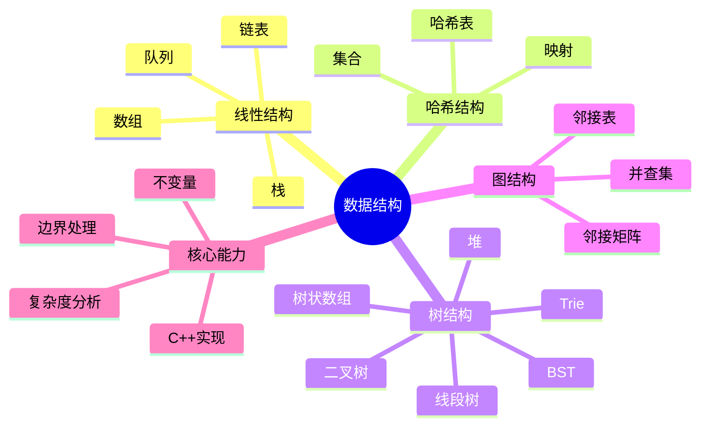
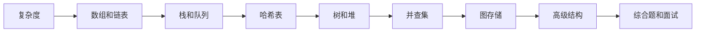
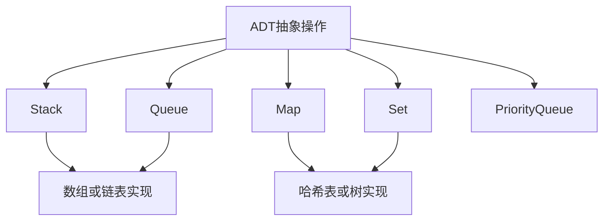
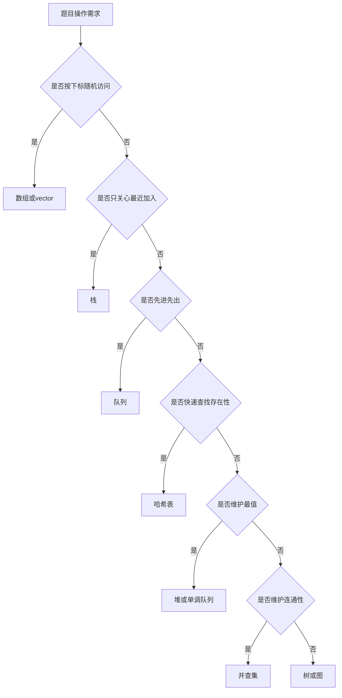

# 00. 数据结构学习路线与复杂度地图

## 学习目标

读完本章，你应该能回答：

1. 数据结构到底解决什么问题？
2. 学习数据结构应该按什么顺序展开？
3. 为什么复杂度分析是选择数据结构的前提？
4. 面试或刷题时如何根据操作需求反推数据结构？

## 一句话总纲

数据结构是**组织数据以支持高效操作**的方法。真正的学习重点不是背名字，而是理解每种结构在查询、插入、删除、遍历、合并、区间统计、连通性维护等操作上的代价。

> 记忆口诀：**先看操作，再选结构；先算复杂度，再写代码。**

## 思维导图



## 1. 数据结构学习主线



建议顺序：

1. 复杂度与抽象数据类型。
2. 数组、字符串、顺序表。
3. 链表。
4. 栈、队列、单调栈、单调队列。
5. 哈希表、集合、映射。
6. 树、二叉树、BST。
7. 堆和优先队列。
8. 并查集。
9. 图的存储与遍历。
10. Trie、树状数组、线段树等高级结构。

## 2. 复杂度为什么重要？

同一个问题，不同数据结构的成本可能差几个数量级。

例子：维护一个集合，支持查找某个值是否存在。

| 数据结构 | 查找 | 插入 | 删除 | 适合场景 |
| --- | ---: | ---: | ---: | --- |
| 无序数组 | O(n) | O(1) 尾插 | O(n) | 数据少，遍历多 |
| 有序数组 | O(log n) | O(n) | O(n) | 查询多，修改少 |
| 链表 | O(n) | O(1) 已知位置 | O(1) 已知位置 | 频繁局部插删 |
| 哈希表 | 平均 O(1) | 平均 O(1) | 平均 O(1) | 快速查找 |
| 平衡 BST | O(log n) | O(log n) | O(log n) | 有序遍历和范围查询 |

## 3. 大 O 复杂度速记

```mermaid
flowchart TD
  A[O(1)] --> B[O(log n)]
  B --> C[O(n)]
  C --> D[O(n log n)]
  D --> E[O(n^2)]
  E --> F[O(2^n)]
```

从快到慢：

```text
O(1) < O(log n) < O(n) < O(n log n) < O(n^2) < O(2^n)
```

### 常见复杂度来源

| 代码形态 | 复杂度直觉 |
| --- | --- |
| 直接访问数组下标 | O(1) |
| 每次折半 | O(log n) |
| 单层遍历 | O(n) |
| 排序或分治合并 | O(n log n) |
| 双重循环枚举所有对 | O(n²) |
| 枚举所有子集 | O(2ⁿ) |

## 4. 抽象数据类型 ADT

抽象数据类型关注“支持什么操作”，不直接限定底层实现。



例如 Stack 的抽象操作是：

- `push`
- `pop`
- `top`
- `empty`

它可以用数组实现，也可以用链表实现。

## 5. 如何根据题目选择数据结构？



## 6. C++ 容器快速对应表

| 抽象需求 | C++ 容器 | 底层直觉 |
| --- | --- | --- |
| 动态数组 | `vector` | 连续内存 |
| 双端队列 | `deque` | 分段连续 |
| 栈 | `stack` | 容器适配器 |
| 队列 | `queue` | 容器适配器 |
| 优先队列 | `priority_queue` | 堆 |
| 哈希集合 | `unordered_set` | 哈希表 |
| 哈希映射 | `unordered_map` | 哈希表 |
| 有序集合 | `set` | 平衡树 |
| 有序映射 | `map` | 平衡树 |

## 7. C++ 复杂度 demo

下面用一个小 demo 体会 `vector` 下标访问和线性查找的差异。

```cpp
#include <bits/stdc++.h>
using namespace std;

int main() {
    vector<int> a = {3, 1, 4, 1, 5, 9};

    // O(1)：通过下标直接访问
    cout << a[2] << "\n";

    // O(n)：不知道位置，只能线性找
    int target = 5;
    bool found = false;
    for (int x : a) {
        if (x == target) {
            found = true;
            break;
        }
    }
    cout << boolalpha << found << "\n";
    return 0;
}
```

## 8. 学习自检

1. 为什么哈希表平均查找是 O(1)，但有序数组查找是 O(log n)？
2. 链表插入一定比数组快吗？为什么不是？
3. 什么情况下应该选择 `map` 而不是 `unordered_map`？
4. 为什么堆适合维护动态最值？
5. 并查集解决的是哪类问题？

## 9. 总结

数据结构学习的核心路径：


不要只背“某结构是什么”，而要能回答：

1. 它支持哪些操作？
2. 每个操作复杂度是多少？
3. 它维护什么不变量？
4. 它的边界和坑在哪里？
5. C++ 标准库有没有现成实现？
