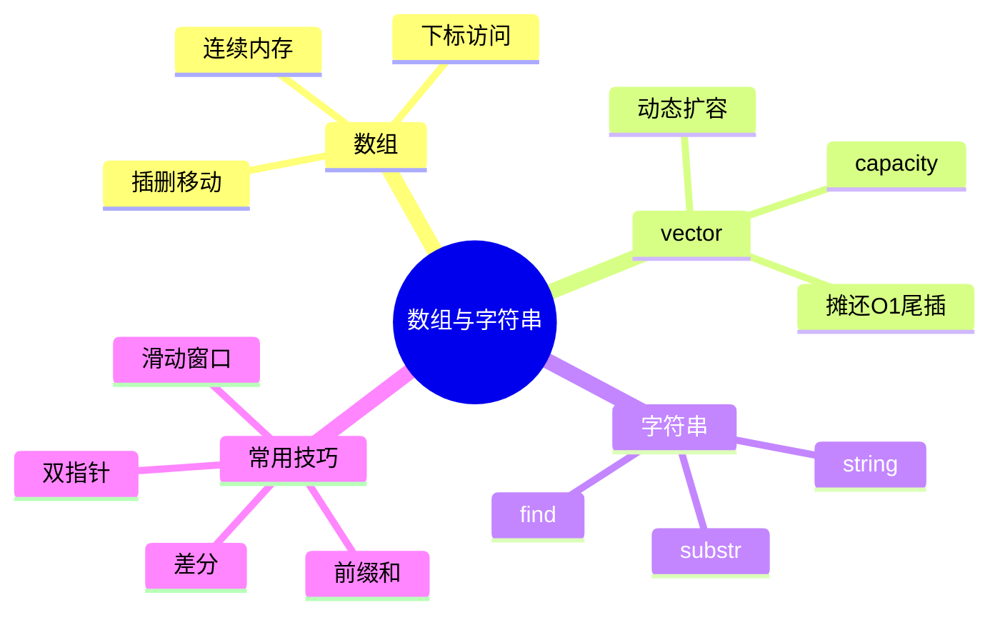
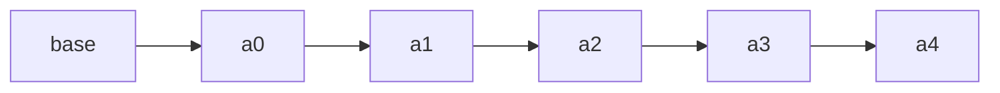
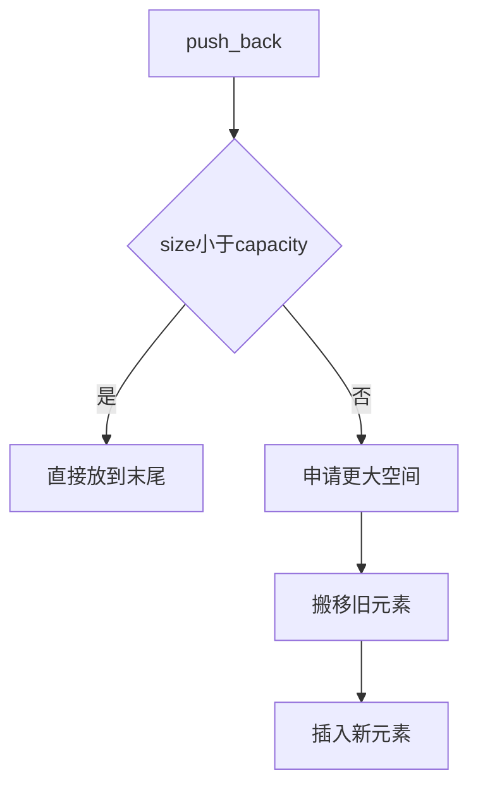
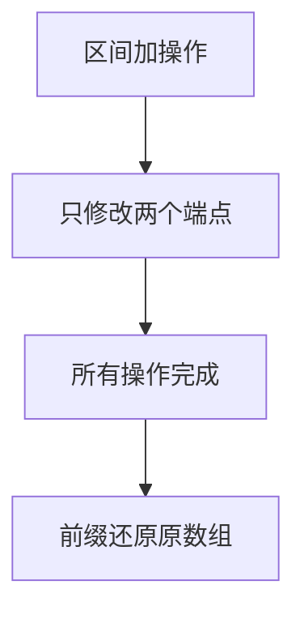

# 01. 数组、字符串与顺序表

## 学习目标

读完本章，你应该能回答：

1. 数组为什么能 O(1) 随机访问？
2. 动态数组 `vector` 扩容为什么是摊还 O(1)？
3. 数组插入删除为什么通常是 O(n)？
4. 字符串和字符数组在 C++ 中如何使用？
5. 前缀和、差分、双指针为什么常和数组一起出现？

## 一句话总纲

数组的核心优势是**连续内存 + 下标随机访问**；核心代价是中间插入和删除需要移动元素。

> 记忆口诀：**数组查得快，插删要搬家。**

## 思维导图



## 1. 数组的底层直觉

数组在内存中连续存放。若每个元素占 `sizeof(T)` 字节，第 `i` 个元素地址为：

```text
base_address + i * sizeof(T)
```

因此下标访问是 O(1)。



## 2. 数组操作复杂度

| 操作 | 复杂度 | 原因 |
| --- | ---: | --- |
| 访问 `a[i]` | O(1) | 地址可直接计算 |
| 修改 `a[i]` | O(1) | 直接定位 |
| 末尾插入 | O(1) 或扩容 | 有空间则直接放 |
| 中间插入 | O(n) | 后续元素右移 |
| 中间删除 | O(n) | 后续元素左移 |
| 查找某值 | O(n) | 无序时只能遍历 |

## 3. `vector` 动态扩容

`vector` 是 C++ 最常用动态数组。它维护：

- `size()`：当前元素个数。
- `capacity()`：当前已分配空间。

当尾插超过容量时，会申请更大内存，把旧元素搬过去。



虽然某次扩容是 O(n)，但大量 `push_back` 的平均成本是摊还 O(1)。

## 4. C++ vector demo

```cpp
#include <bits/stdc++.h>
using namespace std;

int main() {
    vector<int> a;
    for (int i = 1; i <= 8; ++i) {
        a.push_back(i);
        cout << "size=" << a.size()
             << ", capacity=" << a.capacity() << "\n";
    }

    // O(1) 随机访问
    cout << "a[3]=" << a[3] << "\n";

    // O(n) 中间插入
    a.insert(a.begin() + 2, 99);

    for (int x : a) cout << x << ' ';
    cout << "\n";
    return 0;
}
```

## 5. 字符串 `string`

C++ `string` 可以看作动态字符数组，并提供常用字符串操作。

```cpp
#include <bits/stdc++.h>
using namespace std;

int main() {
    string s = "algorithm";
    cout << s.size() << "\n";
    cout << s[0] << " " << s.substr(0, 4) << "\n";

    size_t pos = s.find("go");
    if (pos != string::npos) {
        cout << "found at " << pos << "\n";
    }
    return 0;
}
```

注意：

- `substr(pos, len)` 会创建新字符串，成本与长度相关。
- `find` 通常不是 O(1)，要考虑匹配成本。
- 大量拼接时注意拷贝成本，可用 `reserve`。

## 6. 前缀和

前缀和用于 O(1) 查询区间和。

```text
prefix[i] = a[0] + a[1] + ... + a[i-1]
sum(l, r) = prefix[r + 1] - prefix[l]
```


C++ demo：

```cpp
#include <bits/stdc++.h>
using namespace std;

int main() {
    vector<int> a = {2, 4, 1, 7, 3};
    int n = a.size();
    vector<int> prefix(n + 1, 0);
    for (int i = 0; i < n; ++i) {
        prefix[i + 1] = prefix[i] + a[i];
    }

    int l = 1, r = 3; // 查询 a[1..3]
    cout << prefix[r + 1] - prefix[l] << "\n";
    return 0;
}
```

## 7. 差分数组

差分适合多次区间加，最后统一还原。

```text
diff[l] += x
diff[r + 1] -= x
```



C++ demo：

```cpp
#include <bits/stdc++.h>
using namespace std;

int main() {
    int n = 5;
    vector<int> diff(n + 1, 0);

    auto add = [&](int l, int r, int x) {
        diff[l] += x;
        if (r + 1 < n) diff[r + 1] -= x;
    };

    add(1, 3, 2);
    add(2, 4, 1);

    vector<int> a(n);
    int cur = 0;
    for (int i = 0; i < n; ++i) {
        cur += diff[i];
        a[i] = cur;
    }

    for (int x : a) cout << x << ' ';
    cout << "\n";
    return 0;
}
```

## 8. 双指针与滑动窗口

双指针常用于数组或字符串中维护一个区间。


典型问题：最长无重复子串、和至少为 target 的最短子数组。

窗口类问题的关键：

1. 右指针扩展窗口。
2. 当窗口不合法或可以优化时，左指针收缩。
3. 每个元素最多进出窗口一次，所以常为 O(n)。

## 9. 常见坑

| 坑 | 说明 |
| --- | --- |
| 越界 | `i < n` 不要写成 `i <= n` |
| 空数组 | 访问 `a[0]` 前检查是否为空 |
| 迭代器失效 | `vector` 扩容后旧迭代器可能失效 |
| `size_t` 下溢 | `s.size() - 1` 在空串会出问题 |
| 频繁中间插入 | `vector` 不适合大量中间插入删除 |

## 10. 学习自检

1. 为什么数组能 O(1) 下标访问？
2. `vector` 扩容为什么会导致迭代器失效？
3. 前缀和适合什么问题？差分适合什么问题？
4. 滑动窗口为什么通常是 O(n)？
5. `string::substr` 的成本为什么不是 O(1)？
