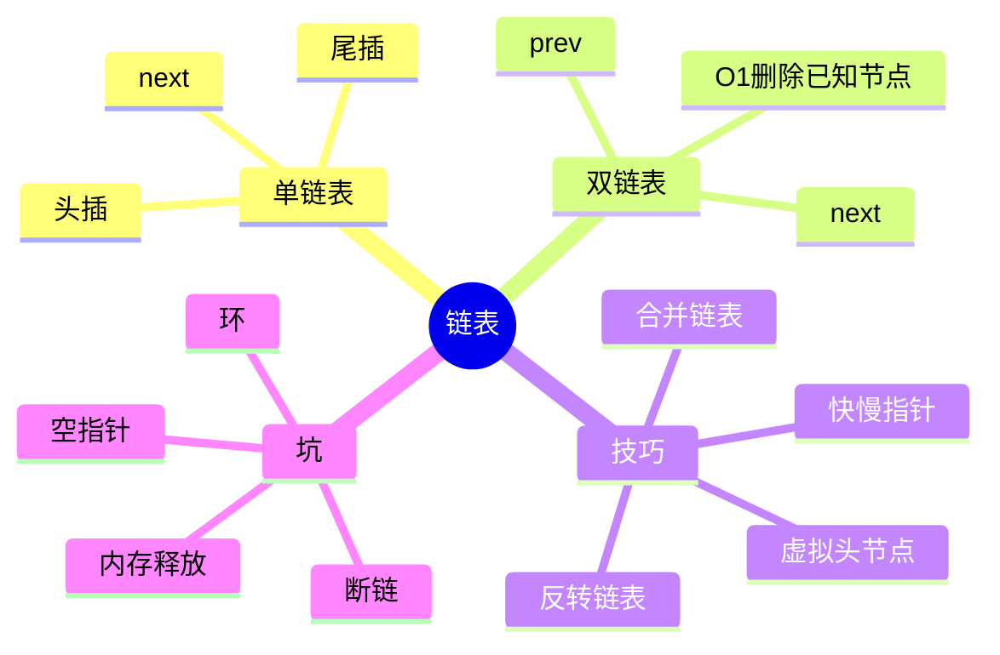
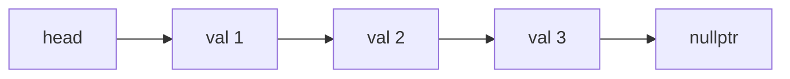
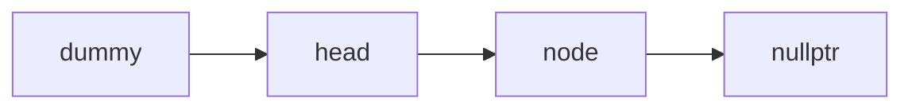
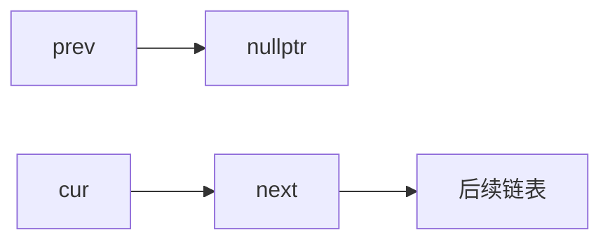
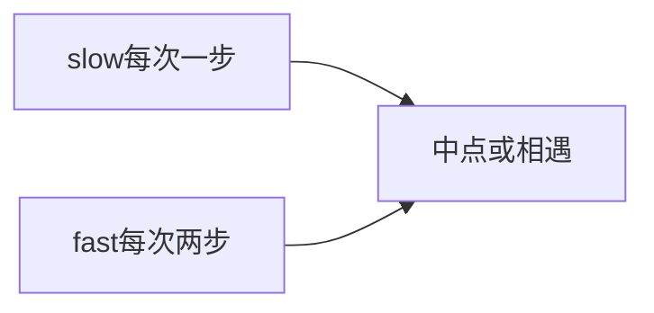
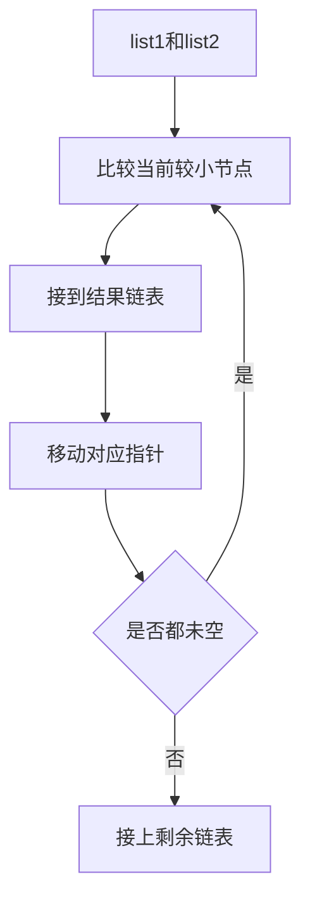

# 02. 链表

## 学习目标

读完本章，你应该能回答：

1. 链表和数组的底层差异是什么？
2. 单链表、双链表、循环链表分别适合什么场景？
3. 为什么链表随机访问慢，但已知节点插删快？
4. 虚拟头节点、快慢指针、反转链表如何实现？

## 一句话总纲

链表用指针把节点串起来，不要求连续内存；它牺牲随机访问能力，换来局部插入删除的灵活性。

> 记忆口诀：**数组靠下标，链表靠指针；查找要走路，插删改指针。**

## 思维导图



## 1. 链表结构

单链表节点：

```text
value + next pointer
```



## 2. 链表和数组对比

| 维度 | 数组 | 链表 |
| --- | --- | --- |
| 内存 | 连续 | 不连续 |
| 随机访问 | O(1) | O(n) |
| 已知位置插入 | O(n) 移动元素 | O(1) 改指针 |
| 查找值 | O(n) | O(n) |
| 缓存友好 | 好 | 较差 |
| 额外空间 | 少 | 指针开销 |

注意：链表插入快的前提是**已经拿到要插入位置的前驱节点**。如果还要先查找，整体仍可能是 O(n)。

## 3. 虚拟头节点

虚拟头节点 dummy 可以统一删除头节点和中间节点的逻辑。



删除值为 target 的节点：

```cpp
#include <bits/stdc++.h>
using namespace std;

struct ListNode {
    int val;
    ListNode* next;
    ListNode(int v) : val(v), next(nullptr) {}
};

ListNode* removeValue(ListNode* head, int target) {
    ListNode dummy(0);
    dummy.next = head;
    ListNode* cur = &dummy;

    while (cur->next) {
        if (cur->next->val == target) {
            ListNode* del = cur->next;
            cur->next = del->next;
            delete del;
        } else {
            cur = cur->next;
        }
    }
    return dummy.next;
}
```

## 4. 反转链表

反转链表的核心是三指针：`prev`、`cur`、`next`。



C++ demo：

```cpp
#include <bits/stdc++.h>
using namespace std;

struct ListNode {
    int val;
    ListNode* next;
    ListNode(int v) : val(v), next(nullptr) {}
};

ListNode* reverseList(ListNode* head) {
    ListNode* prev = nullptr;
    ListNode* cur = head;
    while (cur) {
        ListNode* nxt = cur->next;
        cur->next = prev;
        prev = cur;
        cur = nxt;
    }
    return prev;
}
```

步骤记忆：

```text
先存 next，再反指针，再移动 prev 和 cur。
```

## 5. 快慢指针

快慢指针常用于：

- 找链表中点。
- 判断是否有环。
- 找环入口。
- 删除倒数第 k 个节点。



判断环：

```cpp
bool hasCycle(ListNode* head) {
    ListNode* slow = head;
    ListNode* fast = head;
    while (fast && fast->next) {
        slow = slow->next;
        fast = fast->next->next;
        if (slow == fast) return true;
    }
    return false;
}
```

## 6. 合并两个有序链表



C++ demo：

```cpp
ListNode* mergeTwoLists(ListNode* a, ListNode* b) {
    ListNode dummy(0);
    ListNode* tail = &dummy;
    while (a && b) {
        if (a->val <= b->val) {
            tail->next = a;
            a = a->next;
        } else {
            tail->next = b;
            b = b->next;
        }
        tail = tail->next;
    }
    tail->next = a ? a : b;
    return dummy.next;
}
```

## 7. 双链表

双链表每个节点有 `prev` 和 `next`，已知节点时删除更方便。


C++ 标准库 `list` 是双向链表，但刷题中更常手写节点。

## 8. 常见坑

| 坑 | 说明 |
| --- | --- |
| 忘记保存 next | 反转时会丢失后续链表 |
| 空指针访问 | `fast->next` 前先判断 `fast` |
| 删除头节点特殊处理 | 用 dummy 简化 |
| 内存泄漏 | 手写 new 后要考虑 delete |
| 断链 | 改指针顺序错误导致节点丢失 |

## 9. 学习自检

1. 链表插入 O(1) 的前提是什么？
2. dummy 节点解决了什么边界问题？
3. 反转链表为什么要先保存 `next`？
4. 快慢指针如何判断链表有环？
5. 双链表相比单链表多付出了什么代价？
