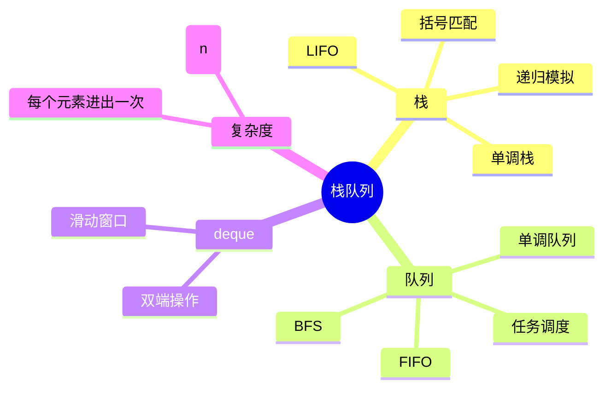
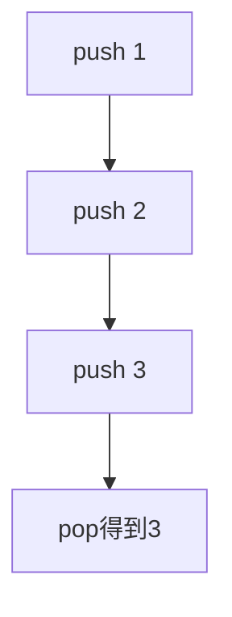
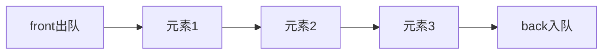
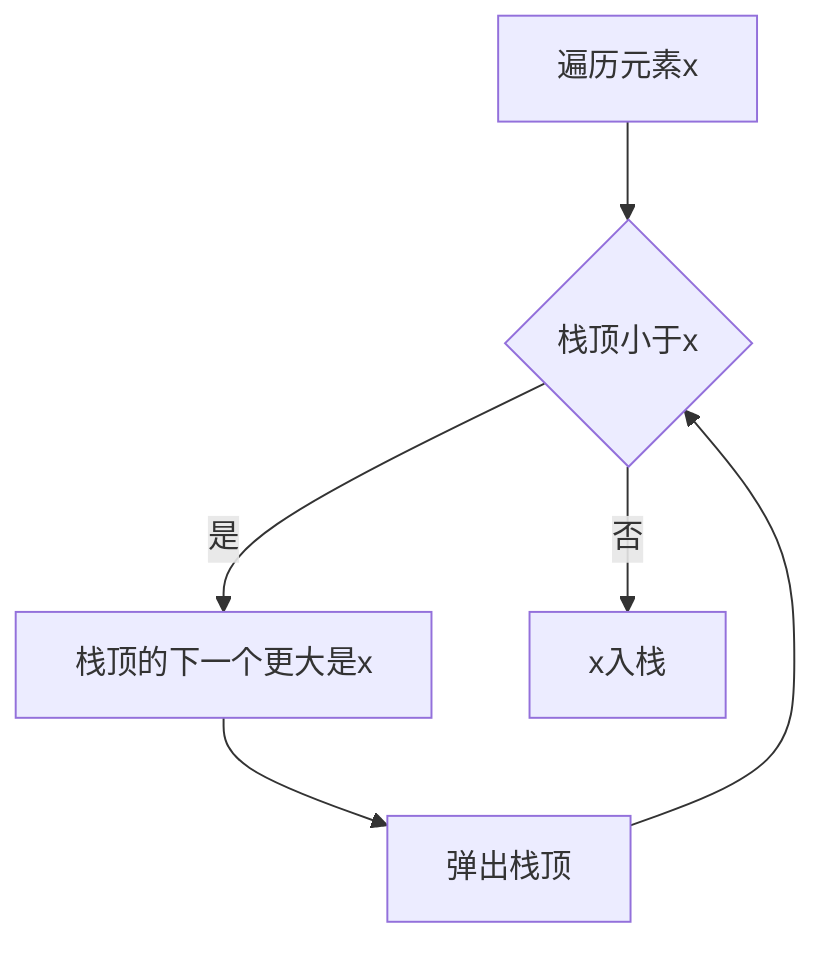
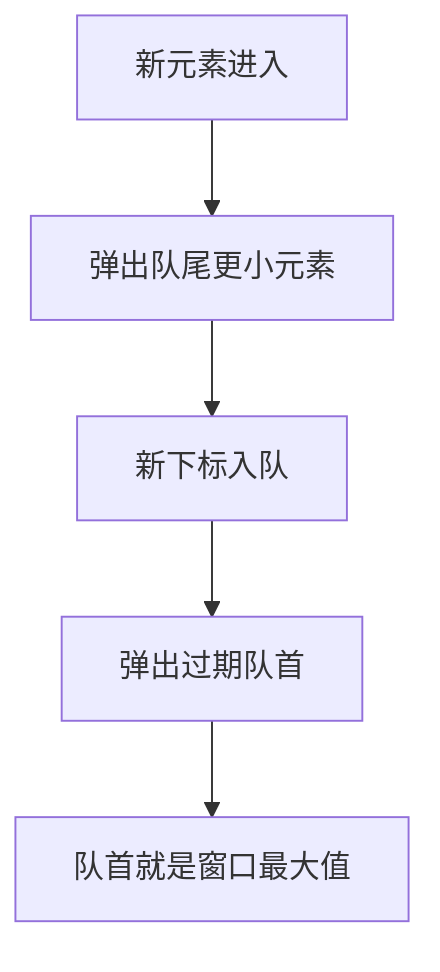

# 03. 栈、队列与单调结构

## 学习目标

读完本章，你应该能回答：

1. 栈和队列分别维护什么访问顺序？
2. 单调栈为什么能在线性时间找到下一个更大元素？
3. 单调队列为什么能维护滑动窗口最值？
4. C++ 中 `stack`、`queue`、`deque` 应该怎么用？

## 一句话总纲

栈和队列是受限线性表：栈后进先出，队列先进先出；单调栈和单调队列通过维护有序性，把许多看似 O(n²) 的比较优化到 O(n)。

> 记忆口诀：**栈看最近，队列排队，单调结构丢掉不可能成为答案的元素。**

## 思维导图



## 1. 栈 Stack

栈是后进先出结构。



C++ demo：括号匹配。

```cpp
#include <bits/stdc++.h>
using namespace std;

bool isValid(string s) {
    stack<char> st;
    for (char c : s) {
        if (c == '(' || c == '[' || c == '{') {
            st.push(c);
        } else {
            if (st.empty()) return false;
            char t = st.top();
            st.pop();
            if ((c == ')' && t != '(') ||
                (c == ']' && t != '[') ||
                (c == '}' && t != '{')) {
                return false;
            }
        }
    }
    return st.empty();
}

int main() {
    cout << boolalpha << isValid("([]{})") << "\n";
    return 0;
}
```

## 2. 队列 Queue

队列是先进先出结构。



常用于 BFS、任务调度、层序遍历。

```cpp
#include <bits/stdc++.h>
using namespace std;

int main() {
    queue<int> q;
    q.push(1);
    q.push(2);
    q.push(3);
    while (!q.empty()) {
        cout << q.front() << ' ';
        q.pop();
    }
    cout << "\n";
    return 0;
}
```

## 3. Deque 双端队列

`deque` 支持两端 O(1) 插入删除：

- `push_front`
- `push_back`
- `pop_front`
- `pop_back`

它常用于单调队列。

## 4. 单调栈

单调栈维护栈内元素单调递增或递减。典型问题：下一个更大元素。



C++ demo：下一个更大元素。

```cpp
#include <bits/stdc++.h>
using namespace std;

vector<int> nextGreater(vector<int>& nums) {
    int n = nums.size();
    vector<int> ans(n, -1);
    stack<int> st; // 存下标，保持对应值递减
    for (int i = 0; i < n; ++i) {
        while (!st.empty() && nums[st.top()] < nums[i]) {
            ans[st.top()] = nums[i];
            st.pop();
        }
        st.push(i);
    }
    return ans;
}

int main() {
    vector<int> a = {2, 1, 2, 4, 3};
    auto ans = nextGreater(a);
    for (int x : ans) cout << x << ' ';
    cout << "\n";
    return 0;
}
```

为什么是 O(n)：每个下标最多入栈一次、出栈一次。

## 5. 单调队列

单调队列常用于滑动窗口最大值。队列中保存下标，并保证对应值单调递减。



C++ demo：滑动窗口最大值。

```cpp
#include <bits/stdc++.h>
using namespace std;

vector<int> maxSlidingWindow(vector<int>& nums, int k) {
    deque<int> dq; // 存下标，值单调递减
    vector<int> ans;
    for (int i = 0; i < (int)nums.size(); ++i) {
        while (!dq.empty() && nums[dq.back()] <= nums[i]) dq.pop_back();
        dq.push_back(i);

        if (dq.front() <= i - k) dq.pop_front();
        if (i >= k - 1) ans.push_back(nums[dq.front()]);
    }
    return ans;
}

int main() {
    vector<int> a = {1, 3, -1, -3, 5, 3, 6, 7};
    auto ans = maxSlidingWindow(a, 3);
    for (int x : ans) cout << x << ' ';
    cout << "\n";
    return 0;
}
```

## 6. 常见应用

| 结构 | 典型应用 |
| --- | --- |
| 栈 | 括号匹配、表达式求值、递归模拟、DFS |
| 单调栈 | 下一个更大元素、柱状图最大矩形 |
| 队列 | BFS、层序遍历、任务调度 |
| 单调队列 | 滑动窗口最值、区间 DP 优化 |
| deque | 双端操作、0-1 BFS |

## 7. 常见坑

| 坑 | 说明 |
| --- | --- |
| 空栈取 top | 调用前必须 `empty()` 检查 |
| 单调栈存值还是下标 | 需要位置时存下标 |
| 队列过期判断 | 滑动窗口要及时弹出过期下标 |
| 单调方向搞反 | 最大值维护递减队列，最小值维护递增队列 |
| 等号处理 | `<=` 或 `<` 会影响重复元素保留 |

## 8. 学习自检

1. 为什么括号匹配适合用栈？
2. 单调栈为什么是 O(n)？
3. 滑动窗口最大值为什么不能每次排序？
4. 单调队列中为什么存下标而不是只存值？
5. `deque` 和 `queue` 有什么区别？
