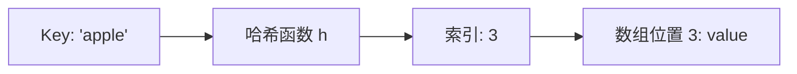
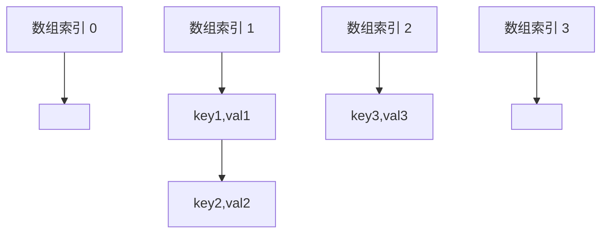
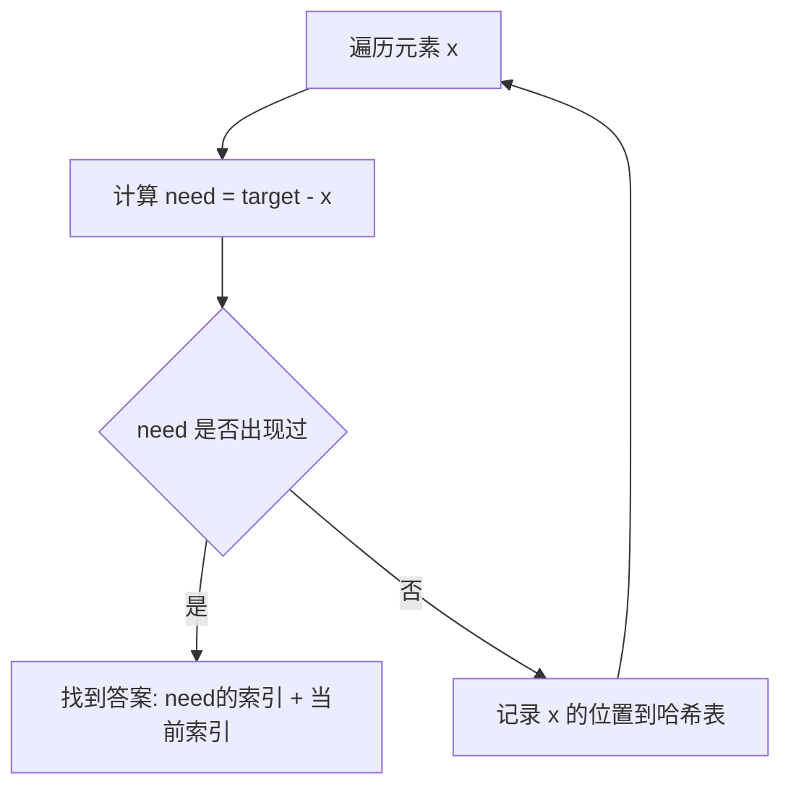

# 哈希表与集合映射

## 1. 哈希表基本原理

### 1.1 什么是哈希表

哈希表（Hash Table）是一种基于**哈希函数**实现的数据结构，通过键（key）直接访问值（value），实现 O(1) 的平均查找、插入和删除时间复杂度。

**核心思想**：
- 将键通过哈希函数映射到数组的索引位置
- 在该位置存储对应的值或键值对
- 查询时使用相同的哈希函数定位数据



### 1.2 哈希冲突

当两个不同的键通过哈希函数映射到同一个索引时，就发生了**哈希冲突**（Hash Collision）。

**解决方法**：

#### 1. 链地址法（Chaining）
- 数组每个位置存储一个链表
- 冲突的元素都添加到链表中
- C++ `unordered_map` 和 `unordered_set` 使用此方法



#### 2. 开放地址法（Open Addressing）
- 冲突时寻找下一个空闲位置
- 包括线性探测、二次探测、双重哈希等
- 节省指针空间，但删除操作复杂

### 1.3 负载因子与扩容

**负载因子** = 元素数量 / 数组容量

- C++ `unordered_map` 默认负载因子阈值为 1.0
- 超过阈值时触发**扩容**（rehash），通常扩大为原来的 2 倍
- 扩容需要重新计算所有元素的哈希值，时间复杂度 O(n)

---

## 2. C++ 中的哈希容器

### 2.1 unordered_map

**特点**：
- 存储键值对，键唯一
- 无序（不保证遍历顺序）
- 平均 O(1) 查找、插入、删除
- 最坏 O(n)（哈希冲突严重时）

**常用操作**：

```cpp
#include <unordered_map>
using namespace std;

unordered_map<string, int> mp;

// 插入
mp["apple"] = 5;
mp.insert({"banana", 3});

// 查找
if (mp.count("apple")) {  // 存在返回 1，不存在返回 0
    int val = mp["apple"];  // 直接访问
}

auto it = mp.find("banana");  // 返回迭代器
if (it != mp.end()) {
    int val = it->second;
}

// 删除
mp.erase("apple");

// 遍历
for (auto& [key, val] : mp) {
    // 处理 key 和 val
}
```

**注意事项**：
- `mp[key]` 如果 key 不存在会**自动创建**并初始化为 0（整数）或空（字符串）
- 只想查询不想创建时用 `count()` 或 `find()`

### 2.2 unordered_set

**特点**：
- 只存储键，不存储值
- 元素唯一
- 用于快速判断元素是否存在

```cpp
#include <unordered_set>
using namespace std;

unordered_set<int> st;

// 插入
st.insert(10);
st.insert(20);

// 查找
if (st.count(10)) {  // 存在
    // ...
}

// 删除
st.erase(10);

// 遍历
for (int x : st) {
    // 处理 x
}
```

### 2.3 map vs unordered_map

| 特性 | map | unordered_map |
|------|-----|---------------|
| 底层实现 | 红黑树 | 哈希表 |
| 时间复杂度 | O(log n) | 平均 O(1)，最坏 O(n) |
| 有序性 | 有序（按键排序） | 无序 |
| 空间占用 | 较小 | 较大（需要额外哈希表空间） |
| 适用场景 | 需要有序遍历 | 只需快速查找 |

**选择建议**：
- 只需要快速查找 → `unordered_map`
- 需要按键有序遍历 → `map`
- 需要范围查询（lower_bound, upper_bound）→ `map`

---

## 3. 哈希表的时间复杂度分析

### 3.1 理想情况

| 操作 | 时间复杂度 |
|------|------------|
| 插入 | O(1) |
| 查找 | O(1) |
| 删除 | O(1) |

### 3.2 最坏情况

当所有元素都发生哈希冲突（映射到同一位置）时：
- 退化为链表
- 所有操作变为 O(n)

### 3.3 扩容时的复杂度

- 单次扩容：O(n)
- **均摊复杂度**：O(1)
  - 虽然扩容需要 O(n)，但每个元素平均只被 rehash 一次
  - 类似动态数组的 push_back

---

## 4. 哈希表典型应用场景

### 4.1 快速查找与判重

**场景**：判断元素是否存在、去重

```cpp
// 判断数组中是否存在重复元素
bool containsDuplicate(vector<int>& nums) {
    unordered_set<int> seen;
    for (int x : nums) {
        if (seen.count(x)) return true;
        seen.insert(x);
    }
    return false;
}
```

### 4.2 计数统计

**场景**：统计元素出现次数

```cpp
// 统计字符串中每个字符出现的次数
unordered_map<char, int> countChars(string s) {
    unordered_map<char, int> cnt;
    for (char c : s) {
        cnt[c]++;
    }
    return cnt;
}
```

### 4.3 映射关系

**场景**：建立键值对应关系

```cpp
// 罗马数字转整数
int romanToInt(string s) {
    unordered_map<char, int> roman = {
        {'I', 1}, {'V', 5}, {'X', 10},
        {'L', 50}, {'C', 100}, {'D', 500}, {'M', 1000}
    };
    int result = 0;
    for (int i = 0; i < s.length(); ++i) {
        if (i + 1 < s.length() && roman[s[i]] < roman[s[i+1]]) {
            result -= roman[s[i]];
        } else {
            result += roman[s[i]];
        }
    }
    return result;
}
```

### 4.4 缓存（记忆化）

**场景**：存储已计算的结果，避免重复计算

```cpp
// 斐波那契数列（记忆化递归）
unordered_map<int, long long> memo;

long long fib(int n) {
    if (n <= 1) return n;
    if (memo.count(n)) return memo[n];
    return memo[n] = fib(n-1) + fib(n-2);
}
```

---

## 5. 两数之和

哈希表典型应用：**用空间换时间**。

**问题**：给定数组和目标值，找出数组中和为目标值的两个数的索引。

### 5.1 思路



**核心技巧**：
- 不需要遍历两次
- 边遍历边查找，哈希表存储**已经遍历过的元素**
- 对于当前元素 x，只需查找 `target - x` 是否在哈希表中

### 5.2 代码实现

```cpp
#include <bits/stdc++.h>
using namespace std;

vector<int> twoSum(vector<int>& nums, int target) {
    unordered_map<int, int> pos;  // 值 -> 索引
    
    for (int i = 0; i < (int)nums.size(); ++i) {
        int need = target - nums[i];
        
        // 如果 need 已经出现过，找到答案
        if (pos.count(need)) {
            return {pos[need], i};
        }
        
        // 记录当前元素的位置
        pos[nums[i]] = i;
    }
    
    return {};  // 没有找到
}
```

### 5.3 复杂度分析

- **时间复杂度**：O(n)
  - 遍历数组一次
  - 每次哈希表查找和插入都是 O(1)
- **空间复杂度**：O(n)
  - 最坏情况下需要存储 n-1 个元素

### 5.4 对比暴力解法

**暴力解法**：双重循环
```cpp
// 时间 O(n²)，空间 O(1)
vector<int> twoSumBrute(vector<int>& nums, int target) {
    for (int i = 0; i < nums.size(); ++i) {
        for (int j = i + 1; j < nums.size(); ++j) {
            if (nums[i] + nums[j] == target) {
                return {i, j};
            }
        }
    }
    return {};
}
```

| 方法 | 时间复杂度 | 空间复杂度 |
|------|-----------|------------|
| 暴力 | O(n²) | O(1) |
| 哈希表 | O(n) | O(n) |

**哈希表的优势**：用 O(n) 的空间换取了 O(n²) → O(n) 的时间优化。

---

## 6. 常见问题与注意事项

### 6.1 自定义类型作为键

如果要使用自定义结构体作为 `unordered_map` 的键，需要：

1. **定义哈希函数**
2. **定义相等比较函数**

```cpp
struct Point {
    int x, y;
    bool operator==(const Point& other) const {
        return x == other.x && y == other.y;
    }
};

// 自定义哈希函数
struct PointHash {
    size_t operator()(const Point& p) const {
        return hash<int>()(p.x) ^ (hash<int>()(p.y) << 1);
    }
};

// 使用
unordered_map<Point, int, PointHash> mp;
```

### 6.2 哈希表的遍历顺序

- `unordered_map` 和 `unordered_set` 的遍历顺序是**不确定的**
- 不要依赖遍历顺序
- 如需有序遍历，使用 `map` 或 `set`

### 6.3 何时使用哈希表

**适合使用哈希表**：
- 需要快速查找元素是否存在
- 需要快速统计元素出现次数
- 需要建立映射关系
- 空间复杂度可以接受

**不适合使用哈希表**：
- 需要有序遍历
- 需要范围查询（如查找所有在 [a, b] 之间的键）
- 需要找最大/最小元素
- 空间受限

### 6.4 性能优化建议

1. **预分配空间**（如果知道元素数量）：
   ```cpp
   unordered_map<int, int> mp;
   mp.reserve(10000);  // 预留空间，减少扩容次数
   ```

2. **避免不必要的 `operator[]`**：
   ```cpp
   // 不推荐（会创建不存在的键）
   if (mp[key] > 0) { ... }
   
   // 推荐
   if (mp.count(key) && mp[key] > 0) { ... }
   // 或
   auto it = mp.find(key);
   if (it != mp.end() && it->second > 0) { ... }
   ```

3. **选择合适的哈希容器**：
   - 只需判断存在性 → `unordered_set`
   - 需要存储对应值 → `unordered_map`

---

## 7. 总结

### 核心要点

1. **哈希表的本质**：通过哈希函数实现 O(1) 的快速访问
2. **空间换时间**：用额外的空间存储映射关系，大幅降低时间复杂度
3. **哈希冲突**：实际应用中需要处理冲突，C++ 使用链地址法
4. **选择合适的容器**：
   - 需要快速查找 → `unordered_map` / `unordered_set`
   - 需要有序遍历 → `map` / `set`

### 记忆口诀

> **哈希表快速查，空间换时间不怕**  
> **冲突用链地址法，负载过高就扩大**  
> **统计映射和判重，O(1) 操作顶呱呱**
