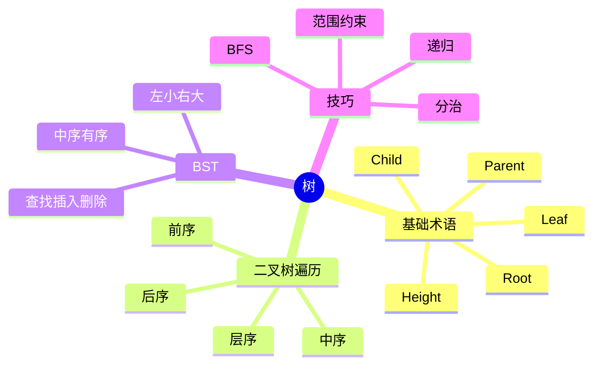
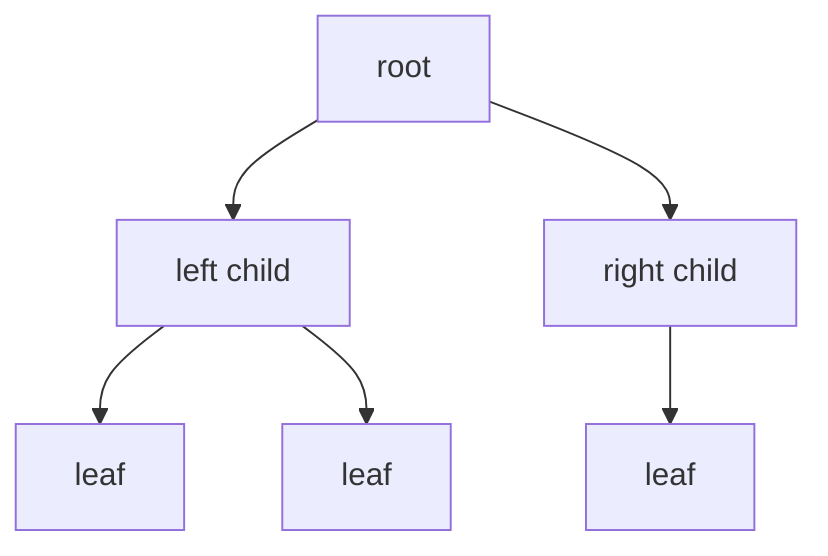
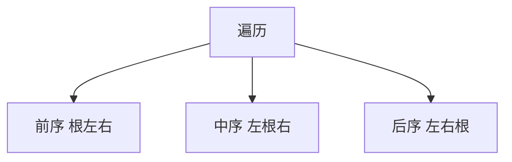
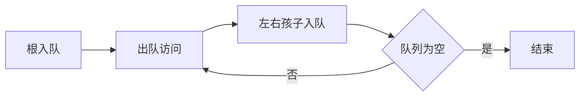
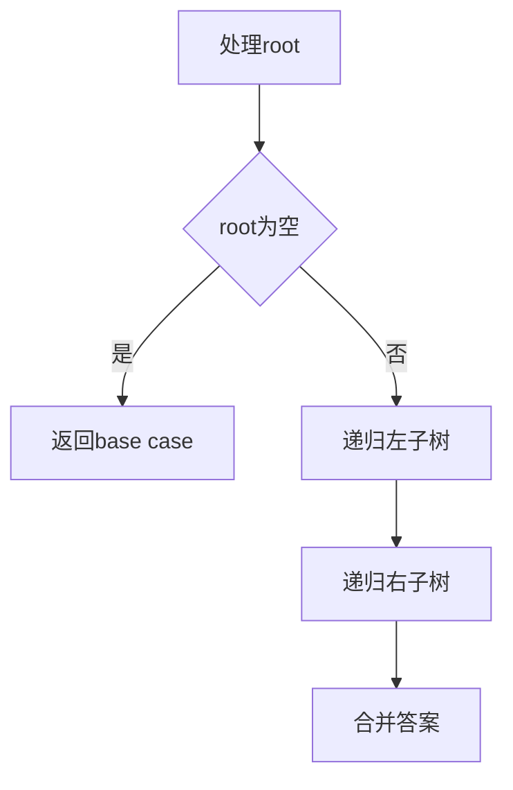
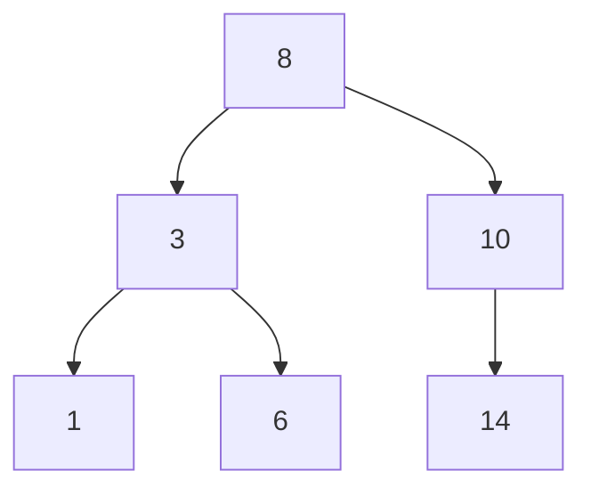
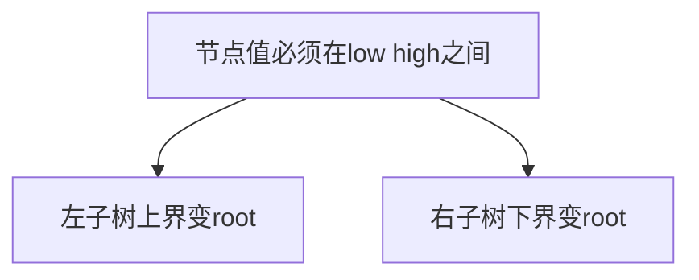

# 05. 树、二叉树与二叉搜索树

## 学习目标

读完本章，你应该能回答：

1. 树的基本术语有哪些？
2. 前序、中序、后序、层序遍历分别是什么？
3. 递归处理二叉树的核心模板是什么？
4. 二叉搜索树 BST 维护什么不变量？
5. 为什么平衡对 BST 性能很重要？

## 一句话总纲

树是层次结构；二叉树每个节点最多两个孩子；BST 额外维护“左小右大”的有序不变量，从而支持高效查找。

> 记忆口诀：**树看递归，BST 看范围，遍历看根的位置。**

## 思维导图



## 1. 树的术语



术语：

- root：根节点。
- parent：父节点。
- child：子节点。
- leaf：叶子节点。
- depth：从根到节点的边数。
- height：从节点到最深叶子的边数。

## 2. 二叉树节点定义

```cpp
#include <bits/stdc++.h>
using namespace std;

struct TreeNode {
    int val;
    TreeNode* left;
    TreeNode* right;
    TreeNode(int v) : val(v), left(nullptr), right(nullptr) {}
};
```

## 3. 三种 DFS 遍历

根节点访问位置决定遍历名称。



C++ demo：

```cpp
void preorder(TreeNode* root) {
    if (!root) return;
    cout << root->val << ' ';
    preorder(root->left);
    preorder(root->right);
}

void inorder(TreeNode* root) {
    if (!root) return;
    inorder(root->left);
    cout << root->val << ' ';
    inorder(root->right);
}

void postorder(TreeNode* root) {
    if (!root) return;
    postorder(root->left);
    postorder(root->right);
    cout << root->val << ' ';
}
```

## 4. 层序遍历 BFS

层序遍历使用队列。



```cpp
vector<vector<int>> levelOrder(TreeNode* root) {
    vector<vector<int>> ans;
    if (!root) return ans;
    queue<TreeNode*> q;
    q.push(root);
    while (!q.empty()) {
        int sz = q.size();
        vector<int> level;
        for (int i = 0; i < sz; ++i) {
            TreeNode* cur = q.front();
            q.pop();
            level.push_back(cur->val);
            if (cur->left) q.push(cur->left);
            if (cur->right) q.push(cur->right);
        }
        ans.push_back(level);
    }
    return ans;
}
```

## 5. 二叉树递归模板



求最大深度：

```cpp
int maxDepth(TreeNode* root) {
    if (!root) return 0;
    return 1 + max(maxDepth(root->left), maxDepth(root->right));
}
```

判断是否平衡：

```cpp
int height(TreeNode* root) {
    if (!root) return 0;
    int lh = height(root->left);
    if (lh == -1) return -1;
    int rh = height(root->right);
    if (rh == -1) return -1;
    if (abs(lh - rh) > 1) return -1;
    return 1 + max(lh, rh);
}

bool isBalanced(TreeNode* root) {
    return height(root) != -1;
}
```

## 6. BST 不变量

BST 对每个节点满足：

```text
左子树所有值 < root->val < 右子树所有值
```



中序遍历 BST 得到有序序列。

## 7. BST 查找

```cpp
TreeNode* searchBST(TreeNode* root, int target) {
    while (root) {
        if (root->val == target) return root;
        if (target < root->val) root = root->left;
        else root = root->right;
    }
    return nullptr;
}
```

平均 O(log n)，但如果退化成链表，最坏 O(n)。

## 8. 验证 BST

不能只检查当前节点和左右孩子，要用范围约束。

```cpp
bool valid(TreeNode* root, long long low, long long high) {
    if (!root) return true;
    if (root->val <= low || root->val >= high) return false;
    return valid(root->left, low, root->val) &&
           valid(root->right, root->val, high);
}

bool isValidBST(TreeNode* root) {
    return valid(root, LLONG_MIN, LLONG_MAX);
}
```



## 9. 常见坑

| 坑 | 说明 |
| --- | --- |
| 空树 | 递归 base case 必须处理 |
| BST 验证只看孩子 | 会漏掉跨层范围错误 |
| 递归爆栈 | 极深树可能栈溢出 |
| 重复值规则 | BST 是否允许重复必须明确 |
| 删除节点复杂 | 要处理 0、1、2 个孩子情况 |

## 10. 学习自检

1. 前序、中序、后序的根节点访问时机是什么？
2. 为什么 BST 中序遍历有序？
3. 验证 BST 为什么要传范围？
4. 平衡 BST 为什么性能更稳定？
5. 层序遍历为什么用队列？
