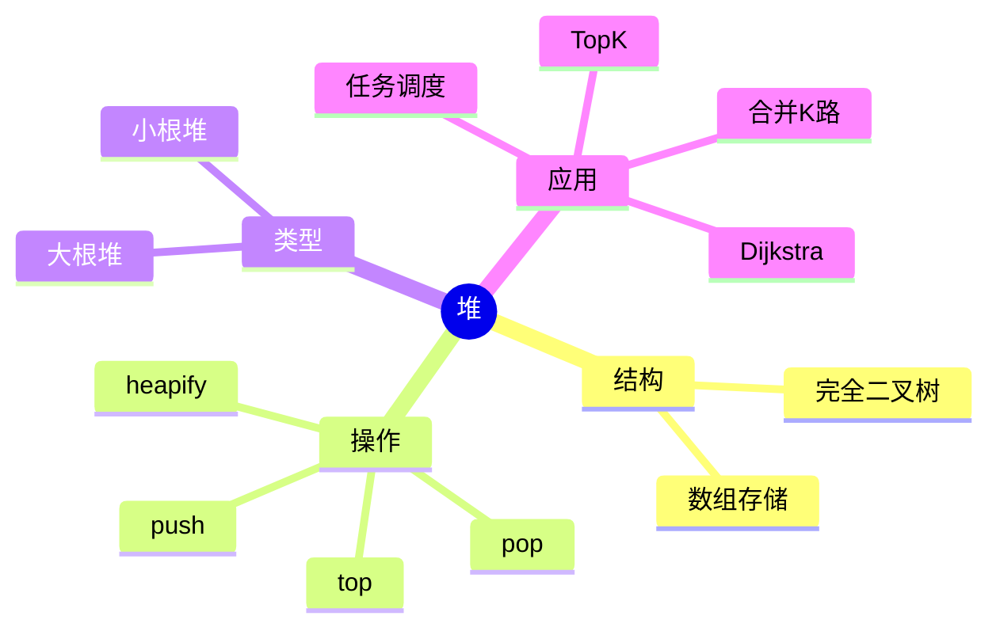
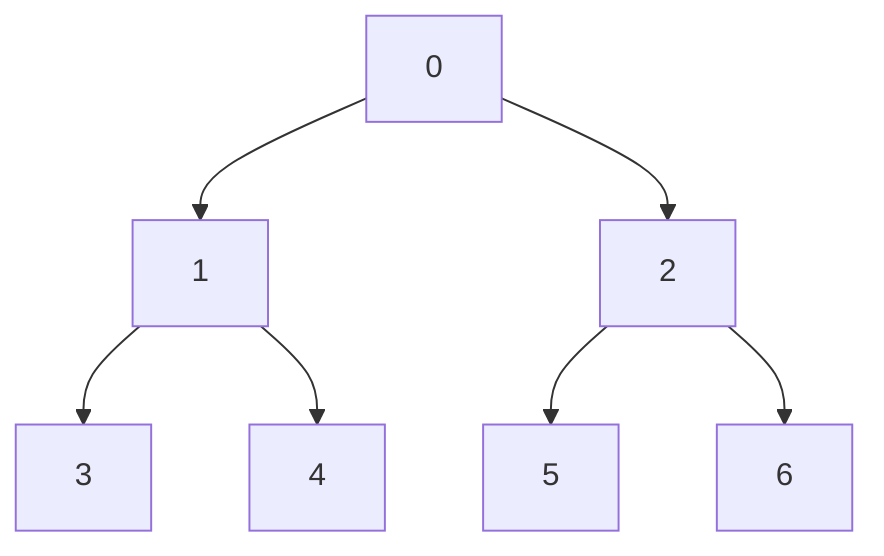
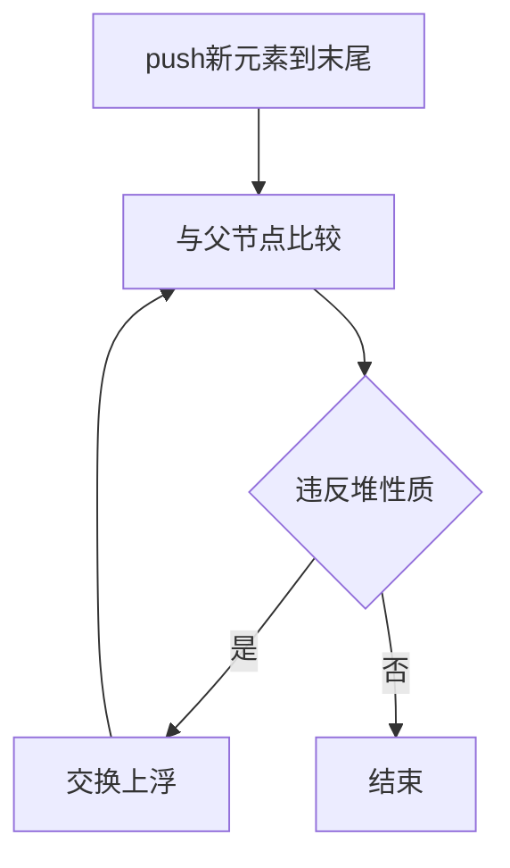
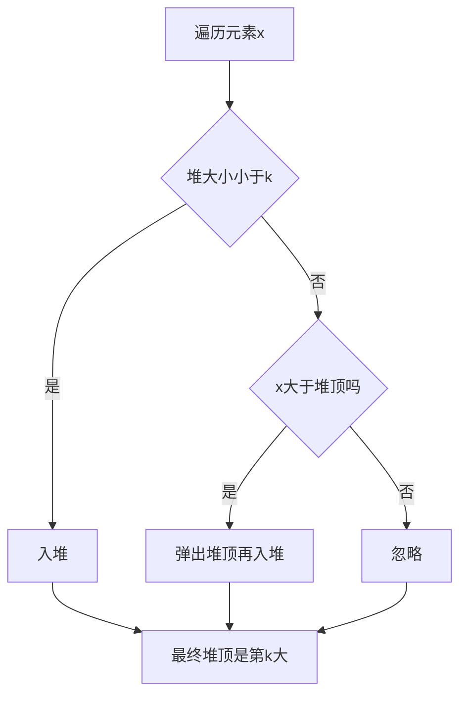

# 06. 堆与优先队列

## 学习目标

读完本章，你应该能回答：

1. 堆维护什么不变量？
2. 为什么堆可以 O(1) 取最值、O(log n) 插入删除？
3. C++ `priority_queue` 默认是大根堆还是小根堆？
4. 堆适合解决哪些 Top K 和动态最值问题？

## 一句话总纲

堆是一棵近似完全二叉树，维护父节点优先级不低于或不高于孩子节点；它适合动态维护最值。

> 记忆口诀：**堆只保证堆顶最值，不保证整体有序。**

## 思维导图



## 1. 堆的数组表示

堆通常用数组存完全二叉树。

对下标 `i`：

```text
left = 2*i + 1
right = 2*i + 2
parent = (i - 1) / 2
```



## 2. 大根堆与小根堆

| 类型 | 不变量 | 堆顶 |
| --- | --- | --- |
| 大根堆 | 父节点 >= 子节点 | 最大值 |
| 小根堆 | 父节点 <= 子节点 | 最小值 |

C++ `priority_queue<int>` 默认是大根堆。

## 3. priority_queue demo

```cpp
#include <bits/stdc++.h>
using namespace std;

int main() {
    priority_queue<int> maxHeap;
    maxHeap.push(3);
    maxHeap.push(1);
    maxHeap.push(5);
    cout << maxHeap.top() << "\n"; // 5

    priority_queue<int, vector<int>, greater<int>> minHeap;
    minHeap.push(3);
    minHeap.push(1);
    minHeap.push(5);
    cout << minHeap.top() << "\n"; // 1
    return 0;
}
```

## 4. 堆操作复杂度

| 操作 | 复杂度 | 原因 |
| --- | ---: | --- |
| `top` | O(1) | 堆顶就是最值 |
| `push` | O(log n) | 上浮高度为树高 |
| `pop` | O(log n) | 下沉高度为树高 |
| 建堆 | O(n) | 自底向上 heapify |



## 5. Top K 问题

求数组中第 k 大元素，可以维护一个大小为 k 的小根堆。



C++ demo：

```cpp
#include <bits/stdc++.h>
using namespace std;

int findKthLargest(vector<int>& nums, int k) {
    priority_queue<int, vector<int>, greater<int>> pq;
    for (int x : nums) {
        if ((int)pq.size() < k) pq.push(x);
        else if (x > pq.top()) {
            pq.pop();
            pq.push(x);
        }
    }
    return pq.top();
}
```

复杂度：O(n log k)。

## 6. 合并 K 个有序链表

使用小根堆每次取当前最小节点。


## 7. 自定义比较器

```cpp
struct Node {
    int id;
    int dist;
};

struct Cmp {
    bool operator()(const Node& a, const Node& b) const {
        return a.dist > b.dist; // dist小的优先，形成小根堆
    }
};

priority_queue<Node, vector<Node>, Cmp> pq;
```

注意：`priority_queue` 的比较器含义容易反直觉。返回 `true` 表示优先级更低。

## 8. 常见坑

| 坑 | 说明 |
| --- | --- |
| 以为堆整体有序 | 堆只保证堆顶最值 |
| 小根堆写法忘记 `greater<int>` | 默认是大根堆 |
| 自定义比较器方向反 | 需要测试简单样例 |
| 删除任意元素困难 | 标准 priority_queue 不支持高效删除任意元素 |
| TopK 选错堆 | 第 k 大用大小为 k 的小根堆 |

## 9. 学习自检

1. 堆和 BST 有什么区别？
2. 为什么堆顶取最值是 O(1)？
3. 求第 k 大为什么用小根堆？
4. `priority_queue` 默认是什么堆？
5. 堆为什么不适合查找任意元素？
