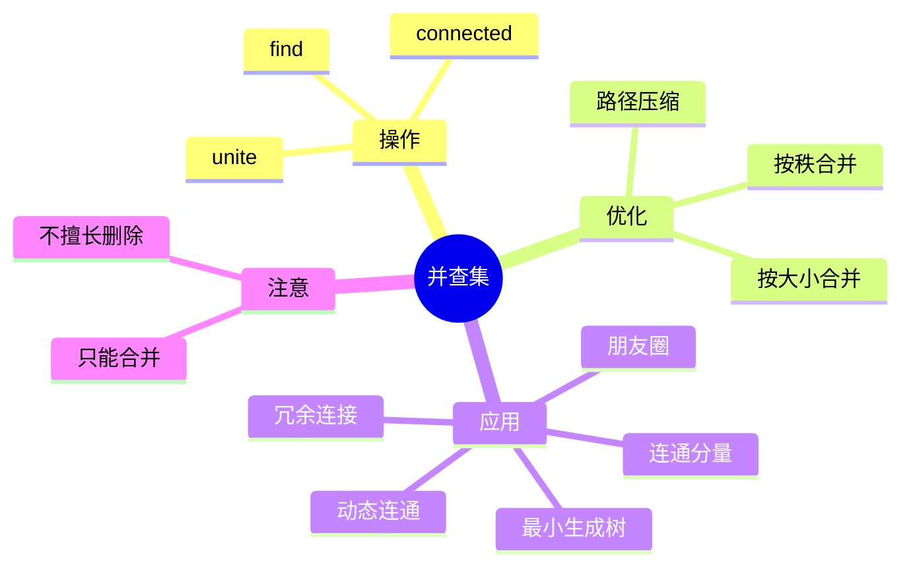
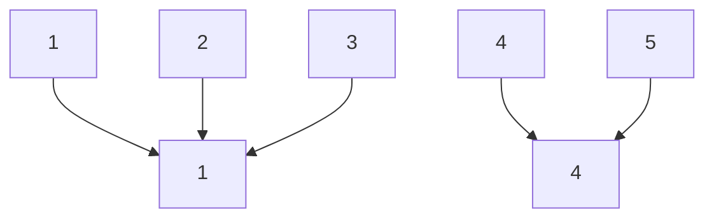
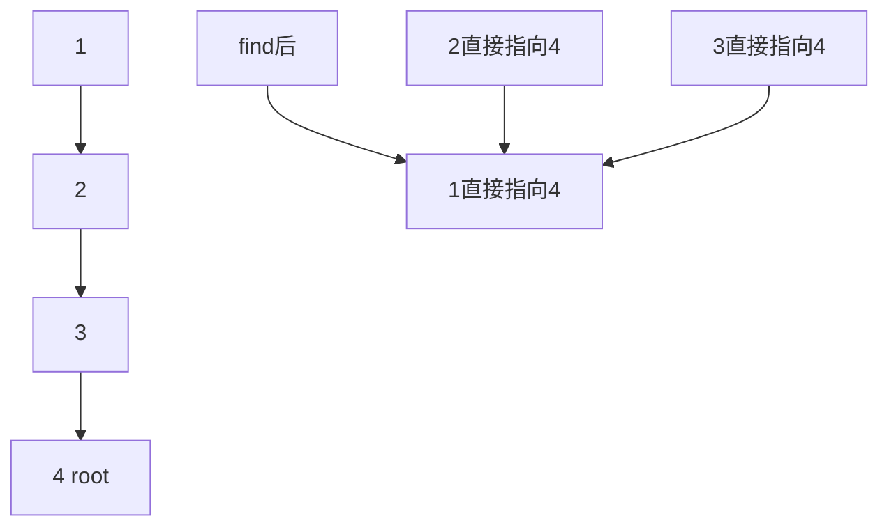
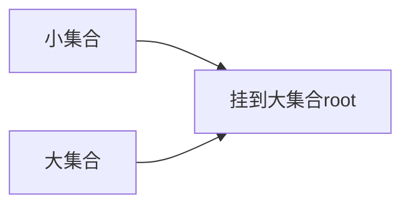
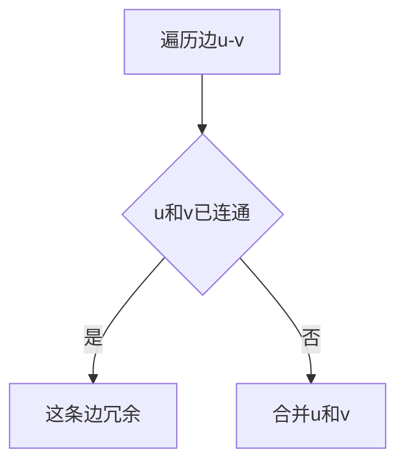
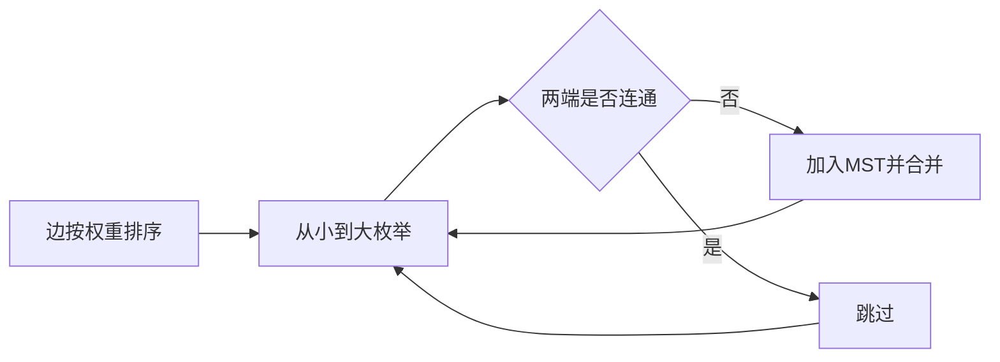

# 07. 并查集 Union-Find

## 学习目标

读完本章，你应该能回答：

1. 并查集解决什么问题？
2. `find` 和 `union` 分别做什么？
3. 路径压缩和按秩合并为什么能接近 O(1)？
4. 并查集适合哪些连通性题目？

## 一句话总纲

并查集用于动态维护“不相交集合”，支持快速判断两个元素是否属于同一集合，以及合并两个集合。

> 记忆口诀：**找代表，合集合；路径压缩让树变矮。**

## 思维导图



## 1. 并查集的核心模型

每个集合用一个代表元 root 表示。



如果两个元素的 root 相同，它们就在同一集合。

## 2. 基础实现

```cpp
#include <bits/stdc++.h>
using namespace std;

class DSU {
private:
    vector<int> parent;
    vector<int> sz;

public:
    DSU(int n) : parent(n), sz(n, 1) {
        iota(parent.begin(), parent.end(), 0);
    }

    int find(int x) {
        if (parent[x] != x) {
            parent[x] = find(parent[x]); // 路径压缩
        }
        return parent[x];
    }

    bool unite(int a, int b) {
        int ra = find(a), rb = find(b);
        if (ra == rb) return false;
        if (sz[ra] < sz[rb]) swap(ra, rb);
        parent[rb] = ra;
        sz[ra] += sz[rb];
        return true;
    }

    bool connected(int a, int b) {
        return find(a) == find(b);
    }
};
```

## 3. 路径压缩

路径压缩让查找过程中经过的节点直接指向根。



这样后续查找会更快。

## 4. 按大小合并

把小树接到大树下面，避免树太高。



路径压缩 + 按大小合并后，单次操作的摊还复杂度接近 O(1)，严格说是反阿克曼函数级别，实际可视为常数。

## 5. 连通分量个数

```cpp
int countComponents(int n, vector<pair<int,int>> edges) {
    DSU dsu(n);
    int cnt = n;
    for (auto [u, v] : edges) {
        if (dsu.unite(u, v)) cnt--;
    }
    return cnt;
}
```

每成功合并两个不同集合，连通分量数减一。

## 6. 冗余连接

在无向图中，如果一条边连接的两个点已经连通，那么这条边会形成环。



```cpp
pair<int,int> findRedundantConnection(vector<pair<int,int>>& edges, int n) {
    DSU dsu(n + 1);
    for (auto [u, v] : edges) {
        if (!dsu.unite(u, v)) return {u, v};
    }
    return {-1, -1};
}
```

## 7. Kruskal 最小生成树

并查集常用于 Kruskal 算法判断加边是否成环。



## 8. 并查集不适合什么？

并查集擅长合并，不擅长删除。

如果题目需要频繁删除边并查询连通性，普通并查集不够，需要更复杂的数据结构或离线逆序处理。

## 9. 常见坑

| 坑 | 说明 |
| --- | --- |
| 忘记路径压缩 | 可能退化 |
| 合并前不找根 | 会破坏结构 |
| 下标从 0 还是 1 | 初始化大小要对应 |
| 误用在删除场景 | 普通并查集不支持高效拆分 |
| 集合大小未更新 | 按大小合并会出错 |

## 10. 学习自检

1. 并查集的 `find` 返回什么？
2. `unite` 返回 false 通常意味着什么？
3. 路径压缩如何优化树高？
4. 并查集为什么适合判断无向图成环？
5. 为什么普通并查集不擅长删除边？
