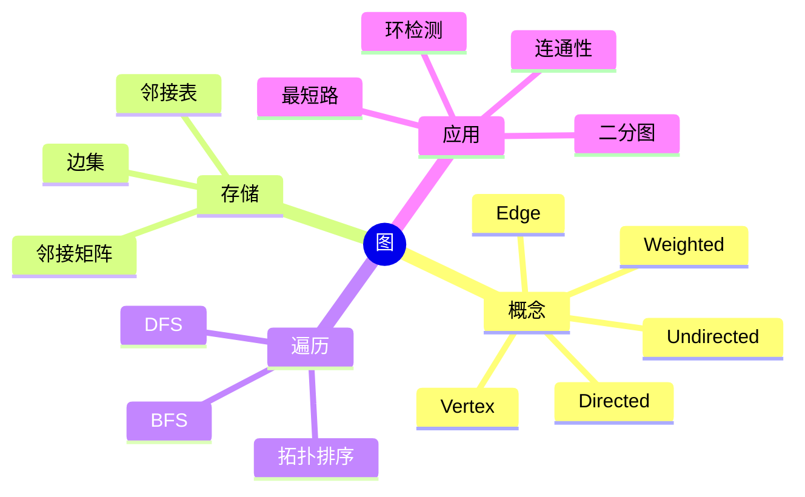
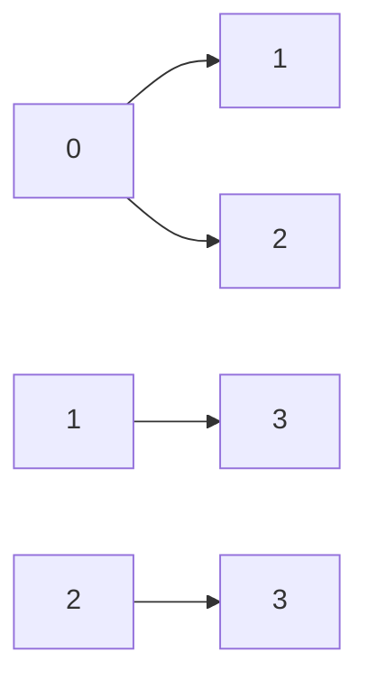
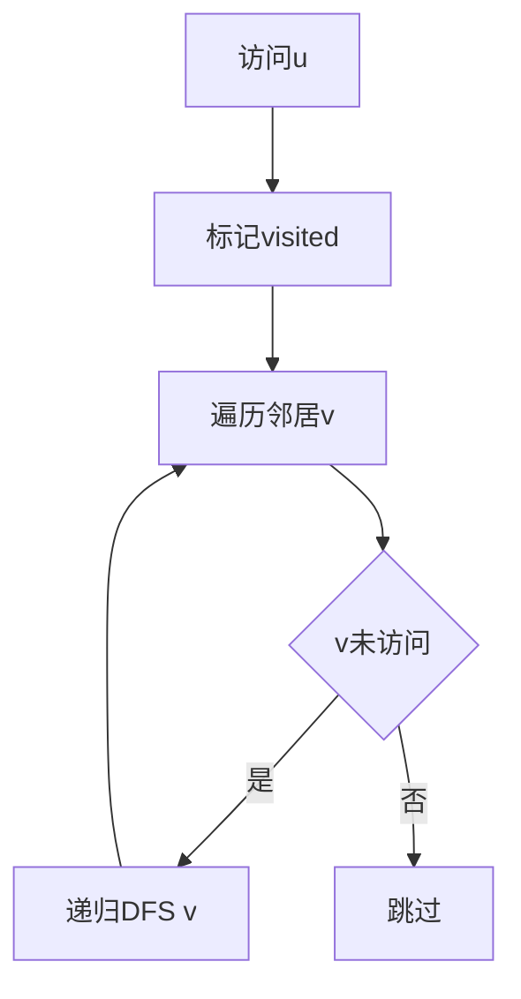
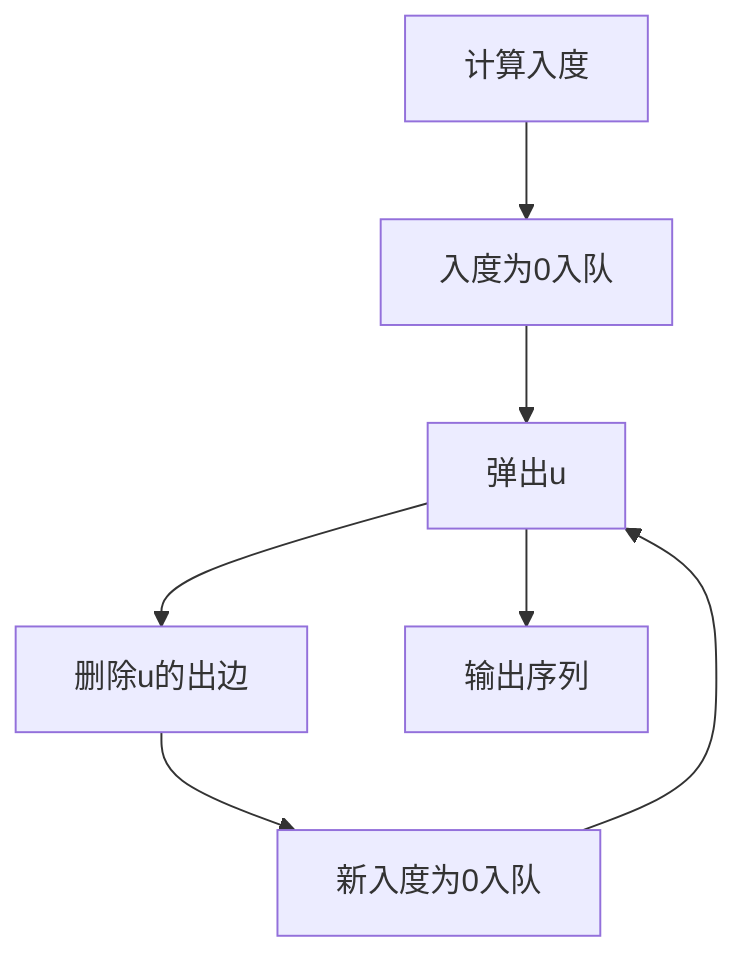

# 08. 图的存储与遍历

## 学习目标

读完本章，你应该能回答：

1. 图有哪些基本概念？
2. 邻接矩阵和邻接表分别适合什么场景？
3. DFS 和 BFS 的区别是什么？
4. 如何用 C++ 存储有向图、无向图、带权图？
5. 图遍历常见边界和坑有哪些？

## 一句话总纲

图描述对象之间的关系；邻接表适合稀疏图，邻接矩阵适合稠密图和 O(1) 判断边是否存在；DFS 偏深度探索，BFS 偏层次扩展。

> 记忆口诀：**点边关系用图存，稀疏邻接表，稠密邻接矩阵；DFS 走到底，BFS 一层层。**

## 思维导图



## 1. 图的基本概念

| 概念 | 说明 |
| --- | --- |
| 顶点 vertex | 图中的对象 |
| 边 edge | 顶点之间的关系 |
| 有向图 | 边有方向 |
| 无向图 | 边无方向 |
| 带权图 | 边带权重 |
| 度 | 与某点相连的边数 |
| 入度/出度 | 有向图中进入/离开某点的边数 |

## 2. 邻接矩阵

邻接矩阵使用 `n × n` 数组表示边。

```mermaid
flowchart TD
  A[graph[u][v]] --> B{是否有边u到v}
  B -- 是 --> C[true或权重]
  B -- 否 --> D[false或INF]
```

优点：

- 判断两点是否有边 O(1)。
- 适合稠密图。

缺点：

- 空间 O(n²)。
- 稀疏图浪费空间。

## 3. 邻接表

邻接表为每个点存它的邻居。



C++ 无权图：

```cpp
int n = 5;
vector<vector<int>> graph(n);

auto addEdge = [&](int u, int v) {
    graph[u].push_back(v);
    graph[v].push_back(u); // 无向图需要加两次
};
```

带权图：

```cpp
vector<vector<pair<int,int>>> graph(n); // pair<neighbor, weight>

auto addEdge = [&](int u, int v, int w) {
    graph[u].push_back({v, w});
    graph[v].push_back({u, w});
};
```

## 4. DFS 深度优先搜索

DFS 一条路走到底，再回溯。



C++ demo：

```cpp
#include <bits/stdc++.h>
using namespace std;

void dfs(int u, vector<vector<int>>& g, vector<int>& vis) {
    vis[u] = 1;
    cout << u << ' ';
    for (int v : g[u]) {
        if (!vis[v]) dfs(v, g, vis);
    }
}

int main() {
    int n = 4;
    vector<vector<int>> g(n);
    g[0] = {1, 2};
    g[1] = {0, 3};
    g[2] = {0};
    g[3] = {1};
    vector<int> vis(n, 0);
    dfs(0, g, vis);
    return 0;
}
```

## 5. BFS 广度优先搜索

BFS 一层层扩展，适合无权图最短路。

```mermaid
flowchart TD
  A[起点入队] --> B[出队u]
  B --> C[遍历邻居v]
  C --> D{v未访问}
  D -- 是 --> E[dist[v]=dist[u]+1并入队]
  D -- 否 --> F[跳过]
  E --> B
```

C++ demo：

```cpp
vector<int> bfs(int start, vector<vector<int>>& g) {
    int n = g.size();
    vector<int> dist(n, -1);
    queue<int> q;
    dist[start] = 0;
    q.push(start);

    while (!q.empty()) {
        int u = q.front();
        q.pop();
        for (int v : g[u]) {
            if (dist[v] == -1) {
                dist[v] = dist[u] + 1;
                q.push(v);
            }
        }
    }
    return dist;
}
```

## 6. 连通分量

无向图中，DFS/BFS 每启动一次新搜索，就找到一个连通分量。

```cpp
int countComponents(vector<vector<int>>& g) {
    int n = g.size();
    vector<int> vis(n, 0);
    int cnt = 0;
    for (int i = 0; i < n; ++i) {
        if (!vis[i]) {
            cnt++;
            dfs(i, g, vis);
        }
    }
    return cnt;
}
```

## 7. 拓扑排序

拓扑排序用于有向无环图 DAG。



如果输出节点数少于 n，说明有环。

## 8. 常见坑

| 坑 | 说明 |
| --- | --- |
| 无向图忘记加双向边 | 连通性错误 |
| 递归 DFS 爆栈 | 大图可改迭代写法 |
| 未标记 visited | 可能死循环 |
| BFS 距离初始化错误 | 未访问常用 -1 |
| 有向无向混淆 | 入度、出度、连通性定义不同 |

## 9. 学习自检

1. 邻接表和邻接矩阵如何选择？
2. BFS 为什么能求无权图最短路？
3. DFS 为什么可能爆栈？
4. 拓扑排序能检测什么？
5. 无向图存边为什么要加两次？
