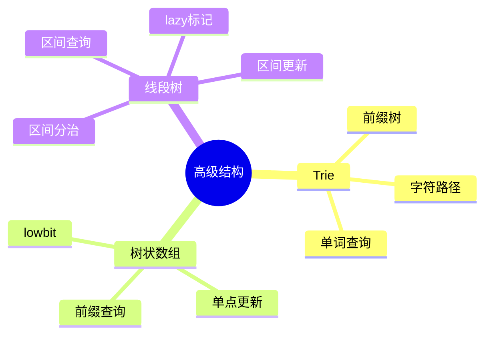
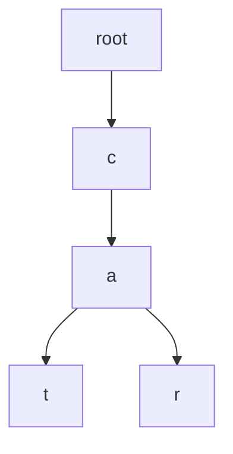
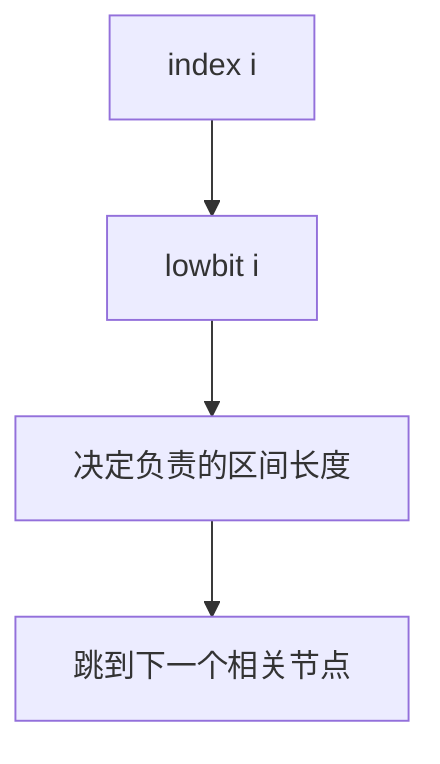
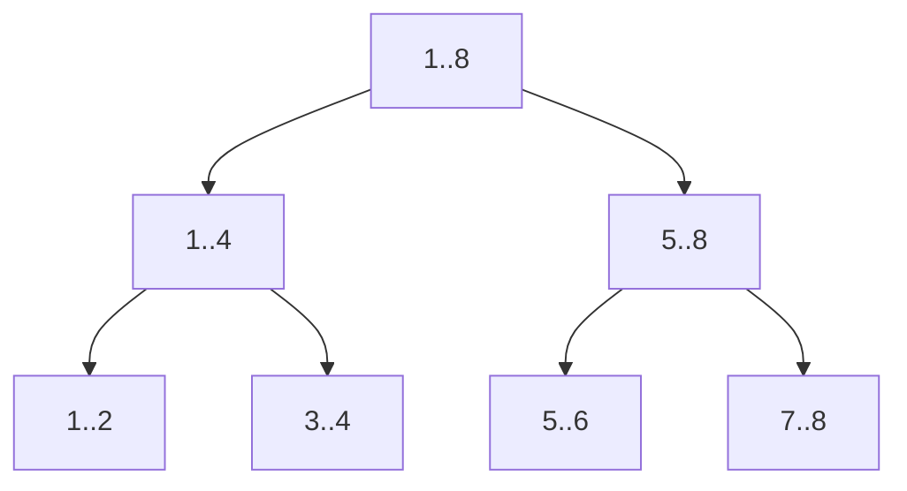
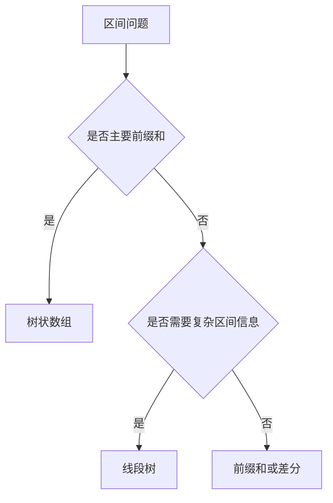

# 09. Trie、树状数组与线段树

## 学习目标

读完本章，你应该能回答：

1. Trie 为什么适合前缀查询？
2. 树状数组 Fenwick Tree 维护什么信息？
3. 线段树为什么适合区间查询和区间更新？
4. 这三类结构分别适合什么题型？

## 一句话总纲

Trie 用字符路径组织字符串前缀；树状数组用二进制 lowbit 维护前缀信息；线段树用分治节点维护区间信息。

> 记忆口诀：**Trie 管前缀，BIT 管前缀和，线段树管区间。**

## 思维导图



## 1. Trie 前缀树

Trie 把字符串按字符路径存储，共享公共前缀。



适合：

- 单词插入。
- 单词查找。
- 前缀查找。
- 自动补全。
- 字典匹配。

C++ demo：只处理小写字母。

```cpp
#include <bits/stdc++.h>
using namespace std;

class Trie {
    struct Node {
        array<int, 26> next{};
        bool end = false;
        Node() { next.fill(-1); }
    };
    vector<Node> tr;

public:
    Trie() { tr.push_back(Node()); }

    void insert(const string& s) {
        int u = 0;
        for (char c : s) {
            int idx = c - 'a';
            if (tr[u].next[idx] == -1) {
                tr[u].next[idx] = tr.size();
                tr.push_back(Node());
            }
            u = tr[u].next[idx];
        }
        tr[u].end = true;
    }

    bool search(const string& s) {
        int u = 0;
        for (char c : s) {
            int idx = c - 'a';
            if (tr[u].next[idx] == -1) return false;
            u = tr[u].next[idx];
        }
        return tr[u].end;
    }

    bool startsWith(const string& prefix) {
        int u = 0;
        for (char c : prefix) {
            int idx = c - 'a';
            if (tr[u].next[idx] == -1) return false;
            u = tr[u].next[idx];
        }
        return true;
    }
};
```

## 2. 树状数组 Fenwick Tree

树状数组支持：

- 单点更新。
- 前缀和查询。

复杂度都是 O(log n)。

核心函数：

```text
lowbit(x) = x & -x
```



C++ demo：

```cpp
#include <bits/stdc++.h>
using namespace std;

class Fenwick {
    int n;
    vector<long long> bit;

public:
    Fenwick(int n) : n(n), bit(n + 1, 0) {}

    void add(int idx, long long delta) {
        for (; idx <= n; idx += idx & -idx) {
            bit[idx] += delta;
        }
    }

    long long sumPrefix(int idx) {
        long long res = 0;
        for (; idx > 0; idx -= idx & -idx) {
            res += bit[idx];
        }
        return res;
    }

    long long rangeSum(int l, int r) {
        return sumPrefix(r) - sumPrefix(l - 1);
    }
};

int main() {
    Fenwick fw(5);
    fw.add(1, 2);
    fw.add(3, 5);
    cout << fw.rangeSum(1, 3) << "\n";
    return 0;
}
```

注意：树状数组通常使用 1-based 下标。

## 3. 线段树

线段树把区间递归拆成左右子区间，每个节点维护一个区间的信息。



适合：

- 区间和。
- 区间最大值。
- 区间最小值。
- 单点修改。
- 区间修改配合 lazy 标记。

## 4. 线段树区间和 demo

```cpp
#include <bits/stdc++.h>
using namespace std;

class SegmentTree {
    int n;
    vector<long long> tree;

    void build(vector<int>& a, int node, int l, int r) {
        if (l == r) {
            tree[node] = a[l];
            return;
        }
        int mid = (l + r) / 2;
        build(a, node * 2, l, mid);
        build(a, node * 2 + 1, mid + 1, r);
        tree[node] = tree[node * 2] + tree[node * 2 + 1];
    }

    void update(int node, int l, int r, int idx, int val) {
        if (l == r) {
            tree[node] = val;
            return;
        }
        int mid = (l + r) / 2;
        if (idx <= mid) update(node * 2, l, mid, idx, val);
        else update(node * 2 + 1, mid + 1, r, idx, val);
        tree[node] = tree[node * 2] + tree[node * 2 + 1];
    }

    long long query(int node, int l, int r, int ql, int qr) {
        if (ql <= l && r <= qr) return tree[node];
        int mid = (l + r) / 2;
        long long res = 0;
        if (ql <= mid) res += query(node * 2, l, mid, ql, qr);
        if (qr > mid) res += query(node * 2 + 1, mid + 1, r, ql, qr);
        return res;
    }

public:
    SegmentTree(vector<int>& a) {
        n = a.size();
        tree.assign(4 * n, 0);
        build(a, 1, 0, n - 1);
    }

    void update(int idx, int val) {
        update(1, 0, n - 1, idx, val);
    }

    long long query(int l, int r) {
        return query(1, 0, n - 1, l, r);
    }
};
```

## 5. 树状数组 vs 线段树

| 维度 | 树状数组 | 线段树 |
| --- | --- | --- |
| 实现 | 简洁 | 较复杂 |
| 空间 | O(n) | O(4n) 常见 |
| 单点更新 | O(log n) | O(log n) |
| 区间查询 | 前缀可差分 | 灵活 |
| 区间更新 | 可扩展但技巧性强 | lazy 标记更通用 |
| 信息类型 | 前缀可合并信息 | 任意可合并区间信息 |



## 6. 常见坑

| 坑 | 说明 |
| --- | --- |
| Trie 字符集假设 | 不都是小写字母时要改结构 |
| Trie 内存大 | 节点多，字符集大时尤其明显 |
| Fenwick 下标 | 常用 1-based，0 会死循环 |
| 线段树数组大小 | 通常开 4n |
| 区间边界 | `[l,r]` 和 `[l,r)` 不要混用 |

## 7. 学习自检

1. Trie 为什么适合前缀查询？
2. `lowbit(x)` 表示什么？
3. 树状数组为什么通常用 1-based 下标？
4. 线段树每个节点维护什么？
5. 什么时候线段树比树状数组更合适？
