# 10. 数据结构面试 50 问：从复杂度到 C++ 实现

## 使用方式

这份文档用于面试复习。每个问题都按“先说结论、再讲原理、最后讲代码或坑”的方式组织。

> 答题口诀：**先复杂度，后不变量；先场景，后实现；先边界，后优化。**

---

## 思维导图：高频考点地图

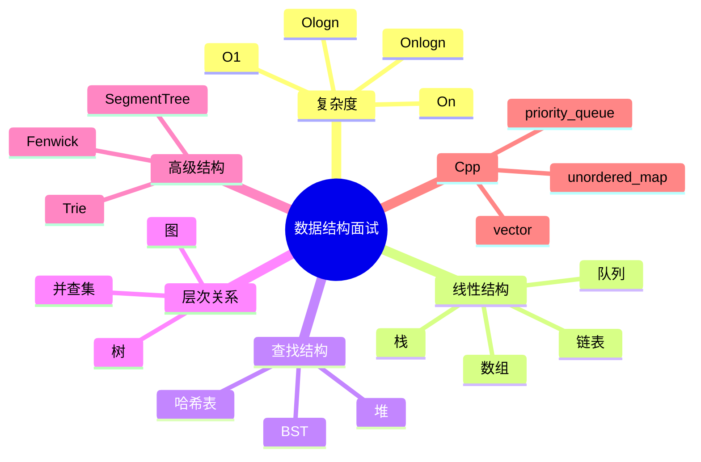

---

## Q1. 数组和链表的区别是什么？

### 标准回答

数组使用连续内存，支持 O(1) 下标随机访问，但中间插入删除通常需要 O(n) 移动元素。链表使用指针连接节点，不要求连续内存，随机访问 O(n)，但已知节点位置时插入删除可以 O(1) 修改指针。

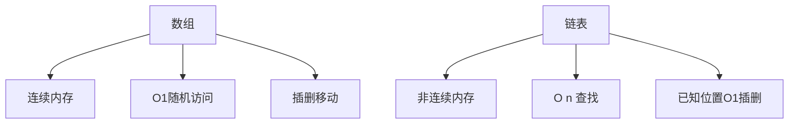

### 追问

链表不一定比数组插入快，因为如果需要先查找插入位置，查找本身是 O(n)。

---

## Q2. `vector` 的 `push_back` 为什么是摊还 O(1)？

### 标准回答

`vector` 容量不足时会扩容并搬移旧元素，单次扩容是 O(n)。但扩容通常按倍数增长，n 次尾插中总搬移次数是 O(n)，所以平均到每次 `push_back` 是摊还 O(1)。

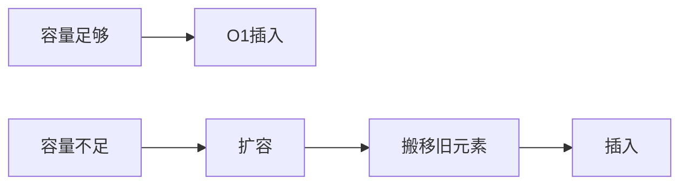

---

## Q3. 哈希表为什么平均 O(1)？什么时候会退化？

### 标准回答

哈希表通过哈希函数把 key 映射到桶位置，理想情况下每个桶元素很少，因此查找、插入、删除平均 O(1)。当大量 key 冲突到同一桶、哈希函数差或负载因子过高时，会退化，极端情况下可能接近 O(n)。

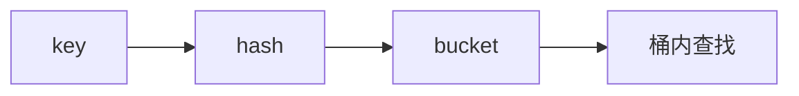

---

## Q4. `unordered_map` 和 `map` 如何选择？

### 标准回答

如果只需要快速查找、插入、计数，优先 `unordered_map`，平均 O(1)。如果需要 key 有序、范围查询、按顺序遍历或更稳定的 O(log n) 最坏复杂度，选择 `map`。

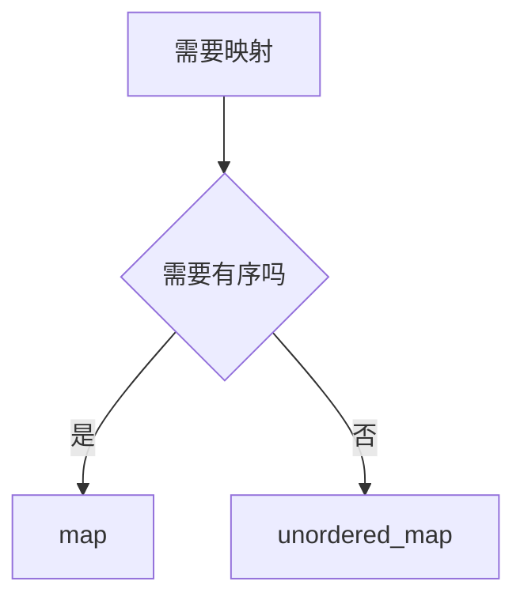

---

## Q5. 栈适合解决什么问题？

### 标准回答

栈后进先出，适合处理最近未完成的状态，例如括号匹配、表达式求值、递归模拟、DFS、单调栈等。

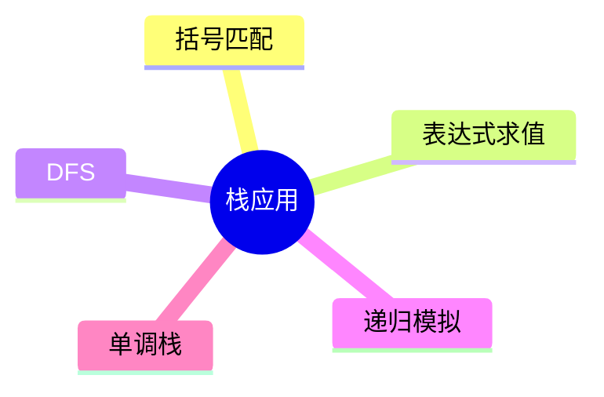

---

## Q6. 单调栈为什么能 O(n) 找下一个更大元素？

### 标准回答

单调栈维护一个尚未找到答案的下标集合。当新元素比栈顶大时，新元素就是栈顶元素的下一个更大值，弹出栈顶。每个元素最多入栈一次、出栈一次，所以总复杂度 O(n)。

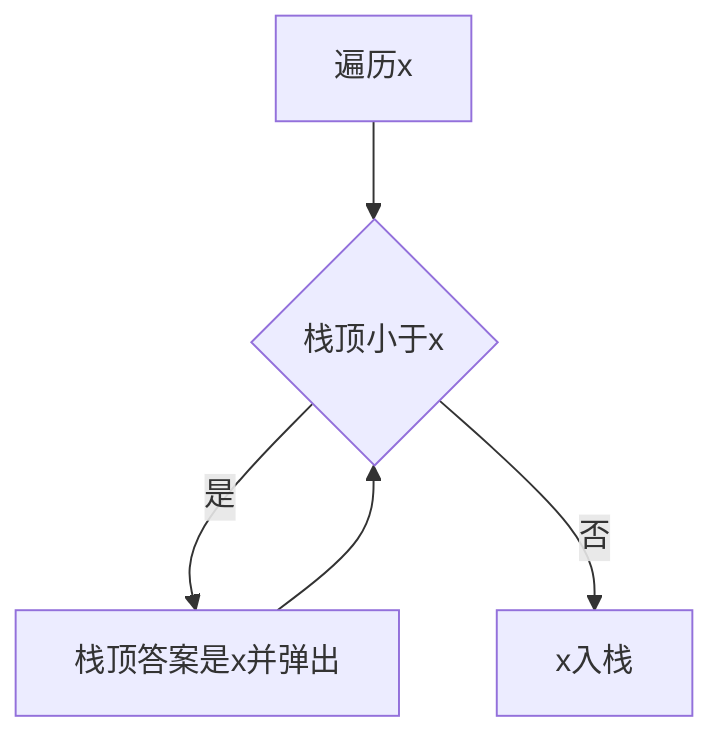

---

## Q7. 队列和 BFS 的关系是什么？

### 标准回答

队列先进先出，天然支持按层扩展。BFS 从起点开始，把当前层节点出队，再把下一层节点入队，因此能在无权图中第一次到达某点时得到最短步数。


---

## Q8. 单调队列如何维护滑动窗口最大值？

### 标准回答

单调队列保存下标，并让对应值从队首到队尾单调递减。新元素进入时弹出队尾所有不可能再成为最大值的较小元素；窗口滑动时弹出过期队首。队首始终是当前窗口最大值。

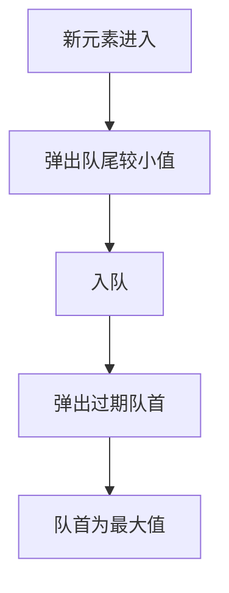

---

## Q9. 二叉树前序、中序、后序遍历区别是什么？

### 标准回答

区别在访问根节点的时机。前序是根左右，中序是左根右，后序是左右根。BST 的中序遍历会得到有序序列。

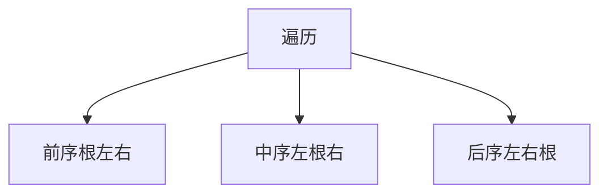

---

## Q10. 如何判断一棵树是合法 BST？

### 标准回答

不能只比较节点和直接孩子，而要维护每个节点允许的取值范围。左子树所有节点必须小于根，右子树所有节点必须大于根，这个约束会跨层传递。

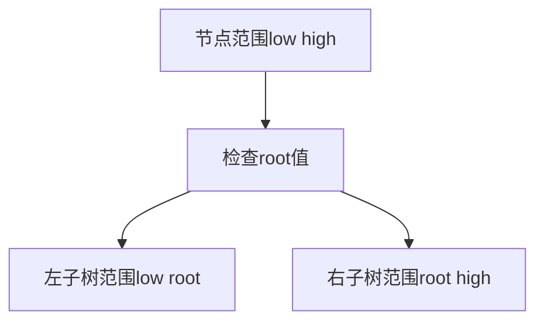

C++ 核心：

```cpp
bool valid(TreeNode* root, long long low, long long high) {
    if (!root) return true;
    if (root->val <= low || root->val >= high) return false;
    return valid(root->left, low, root->val) &&
           valid(root->right, root->val, high);
}
```

---

## Q11. 堆和 BST 有什么区别？

### 标准回答

堆只保证父子之间的优先级关系，堆顶是最值，但整体不有序；BST 保证左小右大，中序遍历有序。堆适合动态最值和 Top K，BST 适合有序查找和范围查询。

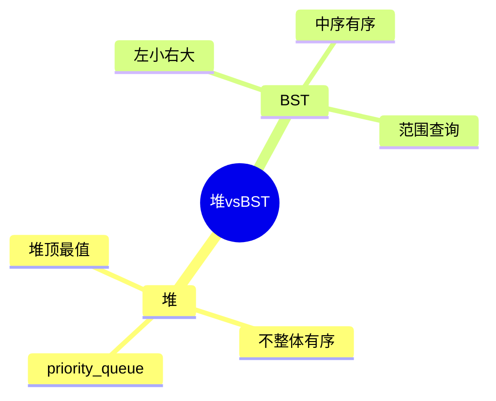

---

## Q12. `priority_queue` 如何实现小根堆？

### 标准回答

C++ `priority_queue<int>` 默认大根堆。小根堆可以写：

```cpp
priority_queue<int, vector<int>, greater<int>> pq;
```

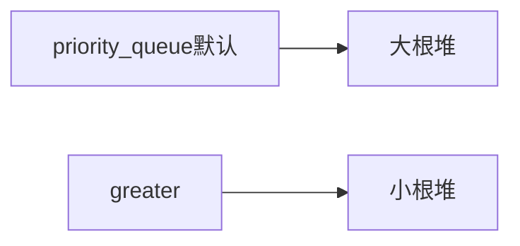

---

## Q13. 并查集解决什么问题？

### 标准回答

并查集维护不相交集合，支持快速查找代表元、合并集合、判断两个元素是否连通。常用于连通分量、朋友圈、冗余连接、Kruskal 最小生成树。

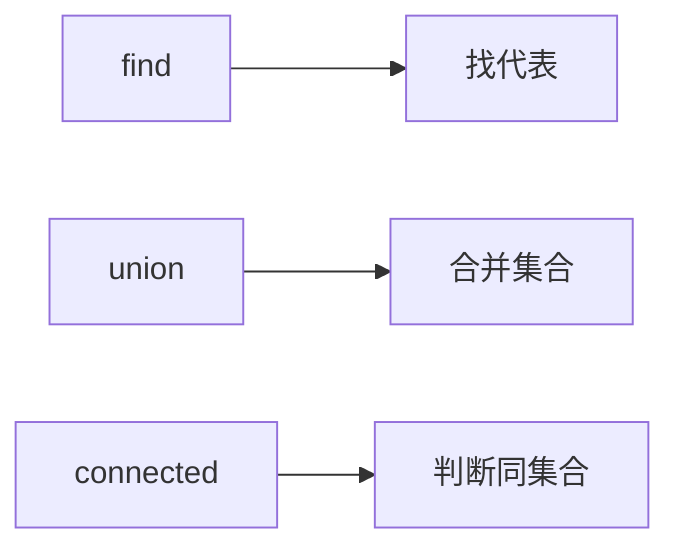

---

## Q14. 路径压缩是什么？

### 标准回答

路径压缩在 `find` 时把沿途节点直接挂到根节点下，降低树高，使后续查找更快。配合按大小或按秩合并后，摊还复杂度接近 O(1)。

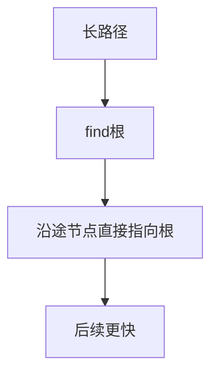

---

## Q15. 邻接表和邻接矩阵如何选择？

### 标准回答

邻接矩阵空间 O(n²)，适合稠密图和需要 O(1) 判断边是否存在的场景。邻接表空间 O(n+m)，适合稀疏图和遍历邻居。

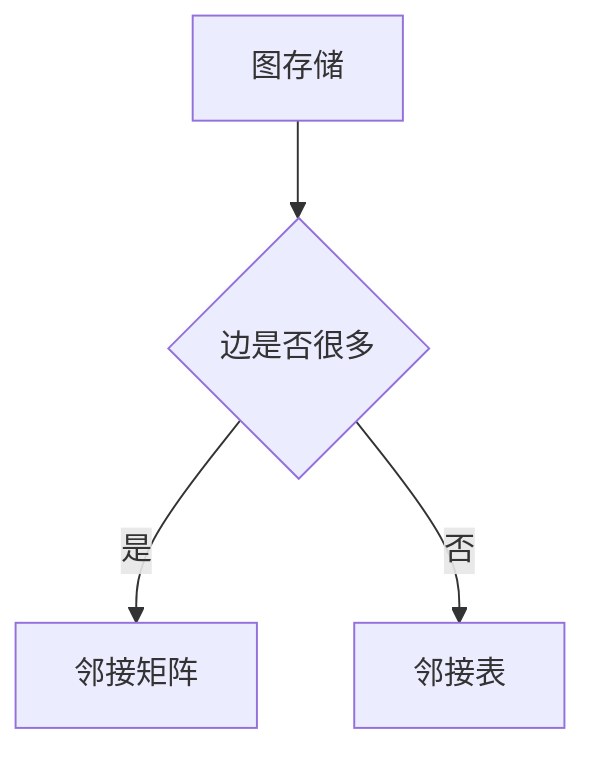

---

## Q16. DFS 和 BFS 有什么区别？

### 标准回答

DFS 深度优先，适合连通性、回溯、拓扑相关搜索；BFS 广度优先，按层扩展，适合无权图最短路和层序遍历。DFS 常用递归或栈，BFS 常用队列。

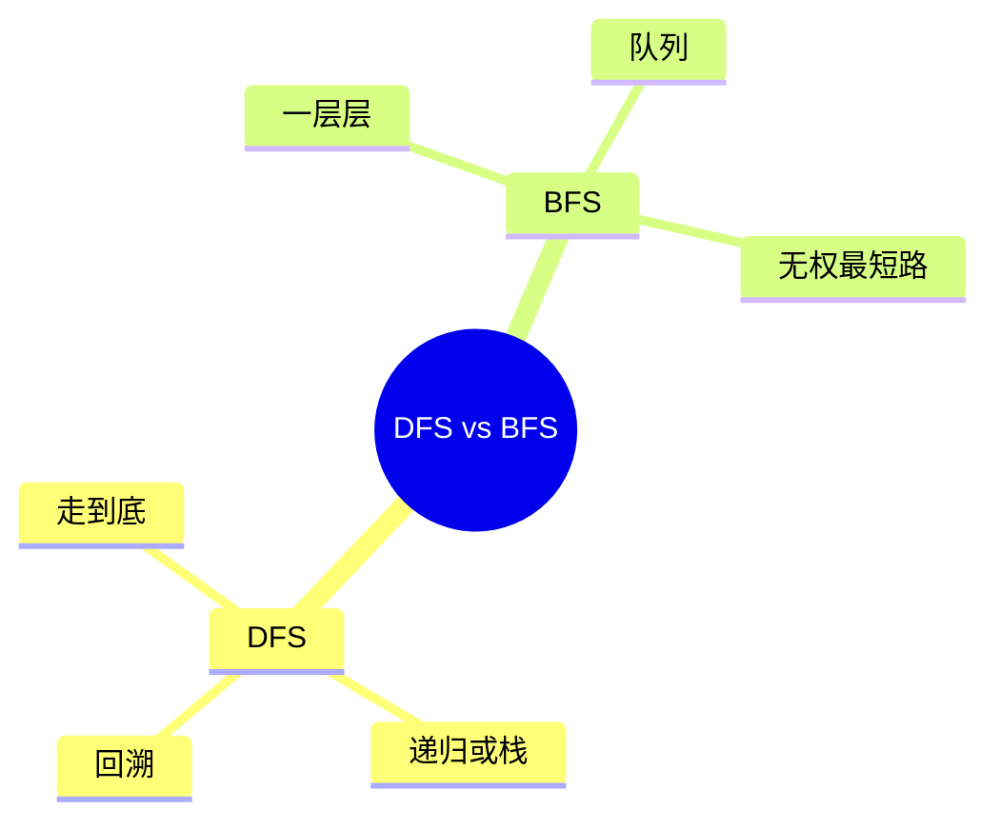

---

## Q17. Trie 为什么适合前缀查询？

### 标准回答

Trie 把字符串按字符路径存储，公共前缀共享同一路径。查找某个前缀只需沿字符走一遍，复杂度与前缀长度相关，而不是与字典中单词数量直接相关。

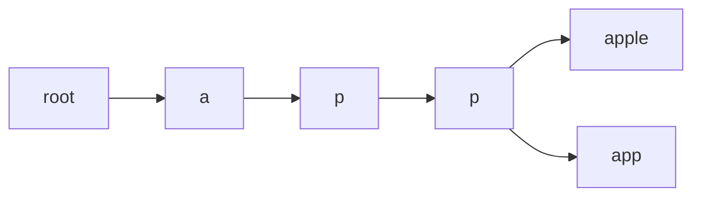

---

## Q18. 树状数组和线段树有什么区别？

### 标准回答

树状数组实现简单，适合前缀和、单点更新和区间和查询；线段树更通用，适合维护各种可合并区间信息，支持更复杂的区间查询和区间更新，但实现更复杂。

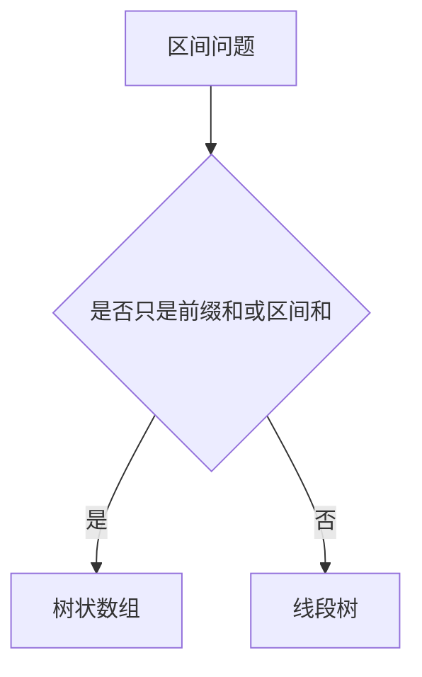

---

## Q19. 如何根据题目选择数据结构？

### 标准回答

先看操作需求。如果要下标访问，用数组；要最近元素，用栈；要先进先出，用队列；要快速查找，用哈希表；要动态最值，用堆；要连通性，用并查集；要前缀字符串，用 Trie；要区间查询和更新，用树状数组或线段树。

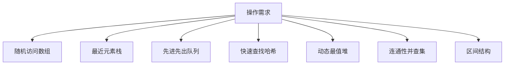

---

## Q20. 写数据结构代码时最重要的习惯是什么？

### 标准回答

最重要的是明确不变量、边界和复杂度。写前先知道结构维护什么，操作后不变量是否仍成立；处理空结构、单元素、重复值、越界、内存释放；最后用小样例验证复杂度和正确性。

```mermaid
flowchart LR
  A[明确不变量] --> B[写操作]
  B --> C[处理边界]
  C --> D[小样例验证]
  D --> E[复杂度检查]
```

---


## Q21. 什么是时间复杂度和空间复杂度？

### 标准回答

时间复杂度描述算法运行时间随输入规模增长的趋势；空间复杂度描述额外内存随输入规模增长的趋势。它们不关心具体机器上的绝对时间，而关心规模扩大后的增长速度。

```mermaid
flowchart TD
  A[复杂度分析] --> B[时间复杂度]
  A --> C[空间复杂度]
  B --> D[操作次数增长趋势]
  C --> E[额外内存增长趋势]
```

### 追问

面试中通常默认分析最坏复杂度；哈希表等结构常说平均复杂度时，需要补充最坏退化情况。

---

## Q22. 什么是摊还复杂度？和平均复杂度一样吗？

### 标准回答

摊还复杂度是把一系列操作的总成本平均到每次操作上，例如 `vector::push_back` 偶尔扩容 O(n)，但连续 n 次尾插总成本 O(n)，所以摊还 O(1)。平均复杂度通常依赖输入分布或随机性，两者不是同一个概念。

```mermaid
flowchart LR
  A[一系列操作] --> B[总成本]
  B --> C[平均分摊到每次]
  C --> D[摊还复杂度]
```

---

## Q23. C++ `vector`、`deque`、`list` 的区别是什么？

### 标准回答

`vector` 是连续动态数组，随机访问快，尾插高效；`deque` 是双端队列，两端插删高效，也支持随机访问但缓存局部性通常不如 `vector`；`list` 是双向链表，已知位置插删 O(1)，但随机访问 O(n)，缓存不友好。

```mermaid
mindmap
  root((顺序容器))
    vector
      连续内存
      随机访问
      尾插高效
    deque
      双端操作
      分段存储
      随机访问
    list
      双向链表
      插删灵活
      无随机访问
```

---

## Q24. 迭代器失效是什么？哪些操作容易导致失效？

### 标准回答

迭代器失效是指容器结构变化后，原来指向元素的迭代器、指针或引用不再可靠。`vector` 扩容会使所有旧迭代器失效；中间插入删除会使插入点之后迭代器失效；`unordered_map` rehash 会使迭代器失效。

```mermaid
flowchart TD
  A[容器修改] --> B{是否搬移或重建内部存储}
  B -- 是 --> C[旧迭代器失效]
  B -- 否 --> D[部分或不失效]
```

### C++ 记忆

```text
vector怕扩容，unordered_map怕rehash，erase后被删元素迭代器一定不能再用。
```

---

## Q25. 链表如何删除倒数第 N 个节点？

### 标准回答

使用 dummy 节点和快慢指针。快指针先走 n 步，然后快慢一起走，直到快指针到末尾，此时慢指针位于待删除节点前驱，修改 `slow->next` 即可。

```mermaid
flowchart TD
  A[dummy] --> B[fast先走n步]
  B --> C[fast和slow一起走]
  C --> D[slow到删除节点前驱]
  D --> E[修改next删除]
```

### C++ 核心

```cpp
ListNode* removeNthFromEnd(ListNode* head, int n) {
    ListNode dummy(0);
    dummy.next = head;
    ListNode* fast = &dummy;
    ListNode* slow = &dummy;
    for (int i = 0; i < n; ++i) fast = fast->next;
    while (fast->next) {
        fast = fast->next;
        slow = slow->next;
    }
    ListNode* del = slow->next;
    slow->next = del->next;
    delete del;
    return dummy.next;
}
```

---

## Q26. 如何判断链表是否有环并找到环入口？

### 标准回答

用快慢指针。若有环，快慢指针会在环中相遇。相遇后，让一个指针从 head 出发，另一个从相遇点出发，每次走一步，它们再次相遇的位置就是环入口。

```mermaid
flowchart TD
  A[slow一步fast两步] --> B{是否相遇}
  B -- 否且fast为空 --> C[无环]
  B -- 是 --> D[一个回head]
  D --> E[两个指针同步走]
  E --> F[相遇点是入口]
```

---

## Q27. 如何用两个栈实现队列？

### 标准回答

使用输入栈 `in` 和输出栈 `out`。入队时压入 `in`；出队时如果 `out` 为空，就把 `in` 中元素全部倒入 `out`，再弹出 `out` 栈顶。每个元素最多进出两个栈，摊还 O(1)。

```mermaid
flowchart LR
  A[push进入in栈] --> B{pop时out为空吗}
  B -- 是 --> C[in倒入out]
  B -- 否 --> D[out弹出]
  C --> D
```

---

## Q28. 如何用两个队列实现栈？

### 标准回答

可以用一个主队列和一个辅助队列。每次 `push` 后，把之前的元素依次移到新元素后面，让队首始终是最新元素；这样 `pop` 就是弹出队首。也可在 `pop` 时搬移到只剩最后一个元素。

```mermaid
flowchart TD
  A[push新元素] --> B[入辅助队列]
  B --> C[主队列元素依次搬到辅助队列]
  C --> D[交换主辅队列]
  D --> E[队首就是栈顶]
```

---

## Q29. LRU Cache 应该用什么数据结构实现？

### 标准回答

LRU Cache 需要 O(1) 查询、插入、删除和移动到最近使用位置。通常用哈希表加双向链表：哈希表从 key 找节点，双向链表按最近使用顺序排列，头部最新，尾部最旧。

```mermaid
flowchart LR
  A[unordered_map key到节点] --> B[双向链表节点]
  C[head最新] <--> D[node]
  D <--> E[tail最旧]
```

### 追问

C++ 可以用 `list<pair<int,int>>` 加 `unordered_map<int, list<pair<int,int>>::iterator>` 实现。

---

## Q30. 哈希表如何处理自定义结构作为 key？

### 标准回答

自定义 key 需要提供相等比较和哈希函数。比如 `pair<int,int>` 可写自定义 functor，把两个整数混合成一个 `size_t`。哈希函数应尽量分布均匀，减少冲突。

```mermaid
flowchart LR
  A[自定义key] --> B[operator==]
  A --> C[hash函数]
  C --> D[桶位置]
```

### C++ 示例

```cpp
struct PairHash {
    size_t operator()(const pair<int,int>& p) const {
        return hash<long long>()(((long long)p.first << 32) ^ (unsigned int)p.second);
    }
};
```

---

## Q31. 什么是二叉树的最近公共祖先 LCA？

### 标准回答

LCA 是两个节点在树中最深的公共祖先。对普通二叉树，可以递归：如果当前节点为空或等于 p/q，返回当前节点；分别在左右子树查找，如果左右都找到，当前节点就是 LCA；否则返回非空的一边。

```mermaid
flowchart TD
  A[当前root] --> B{root为空或等于p/q}
  B -- 是 --> C[返回root]
  B -- 否 --> D[查左子树]
  D --> E[查右子树]
  E --> F{左右都非空}
  F -- 是 --> G[root是LCA]
  F -- 否 --> H[返回非空一边]
```

---

## Q32. 如何由前序和中序遍历重建二叉树？

### 标准回答

前序第一个元素是根；在中序中找到根的位置，左边是左子树，右边是右子树。再根据左子树大小切分前序数组，递归构建左右子树。

```mermaid
flowchart TD
  A[前序首元素] --> B[确定root]
  B --> C[在中序定位root]
  C --> D[切分左子树和右子树]
  D --> E[递归构建]
```

### 复杂度

如果用哈希表记录中序位置，整体 O(n)。否则每次线性查找会退化到 O(n²)。

---

## Q33. 平衡二叉树和完全二叉树有什么区别？

### 标准回答

平衡二叉树强调左右子树高度差受限，目的是保证操作复杂度；完全二叉树强调节点从上到下、从左到右尽量填满，常用于堆的数组存储。两者关注点不同。

```mermaid
mindmap
  root((树形性质))
    平衡二叉树
      高度差受限
      保证查找效率
    完全二叉树
      层级填满
      最后一层靠左
      适合堆
```

---

## Q34. 红黑树和 AVL 树有什么区别？

### 标准回答

AVL 树更严格平衡，查询效率略好，但插入删除旋转可能更多；红黑树是近似平衡，插入删除调整成本较低，工程中更常用于有序 map/set。C++ `map` 和 `set` 通常基于红黑树一类平衡树实现。

```mermaid
flowchart TD
  A[平衡BST] --> B[AVL]
  A --> C[红黑树]
  B --> B1[平衡更严格]
  C --> C1[更新更折中]
```

---

## Q35. 堆排序的基本过程是什么？

### 标准回答

堆排序先把数组建成大根堆，然后不断把堆顶最大值交换到数组末尾，缩小堆范围并下沉恢复堆性质。时间复杂度 O(n log n)，原地排序，但通常不稳定。

```mermaid
flowchart LR
  A[建大根堆] --> B[堆顶与末尾交换]
  B --> C[堆大小减一]
  C --> D[下沉恢复堆]
  D --> B
```

---

## Q36. 如何用堆求数据流中位数？

### 标准回答

用两个堆：大根堆维护较小一半，小根堆维护较大一半。保持两个堆大小差不超过 1，并保证大根堆堆顶不大于小根堆堆顶。中位数由两个堆顶决定。

```mermaid
flowchart LR
  A[较小一半大根堆] --> C[中位数]
  B[较大一半小根堆] --> C
```

---

## Q37. 图中如何判断是否有环？

### 标准回答

无向图可用 DFS 记录父节点，访问到已访问且不是父节点的邻居则有环，也可用并查集。 有向图可用 DFS 三色标记，遇到正在访问的灰色节点说明有环；也可用拓扑排序，若无法输出全部节点则有环。

```mermaid
mindmap
  root((图判环))
    无向图
      DFS父节点
      并查集
    有向图
      三色DFS
      拓扑排序
```

---

## Q38. 什么是拓扑排序？适用条件是什么？

### 标准回答

拓扑排序是对有向无环图 DAG 的节点排序，使得每条边 `u -> v` 中 u 都排在 v 前面。常用 Kahn 算法：入度为 0 的点入队，弹出后删除其出边，新的入度为 0 的点继续入队。

```mermaid
flowchart TD
  A[计算入度] --> B[入度0入队]
  B --> C[弹出节点]
  C --> D[邻居入度减一]
  D --> E{新入度为0}
  E -- 是 --> B
```

---

## Q39. BFS 为什么能求无权图最短路？

### 标准回答

BFS 从起点按层扩展，第 k 层表示距离起点 k 条边的所有节点。由于队列先进先出，第一次访问某节点时一定是最少边数路径，因此能求无权图最短路。

```mermaid
flowchart LR
  A[距离0] --> B[距离1]
  B --> C[距离2]
  C --> D[距离3]
```

---

## Q40. Dijkstra 算法为什么需要优先队列？

### 标准回答

Dijkstra 每次选择当前未确定的最短距离节点进行松弛。优先队列可以快速取出当前距离最小的候选节点，使稀疏图实现复杂度达到 O((n+m) log n)。适用于边权非负的图。

```mermaid
flowchart TD
  A[起点dist为0] --> B[小根堆取最小dist]
  B --> C[松弛邻边]
  C --> D[更新后入堆]
  D --> B
```

---

## Q41. 并查集如何支持集合大小查询？

### 标准回答

在根节点维护 `size` 数组，表示该集合元素个数。合并两个根时，把小集合挂到大集合，并更新新根的大小。查询某元素集合大小时，先 `find(x)` 找根，再返回 `size[root]`。

```mermaid
flowchart LR
  A[find x] --> B[root]
  B --> C[size root]
```

---

## Q42. 并查集能否支持删除？为什么困难？

### 标准回答

普通并查集天然支持合并，不支持高效拆分。路径压缩会丢失原树结构信息，删除一个元素或一条边后，不容易知道集合如何重新分裂。删除场景通常需要离线逆序、动态连通性结构或重新建图。

```mermaid
flowchart TD
  A[并查集合并] --> B[信息压缩]
  B --> C[容易知道同集合]
  C --> D[不容易拆回原结构]
```

---

## Q43. Trie 的空间复杂度为什么可能很高？如何优化？

### 标准回答

Trie 每个节点可能保存一个字符集大小的孩子数组，例如小写字母是 26。如果字符集大或节点多，空间会很高。可用哈希表存孩子、压缩 Trie、只存存在的边，或根据字符集选择紧凑结构。

```mermaid
flowchart TD
  A[Trie节点] --> B{字符集小吗}
  B -- 是 --> C[数组孩子]
  B -- 否 --> D[哈希表或map孩子]
```

---

## Q44. 树状数组的 `lowbit` 是什么？

### 标准回答

`lowbit(x) = x & -x`，表示 x 的二进制中最低位的 1 对应的值。树状数组用它决定每个节点负责的区间长度，以及更新和查询时跳转到哪些节点。

```mermaid
flowchart LR
  A[x] --> B[x与负x按位与]
  B --> C[最低位1的值]
  C --> D[跳转步长]
```

---

## Q45. 线段树的 lazy 标记解决什么问题？

### 标准回答

lazy 标记用于区间更新。若一个更新完全覆盖当前节点区间，不立即递归更新所有子节点，而是在当前节点记录延迟标记。等将来访问子节点时再下推，从而把区间更新复杂度控制在 O(log n)。

```mermaid
flowchart TD
  A[区间更新覆盖节点] --> B[更新节点信息]
  B --> C[记录lazy标记]
  C --> D[需要访问子节点时下推]
```

---

## Q46. 前缀和、差分、树状数组、线段树如何选择？

### 标准回答

静态区间和用前缀和；多次离线区间加、最后查询最终数组用差分；动态单点更新和区间和查询用树状数组；更复杂的动态区间查询或区间更新用线段树。

```mermaid
flowchart TD
  A[区间问题] --> B{是否有动态修改}
  B -- 否 --> C[前缀和]
  B -- 是 --> D{是否只需单点更新和区间和}
  D -- 是 --> E[树状数组]
  D -- 否 --> F[线段树]
  C --> G{是否多次区间加最终查询}
  G -- 是 --> H[差分]
```

---

## Q47. 什么是稳定排序？哪些常见排序稳定？

### 标准回答

稳定排序指相等元素排序前后的相对顺序不变。归并排序、插入排序、冒泡排序通常稳定；快速排序、堆排序、选择排序通常不稳定。C++ 中 `stable_sort` 保证稳定，`sort` 不保证稳定。

```mermaid
mindmap
  root((排序稳定性))
    稳定
      归并排序
      插入排序
      冒泡排序
      stable_sort
    不稳定
      快速排序
      堆排序
      选择排序
      sort
```

---

## Q48. 快速排序和归并排序有什么区别？

### 标准回答

快速排序通过 pivot 分区，平均 O(n log n)，原地性好，但最坏 O(n²)，通常不稳定。归并排序通过递归拆分再合并，稳定，时间 O(n log n)，但需要 O(n) 额外空间。

```mermaid
flowchart TD
  A[排序] --> B[快速排序]
  B --> B1[分区]
  B --> B2[平均快]
  A --> C[归并排序]
  C --> C1[分治合并]
  C --> C2[稳定但需额外空间]
```

---

## Q49. 什么是跳表？它和平衡树有什么关系？

### 标准回答

跳表是在有序链表上增加多级索引，通过随机层数让查找、插入、删除的期望复杂度达到 O(log n)。它和树一样支持有序动态集合，但实现思路是多层链表，而不是旋转维护平衡。

```mermaid
flowchart TD
  A[顶层稀疏索引] --> B[中层索引]
  B --> C[底层完整链表]
  C --> D[有序数据]
```

---

## Q50. 面试中如何系统分析一道数据结构题？

### 标准回答

先抽象操作：要查、插、删、取最值、区间查询、连通性还是前缀匹配；再估算数据规模决定复杂度上限；然后选择维护不变量的数据结构；写出核心操作；最后检查边界、重复值、空结构、溢出和 C++ 容器特性。

```mermaid
flowchart LR
  A[读题] --> B[抽象操作]
  B --> C[看数据规模]
  C --> D[选数据结构]
  D --> E[写不变量]
  E --> F[实现和边界]
  F --> G[复杂度复盘]
```

---

## 面试快速复盘表

| 结构 | 核心不变量 | 典型复杂度 | 典型应用 |
| --- | --- | --- | --- |
| 数组 | 连续内存 | 访问 O(1) | 下标访问、前缀和 |
| 链表 | 指针连接 | 查找 O(n) | 局部插删 |
| 栈 | 后进先出 | O(1) | 括号、递归、单调栈 |
| 队列 | 先进先出 | O(1) | BFS |
| 哈希表 | key 到桶 | 平均 O(1) | 计数、去重 |
| BST | 左小右大 | O(log n) 平均 | 有序查找 |
| 堆 | 堆顶最值 | push/pop O(log n) | TopK、动态最值 |
| 并查集 | 集合代表元 | 近似 O(1) | 连通性 |
| Trie | 字符路径 | O(字符串长) | 前缀查询 |
| 树状数组 | lowbit 前缀信息 | O(log n) | 动态前缀和 |
| 线段树 | 区间信息 | O(log n) | 区间查询更新 |
| LRU | 哈希表 + 双向链表 | O(1) | 缓存淘汰 |
| 拓扑排序 | 入度约束 | O(n+m) | DAG 依赖排序 |
| 跳表 | 多级有序链表 | 期望 O(log n) | 有序动态集合 |

---

## 最终记忆图

```mermaid
mindmap
  root((数据结构总口诀))
    查找
      哈希表
      BST
    顺序
      数组
      链表
    约束访问
      栈
      队列
    最值
      堆
      单调结构
    关系
      树
      图
      并查集
    区间
      前缀和
      树状数组
      线段树
```
