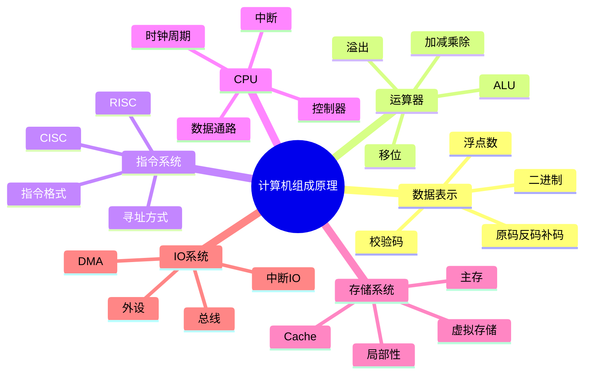
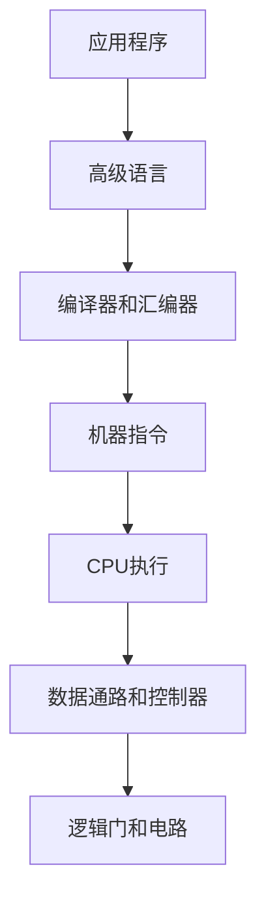
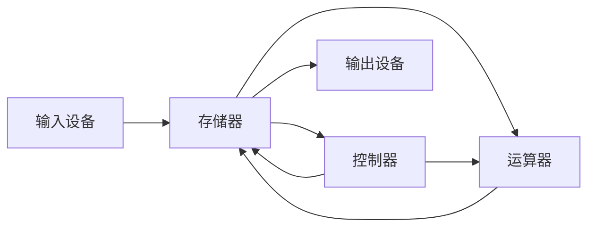

# 00. 计算机组成原理学习路线与知识地图

## 学习目标

读完本章，你应该能回答：

1. 计算机组成原理研究什么？它和操作系统、体系结构有什么关系？
2. 一条程序语句如何变成 CPU 执行的指令？
3. CPU、内存、总线、I/O、Cache、指令系统之间如何协作？
4. 学习计算机组成原理应该按什么顺序展开？

## 一句话总纲

计算机组成原理研究的是：**计算机硬件系统如何表示数据、执行指令、组织存储、连接设备，并在性能、成本、功耗和可靠性之间做权衡。**

> 记忆口诀：**数据怎么表示，指令怎么执行，CPU 怎么控制，内存怎么分层，设备怎么通信。**

## 思维导图



## 1. 计算机系统的层次



计算机组成原理主要关注机器指令往下的层次：

- 数据如何编码。
- 指令如何取出和执行。
- CPU 内部如何传递数据。
- 存储器如何和 CPU 配合。
- I/O 设备如何通信。

## 2. 冯·诺依曼结构

经典计算机结构包括五大部件：



核心思想：

1. 程序和数据都存放在存储器中。
2. 指令按地址顺序存放，通常顺序执行，也可跳转。
3. CPU 取指、译码、执行，控制其他部件工作。

## 3. 一条程序如何运行？


例子：

```c
int c = a + b;
```

底层大致会变成：

```text
从内存或寄存器取 a
从内存或寄存器取 b
ALU 做加法
结果写回寄存器或内存
```

## 4. 学习路线


建议章节：

1. 数据表示与编码。
2. 运算器与算术逻辑运算。
3. 指令系统与寻址方式。
4. CPU 数据通路与控制器。
5. 流水线与并行优化。
6. 存储层次结构。
7. 总线、I/O 与中断。
8. 性能、可靠性与校验。
9. 面试 50 问。

## 5. 和其他课程的关系

| 课程 | 关注点 | 与组成原理关系 |
| --- | --- | --- |
| 数据结构 | 数据如何组织 | 更偏软件抽象 |
| 操作系统 | 如何管理硬件资源 | 建立在硬件机制上 |
| 计算机网络 | 计算机间通信 | 依赖 I/O、DMA、中断等基础 |
| 编译原理 | 源码如何变机器码 | 目标是指令系统 |
| 体系结构 | 指令集和硬件设计权衡 | 比组成原理更偏设计空间 |

## 6. 核心问题清单

学习时反复问自己：

1. 这个信息在硬件里如何编码？
2. 这个操作由哪个部件完成？
3. 数据从哪里来，到哪里去？
4. 控制信号是谁发出的？
5. 访问内存为什么慢？如何隐藏延迟？
6. 并行执行为什么会有冲突？
7. 外设比 CPU 慢很多，如何协同？

## 7. 学习自检

1. 冯·诺依曼结构的核心思想是什么？
2. CPU 执行指令通常经历哪几个阶段？
3. 计算机组成原理和操作系统有什么关系？
4. 为什么存储系统要分层？
5. 为什么中断对 I/O 很重要？

## 8. 总结

计算机组成原理可以压缩成一条主线：


只要抓住“数据表示、指令执行、存储访问、设备通信”四个核心，就能把零散知识串成整体。
