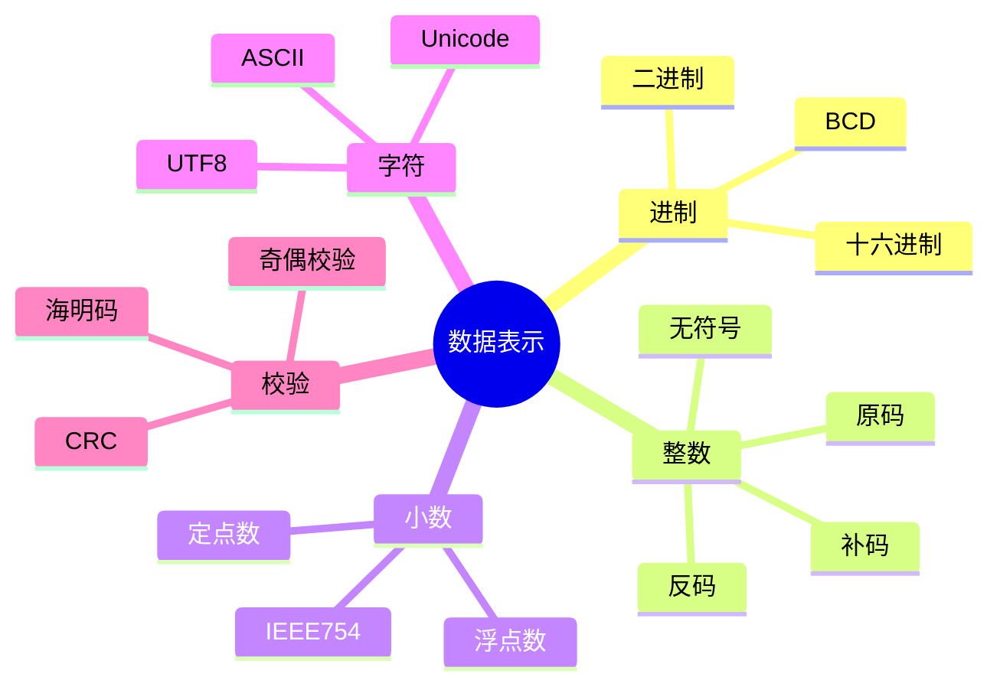
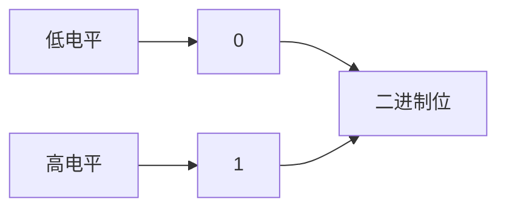
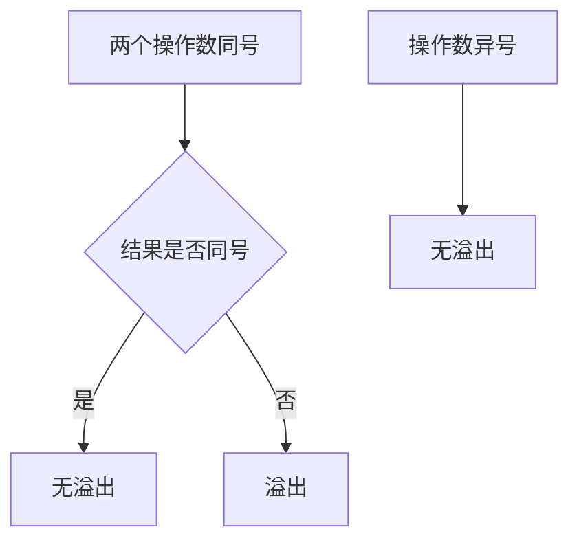
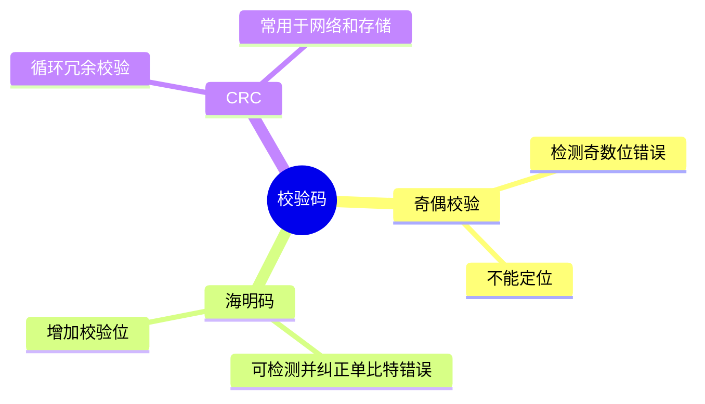

# 01. 数据表示与编码

## 学习目标

读完本章，你应该能回答：

1. 为什么计算机使用二进制？
2. 原码、反码、补码分别是什么？为什么现代计算机普遍使用补码？
3. 定点数和浮点数有什么区别？
4. IEEE 754 浮点数如何表示？为什么会有精度误差？
5. 奇偶校验、海明码、CRC 分别解决什么问题？

## 一句话总纲

计算机中的所有信息最终都是二进制位。数据表示的核心是：**用有限位数编码整数、小数、字符和校验信息，并理解这种编码带来的范围、精度和溢出问题。**

> 记忆口诀：**位数决定范围，编码决定解释，补码统一加减，浮点牺牲精确换范围。**

## 思维导图



## 1. 为什么使用二进制？

硬件电路最容易区分两种稳定状态：高电平和低电平。因此二进制天然适合数字电路。



二进制优势：

- 电路实现简单。
- 抗干扰能力强。
- 逻辑运算自然。
- 可用布尔代数分析。

## 2. 无符号整数

n 位无符号整数表示范围：

```text
0 到 2^n - 1
```

例如 8 位无符号整数：

```text
00000000 = 0
11111111 = 255
```

## 3. 原码、反码、补码

### 原码

最高位表示符号，0 正 1 负，剩下的数值位表示绝对值。

问题：有 +0 和 -0，加减法处理麻烦。

### 反码

正数不变，负数在原码基础上符号位不变，数值位取反。

仍然有 +0 和 -0。

### 补码

正数不变，负数补码 = 反码 + 1。

补码优势：

- 只有一个 0。
- 加法和减法可以统一用加法器完成。
- 符号位可以参与运算。


## 4. 补码例子

用 8 位表示 `-5`：

```text
+5 = 00000101
取反 = 11111010
加1 = 11111011
所以 -5 的补码是 11111011
```

验证 `5 + (-5)`：

```text
00000101
11111011
--------
00000000  忽略最高进位
```

## 5. 补码范围

n 位补码表示范围：

```text
-2^(n-1) 到 2^(n-1)-1
```

8 位补码：

```text
-128 到 127
```

为什么负数多一个？因为 0 只占一个编码，最高负数 `10000000` 没有对应正数。

## 6. 溢出

溢出是计算结果超出可表示范围。

补码加法溢出判断：

- 两个正数相加结果为负：溢出。
- 两个负数相加结果为正：溢出。
- 一正一负相加不会溢出。



## 7. 定点数与浮点数

| 类型 | 小数点位置 | 特点 |
| --- | --- | --- |
| 定点数 | 固定 | 实现简单，范围有限 |
| 浮点数 | 可移动 | 范围大，有精度误差 |

浮点数类似科学计数法：

```text
value = sign × significand × base^exponent
```

## 8. IEEE 754 单精度浮点数

32 位 float：


组成：

- 1 位符号位。
- 8 位指数位，使用偏置表示。
- 23 位尾数位，规格化数默认隐藏最高位 1。

直觉：

```text
符号决定正负
指数决定数量级
尾数决定有效精度
```

## 9. 浮点误差

十进制小数如 `0.1` 在二进制中可能是无限循环小数，因此无法精确表示。

```text
0.1 + 0.2 != 精确的 0.3
```

浮点数适合近似计算，不适合直接用 `==` 比较。

比较方式：

```text
abs(a - b) < eps
```

## 10. 字符编码

| 编码 | 说明 |
| --- | --- |
| ASCII | 早期英文字符编码，7 位常用 |
| Unicode | 字符集，给字符分配码点 |
| UTF-8 | Unicode 的变长编码方式，兼容 ASCII |

UTF-8 特点：

- 英文通常 1 字节。
- 中文通常 3 字节。
- 变长编码节省空间且兼容 ASCII。

## 11. 校验码

数据传输和存储可能出错，需要校验。



### 奇偶校验

增加一位校验位，使 1 的个数为奇数或偶数。

只能检测奇数位错误，不能定位错误。

### 海明码

通过多个校验位覆盖不同位置，可以定位并纠正单比特错误。

### CRC

把数据看作多项式，用生成多项式做模 2 除法得到校验码。网络帧和存储设备常用 CRC 检错。

## 12. 常见坑

| 坑 | 说明 |
| --- | --- |
| 把补码当原码读 | 负数解释会错 |
| 忽略整数溢出 | C/C++ 有符号溢出尤其危险 |
| 浮点数直接比较 | 精度误差导致错误 |
| 字符数等于字节数 | UTF-8 中文多字节 |
| 校验码能防篡改 | 普通校验码不是密码学认证 |

## 13. 学习自检

1. 为什么补码能统一加法和减法？
2. 8 位补码的范围是多少？为什么不是 -127 到 127？
3. 如何判断补码加法溢出？
4. 为什么浮点数有精度误差？
5. 奇偶校验和海明码有什么区别？
