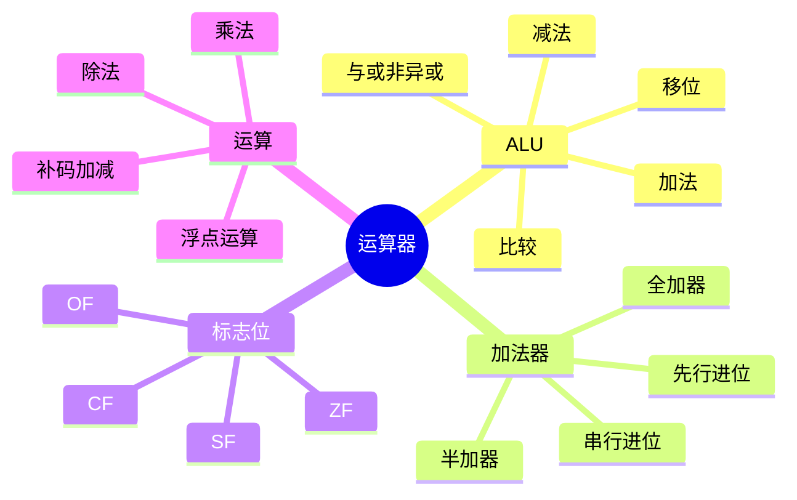
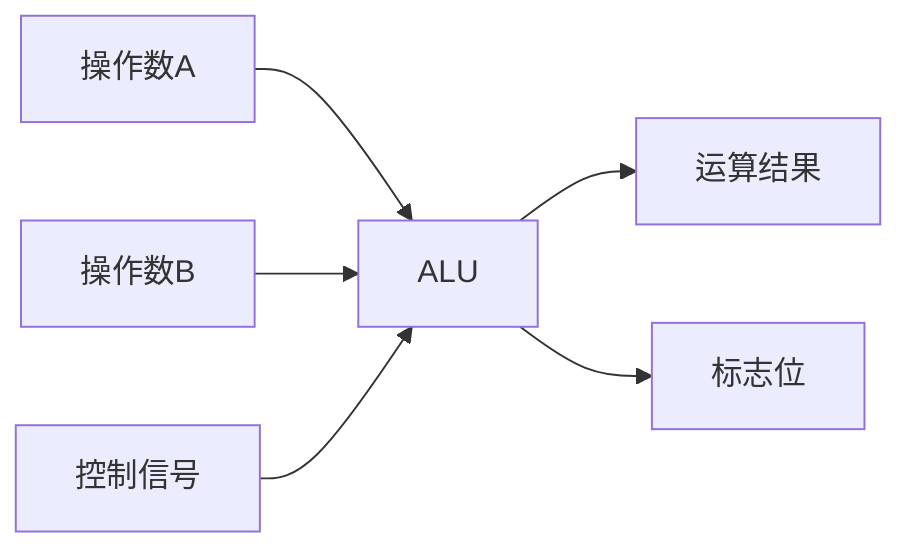
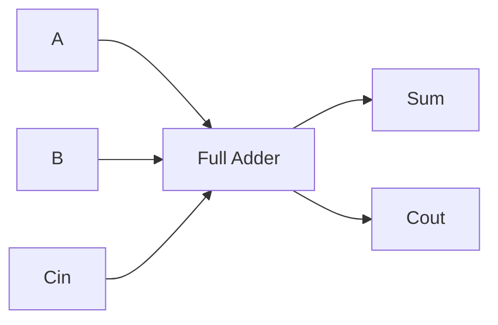
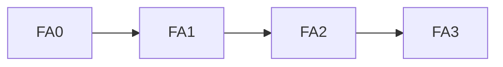
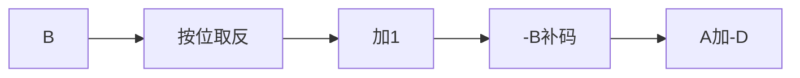
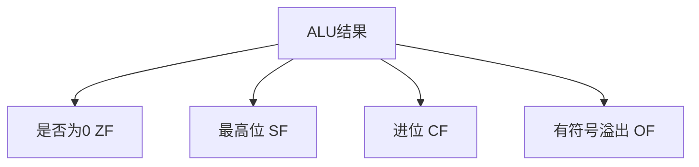
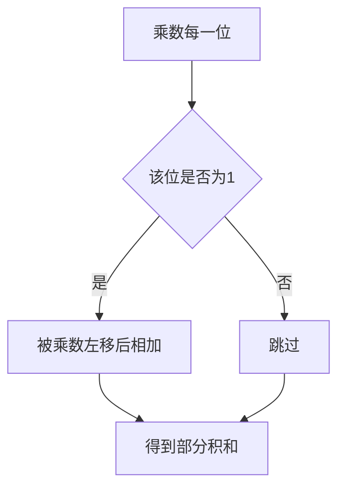

# 02. 运算器与算术逻辑运算

## 学习目标

读完本章，你应该能回答：

1. ALU 是什么？能执行哪些操作？
2. 加法器如何由逻辑门构成？
3. 补码减法为什么可以转化为加法？
4. 移位运算、乘法、除法在硬件中如何理解？
5. 标志位 Zero、Carry、Overflow、Sign 分别表示什么？

## 一句话总纲

运算器的核心是 ALU，它通过组合逻辑完成加减、逻辑、移位和比较等操作；复杂运算可以分解为更基本的数据通路操作。

> 记忆口诀：**ALU 做运算，寄存器放数据，标志位记结果特征。**

## 思维导图



## 1. ALU 的作用

ALU，Arithmetic Logic Unit，算术逻辑单元，用于执行：

- 加法、减法。
- 与、或、非、异或。
- 左移、右移。
- 比较。
- 生成状态标志。



## 2. 半加器和全加器

半加器输入两个 bit，输出 sum 和 carry。

```text
sum = A xor B
carry = A and B
```

全加器多一个输入进位 `Cin`：

```text
sum = A xor B xor Cin
Cout = majority(A, B, Cin)
```



多位加法器由多个全加器连接而成。

## 3. 串行进位与先行进位

串行进位加法器简单，但每一位要等低位进位传来。



先行进位加法器通过提前计算进位生成和传递信号，加快进位计算。

权衡：速度更快，但电路更复杂。

## 4. 补码加减法

补码减法：

```text
A - B = A + (-B)
```

而 `-B` 的补码可以通过 B 取反加 1 得到。



因此硬件可以复用加法器做减法。

## 5. 标志位

| 标志位 | 含义 | 常见用途 |
| --- | --- | --- |
| ZF | Zero Flag，结果是否为 0 | 相等判断 |
| CF | Carry Flag，无符号进位或借位 | 无符号溢出 |
| OF | Overflow Flag，有符号溢出 | 补码溢出 |
| SF | Sign Flag，结果符号位 | 正负判断 |



## 6. 移位运算

| 类型 | 说明 |
| --- | --- |
| 逻辑左移 | 低位补 0，常相当于乘 2 |
| 逻辑右移 | 高位补 0，适合无符号数 |
| 算术右移 | 高位补符号位，适合有符号数 |

```text
00001100 << 1 = 00011000
00001100 >> 1 = 00000110
```

注意：移位可能丢失位，导致溢出或精度损失。

## 7. 乘法硬件直觉

二进制乘法可以看作移位加法。

```text
A * B
检查 B 的每一位
若该位为 1，就把 A 左移对应位后累加
```



## 8. 除法硬件直觉

二进制除法类似手算长除法：比较、减法、移位、产生商位。

常见实现有恢复余数法、非恢复余数法等。

## 9. 浮点运算流程

浮点加法通常需要：


浮点乘法通常需要：

```text
符号位异或
阶码相加并修正偏置
尾数相乘
规格化和舍入
```

## 10. 常见坑

| 坑 | 说明 |
| --- | --- |
| CF 和 OF 混淆 | CF 看无符号，OF 看有符号 |
| 算术右移和逻辑右移混淆 | 负数右移要保符号 |
| 乘法只看结果 | 硬件通常分解为移位和加法 |
| 浮点加法忽略对阶 | 指数不同必须先对齐 |
| 标志位来源不清 | 标志位来自 ALU 运算结果 |

## 11. 学习自检

1. ALU 的输入输出是什么？
2. 全加器和半加器有什么区别？
3. 为什么补码减法可以用加法器完成？
4. CF 和 OF 分别用于什么判断？
5. 浮点加法为什么要对阶？
