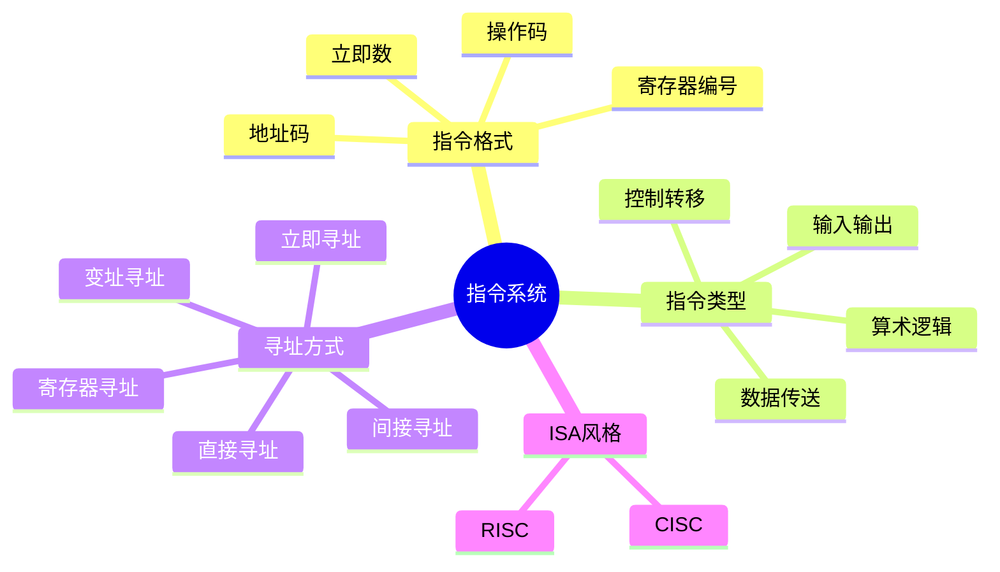
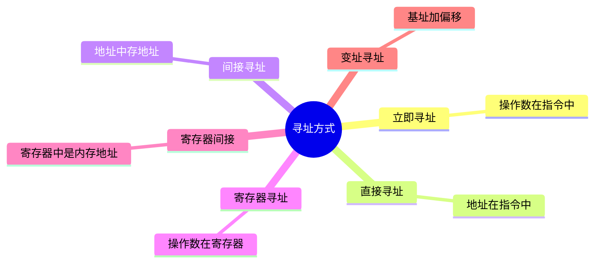
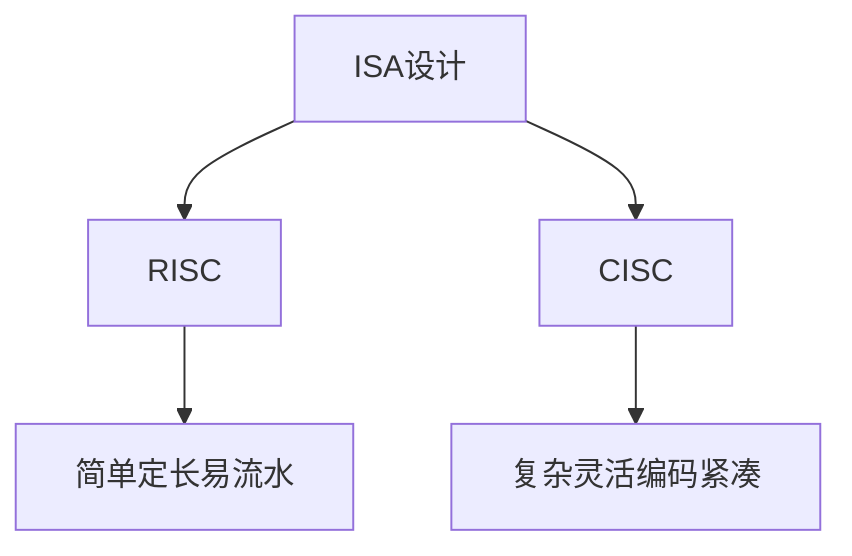

# 03. 指令系统与寻址方式

## 学习目标

读完本章，你应该能回答：

1. 指令系统 ISA 是什么？
2. 一条机器指令通常由哪些字段组成？
3. 操作码、地址码、寻址方式分别解决什么问题？
4. RISC 和 CISC 的核心区别是什么？
5. 为什么指令格式会影响 CPU 设计复杂度？

## 一句话总纲

指令系统是软件和硬件之间的接口：编译器生成指令，CPU 按指令规定执行操作。指令格式决定“做什么、操作数在哪、结果写到哪”。

> 记忆口诀：**操作码说做什么，地址码说找谁，寻址方式说怎么找。**

## 思维导图



## 1. ISA 是什么？

ISA，Instruction Set Architecture，指令集体系结构，是硬件提供给软件的抽象接口。

它规定：

- 有哪些指令。
- 指令格式是什么。
- 有哪些寄存器。
- 支持哪些数据类型。
- 内存寻址方式。
- 异常和中断机制。


同一个 ISA 可以有不同微架构实现，例如不同 CPU 都能兼容同一指令集。

## 2. 指令格式

一条指令通常包含：

```text
操作码 + 操作数字段
```


例子：

```text
ADD R1, R2, R3
含义：R1 = R2 + R3
```

其中：

- `ADD` 是操作码。
- `R1/R2/R3` 是寄存器操作数。

## 3. 指令类型

| 类型 | 作用 | 例子 |
| --- | --- | --- |
| 数据传送 | 寄存器、内存之间移动数据 | LOAD、STORE、MOV |
| 算术逻辑 | 加减、与或、移位 | ADD、SUB、AND、SHL |
| 控制转移 | 改变程序执行流 | JMP、BEQ、CALL、RET |
| 输入输出 | 与外设交互 | IN、OUT 或内存映射 I/O |
| 系统控制 | 特权操作 | 中断返回、页表切换 |

## 4. 寻址方式

寻址方式说明如何得到操作数或操作数地址。



### 立即寻址

操作数直接写在指令里：

```text
ADD R1, R2, #5
```

### 寄存器寻址

操作数在寄存器中：

```text
ADD R1, R2, R3
```

### 直接寻址

指令中给出内存地址：

```text
LOAD R1, [1000]
```

### 变址寻址

有效地址 = 基址寄存器 + 偏移量。

数组访问常用这种思想：

```text
base + index * element_size
```

## 5. 指令执行基本周期


不是所有指令都需要所有阶段。例如寄存器加法通常不需要数据访存阶段。

## 6. 指令长度

| 指令长度 | 特点 |
| --- | --- |
| 定长指令 | 译码简单，取指方便，但编码空间可能浪费 |
| 变长指令 | 编码紧凑，表达灵活，但译码复杂 |

RISC 通常偏定长，CISC 通常支持变长。

## 7. RISC 与 CISC

| 维度 | RISC | CISC |
| --- | --- | --- |
| 指令数量 | 少而简单 | 多而复杂 |
| 指令长度 | 通常定长 | 常变长 |
| 执行周期 | 更容易流水线化 | 指令执行差异大 |
| 访存 | Load/Store 架构常见 | 指令可直接操作内存 |
| 硬件控制 | 相对简单 | 可能更复杂 |



注意：现代处理器内部实现会融合很多思想，不能简单认为 RISC 一定快、CISC 一定慢。

## 8. 指令系统与编译器

编译器要把高级语言翻译成目标 ISA 的指令。


ISA 的寄存器数量、寻址方式、指令类型会影响编译器生成代码的质量。

## 9. 常见坑

| 坑 | 说明 |
| --- | --- |
| ISA 和微架构混淆 | ISA 是接口，微架构是实现 |
| 寻址方式和地址混淆 | 寻址方式描述如何得到操作数 |
| RISC/CISC 绝对化 | 现代 CPU 实现很复杂 |
| 指令执行阶段固定化 | 不同指令可能阶段不同 |
| 立即数当地址 | 立即数是操作数本身 |

## 10. 学习自检

1. ISA 为什么是软硬件接口？
2. 操作码和地址码分别表示什么？
3. 立即寻址和直接寻址有什么区别？
4. 为什么定长指令更容易译码？
5. RISC 为什么更容易流水线化？
