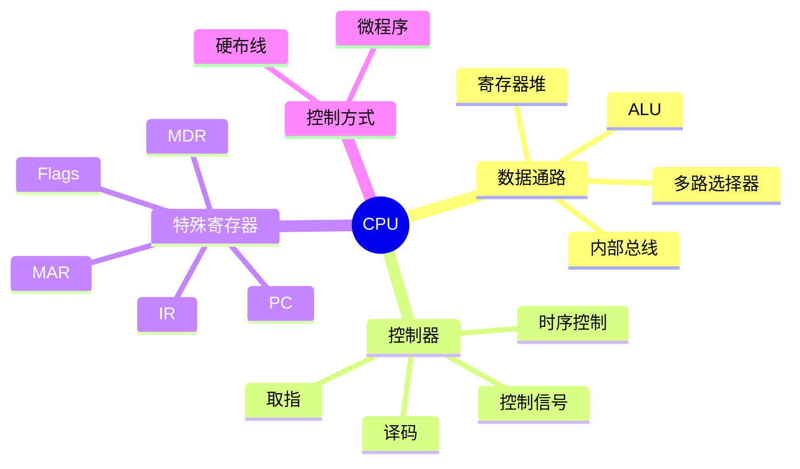
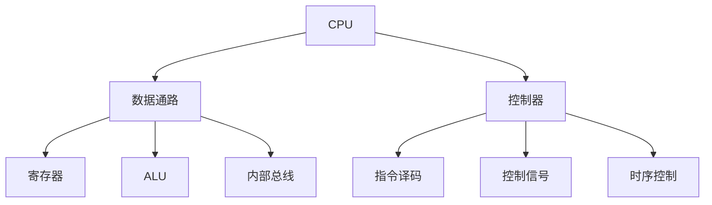
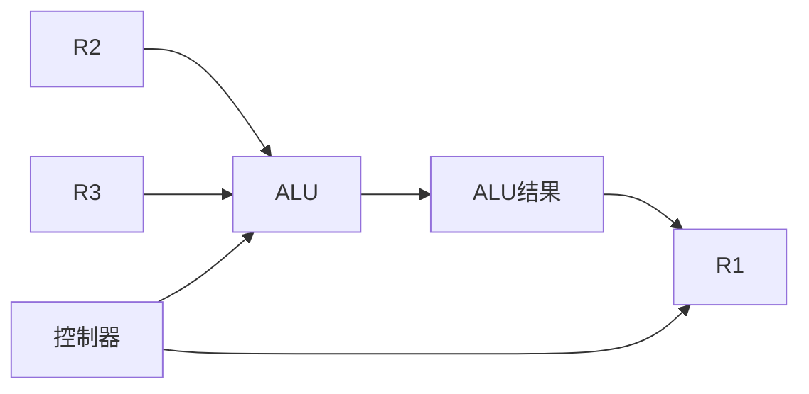
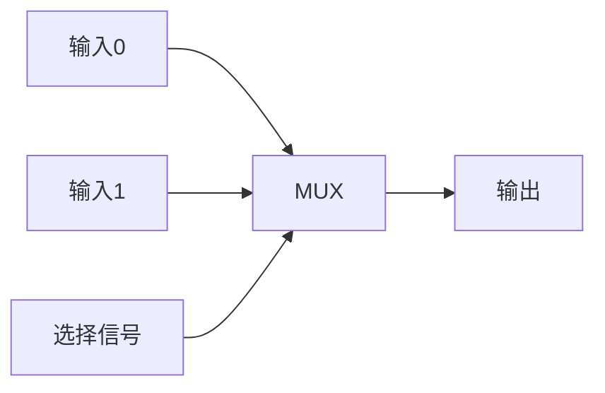
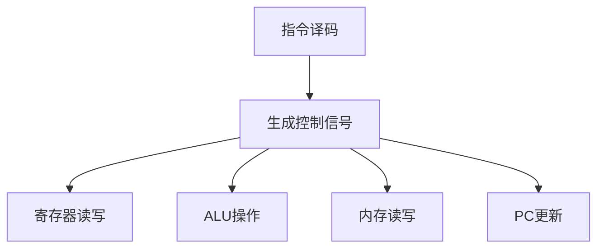
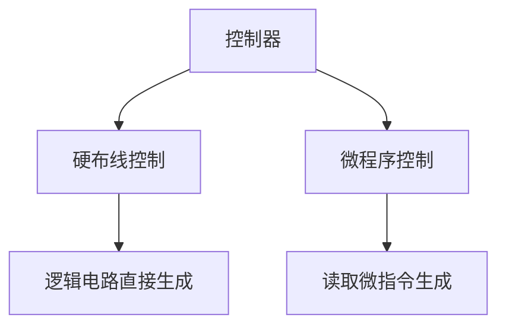

# 04. CPU 数据通路与控制器

## 学习目标

读完本章，你应该能回答：

1. CPU 内部主要由哪些部件组成？
2. PC、IR、MAR、MDR、通用寄存器分别有什么作用？
3. 数据通路和控制器的区别是什么？
4. 一条指令在 CPU 内部如何流动？
5. 硬布线控制和微程序控制有什么区别？

## 一句话总纲

CPU 由数据通路和控制器组成：数据通路负责数据从哪里流向哪里、经过什么运算；控制器负责在正确时刻发出控制信号。

> 记忆口诀：**数据通路搬数据，控制器发命令；寄存器暂存，ALU 运算。**

## 思维导图



## 1. CPU 基本组成



## 2. 常见寄存器

| 寄存器 | 名称 | 作用 |
| --- | --- | --- |
| PC | Program Counter | 保存下一条指令地址 |
| IR | Instruction Register | 保存当前指令 |
| MAR | Memory Address Register | 保存要访问的内存地址 |
| MDR | Memory Data Register | 保存内存读写数据 |
| GPR | General Purpose Register | 通用数据暂存 |
| FLAGS | 状态寄存器 | 保存 ALU 标志位 |

## 3. 取指过程


取指完成后，IR 中保存当前指令，控制器开始译码。

## 4. 执行 `ADD R1,R2,R3`

```text
R1 = R2 + R3
```

数据流：



控制器需要发出：

- 选择 R2、R3 作为 ALU 输入。
- 设置 ALU 操作为加法。
- 允许结果写入 R1。

## 5. 执行 Load 指令

```text
LOAD R1, [addr]
```


Load 指令通常比寄存器加法慢，因为需要访问内存。

## 6. 数据通路组件

### 寄存器堆

保存多个通用寄存器，支持读出源操作数和写入目的寄存器。

### ALU

执行算术逻辑运算。

### 多路选择器 MUX

根据控制信号从多个输入中选择一个。



## 7. 控制信号

控制信号决定：

- 哪个寄存器输出。
- 哪个寄存器写入。
- ALU 执行什么操作。
- 是否读写内存。
- PC 如何更新。
- MUX 选择哪一路输入。



## 8. 硬布线控制与微程序控制

| 控制方式 | 思想 | 优点 | 缺点 |
| --- | --- | --- | --- |
| 硬布线控制 | 用组合逻辑直接产生控制信号 | 快 | 设计修改困难 |
| 微程序控制 | 用微指令序列产生控制信号 | 灵活 | 可能较慢 |



## 9. 时钟周期、机器周期、指令周期

| 概念 | 含义 |
| --- | --- |
| 时钟周期 | CPU 最基本节拍 |
| 机器周期 | 完成一个基本操作所需时间 |
| 指令周期 | 完成一条指令所需时间 |

一条指令通常包含多个阶段，每个阶段可能包含多个时钟周期。

## 10. 常见坑

| 坑 | 说明 |
| --- | --- |
| PC 指向当前还是下一条 | 通常取指后会更新到下一条 |
| MAR/MDR 混淆 | MAR 放地址，MDR 放数据 |
| 数据通路和控制器混淆 | 前者搬和算，后者发控制信号 |
| 所有指令耗时相同 | 不同指令阶段和访存次数不同 |
| 微程序等于软件程序 | 微程序是控制器内部控制序列 |

## 11. 学习自检

1. PC、IR、MAR、MDR 分别保存什么？
2. 数据通路和控制器分别负责什么？
3. 执行 ADD 指令需要哪些控制信号？
4. Load 指令为什么通常比寄存器运算慢？
5. 硬布线控制和微程序控制如何取舍？
