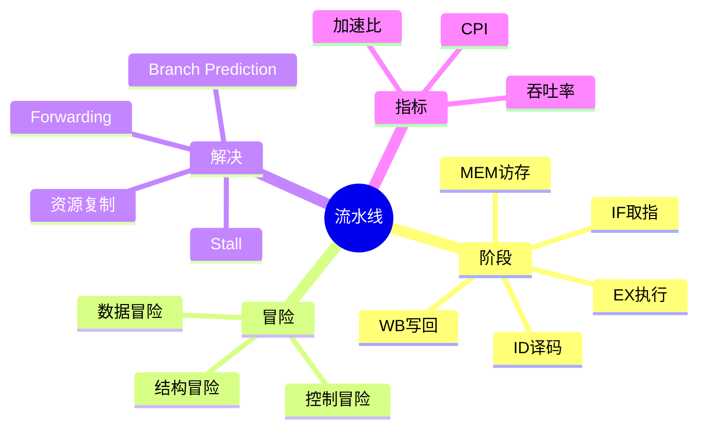
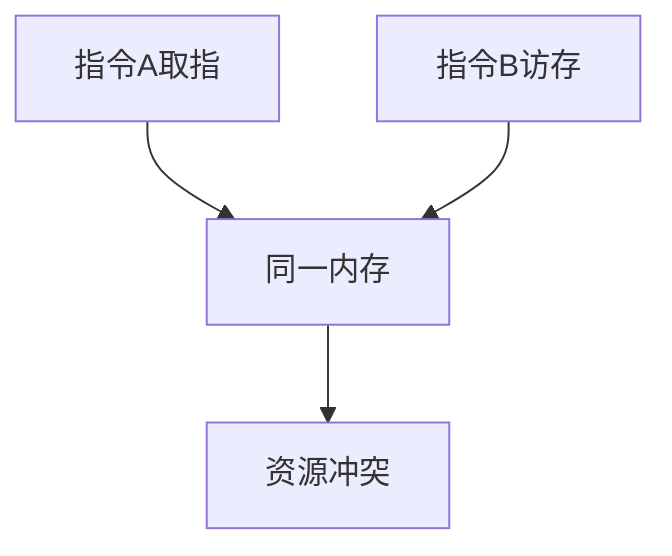
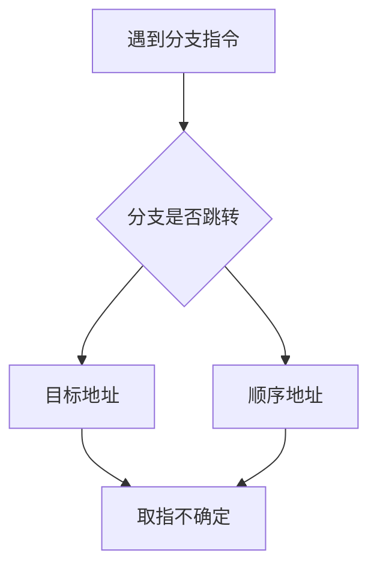
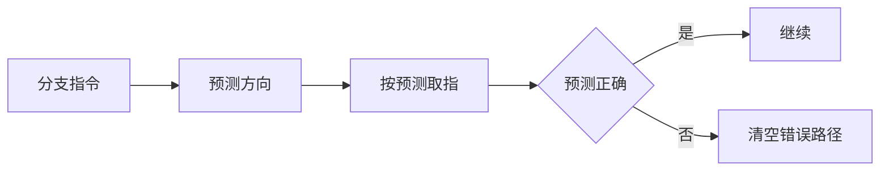
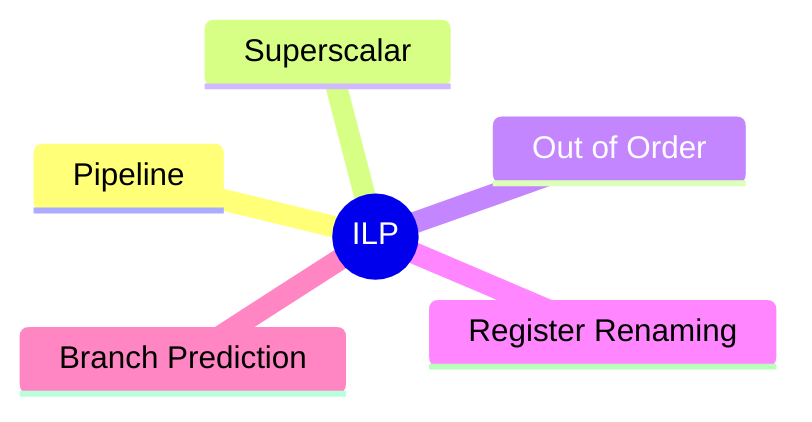

# 05. 流水线与指令级并行

## 学习目标

读完本章，你应该能回答：

1. 指令流水线为什么能提高吞吐率？
2. 经典五级流水线包含哪些阶段？
3. 结构冒险、数据冒险、控制冒险分别是什么？
4. 转发、暂停、分支预测分别解决什么问题？
5. 吞吐率、加速比、CPI 如何理解？

## 一句话总纲

流水线把一条指令的执行拆成多个阶段，让多条指令在不同阶段重叠执行，从而提高吞吐率；但重叠执行会带来资源、数据和控制冲突。

> 记忆口诀：**流水线提吞吐，不减少单条延迟；冒险不处理，结果就会错。**

## 思维导图



## 1. 为什么需要流水线？

如果每条指令都完整执行完再执行下一条，硬件部件会有大量空闲。

流水线让不同指令同时使用不同部件：


多条指令重叠：

```text
周期1: I1 IF
周期2: I1 ID, I2 IF
周期3: I1 EX, I2 ID, I3 IF
```

## 2. 经典五级流水线


| 阶段 | 作用 |
| --- | --- |
| IF | 根据 PC 取指令 |
| ID | 译码并读取寄存器 |
| EX | ALU 运算或地址计算 |
| MEM | 访问数据内存 |
| WB | 写回寄存器 |

## 3. 流水线提高什么？

流水线主要提高吞吐率，而不是单条指令延迟。

| 指标 | 含义 |
| --- | --- |
| 延迟 | 单条指令从开始到结束的时间 |
| 吞吐率 | 单位时间完成多少指令 |
| CPI | 平均每条指令需要多少时钟周期 |

理想五级流水线稳定后，接近每周期完成一条指令，CPI 接近 1。

## 4. 结构冒险

结构冒险是多条指令同时争用同一硬件资源。

例如取指和访存都需要同一个内存端口。



解决：

- 增加资源。
- 分离指令 Cache 和数据 Cache。
- 暂停流水线。

## 5. 数据冒险

数据冒险是后续指令依赖前一条指令结果，但结果还没写回。

```text
ADD R1, R2, R3
SUB R4, R1, R5
```

`SUB` 需要 `R1`，但 `ADD` 还没写回。


解决：

- 转发 Forwarding。
- 插入气泡 Stall。
- 编译器重排指令。

## 6. 转发 Forwarding

转发把前一阶段刚算出的结果直接送给后续指令使用，而不等写回寄存器。


转发能解决很多 RAW 相关，但不是所有情况都能解决，例如 load-use 冒险通常仍可能需要暂停。

## 7. 控制冒险

控制冒险来自分支和跳转。CPU 不知道下一条应该取哪条指令。



解决：

- 分支预测。
- 延迟分支。
- 提前计算分支条件。
- 错误预测后清空流水线。

## 8. 分支预测

分支预测猜测分支方向和目标地址，提高流水线连续性。



现代 CPU 会使用复杂动态预测器，但基本思想是用历史行为预测未来。

## 9. 指令级并行 ILP

ILP，Instruction-Level Parallelism，指在指令之间寻找可并行执行的机会。

常见技术：

- 流水线。
- 超标量。
- 乱序执行。
- 寄存器重命名。
- 分支预测。



## 10. 常见坑

| 坑 | 说明 |
| --- | --- |
| 认为流水线减少单条指令延迟 | 主要提升吞吐率 |
| 忽略冒险 | 实际 CPI 会大于 1 |
| 数据冒险只看相邻指令 | 多条距离内也可能相关 |
| 分支预测一定正确 | 错误预测会清空流水线 |
| 结构冒险和数据冒险混淆 | 一个是资源冲突，一个是依赖冲突 |

## 11. 学习自检

1. 五级流水线每级做什么？
2. 流水线提高吞吐率还是降低延迟？
3. 三类冒险分别是什么？
4. Forwarding 解决哪类问题？
5. 分支预测失败会发生什么？
